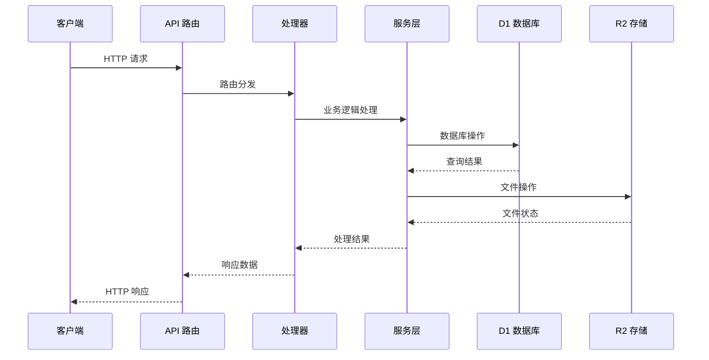
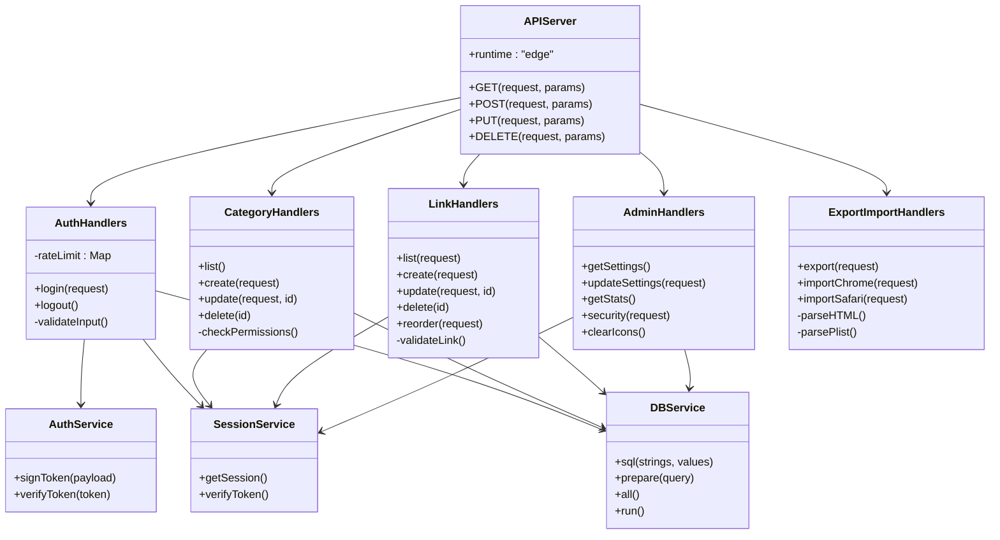
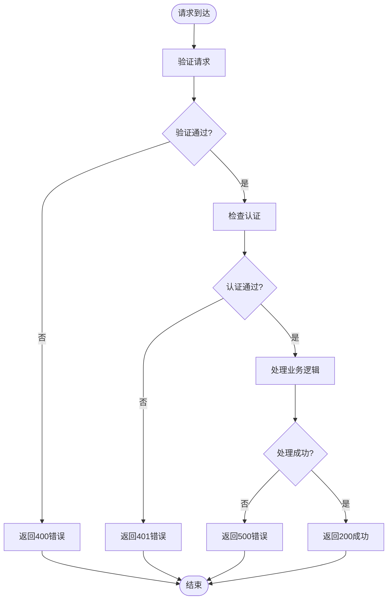

# API接口文档

<cite>
**本文档引用的文件**
- [src/app/api/[...path]/route.ts](file://src/app/api/[...path]/route.ts)
- [src/app/api/icons/[...path]/route.ts](file://src/app/api/icons/[...path]/route.ts)
- [src/lib/api-handlers/auth.ts](file://src/lib/api-handlers/auth.ts)
- [src/lib/api-handlers/categories.ts](file://src/lib/api-handlers/categories.ts)
- [src/lib/api-handlers/links.ts](file://src/lib/api-handlers/links.ts)
- [src/lib/api-handlers/admin.ts](file://src/lib/api-handlers/admin.ts)
- [src/lib/api-handlers/export-import.ts](file://src/lib/api-handlers/export-import.ts)
- [src/lib/api-handlers/metadata.ts](file://src/lib/api-handlers/metadata.ts)
- [src/lib/api-handlers/setup.ts](file://src/lib/api-handlers/setup.ts)
- [src/lib/auth.ts](file://src/lib/auth.ts)
- [src/lib/session.ts](file://src/lib/session.ts)
- [src/lib/db.ts](file://src/lib/db.ts)
- [src/middleware.ts](file://src/middleware.ts)
- [src/lib/r2.ts](file://src/lib/r2.ts)
</cite>

## 目录
1. [简介](#简介)
2. [项目结构](#项目结构)
3. [核心组件](#核心组件)
4. [架构概览](#架构概览)
5. [详细组件分析](#详细组件分析)
6. [依赖关系分析](#依赖关系分析)
7. [性能考虑](#性能考虑)
8. [故障排除指南](#故障排除指南)
9. [结论](#结论)
10. [附录](#附录)

## 简介
本项目是一个基于 Next.js App Router 的导航网站管理系统，提供 REST API 接口用于管理书签分类和链接。系统采用 Cloudflare Pages + D1 + R2 的无服务器架构，支持 Edge Runtime 部署。

## 项目结构
API 接口采用 App Router 的动态路由模式，通过单一入口路由文件分发到不同的处理器模块：

```mermaid
graph TB
subgraph "API 路由层"
APIRoute[API 路由入口<br/>src/app/api/[...path]/route.ts]
IconsRoute[图标路由<br/>src/app/api/icons/[...path]/route.ts]
end
subgraph "处理器层"
AuthHandlers[认证处理器<br/>auth.ts]
CategoryHandlers[分类处理器<br/>categories.ts]
LinkHandlers[链接处理器<br/>links.ts]
AdminHandlers[管理员处理器<br/>admin.ts]
ExportHandlers[导入导出处理器<br/>export-import.ts]
MetaHandlers[元数据处理器<br/>metadata.ts]
SetupHandlers[设置处理器<br/>setup.ts]
end
subgraph "服务层"
AuthService[认证服务<br/>auth.ts]
SessionService[会话服务<br/>session.ts]
DBService[数据库服务<br/>db.ts]
R2Service[R2存储服务<br/>r2.ts]
end
APIRoute --> AuthHandlers
APIRoute --> CategoryHandlers
APIRoute --> LinkHandlers
APIRoute --> AdminHandlers
APIRoute --> ExportHandlers
APIRoute --> MetaHandlers
APIRoute --> SetupHandlers
IconsRoute --> R2Service
AuthHandlers --> AuthService
AuthHandlers --> SessionService
AuthHandlers --> DBService
CategoryHandlers --> SessionService
CategoryHandlers --> DBService
LinkHandlers --> SessionService
LinkHandlers --> DBService
AdminHandlers --> SessionService
AdminHandlers --> DBService
ExportHandlers --> SessionService
ExportHandlers --> DBService
```

**图表来源**
- [src/app/api/[...path]/route.ts](file://src/app/api/[...path]/route.ts#L1-L147)
- [src/app/api/icons/[...path]/route.ts](file://src/app/api/icons/[...path]/route.ts#L1-L37)

**章节来源**
- [src/app/api/[...path]/route.ts](file://src/app/api/[...path]/route.ts#L1-L147)
- [src/app/api/icons/[...path]/route.ts](file://src/app/api/icons/[...path]/route.ts#L1-L37)

## 核心组件
系统的核心组件包括认证、会话管理、数据库访问和文件存储服务：

### 认证与会话
- **JWT Token 签发与验证**：使用 HS256 算法，24小时有效期
- **Cookie 管理**：httpOnly、secure、sameSite=strict 配置
- **IP 限流**：10分钟内最多20次尝试

### 数据库访问
- **D1 兼容层**：支持 Cloudflare Pages Edge Runtime
- **SQL 构建器**：模板字符串 + 参数绑定防止注入
- **本地回退**：开发环境支持 SQLite

### 文件存储
- **R2 对象存储**：图标文件存储
- **AWS Signature V4**：边缘运行时的 S3 兼容签名
- **缓存支持**：ETag 和 HTTP 元数据

**章节来源**
- [src/lib/auth.ts](file://src/lib/auth.ts#L1-L23)
- [src/lib/session.ts](file://src/lib/session.ts#L1-L14)
- [src/lib/db.ts](file://src/lib/db.ts#L1-L69)
- [src/lib/r2.ts](file://src/lib/r2.ts#L1-L103)

## 架构概览
系统采用分层架构，API 层负责路由分发，处理器层处理业务逻辑，服务层提供基础设施能力：



**图表来源**
- [src/app/api/[...path]/route.ts](file://src/app/api/[...path]/route.ts#L12-L146)
- [src/lib/api-handlers/auth.ts](file://src/lib/api-handlers/auth.ts#L48-L140)

## 详细组件分析

### 认证接口
提供用户登录和登出功能，使用 JWT 令牌进行身份验证。

#### 登录接口
- **方法**: POST
- **路径**: `/api/auth/login`
- **请求体**:
  ```json
  {
    "email": "string",
    "password": "string"
  }
  ```
- **响应体**:
  ```json
  {
    "success": true,
    "token": "string",
    "user": {
      "id": 1,
      "email": "string",
      "role": "string"
    }
  }
  ```

#### 登出接口
- **方法**: POST  
- **路径**: `/api/auth/logout`
- **响应体**:
  ```json
  {
    "success": true,
    "message": "Logged out successfully"
  }
  ```

**章节来源**
- [src/lib/api-handlers/auth.ts](file://src/lib/api-handlers/auth.ts#L48-L140)

### 分类管理接口
提供分类的 CRUD 操作，仅管理员可访问。

#### 获取分类列表
- **方法**: GET
- **路径**: `/api/categories`
- **响应体**:
  ```json
  {
    "success": true,
    "data": [
      {
        "id": 1,
        "name": "string",
        "icon": "string",
        "parent_id": 1,
        "user_id": 1,
        "sort_order": 0,
        "created_at": "timestamp",
        "updated_at": "timestamp"
      }
    ]
  }
  ```

#### 创建分类
- **方法**: POST
- **路径**: `/api/categories`
- **请求体**:
  ```json
  {
    "name": "string",
    "icon": "string",
    "parent_id": 1,
    "sort_order": 0
  }
  ```

#### 更新分类
- **方法**: PUT
- **路径**: `/api/categories/{id}`
- **参数**: `id` (路径参数)

#### 删除分类
- **方法**: DELETE
- **路径**: `/api/categories/{id}`

**章节来源**
- [src/lib/api-handlers/categories.ts](file://src/lib/api-handlers/categories.ts#L17-L199)

### 链接管理接口
提供链接的 CRUD 操作和重新排序功能。

#### 获取链接列表
- **方法**: GET
- **路径**: `/api/links`
- **查询参数**:
  - `category`: 分类ID
  - `search`: 搜索关键词
  - `page`: 页码 (默认1)
  - `limit`: 每页数量 (默认20)

#### 创建链接
- **方法**: POST
- **路径**: `/api/links`
- **请求体**:
  ```json
  {
    "title": "string",
    "url": "string",
    "description": "string",
    "categoryId": 1,
    "icon": "string",
    "icon_orig": "string",
    "sort_order": 0,
    "is_recommended": true
  }
  ```

#### 更新链接
- **方法**: PUT
- **路径**: `/api/links/{id}`

#### 删除链接
- **方法**: DELETE
- **路径**: `/api/links/{id}`

#### 重新排序
- **方法**: PUT
- **路径**: `/api/links/reorder`
- **请求体**:
  ```json
  {
    "linkIds": [1, 2, 3]
  }
  ```

**章节来源**
- [src/lib/api-handlers/links.ts](file://src/lib/api-handlers/links.ts#L25-L270)

### 管理员接口
提供系统管理和配置功能。

#### 获取设置
- **方法**: GET
- **路径**: `/api/admin/settings`

#### 更新设置
- **方法**: PUT
- **路径**: `/api/admin/settings`
- **请求体**:
  ```json
  {
    "accessKeyId": "string",
    "secretAccessKey": "string",
    "bucket": "string",
    "endpoint": "string",
    "publicBase": "string",
    "iconMaxKB": 1024,
    "iconMaxSize": 256
  }
  ```

#### 获取统计信息
- **方法**: GET
- **路径**: `/api/admin/stats`

#### 安全设置
- **方法**: POST
- **路径**: `/api/admin/security`
- **请求体**:
  ```json
  {
    "currentPassword": "string",
    "newEmail": "string",
    "newPassword": "string"
  }
  ```

#### 清除图标
- **方法**: POST
- **路径**: `/api/admin/icons/clear`

**章节来源**
- [src/lib/api-handlers/admin.ts](file://src/lib/api-handlers/admin.ts#L9-L159)

### 导入导出接口
提供书签数据的导入导出功能。

#### 导出数据
- **方法**: GET
- **路径**: `/api/export`
- **查询参数**:
  - `format`: json 或 html (默认json)

#### 导入 Chrome 书签
- **方法**: POST
- **路径**: `/api/import/chrome`
- **内容类型**: multipart/form-data
- **表单字段**:
  - `file`: HTML 文件
  - `categoryId`: 默认分类ID

#### 导入 Safari 书签
- **方法**: POST
- **路径**: `/api/import/safari`
- **内容类型**: multipart/form-data
- **表单字段**:
  - `file`: plist 文件
  - `categoryId`: 默认分类ID

**章节来源**
- [src/lib/api-handlers/export-import.ts](file://src/lib/api-handlers/export-import.ts#L7-L334)

### 图标接口
提供图标文件的访问功能。

#### 获取图标
- **方法**: GET
- **路径**: `/api/icons/{filename}`
- **响应**: 图标文件内容，支持 ETag 缓存

**章节来源**
- [src/app/api/icons/[...path]/route.ts](file://src/app/api/icons/[...path]/route.ts#L1-L37)

### 元数据接口
提供网页元数据抓取功能。

#### 抓取元数据
- **方法**: POST
- **路径**: `/api/fetch-metadata`
- **请求体**:
  ```json
  {
    "url": "string"
  }
  ```

**章节来源**
- [src/lib/api-handlers/metadata.ts](file://src/lib/api-handlers/metadata.ts#L1-L200)

## 依赖关系分析



**图表来源**
- [src/app/api/[...path]/route.ts](file://src/app/api/[...path]/route.ts#L1-L147)
- [src/lib/api-handlers/auth.ts](file://src/lib/api-handlers/auth.ts#L48-L140)
- [src/lib/api-handlers/categories.ts](file://src/lib/api-handlers/categories.ts#L17-L199)
- [src/lib/api-handlers/links.ts](file://src/lib/api-handlers/links.ts#L25-L270)
- [src/lib/api-handlers/admin.ts](file://src/lib/api-handlers/admin.ts#L9-L159)
- [src/lib/api-handlers/export-import.ts](file://src/lib/api-handlers/export-import.ts#L7-L334)

**章节来源**
- [src/app/api/[...path]/route.ts](file://src/app/api/[...path]/route.ts#L1-L147)
- [src/lib/db.ts](file://src/lib/db.ts#L1-L69)

## 性能考虑

### 缓存策略
- **Edge 缓存**: 使用 ETag 支持 HTTP 缓存
- **数据库查询**: 合理使用索引和 LIMIT 限制结果集
- **文件存储**: R2 提供全球 CDN 加速

### 限流机制
- **IP 限流**: 10分钟内最多20次登录尝试
- **数据库连接**: D1 连接池优化
- **并发控制**: Edge Runtime 并发执行优化

### 优化建议
1. **批量操作**: 使用 `/api/links/reorder` 批量更新排序
2. **分页查询**: 合理设置 `limit` 和 `page` 参数
3. **条件过滤**: 使用 `category` 和 `search` 参数减少数据传输
4. **缓存利用**: 充分利用浏览器和 CDN 缓存机制

## 故障排除指南

### 常见错误码
- **400 Bad Request**: 请求格式错误或参数无效
- **401 Unauthorized**: 未认证或权限不足
- **404 Not Found**: 资源不存在
- **409 Conflict**: 资源冲突（如重复链接）
- **429 Too Many Requests**: 请求过于频繁
- **500 Internal Server Error**: 服务器内部错误

### 调试方法
1. **日志查看**: 检查服务器端控制台输出
2. **网络监控**: 使用浏览器开发者工具查看请求响应
3. **数据库检查**: 验证 D1 数据库连接状态
4. **文件存储**: 确认 R2 存储配置正确

### 错误处理流程



**章节来源**
- [src/lib/api-handlers/auth.ts](file://src/lib/api-handlers/auth.ts#L14-L41)
- [src/lib/api-handlers/categories.ts](file://src/lib/api-handlers/categories.ts#L35-L94)
- [src/lib/api-handlers/links.ts](file://src/lib/api-handlers/links.ts#L69-L140)

## 结论
本 API 接口文档提供了完整的 REST API 规范，包括认证机制、数据模型、错误处理和性能优化建议。系统采用现代化的无服务器架构，支持高并发和全球化部署。建议在生产环境中配置适当的环境变量和安全设置，并定期监控系统性能指标。

## 附录

### 版本信息
- **当前版本**: 1.0
- **API 版本**: v1
- **兼容性**: 向后兼容

### 安全配置
- **JWT 密钥**: 必须在生产环境设置
- **Cookie 安全**: httpOnly、secure、sameSite=strict
- **输入验证**: 使用 Zod 进行严格的数据验证
- **SQL 注入防护**: 使用模板字符串和参数绑定

### 协议特定示例
由于系统部署在 Cloudflare Pages 上，支持以下协议特性：
- **Edge Runtime**: 低延迟全球分发
- **D1 数据库**: 无服务器 SQLite
- **R2 存储**: 对象存储和 CDN 加速
- **Workers**: 边缘计算能力

### 迁移指南
- **从旧版本升级**: 检查数据库模式变更
- **配置迁移**: 更新环境变量和密钥
- **客户端适配**: 确保支持新的响应格式