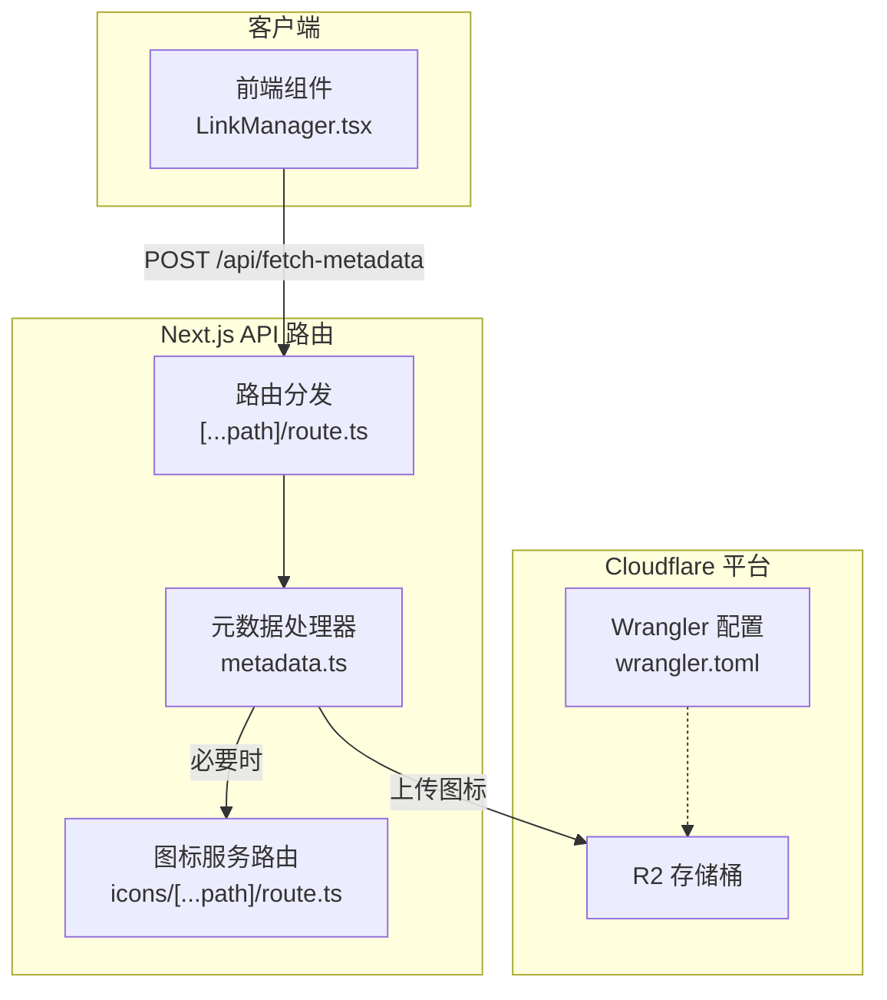
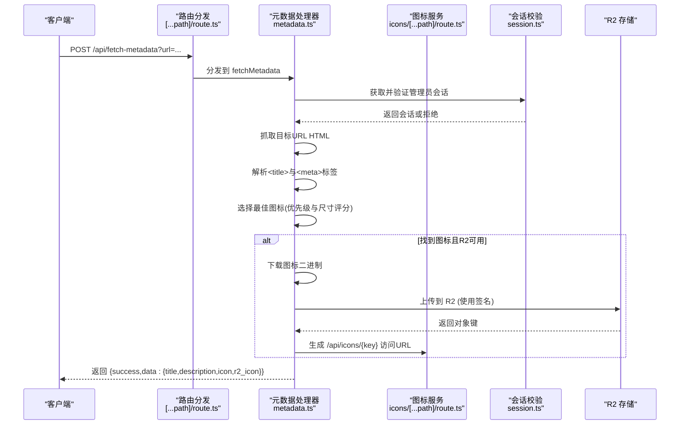
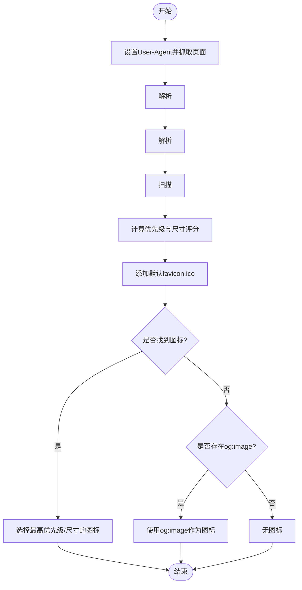
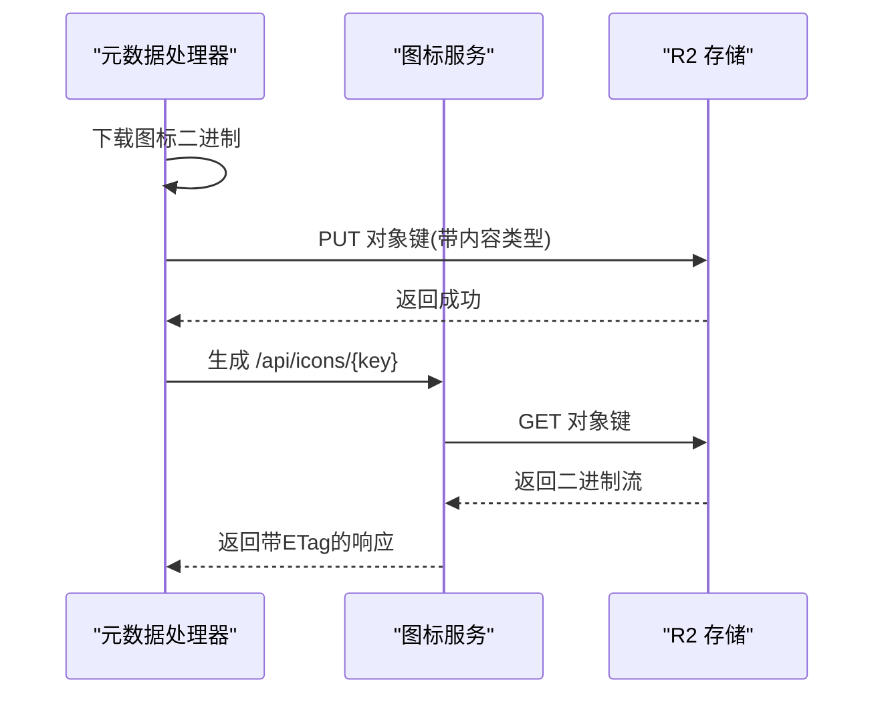
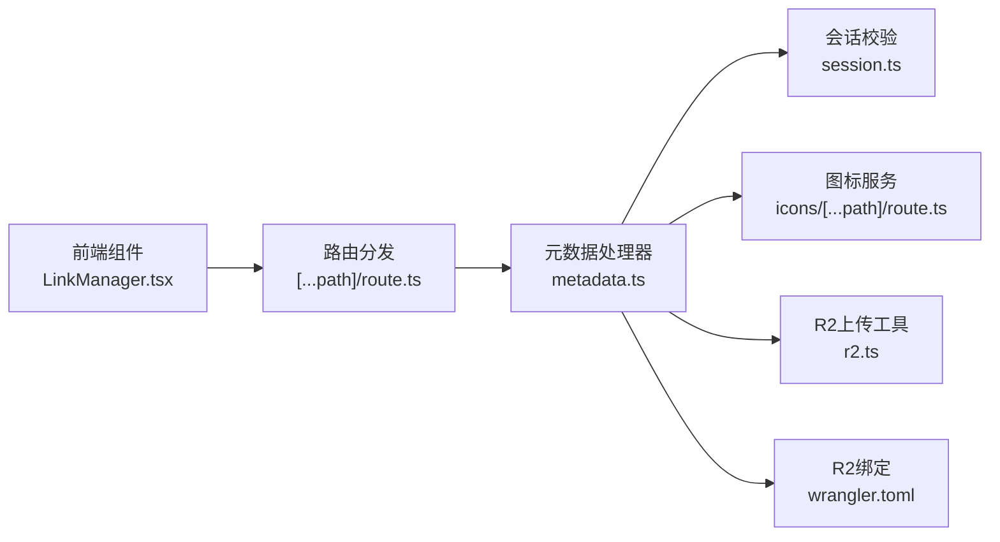

# 元数据接口

<cite>
**本文引用的文件**
- [src/app/api/[...path]/route.ts](file://src/app/api/[...path]/route.ts)
- [src/lib/api-handlers/metadata.ts](file://src/lib/api-handlers/metadata.ts)
- [src/app/api/icons/[...path]/route.ts](file://src/app/api/icons/[...path]/route.ts)
- [src/lib/r2.ts](file://src/lib/r2.ts)
- [src/lib/settings.ts](file://src/lib/settings.ts)
- [src/lib/session.ts](file://src/lib/session.ts)
- [src/components/admin/LinkManager.tsx](file://src/components/admin/LinkManager.tsx)
- [src/types/index.ts](file://src/types/index.ts)
- [wrangler.toml](file://wrangler.toml)
</cite>

## 目录
1. [简介](#简介)
2. [项目结构](#项目结构)
3. [核心组件](#核心组件)
4. [架构总览](#架构总览)
5. [详细组件分析](#详细组件分析)
6. [依赖关系分析](#依赖关系分析)
7. [性能考虑](#性能考虑)
8. [故障排除指南](#故障排除指南)
9. [结论](#结论)

## 简介
本文件为“元数据抓取接口”的完整API文档，覆盖以下内容：
- 接口的HTTP方法与URL模式
- 请求与响应格式
- 标题、描述、缩略图等元数据的提取算法
- 缓存策略与图标上传到Cloudflare R2的流程
- 前端调用示例、错误处理与重试建议
- 网络请求优化、超时处理与代理配置说明

该接口用于从目标网页中自动提取标题、描述与图标，并可选地将图标上传至R2，返回可用于展示的图标URL。

## 项目结构
与元数据抓取相关的关键文件如下：
- 路由入口：统一处理所有API请求，分发到具体处理器
- 元数据处理器：负责鉴权、抓取网页、解析HTML、选择图标、上传R2并返回结果
- 图标服务：提供R2对象的下载服务（通过Worker）
- R2签名上传工具：在Edge Runtime中实现AWS S3签名上传
- 设置与会话：提供R2配置与管理员鉴权
- 前端调用：在表单中触发手动抓取并更新表单项

图表来源
- [src/app/api/[...path]/route.ts](file://src/app/api/[...path]/route.ts#L90-L93)
- [src/lib/api-handlers/metadata.ts](file://src/lib/api-handlers/metadata.ts#L6-L171)
- [src/app/api/icons/[...path]/route.ts](file://src/app/api/icons/[...path]/route.ts#L6-L36)
- [wrangler.toml](file://wrangler.toml#L11-L13)

章节来源
- [src/app/api/[...path]/route.ts](file://src/app/api/[...path]/route.ts#L1-L147)
- [src/lib/api-handlers/metadata.ts](file://src/lib/api-handlers/metadata.ts#L1-L172)
- [src/app/api/icons/[...path]/route.ts](file://src/app/api/icons/[...path]/route.ts#L1-L37)
- [wrangler.toml](file://wrangler.toml#L1-L14)

## 核心组件
- 路由分发器：根据路径将请求转发到对应处理器，其中包含“fetch-metadata”路径的POST处理
- 元数据处理器：执行管理员鉴权、抓取网页、解析HTML、选择图标、上传R2并返回统一响应
- 图标服务：从R2读取对象并返回二进制流，供前端直接展示
- R2上传工具：在Edge Runtime中实现S3签名上传，支持自定义endpoint与认证
- 设置与会话：提供R2配置读取与管理员会话校验

章节来源
- [src/app/api/[...path]/route.ts](file://src/app/api/[...path]/route.ts#L90-L93)
- [src/lib/api-handlers/metadata.ts](file://src/lib/api-handlers/metadata.ts#L6-L171)
- [src/app/api/icons/[...path]/route.ts](file://src/app/api/icons/[...path]/route.ts#L6-L36)
- [src/lib/r2.ts](file://src/lib/r2.ts#L23-L102)
- [src/lib/settings.ts](file://src/lib/settings.ts#L87-L149)
- [src/lib/session.ts](file://src/lib/session.ts#L4-L14)

## 架构总览
下图展示了从前端到后端、再到R2的整体调用链路与数据流向：

图表来源
- [src/app/api/[...path]/route.ts](file://src/app/api/[...path]/route.ts#L90-L93)
- [src/lib/api-handlers/metadata.ts](file://src/lib/api-handlers/metadata.ts#L6-L171)
- [src/app/api/icons/[...path]/route.ts](file://src/app/api/icons/[...path]/route.ts#L6-L36)
- [src/lib/session.ts](file://src/lib/session.ts#L4-L14)

## 详细组件分析

### API 定义
- 方法：POST
- URL：/api/fetch-metadata
- 查询参数：
  - url：必填，需要抓取的目标网页URL
- 请求体：无（参数通过查询字符串传递）
- 成功响应字段：
  - success：布尔值，表示请求是否成功
  - data.title：网页标题（优先取HTML <title>，否则取og:title）
  - data.description：网页描述（优先取og:description，否则取description）
  - data.icon：原始图标URL（未上传R2时返回）
  - data.r2_icon：R2上传后的图标URL（若上传成功则返回，否则为空）
- 失败响应字段：
  - success：false
  - message：错误信息

章节来源
- [src/app/api/[...path]/route.ts](file://src/app/api/[...path]/route.ts#L90-L93)
- [src/lib/api-handlers/metadata.ts](file://src/lib/api-handlers/metadata.ts#L13-L18)
- [src/types/index.ts](file://src/types/index.ts#L36-L41)

### 鉴权与会话
- 仅允许角色为“admin”的用户调用
- 通过会话Cookie中的token进行校验
- 若会话不存在或非管理员，返回401

章节来源
- [src/lib/api-handlers/metadata.ts](file://src/lib/api-handlers/metadata.ts#L8-L11)
- [src/lib/session.ts](file://src/lib/session.ts#L4-L14)

### 网页抓取与HTML解析
- 使用浏览器兼容的User-Agent访问目标URL
- 解析规则：
  - 标题：优先取HTML中的<title>；若无，则取og:title
  - 描述：优先取og:description；若无，则取description
- 图标选择策略：
  - 从<link rel="icon/shortcut/apple-touch-icon">等标签中收集候选图标
  - 依据rel属性、sizes属性、文件扩展名等计算优先级与尺寸评分
  - 默认回退到站点根目录下的/favicon.ico
  - 若存在og:image且未找到更优图标，可回退使用它
  - 最终选择优先级最高、尺寸评分最高的图标

图表来源
- [src/lib/api-handlers/metadata.ts](file://src/lib/api-handlers/metadata.ts#L27-L117)

章节来源
- [src/lib/api-handlers/metadata.ts](file://src/lib/api-handlers/metadata.ts#L27-L117)

### 图标上传与缓存策略
- 条件上传：当找到合适的图标时才尝试上传
- 下载与存储：
  - 下载图标二进制，生成唯一对象键（时间戳+随机串+原扩展名）
  - 将对象写入R2存储桶（绑定名为R2）
- URL生成：
  - 返回一个指向/api/icons/{key}的URL，用于后续直接访问
- 缓存策略：
  - R2对象自带ETag与HTTP元数据，可利用浏览器与CDN缓存
  - 建议在前端对相同URL的图标请求进行本地缓存，避免重复抓取
- R2配置：
  - 通过wrangler.toml中的R2绑定提供访问权限
  - 图标上传采用S3签名方式，可在Edge Runtime中完成

图表来源
- [src/lib/api-handlers/metadata.ts](file://src/lib/api-handlers/metadata.ts#L121-L152)
- [src/app/api/icons/[...path]/route.ts](file://src/app/api/icons/[...path]/route.ts#L19-L31)
- [wrangler.toml](file://wrangler.toml#L11-L13)

章节来源
- [src/lib/api-handlers/metadata.ts](file://src/lib/api-handlers/metadata.ts#L119-L152)
- [src/app/api/icons/[...path]/route.ts](file://src/app/api/icons/[...path]/route.ts#L6-L36)
- [src/lib/r2.ts](file://src/lib/r2.ts#L23-L102)
- [wrangler.toml](file://wrangler.toml#L11-L13)

### 错误处理与重试机制
- 常见错误与状态码：
  - 400：缺少url参数、无效URL、抓取失败
  - 401：未授权（非管理员）
  - 500：内部错误（解析异常、R2上传失败等）
- 前端建议：
  - 在首次失焦或点击“获取信息”按钮时触发抓取
  - 若失败，显示错误提示并允许用户重试
  - 可对相同URL进行去抖与节流，避免频繁请求
- 后端建议：
  - 对外部抓取增加超时控制（例如在Edge Runtime中限制总耗时）
  - 对R2上传失败进行降级处理（仍返回基础元数据）

章节来源
- [src/lib/api-handlers/metadata.ts](file://src/lib/api-handlers/metadata.ts#L16-L35)
- [src/lib/api-handlers/metadata.ts](file://src/lib/api-handlers/metadata.ts#L163-L169)
- [src/components/admin/LinkManager.tsx](file://src/components/admin/LinkManager.tsx#L149-L191)

### 前端调用示例
- 触发时机：
  - 用户在表单中输入URL并失焦，或点击“获取信息”
- 请求方式：
  - POST /api/fetch-metadata?url={URL编码后的URL}
- 成功后更新：
  - 自动填充标题、描述
  - 优先使用R2图标URL，否则回退到原始图标URL

章节来源
- [src/components/admin/LinkManager.tsx](file://src/components/admin/LinkManager.tsx#L149-L191)

## 依赖关系分析

图表来源
- [src/app/api/[...path]/route.ts](file://src/app/api/[...path]/route.ts#L90-L93)
- [src/lib/api-handlers/metadata.ts](file://src/lib/api-handlers/metadata.ts#L6-L171)
- [src/lib/session.ts](file://src/lib/session.ts#L4-L14)
- [src/app/api/icons/[...path]/route.ts](file://src/app/api/icons/[...path]/route.ts#L6-L36)
- [src/lib/r2.ts](file://src/lib/r2.ts#L23-L102)
- [wrangler.toml](file://wrangler.toml#L11-L13)
- [src/components/admin/LinkManager.tsx](file://src/components/admin/LinkManager.tsx#L149-L191)

章节来源
- [src/app/api/[...path]/route.ts](file://src/app/api/[...path]/route.ts#L1-L147)
- [src/lib/api-handlers/metadata.ts](file://src/lib/api-handlers/metadata.ts#L1-L172)
- [src/lib/session.ts](file://src/lib/session.ts#L1-L14)
- [src/app/api/icons/[...path]/route.ts](file://src/app/api/icons/[...path]/route.ts#L1-L37)
- [src/lib/r2.ts](file://src/lib/r2.ts#L1-L103)
- [wrangler.toml](file://wrangler.toml#L1-L14)
- [src/components/admin/LinkManager.tsx](file://src/components/admin/LinkManager.tsx#L149-L191)

## 性能考虑
- 网络请求优化
  - 使用Edge Runtime就近处理，减少跨区域延迟
  - 对同一URL的图标请求进行本地缓存，避免重复抓取
  - 控制抓取超时，防止长时间阻塞
- 图标处理
  - 优先选择高优先级与合适尺寸的图标，减少二次请求
  - 上传前可限制最大尺寸与大小，降低R2成本
- CDN与缓存
  - 利用R2对象的ETag与HTTP元数据，配合浏览器与CDN缓存
  - 建议为图标URL设置合理的缓存头

## 故障排除指南
- 401 未授权
  - 确认登录态有效且用户角色为管理员
- 400 参数缺失或无效
  - 检查url参数是否正确传递与编码
- 抓取失败
  - 目标站点可能反爬或网络不稳定，建议重试
  - 检查User-Agent是否被屏蔽
- R2上传失败
  - 检查R2绑定与凭证配置
  - 确认对象键唯一且未超过配额
- 图标无法显示
  - 确认/api/icons/{key}路由可正常访问
  - 检查CDN缓存与浏览器缓存

章节来源
- [src/lib/api-handlers/metadata.ts](file://src/lib/api-handlers/metadata.ts#L8-L11)
- [src/lib/api-handlers/metadata.ts](file://src/lib/api-handlers/metadata.ts#L16-L25)
- [src/lib/api-handlers/metadata.ts](file://src/lib/api-handlers/metadata.ts#L33-L35)
- [src/app/api/icons/[...path]/route.ts](file://src/app/api/icons/[...path]/route.ts#L15-L17)
- [src/lib/r2.ts](file://src/lib/r2.ts#L96-L99)

## 结论
元数据抓取接口提供了从网页中自动提取标题、描述与图标的能力，并支持将图标上传至R2以提升加载效率与稳定性。通过严格的鉴权、健壮的错误处理与合理的缓存策略，可在保证用户体验的同时降低后端负载。建议在生产环境中结合超时控制、CDN缓存与去抖策略进一步优化性能。