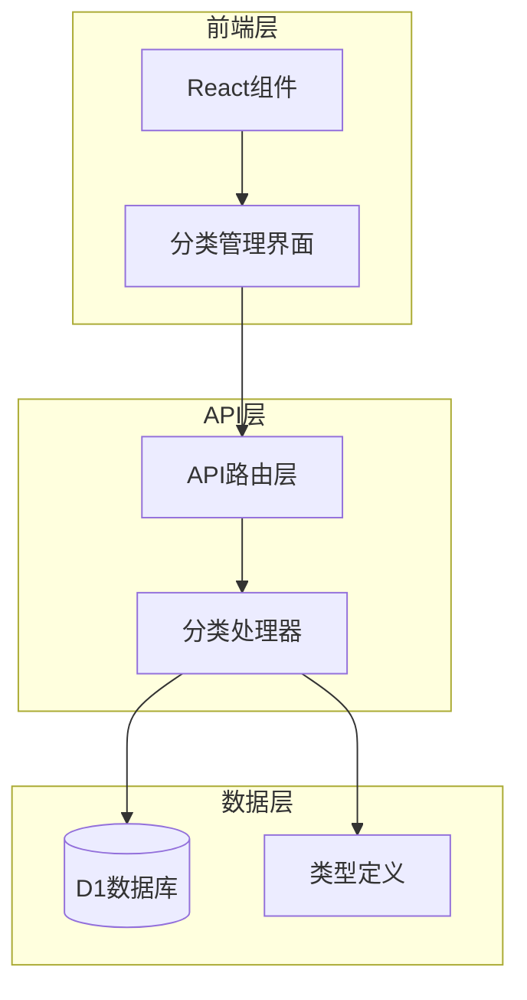
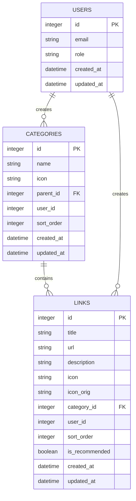
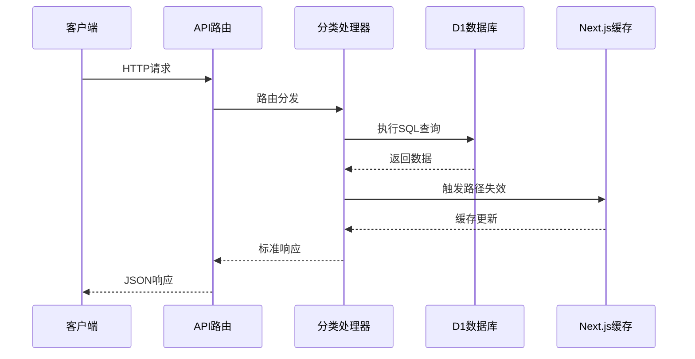
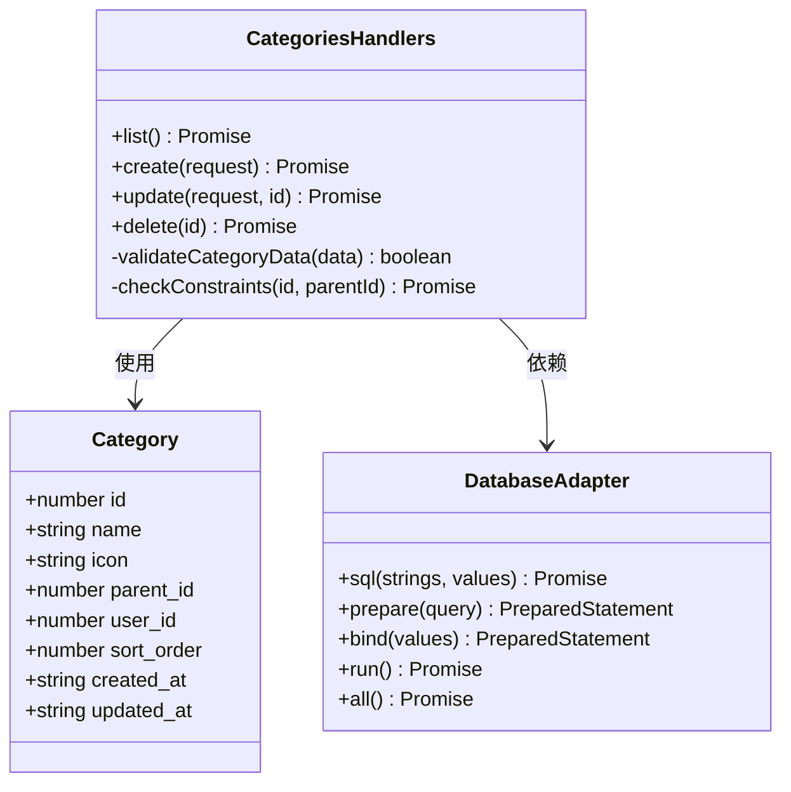
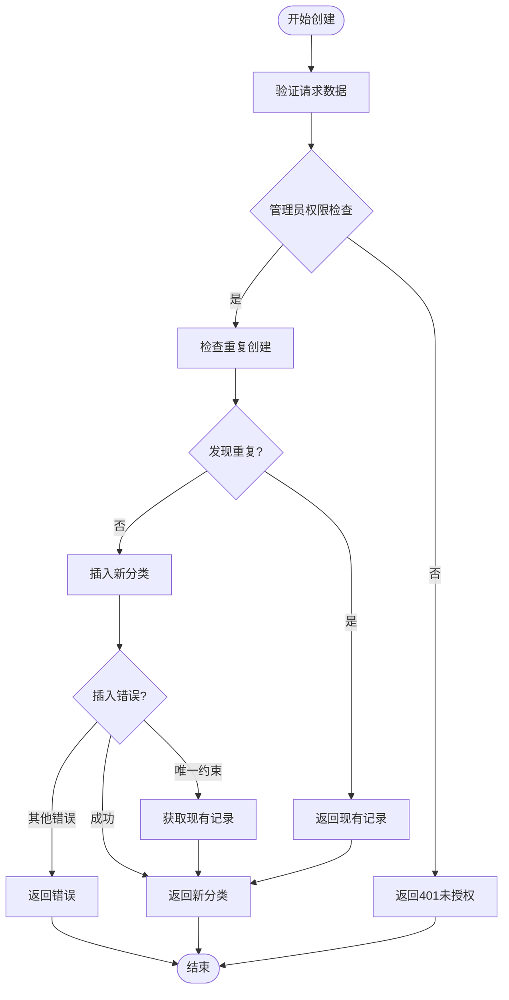
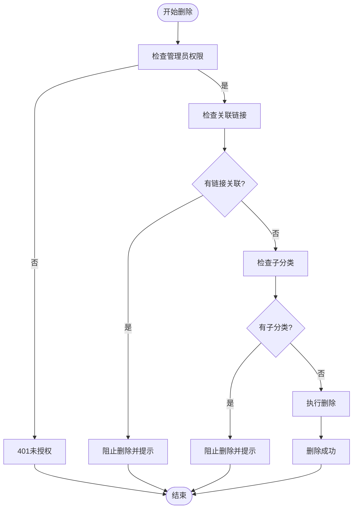
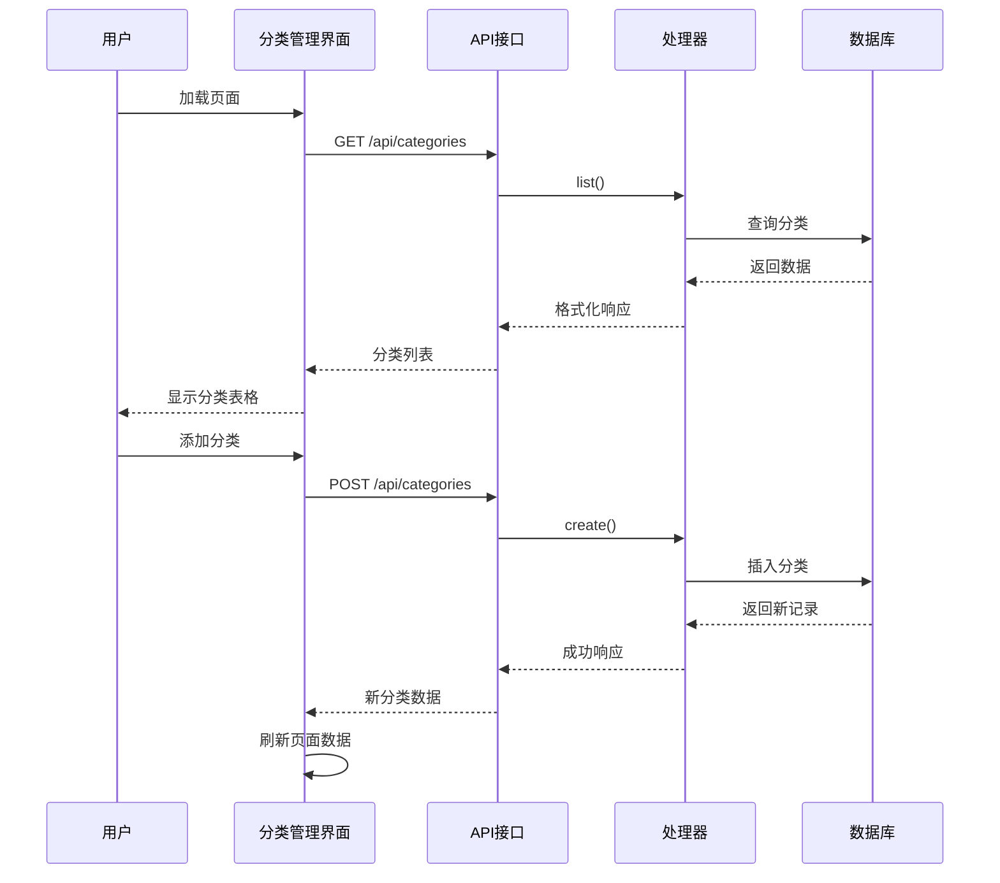
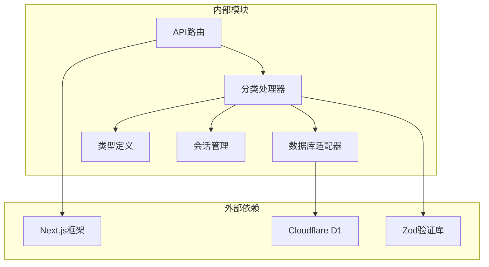
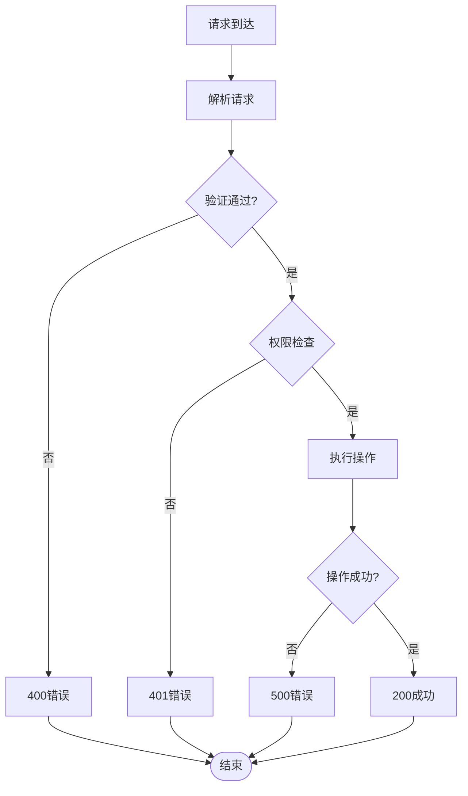

# 分类接口

<cite>
**本文档引用的文件**
- [src/app/api/[...path]/route.ts](file://src/app/api/[...path]/route.ts)
- [src/lib/api-handlers/categories.ts](file://src/lib/api-handlers/categories.ts)
- [src/lib/api-handlers/setup.ts](file://src/lib/api-handlers/setup.ts)
- [src/lib/db.ts](file://src/lib/db.ts)
- [src/types/index.ts](file://src/types/index.ts)
- [src/components/admin/CategoryManager.tsx](file://src/components/admin/CategoryManager.tsx)
- [src/app/admin/(dashboard)/categories/page.tsx](file://src/app/admin/(dashboard)/categories/page.tsx)
- [src/lib/api-handlers/admin.ts](file://src/lib/api-handlers/admin.ts)
</cite>

## 目录
1. [简介](#简介)
2. [项目结构](#项目结构)
3. [核心组件](#核心组件)
4. [架构概览](#架构概览)
5. [详细组件分析](#详细组件分析)
6. [依赖分析](#依赖分析)
7. [性能考虑](#性能考虑)
8. [故障排除指南](#故障排除指南)
9. [结论](#结论)

## 简介

导航系统中的分类管理接口提供了完整的分类CRUD操作能力，支持分类的创建、读取、更新、删除和列表查询。该接口采用Next.js App Router架构，基于Cloudflare D1数据库实现，支持父子关系处理、排序机制和层级结构管理。

## 项目结构

分类接口主要分布在以下模块中：



**图表来源**
- [src/app/api/[...path]/route.ts](file://src/app/api/[...path]/route.ts#L1-L147)
- [src/lib/api-handlers/categories.ts](file://src/lib/api-handlers/categories.ts#L1-L199)

**章节来源**
- [src/app/api/[...path]/route.ts](file://src/app/api/[...path]/route.ts#L1-L147)
- [src/lib/api-handlers/categories.ts](file://src/lib/api-handlers/categories.ts#L1-L199)

## 核心组件

### 数据模型

分类数据模型定义了完整的分类结构，支持嵌套关系和排序机制：



**图表来源**
- [src/types/index.ts](file://src/types/index.ts#L9-L19)
- [src/lib/api-handlers/setup.ts](file://src/lib/api-handlers/setup.ts#L34-L44)

### 接口规范

| 方法 | URL模式 | 功能描述 | 请求体 | 响应体 |
|------|---------|----------|--------|--------|
| GET | `/api/categories` | 获取分类列表 | 无 | 分类数组 |
| POST | `/api/categories` | 创建新分类 | 分类数据 | 新分类对象 |
| PUT | `/api/categories/:id` | 更新指定分类 | 分类数据 | 更新后的分类 |
| DELETE | `/api/categories/:id` | 删除指定分类 | 无 | 删除结果 |

**章节来源**
- [src/app/api/[...path]/route.ts](file://src/app/api/[...path]/route.ts#L22-L135)
- [src/lib/api-handlers/categories.ts](file://src/lib/api-handlers/categories.ts#L18-L198)

## 架构概览

分类接口采用分层架构设计，确保职责分离和可维护性：



**图表来源**
- [src/app/api/[...path]/route.ts](file://src/app/api/[...path]/route.ts#L12-L146)
- [src/lib/api-handlers/categories.ts](file://src/lib/api-handlers/categories.ts#L18-L198)

## 详细组件分析

### 分类处理器

分类处理器实现了完整的CRUD操作，包含完整的错误处理和数据验证：



**图表来源**
- [src/lib/api-handlers/categories.ts](file://src/lib/api-handlers/categories.ts#L17-L198)
- [src/lib/db.ts](file://src/lib/db.ts#L12-L68)

#### 创建操作流程



**图表来源**
- [src/lib/api-handlers/categories.ts](file://src/lib/api-handlers/categories.ts#L35-L94)

#### 删除操作流程



**图表来源**
- [src/lib/api-handlers/categories.ts](file://src/lib/api-handlers/categories.ts#L138-L197)

### 前端集成

分类管理界面提供了完整的用户交互体验：



**图表来源**
- [src/components/admin/CategoryManager.tsx](file://src/components/admin/CategoryManager.tsx#L34-L150)
- [src/app/admin/(dashboard)/categories/page.tsx](file://src/app/admin/(dashboard)/categories/page.tsx#L46-L54)

**章节来源**
- [src/components/admin/CategoryManager.tsx](file://src/components/admin/CategoryManager.tsx#L1-L262)
- [src/app/admin/(dashboard)/categories/page.tsx](file://src/app/admin/(dashboard)/categories/page.tsx#L31-L55)

## 依赖分析

分类接口的依赖关系清晰明确，遵循单一职责原则：



**图表来源**
- [src/app/api/[...path]/route.ts](file://src/app/api/[...path]/route.ts#L1-L10)
- [src/lib/api-handlers/categories.ts](file://src/lib/api-handlers/categories.ts#L1-L5)

### 数据库约束

分类表具有以下关键约束：

| 约束类型 | 字段 | 描述 | 影响 |
|----------|------|------|------|
| 主键 | id | 自增主键 | 唯一标识分类 |
| 外键 | parent_id | 父分类引用 | 支持层级结构 |
| 外键 | user_id | 用户引用 | 支持多用户隔离 |
| 唯一索引 | name,user_id | 分类名称唯一性 | 防止重复创建 |
| 索引 | parent_id | 子分类查询优化 | 提升层级查询性能 |
| 索引 | user_id | 用户过滤优化 | 提升用户数据查询 |

**章节来源**
- [src/lib/api-handlers/setup.ts](file://src/lib/api-handlers/setup.ts#L34-L51)
- [src/lib/api-handlers/categories.ts](file://src/lib/api-handlers/categories.ts#L49-L60)

## 性能考虑

### 查询优化

1. **索引策略**
   - 在 `user_id` 上建立索引以优化用户数据过滤
   - 在 `parent_id` 上建立索引以优化层级查询
   - 在 `name,user_id` 上建立唯一索引以避免重复

2. **缓存机制**
   - 使用Next.js的revalidatePath机制自动清理缓存
   - 支持Edge Runtime以获得更好的性能

3. **批量操作**
   - 支持批量删除操作减少数据库往返
   - 优化排序操作使用原子更新

### 错误处理

接口实现了完善的错误处理机制：



**图表来源**
- [src/lib/api-handlers/categories.ts](file://src/lib/api-handlers/categories.ts#L38-L47)
- [src/lib/api-handlers/categories.ts](file://src/lib/api-handlers/categories.ts#L190-L196)

## 故障排除指南

### 常见问题及解决方案

1. **权限问题**
   - 症状：返回401未授权
   - 解决：确保用户具有管理员角色

2. **数据验证失败**
   - 症状：返回400错误，消息为"Name is required"
   - 解决：确保请求体包含必需字段

3. **重复创建**
   - 症状：创建相同名称的分类
   - 解决：系统自动返回现有记录，无需重复创建

4. **删除失败**
   - 症状：返回400错误，提示有子分类或链接关联
   - 解决：先删除子分类或关联的链接

### 调试建议

1. **启用日志**
   ```javascript
   console.error('Category operation error:', error);
   ```

2. **检查数据库连接**
   - 确保D1绑定配置正确
   - 验证数据库迁移已完成

3. **验证请求格式**
   - 确保JSON格式正确
   - 检查必填字段完整性

**章节来源**
- [src/lib/api-handlers/categories.ts](file://src/lib/api-handlers/categories.ts#L27-L31)
- [src/lib/api-handlers/categories.ts](file://src/lib/api-handlers/categories.ts#L190-L196)

## 结论

分类管理接口提供了完整、健壮的分类CRUD操作能力，具有以下特点：

1. **完整的功能覆盖**：支持所有基本CRUD操作和高级特性
2. **强类型安全**：基于TypeScript的完整类型定义
3. **良好的错误处理**：完善的错误处理和用户友好的错误消息
4. **性能优化**：合理的索引策略和缓存机制
5. **易于扩展**：清晰的架构设计便于功能扩展

该接口为导航系统的分类管理提供了坚实的技术基础，支持复杂的层级结构和丰富的业务需求。