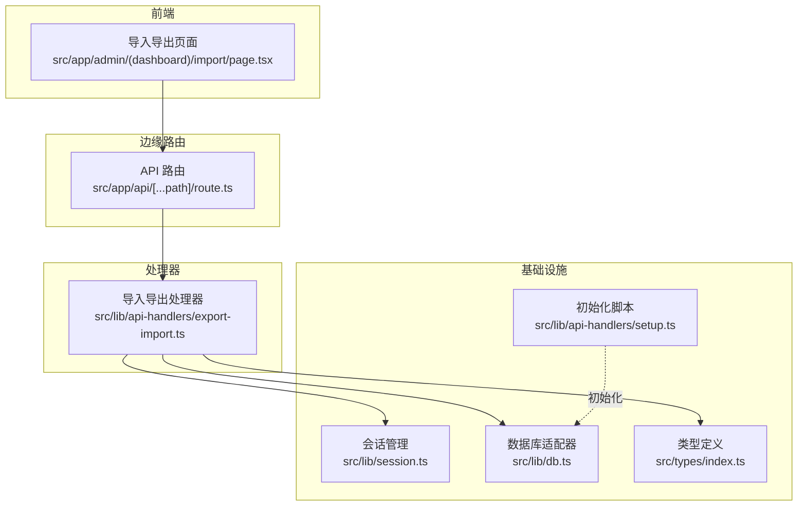
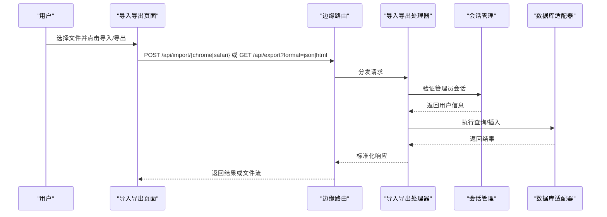
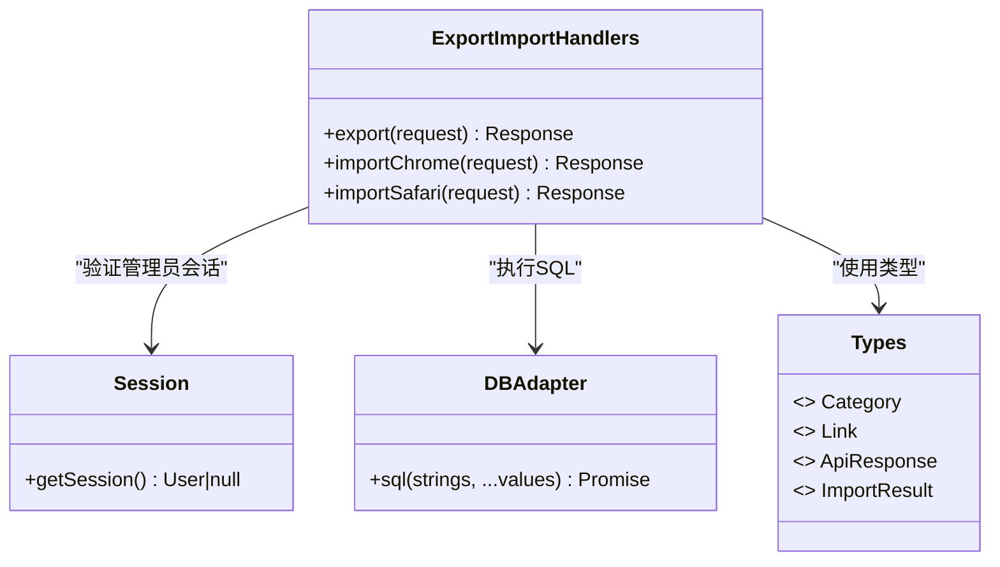
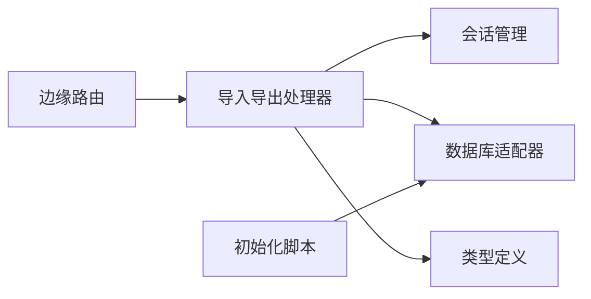

# 导入导出接口

<cite>
**本文引用的文件列表**
- [src/app/api/[...path]/route.ts](file://src/app/api/[...path]/route.ts)
- [src/lib/api-handlers/export-import.ts](file://src/lib/api-handlers/export-import.ts)
- [src/app/admin/(dashboard)/import/page.tsx](file://src/app/admin/(dashboard)/import/page.tsx)
- [src/lib/session.ts](file://src/lib/session.ts)
- [src/lib/db.ts](file://src/lib/db.ts)
- [src/types/index.ts](file://src/types/index.ts)
- [src/lib/api-handlers/setup.ts](file://src/lib/api-handlers/setup.ts)
</cite>

## 目录
1. [简介](#简介)
2. [项目结构](#项目结构)
3. [核心组件](#核心组件)
4. [架构总览](#架构总览)
5. [详细组件分析](#详细组件分析)
6. [依赖关系分析](#依赖关系分析)
7. [性能考量](#性能考量)
8. [故障排查指南](#故障排查指南)
9. [结论](#结论)
10. [附录](#附录)

## 简介
本文件面向数据导入导出接口，系统性记录以下能力：
- Chrome 书签导入（HTML）
- Safari 书签导入（Plist，当前处于禁用状态）
- JSON 数据导出
- HTML 书签导出
并提供 HTTP 方法、URL 模式、请求/响应格式、数据格式转换、批量处理机制、错误恢复策略、进度跟踪与错误处理、数据验证、冲突解决与完整性检查等实现细节。

## 项目结构
导入导出功能由前端页面、边缘路由与后端处理器共同组成：
- 前端页面负责用户交互与文件上传
- 边缘路由统一入口，分发到具体处理器
- 处理器执行业务逻辑，访问数据库并返回标准响应

图表来源
- [src/app/admin/(dashboard)/import/page.tsx](file://src/app/admin/(dashboard)/import/page.tsx#L1-L184)
- [src/app/api/[...path]/route.ts](file://src/app/api/[...path]/route.ts#L1-L96)
- [src/lib/api-handlers/export-import.ts](file://src/lib/api-handlers/export-import.ts#L1-L334)
- [src/lib/session.ts](file://src/lib/session.ts#L1-L14)
- [src/lib/db.ts](file://src/lib/db.ts#L1-L69)
- [src/types/index.ts](file://src/types/index.ts#L1-L53)
- [src/lib/api-handlers/setup.ts](file://src/lib/api-handlers/setup.ts#L28-L131)

章节来源
- [src/app/admin/(dashboard)/import/page.tsx](file://src/app/admin/(dashboard)/import/page.tsx#L1-L184)
- [src/app/api/[...path]/route.ts](file://src/app/api/[...path]/route.ts#L1-L96)
- [src/lib/api-handlers/export-import.ts](file://src/lib/api-handlers/export-import.ts#L1-L334)

## 核心组件
- 边缘路由：统一暴露 /api/* 接口，按路径分发到不同处理器
- 导入导出处理器：实现导出与导入逻辑，含权限校验、数据解析、批量写入、冲突处理
- 会话管理：从 Cookie 中提取 JWT 并验证，确保仅管理员可操作
- 数据库适配器：在 Edge Runtime 下通过 D1 绑定执行 SQL，支持 SELECT/INSERT/UPDATE/DELETE 及返回行数统计
- 类型定义：Link、Category、ApiResponse、ImportResult 等，约束数据结构与响应格式

章节来源
- [src/app/api/[...path]/route.ts](file://src/app/api/[...path]/route.ts#L1-L96)
- [src/lib/api-handlers/export-import.ts](file://src/lib/api-handlers/export-import.ts#L1-L334)
- [src/lib/session.ts](file://src/lib/session.ts#L1-L14)
- [src/lib/db.ts](file://src/lib/db.ts#L1-L69)
- [src/types/index.ts](file://src/types/index.ts#L1-L53)

## 架构总览
导入导出接口采用“前端表单 -> 边缘路由 -> 处理器 -> 数据库”的链路，统一返回 JSON 响应；导出时根据 format 参数生成 JSON 或 HTML 文件并以附件形式下载。

图表来源
- [src/app/admin/(dashboard)/import/page.tsx](file://src/app/admin/(dashboard)/import/page.tsx#L27-L81)
- [src/app/api/[...path]/route.ts](file://src/app/api/[...path]/route.ts#L42-L96)
- [src/lib/api-handlers/export-import.ts](file://src/lib/api-handlers/export-import.ts#L8-L106)
- [src/lib/session.ts](file://src/lib/session.ts#L4-L13)
- [src/lib/db.ts](file://src/lib/db.ts#L12-L68)

## 详细组件分析

### HTTP 接口定义
- 导出接口
  - 方法：GET
  - URL：/api/export?format=json|html
  - 请求参数：
    - format：字符串，可选值 json、html，默认 json
  - 成功响应：application/json 或 text/html（HTML 导出），并设置 Content-Disposition 为附件下载
  - 失败响应：400（格式无效）、401（未授权）、500（内部错误）

- Chrome 导入接口
  - 方法：POST
  - URL：/api/import/chrome
  - 表单字段：
    - file：必填，HTML 文件（Chrome 书签导出）
    - categoryId：可选，整数，指定默认分类 ID
  - 成功响应：包含 imported、categories 等字段的 JSON
  - 失败响应：400（缺少文件）、401（未授权）、500（内部错误）

- Safari 导入接口
  - 方法：POST
  - URL：/api/import/safari
  - 表单字段：
    - file：必填，Plist 文件（Safari 书签导出）
    - categoryId：可选，整数，指定默认分类 ID
  - 当前状态：返回 501（服务不可用），提示 Edge Runtime 兼容性问题
  - 失败响应：400（缺少文件）、401（未授权）、500（内部错误）

章节来源
- [src/app/api/[...path]/route.ts](file://src/app/api/[...path]/route.ts#L42-L96)
- [src/lib/api-handlers/export-import.ts](file://src/lib/api-handlers/export-import.ts#L8-L106)
- [src/lib/api-handlers/export-import.ts](file://src/lib/api-handlers/export-import.ts#L108-L229)
- [src/lib/api-handlers/export-import.ts](file://src/lib/api-handlers/export-import.ts#L231-L332)

### 数据格式与转换

- 导出格式
  - JSON 格式：包含 categories、links、exportedAt、version 字段
  - HTML 格式：生成 Netscape Bookmark HTML，递归构建目录树与链接条目

- Chrome 导入格式
  - 输入：HTML 文件（Chrome 书签导出）
  - 解析：正则匹配目录与链接，提取标题、URL、图标、所属目录
  - 冲突处理：使用 ON CONFLICT (url, user_id) DO NOTHING，避免重复导入

- Safari 导入格式
  - 输入：Plist 文件（Safari 书签导出）
  - 实现：当前被注释，保留了完整的解析与导入流程逻辑，但返回 501

章节来源
- [src/lib/api-handlers/export-import.ts](file://src/lib/api-handlers/export-import.ts#L25-L101)
- [src/lib/api-handlers/export-import.ts](file://src/lib/api-handlers/export-import.ts#L124-L173)
- [src/lib/api-handlers/export-import.ts](file://src/lib/api-handlers/export-import.ts#L231-L332)

### 批量处理机制
- 导入流程
  - 读取文件文本，使用正则解析书签条目
  - 对每个条目：
    - 若存在目录名，则先查找或创建分类，并缓存映射
    - 使用 INSERT ... ON CONFLICT (url, user_id) DO NOTHING 批量写入链接
    - 计数 importedCount
  - 返回导入数量与发现的分类名称列表

- 导出流程
  - 查询所有分类与链接，按 sort_order 与创建时间排序
  - JSON：直接序列化为对象并返回
  - HTML：构建目录树，递归输出 DT/DDL 结构

章节来源
- [src/lib/api-handlers/export-import.ts](file://src/lib/api-handlers/export-import.ts#L175-L229)
- [src/lib/api-handlers/export-import.ts](file://src/lib/api-handlers/export-import.ts#L18-L101)

### 错误恢复策略
- 权限控制：非管理员会话返回 401
- 参数校验：缺少文件返回 400
- 异常捕获：处理器内 try/catch 包裹，统一返回 500
- 冲突忽略：导入阶段使用 ON CONFLICT DO NOTHING，保证流程不中断
- Safari 导入：当前禁用，返回 501 并提示兼容性问题

章节来源
- [src/lib/api-handlers/export-import.ts](file://src/lib/api-handlers/export-import.ts#L10-L13)
- [src/lib/api-handlers/export-import.ts](file://src/lib/api-handlers/export-import.ts#L120-L122)
- [src/lib/api-handlers/export-import.ts](file://src/lib/api-handlers/export-import.ts#L222-L228)
- [src/lib/api-handlers/export-import.ts](file://src/lib/api-handlers/export-import.ts#L323-L331)

### 进度跟踪与错误处理
- 前端
  - 导出：调用 /api/export?format=json|html，接收 Blob 后自动触发浏览器下载
  - 导入：构造 FormData，提交到 /api/import/{chrome|safari}，解析 JSON 响应并展示结果或错误
- 处理器
  - 导出：直接返回文件流或 JSON
  - 导入：返回包含 imported、categories 等字段的 JSON

章节来源
- [src/app/admin/(dashboard)/import/page.tsx](file://src/app/admin/(dashboard)/import/page.tsx#L60-L81)
- [src/app/admin/(dashboard)/import/page.tsx](file://src/app/admin/(dashboard)/import/page.tsx#L27-L58)
- [src/lib/api-handlers/export-import.ts](file://src/lib/api-handlers/export-import.ts#L8-L106)
- [src/lib/api-handlers/export-import.ts](file://src/lib/api-handlers/export-import.ts#L108-L229)

### 数据验证与完整性检查
- 会话验证：getSession 从 Cookie 提取 token 并验证，要求 role 为 admin
- 数据库约束：links 表对 (url, user_id) 建有唯一索引，防止重复链接
- 导入冲突：ON CONFLICT (url, user_id) DO NOTHING，避免重复写入
- 导出一致性：按 sort_order 与创建时间排序，确保导出顺序稳定

章节来源
- [src/lib/session.ts](file://src/lib/session.ts#L4-L13)
- [src/lib/api-handlers/export-import.ts](file://src/lib/api-handlers/export-import.ts#L204-L211)
- [src/lib/api-handlers/setup.ts](file://src/lib/api-handlers/setup.ts#L53-L86)

### 类图：处理器与类型关系

图表来源
- [src/lib/api-handlers/export-import.ts](file://src/lib/api-handlers/export-import.ts#L7-L334)
- [src/lib/session.ts](file://src/lib/session.ts#L4-L13)
- [src/lib/db.ts](file://src/lib/db.ts#L12-L68)
- [src/types/index.ts](file://src/types/index.ts#L9-L52)

## 依赖关系分析
- 路由层依赖处理器模块，按路径精确分发
- 处理器依赖会话模块进行权限校验，依赖数据库适配器执行 SQL
- 类型定义贯穿前后端，确保数据结构一致
- 初始化脚本负责创建表与索引，保障数据库完整性

图表来源
- [src/app/api/[...path]/route.ts](file://src/app/api/[...path]/route.ts#L1-L96)
- [src/lib/api-handlers/export-import.ts](file://src/lib/api-handlers/export-import.ts#L1-L334)
- [src/lib/session.ts](file://src/lib/session.ts#L1-L14)
- [src/lib/db.ts](file://src/lib/db.ts#L1-L69)
- [src/types/index.ts](file://src/types/index.ts#L1-L53)
- [src/lib/api-handlers/setup.ts](file://src/lib/api-handlers/setup.ts#L28-L131)

章节来源
- [src/app/api/[...path]/route.ts](file://src/app/api/[...path]/route.ts#L1-L96)
- [src/lib/api-handlers/export-import.ts](file://src/lib/api-handlers/export-import.ts#L1-L334)
- [src/lib/session.ts](file://src/lib/session.ts#L1-L14)
- [src/lib/db.ts](file://src/lib/db.ts#L1-L69)
- [src/types/index.ts](file://src/types/index.ts#L1-L53)
- [src/lib/api-handlers/setup.ts](file://src/lib/api-handlers/setup.ts#L28-L131)

## 性能考量
- 导入阶段使用批量写入与 ON CONFLICT DO NOTHING，减少重复写入开销
- 导出阶段按索引排序，避免全表扫描
- 正则解析 HTML 时建议限制文件大小与并发导入数量，避免内存压力
- Edge Runtime 下 D1 查询具备较低延迟，适合小中型站点的导入导出场景

## 故障排查指南
- 401 未授权
  - 检查登录态与 Cookie 中 token 是否有效
  - 确认用户角色为 admin
- 400 缺少文件或格式无效
  - 确认上传文件类型与字段名正确
  - Safari 导入当前禁用，返回 501
- 500 内部错误
  - 查看服务器日志中的异常堆栈
  - 检查数据库连接与 D1 绑定配置
- 导入无结果
  - 检查 HTML/Plist 文件是否符合预期格式
  - 确认 categoryId 是否正确传入
  - 查看返回的 imported 与 categories 列表确认实际导入数量

章节来源
- [src/lib/api-handlers/export-import.ts](file://src/lib/api-handlers/export-import.ts#L10-L13)
- [src/lib/api-handlers/export-import.ts](file://src/lib/api-handlers/export-import.ts#L120-L122)
- [src/lib/api-handlers/export-import.ts](file://src/lib/api-handlers/export-import.ts#L231-L332)
- [src/lib/session.ts](file://src/lib/session.ts#L4-L13)

## 结论
该导入导出接口以简洁的边缘路由为核心，结合处理器完成权限校验、数据解析、批量写入与冲突处理，支持 JSON 与 HTML 两种导出格式以及 Chrome 书签导入。Safari 导入因运行时兼容性暂时禁用，但保留了完整实现思路。整体设计遵循最小权限原则与幂等写入策略，具备良好的扩展性与稳定性。

## 附录

### 请求示例

- 导出 JSON
  - 方法：GET
  - URL：/api/export?format=json
  - 响应：application/json，包含 categories、links、exportedAt、version

- 导出 HTML
  - 方法：GET
  - URL：/api/export?format=html
  - 响应：text/html，作为附件下载

- 导入 Chrome
  - 方法：POST
  - URL：/api/import/chrome
  - 表单字段：
    - file：HTML 文件
    - categoryId：可选，整数
  - 响应：包含 imported、categories 等字段的 JSON

- 导入 Safari
  - 方法：POST
  - URL：/api/import/safari
  - 表单字段：
    - file：Plist 文件
    - categoryId：可选，整数
  - 响应：当前返回 501（服务不可用）

章节来源
- [src/app/admin/(dashboard)/import/page.tsx](file://src/app/admin/(dashboard)/import/page.tsx#L60-L81)
- [src/app/admin/(dashboard)/import/page.tsx](file://src/app/admin/(dashboard)/import/page.tsx#L27-L58)
- [src/app/api/[...path]/route.ts](file://src/app/api/[...path]/route.ts#L42-L96)
- [src/lib/api-handlers/export-import.ts](file://src/lib/api-handlers/export-import.ts#L8-L106)
- [src/lib/api-handlers/export-import.ts](file://src/lib/api-handlers/export-import.ts#L108-L229)
- [src/lib/api-handlers/export-import.ts](file://src/lib/api-handlers/export-import.ts#L231-L332)