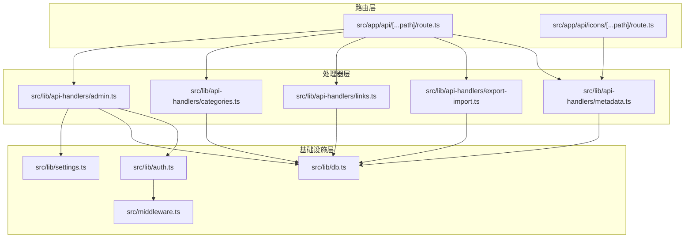
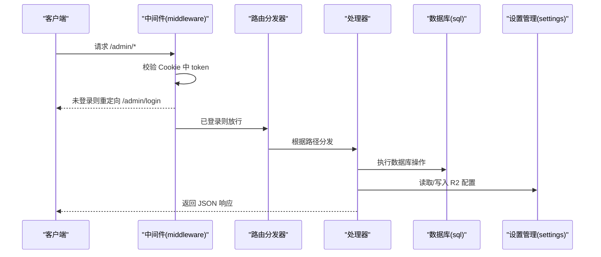
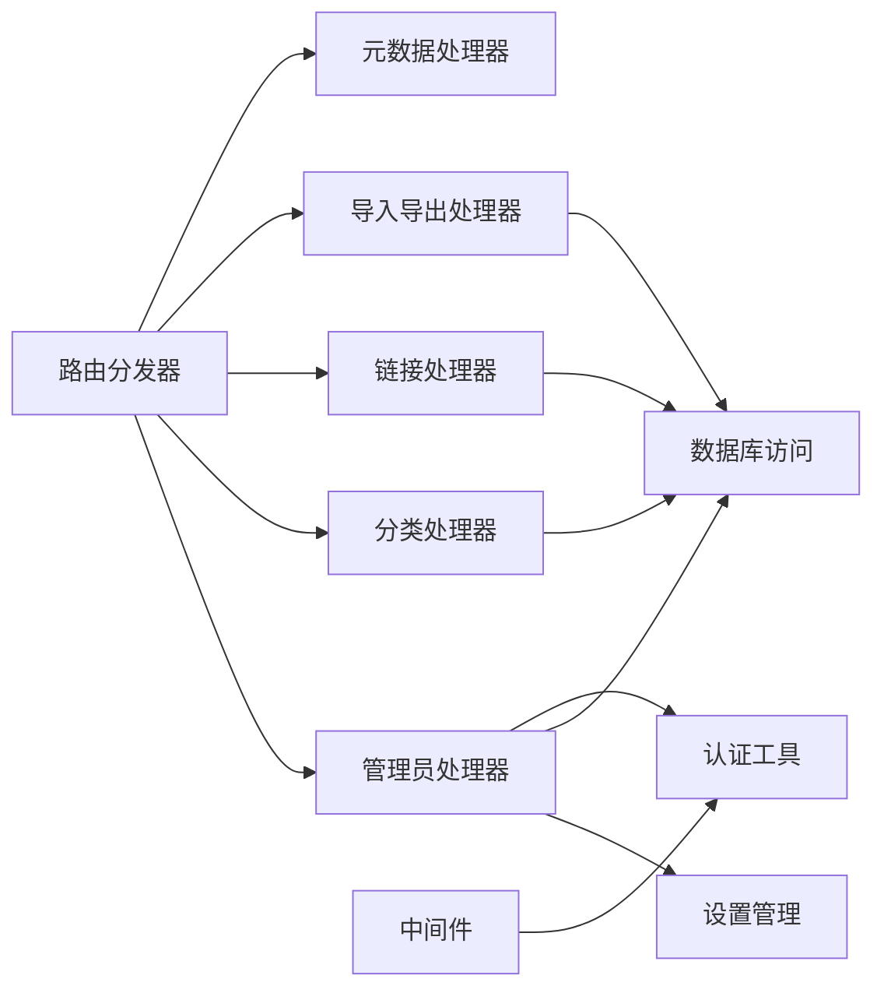
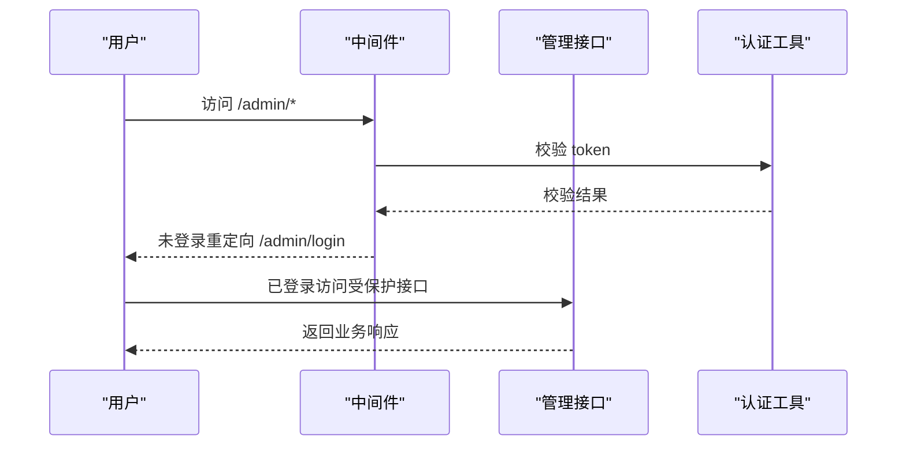

# 管理接口

<cite>
**本文引用的文件**
- [src/app/api/[...path]/route.ts](file://src/app/api/[...path]/route.ts)
- [src/app/api/icons/[...path]/route.ts](file://src/app/api/icons/[...path]/route.ts)
- [src/lib/api-handlers/admin.ts](file://src/lib/api-handlers/admin.ts)
- [src/lib/api-handlers/categories.ts](file://src/lib/api-handlers/categories.ts)
- [src/lib/api-handlers/links.ts](file://src/lib/api-handlers/links.ts)
- [src/lib/api-handlers/export-import.ts](file://src/lib/api-handlers/export-import.ts)
- [src/lib/settings.ts](file://src/lib/settings.ts)
- [src/lib/db.ts](file://src/lib/db.ts)
- [src/lib/auth.ts](file://src/lib/auth.ts)
- [src/middleware.ts](file://src/middleware.ts)
</cite>

## 目录
1. [简介](#简介)
2. [项目结构](#项目结构)
3. [核心组件](#核心组件)
4. [架构总览](#架构总览)
5. [详细组件分析](#详细组件分析)
6. [依赖关系分析](#依赖关系分析)
7. [性能考虑](#性能考虑)
8. [故障排查指南](#故障排查指南)
9. [结论](#结论)
10. [附录](#附录)

## 简介
本文件为导航系统管理后台接口的权威API文档，覆盖管理员设置、统计信息、安全配置与图标清理等管理操作。文档明确各接口的HTTP方法、URL模式、请求/响应格式，并给出权限验证、错误处理与典型使用场景。同时补充系统监控、性能统计与安全审计相关的接口说明，帮助开发者与运维人员快速集成与排障。

## 项目结构
管理接口主要由三层构成：
- 路由层：统一入口根据路径分发到具体处理器
- 处理器层：按功能模块拆分（管理员、分类、链接、导入导出、元数据）
- 基础设施层：认证、会话、数据库访问、R2对象存储、设置管理

图表来源
- [src/app/api/[...path]/route.ts](file://src/app/api/[...path]/route.ts#L1-L147)
- [src/app/api/icons/[...path]/route.ts](file://src/app/api/icons/[...path]/route.ts#L1-L37)
- [src/lib/api-handlers/admin.ts](file://src/lib/api-handlers/admin.ts#L1-L159)
- [src/lib/api-handlers/categories.ts](file://src/lib/api-handlers/categories.ts#L1-L199)
- [src/lib/api-handlers/links.ts](file://src/lib/api-handlers/links.ts#L1-L270)
- [src/lib/api-handlers/export-import.ts](file://src/lib/api-handlers/export-import.ts#L1-L334)
- [src/lib/settings.ts](file://src/lib/settings.ts#L1-L149)
- [src/lib/db.ts](file://src/lib/db.ts#L1-L69)
- [src/lib/auth.ts](file://src/lib/auth.ts#L1-L23)
- [src/middleware.ts](file://src/middleware.ts#L1-L43)

章节来源
- [src/app/api/[...path]/route.ts](file://src/app/api/[...path]/route.ts#L1-L147)
- [src/app/api/icons/[...path]/route.ts](file://src/app/api/icons/[...path]/route.ts#L1-L37)

## 核心组件
- 路由分发器：根据路径将请求分派至对应处理器，支持GET/POST/PUT/DELETE方法
- 管理员处理器：提供设置查询/更新、统计信息、安全配置、图标清理等能力
- 分类与链接处理器：提供增删改查、排序、分页查询等
- 导入导出处理器：支持JSON/HTML导出，Chrome书签导入；Safari导入因运行时限制暂不可用
- 设置管理：集中管理R2配置与敏感字段加解密
- 数据库访问：统一SQL执行器，兼容Cloudflare Pages D1绑定
- 认证与中间件：基于Cookie的JWT校验，保护/admin路径

章节来源
- [src/lib/api-handlers/admin.ts](file://src/lib/api-handlers/admin.ts#L1-L159)
- [src/lib/api-handlers/categories.ts](file://src/lib/api-handlers/categories.ts#L1-L199)
- [src/lib/api-handlers/links.ts](file://src/lib/api-handlers/links.ts#L1-L270)
- [src/lib/api-handlers/export-import.ts](file://src/lib/api-handlers/export-import.ts#L1-L334)
- [src/lib/settings.ts](file://src/lib/settings.ts#L1-L149)
- [src/lib/db.ts](file://src/lib/db.ts#L1-L69)
- [src/lib/auth.ts](file://src/lib/auth.ts#L1-L23)
- [src/middleware.ts](file://src/middleware.ts#L1-L43)

## 架构总览
管理接口采用“路由分发 + 模块化处理器 + 基础设施服务”的分层设计。所有请求在边缘运行时（Edge Runtime）执行，确保低延迟与高并发。

图表来源
- [src/middleware.ts](file://src/middleware.ts#L1-L43)
- [src/app/api/[...path]/route.ts](file://src/app/api/[...path]/route.ts#L1-L147)
- [src/lib/api-handlers/admin.ts](file://src/lib/api-handlers/admin.ts#L1-L159)
- [src/lib/db.ts](file://src/lib/db.ts#L1-L69)
- [src/lib/settings.ts](file://src/lib/settings.ts#L1-L149)

## 详细组件分析

### 管理员接口（admin）
- 权限要求：仅管理员可调用
- 认证方式：Cookie中携带token，经中间件校验

1) 获取系统设置
- 方法与路径：GET /api/admin/settings
- 功能：返回当前用户的R2配置（敏感字段脱敏显示）
- 响应字段：success、data（accessKeyId、secretAccessKey、bucket、endpoint、publicBase、iconMaxKB、iconMaxSize）
- 错误：401 未授权；500 服务器错误

2) 更新系统设置
- 方法与路径：POST /api/admin/settings
- 请求体字段：accessKeyId、secretAccessKey、bucket、endpoint、publicBase、iconMaxKB、iconMaxSize（部分可选）
- 规范：字段长度与数值范围校验；空字符串会被转换为NULL保存
- 响应：success
- 错误：400 输入无效；401 未授权；500 服务器错误

3) 获取统计信息
- 方法与路径：GET /api/admin/stats
- 功能：返回链接数、分类数、推荐链接数及最近新增链接列表
- 响应字段：success、data.links、data.categories、data.recommended、data.recentLinks
- 错误：500 服务器错误

4) 安全配置（修改邮箱/密码）
- 方法与路径：POST /api/admin/security
- 请求体字段：currentPassword（必填）、newEmail（可选）、newPassword（可选，至少5位）
- 行为：校验当前密码，成功后更新邮箱或密码，并删除token强制重新登录
- 响应字段：success、requireReLogin（布尔）
- 错误：400 当前密码不正确/输入无效；404 用户不存在；401 未授权；500 服务器错误

5) 图标清理
- 方法与路径：POST /api/admin/icons/clear
- 行为：在Cloudflare Pages环境下提示无需手动清理（文件系统为只读），建议在R2控制台管理图标
- 响应字段：success、message、count
- 错误：401 未授权；500 服务器错误

章节来源
- [src/lib/api-handlers/admin.ts](file://src/lib/api-handlers/admin.ts#L1-L159)

### 分类接口（categories）
- 权限要求：仅管理员
- 支持：列表、创建、更新、删除（带约束检查）

1) 列表
- 方法与路径：GET /api/categories
- 响应：success、data（数组）

2) 创建
- 方法与路径：POST /api/categories
- 请求体字段：name（必填）、icon、parent_id、sort_order
- 行为：幂等性处理，避免重复创建；若同名存在则返回现有记录
- 响应：success、data
- 错误：400 缺少名称；401 未授权；500 服务器错误

3) 更新
- 方法与路径：PUT /api/categories/{id}
- 请求体字段：name（必填）、icon、parent_id、sort_order
- 响应：success、data
- 错误：400 缺少名称；404 未找到；401 未授权；500 服务器错误

4) 删除
- 方法与路径：DELETE /api/categories/{id}
- 行为：若分类下存在链接或子分类，拒绝删除
- 响应：success、id 或错误消息
- 错误：400 存在关联数据；404 未找到；401 未授权；500 服务器错误

章节来源
- [src/lib/api-handlers/categories.ts](file://src/lib/api-handlers/categories.ts#L1-L199)

### 链接接口（links）
- 权限要求：仅管理员
- 支持：分页列表、创建、更新、删除、批量重排

1) 列表（分页+搜索）
- 方法与路径：GET /api/links
- 查询参数：category（分类ID）、search（标题/描述模糊搜索）、page、limit
- 响应：success、data（数组）、pagination（page、limit、total、totalPages）
- 错误：500 服务器错误

2) 创建
- 方法与路径：POST /api/links
- 请求体字段：title、url（必填）、description、categoryId、icon、icon_orig、sort_order、is_recommended
- 行为：去重（相同URL规范化后比较），避免唯一约束冲突
- 响应：success、data
- 错误：400 输入无效；409 已存在；401 未授权；500 服务器错误

3) 更新
- 方法与路径：PUT /api/links/{id}
- 请求体字段：同创建
- 响应：success、data
- 错误：400 输入无效；404 未找到；401 未授权；500 服务器错误

4) 删除
- 方法与路径：DELETE /api/links/{id}
- 响应：success、data 或 id
- 错误：404 未找到；401 未授权；500 服务器错误

5) 重排
- 方法与路径：PUT /api/links/reorder
- 请求体字段：linkIds（数组）
- 行为：按数组顺序批量更新sort_order
- 响应：success
- 错误：400 输入无效；401 未授权；500 服务器错误

章节来源
- [src/lib/api-handlers/links.ts](file://src/lib/api-handlers/links.ts#L1-L270)

### 导入导出接口（import/export）
- 权限要求：仅管理员

1) 导出
- 方法与路径：GET /api/export?format=json|html
- 行为：导出全部分类与链接；JSON包含版本与导出时间；HTML为Netscape书签格式
- 响应：二进制流（Content-Disposition）
- 错误：400 格式无效；401 未授权；500 服务器错误

2) Chrome 书签导入
- 方法与路径：POST /api/import/chrome
- 请求：multipart/form-data，file（HTML书签文件）、categoryId（默认分类ID，可选）
- 行为：解析HTML，自动创建缺失的分类，插入链接（去重）
- 响应：success、imported、categories
- 错误：400 缺少文件；401 未授权；500 服务器错误

3) Safari 书签导入
- 方法与路径：POST /api/import/safari
- 行为：Safari导入在Edge Runtime下暂时不可用
- 响应：501 暂不支持
- 错误：501 暂不支持；401 未授权；500 服务器错误

章节来源
- [src/lib/api-handlers/export-import.ts](file://src/lib/api-handlers/export-import.ts#L1-L334)

### 元数据抓取接口（metadata）
- 方法与路径：POST /api/fetch-metadata
- 请求体：待抓取的URL
- 行为：在边缘运行时抓取网页元数据（如标题、描述、图标）
- 响应：success、data（元数据）
- 错误：400 输入无效；500 服务器错误

章节来源
- [src/app/api/[...path]/route.ts](file://src/app/api/[...path]/route.ts#L91-L93)

### 图标对象存储接口（icons）
- 方法与路径：GET /api/icons/{key}
- 行为：从R2读取图标对象，透传HTTP元数据与ETag
- 响应：二进制流（含ETag）
- 错误：404 对象不存在；500 R2绑定缺失；500 内部错误

章节来源
- [src/app/api/icons/[...path]/route.ts](file://src/app/api/icons/[...path]/route.ts#L1-L37)

## 依赖关系分析
- 路由层依赖处理器层；处理器层依赖数据库与设置模块；认证中间件依赖JWT工具
- 数据库访问通过统一sql函数封装，兼容D1绑定与本地回退策略
- 设置模块对R2配置进行加解密存储，避免明文泄露

图表来源
- [src/app/api/[...path]/route.ts](file://src/app/api/[...path]/route.ts#L1-L147)
- [src/lib/api-handlers/admin.ts](file://src/lib/api-handlers/admin.ts#L1-L159)
- [src/lib/api-handlers/categories.ts](file://src/lib/api-handlers/categories.ts#L1-L199)
- [src/lib/api-handlers/links.ts](file://src/lib/api-handlers/links.ts#L1-L270)
- [src/lib/api-handlers/export-import.ts](file://src/lib/api-handlers/export-import.ts#L1-L334)
- [src/lib/settings.ts](file://src/lib/settings.ts#L1-L149)
- [src/lib/db.ts](file://src/lib/db.ts#L1-L69)
- [src/lib/auth.ts](file://src/lib/auth.ts#L1-L23)
- [src/middleware.ts](file://src/middleware.ts#L1-L43)

## 性能考虑
- 边缘运行时：所有API在Edge Runtime执行，降低延迟
- 批量更新：链接重排使用Promise并行更新，减少往返
- 缓存失效：写操作后主动触发路径级revalidate，平衡一致性与性能
- 数据库：统一sql函数封装，避免重复prepare与连接开销

[本节为通用指导，不直接分析具体文件]

## 故障排查指南
- 401 未授权
  - 检查Cookie中token是否存在且未过期
  - 确认用户角色为admin
- 400 输入无效
  - 校验请求体字段类型、长度与范围
  - 特别注意URL规范化与重复项检测
- 404 未找到
  - 确认资源ID存在且属于当前用户
- 500 服务器错误
  - 查看后端日志定位具体异常
  - 检查D1绑定与R2配置是否正确

章节来源
- [src/lib/api-handlers/admin.ts](file://src/lib/api-handlers/admin.ts#L1-L159)
- [src/lib/api-handlers/links.ts](file://src/lib/api-handlers/links.ts#L1-L270)
- [src/lib/api-handlers/categories.ts](file://src/lib/api-handlers/categories.ts#L1-L199)
- [src/app/api/icons/[...path]/route.ts](file://src/app/api/icons/[...path]/route.ts#L1-L37)

## 结论
本管理接口以清晰的分层架构与严格的权限控制，提供了完整的后台管理能力。通过统一的路由分发与模块化处理器，既保证了扩展性，也便于维护。结合R2配置管理与边缘运行时特性，系统在安全性与性能上具备良好表现。

[本节为总结性内容，不直接分析具体文件]

## 附录

### 接口一览表
- 管理员
  - GET /api/admin/settings → 返回R2配置（脱敏）
  - POST /api/admin/settings → 更新R2配置
  - GET /api/admin/stats → 返回统计信息
  - POST /api/admin/security → 修改邮箱/密码
  - POST /api/admin/icons/clear → 清理图标（提示在R2控制台操作）
- 分类
  - GET /api/categories → 列表
  - POST /api/categories → 创建
  - PUT /api/categories/{id} → 更新
  - DELETE /api/categories/{id} → 删除
- 链接
  - GET /api/links → 列表（分页+搜索）
  - POST /api/links → 创建
  - PUT /api/links/{id} → 更新
  - DELETE /api/links/{id} → 删除
  - PUT /api/links/reorder → 重排
- 导入导出
  - GET /api/export?format=json|html → 导出
  - POST /api/import/chrome → Chrome书签导入
  - POST /api/import/safari → Safari书签导入（Edge限制）
- 元数据
  - POST /api/fetch-metadata → 抓取网页元数据
- 图标
  - GET /api/icons/{key} → 从R2读取图标

章节来源
- [src/app/api/[...path]/route.ts](file://src/app/api/[...path]/route.ts#L12-L146)
- [src/app/api/icons/[...path]/route.ts](file://src/app/api/icons/[...path]/route.ts#L6-L36)

### 权限与认证流程

图表来源
- [src/middleware.ts](file://src/middleware.ts#L1-L43)
- [src/lib/auth.ts](file://src/lib/auth.ts#L1-L23)

### 错误码规范
- 400：输入参数无效或违反约束
- 401：未认证或权限不足
- 404：资源不存在
- 409：冲突（如重复链接）
- 500：服务器内部错误
- 501：功能暂不支持（如Safari导入）

章节来源
- [src/lib/api-handlers/links.ts](file://src/lib/api-handlers/links.ts#L129-L134)
- [src/lib/api-handlers/export-import.ts](file://src/lib/api-handlers/export-import.ts#L323-L323)