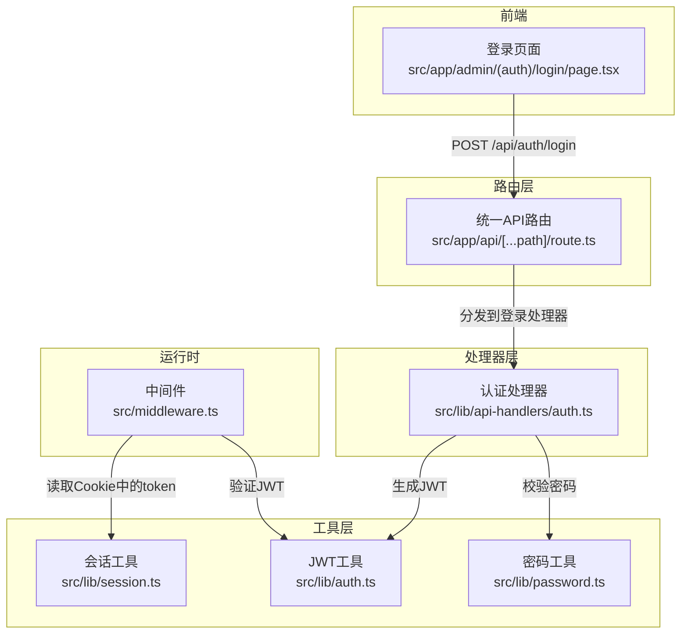
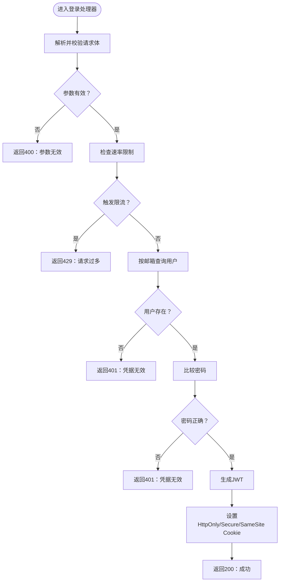
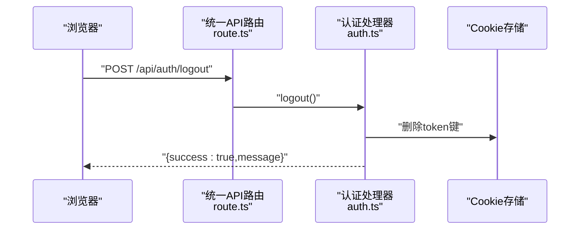
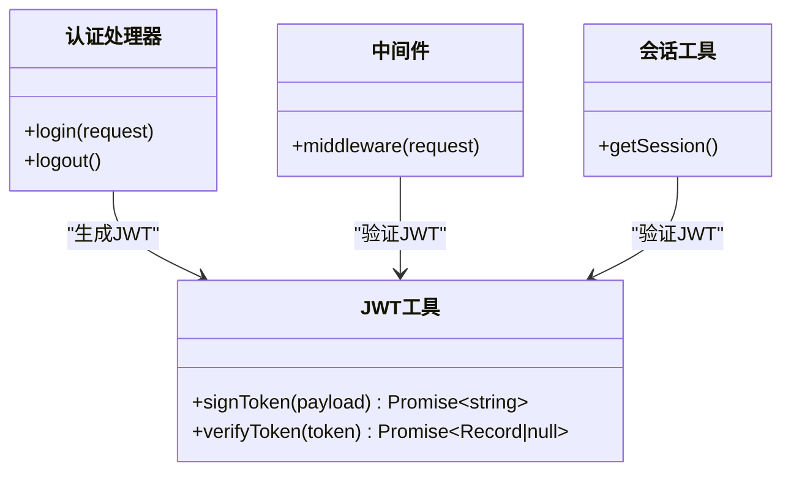
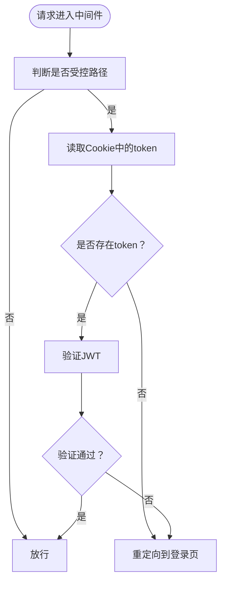
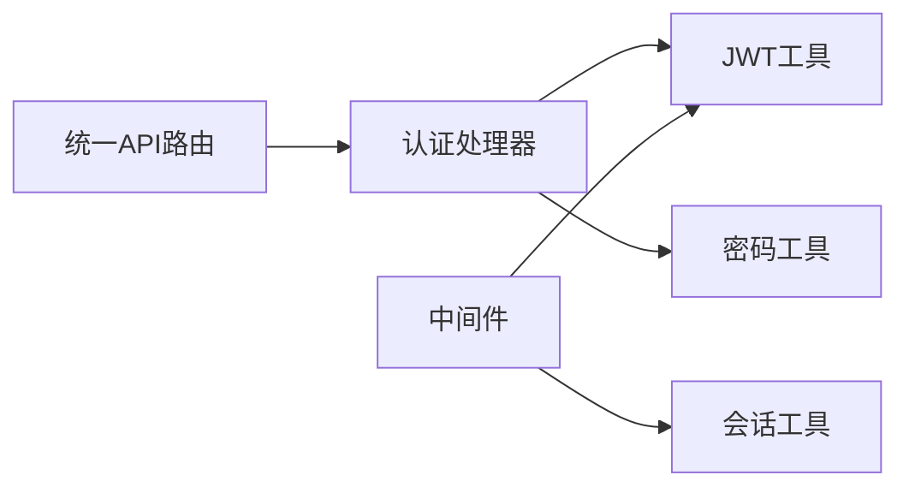

# 认证接口

<cite>
**本文档引用的文件**
- [src/lib/auth.ts](file://src/lib/auth.ts)
- [src/lib/api-handlers/auth.ts](file://src/lib/api-handlers/auth.ts)
- [src/app/api/[...path]/route.ts](file://src/app/api/[...path]/route.ts)
- [src/app/admin/(auth)/login/page.tsx](file://src/app/admin/(auth)/login/page.tsx)
- [src/middleware.ts](file://src/middleware.ts)
- [src/lib/session.ts](file://src/lib/session.ts)
- [src/lib/password.ts](file://src/lib/password.ts)
</cite>

## 目录
1. [简介](#简介)
2. [项目结构](#项目结构)
3. [核心组件](#核心组件)
4. [架构总览](#架构总览)
5. [详细组件分析](#详细组件分析)
6. [依赖关系分析](#依赖关系分析)
7. [性能考虑](#性能考虑)
8. [故障排除指南](#故障排除指南)
9. [结论](#结论)

## 简介
本文件为导航系统的认证接口技术文档，聚焦管理员登录与登出流程，涵盖以下内容：
- 登录与登出接口的HTTP方法、URL模式、请求/响应格式与身份验证方法
- 基于对称密钥的JWT令牌生成、验证与过期控制
- 会话管理、令牌过期处理与权限验证流程
- 错误处理策略、常见认证错误场景与解决方案
- 安全注意事项与最佳实践

## 项目结构
认证相关的关键文件分布如下：
- 路由层：统一入口路由根据路径分发到具体处理器
- 处理器层：认证处理器负责登录/登出业务逻辑与数据校验
- 工具层：JWT工具、密码工具、会话工具
- 前端层：登录页面通过API发起登录请求
- 中间件：保护受控路径，基于Cookie中的JWT进行鉴权



图表来源
- [src/app/api/[...path]/route.ts](file://src/app/api/[...path]/route.ts#L49-L59)
- [src/lib/api-handlers/auth.ts](file://src/lib/api-handlers/auth.ts#L49-L139)
- [src/lib/auth.ts](file://src/lib/auth.ts#L7-L22)
- [src/lib/password.ts](file://src/lib/password.ts#L53-L104)
- [src/middleware.ts](file://src/middleware.ts#L7-L35)
- [src/lib/session.ts](file://src/lib/session.ts#L4-L13)

章节来源
- [src/app/api/[...path]/route.ts](file://src/app/api/[...path]/route.ts#L1-L147)
- [src/lib/api-handlers/auth.ts](file://src/lib/api-handlers/auth.ts#L1-L141)
- [src/lib/auth.ts](file://src/lib/auth.ts#L1-L23)
- [src/lib/password.ts](file://src/lib/password.ts#L1-L105)
- [src/middleware.ts](file://src/middleware.ts#L1-L43)
- [src/lib/session.ts](file://src/lib/session.ts#L1-L14)
- [src/app/admin/(auth)/login/page.tsx](file://src/app/admin/(auth)/login/page.tsx#L1-L118)

## 核心组件
- JWT工具（签名与验证）
  - 采用对称算法生成24小时过期的访问令牌
  - 提供签名与验证两个核心函数
- 密码工具（PBKDF2）
  - 使用Web Crypto API实现PBKDF2哈希与比较
  - 新格式存储$pbkdf2$迭代次数$盐$哈希
- 认证处理器
  - 登录：参数校验、速率限制、用户查询、密码校验、签发JWT并写入Cookie
  - 登出：删除Cookie中的token
- 统一路由分发
  - 将/api/auth/login与/api/auth/logout映射到对应处理器
- 中间件与会话
  - 中间件拦截受控路径，从Cookie中读取token并验证
  - 会话工具在服务端读取并验证token

章节来源
- [src/lib/auth.ts](file://src/lib/auth.ts#L7-L22)
- [src/lib/password.ts](file://src/lib/password.ts#L23-L104)
- [src/lib/api-handlers/auth.ts](file://src/lib/api-handlers/auth.ts#L49-L139)
- [src/app/api/[...path]/route.ts](file://src/app/api/[...path]/route.ts#L54-L59)
- [src/middleware.ts](file://src/middleware.ts#L7-L35)
- [src/lib/session.ts](file://src/lib/session.ts#L4-L13)

## 架构总览
下图展示从浏览器到后端的完整认证流程，包括登录、令牌发放、中间件鉴权与登出。

```mermaid
sequenceDiagram
participant Browser as "浏览器"
participant LoginPage as "登录页面<br/>page.tsx"
participant API as "统一API路由<br/>route.ts"
participant Handler as "认证处理器<br/>auth.ts"
participant JWT as "JWT工具<br/>auth.ts"
participant DB as "数据库<br/>users表"
participant MW as "中间件<br/>middleware.ts"
Browser->>LoginPage : "提交邮箱+密码"
LoginPage->>API : "POST /api/auth/login"
API->>Handler : "login(request)"
Handler->>Handler : "参数校验/速率限制"
Handler->>DB : "按邮箱查询用户"
DB-->>Handler : "返回用户信息"
Handler->>Handler : "比较密码"
Handler->>JWT : "signToken(payload)"
JWT-->>Handler : "返回JWT"
Handler->>Browser : "Set-Cookie : token=...; HttpOnly; Secure; SameSite=Strict"
Browser->>MW : "后续请求携带Cookie"
MW->>JWT : "verifyToken(token)"
JWT-->>MW : "返回payload或null"
MW-->>Browser : "允许或重定向至登录页"
```

图表来源
- [src/app/admin/(auth)/login/page.tsx](file://src/app/admin/(auth)/login/page.tsx#L16-L43)
- [src/app/api/[...path]/route.ts](file://src/app/api/[...path]/route.ts#L54-L59)
- [src/lib/api-handlers/auth.ts](file://src/lib/api-handlers/auth.ts#L49-L129)
- [src/lib/auth.ts](file://src/lib/auth.ts#L7-L22)
- [src/middleware.ts](file://src/middleware.ts#L7-L35)

## 详细组件分析

### 登录接口（POST /api/auth/login）
- HTTP方法与URL
  - 方法：POST
  - 路径：/api/auth/login
- 请求体
  - 字段：email（字符串，需符合邮箱格式）、password（字符串，长度5-128）
  - 格式：JSON
- 响应体
  - 成功：包含success=true、token（JWT）与user（不含敏感字段）
  - 失败：包含success=false与message
- 身份验证方法
  - 参数校验：使用Zod Schema
  - 速率限制：基于IP的滑动窗口计数（10分钟最多20次尝试）
  - 用户校验：按邮箱查询用户
  - 密码校验：PBKDF2比较
  - 令牌签发：对称算法，24小时过期
  - 会话写入：设置HttpOnly、Secure、SameSite=Strict的Cookie
- 典型状态码
  - 200：登录成功
  - 400：参数无效
  - 401：凭据无效
  - 429：请求过于频繁
  - 500：服务器配置或内部错误
- 请求示例（路径）
  - [登录请求示例](file://src/app/admin/(auth)/login/page.tsx#L22-L28)
- 响应示例（路径）
  - [登录成功响应](file://src/lib/api-handlers/auth.ts#L116-L120)
  - [登录失败响应](file://src/lib/api-handlers/auth.ts#L82-L95)



图表来源
- [src/lib/api-handlers/auth.ts](file://src/lib/api-handlers/auth.ts#L49-L129)

章节来源
- [src/app/api/[...path]/route.ts](file://src/app/api/[...path]/route.ts#L54-L56)
- [src/lib/api-handlers/auth.ts](file://src/lib/api-handlers/auth.ts#L49-L129)
- [src/app/admin/(auth)/login/page.tsx](file://src/app/admin/(auth)/login/page.tsx#L22-L28)

### 登出接口（POST /api/auth/logout）
- HTTP方法与URL
  - 方法：POST
  - 路径：/api/auth/logout
- 请求体
  - 无
- 响应体
  - 成功：success=true，message描述登出结果
- 身份验证方法
  - 不需要已登录态；直接删除Cookie中的token
- 典型状态码
  - 200：登出成功
- 响应示例（路径）
  - [登出成功响应](file://src/lib/api-handlers/auth.ts#L135-L138)



图表来源
- [src/app/api/[...path]/route.ts](file://src/app/api/[...path]/route.ts#L57-L58)
- [src/lib/api-handlers/auth.ts](file://src/lib/api-handlers/auth.ts#L131-L139)

章节来源
- [src/app/api/[...path]/route.ts](file://src/app/api/[...path]/route.ts#L57-L58)
- [src/lib/api-handlers/auth.ts](file://src/lib/api-handlers/auth.ts#L131-L139)

### JWT令牌生成、验证与过期控制
- 生成
  - 使用对称密钥（环境变量）与指定算法生成JWT
  - 设置签发时间与24小时过期时间
  - 载荷包含用户标识、邮箱与角色
- 验证
  - 使用相同密钥验证签名与有效性
  - 异常时返回空值，用于中间件判定未认证
- 过期处理
  - 客户端Cookie设置maxAge为24小时
  - 中间件每次请求验证token有效性
  - 未认证或过期将被重定向至登录页



图表来源
- [src/lib/auth.ts](file://src/lib/auth.ts#L7-L22)
- [src/lib/api-handlers/auth.ts](file://src/lib/api-handlers/auth.ts#L99-L112)
- [src/middleware.ts](file://src/middleware.ts#L16-L21)
- [src/lib/session.ts](file://src/lib/session.ts#L4-L13)

章节来源
- [src/lib/auth.ts](file://src/lib/auth.ts#L7-L22)
- [src/lib/api-handlers/auth.ts](file://src/lib/api-handlers/auth.ts#L99-L112)
- [src/middleware.ts](file://src/middleware.ts#L16-L21)
- [src/lib/session.ts](file://src/lib/session.ts#L4-L13)

### 会话管理与权限验证流程
- 会话存储
  - 使用HttpOnly Cookie存储JWT，避免XSS读取
  - 生产环境启用Secure属性，严格SameSite策略
- 权限验证
  - 受控路径前缀为/admin
  - 中间件拦截受控路径，若未认证则重定向至登录页
  - 若已登录却访问登录页，则重定向至管理首页
- 刷新机制
  - 当前实现不支持刷新令牌；客户端可重新登录获取新令牌



图表来源
- [src/middleware.ts](file://src/middleware.ts#L7-L35)

章节来源
- [src/middleware.ts](file://src/middleware.ts#L7-L35)
- [src/lib/api-handlers/auth.ts](file://src/lib/api-handlers/auth.ts#L105-L112)

### 密码处理与安全
- 存储格式
  - 使用PBKDF2哈希，存储格式为$pbkdf2$迭代次数$盐$哈希
- 校验流程
  - 从存储中解析盐与哈希
  - 对输入密码执行相同PBKDF2派生
  - 常量时间比较结果
- 迁移注意
  - 旧版bcrypt哈希无法在此验证，建议引导用户重置密码

章节来源
- [src/lib/password.ts](file://src/lib/password.ts#L23-L104)

## 依赖关系分析
- 组件耦合
  - 统一路由仅依赖处理器导出对象，解耦具体业务
  - 认证处理器依赖JWT工具、密码工具与数据库访问
  - 中间件依赖JWT工具与Cookie读取
- 外部依赖
  - jose库用于JWT签名与验证
  - Zod用于请求体参数校验
  - Next.js Headers/Cookies API用于Cookie操作
- 潜在循环依赖
  - 当前模块间为单向依赖，无循环



图表来源
- [src/app/api/[...path]/route.ts](file://src/app/api/[...path]/route.ts#L2-L8)
- [src/lib/api-handlers/auth.ts](file://src/lib/api-handlers/auth.ts#L1-L8)
- [src/middleware.ts](file://src/middleware.ts#L1-L4)

章节来源
- [src/app/api/[...path]/route.ts](file://src/app/api/[...path]/route.ts#L1-L147)
- [src/lib/api-handlers/auth.ts](file://src/lib/api-handlers/auth.ts#L1-L141)
- [src/middleware.ts](file://src/middleware.ts#L1-L43)

## 性能考虑
- 速率限制
  - 滑动窗口10分钟20次，防止暴力破解
- 数据库查询
  - 按邮箱精确查询，建议确保邮箱字段建立索引
- 密码比较
  - PBKDF2迭代次数较高，注意Edge Runtime性能
- Cookie设置
  - HttpOnly避免XSS，Secure仅在HTTPS生效，SameSite严格策略提升安全性

## 故障排除指南
- 常见错误与原因
  - 400参数无效：请求体不符合Zod校验
  - 401凭据无效：用户不存在或密码错误
  - 429请求过多：触发速率限制
  - 500服务器配置：生产环境缺少JWT密钥
  - 重定向循环：Cookie被禁用或跨域问题导致token丢失
- 排查步骤
  - 检查请求体格式与字段范围
  - 确认JWT_SECRET环境变量配置
  - 查看浏览器网络面板与开发者工具控制台
  - 确认Cookie是否随请求发送且未被清理
- 解决方案
  - 补充缺失字段或修正格式
  - 等待限流窗口结束或联系管理员
  - 在生产环境设置强随机密钥并重启服务
  - 清理浏览器Cookie并重新登录

章节来源
- [src/lib/api-handlers/auth.ts](file://src/lib/api-handlers/auth.ts#L59-L73)
- [src/middleware.ts](file://src/middleware.ts#L24-L32)

## 结论
本认证体系采用JWT与HttpOnly Cookie实现受控访问，结合参数校验、速率限制与严格的SameSite策略保障安全。当前未实现刷新令牌，建议在后续版本引入短期访问令牌与长期刷新令牌的双令牌模型，并完善令牌撤销与审计日志功能。