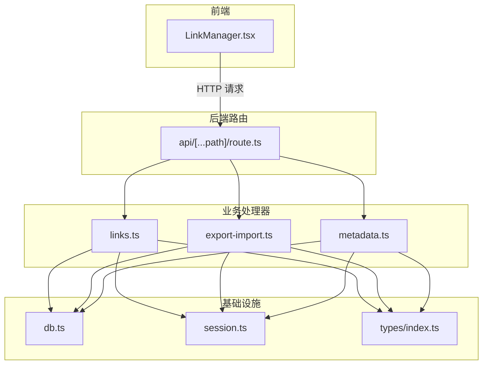
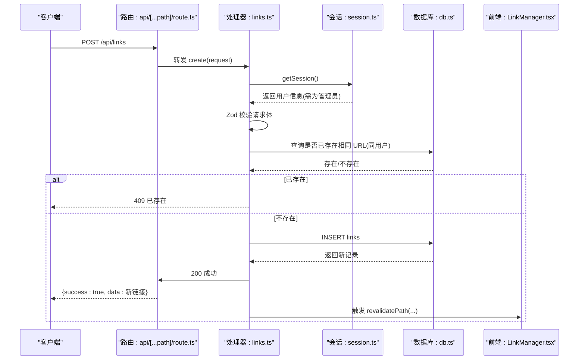
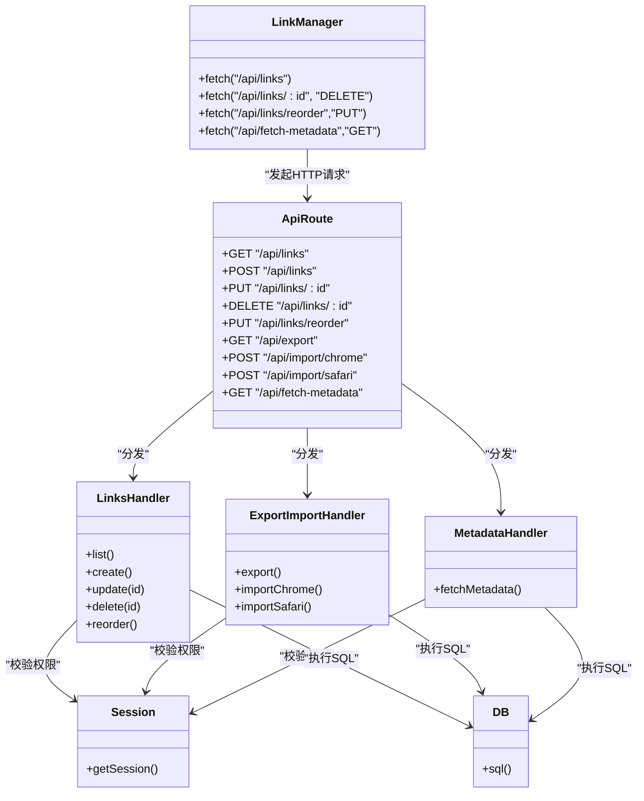

# 链接接口

<cite>
**本文引用的文件**
- [README.md](file://README.md)
- [src/app/api/[...path]/route.ts](file://src/app/api/[...path]/route.ts)
- [src/lib/api-handlers/links.ts](file://src/lib/api-handlers/links.ts)
- [src/lib/api-handlers/export-import.ts](file://src/lib/api-handlers/export-import.ts)
- [src/lib/api-handlers/metadata.ts](file://src/lib/api-handlers/metadata.ts)
- [src/lib/db.ts](file://src/lib/db.ts)
- [src/lib/session.ts](file://src/lib/session.ts)
- [src/types/index.ts](file://src/types/index.ts)
- [src/components/admin/LinkManager.tsx](file://src/components/admin/LinkManager.tsx)
</cite>

## 目录
1. [简介](#简介)
2. [项目结构](#项目结构)
3. [核心组件](#核心组件)
4. [架构总览](#架构总览)
5. [详细组件分析](#详细组件分析)
6. [依赖关系分析](#依赖关系分析)
7. [性能考量](#性能考量)
8. [故障排查指南](#故障排查指南)
9. [结论](#结论)
10. [附录](#附录)

## 简介
本文件为“链接管理接口”的完整API文档，覆盖链接的CRUD与排序、分页查询、导入导出、元数据抓取与图标处理等能力。文档基于仓库中的实际实现进行梳理，明确HTTP方法、URL模式、请求/响应格式、参数校验规则、错误处理策略，并提供可视化图示帮助理解。

## 项目结构
- 后端API路由集中于 App Router 的动态路由文件，统一入口分发到各模块处理器。
- 链接业务逻辑集中在链接处理器中，配合数据库访问层与会话认证。
- 前端管理界面通过 LinkManager 组件调用后端接口完成增删改查与排序。

图表来源
- [src/app/api/[...path]/route.ts](file://src/app/api/[...path]/route.ts#L1-L147)
- [src/lib/api-handlers/links.ts](file://src/lib/api-handlers/links.ts#L1-L270)
- [src/lib/api-handlers/export-import.ts](file://src/lib/api-handlers/export-import.ts#L1-L334)
- [src/lib/api-handlers/metadata.ts](file://src/lib/api-handlers/metadata.ts#L1-L172)
- [src/lib/db.ts](file://src/lib/db.ts#L1-L69)
- [src/lib/session.ts](file://src/lib/session.ts#L1-L14)
- [src/types/index.ts](file://src/types/index.ts#L1-L53)

章节来源
- [README.md](file://README.md#L65-L76)
- [src/app/api/[...path]/route.ts](file://src/app/api/[...path]/route.ts#L1-L147)

## 核心组件
- 链接处理器：提供列表、创建、更新、删除、批量重排等能力。
- 导入导出处理器：支持 Chrome HTML 书签导入与 JSON/HTML 导出。
- 元数据处理器：抓取网页标题、描述、OG 图标并可上传至 R2。
- 数据库访问层：统一 SQL 执行与返回结构。
- 会话与权限：基于 Cookie 的 JWT 校验，管理员权限控制。

章节来源
- [src/lib/api-handlers/links.ts](file://src/lib/api-handlers/links.ts#L25-L270)
- [src/lib/api-handlers/export-import.ts](file://src/lib/api-handlers/export-import.ts#L1-L334)
- [src/lib/api-handlers/metadata.ts](file://src/lib/api-handlers/metadata.ts#L1-L172)
- [src/lib/db.ts](file://src/lib/db.ts#L12-L69)
- [src/lib/session.ts](file://src/lib/session.ts#L4-L14)

## 架构总览
以下序列图展示“创建链接”请求的端到端流程，包括参数校验、去重检查、数据库写入与缓存失效。

图表来源
- [src/app/api/[...path]/route.ts](file://src/app/api/[...path]/route.ts#L49-L96)
- [src/lib/api-handlers/links.ts](file://src/lib/api-handlers/links.ts#L69-L140)
- [src/lib/session.ts](file://src/lib/session.ts#L4-L14)
- [src/lib/db.ts](file://src/lib/db.ts#L12-L69)
- [src/components/admin/LinkManager.tsx](file://src/components/admin/LinkManager.tsx#L200-L276)

## 详细组件分析

### 链接数据模型
- 字段定义与约束来源于数据库建表与类型声明，关键字段如下：
  - id: 主键
  - title/url/description/icon/icon_orig/category_id/user_id/sort_order/is_recommended
  - created_at/updated_at
- 关键约束：
  - links 表对 (url, user_id) 建有唯一索引，防止同一用户重复添加相同链接。
  - links 与 categories 通过外键关联；categories 支持父子层级。
- 排序字段：
  - 列表默认按 sort_order 升序、created_at 降序排列。

章节来源
- [src/lib/api-handlers/setup.ts](file://src/lib/api-handlers/setup.ts#L54-L86)
- [src/types/index.ts](file://src/types/index.ts#L21-L34)

### 接口清单与规范

- 列表查询
  - 方法与路径: GET /api/links
  - 查询参数:
    - category: 分类ID（可选）
    - search: 搜索关键词（可选）
    - page: 页码，默认 1
    - limit: 每页条数，默认 20
  - 认证: 需登录，非管理员返回 401
  - 响应: 包含 data（链接数组）与 pagination（page、limit、total、totalPages）
  - 排序: sort_order ASC, created_at DESC
  - 错误: 500 失败

- 创建链接
  - 方法与路径: POST /api/links
  - 请求体字段:
    - title: 非空，最大长度 200
    - url: 有效 URL
    - description: 最大长度 500（可选）
    - categoryId: 整数
    - icon/icon_orig: 字符串或 null（可选）
    - sort_order: 非负整数（可选）
    - is_recommended: 布尔（可选）
  - 去重: 同一用户下，若目标 URL 或去除末尾斜杠后的 URL 已存在，则返回 409
  - 认证: 需管理员，否则 401
  - 响应: {success:true, data: 新链接}
  - 错误: 400 参数无效；409 重复；500 内部错误

- 更新链接
  - 方法与路径: PUT /api/links/{id}
  - 路径参数: id（整数）
  - 请求体字段: 同创建接口
  - 认证: 需管理员，否则 401
  - 响应: {success:true, data: 更新后的链接}；若记录不存在或权限不足返回 404
  - 错误: 400 参数无效；500 内部错误

- 删除链接
  - 方法与路径: DELETE /api/links/{id}
  - 路径参数: id（整数）
  - 认证: 需管理员，否则 401
  - 响应: {success:true, data: 被删除记录或仅返回 id}
  - 错误: 404 未找到或权限不足；500 内部错误

- 批量重排
  - 方法与路径: PUT /api/links/reorder
  - 请求体: { linkIds: number[] }（按拖拽顺序传入的链接ID数组）
  - 认证: 需登录，否则 401
  - 响应: {success:true}
  - 错误: 400 数据格式错误；500 内部错误

- 导入导出
  - 导出:
    - GET /api/export?format=json|html
    - 认证: 需管理员
    - 响应: JSON 或 HTML 文件下载
  - Chrome 导入:
    - POST /api/import/chrome
    - 表单字段: file（HTML）、categoryId（可选）
    - 认证: 需管理员
    - 响应: {success:true, imported, categories}
  - Safari 导入:
    - POST /api/import/safari
    - 认证: 需管理员
    - 响应: 当前返回 501（Edge Runtime 兼容性限制）

- 元数据抓取与图标处理
  - 抓取:
    - GET /api/fetch-metadata?url=xxx
    - 认证: 需管理员
    - 响应: {success:true, data:{title, description, icon, r2_icon}}
  - 图标上传:
    - 若成功抓取图标，尝试下载并上传至 R2，返回 /api/icons/{key} 形式的可访问地址
    - 若 R2 不可用则回退为原图地址

章节来源
- [src/app/api/[...path]/route.ts](file://src/app/api/[...path]/route.ts#L12-L147)
- [src/lib/api-handlers/links.ts](file://src/lib/api-handlers/links.ts#L25-L270)
- [src/lib/api-handlers/export-import.ts](file://src/lib/api-handlers/export-import.ts#L1-L334)
- [src/lib/api-handlers/metadata.ts](file://src/lib/api-handlers/metadata.ts#L1-L172)

### 参数校验与错误处理
- 参数校验:
  - 使用 Zod 对请求体进行严格校验，字段长度、类型、URL 格式均受控。
  - 列表查询参数 page/limit/category/search 均有默认值与边界处理。
- 去重与幂等:
  - 创建前对同一用户下的 URL 进行标准化比较（去除末尾斜杠），避免重复。
  - 删除/更新/删除分类等操作具备“已删除即成功”的幂等语义。
- 错误响应:
  - 统一返回 {success:false, message} 结构，状态码对应语义化错误。
  - 特殊状态: 401 未授权；404 未找到；409 冲突（重复）；500 服务器错误。

章节来源
- [src/lib/api-handlers/links.ts](file://src/lib/api-handlers/links.ts#L69-L140)
- [src/lib/api-handlers/categories.ts](file://src/lib/api-handlers/categories.ts#L138-L169)

### 排序机制
- 后端:
  - 列表查询默认按 sort_order 升序、created_at 降序排列。
  - 批量重排接口将 linkIds 数组按序写入 sort_order 字段。
- 前端:
  - LinkManager 在特定分类下渲染时，也按 sort_order 与 created_at 进行二次排序，确保显示一致。

章节来源
- [src/lib/api-handlers/links.ts](file://src/lib/api-handlers/links.ts#L8-L23)
- [src/components/admin/LinkManager.tsx](file://src/components/admin/LinkManager.tsx#L110-L130)

### 推荐功能
- 字段: is_recommended（布尔）
- 作用: 可在前端或后续展示层作为“常用推荐”标识使用
- 设置方式: 创建/更新接口均可传入该字段

章节来源
- [src/types/index.ts](file://src/types/index.ts#L31-L31)
- [src/lib/api-handlers/links.ts](file://src/lib/api-handlers/links.ts#L76-L85)

### 图标处理与元数据抓取
- 元数据抓取:
  - 解析页面 title、description、og:title、og:description、og:image
  - 提取 link rel=icon/apple-touch-icon 等标签，综合优先级与尺寸评分选择最佳图标
- 图标上传:
  - 下载图标后上传至 R2（若可用），返回 /api/icons/{key} 可访问地址
  - 若上传失败，回退为原始图标 URL
- 前端集成:
  - LinkManager 在表单中提供 icon/icon_orig 字段，支持手动维护与回填

章节来源
- [src/lib/api-handlers/metadata.ts](file://src/lib/api-handlers/metadata.ts#L5-L172)
- [src/components/admin/LinkManager.tsx](file://src/components/admin/LinkManager.tsx#L482-L501)

### 导入与批量操作
- 导入:
  - Chrome: 解析 HTML 书签，按目录映射到分类，去重插入链接
  - Safari: 当前返回 501（Edge Runtime 兼容性限制）
- 导出:
  - JSON: 输出 categories、links、exportedAt、version
  - HTML: 生成 Netscape 书签格式，按目录树组织
- 批量重排:
  - 前端拖拽后提交 linkIds 数组，后端按序更新 sort_order

章节来源
- [src/lib/api-handlers/export-import.ts](file://src/lib/api-handlers/export-import.ts#L108-L334)
- [src/lib/api-handlers/links.ts](file://src/lib/api-handlers/links.ts#L237-L268)
- [src/components/admin/LinkManager.tsx](file://src/components/admin/LinkManager.tsx#L296-L343)

## 依赖关系分析

图表来源
- [src/components/admin/LinkManager.tsx](file://src/components/admin/LinkManager.tsx#L68-L294)
- [src/app/api/[...path]/route.ts](file://src/app/api/[...path]/route.ts#L12-L147)
- [src/lib/api-handlers/links.ts](file://src/lib/api-handlers/links.ts#L25-L270)
- [src/lib/api-handlers/export-import.ts](file://src/lib/api-handlers/export-import.ts#L1-L334)
- [src/lib/api-handlers/metadata.ts](file://src/lib/api-handlers/metadata.ts#L1-L172)
- [src/lib/session.ts](file://src/lib/session.ts#L4-L14)
- [src/lib/db.ts](file://src/lib/db.ts#L12-L69)

## 性能考量
- 查询优化:
  - 列表查询使用复合索引 (user_id, category_id, sort_order)，建议前端传入 category 以减少扫描范围。
- 写入优化:
  - 批量重排采用 Promise.all 并发更新，提升排序效率。
- 缓存与增量刷新:
  - 写入后触发 revalidatePath，结合 Next.js 边缘缓存提升用户体验。
- 元数据抓取:
  - 仅在管理员操作时启用，避免对公共流量造成额外开销。

[本节为通用指导，不直接分析具体文件]

## 故障排查指南
- 401 未授权
  - 确认登录态与管理员角色；检查 Cookie 中 token 是否正确。
- 409 重复链接
  - 同一用户下 URL 已存在；可改为更新或删除旧记录。
- 404 未找到
  - 资源不存在或跨用户访问；确认 id 与当前用户匹配。
- 500 服务器错误
  - 查看后端日志定位具体 SQL 或网络异常；检查数据库连接与 R2 配置。
- Safari 导入 501
  - Edge Runtime 兼容性限制，建议使用 Chrome 导入或稍后升级运行时。

章节来源
- [src/lib/api-handlers/links.ts](file://src/lib/api-handlers/links.ts#L102-L140)
- [src/lib/api-handlers/export-import.ts](file://src/lib/api-handlers/export-import.ts#L323-L331)
- [src/lib/session.ts](file://src/lib/session.ts#L4-L14)

## 结论
本接口体系围绕“链接 CRUD + 排序 + 导入导出 + 元数据抓取”构建，具备完善的参数校验、幂等与错误处理机制。通过数据库索引与并发写入优化，满足后台管理场景的高可用需求。建议在生产环境完善监控与告警，并根据业务增长持续评估索引与缓存策略。

[本节为总结性内容，不直接分析具体文件]

## 附录

### 请求与响应示例（路径参考）
- 列表查询
  - GET /api/links?category=1&search=xxx&page=1&limit=20
  - 响应: {success:true, data:[...], pagination:{page,limit,total,totalPages}}
- 创建链接
  - POST /api/links
  - 请求体字段参考“创建链接”小节
  - 响应: {success:true, data: 新链接对象}
- 更新链接
  - PUT /api/links/123
  - 请求体字段参考“更新链接”小节
  - 响应: {success:true, data: 更新后的链接对象}
- 删除链接
  - DELETE /api/links/123
  - 响应: {success:true, data: 被删除记录或仅返回 id}
- 批量重排
  - PUT /api/links/reorder
  - 请求体: { linkIds: [1,2,3,...] }
  - 响应: {success:true}
- 导入导出
  - GET /api/export?format=json|html
  - POST /api/import/chrome（表单：file、categoryId）
  - POST /api/import/safari（当前返回 501）
- 元数据抓取
  - GET /api/fetch-metadata?url=xxx
  - 响应: {success:true, data:{title, description, icon, r2_icon}}

章节来源
- [src/app/api/[...path]/route.ts](file://src/app/api/[...path]/route.ts#L12-L147)
- [src/lib/api-handlers/links.ts](file://src/lib/api-handlers/links.ts#L25-L270)
- [src/lib/api-handlers/export-import.ts](file://src/lib/api-handlers/export-import.ts#L1-L334)
- [src/lib/api-handlers/metadata.ts](file://src/lib/api-handlers/metadata.ts#L1-L172)