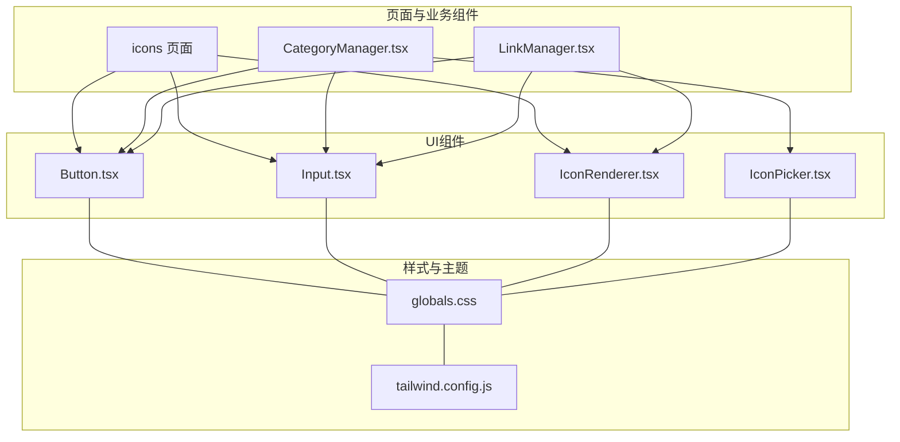
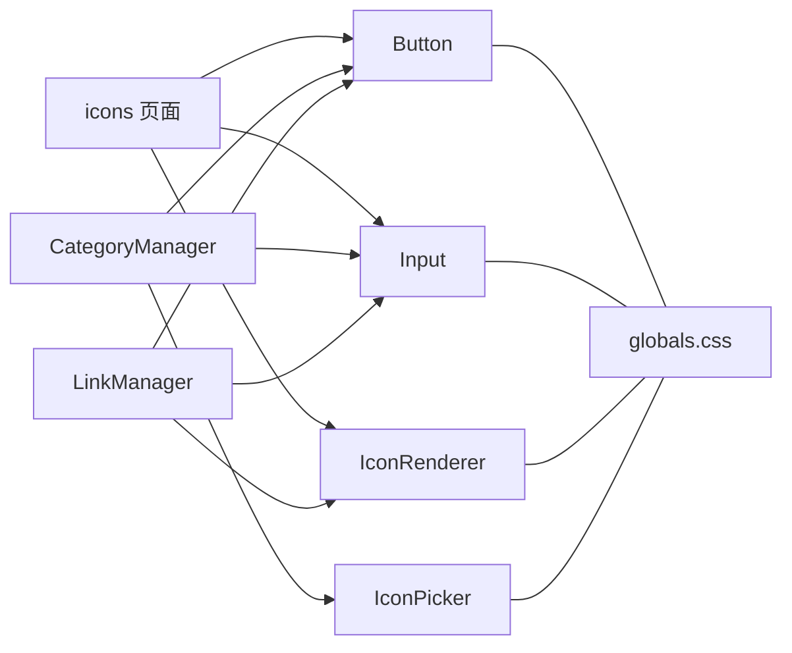
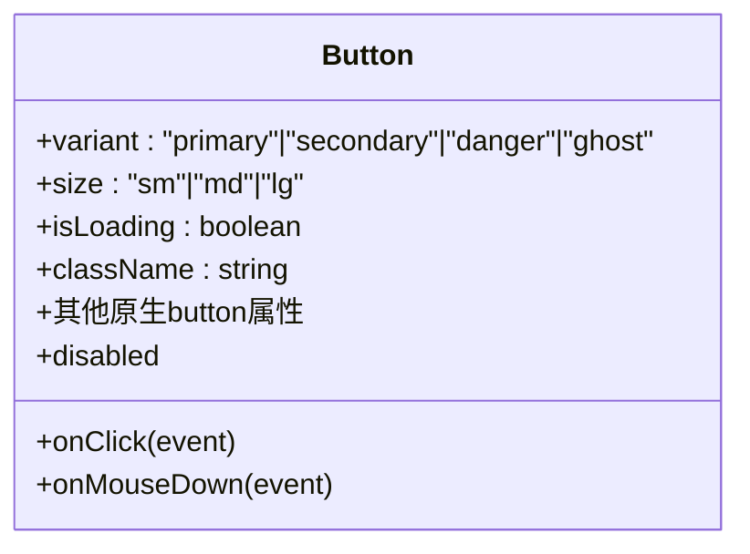
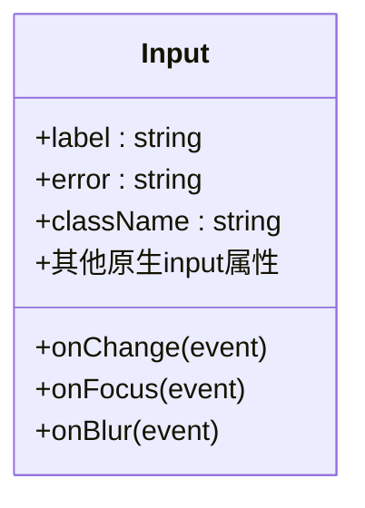
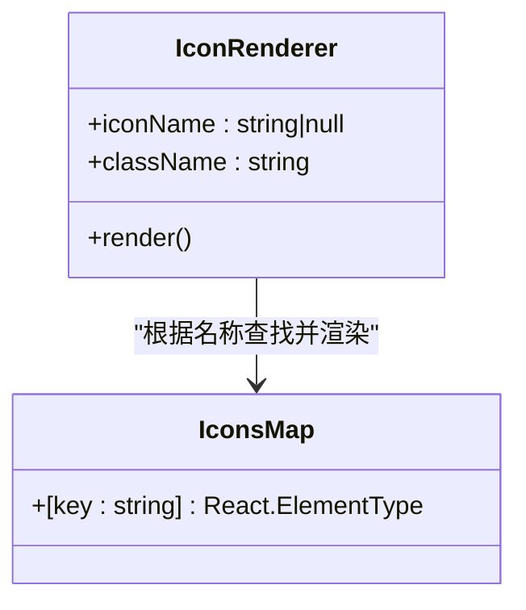
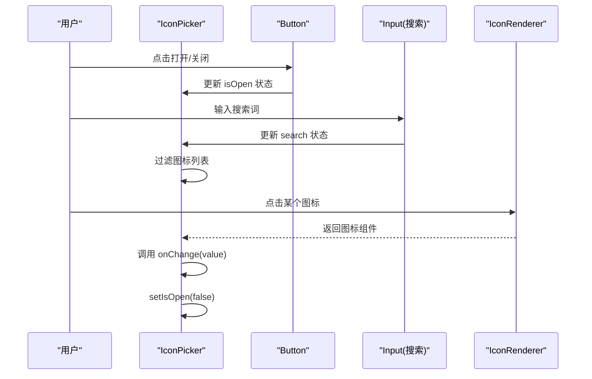
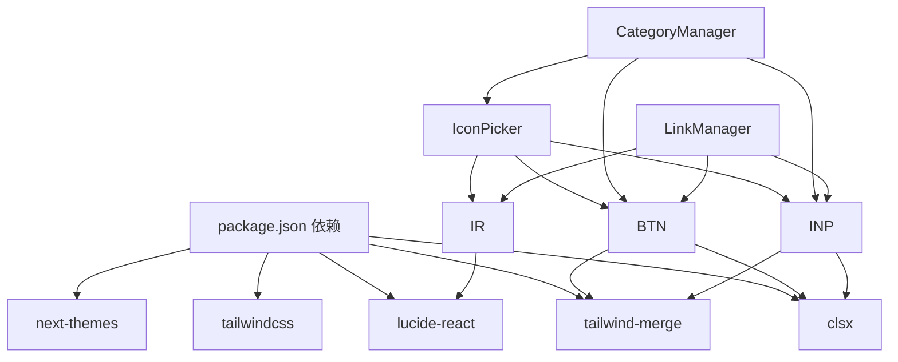

# UI组件库

<cite>
**本文档引用的文件**
- [Button.tsx](file://src/components/ui/Button.tsx)
- [Input.tsx](file://src/components/ui/Input.tsx)
- [IconRenderer.tsx](file://src/components/ui/IconRenderer.tsx)
- [IconPicker.tsx](file://src/components/ui/IconPicker.tsx)
- [CategoryManager.tsx](file://src/components/admin/CategoryManager.tsx)
- [LinkManager.tsx](file://src/components/admin/LinkManager.tsx)
- [icons 页面](file://src/app/admin/(dashboard)/icons/page.tsx)
- [globals.css](file://src/app/globals.css)
- [tailwind.config.js](file://tailwind.config.js)
- [package.json](file://package.json)
- [types/index.ts](file://src/types/index.ts)
</cite>

## 目录
1. [简介](#简介)
2. [项目结构](#项目结构)
3. [核心组件](#核心组件)
4. [架构总览](#架构总览)
5. [组件详细分析](#组件详细分析)
6. [依赖关系分析](#依赖关系分析)
7. [性能考量](#性能考量)
8. [故障排查指南](#故障排查指南)
9. [结论](#结论)
10. [附录](#附录)

## 简介
本文件为导航类应用的UI组件库文档，聚焦基础UI组件的设计理念与实现细节，覆盖 Button、Input、IconRenderer、IconPicker 四个核心组件。文档从属性与事件、使用方法、样式定制与主题支持、响应式行为、组合最佳实践与无障碍访问、状态管理与性能优化等方面进行系统阐述，并结合项目中真实页面的使用场景，帮助开发者快速理解与正确使用组件。

## 项目结构
UI组件位于 src/components/ui 下，采用按功能分层的组织方式；页面组件位于 src/app/admin 等目录，通过导入 UI 组件实现业务功能。Tailwind CSS 提供原子化样式与暗色模式支持，全局变量在 globals.css 中集中定义。

图表来源
- [Button.tsx](file://src/components/ui/Button.tsx#L1-L49)
- [Input.tsx](file://src/components/ui/Input.tsx#L1-L41)
- [IconRenderer.tsx](file://src/components/ui/IconRenderer.tsx#L1-L191)
- [IconPicker.tsx](file://src/components/ui/IconPicker.tsx#L1-L85)
- [icons 页面](file://src/app/admin/(dashboard)/icons/page.tsx#L1-L190)
- [CategoryManager.tsx](file://src/components/admin/CategoryManager.tsx#L1-L262)
- [LinkManager.tsx](file://src/components/admin/LinkManager.tsx#L1-L543)
- [globals.css](file://src/app/globals.css#L1-L30)
- [tailwind.config.js](file://tailwind.config.js#L1-L14)

章节来源
- [Button.tsx](file://src/components/ui/Button.tsx#L1-L49)
- [Input.tsx](file://src/components/ui/Input.tsx#L1-L41)
- [IconRenderer.tsx](file://src/components/ui/IconRenderer.tsx#L1-L191)
- [IconPicker.tsx](file://src/components/ui/IconPicker.tsx#L1-L85)
- [icons 页面](file://src/app/admin/(dashboard)/icons/page.tsx#L1-L190)
- [CategoryManager.tsx](file://src/components/admin/CategoryManager.tsx#L1-L262)
- [LinkManager.tsx](file://src/components/admin/LinkManager.tsx#L1-L543)
- [globals.css](file://src/app/globals.css#L1-L30)
- [tailwind.config.js](file://tailwind.config.js#L1-L14)

## 核心组件
本节对四个核心组件进行概览性说明，包括职责、对外接口与典型用法。

- Button：语义化按钮，支持多变体与尺寸、加载态禁用态控制，具备焦点环与过渡动画。
- Input：带标签与错误提示的输入框，支持错误态样式与无障碍标签绑定。
- IconRenderer：基于 lucide-react 的图标渲染器，通过字符串映射动态渲染图标。
- IconPicker：图标选择器，内含搜索、下拉面板、点击选择与外部点击关闭交互。

章节来源
- [Button.tsx](file://src/components/ui/Button.tsx#L9-L13)
- [Input.tsx](file://src/components/ui/Input.tsx#L9-L12)
- [IconRenderer.tsx](file://src/components/ui/IconRenderer.tsx#L93-L183)
- [IconPicker.tsx](file://src/components/ui/IconPicker.tsx#L8-L11)

## 架构总览
组件间协作关系如下：页面组件通过导入 UI 组件完成功能拼装；IconPicker 内部复用 Button 与 Input，并通过 IconRenderer 渲染图标；全局样式通过 Tailwind 与 CSS 变量统一风格与主题。

图表来源
- [icons 页面](file://src/app/admin/(dashboard)/icons/page.tsx#L1-L190)
- [CategoryManager.tsx](file://src/components/admin/CategoryManager.tsx#L1-L262)
- [LinkManager.tsx](file://src/components/admin/LinkManager.tsx#L1-L543)
- [Button.tsx](file://src/components/ui/Button.tsx#L1-L49)
- [Input.tsx](file://src/components/ui/Input.tsx#L1-L41)
- [IconRenderer.tsx](file://src/components/ui/IconRenderer.tsx#L1-L191)
- [IconPicker.tsx](file://src/components/ui/IconPicker.tsx#L1-L85)
- [globals.css](file://src/app/globals.css#L1-L30)

## 组件详细分析

### Button 组件
- 设计理念
  - 以语义化 HTML button 为基础，扩展变体与尺寸，统一焦点环与过渡效果，提升可访问性与一致性。
  - 支持 isLoading 状态，内部合并禁用态逻辑，避免重复处理。
- 关键属性
  - variant: 'primary' | 'secondary' | 'danger' | 'ghost'
  - size: 'sm' | 'md' | 'lg'
  - isLoading: boolean
  - className: 透传额外样式
  - 其余继承自原生 button 属性
- 事件与行为
  - 透传原生 button 的所有事件（如 onClick、onMouseDown 等）
  - 当 isLoading 或 disabled 为真时禁用交互
  - 加载态显示旋转指示器
- 样式与主题
  - 使用 Tailwind 原子类与 twMerge/clsx 合并类名，确保样式覆盖顺序正确
  - 暗色模式下通过 focus-visible:ring-* 与 dark:* 类实现适配
- 响应式与无障碍
  - 默认 inline-flex 居中对齐，配合 size 控制高度与内边距
  - 通过 focus-visible:outline-none 与 focus-visible:ring-* 提升键盘可达性
- 使用示例与场景
  - 表单提交、危险操作、次级操作、列表项操作等
  - 在 icons 页面与 CategoryManager 中均有使用

章节来源
- [Button.tsx](file://src/components/ui/Button.tsx#L9-L13)
- [Button.tsx](file://src/components/ui/Button.tsx#L15-L46)
- [icons 页面](file://src/app/admin/(dashboard)/icons/page.tsx#L151-L158)
- [CategoryManager.tsx](file://src/components/admin/CategoryManager.tsx#L160-L254)

#### Button 组件类图

图表来源
- [Button.tsx](file://src/components/ui/Button.tsx#L9-L13)

### Input 组件
- 设计理念
  - 封装 label 与错误提示，提供统一的输入框外观与错误态样式
  - 通过 className 与条件类合并，保证可扩展性
- 关键属性
  - label: string（可选）
  - error: string（可选，存在时进入错误态）
  - className: 透传额外样式
  - 其余继承自原生 input
- 事件与行为
  - 透传原生 input 的所有事件
  - 错误态下渲染错误文本
- 样式与主题
  - 暗色模式下通过 dark:* 类实现适配
  - 统一圆角、边框、阴影与聚焦态颜色
- 响应式与无障碍
  - 提供无障碍 label 绑定，便于屏幕阅读器识别
- 使用示例与场景
  - 表单字段、配置项输入、搜索框等
  - 在 icons 页面与 CategoryManager 中均有使用

章节来源
- [Input.tsx](file://src/components/ui/Input.tsx#L9-L12)
- [Input.tsx](file://src/components/ui/Input.tsx#L14-L38)
- [icons 页面](file://src/app/admin/(dashboard)/icons/page.tsx#L104-L149)
- [CategoryManager.tsx](file://src/components/admin/CategoryManager.tsx#L213-L235)

#### Input 组件类图

图表来源
- [Input.tsx](file://src/components/ui/Input.tsx#L9-L12)

### IconRenderer 组件
- 设计理念
  - 将 lucide-react 图标集合映射为字符串到组件的字典，通过字符串名动态渲染图标
  - 为空或不存在时安全返回 null，避免运行时错误
- 关键属性
  - iconName: string | null
  - className: string（可选）
- 事件与行为
  - 无事件，纯展示组件
- 样式与主题
  - 通过 className 控制尺寸与颜色，配合暗色模式下的颜色策略
- 使用示例与场景
  - 在页面标题、按钮前缀、列表图标等场景中渲染图标
  - 在 icons 页面与 LinkManager 中均有使用

章节来源
- [IconRenderer.tsx](file://src/components/ui/IconRenderer.tsx#L93-L183)
- [IconRenderer.tsx](file://src/components/ui/IconRenderer.tsx#L185-L190)
- [icons 页面](file://src/app/admin/(dashboard)/icons/page.tsx#L100-L101)
- [LinkManager.tsx](file://src/components/admin/LinkManager.tsx#L39-L41)

#### IconRenderer 组件类图

图表来源
- [IconRenderer.tsx](file://src/components/ui/IconRenderer.tsx#L93-L183)
- [IconRenderer.tsx](file://src/components/ui/IconRenderer.tsx#L185-L190)

### IconPicker 组件
- 设计理念
  - 提供图标选择与搜索能力，内部维护展开/收起状态、搜索词与点击外部关闭逻辑
  - 与 Button、Input、IconRenderer 协作，形成完整的图标选择体验
- 关键属性
  - value: string（当前选中的图标名）
  - onChange: (value: string) => void（选中图标时回调）
- 事件与行为
  - 打开/关闭下拉面板
  - 输入搜索关键词过滤图标列表
  - 点击图标选择并关闭面板
  - 点击组件外部区域关闭面板
- 样式与主题
  - 暗色模式下通过 dark:* 类实现适配
  - 使用网格布局展示图标，支持滚动
- 响应式与无障碍
  - 使用 aria-hidden 与 sr-only 文本提升可访问性
- 使用示例与场景
  - 分类管理中为分类设置图标
  - 在 CategoryManager 的弹窗中使用

章节来源
- [IconPicker.tsx](file://src/components/ui/IconPicker.tsx#L8-L11)
- [IconPicker.tsx](file://src/components/ui/IconPicker.tsx#L13-L84)
- [CategoryManager.tsx](file://src/components/admin/CategoryManager.tsx#L224-L228)

#### IconPicker 交互序列图

图表来源
- [IconPicker.tsx](file://src/components/ui/IconPicker.tsx#L13-L84)
- [IconRenderer.tsx](file://src/components/ui/IconRenderer.tsx#L185-L190)

### 组件组合与页面集成
- icons 页面
  - 使用 Input 与 Button 实现 R2 配置表单，Button 支持 isLoading
  - 使用 IconRenderer 渲染页面标题图标
- CategoryManager
  - 使用 Input、Button、IconPicker 构建分类新增/编辑弹窗
  - 通过 router.refresh() 与本地状态同步，避免重复渲染
- LinkManager
  - 使用 Button、Input、IconRenderer 实现链接管理界面
  - 结合 @dnd-kit 实现拖拽排序，更新本地状态并调用后端接口

章节来源
- [icons 页面](file://src/app/admin/(dashboard)/icons/page.tsx#L93-L189)
- [CategoryManager.tsx](file://src/components/admin/CategoryManager.tsx#L156-L261)
- [LinkManager.tsx](file://src/components/admin/LinkManager.tsx#L345-L542)

## 依赖关系分析
- 组件依赖
  - Button、Input、IconRenderer、IconPicker 均为纯函数组件，依赖 react 与样式工具
  - IconPicker 依赖 Button、Input、IconRenderer
  - 页面组件依赖 UI 组件与类型定义
- 外部依赖
  - lucide-react：图标库
  - clsx、tailwind-merge：类名合并
  - tailwindcss：原子化样式
  - next-themes：主题切换（用于页面级主题管理）

图表来源
- [package.json](file://package.json#L12-L31)
- [IconPicker.tsx](file://src/components/ui/IconPicker.tsx#L1-L85)
- [Button.tsx](file://src/components/ui/Button.tsx#L1-L49)
- [Input.tsx](file://src/components/ui/Input.tsx#L1-L41)
- [IconRenderer.tsx](file://src/components/ui/IconRenderer.tsx#L1-L191)
- [CategoryManager.tsx](file://src/components/admin/CategoryManager.tsx#L1-L262)
- [LinkManager.tsx](file://src/components/admin/LinkManager.tsx#L1-L543)

章节来源
- [package.json](file://package.json#L12-L31)
- [IconPicker.tsx](file://src/components/ui/IconPicker.tsx#L1-L85)
- [Button.tsx](file://src/components/ui/Button.tsx#L1-L49)
- [Input.tsx](file://src/components/ui/Input.tsx#L1-L41)
- [IconRenderer.tsx](file://src/components/ui/IconRenderer.tsx#L1-L191)
- [CategoryManager.tsx](file://src/components/admin/CategoryManager.tsx#L1-L262)
- [LinkManager.tsx](file://src/components/admin/LinkManager.tsx#L1-L543)

## 性能考量
- 类名合并
  - 使用 clsx 与 tailwind-merge 合并类名，减少冲突与冗余样式，降低渲染成本
- 动态图标渲染
  - IconRenderer 通过映射表查找图标组件，避免运行时解析复杂路径
- 下拉面板
  - IconPicker 使用受控状态与外部点击关闭，避免不必要的全局监听
- 拖拽排序
  - LinkManager 使用 @dnd-kit，仅在目标范围内进行状态更新，减少全量重渲染
- 暗色模式
  - 通过 CSS 变量与 Tailwind dark:* 类实现主题切换，避免运行时样式计算

章节来源
- [Button.tsx](file://src/components/ui/Button.tsx#L5-L7)
- [Input.tsx](file://src/components/ui/Input.tsx#L5-L7)
- [IconRenderer.tsx](file://src/components/ui/IconRenderer.tsx#L93-L183)
- [IconPicker.tsx](file://src/components/ui/IconPicker.tsx#L13-L84)
- [LinkManager.tsx](file://src/components/admin/LinkManager.tsx#L372-L392)

## 故障排查指南
- 图标不显示
  - 检查传入的 iconName 是否存在于 IconsMap，若为 null 或不存在则返回 null
  - 确认 className 是否正确传递尺寸与颜色
- 下拉面板无法关闭
  - 确认是否正确绑定外部点击事件，检查 wrapperRef 是否正确挂载
- 暗色模式样式异常
  - 检查 CSS 变量与 dark:* 类是否生效，确认 tailwind.config.js 的 darkMode 设置
- 表单提交无效
  - 检查 Button 的 isLoading 与 disabled 状态是否被正确设置
  - 确认 Input 的 error 字段是否导致样式覆盖

章节来源
- [IconRenderer.tsx](file://src/components/ui/IconRenderer.tsx#L185-L190)
- [IconPicker.tsx](file://src/components/ui/IconPicker.tsx#L22-L30)
- [globals.css](file://src/app/globals.css#L1-L30)
- [tailwind.config.js](file://tailwind.config.js#L1-L14)
- [Button.tsx](file://src/components/ui/Button.tsx#L15-L46)
- [Input.tsx](file://src/components/ui/Input.tsx#L14-L38)

## 结论
本 UI 组件库以简洁、可组合为核心设计原则：Button 与 Input 提供一致的交互与视觉反馈；IconRenderer 与 IconPicker 通过字符串映射与受控状态实现灵活的图标选择体验。结合 Tailwind 原子化样式与暗色模式支持，组件在可访问性、主题一致性与性能方面均表现良好。建议在业务组件中遵循受控状态与最小化渲染的原则，进一步提升整体性能与可维护性。

## 附录

### 样式定制与主题支持
- 全局样式
  - 通过 CSS 变量统一背景、前景色与导航背景色，暗色模式下保持一致的视觉体验
- Tailwind 配置
  - 启用 class 形式的暗色模式，确保 dark:* 类可用
- 组件样式
  - Button 与 Input 使用原子类与 twMerge 合并，支持 className 扩展
  - IconRenderer 通过 className 控制图标尺寸与颜色

章节来源
- [globals.css](file://src/app/globals.css#L3-L29)
- [tailwind.config.js](file://tailwind.config.js#L3-L3)
- [Button.tsx](file://src/components/ui/Button.tsx#L21-L33)
- [Input.tsx](file://src/components/ui/Input.tsx#L25-L31)
- [IconRenderer.tsx](file://src/components/ui/IconRenderer.tsx#L185-L190)

### 响应式行为
- 组件层面
  - Button 与 Input 默认使用 flex 与居中对齐，尺寸通过 size 控制
  - IconPicker 下拉面板使用固定宽度与最大高度，超出部分滚动
- 页面层面
  - icons 页面与 CategoryManager 使用栅格布局与响应式断点，适配不同屏幕尺寸

章节来源
- [Button.tsx](file://src/components/ui/Button.tsx#L28-L30)
- [Input.tsx](file://src/components/ui/Input.tsx#L17-L36)
- [IconPicker.tsx](file://src/components/ui/IconPicker.tsx#L50-L81)
- [icons 页面](file://src/app/admin/(dashboard)/icons/page.tsx#L94-L189)
- [CategoryManager.tsx](file://src/components/admin/CategoryManager.tsx#L156-L261)

### 组合最佳实践
- 表单场景
  - 使用 Input 提供 label 与错误提示，Button 提供提交与加载态
- 图标选择场景
  - 使用 IconPicker 承载搜索与选择逻辑，IconRenderer 渲染预览
- 数据管理场景
  - LinkManager 展示与排序，CategoryManager 新增/编辑，均通过受控状态与 API 调用保持数据一致性

章节来源
- [icons 页面](file://src/app/admin/(dashboard)/icons/page.tsx#L104-L158)
- [CategoryManager.tsx](file://src/components/admin/CategoryManager.tsx#L224-L254)
- [LinkManager.tsx](file://src/components/admin/LinkManager.tsx#L370-L418)

### 无障碍访问指南
- 语义化标签
  - Input 使用 label 与 htmlFor 绑定，提升屏幕阅读器可访问性
- 焦点管理
  - Button 使用 focus-visible:outline-none 与 focus-visible:ring-*，确保键盘可达
- 对话框与弹层
  - 使用 @headlessui/react 的 Dialog 组件，提供 aria-hidden 与键盘关闭支持
- 图标与文本
  - IconRenderer 仅渲染图标，避免替代文本；必要时通过相邻文本或 title 属性补充语义

章节来源
- [Input.tsx](file://src/components/ui/Input.tsx#L18-L22)
- [Button.tsx](file://src/components/ui/Button.tsx#L18-L22)
- [CategoryManager.tsx](file://src/components/admin/CategoryManager.tsx#L205-L258)
- [IconPicker.tsx](file://src/components/ui/IconPicker.tsx#L33-L83)

### 状态管理与性能优化技巧
- 受控组件
  - IconPicker 使用 useState 管理 isOpen 与 search，避免全局状态污染
- 事件处理
  - 使用 useRef 缓存提交状态，避免重复提交
- 渲染优化
  - 使用 useMemo 缓存过滤后的链接列表，减少不必要的重渲染
- 主题切换
  - 通过 CSS 变量与 Tailwind dark:* 类实现主题切换，避免运行时样式计算

章节来源
- [IconPicker.tsx](file://src/components/ui/IconPicker.tsx#L14-L30)
- [LinkManager.tsx](file://src/components/admin/LinkManager.tsx#L110-L130)
- [LinkManager.tsx](file://src/components/admin/LinkManager.tsx#L148-L149)
- [globals.css](file://src/app/globals.css#L3-L15)