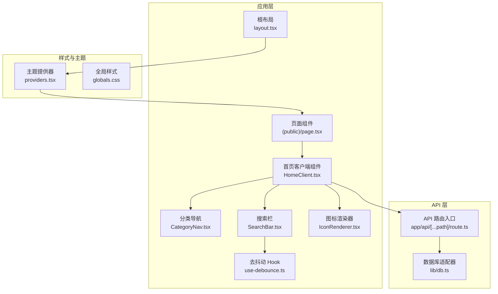
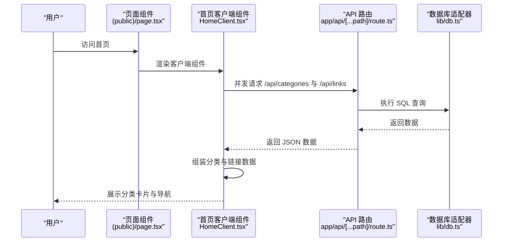
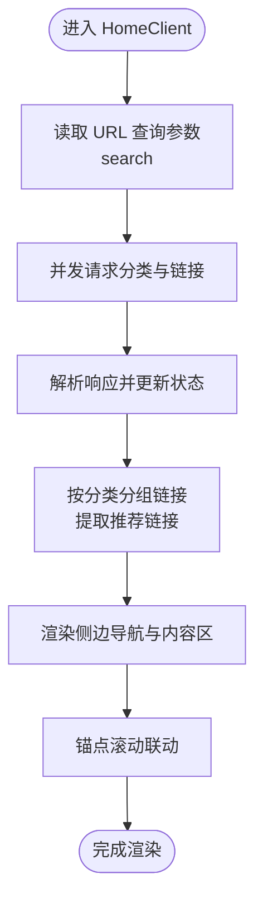
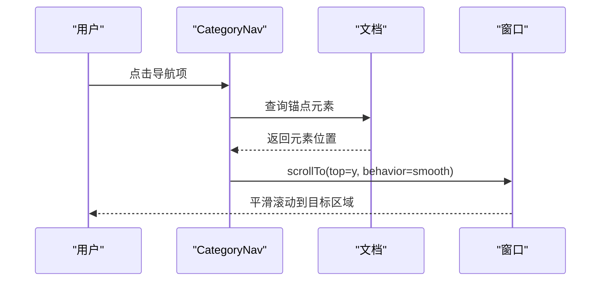
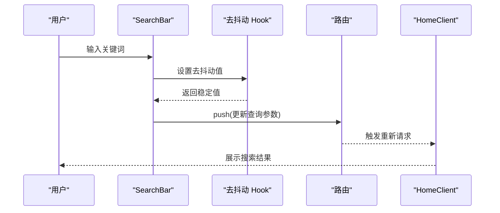
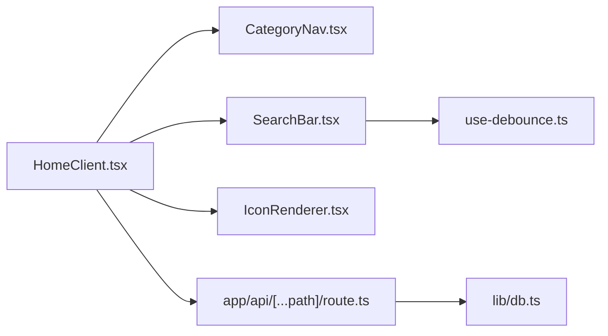

# 公共展示组件

<cite>
**本文引用的文件**
- [src/app/(public)/page.tsx](file://src/app/(public)/page.tsx)
- [src/app/layout.tsx](file://src/app/layout.tsx)
- [src/components/public/HomeClient.tsx](file://src/components/public/HomeClient.tsx)
- [src/components/public/CategoryNav.tsx](file://src/components/public/CategoryNav.tsx)
- [src/components/public/SearchBar.tsx](file://src/components/public/SearchBar.tsx)
- [src/components/ui/IconRenderer.tsx](file://src/components/ui/IconRenderer.tsx)
- [src/hooks/use-debounce.ts](file://src/hooks/use-debounce.ts)
- [src/types/index.ts](file://src/types/index.ts)
- [src/app/api/[...path]/route.ts](file://src/app/api/[...path]/route.ts)
- [src/components/providers.tsx](file://src/components/providers.tsx)
- [src/app/globals.css](file://src/app/globals.css)
- [src/lib/db.ts](file://src/lib/db.ts)
</cite>

## 目录
1. [简介](#简介)
2. [项目结构](#项目结构)
3. [核心组件](#核心组件)
4. [架构总览](#架构总览)
5. [组件详解](#组件详解)
6. [依赖关系分析](#依赖关系分析)
7. [性能考量](#性能考量)
8. [故障排查指南](#故障排查指南)
9. [结论](#结论)
10. [附录](#附录)

## 简介
本文件聚焦于公共展示组件的设计与实现，覆盖首页客户端渲染组件 HomeClient、分类导航 CategoryNav、搜索栏 SearchBar 的功能特性、交互设计与数据流。文档同时说明组件与后端 API 的数据交互与状态同步机制，并提供前端性能优化与用户体验提升建议，以及 SEO 与可访问性设计要点。

## 项目结构
公共展示组件位于应用的公共区域，采用客户端组件模式，结合 Next.js App Router 的布局与路由系统，通过 Suspense 提供首屏加载占位，配合主题提供器实现深色/浅色主题切换。

图表来源
- [src/app/layout.tsx](file://src/app/layout.tsx#L25-L39)
- [src/app/(public)/page.tsx](file://src/app/(public)/page.tsx#L4-L12)
- [src/components/public/HomeClient.tsx](file://src/components/public/HomeClient.tsx#L12-L45)
- [src/components/public/CategoryNav.tsx](file://src/components/public/CategoryNav.tsx#L10-L44)
- [src/components/public/SearchBar.tsx](file://src/components/public/SearchBar.tsx#L8-L53)
- [src/components/ui/IconRenderer.tsx](file://src/components/ui/IconRenderer.tsx#L185-L190)
- [src/hooks/use-debounce.ts](file://src/hooks/use-debounce.ts#L3-L14)
- [src/app/api/[...path]/route.ts](file://src/app/api/[...path]/route.ts#L12-L47)
- [src/components/providers.tsx](file://src/components/providers.tsx#L6-L23)
- [src/app/globals.css](file://src/app/globals.css#L1-L30)
- [src/lib/db.ts](file://src/lib/db.ts#L12-L68)

章节来源
- [src/app/layout.tsx](file://src/app/layout.tsx#L15-L23)
- [src/app/(public)/page.tsx](file://src/app/(public)/page.tsx#L4-L12)

## 核心组件
- 首页客户端组件 HomeClient：负责首页数据拉取、分组展示、侧边导航联动与搜索结果呈现。
- 分类导航 CategoryNav：提供侧边固定导航，支持“常用推荐”与各分类的平滑滚动定位。
- 搜索栏 SearchBar：支持输入去抖动、快捷键聚焦、清空与外部搜索引擎跳转。

章节来源
- [src/components/public/HomeClient.tsx](file://src/components/public/HomeClient.tsx#L12-L45)
- [src/components/public/CategoryNav.tsx](file://src/components/public/CategoryNav.tsx#L10-L44)
- [src/components/public/SearchBar.tsx](file://src/components/public/SearchBar.tsx#L8-L53)

## 架构总览
公共展示组件围绕“客户端渲染 + 服务端 API”的架构展开。页面组件通过 Suspense 提供首屏骨架，HomeClient 在客户端并发拉取分类与链接数据，按分类分组展示；SearchBar 通过 URL 查询参数驱动数据刷新；CategoryNav 与页面锚点联动实现平滑滚动。

图表来源
- [src/app/(public)/page.tsx](file://src/app/(public)/page.tsx#L4-L12)
- [src/components/public/HomeClient.tsx](file://src/components/public/HomeClient.tsx#L20-L45)
- [src/app/api/[...path]/route.ts](file://src/app/api/[...path]/route.ts#L22-L29)
- [src/lib/db.ts](file://src/lib/db.ts#L12-L68)

## 组件详解

### 首页客户端组件 HomeClient
- 功能概述
  - 读取 URL 查询参数中的搜索词，触发数据刷新。
  - 并发请求分类列表与链接列表，解析响应并更新状态。
  - 将链接按分类分组，同时提取“常用推荐”链接。
  - 渲染侧边导航（含“常用推荐”）、搜索结果标题、推荐区与各分类区。
- 关键交互
  - 使用 Suspense 提供首屏加载指示。
  - 侧边导航点击触发页面锚点平滑滚动。
  - 搜索词为空时仅显示分类内容，非空时显示“搜索结果”标题。
- 数据模型
  - 使用 Category 与 Link 类型，统一响应体 ApiResponse。
- 性能与体验
  - 并发请求减少等待时间。
  - 骨架屏提升感知性能。
  - 卡片悬停缩放与渐变背景增强交互反馈。

图表来源
- [src/components/public/HomeClient.tsx](file://src/components/public/HomeClient.tsx#L12-L45)
- [src/components/public/HomeClient.tsx](file://src/components/public/HomeClient.tsx#L47-L59)
- [src/components/public/HomeClient.tsx](file://src/components/public/HomeClient.tsx#L61-L67)
- [src/components/public/HomeClient.tsx](file://src/components/public/HomeClient.tsx#L166-L225)

章节来源
- [src/components/public/HomeClient.tsx](file://src/components/public/HomeClient.tsx#L12-L45)
- [src/components/public/HomeClient.tsx](file://src/components/public/HomeClient.tsx#L47-L59)
- [src/components/public/HomeClient.tsx](file://src/components/public/HomeClient.tsx#L61-L67)
- [src/components/public/HomeClient.tsx](file://src/components/public/HomeClient.tsx#L166-L225)
- [src/types/index.ts](file://src/types/index.ts#L9-L19)
- [src/types/index.ts](file://src/types/index.ts#L21-L34)

### 分类导航 CategoryNav
- 功能概述
  - 接收分类数组与“是否有推荐”标志，渲染导航项。
  - 支持“常用推荐”与每个分类的锚点跳转。
  - 点击时计算目标元素位置并执行平滑滚动。
- 交互设计
  - 图标随悬停变化颜色，提供视觉反馈。
  - 导航项圆角与悬停背景色提升可点击性。

图表来源
- [src/components/public/CategoryNav.tsx](file://src/components/public/CategoryNav.tsx#L10-L17)
- [src/components/public/CategoryNav.tsx](file://src/components/public/CategoryNav.tsx#L31-L41)

章节来源
- [src/components/public/CategoryNav.tsx](file://src/components/public/CategoryNav.tsx#L10-L44)

### 搜索栏 SearchBar
- 功能概述
  - 受控输入框，支持清空与快捷键聚焦（Ctrl/Cmd + K）。
  - 输入值经去抖动后写入 URL 查询参数，驱动首页刷新。
  - 显示外部搜索引擎（Google、Bing）快速跳转按钮。
- 关键实现
  - 使用 useDebounce 控制请求频率。
  - 使用 useRouter 与 useSearchParams 更新 URL。
  - 通过 ref 获取焦点，提升键盘可达性。

图表来源
- [src/components/public/SearchBar.tsx](file://src/components/public/SearchBar.tsx#L8-L25)
- [src/hooks/use-debounce.ts](file://src/hooks/use-debounce.ts#L3-L14)
- [src/components/public/HomeClient.tsx](file://src/components/public/HomeClient.tsx#L12-L14)

章节来源
- [src/components/public/SearchBar.tsx](file://src/components/public/SearchBar.tsx#L8-L53)
- [src/hooks/use-debounce.ts](file://src/hooks/use-debounce.ts#L3-L14)

### 图标渲染器 IconRenderer
- 功能概述
  - 通过图标名映射到 lucide-react 对应组件，统一图标渲染方式。
  - 支持传入 className 自定义尺寸与样式。
- 设计意义
  - 解耦图标使用与具体库版本，便于维护与替换。

章节来源
- [src/components/ui/IconRenderer.tsx](file://src/components/ui/IconRenderer.tsx#L185-L190)

### 主题与全局样式
- 主题提供器 Providers：延迟挂载避免水合不一致，使用系统默认主题。
- 全局样式：强制深色主题变量，确保暗色体验一致性。

章节来源
- [src/components/providers.tsx](file://src/components/providers.tsx#L6-L23)
- [src/app/globals.css](file://src/app/globals.css#L3-L15)

## 依赖关系分析
- 组件依赖
  - HomeClient 依赖 CategoryNav、SearchBar、IconRenderer，以及 URL 查询参数与路由。
  - SearchBar 依赖去抖动 Hook 与路由工具。
  - CategoryNav 依赖 IconRenderer。
- API 交互
  - 首页并发调用 /api/categories 与 /api/links。
  - API 路由根据路径分发至不同处理器，最终通过数据库适配器执行 SQL。

图表来源
- [src/components/public/HomeClient.tsx](file://src/components/public/HomeClient.tsx#L6-L8)
- [src/components/public/CategoryNav.tsx](file://src/components/public/CategoryNav.tsx#L2-L3)
- [src/components/public/SearchBar.tsx](file://src/components/public/SearchBar.tsx#L3-L6)
- [src/hooks/use-debounce.ts](file://src/hooks/use-debounce.ts#L1-L15)
- [src/app/api/[...path]/route.ts](file://src/app/api/[...path]/route.ts#L12-L47)
- [src/lib/db.ts](file://src/lib/db.ts#L12-L68)

章节来源
- [src/app/api/[...path]/route.ts](file://src/app/api/[...path]/route.ts#L12-L47)
- [src/lib/db.ts](file://src/lib/db.ts#L12-L68)

## 性能考量
- 并发请求
  - 首页使用 Promise.all 同时请求分类与链接，降低整体等待时间。
- 去抖动输入
  - 搜索输入使用去抖动，减少无效网络请求与重渲染。
- 骨架屏与懒加载
  - 首屏使用骨架屏占位，卡片采用渐进式悬停效果，提升感知性能。
- 图标与样式
  - IconRenderer 复用 lucide-react 组件，避免重复实现；全局样式集中管理，减少样式抖动。
- SSR/CSR 混合
  - 页面组件通过 Suspense 提供首屏占位，提升首屏可交互时间。

章节来源
- [src/components/public/HomeClient.tsx](file://src/components/public/HomeClient.tsx#L20-L45)
- [src/hooks/use-debounce.ts](file://src/hooks/use-debounce.ts#L3-L14)
- [src/components/public/HomeClient.tsx](file://src/components/public/HomeClient.tsx#L61-L67)

## 故障排查指南
- 首屏空白或长时间加载
  - 检查 API 是否返回成功字段与数据结构是否符合预期。
  - 确认 Suspense 占位是否正确渲染。
- 搜索无结果或无法跳转
  - 核对 URL 查询参数是否被正确写入与读取。
  - 确认去抖动延迟设置是否合理。
- 锚点滚动无效
  - 检查目标元素选择器与页面锚点是否存在。
  - 确认滚动偏移量计算逻辑。
- 主题不生效或闪烁
  - 确认 Providers 已包裹应用根节点，且 mounted 状态已设置。
  - 检查全局样式变量是否正确注入。

章节来源
- [src/app/(public)/page.tsx](file://src/app/(public)/page.tsx#L6-L10)
- [src/components/public/SearchBar.tsx](file://src/components/public/SearchBar.tsx#L16-L25)
- [src/components/public/CategoryNav.tsx](file://src/components/public/CategoryNav.tsx#L10-L17)
- [src/components/providers.tsx](file://src/components/providers.tsx#L6-L23)

## 结论
公共展示组件以简洁清晰的职责划分实现了首页导航、分类浏览与搜索功能。通过并发请求、去抖动与骨架屏等手段优化了用户体验，配合统一的图标渲染与主题系统，保证了视觉一致性与可维护性。后续可在搜索结果排序、分类缓存与 SEO 元信息方面进一步完善。

## 附录

### 使用示例
- 首页展示
  - 访问首页，自动加载分类与链接；若存在搜索词，则显示“搜索结果”标题与对应内容。
- 分类导航
  - 点击侧边导航项，页面平滑滚动至对应分类区域；若存在“常用推荐”，可直接跳转至推荐区。
- 搜索功能
  - 在搜索栏输入关键词，300ms 去抖后更新 URL 查询参数，首页自动刷新；支持清空与快捷键聚焦。

章节来源
- [src/app/(public)/page.tsx](file://src/app/(public)/page.tsx#L4-L12)
- [src/components/public/HomeClient.tsx](file://src/components/public/HomeClient.tsx#L103-L109)
- [src/components/public/CategoryNav.tsx](file://src/components/public/CategoryNav.tsx#L21-L30)
- [src/components/public/SearchBar.tsx](file://src/components/public/SearchBar.tsx#L16-L25)

### 数据交互与状态同步
- 请求流程
  - 首页并发请求 /api/categories 与 /api/links，解析响应后更新状态。
  - 搜索栏通过去抖动更新 URL 查询参数，触发首页重新请求。
- 状态管理
  - 首页使用 useState 管理分类、链接与加载状态；导航与卡片渲染基于当前状态。
- API 路由
  - 路由根据路径分发到分类与链接处理器，最终通过数据库适配器执行 SQL。

章节来源
- [src/components/public/HomeClient.tsx](file://src/components/public/HomeClient.tsx#L20-L45)
- [src/components/public/SearchBar.tsx](file://src/components/public/SearchBar.tsx#L16-L25)
- [src/app/api/[...path]/route.ts](file://src/app/api/[...path]/route.ts#L22-L29)
- [src/lib/db.ts](file://src/lib/db.ts#L12-L68)

### SEO 与可访问性设计
- SEO
  - 根布局提供站点标题与描述元信息，便于搜索引擎抓取。
  - 链接卡片使用 a 标签与 target="_blank" rel="noopener noreferrer"，确保外链安全。
- 可访问性
  - 搜索栏支持键盘快捷键聚焦，提升键盘用户效率。
  - 导航项使用语义化链接，锚点滚动提供无障碍定位。
  - 图标使用 IconRenderer 渲染，保持一致的视觉语言。

章节来源
- [src/app/layout.tsx](file://src/app/layout.tsx#L15-L23)
- [src/components/public/SearchBar.tsx](file://src/components/public/SearchBar.tsx#L27-L37)
- [src/components/public/HomeClient.tsx](file://src/components/public/HomeClient.tsx#L180-L185)