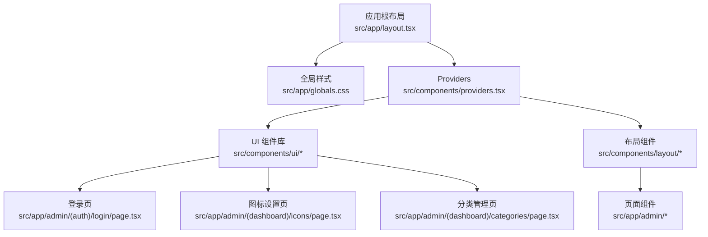
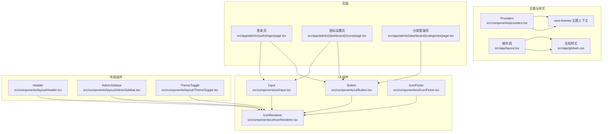
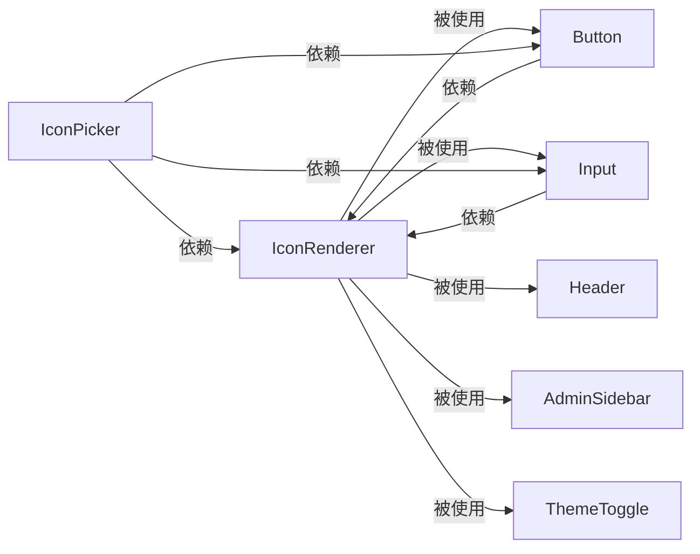

# 前端组件架构

<cite>
**本文引用的文件**
- [src/components/ui/Button.tsx](file://src/components/ui/Button.tsx)
- [src/components/ui/Input.tsx](file://src/components/ui/Input.tsx)
- [src/components/ui/IconPicker.tsx](file://src/components/ui/IconPicker.tsx)
- [src/components/ui/IconRenderer.tsx](file://src/components/ui/IconRenderer.tsx)
- [src/components/layout/AdminSidebar.tsx](file://src/components/layout/AdminSidebar.tsx)
- [src/components/layout/Header.tsx](file://src/components/layout/Header.tsx)
- [src/components/layout/ThemeToggle.tsx](file://src/components/layout/ThemeToggle.tsx)
- [src/components/providers.tsx](file://src/components/providers.tsx)
- [src/app/layout.tsx](file://src/app/layout.tsx)
- [src/app/globals.css](file://src/app/globals.css)
- [src/app/admin/(auth)/login/page.tsx](file://src/app/admin/(auth)/login/page.tsx)
- [src/app/admin/(dashboard)/icons/page.tsx](file://src/app/admin/(dashboard)/icons/page.tsx)
- [src/app/admin/(dashboard)/categories/page.tsx](file://src/app/admin/(dashboard)/categories/page.tsx)
- [src/types/index.ts](file://src/types/index.ts)
- [package.json](file://package.json)
</cite>

## 目录
1. [简介](#简介)
2. [项目结构](#项目结构)
3. [核心组件](#核心组件)
4. [架构总览](#架构总览)
5. [组件详解](#组件详解)
6. [依赖关系分析](#依赖关系分析)
7. [性能与可访问性](#性能与可访问性)
8. [故障排查指南](#故障排查指南)
9. [结论](#结论)
10. [附录：使用示例与最佳实践](#附录使用示例与最佳实践)

## 简介
本文件系统化梳理了本项目的UI组件架构，聚焦于按钮、输入框、图标选择器与渲染器等基础UI组件，以及它们在头部导航、侧边栏、主题切换与登录页中的实际应用。文档覆盖组件的视觉外观、行为与交互模式，记录属性（props）、事件、插槽与自定义选项；提供响应式设计与无障碍合规建议；说明样式自定义与主题支持；并给出跨浏览器兼容性与性能优化策略。

## 项目结构
项目采用按功能分层的组织方式：应用根布局负责全局主题与字体注入；组件目录下包含通用UI组件与布局组件；页面目录承载业务页面并与组件协作。

图表来源
- [src/app/layout.tsx](file://src/app/layout.tsx#L25-L39)
- [src/app/globals.css](file://src/app/globals.css#L1-L30)
- [src/components/providers.tsx](file://src/components/providers.tsx#L6-L23)
- [src/components/ui/Button.tsx](file://src/components/ui/Button.tsx#L15-L48)
- [src/components/ui/Input.tsx](file://src/components/ui/Input.tsx#L14-L40)
- [src/components/ui/IconPicker.tsx](file://src/components/ui/IconPicker.tsx#L13-L84)
- [src/components/ui/IconRenderer.tsx](file://src/components/ui/IconRenderer.tsx#L185-L190)
- [src/components/layout/AdminSidebar.tsx](file://src/components/layout/AdminSidebar.tsx#L12-L147)
- [src/components/layout/Header.tsx](file://src/components/layout/Header.tsx#L15-L118)
- [src/components/layout/ThemeToggle.tsx](file://src/components/layout/ThemeToggle.tsx#L7-L29)
- [src/app/admin/(auth)/login/page.tsx](file://src/app/admin/(auth)/login/page.tsx#L9-L117)
- [src/app/admin/(dashboard)/icons/page.tsx](file://src/app/admin/(dashboard)/icons/page.tsx#L8-L189)
- [src/app/admin/(dashboard)/categories/page.tsx](file://src/app/admin/(dashboard)/categories/page.tsx#L8-L55)

章节来源
- [src/app/layout.tsx](file://src/app/layout.tsx#L25-L39)
- [src/app/globals.css](file://src/app/globals.css#L1-L30)
- [src/components/providers.tsx](file://src/components/providers.tsx#L6-L23)

## 核心组件
本项目的核心UI组件包括：
- Button：支持多变体与尺寸，内置加载态指示器，具备无障碍焦点环与禁用态处理。
- Input：支持标签与错误提示，统一的输入样式与错误高亮。
- IconRenderer：基于 lucide-react 的图标映射与渲染。
- IconPicker：带搜索的图标选择器，支持点击外部关闭与键盘交互。

章节来源
- [src/components/ui/Button.tsx](file://src/components/ui/Button.tsx#L9-L48)
- [src/components/ui/Input.tsx](file://src/components/ui/Input.tsx#L9-L40)
- [src/components/ui/IconRenderer.tsx](file://src/components/ui/IconRenderer.tsx#L93-L190)
- [src/components/ui/IconPicker.tsx](file://src/components/ui/IconPicker.tsx#L8-L84)

## 架构总览
组件体系通过 Provider 注入主题上下文，全局样式与字体变量在根布局中统一配置。页面通过组合 UI 组件与布局组件实现一致的视觉与交互体验。

图表来源
- [src/components/providers.tsx](file://src/components/providers.tsx#L6-L23)
- [src/app/layout.tsx](file://src/app/layout.tsx#L25-L39)
- [src/app/globals.css](file://src/app/globals.css#L1-L30)
- [src/components/ui/Button.tsx](file://src/components/ui/Button.tsx#L15-L48)
- [src/components/ui/Input.tsx](file://src/components/ui/Input.tsx#L14-L40)
- [src/components/ui/IconPicker.tsx](file://src/components/ui/IconPicker.tsx#L13-L84)
- [src/components/ui/IconRenderer.tsx](file://src/components/ui/IconRenderer.tsx#L185-L190)
- [src/components/layout/Header.tsx](file://src/components/layout/Header.tsx#L15-L118)
- [src/components/layout/AdminSidebar.tsx](file://src/components/layout/AdminSidebar.tsx#L12-L147)
- [src/components/layout/ThemeToggle.tsx](file://src/components/layout/ThemeToggle.tsx#L7-L29)
- [src/app/admin/(auth)/login/page.tsx](file://src/app/admin/(auth)/login/page.tsx#L9-L117)
- [src/app/admin/(dashboard)/icons/page.tsx](file://src/app/admin/(dashboard)/icons/page.tsx#L8-L189)
- [src/app/admin/(dashboard)/categories/page.tsx](file://src/app/admin/(dashboard)/categories/page.tsx#L8-L55)

## 组件详解

### Button（按钮）
- 视觉外观
  - 支持 primary、secondary、danger、ghost 四种变体，尺寸 sm、md、lg。
  - 内置加载态旋转指示器，禁用态半透明与不可交互。
  - 聚焦态带外阴影色环，暗色模式下颜色适配。
- 行为与交互
  - 当 isLoading 或 props.disabled 为真时禁用。
  - 支持原生 button 属性透传。
- 属性（props）
  - className: 字符串，用于扩展样式。
  - variant: 'primary' | 'secondary' | 'danger' | 'ghost'
  - size: 'sm' | 'md' | 'lg'
  - isLoading: 布尔值，显示加载态。
  - 其他 HTMLButtonElement 属性（如 onClick、disabled）。
- 事件
  - onClick、onFocus、onBlur 等原生事件由底层 button 触发。
- 插槽与自定义
  - 无具名插槽；可通过 children 自定义内容。
  - 通过 className 扩展样式或覆盖默认类。
- 使用示例（路径）
  - 登录页按钮提交：[src/app/admin/(auth)/login/page.tsx](file://src/app/admin/(auth)/login/page.tsx#L105-L107)
  - 图标设置页保存按钮：[src/app/admin/(dashboard)/icons/page.tsx](file://src/app/admin/(dashboard)/icons/page.tsx#L152)
- 动画与过渡
  - 变色过渡与聚焦环过渡，提升交互反馈。
- 样式与主题
  - 使用 Tailwind 类与 clsx/tailwind-merge 合并，支持深色模式变量。
- 无障碍
  - 聚焦环与禁用态语义明确，建议在外部包裹容器提供标签。

章节来源
- [src/components/ui/Button.tsx](file://src/components/ui/Button.tsx#L9-L48)
- [src/app/admin/(auth)/login/page.tsx](file://src/app/admin/(auth)/login/page.tsx#L105-L107)
- [src/app/admin/(dashboard)/icons/page.tsx](file://src/app/admin/(dashboard)/icons/page.tsx#L152)

### Input（输入框）
- 视觉外观
  - 统一圆角边框与阴影，聚焦态蓝色强调。
  - 错误态边框与阴影变为红色。
  - 暗色模式下边框与文本颜色适配。
- 行为与交互
  - 可选 label 与 error 提示。
  - 输入值变化通过受控方式传递给父组件。
- 属性（props）
  - className: 字符串，用于扩展样式。
  - label: 字符串，可选标签文本。
  - error: 字符串，错误提示文本。
  - 其他 HTMLInputElement 属性（如 onChange、value、type）。
- 事件
  - onChange、onFocus、onBlur 等原生事件透传。
- 插槽与自定义
  - 无具名插槽；通过 children 与 className 扩展。
- 使用示例（路径）
  - 登录页邮箱与密码输入：[src/app/admin/(auth)/login/page.tsx](file://src/app/admin/(auth)/login/page.tsx#L72-L96)
  - 图标设置页表单项：[src/app/admin/(dashboard)/icons/page.tsx](file://src/app/admin/(dashboard)/icons/page.tsx#L104-L149)
- 动画与过渡
  - 聚焦态平滑过渡，错误态即时反馈。
- 样式与主题
  - 暗色模式变量与颜色适配，错误态高对比度提示。
- 无障碍
  - 建议配合 htmlFor 与 aria-describedby 提升可访问性。

章节来源
- [src/components/ui/Input.tsx](file://src/components/ui/Input.tsx#L9-L40)
- [src/app/admin/(auth)/login/page.tsx](file://src/app/admin/(auth)/login/page.tsx#L72-L96)
- [src/app/admin/(dashboard)/icons/page.tsx](file://src/app/admin/(dashboard)/icons/page.tsx#L104-L149)

### IconRenderer（图标渲染器）
- 视觉外观
  - 基于 lucide-react 图标库，按名称映射渲染。
- 行为与交互
  - 接收 iconName 与 className，若未匹配则返回空。
- 属性（props）
  - iconName: 字符串或 null，图标名称。
  - className: 字符串，图标的样式类。
- 事件
  - 无交互事件，纯展示组件。
- 插槽与自定义
  - 无插槽；通过 className 控制尺寸与颜色。
- 使用示例（路径）
  - 头部与侧边栏菜单项图标：[src/components/layout/Header.tsx](file://src/components/layout/Header.tsx#L40-L49)
  - 侧边栏活动状态图标：[src/components/layout/AdminSidebar.tsx](file://src/components/layout/AdminSidebar.tsx#L76-L84)
  - 主题切换图标：[src/components/layout/ThemeToggle.tsx](file://src/components/layout/ThemeToggle.tsx#L20-L27)
- 动画与过渡
  - 无动画，渲染稳定。
- 样式与主题
  - 通过 className 控制尺寸与颜色，适配暗色模式。
- 无障碍
  - 对于装饰性图标可省略替代文本；对于有语义的图标应提供标题或隐藏文本。

章节来源
- [src/components/ui/IconRenderer.tsx](file://src/components/ui/IconRenderer.tsx#L93-L190)
- [src/components/layout/Header.tsx](file://src/components/layout/Header.tsx#L40-L49)
- [src/components/layout/AdminSidebar.tsx](file://src/components/layout/AdminSidebar.tsx#L76-L84)
- [src/components/layout/ThemeToggle.tsx](file://src/components/layout/ThemeToggle.tsx#L20-L27)

### IconPicker（图标选择器）
- 视觉外观
  - 下拉面板内网格展示图标，支持搜索过滤。
  - 选中图标高亮，点击外部自动关闭。
- 行为与交互
  - 点击触发展开/收起；输入框实时过滤图标列表。
  - 点击图标回调 onChange 并关闭面板。
  - 点击文档外部关闭面板。
- 属性（props）
  - value: 字符串，当前选中图标名称。
  - onChange: (value: string) => void，选中图标变更回调。
- 事件
  - 无额外事件；通过 onChange 通知上层。
- 插槽与自定义
  - 无插槽；通过 className 扩展面板与按钮样式。
- 使用示例（路径）
  - 分类管理页中作为图标选择入口：[src/app/admin/(dashboard)/categories/page.tsx](file://src/app/admin/(dashboard)/categories/page.tsx#L46-L54)
- 动画与过渡
  - 面板展开/收起使用 Headless UI 的过渡效果。
- 样式与主题
  - 暗色模式下背景与边框适配。
- 无障碍
  - 建议为图标按钮添加 title 或 aria-label；为搜索框提供占位符与标签。

章节来源
- [src/components/ui/IconPicker.tsx](file://src/components/ui/IconPicker.tsx#L8-L84)
- [src/app/admin/(dashboard)/categories/page.tsx](file://src/app/admin/(dashboard)/categories/page.tsx#L46-L54)

### Header（头部导航）
- 视觉外观
  - 固定顶部，移动端汉堡菜单，桌面端搜索输入与用户入口。
- 行为与交互
  - 移动端弹窗菜单，支持搜索输入与主题切换。
  - 根据用户状态显示“管理后台”或“登录”入口。
- 属性（props）
  - user?: 用户对象或 null。
- 事件
  - 无额外事件；通过 Link 与按钮交互。
- 插槽与自定义
  - 无插槽；通过子元素组合实现。
- 使用示例（路径）
  - 页面使用：[src/components/layout/Header.tsx](file://src/components/layout/Header.tsx#L15-L118)
- 动画与过渡
  - 弹窗使用 Headless UI 过渡，平滑出现。
- 样式与主题
  - 暗色模式适配，背景与边框清晰。
- 无障碍
  - 菜单按钮提供 sr-only 文本；链接提供明确语义。

章节来源
- [src/components/layout/Header.tsx](file://src/components/layout/Header.tsx#L15-L118)

### AdminSidebar（管理侧边栏）
- 视觉外观
  - 移动端抽屉菜单，桌面端固定侧栏；活动项高亮。
- 行为与交互
  - 移动端抽屉展开/收起；根据路由高亮当前项；退出登录。
- 属性（props）
  - 无。
- 事件
  - 无额外事件；通过 Link 与按钮交互。
- 插槽与自定义
  - 无插槽；通过子元素组合实现。
- 使用示例（路径）
  - 页面使用：[src/components/layout/AdminSidebar.tsx](file://src/components/layout/AdminSidebar.tsx#L12-L147)
- 动画与过渡
  - 抽屉使用 Headless UI 过渡，300ms 缓动。
- 样式与主题
  - 暗色模式下背景与边框适配。
- 无障碍
  - 导航列表使用 role="list"，链接提供明确语义。

章节来源
- [src/components/layout/AdminSidebar.tsx](file://src/components/layout/AdminSidebar.tsx#L12-L147)

### ThemeToggle（主题切换）
- 视觉外观
  - 切换太阳/月亮图标，响应主题状态。
- 行为与交互
  - 点击切换主题；避免水合前闪烁。
- 属性（props）
  - 无。
- 事件
  - 无额外事件；通过 setTheme 切换。
- 插槽与自定义
  - 无插槽；通过 className 扩展按钮样式。
- 使用示例（路径）
  - 页面使用：[src/components/layout/ThemeToggle.tsx](file://src/components/layout/ThemeToggle.tsx#L7-L29)
- 动画与过渡
  - 悬停过渡，避免布局抖动。
- 样式与主题
  - 暗色模式适配，图标尺寸可控。
- 无障碍
  - 提供 aria-label。

章节来源
- [src/components/layout/ThemeToggle.tsx](file://src/components/layout/ThemeToggle.tsx#L7-L29)

## 依赖关系分析
- 组件间依赖
  - Button 与 Input 依赖 IconRenderer 进行图标渲染。
  - Header 与 AdminSidebar 依赖 IconRenderer 与 ThemeToggle。
  - IconPicker 依赖 Button、Input 与 IconRenderer。
- 外部依赖
  - lucide-react 提供图标映射。
  - next-themes 提供主题上下文。
  - clsx 与 tailwind-merge 用于类名合并与冲突修复。
  - headlessui/react 提供弹窗与过渡。
- 版本与脚本
  - 详见 package.json 中依赖与脚本配置。

图表来源
- [src/components/ui/Button.tsx](file://src/components/ui/Button.tsx#L15-L48)
- [src/components/ui/Input.tsx](file://src/components/ui/Input.tsx#L14-L40)
- [src/components/ui/IconPicker.tsx](file://src/components/ui/IconPicker.tsx#L13-L84)
- [src/components/ui/IconRenderer.tsx](file://src/components/ui/IconRenderer.tsx#L185-L190)
- [src/components/layout/Header.tsx](file://src/components/layout/Header.tsx#L15-L118)
- [src/components/layout/AdminSidebar.tsx](file://src/components/layout/AdminSidebar.tsx#L12-L147)
- [src/components/layout/ThemeToggle.tsx](file://src/components/layout/ThemeToggle.tsx#L7-L29)

章节来源
- [package.json](file://package.json#L12-L31)

## 性能与可访问性
- 性能
  - Button 与 Input 使用轻量 forwardRef 与类名合并，避免多余渲染。
  - IconRenderer 仅在存在映射时渲染，减少无效节点。
  - IconPicker 使用受控搜索与外部点击关闭，避免全局监听常驻。
  - Provider 在客户端挂载后才启用主题切换，避免水合闪烁。
- 可访问性
  - Button 提供聚焦环与禁用态语义。
  - Input 提供 label 与错误提示，建议配合 aria-describedby。
  - IconRenderer 对装饰性图标可省略替代文本；对语义图标提供 title 或隐藏文本。
  - Header 与 AdminSidebar 使用 role="list" 与 sr-only 文本增强语义。
- 响应式
  - Header 与 AdminSidebar 在小屏使用抽屉菜单，在大屏使用固定侧栏。
  - 输入与按钮尺寸通过 size 变体与类名控制，适配不同断点。
- 样式与主题
  - 全局 CSS 定义变量并强制深色模式，组件通过暗色模式类适配。
  - Button 与 Input 的颜色与边框在深色模式下自动调整。
- 跨浏览器
  - 使用现代 CSS 变量与 Tailwind 工具类，确保主流浏览器兼容。
  - Headless UI 提供跨浏览器的弹窗与过渡实现。

章节来源
- [src/components/providers.tsx](file://src/components/providers.tsx#L6-L23)
- [src/app/globals.css](file://src/app/globals.css#L1-L30)
- [src/components/layout/Header.tsx](file://src/components/layout/Header.tsx#L15-L118)
- [src/components/layout/AdminSidebar.tsx](file://src/components/layout/AdminSidebar.tsx#L12-L147)

## 故障排查指南
- 图标不显示
  - 检查 iconName 是否存在于 IconsMap；确认 lucide-react 版本与映射一致。
  - 参考：[src/components/ui/IconRenderer.tsx](file://src/components/ui/IconRenderer.tsx#L93-L190)
- 按钮加载态无效
  - 确认 isLoading 为 true 且未同时禁用；检查 className 是否覆盖默认样式。
  - 参考：[src/components/ui/Button.tsx](file://src/components/ui/Button.tsx#L15-L48)
- 输入框错误态不生效
  - 确认 error 传入字符串；检查 className 是否覆盖错误态类。
  - 参考：[src/components/ui/Input.tsx](file://src/components/ui/Input.tsx#L14-L40)
- 侧边栏抽屉无法关闭
  - 检查外部点击逻辑是否绑定；确认 Headless UI 版本与用法正确。
  - 参考：[src/components/layout/AdminSidebar.tsx](file://src/components/layout/AdminSidebar.tsx#L52-L100)
- 主题切换闪烁
  - 确保在 mounted 后再渲染切换按钮；避免服务端与客户端主题不一致。
  - 参考：[src/components/layout/ThemeToggle.tsx](file://src/components/layout/ThemeToggle.tsx#L7-L29)
- 登录页提交失败
  - 检查 /api/auth/login 返回格式与错误消息；确认网络请求与状态码处理。
  - 参考：[src/app/admin/(auth)/login/page.tsx](file://src/app/admin/(auth)/login/page.tsx#L16-L43)

章节来源
- [src/components/ui/IconRenderer.tsx](file://src/components/ui/IconRenderer.tsx#L93-L190)
- [src/components/ui/Button.tsx](file://src/components/ui/Button.tsx#L15-L48)
- [src/components/ui/Input.tsx](file://src/components/ui/Input.tsx#L14-L40)
- [src/components/layout/AdminSidebar.tsx](file://src/components/layout/AdminSidebar.tsx#L52-L100)
- [src/components/layout/ThemeToggle.tsx](file://src/components/layout/ThemeToggle.tsx#L7-L29)
- [src/app/admin/(auth)/login/page.tsx](file://src/app/admin/(auth)/login/page.tsx#L16-L43)

## 结论
本项目的UI组件以简洁、可复用为核心设计原则，结合 Tailwind 与 next-themes 实现一致的视觉风格与主题适配。通过 IconRenderer 统一图标体系，IconPicker 提升图标选择效率，Header 与 AdminSidebar 提供一致的导航体验。整体架构清晰、易于扩展，适合在大型前端项目中推广使用。

## 附录：使用示例与最佳实践
- 使用示例（路径）
  - 登录页：邮箱与密码输入 + 提交按钮 + 加载态处理
    - [src/app/admin/(auth)/login/page.tsx](file://src/app/admin/(auth)/login/page.tsx#L72-L107)
  - 图标设置页：R2 配置表单 + 保存按钮 + 清理本地图标
    - [src/app/admin/(dashboard)/icons/page.tsx](file://src/app/admin/(dashboard)/icons/page.tsx#L104-L184)
  - 分类管理页：图标选择器 + 列表展示
    - [src/app/admin/(dashboard)/categories/page.tsx](file://src/app/admin/(dashboard)/categories/page.tsx#L46-L54)
- 最佳实践
  - 统一使用 IconRenderer 渲染图标，避免硬编码 SVG。
  - 为交互组件提供明确的 aria-label 与 sr-only 文本。
  - 使用 className 扩展样式而非内联样式，保持主题一致性。
  - 在移动端优先使用抽屉菜单与紧凑尺寸，桌面端使用固定侧栏与标准尺寸。
  - 对复杂交互（如 IconPicker）使用受控状态与外部点击关闭，避免内存泄漏。

章节来源
- [src/app/admin/(auth)/login/page.tsx](file://src/app/admin/(auth)/login/page.tsx#L72-L107)
- [src/app/admin/(dashboard)/icons/page.tsx](file://src/app/admin/(dashboard)/icons/page.tsx#L104-L184)
- [src/app/admin/(dashboard)/categories/page.tsx](file://src/app/admin/(dashboard)/categories/page.tsx#L46-L54)