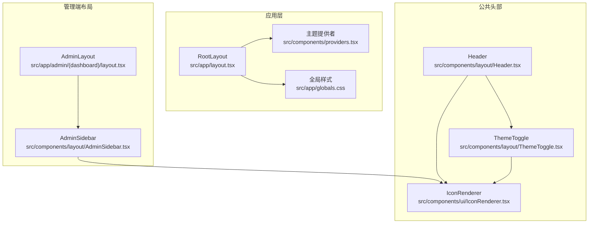
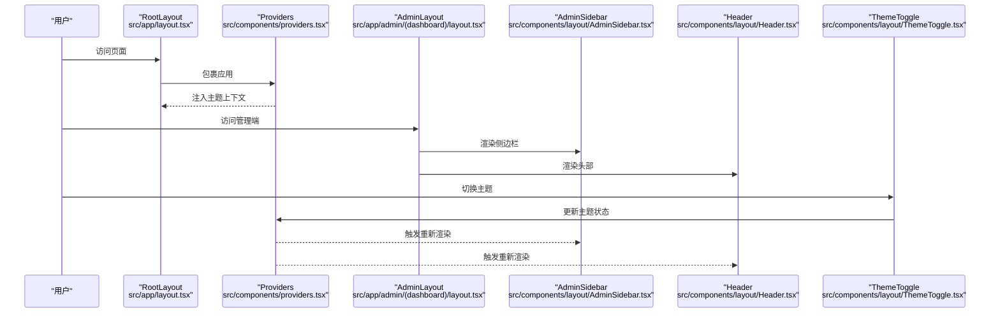
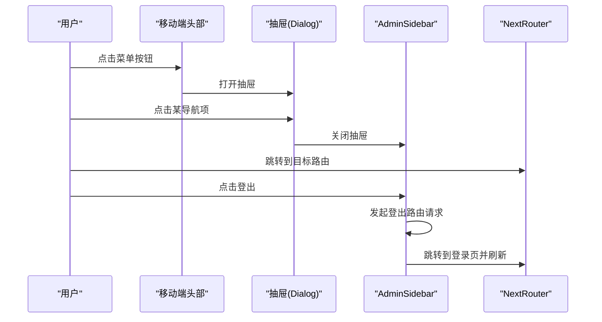
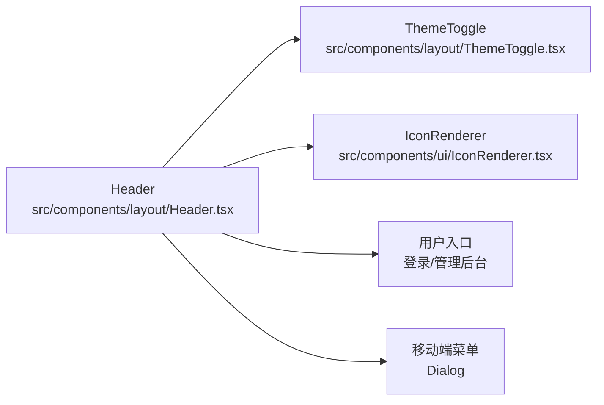
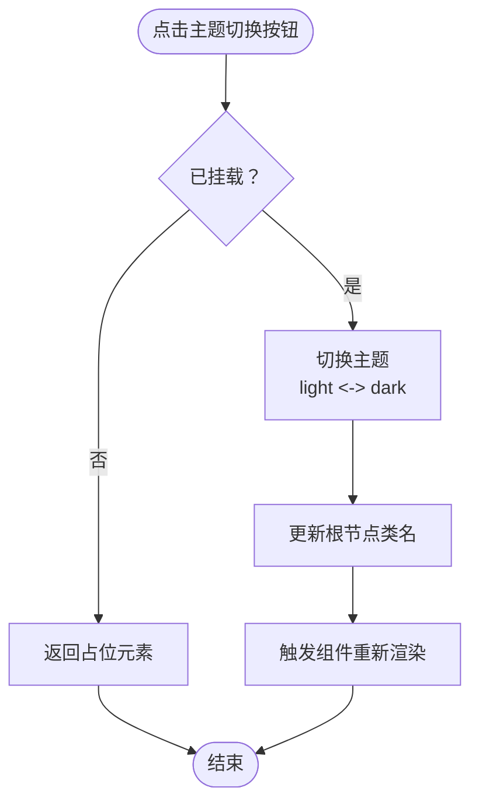
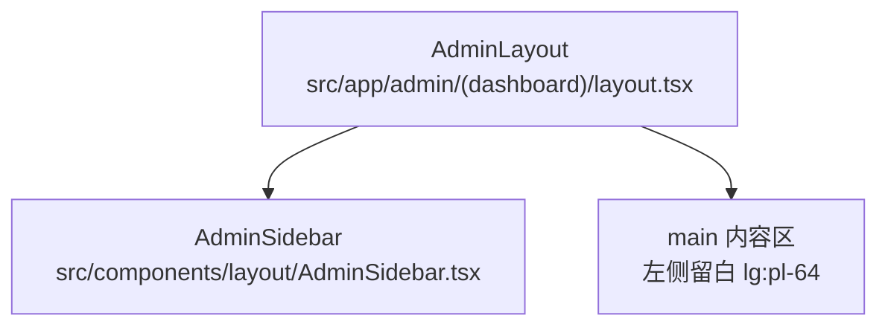
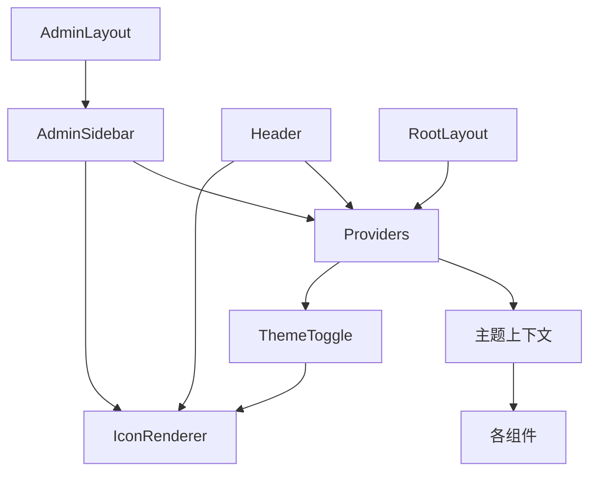

# 布局组件

<cite>
**本文引用的文件**
- [src/components/layout/AdminSidebar.tsx](file://src/components/layout/AdminSidebar.tsx)
- [src/components/layout/Header.tsx](file://src/components/layout/Header.tsx)
- [src/components/layout/ThemeToggle.tsx](file://src/components/layout/ThemeToggle.tsx)
- [src/components/providers.tsx](file://src/components/providers.tsx)
- [src/components/ui/IconRenderer.tsx](file://src/components/ui/IconRenderer.tsx)
- [src/app/admin/(dashboard)/layout.tsx](file://src/app/admin/(dashboard)/layout.tsx)
- [src/app/layout.tsx](file://src/app/layout.tsx)
- [src/app/globals.css](file://src/app/globals.css)
- [tailwind.config.js](file://tailwind.config.js)
- [src/types/index.ts](file://src/types/index.ts)
- [src/middleware.ts](file://src/middleware.ts)
- [src/lib/auth.ts](file://src/lib/auth.ts)
- [src/lib/session.ts](file://src/lib/session.ts)
- [src/app/admin/(auth)/login/page.tsx](file://src/app/admin/(auth)/login/page.tsx)
</cite>

## 目录
1. [简介](#简介)
2. [项目结构](#项目结构)
3. [核心组件](#核心组件)
4. [架构总览](#架构总览)
5. [组件详解](#组件详解)
6. [依赖关系分析](#依赖关系分析)
7. [性能与可访问性](#性能与可访问性)
8. [故障排查指南](#故障排查指南)
9. [结论](#结论)
10. [附录：配置与扩展](#附录配置与扩展)

## 简介
本文件系统化梳理了项目的布局组件体系，重点覆盖 AdminSidebar（管理侧边栏）、Header（顶部导航）与 ThemeToggle（主题切换）三大组件。文档从页面布局结构、导航组件实现、组件协作与状态共享、响应式与移动端适配、到自定义配置与扩展方法进行完整说明，并提供可视化图示帮助理解。

## 项目结构
布局相关的核心文件分布如下：
- 应用根布局与主题提供者：app 层级的根布局与全局样式，以及主题提供者包裹应用
- 管理端布局：管理端页面通过 AdminLayout 组织侧边栏与主内容区
- 布局组件：AdminSidebar、Header、ThemeToggle 位于 components/layout
- 图标渲染器：IconRenderer 提供统一的图标映射与渲染
- 主题系统：next-themes 通过 Providers 进行初始化与状态管理
- 类型定义：User、Category、Link 等类型用于 Header 的用户态传递
- 认证与中间件：登录页、会话验证与路由保护

**图表来源**
- [src/app/layout.tsx](file://src/app/layout.tsx#L25-L39)
- [src/components/providers.tsx](file://src/components/providers.tsx#L6-L23)
- [src/app/globals.css](file://src/app/globals.css#L1-L30)
- [src/app/admin/(dashboard)/layout.tsx](file://src/app/admin/(dashboard)/layout.tsx#L3-L14)
- [src/components/layout/AdminSidebar.tsx](file://src/components/layout/AdminSidebar.tsx#L12-L147)
- [src/components/layout/Header.tsx](file://src/components/layout/Header.tsx#L15-L118)
- [src/components/layout/ThemeToggle.tsx](file://src/components/layout/ThemeToggle.tsx#L7-L29)
- [src/components/ui/IconRenderer.tsx](file://src/components/ui/IconRenderer.tsx#L185-L190)

**章节来源**
- [src/app/layout.tsx](file://src/app/layout.tsx#L25-L39)
- [src/app/admin/(dashboard)/layout.tsx](file://src/app/admin/(dashboard)/layout.tsx#L3-L14)

## 核心组件
- AdminSidebar：管理端侧边栏，支持移动端抽屉与桌面端固定侧栏，内置导航项、当前路径高亮、登出流程
- Header：公共头部导航，包含站点标识、搜索输入占位、主题切换、用户入口（登录/管理后台）
- ThemeToggle：主题切换按钮，基于 next-themes 实现明暗主题切换，避免水合抖动

**章节来源**
- [src/components/layout/AdminSidebar.tsx](file://src/components/layout/AdminSidebar.tsx#L12-L147)
- [src/components/layout/Header.tsx](file://src/components/layout/Header.tsx#L15-L118)
- [src/components/layout/ThemeToggle.tsx](file://src/components/layout/ThemeToggle.tsx#L7-L29)

## 架构总览
布局组件围绕“根布局 -> 管理布局 -> 侧边栏/头部”的层级组织，主题系统通过 Providers 在根部注入，确保全站主题状态一致。AdminSidebar 与 Header 分别服务于管理端与公共端，二者均依赖 IconRenderer 渲染图标，ThemeToggle 共享同一主题上下文。

**图表来源**
- [src/app/layout.tsx](file://src/app/layout.tsx#L31-L36)
- [src/components/providers.tsx](file://src/components/providers.tsx#L19-L21)
- [src/app/admin/(dashboard)/layout.tsx](file://src/app/admin/(dashboard)/layout.tsx#L5-L11)
- [src/components/layout/AdminSidebar.tsx](file://src/components/layout/AdminSidebar.tsx#L103-L144)
- [src/components/layout/Header.tsx](file://src/components/layout/Header.tsx#L19-L65)
- [src/components/layout/ThemeToggle.tsx](file://src/components/layout/ThemeToggle.tsx#L20-L28)

## 组件详解

### AdminSidebar（管理侧边栏）
- 功能要点
  - 移动端抽屉：在小屏设备显示汉堡菜单，点击弹出抽屉；抽屉内含导航列表与登出按钮
  - 桌面端固定侧栏：大屏时固定在左侧，包含站点 Logo 与导航项
  - 导航高亮：根据当前路径自动高亮对应导航项
  - 登出流程：调用后端登出路由，跳转至登录页并刷新
- 关键行为
  - 使用路径判断决定激活状态
  - 抽屉开关通过本地状态控制
  - 导航项与图标通过统一的 IconRenderer 渲染
- 交互序列

**图表来源**
- [src/components/layout/AdminSidebar.tsx](file://src/components/layout/AdminSidebar.tsx#L40-L100)
- [src/components/layout/AdminSidebar.tsx](file://src/components/layout/AdminSidebar.tsx#L102-L144)
- [src/components/layout/AdminSidebar.tsx](file://src/components/layout/AdminSidebar.tsx#L26-L30)

**章节来源**
- [src/components/layout/AdminSidebar.tsx](file://src/components/layout/AdminSidebar.tsx#L12-L147)

### Header（公共头部）
- 功能要点
  - 站点标识：在所有尺寸下显示品牌名称
  - 搜索框占位：在桌面端提供搜索输入框占位
  - 用户入口：根据是否登录显示“管理后台”或“登录”
  - 移动端菜单：在小屏显示汉堡菜单，包含搜索与用户入口
- 交互与状态
  - 移动端菜单开关通过本地状态控制
  - 主题切换由 ThemeToggle 组件处理
- 结构关系

**图表来源**
- [src/components/layout/Header.tsx](file://src/components/layout/Header.tsx#L19-L65)
- [src/components/layout/Header.tsx](file://src/components/layout/Header.tsx#L67-L115)

**章节来源**
- [src/components/layout/Header.tsx](file://src/components/layout/Header.tsx#L15-L118)

### ThemeToggle（主题切换）
- 功能要点
  - 基于 next-themes 的主题切换，支持 light/dark/system
  - 避免水合抖动：首次挂载时返回占位元素，确保布局稳定
  - 通过 aria-label 提升可访问性
- 与 Provider 协作
  - Providers 在根部初始化主题提供者，ThemeToggle 修改主题状态
  - 全局样式与组件根据类名切换实现明暗主题

**图表来源**
- [src/components/layout/ThemeToggle.tsx](file://src/components/layout/ThemeToggle.tsx#L11-L28)
- [src/components/providers.tsx](file://src/components/providers.tsx#L19-L21)

**章节来源**
- [src/components/layout/ThemeToggle.tsx](file://src/components/layout/ThemeToggle.tsx#L7-L29)
- [src/components/providers.tsx](file://src/components/providers.tsx#L6-L23)

### 管理端布局协作（AdminLayout）
- 功能要点
  - 通过 AdminSidebar 渲染侧边栏
  - 主内容区通过左侧留白避开侧边栏宽度
  - 为子页面提供统一的内边距与背景色
- 协作关系
  - AdminSidebar 与 AdminLayout 共同构成管理端整体布局

**图表来源**
- [src/app/admin/(dashboard)/layout.tsx](file://src/app/admin/(dashboard)/layout.tsx#L5-L11)

**章节来源**
- [src/app/admin/(dashboard)/layout.tsx](file://src/app/admin/(dashboard)/layout.tsx#L3-L14)

## 依赖关系分析
- 组件依赖
  - AdminSidebar 依赖 IconRenderer、Button、HeadlessUI Dialog、next/navigation
  - Header 依赖 IconRenderer、HeadlessUI Dialog、ThemeToggle、User 类型
  - ThemeToggle 依赖 next-themes、IconRenderer
  - Providers 依赖 next-themes，为全站提供主题上下文
- 样式与主题
  - Tailwind 启用 class 形式的深色模式
  - 全局样式通过 CSS 变量强制深色主题，配合 next-themes 实现动态切换
- 类型与认证
  - Header 接收 User 类型参数，用于判断用户状态
  - 中间件与会话工具负责路由保护与令牌校验

**图表来源**
- [src/components/layout/AdminSidebar.tsx](file://src/components/layout/AdminSidebar.tsx#L3-L10)
- [src/components/layout/Header.tsx](file://src/components/layout/Header.tsx#L3-L9)
- [src/components/layout/ThemeToggle.tsx](file://src/components/layout/ThemeToggle.tsx#L3-L4)
- [src/components/providers.tsx](file://src/components/providers.tsx#L3-L4)
- [src/app/admin/(dashboard)/layout.tsx](file://src/app/admin/(dashboard)/layout.tsx#L1)
- [src/app/layout.tsx](file://src/app/layout.tsx#L4)
- [tailwind.config.js](file://tailwind.config.js#L3)

**章节来源**
- [src/types/index.ts](file://src/types/index.ts#L1-L7)
- [src/middleware.ts](file://src/middleware.ts#L7-L35)
- [src/lib/session.ts](file://src/lib/session.ts#L4-L13)

## 性能与可访问性
- 性能
  - 主题切换采用占位元素避免首屏抖动，减少不必要的重排
  - 抽屉使用 HeadlessUI 的 Dialog，按需渲染，降低无关 DOM 开销
- 可访问性
  - 主题切换按钮提供 aria-label
  - 移动端菜单按钮包含 sr-only 文本，提升屏幕阅读器体验
- 响应式
  - 使用 Tailwind 断点 lg 控制移动端抽屉与桌面端侧栏的切换
  - 头部搜索框在桌面端展示，移动端通过抽屉菜单承载

[本节为通用建议，不直接分析具体文件]

## 故障排查指南
- 登录后无法进入管理端
  - 检查中间件对 /admin 路径的保护逻辑与令牌校验
  - 确认登录成功后写入 Cookie 的 token 是否存在
- 登出后仍可访问管理端
  - 确认登出接口是否删除 token Cookie
  - 检查浏览器缓存与路由刷新是否生效
- 主题切换无效
  - 确认 Providers 已正确包裹应用
  - 检查根节点类名是否随主题变化更新
- 移动端菜单无法关闭
  - 检查 Dialog 的 open/onClose 绑定是否正确
  - 确认抽屉内导航项点击后是否关闭抽屉

**章节来源**
- [src/middleware.ts](file://src/middleware.ts#L24-L32)
- [src/lib/api-handlers/auth.ts](file://src/lib/api-handlers/auth.ts#L131-L139)
- [src/components/layout/ThemeToggle.tsx](file://src/components/layout/ThemeToggle.tsx#L20-L28)
- [src/components/layout/AdminSidebar.tsx](file://src/components/layout/AdminSidebar.tsx#L52-L100)

## 结论
本布局体系以 AdminSidebar、Header、ThemeToggle 为核心，结合 Providers 的主题上下文与 AdminLayout 的布局容器，实现了清晰的职责分离与良好的响应式体验。通过统一的图标渲染器与 Tailwind 断点策略，组件具备良好的可维护性与扩展性。

[本节为总结，不直接分析具体文件]

## 附录：配置与扩展

### 配置项与行为说明
- AdminSidebar
  - 导航项：通过静态数组配置，包含名称、链接与图标
  - 激活态：根据 pathname 判断，支持首页特殊激活规则
  - 登出：调用后端登出路由，跳转登录页并刷新
- Header
  - 用户入口：根据传入的 user 参数决定显示“管理后台”或“登录”
  - 搜索框：桌面端占位，移动端抽屉中提供输入
  - 主题切换：直接复用 ThemeToggle
- ThemeToggle
  - 切换逻辑：在 light/dark 之间切换
  - 初始化：通过 Providers 设置默认主题与禁用过渡

**章节来源**
- [src/components/layout/AdminSidebar.tsx](file://src/components/layout/AdminSidebar.tsx#L17-L35)
- [src/components/layout/Header.tsx](file://src/components/layout/Header.tsx#L11-L13)
- [src/components/layout/ThemeToggle.tsx](file://src/components/layout/ThemeToggle.tsx#L20-L28)

### 使用示例
- 在管理端页面中引入 AdminLayout，即可自动获得侧边栏与主内容区
- 在公共页面中直接使用 Header，传入 user 参数以显示不同入口
- 在任意需要主题切换的位置放置 ThemeToggle

**章节来源**
- [src/app/admin/(dashboard)/layout.tsx](file://src/app/admin/(dashboard)/layout.tsx#L3-L14)
- [src/components/layout/Header.tsx](file://src/components/layout/Header.tsx#L15-L118)
- [src/components/layout/ThemeToggle.tsx](file://src/components/layout/ThemeToggle.tsx#L7-L29)

### 响应式与移动端适配
- 断点策略：lg 作为移动端/桌面端分界
  - 移动端：头部汉堡菜单 + 抽屉导航
  - 桌面端：固定侧栏 + 常驻导航
- 样式适配：全局样式与 Tailwind 配置共同作用，确保深色模式一致性

**章节来源**
- [src/components/layout/AdminSidebar.tsx](file://src/components/layout/AdminSidebar.tsx#L40-L50)
- [src/components/layout/AdminSidebar.tsx](file://src/components/layout/AdminSidebar.tsx#L102-L106)
- [src/app/globals.css](file://src/app/globals.css#L3-L15)
- [tailwind.config.js](file://tailwind.config.js#L3)

### 自定义配置与扩展方法
- 扩展导航项：在 AdminSidebar 的导航数组中新增条目，指定名称、链接与图标
- 定制主题：通过 Providers 的 defaultTheme 与 enableSystem 控制初始主题与系统跟随
- 图标扩展：在 IconRenderer 的图标映射表中添加新图标名称与组件
- 路由保护：在中间件中调整受保护路径与登录页路径

**章节来源**
- [src/components/layout/AdminSidebar.tsx](file://src/components/layout/AdminSidebar.tsx#L17-L24)
- [src/components/providers.tsx](file://src/components/providers.tsx#L19-L21)
- [src/components/ui/IconRenderer.tsx](file://src/components/ui/IconRenderer.tsx#L93-L183)
- [src/middleware.ts](file://src/middleware.ts#L10-L11)