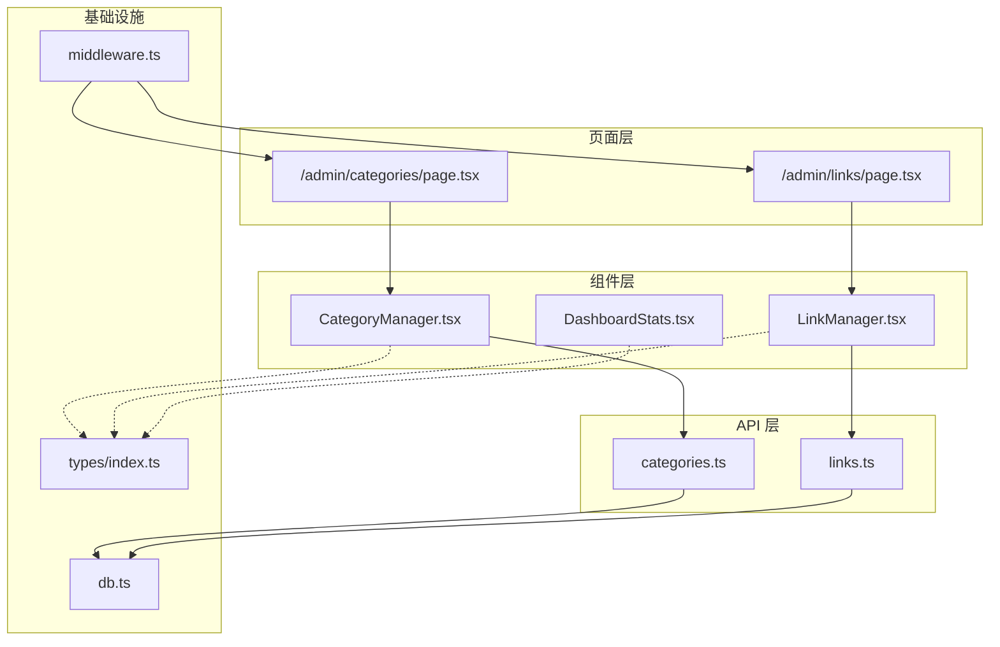
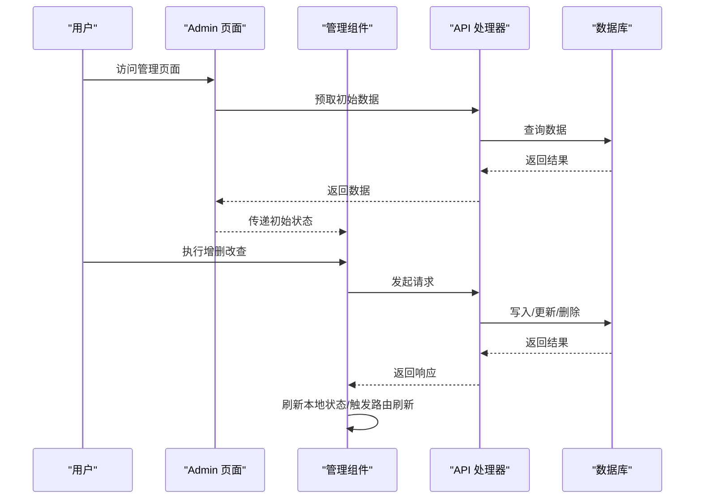
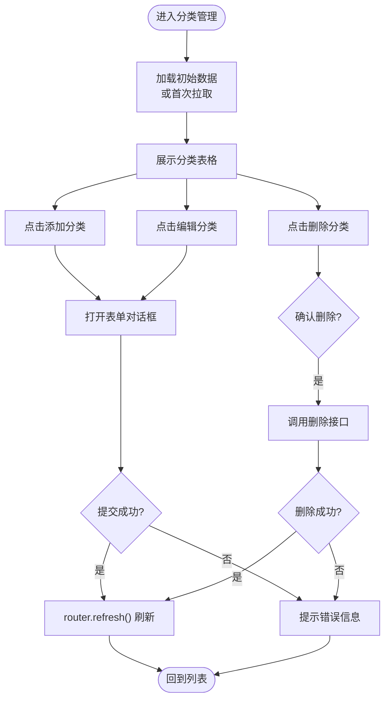
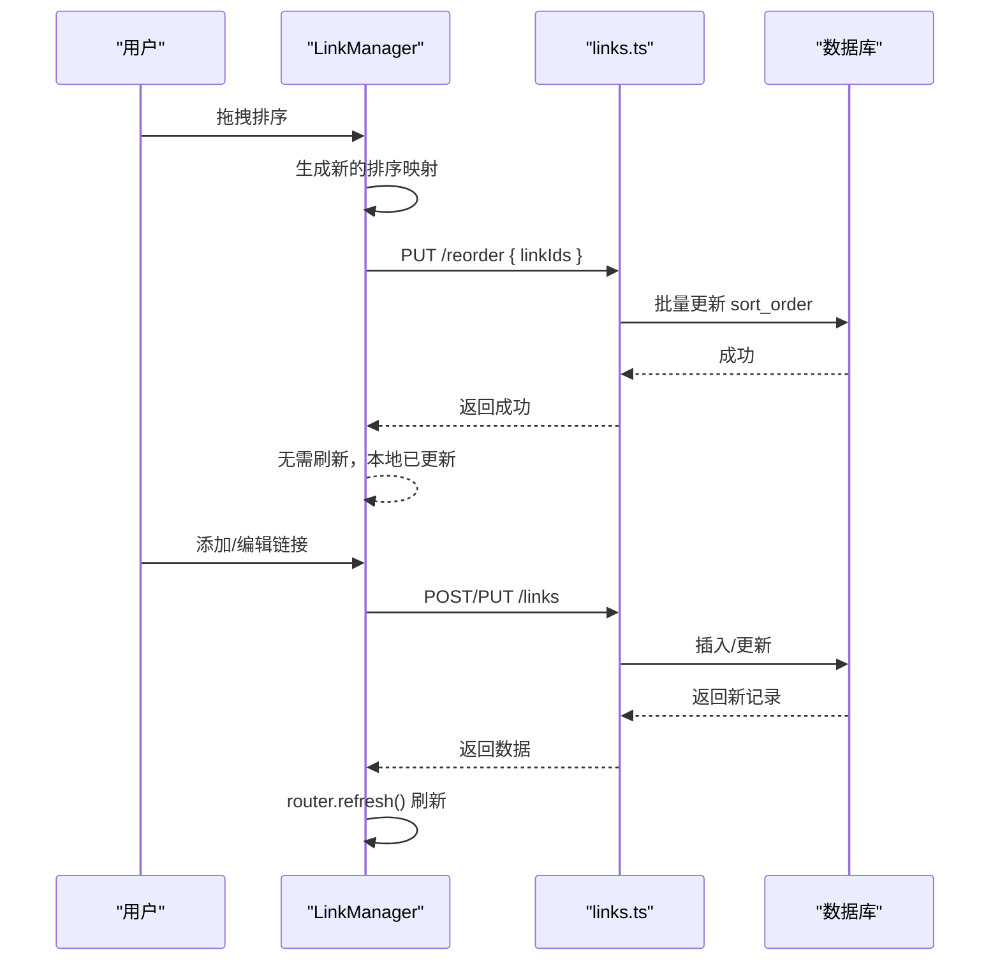
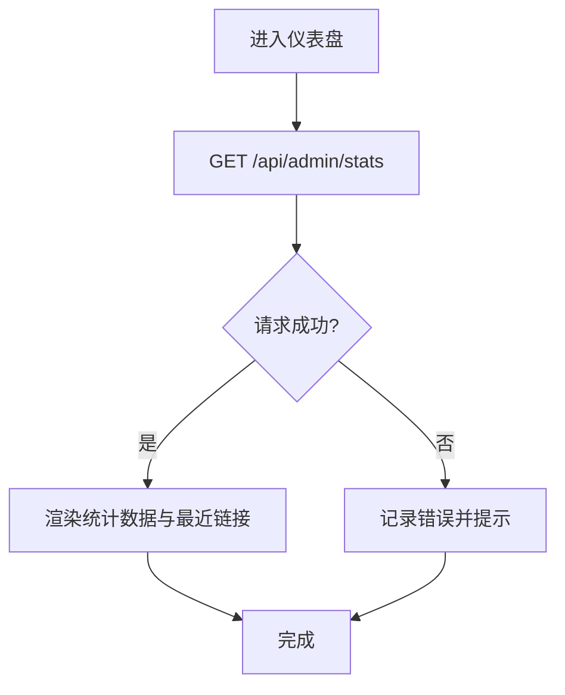
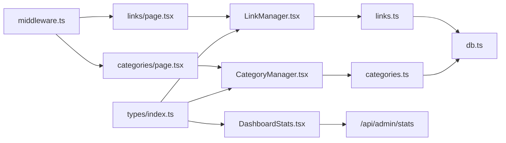

# 管理界面组件

<cite>
**本文档引用的文件**
- [src/components/admin/CategoryManager.tsx](file://src/components/admin/CategoryManager.tsx)
- [src/components/admin/LinkManager.tsx](file://src/components/admin/LinkManager.tsx)
- [src/components/admin/DashboardStats.tsx](file://src/components/admin/DashboardStats.tsx)
- [src/app/admin/(dashboard)/categories/page.tsx](file://src/app/admin/(dashboard)/categories/page.tsx)
- [src/app/admin/(dashboard)/links/page.tsx](file://src/app/admin/(dashboard)/links/page.tsx)
- [src/types/index.ts](file://src/types/index.ts)
- [src/lib/api-handlers/categories.ts](file://src/lib/api-handlers/categories.ts)
- [src/lib/api-handlers/links.ts](file://src/lib/api-handlers/links.ts)
- [src/lib/db.ts](file://src/lib/db.ts)
- [src/middleware.ts](file://src/middleware.ts)
</cite>

## 目录
1. [简介](#简介)
2. [项目结构](#项目结构)
3. [核心组件](#核心组件)
4. [架构总览](#架构总览)
5. [详细组件分析](#详细组件分析)
6. [依赖关系分析](#依赖关系分析)
7. [性能考量](#性能考量)
8. [故障排查指南](#故障排查指南)
9. [结论](#结论)
10. [附录](#附录)

## 简介
本文件面向后台管理界面组件，系统性梳理 CategoryManager（分类管理）、LinkManager（链接管理）、DashboardStats（仪表盘统计）三大核心组件的实现与使用方法。内容涵盖数据绑定、状态管理、用户交互流程、权限控制与安全考虑，以及针对大数据量场景的性能优化建议。文档同时给出组件间调用序列图与数据流图，帮助开发者快速理解与扩展。

## 项目结构
管理界面采用 Next.js App Router 的分层组织方式，页面组件负责数据预取与会话校验，UI 组件负责交互与状态管理，API 处理器负责业务逻辑与数据库访问，中间件统一进行权限拦截。



图表来源
- [src/app/admin/(dashboard)/categories/page.tsx](file://src/app/admin/(dashboard)/categories/page.tsx#L1-L56)
- [src/app/admin/(dashboard)/links/page.tsx](file://src/app/admin/(dashboard)/links/page.tsx#L1-L20)
- [src/components/admin/CategoryManager.tsx](file://src/components/admin/CategoryManager.tsx#L1-L262)
- [src/components/admin/LinkManager.tsx](file://src/components/admin/LinkManager.tsx#L1-L543)
- [src/components/admin/DashboardStats.tsx](file://src/components/admin/DashboardStats.tsx#L1-L153)
- [src/lib/api-handlers/categories.ts](file://src/lib/api-handlers/categories.ts#L1-L199)
- [src/lib/api-handlers/links.ts](file://src/lib/api-handlers/links.ts#L1-L270)
- [src/lib/db.ts](file://src/lib/db.ts#L1-L69)
- [src/middleware.ts](file://src/middleware.ts#L1-L43)
- [src/types/index.ts](file://src/types/index.ts#L1-L53)

章节来源
- [src/app/admin/(dashboard)/categories/page.tsx](file://src/app/admin/(dashboard)/categories/page.tsx#L1-L56)
- [src/app/admin/(dashboard)/links/page.tsx](file://src/app/admin/(dashboard)/links/page.tsx#L1-L20)
- [src/middleware.ts](file://src/middleware.ts#L1-L43)

## 核心组件
- 分类管理组件（CategoryManager）
  - 职责：展示、新增、编辑、删除分类；支持父子关系选择与排序字段设置；通过对话框完成表单提交；依赖 API 提供的分类列表。
  - 关键特性：去重处理、防重复提交、确认删除、路由刷新触发重新拉取数据。
- 链接管理组件（LinkManager）
  - 职责：展示、新增、编辑、删除链接；支持按分类筛选；拖拽排序并批量更新排序值；自动抓取站点元数据（标题、描述、图标）。
  - 关键特性：DnD 排序、本地状态与后端一致性、URL 去重、推荐标记。
- 仪表盘统计（DashboardStats）
  - 职责：加载并展示链接总数、分类总数、推荐链接数量及最近添加的链接列表。
  - 关键特性：懒加载、骨架屏、图标渲染、日期格式化。

章节来源
- [src/components/admin/CategoryManager.tsx](file://src/components/admin/CategoryManager.tsx#L1-L262)
- [src/components/admin/LinkManager.tsx](file://src/components/admin/LinkManager.tsx#L1-L543)
- [src/components/admin/DashboardStats.tsx](file://src/components/admin/DashboardStats.tsx#L1-L153)

## 架构总览
管理界面遵循“页面预取 + 客户端组件 + API 处理器 + 数据库”的分层架构。页面组件通过异步函数获取初始数据，客户端组件负责交互与状态，API 处理器执行权限校验与业务逻辑，数据库访问通过统一的 sql 适配器封装。



图表来源
- [src/app/admin/(dashboard)/categories/page.tsx](file://src/app/admin/(dashboard)/categories/page.tsx#L1-L56)
- [src/app/admin/(dashboard)/links/page.tsx](file://src/app/admin/(dashboard)/links/page.tsx#L1-L20)
- [src/components/admin/CategoryManager.tsx](file://src/components/admin/CategoryManager.tsx#L1-L262)
- [src/components/admin/LinkManager.tsx](file://src/components/admin/LinkManager.tsx#L1-L543)
- [src/lib/api-handlers/categories.ts](file://src/lib/api-handlers/categories.ts#L1-L199)
- [src/lib/api-handlers/links.ts](file://src/lib/api-handlers/links.ts#L1-L270)
- [src/lib/db.ts](file://src/lib/db.ts#L1-L69)

## 详细组件分析

### 分类管理组件（CategoryManager）
- 数据绑定
  - 初始数据：页面组件通过 API 获取分类列表，传递给组件的 initialCategories 属性。
  - 本地状态：组件内部维护 categories 状态，并在 initialCategories 更新时去重同步。
  - 表单字段：名称、图标、父级分类、排序权重。
- 状态管理
  - isOpen/isEditing 控制对话框显示与编辑模式。
  - currentCategory 临时存储当前表单数据。
  - isLoading/isSubmittingRef 防止重复提交。
- 用户交互流程
  - 新增/编辑：打开对话框，填写表单，提交后通过 router.refresh() 触发服务端重新拉取数据。
  - 删除：弹出确认框，调用删除接口，成功后更新本地状态并刷新。
- 错误处理
  - 请求失败时弹出提示；异常捕获统一输出日志。
- 性能与一致性
  - 使用去重逻辑避免重复渲染；通过 router.refresh() 保证前后端状态一致。



图表来源
- [src/components/admin/CategoryManager.tsx](file://src/components/admin/CategoryManager.tsx#L1-L262)

章节来源
- [src/components/admin/CategoryManager.tsx](file://src/components/admin/CategoryManager.tsx#L1-L262)
- [src/app/admin/(dashboard)/categories/page.tsx](file://src/app/admin/(dashboard)/categories/page.tsx#L1-L56)
- [src/lib/api-handlers/categories.ts](file://src/lib/api-handlers/categories.ts#L1-L199)

### 链接管理组件（LinkManager）
- 数据绑定
  - 初始数据：页面组件并行获取链接与分类列表，分别传递给 initialLinks 与 categories。
  - 本地状态：links、categories、currentLink、selectedCategory。
- 排序与拖拽
  - 使用 @dnd-kit 实现拖拽排序；仅在按分类筛选时启用排序。
  - 本地更新排序数组，再批量调用后端接口更新数据库排序值。
- 元数据抓取
  - 支持自动或手动抓取站点标题、描述、图标；优先使用 R2 图标地址。
- 用户交互流程
  - 新增/编辑：打开对话框，填写 URL/标题/描述/图标/分类等，提交后刷新。
  - 删除：确认后调用删除接口并更新本地状态。
- 错误处理
  - 字段校验、网络错误、后端返回消息统一提示。
- 性能与一致性
  - 本地状态与后端排序值保持一致；通过 router.refresh() 同步全局状态。



图表来源
- [src/components/admin/LinkManager.tsx](file://src/components/admin/LinkManager.tsx#L1-L543)
- [src/lib/api-handlers/links.ts](file://src/lib/api-handlers/links.ts#L237-L268)

章节来源
- [src/components/admin/LinkManager.tsx](file://src/components/admin/LinkManager.tsx#L1-L543)
- [src/app/admin/(dashboard)/links/page.tsx](file://src/app/admin/(dashboard)/links/page.tsx#L1-L20)
- [src/lib/api-handlers/links.ts](file://src/lib/api-handlers/links.ts#L1-L270)

### 仪表盘统计（DashboardStats）
- 数据绑定
  - 通过 /api/admin/stats 获取统计信息：链接总数、分类总数、推荐链接数、最近添加的链接列表。
- 渲染策略
  - 加载中显示旋转指示器；数据就绪后以卡片与列表形式展示。
- 交互
  - 无交互，纯展示型组件。



图表来源
- [src/components/admin/DashboardStats.tsx](file://src/components/admin/DashboardStats.tsx#L1-L153)

章节来源
- [src/components/admin/DashboardStats.tsx](file://src/components/admin/DashboardStats.tsx#L1-L153)

## 依赖关系分析
- 类型与数据模型
  - User、Category、Link、ApiResponse 等类型定义于统一的类型文件，被页面与组件共享。
- API 处理器
  - categories.ts 与 links.ts 提供 CRUD 与排序等接口，统一进行权限校验（管理员角色）。
- 数据库访问
  - db.ts 提供跨运行时的 SQL 适配器，兼容 Edge Runtime 与本地环境。
- 中间件
  - middleware.ts 对 /admin 路由进行鉴权拦截，未登录重定向至登录页，已登录访问登录页则重定向至仪表盘。



图表来源
- [src/types/index.ts](file://src/types/index.ts#L1-L53)
- [src/components/admin/CategoryManager.tsx](file://src/components/admin/CategoryManager.tsx#L1-L262)
- [src/components/admin/LinkManager.tsx](file://src/components/admin/LinkManager.tsx#L1-L543)
- [src/components/admin/DashboardStats.tsx](file://src/components/admin/DashboardStats.tsx#L1-L153)
- [src/app/admin/(dashboard)/categories/page.tsx](file://src/app/admin/(dashboard)/categories/page.tsx#L1-L56)
- [src/app/admin/(dashboard)/links/page.tsx](file://src/app/admin/(dashboard)/links/page.tsx#L1-L20)
- [src/lib/api-handlers/categories.ts](file://src/lib/api-handlers/categories.ts#L1-L199)
- [src/lib/api-handlers/links.ts](file://src/lib/api-handlers/links.ts#L1-L270)
- [src/lib/db.ts](file://src/lib/db.ts#L1-L69)
- [src/middleware.ts](file://src/middleware.ts#L1-L43)

章节来源
- [src/types/index.ts](file://src/types/index.ts#L1-L53)
- [src/lib/api-handlers/categories.ts](file://src/lib/api-handlers/categories.ts#L1-L199)
- [src/lib/api-handlers/links.ts](file://src/lib/api-handlers/links.ts#L1-L270)
- [src/lib/db.ts](file://src/lib/db.ts#L1-L69)
- [src/middleware.ts](file://src/middleware.ts#L1-L43)

## 性能考量
- 数据加载
  - LinkManager 在页面层并行获取链接与分类，减少等待时间。
  - LinkManager 支持分页查询（服务端），建议在大数据量场景下启用分页参数，避免一次性加载过多数据。
- 排序与拖拽
  - LinkManager 的拖拽排序仅在按分类筛选时启用，避免全量排序带来的性能问题。
  - 排序更新采用批量写入数据库，降低多次往返开销。
- 缓存与失效
  - API 处理器在写入后调用 revalidatePath，确保路径缓存失效，避免陈旧数据。
- 本地状态与一致性
  - 通过 router.refresh() 统一触发服务端重新拉取，避免本地状态与服务端不一致导致的闪烁或重复。
- 大数据量建议
  - 使用分页接口（links.ts 中的分页参数）。
  - 对分类树形结构可采用懒加载或前端聚合，避免一次性渲染大量节点。
  - 对图标资源使用 CDN 或 R2 存储，减少首屏渲染阻塞。

[本节为通用性能指导，不直接分析具体文件]

## 故障排查指南
- 无法访问管理页面
  - 检查中间件是否正确拦截 /admin 路由，确认 cookie 中 token 是否有效。
- 提交失败或报错
  - 查看浏览器网络面板与控制台错误；检查 API 返回的消息字段。
  - LinkManager 在提交前进行字段校验，若缺失必填项会提示。
- 删除失败
  - 分类删除需满足无子分类与无关联链接的约束；查看后端返回的具体原因。
- 排序未生效
  - 确认仅在按分类筛选时启用拖拽排序；检查后端 /reorder 接口是否返回成功。
- 图标未更新
  - 确认已正确填写 icon 与 icon_orig 字段；优先使用 R2 地址。

章节来源
- [src/middleware.ts](file://src/middleware.ts#L1-L43)
- [src/lib/api-handlers/categories.ts](file://src/lib/api-handlers/categories.ts#L138-L197)
- [src/lib/api-handlers/links.ts](file://src/lib/api-handlers/links.ts#L237-L268)
- [src/components/admin/LinkManager.tsx](file://src/components/admin/LinkManager.tsx#L200-L276)

## 结论
本管理界面组件围绕“页面预取 + 客户端交互 + API 处理器 + 数据库”的清晰分层构建，具备良好的可维护性与扩展性。通过中间件统一鉴权、API 处理器严格校验、组件内状态与路由刷新协同，实现了稳定可靠的后台管理体验。针对大数据量场景，建议结合分页、懒加载与缓存失效策略进一步优化性能。

[本节为总结性内容，不直接分析具体文件]

## 附录
- 使用示例（基于现有实现）
  - 分类管理：在分类页面，点击“添加分类”，填写名称、图标、父级分类与排序权重，提交后自动刷新列表。
  - 链接管理：在链接页面，选择分类后启用拖拽排序，拖动行即可调整排序；点击“添加链接”，填写 URL/标题/描述/图标/分类，提交后刷新。
  - 仪表盘统计：进入仪表盘页面，自动加载统计数据与最近链接列表。
- 权限与安全
  - 管理员角色限制：API 处理器对创建、更新、删除操作均要求管理员身份。
  - 中间件拦截：未登录访问 /admin 路由将被重定向至登录页。
- 数据模型概览

```mermaid
classDiagram
class User {
+number id
+string email
+string role
+string created_at
+string updated_at
}
class Category {
+number id
+string name
+string icon
+number parent_id
+number user_id
+number sort_order
+string created_at
+string updated_at
}
class Link {
+number id
+string title
+string url
+string description
+string icon
+string icon_orig
+number category_id
+number user_id
+number sort_order
+boolean is_recommended
+string created_at
+string updated_at
}
User ||--o{ Category : "拥有"
User ||--o{ Link : "拥有"
Category <|-- Category : "父子关系"
Category ||--o{ Link : "包含"
```

图表来源
- [src/types/index.ts](file://src/types/index.ts#L1-L53)