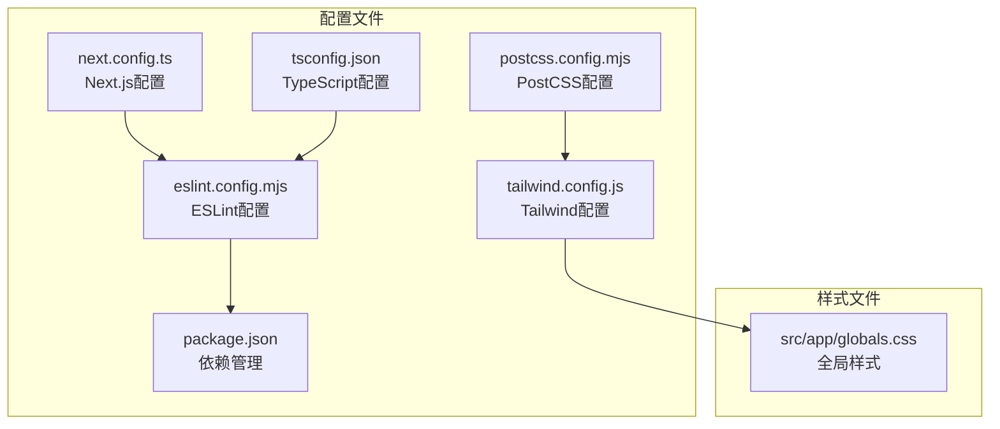
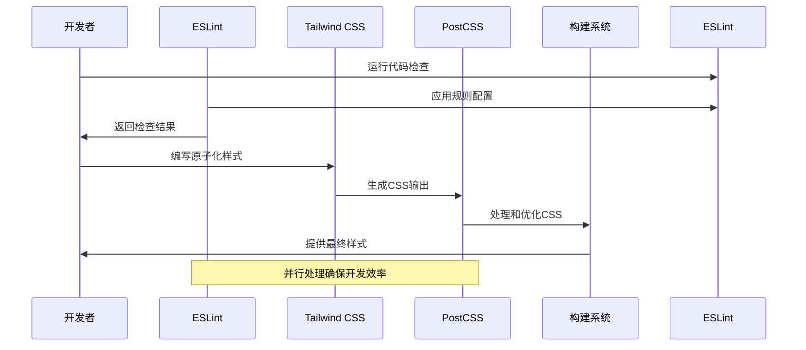
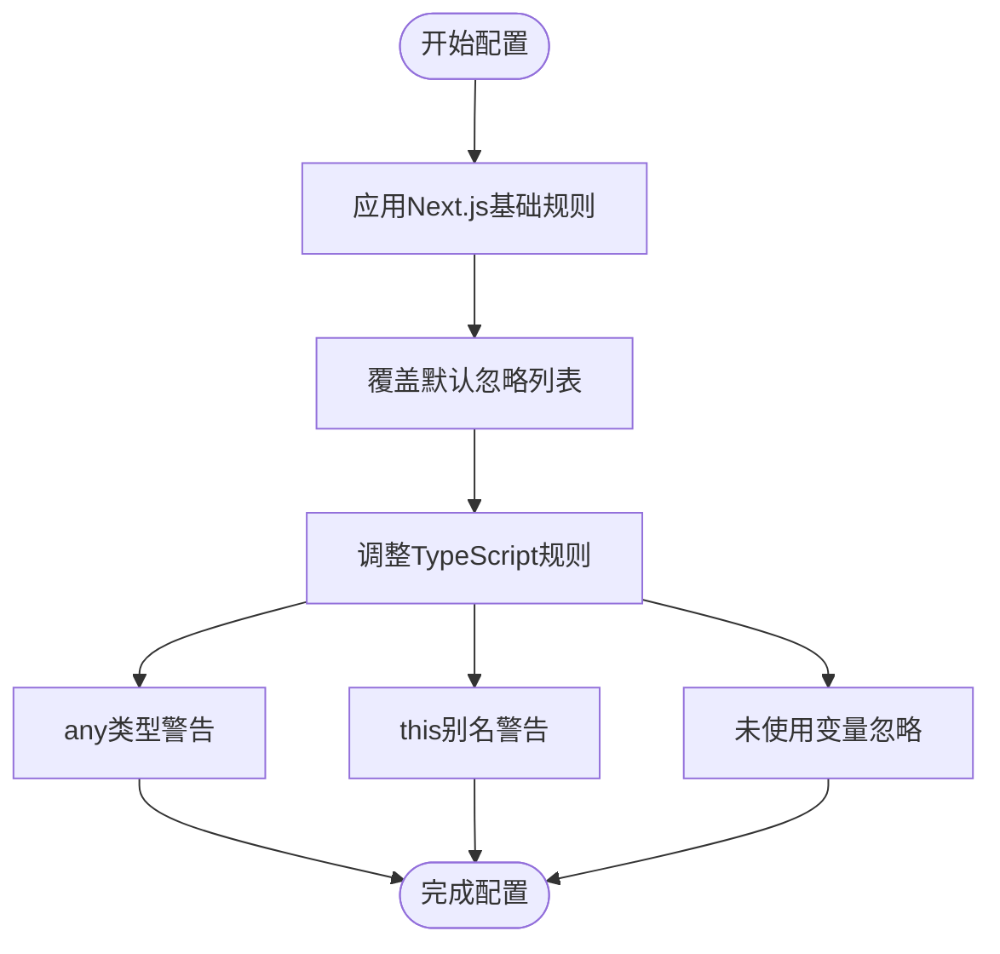
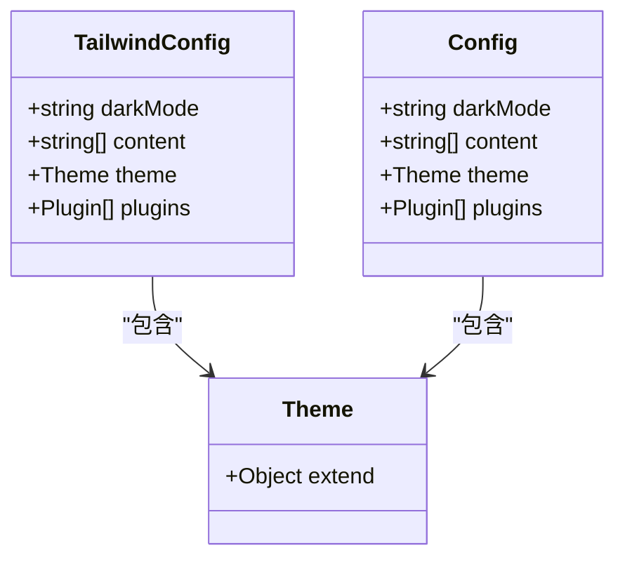
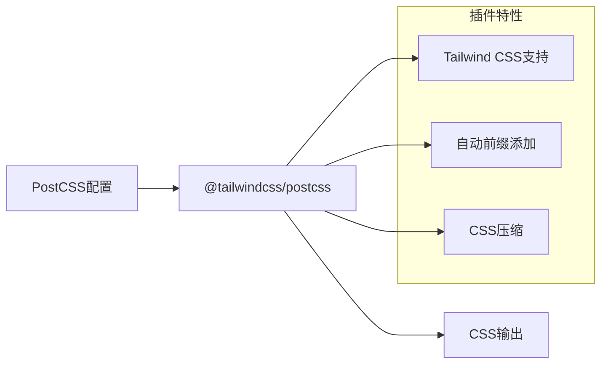
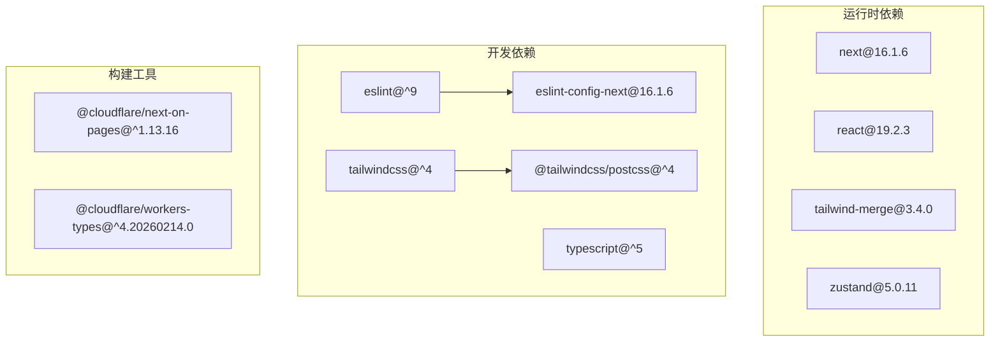

# 代码质量工具

<cite>
**本文档引用的文件**
- [eslint.config.mjs](file://eslint.config.mjs)
- [tailwind.config.js](file://tailwind.config.js)
- [postcss.config.mjs](file://postcss.config.mjs)
- [package.json](file://package.json)
- [next.config.ts](file://next.config.ts)
- [tsconfig.json](file://tsconfig.json)
- [src/app/globals.css](file://src/app/globals.css)
</cite>

## 目录
1. [简介](#简介)
2. [项目结构](#项目结构)
3. [核心组件](#核心组件)
4. [架构概览](#架构概览)
5. [详细组件分析](#详细组件分析)
6. [依赖关系分析](#依赖关系分析)
7. [性能考虑](#性能考虑)
8. [故障排除指南](#故障排除指南)
9. [结论](#结论)

## 简介

本项目采用现代化的前端开发工具链，集成了ESLint、Tailwind CSS和PostCSS来确保代码质量和样式一致性。该系统通过配置化的工具链实现：

- **ESLint配置**：基于Next.js官方配置的TypeScript和Core Web Vitals规则
- **Tailwind CSS定制**：支持暗色模式、内容扫描和主题扩展
- **PostCSS集成**：与Tailwind CSS无缝协作的预处理器配置

这些工具共同构建了一个高效、可维护的开发工作流程，支持从开发到生产的完整代码质量保证。

## 项目结构

项目采用Next.js 16.1.6的标准目录结构，代码质量相关配置分布在根目录的关键文件中：



**图表来源**
- [eslint.config.mjs](file://eslint.config.mjs#L1-L28)
- [tailwind.config.js](file://tailwind.config.js#L1-L14)
- [postcss.config.mjs](file://postcss.config.mjs#L1-L8)

**章节来源**
- [package.json](file://package.json#L1-L50)
- [next.config.ts](file://next.config.ts#L1-L41)

## 核心组件

### ESLint配置系统

项目使用ESLint 9.x配合Next.js官方配置，实现了现代化的JavaScript/TypeScript代码质量控制：

- **基础配置**：继承`eslint-config-next`提供的Core Web Vitals和TypeScript规则
- **自定义规则**：针对项目特点调整了几个TypeScript规则的严格程度
- **忽略规则**：覆盖默认忽略列表，确保特定目录被正确扫描

### Tailwind CSS框架

Tailwind CSS 4.x提供了原子化CSS解决方案，支持现代Web开发需求：

- **暗色模式支持**：通过class模式实现深浅主题切换
- **内容扫描**：自动扫描源码中的样式使用情况
- **主题扩展**：预留主题扩展点以适应项目需求

### PostCSS处理管道

PostCSS作为CSS预处理器，为Tailwind CSS提供必要的编译支持：

- **插件集成**：使用官方PostCSS插件确保兼容性
- **构建优化**：在构建过程中处理和优化CSS输出

**章节来源**
- [eslint.config.mjs](file://eslint.config.mjs#L1-L28)
- [tailwind.config.js](file://tailwind.config.js#L1-L14)
- [postcss.config.mjs](file://postcss.config.mjs#L1-L8)

## 架构概览

整个代码质量工具链采用分层架构设计，各组件协同工作以确保代码质量：



**图表来源**
- [eslint.config.mjs](file://eslint.config.mjs#L5-L25)
- [tailwind.config.js](file://tailwind.config.js#L3-L12)
- [postcss.config.mjs](file://postcss.config.mjs#L2-L4)

## 详细组件分析

### ESLint配置深度分析

#### 规则配置策略

项目采用了渐进式的规则配置方法：



**图表来源**
- [eslint.config.mjs](file://eslint.config.mjs#L8-L24)

#### 规则调整详解

- **@typescript-eslint/no-explicit-any**: 设置为警告级别，允许在特定场景下使用any类型
- **@typescript-eslint/no-this-alias**: 警告潜在的this绑定问题
- **@typescript-eslint/no-unused-vars**: 忽略以下划线开头的未使用参数

#### 忽略规则配置

项目覆盖了默认的忽略列表，确保：
- `.next/**` 和 `.vercel/**` 目录不参与扫描
- `out/**` 和 `build/**` 构建产物目录排除在外
- TypeScript环境声明文件单独处理

**章节来源**
- [eslint.config.mjs](file://eslint.config.mjs#L1-L28)

### Tailwind CSS配置分析

#### 配置结构解析



**图表来源**
- [tailwind.config.js](file://tailwind.config.js#L2-L12)

#### 内容扫描配置

配置文件指定了三个主要的扫描路径：
- `./src/pages/**/*.{js,ts,jsx,tsx,mdx}`：页面组件
- `./src/components/**/*.{js,ts,jsx,tsx,mdx}`：通用组件
- `./src/app/**/*.{js,ts,jsx,tsx,mdx}`：应用路由组件

这种配置确保了所有使用样式的组件都会被正确识别和处理。

#### 暗色模式实现

通过设置`darkMode: 'class'`，项目采用CSS类切换方式实现主题切换：
- 默认使用暗色模式（`.dark`类）
- 支持用户手动切换到亮色模式
- 全局颜色变量统一管理

**章节来源**
- [tailwind.config.js](file://tailwind.config.js#L1-L14)

### PostCSS配置分析

#### 插件配置策略

PostCSS配置采用了最小化但功能完整的策略：



**图表来源**
- [postcss.config.mjs](file://postcss.config.mjs#L1-L7)

#### 构建集成

PostCSS插件与Tailwind CSS的集成确保了：
- 在构建过程中自动处理CSS
- 保持与Tailwind CSS 4.x的兼容性
- 提供优化的CSS输出

**章节来源**
- [postcss.config.mjs](file://postcss.config.mjs#L1-L8)

### 全局样式系统

#### CSS变量管理

项目使用CSS自定义属性实现主题系统：

```mermaid
flowchart TD
Root[":root 定义] --> BG["--background 变量"]
Root --> FG["--foreground 变量"]
Root --> NAV["--nav-bg-color 变量"]
Dark[".dark 类"] --> BGDark["--background 值"]
Dark --> FGDark["--foreground 值"]
Dark --> NAVDark["--nav-bg-color 值"]
Theme["@theme inline"] --> MapBG["映射到 --color-background"]
Theme --> MapFG["映射到 --color-foreground"]
Theme --> Fonts["字体变量映射"]
BG --> Body["body 样式应用"]
FG --> Body
NAV --> Body
```

**图表来源**
- [src/app/globals.css](file://src/app/globals.css#L3-L23)

#### 主题系统架构

全局样式文件实现了三层主题管理：
1. **CSS变量层**：基础颜色变量定义
2. **主题映射层**：将变量映射到Tailwind可用的命名
3. **组件层**：实际使用的样式应用

**章节来源**
- [src/app/globals.css](file://src/app/globals.css#L1-L30)

## 依赖关系分析

### 包管理器配置

项目使用pnpm作为包管理器，配置了完整的开发工具链：



**图表来源**
- [package.json](file://package.json#L12-L48)

### TypeScript配置集成

TypeScript配置与代码质量工具的集成体现在：

- **严格模式**：启用严格的类型检查
- **模块解析**：使用bundler解析器支持现代导入
- **路径映射**：配置`@/*`路径别名简化导入
- **插件支持**：集成Next.js类型插件

**章节来源**
- [package.json](file://package.json#L1-L50)
- [tsconfig.json](file://tsconfig.json#L1-L35)

## 性能考虑

### 构建优化策略

项目在多个层面实施了性能优化：

#### Next.js配置优化

- **React Compiler**：启用React编译器提升渲染性能
- **图片优化**：禁用图片优化以减少依赖
- **包导入优化**：优化特定包的导入以减小bundle大小
- **Webpack别名**：排除Node.js专用模块防止打包

#### 开发体验优化

- **Turbopack配置**：通过别名机制优化开发时的模块解析
- **生产环境优化**：禁用生产环境Source Maps减小包体积
- **重写规则**：简化API路由访问路径

**章节来源**
- [next.config.ts](file://next.config.ts#L1-L41)

### 代码质量工具性能

- **ESLint缓存**：利用增量检查提升大型项目的检查速度
- **Tailwind Tree Shaking**：仅生成实际使用的样式类
- **PostCSS优化**：在构建时进行CSS压缩和优化

## 故障排除指南

### 常见配置问题

#### ESLint规则冲突

**问题**：ESLint与TypeScript规则冲突
**解决方案**：
1. 检查`eslint.config.mjs`中的规则配置
2. 确认TypeScript版本兼容性
3. 验证忽略规则是否正确应用

#### Tailwind样式未生效

**问题**：Tailwind类在组件中不生效
**解决方案**：
1. 检查`tailwind.config.js`的内容扫描路径
2. 确认CSS文件正确引入`@import "tailwindcss"`
3. 验证构建过程中PostCSS插件正常工作

#### PostCSS插件错误

**问题**：PostCSS构建失败
**解决方案**：
1. 确认`@tailwindcss/postcss`版本兼容
2. 检查PostCSS配置语法
3. 验证Tailwind CSS版本匹配

### 开发工具调试

#### 调试命令

```bash
# 运行ESLint检查
pnpm lint

# 检查TypeScript类型
pnpm type-check

# 查看构建输出
pnpm build --debug
```

#### 日志分析

- **ESLint输出**：查看具体的规则违规信息
- **Tailwind构建**：确认内容扫描结果和生成的CSS文件
- **PostCSS处理**：验证CSS转换过程中的错误信息

**章节来源**
- [package.json](file://package.json#L5-L11)

## 结论

该项目的代码质量工具链展现了现代前端开发的最佳实践：

### 核心优势

1. **配置化管理**：所有工具都通过配置文件管理，便于版本控制和团队协作
2. **渐进式集成**：从基础规则开始，根据项目需求逐步调整
3. **性能优先**：在保证质量的同时最大化开发和构建性能
4. **现代化技术栈**：采用最新的工具版本确保长期维护性

### 最佳实践建议

1. **持续改进**：定期评估和调整规则配置以适应项目发展
2. **团队培训**：确保团队成员理解配置意图和修改流程
3. **监控指标**：建立代码质量指标监控机制
4. **文档维护**：保持配置文档与实际配置同步更新

这套工具链为项目的长期发展奠定了坚实的基础，既保证了代码质量，又维持了良好的开发体验。