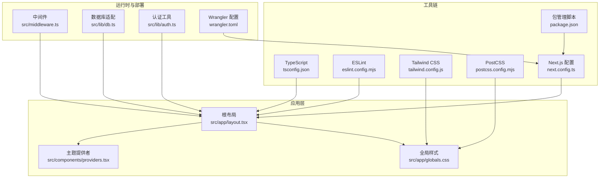
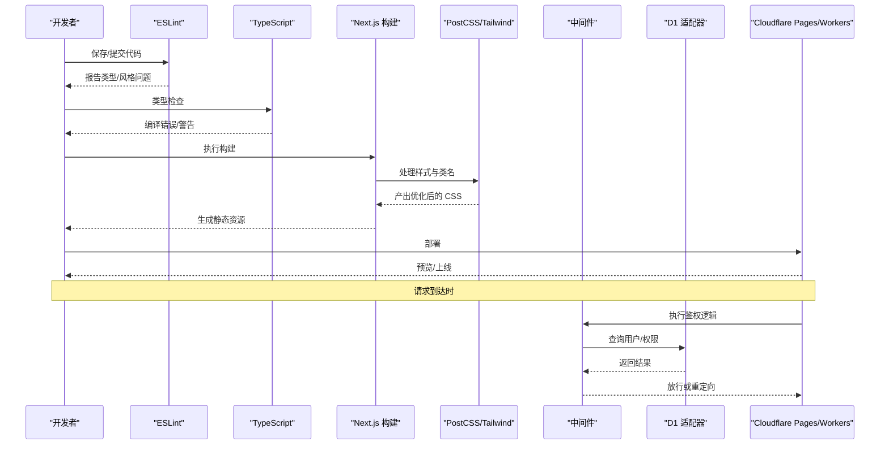
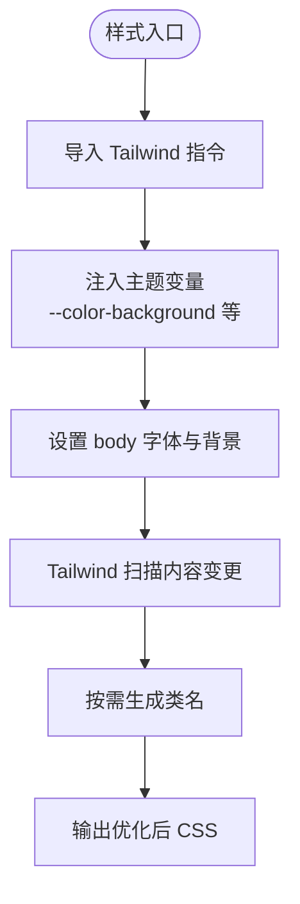
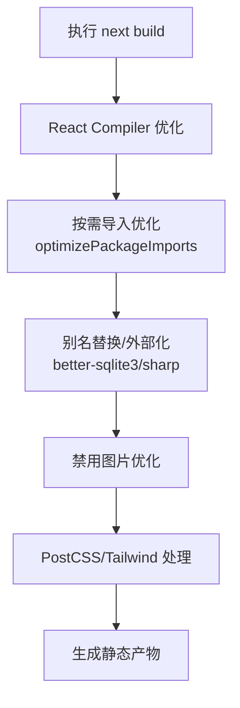
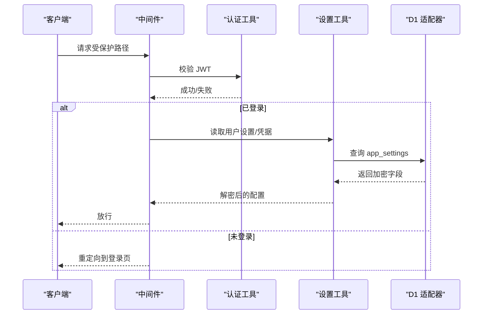
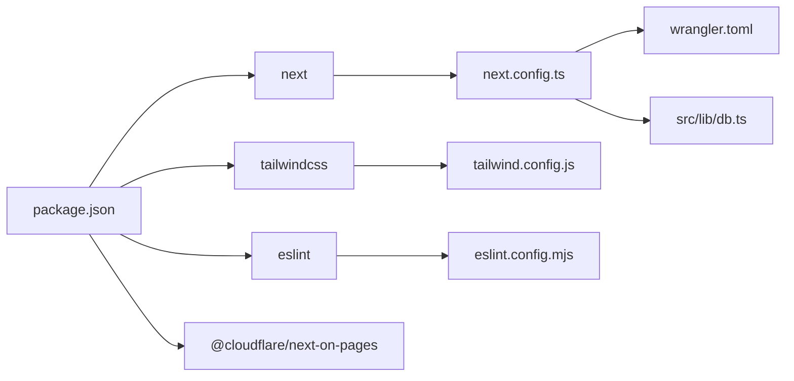

# 开发工具链

<cite>
**本文引用的文件**
- [package.json](file://package.json)
- [tsconfig.json](file://tsconfig.json)
- [eslint.config.mjs](file://eslint.config.mjs)
- [tailwind.config.js](file://tailwind.config.js)
- [postcss.config.mjs](file://postcss.config.mjs)
- [next.config.ts](file://next.config.ts)
- [wrangler.toml](file://wrangler.toml)
- [.env.example](file://.env.example)
- [src/app/globals.css](file://src/app/globals.css)
- [src/app/layout.tsx](file://src/app/layout.tsx)
- [src/middleware.ts](file://src/middleware.ts)
- [src/lib/db.ts](file://src/lib/db.ts)
- [src/lib/auth.ts](file://src/lib/auth.ts)
- [src/lib/settings.ts](file://src/lib/settings.ts)
- [src/components/ui/Button.tsx](file://src/components/ui/Button.tsx)
- [src/hooks/use-debounce.ts](file://src/hooks/use-debounce.ts)
- [src/components/providers.tsx](file://src/components/providers.tsx)
</cite>

## 目录
1. [简介](#简介)
2. [项目结构](#项目结构)
3. [核心组件](#核心组件)
4. [架构总览](#架构总览)
5. [详细组件分析](#详细组件分析)
6. [依赖分析](#依赖分析)
7. [性能考虑](#性能考虑)
8. [故障排查指南](#故障排查指南)
9. [结论](#结论)
10. [附录](#附录)

## 简介
本文件系统性梳理本项目的开发工具链，覆盖构建配置、代码规范、调试技巧与性能监控。重点包括：
- TypeScript 编译配置与路径别名
- Tailwind CSS 与 PostCSS 配置及样式体系
- ESLint 规则与静态分析策略
- Next.js 构建优化、打包策略与边缘运行时适配
- 开发环境调试工具与性能分析方法
- 代码质量保障最佳实践与常见问题排查

## 项目结构
项目采用 Next.js App Router 结构，前端样式通过 Tailwind CSS + PostCSS 处理，类型检查由 TypeScript 提供，代码质量由 ESLint 保障。Cloudflare Workers/ Pages 作为部署与运行时，结合 D1 数据库与 R2 存储。

图表来源
- [src/app/layout.tsx](file://src/app/layout.tsx#L1-L40)
- [src/app/globals.css](file://src/app/globals.css#L1-L30)
- [src/components/providers.tsx](file://src/components/providers.tsx#L1-L24)
- [tsconfig.json](file://tsconfig.json#L1-L35)
- [eslint.config.mjs](file://eslint.config.mjs#L1-L28)
- [tailwind.config.js](file://tailwind.config.js#L1-L14)
- [postcss.config.mjs](file://postcss.config.mjs#L1-L8)
- [next.config.ts](file://next.config.ts#L1-L41)
- [package.json](file://package.json#L1-L50)
- [src/middleware.ts](file://src/middleware.ts#L1-L43)
- [src/lib/db.ts](file://src/lib/db.ts#L1-L69)
- [src/lib/auth.ts](file://src/lib/auth.ts#L1-L23)
- [wrangler.toml](file://wrangler.toml#L1-L14)

章节来源
- [package.json](file://package.json#L1-L50)
- [tsconfig.json](file://tsconfig.json#L1-L35)
- [eslint.config.mjs](file://eslint.config.mjs#L1-L28)
- [tailwind.config.js](file://tailwind.config.js#L1-L14)
- [postcss.config.mjs](file://postcss.config.mjs#L1-L8)
- [next.config.ts](file://next.config.ts#L1-L41)
- [wrangler.toml](file://wrangler.toml#L1-L14)
- [src/app/globals.css](file://src/app/globals.css#L1-L30)
- [src/app/layout.tsx](file://src/app/layout.tsx#L1-L40)
- [src/middleware.ts](file://src/middleware.ts#L1-L43)
- [src/lib/db.ts](file://src/lib/db.ts#L1-L69)
- [src/lib/auth.ts](file://src/lib/auth.ts#L1-L23)
- [src/lib/settings.ts](file://src/lib/settings.ts#L1-L149)
- [src/components/ui/Button.tsx](file://src/components/ui/Button.tsx#L1-L49)
- [src/hooks/use-debounce.ts](file://src/hooks/use-debounce.ts#L1-L15)
- [src/components/providers.tsx](file://src/components/providers.tsx#L1-L24)

## 核心组件
- 构建与运行时：Next.js 16（App Router），Edge Runtime 可选，Webpack/Turbopack 双通道优化，Pages/Workers 部署。
- 类型系统：TypeScript ES2017 目标，严格模式，路径别名 @/*，隔离模块与增量编译。
- 样式体系：Tailwind CSS v4，PostCSS 插件驱动，按需扫描内容，暗色模式基于 class。
- 质量保障：ESLint Next.js 推荐规则 + 自定义宽松规则，覆盖 CI 与本地开发。
- 数据访问：Cloudflare D1 适配器，统一 SQL 查询接口；本地开发通过 Wrangler Pages Dev 注入 D1 绑定。
- 认证与安全：JWT 签发与校验，敏感设置使用 Web Crypto AES-GCM 加密存储。
- 前端组件：Button 等 UI 组件使用 clsx/tailwind-merge 合并类名，支持加载态与多尺寸变体。

章节来源
- [next.config.ts](file://next.config.ts#L1-L41)
- [tsconfig.json](file://tsconfig.json#L1-L35)
- [tailwind.config.js](file://tailwind.config.js#L1-L14)
- [postcss.config.mjs](file://postcss.config.mjs#L1-L8)
- [eslint.config.mjs](file://eslint.config.mjs#L1-L28)
- [src/lib/db.ts](file://src/lib/db.ts#L1-L69)
- [src/lib/auth.ts](file://src/lib/auth.ts#L1-L23)
- [src/lib/settings.ts](file://src/lib/settings.ts#L1-L149)
- [src/components/ui/Button.tsx](file://src/components/ui/Button.tsx#L1-L49)

## 架构总览
下图展示开发工具链在请求生命周期中的作用：ESLint/TS 在开发期进行静态检查；构建阶段由 Next.js 与 PostCSS/Tailwind 处理样式；运行时通过中间件进行鉴权，数据访问通过 D1 适配器；部署到 Cloudflare Pages/Workers。

图表来源
- [eslint.config.mjs](file://eslint.config.mjs#L1-L28)
- [tsconfig.json](file://tsconfig.json#L1-L35)
- [next.config.ts](file://next.config.ts#L1-L41)
- [postcss.config.mjs](file://postcss.config.mjs#L1-L8)
- [tailwind.config.js](file://tailwind.config.js#L1-L14)
- [src/middleware.ts](file://src/middleware.ts#L1-L43)
- [src/lib/db.ts](file://src/lib/db.ts#L1-L69)
- [wrangler.toml](file://wrangler.toml#L1-L14)

## 详细组件分析

### TypeScript 配置
- 目标与库：ES2017，包含 dom/dom.iterable/esnext。
- 严格模式：启用严格类型检查，禁止输出（noEmit）交由构建流程处理。
- 模块解析：bundler，便于 Tree Shaking 与按需导入。
- 路径别名：@/* 映射至 src，提升可读性与可维护性。
- 插件：集成 Next 类型插件，增强 App Router 类型体验。
- 包含范围：自动包含 next-env.d.ts、所有 ts/tsx、以及 Next 类型缓存目录。

最佳实践
- 保持严格模式，避免 any 泛滥；对动态字段使用显式断言与校验。
- 利用路径别名统一导入，减少相对路径层级。
- 在新增页面/组件时，确保类型声明与导出符合 App Router 约定。

章节来源
- [tsconfig.json](file://tsconfig.json#L1-L35)

### ESLint 规则与静态分析
- 基础规则：继承 eslint-config-next 的 core-web-vitals 与 typescript 规则集。
- 忽略项：覆盖默认忽略列表，保留 .next、.vercel、out、build 等目录。
- 宽松规则：对某些噪声规则降级为警告，提升开发体验。
- 建议：在 CI 与本地统一执行，结合编辑器实时提示，形成“提交前检查”的闭环。

最佳实践
- 优先修复错误，保留警告作为持续改进目标。
- 对团队约定的复杂规则，可在项目中补充自定义规则集。

章节来源
- [eslint.config.mjs](file://eslint.config.mjs#L1-L28)

### Tailwind CSS 与 PostCSS
- Tailwind 配置：暗色模式基于 class，内容扫描覆盖 src 下的 pages/components/app。
- PostCSS：启用 @tailwindcss/postcss 插件，与 Tailwind v4 协同工作。
- 全局样式：通过 globals.css 导入 Tailwind，并注入主题变量与基础排版。
- 最佳实践：尽量使用原子类与主题变量，避免在组件内写大段样式；利用 twMerge 合并冲突类名。

图表来源
- [src/app/globals.css](file://src/app/globals.css#L1-L30)
- [tailwind.config.js](file://tailwind.config.js#L1-L14)
- [postcss.config.mjs](file://postcss.config.mjs#L1-L8)

章节来源
- [tailwind.config.js](file://tailwind.config.js#L1-L14)
- [postcss.config.mjs](file://postcss.config.mjs#L1-L8)
- [src/app/globals.css](file://src/app/globals.css#L1-L30)

### Next.js 构建与打包优化
- React Compiler：开启以获得更好的渲染性能与更少的样板代码。
- 生产 Source Maps：关闭以减小产物体积。
- 图片优化：禁用 Next 图片优化，降低 sharp 依赖带来的打包体积与平台差异。
- 包按需导入：optimizePackageImports 针对 lucide-react、date-fns 等热门库启用。
- 边缘别名：在 Turbopack/webpack 中将 better-sqlite3/sharp/cheerio 标记为外部或替换为空模块，避免被打包进 Edge Worker。
- 重写规则：将 /icons/:path* 重写到 /api/icons/:path*，简化前端调用。
- 中间件运行时：实验性 Edge Runtime，提升鉴权与路由前置处理性能。

图表来源
- [next.config.ts](file://next.config.ts#L1-L41)

章节来源
- [next.config.ts](file://next.config.ts#L1-L41)

### 数据库与认证适配
- D1 适配器：统一 sql 模板字符串查询接口，优先从 Edge 上下文获取 DB 绑定，回退时给出明确警告。
- 认证：基于 jose 的 JWT 签发与校验，密钥来自环境变量。
- 设置加密：使用 Web Crypto API 的 AES-GCM 对 R2 凭据等敏感信息进行加解密存储。

图表来源
- [src/middleware.ts](file://src/middleware.ts#L1-L43)
- [src/lib/auth.ts](file://src/lib/auth.ts#L1-L23)
- [src/lib/settings.ts](file://src/lib/settings.ts#L1-L149)
- [src/lib/db.ts](file://src/lib/db.ts#L1-L69)

章节来源
- [src/lib/db.ts](file://src/lib/db.ts#L1-L69)
- [src/lib/auth.ts](file://src/lib/auth.ts#L1-L23)
- [src/lib/settings.ts](file://src/lib/settings.ts#L1-L149)
- [src/middleware.ts](file://src/middleware.ts#L1-L43)

### 主题与 UI 组件
- 主题提供者：使用 next-themes，在客户端挂载后切换 class，避免水合不一致。
- Button 组件：支持 primary/secondary/danger/ghost 与 sm/md/lg 尺寸，内置加载态指示器，类名合并使用 clsx/twMerge。

章节来源
- [src/components/providers.tsx](file://src/components/providers.tsx#L1-L24)
- [src/components/ui/Button.tsx](file://src/components/ui/Button.tsx#L1-L49)

### 开发环境与调试
- 本地开发：使用 next dev；若涉及 D1/R2，建议配合 wrangler pages dev 以获得真实绑定。
- 环境变量：参考 .env.example，确保数据库、JWT、R2 等关键配置齐全。
- 调试技巧：
  - 在中间件与 API 层打印上下文信息，定位鉴权与路由问题。
  - 使用浏览器开发者工具 Network/Performance 面板观察请求与渲染瓶颈。
  - 在 Next.js 中启用 React DevTools Profiler，识别长任务与重复渲染。
- 性能分析：
  - 使用 Lighthouse 或 WebPageTest 进行 Core Web Vitals 评估。
  - 关注构建产物大小与分包策略，必要时调整 optimizePackageImports 与别名配置。

章节来源
- [package.json](file://package.json#L1-L50)
- [.env.example](file://.env.example#L1-L29)
- [wrangler.toml](file://wrangler.toml#L1-L14)

## 依赖分析
- 运行时依赖：Next.js 16、React 19、lucide-react、date-fns、@headlessui/react、zustand 等。
- 开发依赖：@tailwindcss/postcss、tailwindcss、typescript、eslint、@cloudflare/next-on-pages、@cloudflare/workers-types 等。
- 关键耦合点：
  - next.config.ts 与 @cloudflare/next-on-pages 的集成，决定构建与部署行为。
  - tailwind.config.js 与 postcss.config.mjs 的组合，决定样式管线。
  - src/lib/db.ts 与 wrangler.toml 的 D1/R2 绑定，决定数据访问路径。

图表来源
- [package.json](file://package.json#L1-L50)
- [next.config.ts](file://next.config.ts#L1-L41)
- [tailwind.config.js](file://tailwind.config.js#L1-L14)
- [postcss.config.mjs](file://postcss.config.mjs#L1-L8)
- [eslint.config.mjs](file://eslint.config.mjs#L1-L28)
- [wrangler.toml](file://wrangler.toml#L1-L14)
- [src/lib/db.ts](file://src/lib/db.ts#L1-L69)

章节来源
- [package.json](file://package.json#L1-L50)

## 性能考虑
- 构建优化
  - 启用 React Compiler 与 optimizePackageImports，减少包体积与运行时开销。
  - 关闭生产环境 Source Maps，降低产物体积。
  - 禁用图片优化，避免 sharp 依赖带来的跨平台问题与体积。
- 样式优化
  - Tailwind 内容扫描仅覆盖实际使用目录，避免无用类名进入产物。
  - 使用 twMerge 合并类名，减少重复与冲突。
- 运行时优化
  - 中间件使用 Edge Runtime，缩短鉴权路径。
  - 数据访问通过 D1 适配器统一，避免在客户端直接引入 Node 专属模块。
- 监控与评估
  - 使用 Lighthouse/CLS/FID/INP 等指标评估用户体验。
  - 分析构建产物与网络瀑布图，识别慢资源与阻塞请求。

[本节为通用指导，无需列出章节来源]

## 故障排查指南
- D1 绑定缺失
  - 现象：控制台出现 D1 绑定未找到的警告。
  - 排查：确认使用 wrangler pages dev 启动，且 wrangler.toml 中 D1 绑定已配置。
  - 参考：[src/lib/db.ts](file://src/lib/db.ts#L27-L67)
- JWT 校验失败
  - 现象：中间件重定向到登录页。
  - 排查：检查 Cookie 是否存在、JWT_SECRET 是否正确、过期时间是否合理。
  - 参考：[src/middleware.ts](file://src/middleware.ts#L16-L34)，[src/lib/auth.ts](file://src/lib/auth.ts#L15-L22)
- R2 凭据无法读取
  - 现象：设置表读取后解密失败或为空。
  - 排查：确认 SETTINGS_ENCRYPTION_KEY 正确，且数据库中存在对应记录。
  - 参考：[src/lib/settings.ts](file://src/lib/settings.ts#L87-L111)
- 样式未生效
  - 现象：类名存在但样式未应用。
  - 排查：确认 tailwind.config.js 的 content 路径包含当前文件；重新构建并清理缓存。
  - 参考：[tailwind.config.js](file://tailwind.config.js#L4-L8)，[postcss.config.mjs](file://postcss.config.mjs#L1-L8)
- 构建体积过大
  - 现象：产物体积超出预期。
  - 排查：检查 optimizePackageImports、别名替换与图片优化开关；分析依赖树。
  - 参考：[next.config.ts](file://next.config.ts#L8-L20)

章节来源
- [src/lib/db.ts](file://src/lib/db.ts#L27-L67)
- [src/middleware.ts](file://src/middleware.ts#L16-L34)
- [src/lib/auth.ts](file://src/lib/auth.ts#L15-L22)
- [src/lib/settings.ts](file://src/lib/settings.ts#L87-L111)
- [tailwind.config.js](file://tailwind.config.js#L4-L8)
- [postcss.config.mjs](file://postcss.config.mjs#L1-L8)
- [next.config.ts](file://next.config.ts#L8-L20)

## 结论
本项目的开发工具链围绕 Next.js 16 与 Cloudflare Pages/Workers 运行时设计，通过严格的 TypeScript、ESLint、Tailwind CSS 与 PostCSS 配置，结合 D1/R2 的安全与可移植性，实现了高效、可维护且高性能的前端工程化方案。建议在日常开发中坚持“提交前检查 + 构建后验证”的流程，并持续关注构建体积与用户体验指标。

[本节为总结性内容，无需列出章节来源]

## 附录
- 环境变量清单与用途参考：[.env.example](file://.env.example#L1-L29)
- 部署配置参考：[wrangler.toml](file://wrangler.toml#L1-L14)
- 构建脚本与命令参考：[package.json](file://package.json#L5-L11)

章节来源
- [.env.example](file://.env.example#L1-L29)
- [wrangler.toml](file://wrangler.toml#L1-L14)
- [package.json](file://package.json#L5-L11)