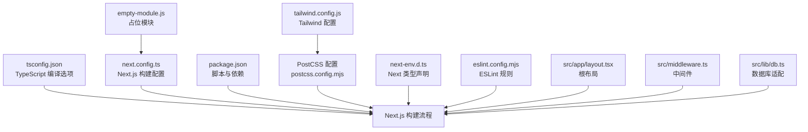
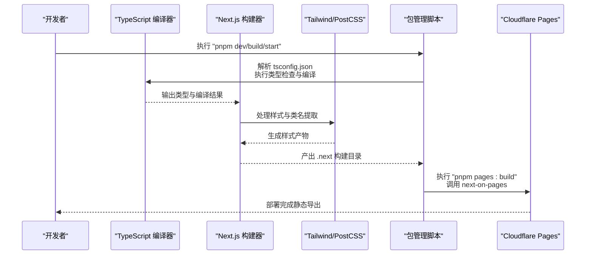
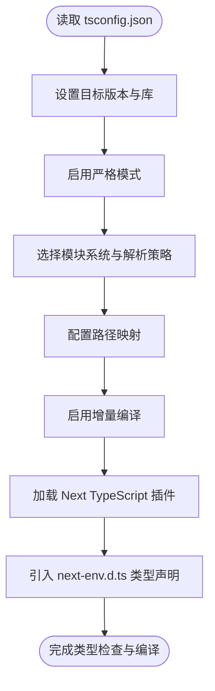
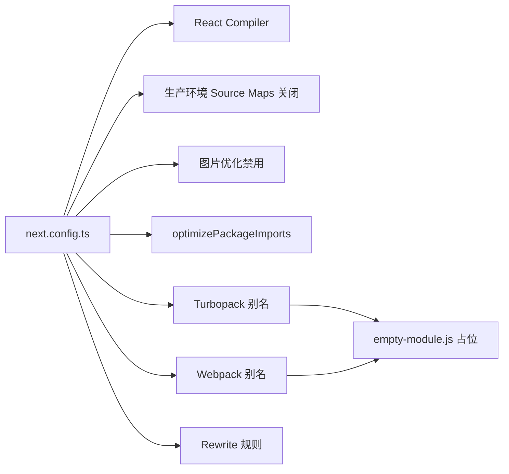
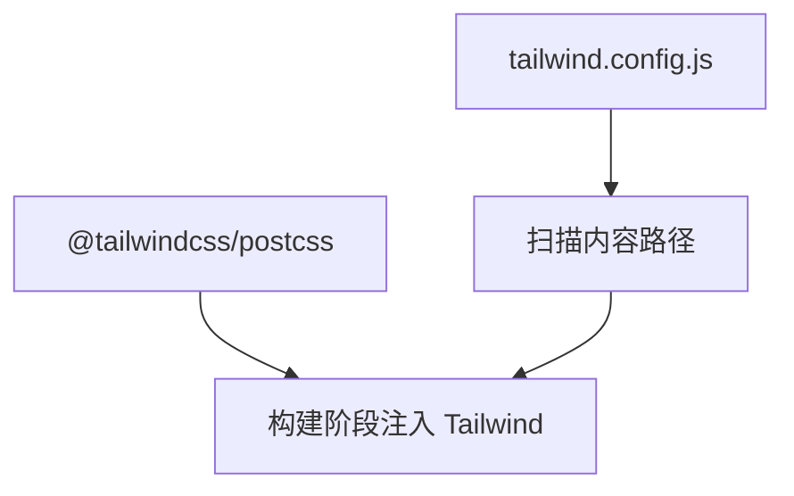
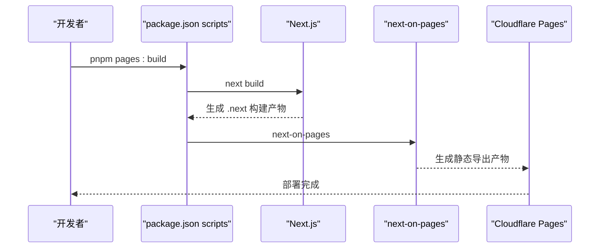
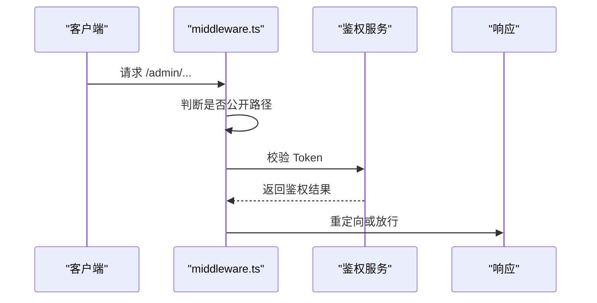
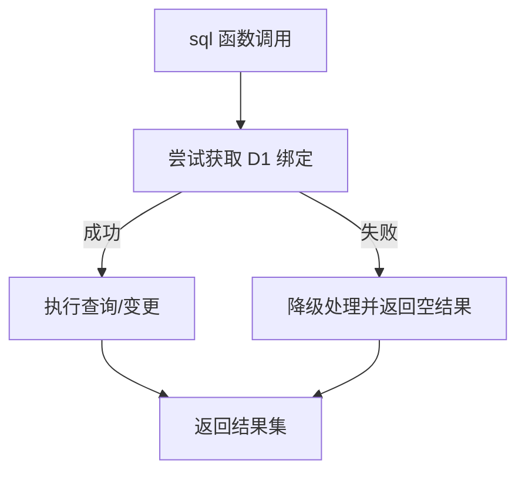
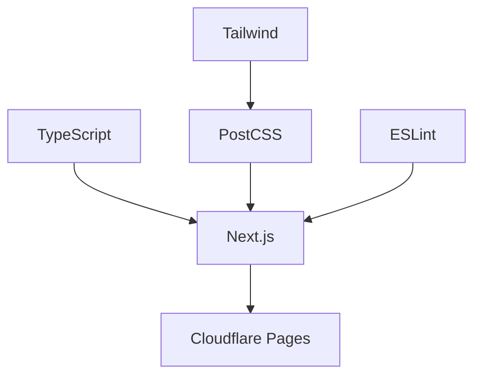

# 构建配置

<cite>
**本文引用的文件**
- [tsconfig.json](file://tsconfig.json)
- [next.config.ts](file://next.config.ts)
- [package.json](file://package.json)
- [tailwind.config.js](file://tailwind.config.js)
- [postcss.config.mjs](file://postcss.config.mjs)
- [empty-module.js](file://empty-module.js)
- [next-env.d.ts](file://next-env.d.ts)
- [eslint.config.mjs](file://eslint.config.mjs)
- [src/app/layout.tsx](file://src/app/layout.tsx)
- [src/middleware.ts](file://src/middleware.ts)
- [src/lib/db.ts](file://src/lib/db.ts)
</cite>

## 目录
1. [简介](#简介)
2. [项目结构](#项目结构)
3. [核心组件](#核心组件)
4. [架构总览](#架构总览)
5. [详细组件分析](#详细组件分析)
6. [依赖分析](#依赖分析)
7. [性能考虑](#性能考虑)
8. [故障排查指南](#故障排查指南)
9. [结论](#结论)
10. [附录](#附录)

## 简介
本文件系统性梳理本项目的构建配置与流程，重点覆盖以下方面：
- TypeScript 编译选项：严格模式、模块解析、路径映射、增量编译等对类型安全与构建效率的影响
- Next.js 构建配置：React Compiler、图片优化、包导入优化、Turbopack 别名、Webpack 别名、重写规则等
- 构建流程：开发与生产环境差异、Cloudflare Pages 部署脚本、Source Maps 控制
- 性能优化：按需优化第三方库、禁用不必要的运行时特性、减少打包体积
- 常见问题：Edge Runtime 兼容、模块别名、图片优化与静态导出

## 项目结构
本项目采用 Next.js App Router 结构，前端资源位于 src 目录，构建与部署相关配置集中在根目录的配置文件中。关键配置文件如下：
- TypeScript 配置：tsconfig.json
- Next.js 配置：next.config.ts
- 包管理与脚本：package.json
- 样式工具链：tailwind.config.js、postcss.config.mjs
- 辅助占位模块：empty-module.js
- 类型声明：next-env.d.ts
- 代码规范：eslint.config.mjs
- 关键业务文件：src/app/layout.tsx、src/middleware.ts、src/lib/db.ts

图表来源
- [tsconfig.json](file://tsconfig.json#L1-L35)
- [next.config.ts](file://next.config.ts#L1-L41)
- [package.json](file://package.json#L1-L50)
- [tailwind.config.js](file://tailwind.config.js#L1-L14)
- [postcss.config.mjs](file://postcss.config.mjs#L1-L8)
- [empty-module.js](file://empty-module.js#L1-L2)
- [next-env.d.ts](file://next-env.d.ts#L1-L7)
- [eslint.config.mjs](file://eslint.config.mjs#L1-L28)
- [src/app/layout.tsx](file://src/app/layout.tsx#L1-L40)
- [src/middleware.ts](file://src/middleware.ts#L1-L43)
- [src/lib/db.ts](file://src/lib/db.ts#L1-L69)

章节来源
- [tsconfig.json](file://tsconfig.json#L1-L35)
- [next.config.ts](file://next.config.ts#L1-L41)
- [package.json](file://package.json#L1-L50)
- [tailwind.config.js](file://tailwind.config.js#L1-L14)
- [postcss.config.mjs](file://postcss.config.mjs#L1-L8)
- [empty-module.js](file://empty-module.js#L1-L2)
- [next-env.d.ts](file://next-env.d.ts#L1-L7)
- [eslint.config.mjs](file://eslint.config.mjs#L1-L28)
- [src/app/layout.tsx](file://src/app/layout.tsx#L1-L40)
- [src/middleware.ts](file://src/middleware.ts#L1-L43)
- [src/lib/db.ts](file://src/lib/db.ts#L1-L69)

## 核心组件
- TypeScript 编译器配置：通过严格模式、模块解析策略、路径映射与增量编译提升类型安全与开发体验
- Next.js 构建配置：启用 React Compiler、禁用图片优化、优化包导入、配置 Turbopack/Webpack 别名、重写路由
- 样式工具链：Tailwind 与 PostCSS 配合，确保内容扫描范围覆盖 App Router 路径
- 开发与生产脚本：统一的 dev/build/start 脚本，结合 Cloudflare Pages 的 next-on-pages 脚本进行静态导出
- ESLint 规则：基于 eslint-config-next，适度放宽部分规则以提升开发体验

章节来源
- [tsconfig.json](file://tsconfig.json#L1-L35)
- [next.config.ts](file://next.config.ts#L1-L41)
- [package.json](file://package.json#L1-L50)
- [tailwind.config.js](file://tailwind.config.js#L1-L14)
- [postcss.config.mjs](file://postcss.config.mjs#L1-L8)
- [eslint.config.mjs](file://eslint.config.mjs#L1-L28)

## 架构总览
下图展示从源码到最终产物的关键构建路径，包括 TypeScript 编译、Next.js 构建、样式处理与部署脚本。

图表来源
- [tsconfig.json](file://tsconfig.json#L1-L35)
- [next.config.ts](file://next.config.ts#L1-L41)
- [package.json](file://package.json#L5-L11)
- [tailwind.config.js](file://tailwind.config.js#L1-L14)
- [postcss.config.mjs](file://postcss.config.mjs#L1-L8)

## 详细组件分析

### TypeScript 编译选项详解
- 目标与库：目标版本与内置库集合决定运行时 API 可用性与 polyfill 需求
- 严格模式：开启严格类型检查，降低运行时错误风险
- 模块与解析：使用 bundler 模式与 esnext 模块，配合路径映射简化导入
- 路径映射：通过路径前缀统一指向 src 目录，提升可维护性
- 增量编译：启用增量编译，缩短二次构建时间
- 插件：集成 Next TypeScript 插件，增强 App Router 类型支持
- 类型声明：引入 next-env.d.ts，确保 Next.js 类型在项目中生效

图表来源
- [tsconfig.json](file://tsconfig.json#L2-L24)
- [next-env.d.ts](file://next-env.d.ts#L1-L7)

章节来源
- [tsconfig.json](file://tsconfig.json#L1-L35)
- [next-env.d.ts](file://next-env.d.ts#L1-L7)

### Next.js 构建配置与优化策略
- React Compiler：启用 React Compiler 提升渲染性能
- Source Maps：生产环境关闭浏览器端 Source Maps，减小产物体积
- 图片优化：禁用图片优化，避免 sharp 依赖带来的打包体积与兼容性问题
- 包导入优化：对常用库进行按需优化，减少打包体积
- Turbopack 别名：为特定原生模块提供占位模块，避免打包进入 Edge Worker
- Webpack 别名：在 Webpack 层面屏蔽 Node 专有模块，保证运行时兼容
- 重写规则：将图标请求重写到 API 路由，统一后端处理

图表来源
- [next.config.ts](file://next.config.ts#L3-L39)
- [empty-module.js](file://empty-module.js#L1-L2)

章节来源
- [next.config.ts](file://next.config.ts#L1-L41)
- [empty-module.js](file://empty-module.js#L1-L2)

### 样式工具链配置
- Tailwind 内容扫描：确保扫描 App Router 下的页面、组件与应用层文件
- PostCSS 插件：启用 Tailwind 插件，与 Tailwind 配置联动

图表来源
- [tailwind.config.js](file://tailwind.config.js#L1-L14)
- [postcss.config.mjs](file://postcss.config.mjs#L1-L8)

章节来源
- [tailwind.config.js](file://tailwind.config.js#L1-L14)
- [postcss.config.mjs](file://postcss.config.mjs#L1-L8)

### 构建脚本与部署流程
- 开发：next dev
- 生产构建：next build
- 启动：next start
- 部署到 Cloudflare Pages：先执行 next build，再执行 next-on-pages，并清理临时输出

图表来源
- [package.json](file://package.json#L5-L11)
- [next.config.ts](file://next.config.ts#L8-L10)

章节来源
- [package.json](file://package.json#L1-L50)
- [next.config.ts](file://next.config.ts#L1-L41)

### 中间件与运行时配置
- 中间件运行时：实验性边缘运行时，提升响应速度
- 认证逻辑：对受保护的管理后台路径进行鉴权与重定向
- 匹配器：仅对 /admin 路径下的请求执行中间件

图表来源
- [src/middleware.ts](file://src/middleware.ts#L5-L42)

章节来源
- [src/middleware.ts](file://src/middleware.ts#L1-L43)

### 数据库适配与运行时兼容
- 在边缘运行时通过上下文获取 D1 绑定，若不可用则降级处理
- 本地开发通过 Wrangler Pages 进行，确保 D1 绑定可用

图表来源
- [src/lib/db.ts](file://src/lib/db.ts#L27-L68)

章节来源
- [src/lib/db.ts](file://src/lib/db.ts#L1-L69)

## 依赖分析
- TypeScript 与 Next.js：TypeScript 作为类型检查与编译前置，Next.js 负责应用构建与运行时
- 样式工具链：Tailwind 与 PostCSS 形成样式管线，内容扫描覆盖 App Router 路径
- ESLint：基于 eslint-config-next，结合项目自定义规则，保障代码质量
- 部署：Cloudflare Pages 通过 next-on-pages 将 Next.js 产物静态化部署

图表来源
- [tsconfig.json](file://tsconfig.json#L1-L35)
- [next.config.ts](file://next.config.ts#L1-L41)
- [tailwind.config.js](file://tailwind.config.js#L1-L14)
- [postcss.config.mjs](file://postcss.config.mjs#L1-L8)
- [eslint.config.mjs](file://eslint.config.mjs#L1-L28)

章节来源
- [tsconfig.json](file://tsconfig.json#L1-L35)
- [next.config.ts](file://next.config.ts#L1-L41)
- [tailwind.config.js](file://tailwind.config.js#L1-L14)
- [postcss.config.mjs](file://postcss.config.mjs#L1-L8)
- [eslint.config.mjs](file://eslint.config.mjs#L1-L28)

## 性能考虑
- 启用 React Compiler：提升渲染性能，减少不必要的重渲染
- 禁用图片优化：避免 sharp 依赖，降低打包体积与兼容性开销
- 包导入优化：对常用库进行按需优化，减少整体包体
- Turbopack/Webpack 别名：屏蔽 Node 专有模块，避免打包进入 Edge Worker
- 增量编译：TypeScript 启用增量编译，缩短二次构建时间
- 关闭生产环境 Source Maps：减小产物体积，提升加载速度
- Tailwind 内容扫描：确保仅打包实际使用的样式，避免无用 CSS

## 故障排查指南
- Edge Runtime 兼容性
  - 症状：打包时报错或运行时缺失 Node 专有模块
  - 处理：通过 Turbopack/Webpack 别名将模块替换为占位模块，或在运行时检测并降级
  - 参考：next.config.ts 中的别名配置与 empty-module.js
- 图片优化导致的体积增大或兼容问题
  - 症状：构建体积异常增大或运行时报错
  - 处理：保持图片优化禁用，或在需要时使用静态资源替代
  - 参考：next.config.ts 中 images.unoptimized 配置
- 路由重写未生效
  - 症状：访问 /icons 无法转发到 /api/icons
  - 处理：确认 rewrite 规则与源路径匹配，检查 Next.js 版本对 rewrite 的支持
  - 参考：next.config.ts 中 rewrites 配置
- 类型错误或类型声明缺失
  - 症状：编辑器报错或类型不正确
  - 处理：确保 next-env.d.ts 正确引入，tsconfig.json include 范围覆盖 .next/types
  - 参考：next-env.d.ts 与 tsconfig.json
- ESLint 规则冲突
  - 症状：CI 或本地提示规则冲突
  - 处理：遵循 eslint-config-next 默认规则，必要时在 eslint.config.mjs 中调整
  - 参考：eslint.config.mjs

章节来源
- [next.config.ts](file://next.config.ts#L11-L39)
- [empty-module.js](file://empty-module.js#L1-L2)
- [next-env.d.ts](file://next-env.d.ts#L1-L7)
- [tsconfig.json](file://tsconfig.json#L25-L31)
- [eslint.config.mjs](file://eslint.config.mjs#L1-L28)

## 结论
本项目的构建配置围绕“类型安全、体积控制与运行时兼容”展开：TypeScript 严格模式与增量编译保障开发体验；Next.js 通过禁用图片优化、启用 React Compiler、配置包导入优化与别名屏蔽，显著降低打包体积并提升边缘运行时兼容性；Tailwind 与 PostCSS 确保样式按需生成；Cloudflare Pages 部署脚本实现一键静态化导出。上述策略在保证功能完整性的同时，兼顾了性能与可维护性。

## 附录
- 开发环境与生产环境差异
  - 开发：next dev，启用热更新与类型检查
  - 生产：next build 生成 .next 构建目录，next start 启动服务
  - 部署：pnpm pages:build 调用 next-on-pages，生成静态导出产物
- 关键配置清单
  - TypeScript：严格模式、模块解析、路径映射、增量编译、插件
  - Next.js：React Compiler、图片优化、包导入优化、别名屏蔽、重写规则
  - 样式：Tailwind 内容扫描、PostCSS 插件
  - 部署：Cloudflare Pages 与 next-on-pages

章节来源
- [package.json](file://package.json#L5-L11)
- [next.config.ts](file://next.config.ts#L3-L39)
- [tailwind.config.js](file://tailwind.config.js#L4-L8)
- [postcss.config.mjs](file://postcss.config.mjs#L1-L8)
- [tsconfig.json](file://tsconfig.json#L2-L24)