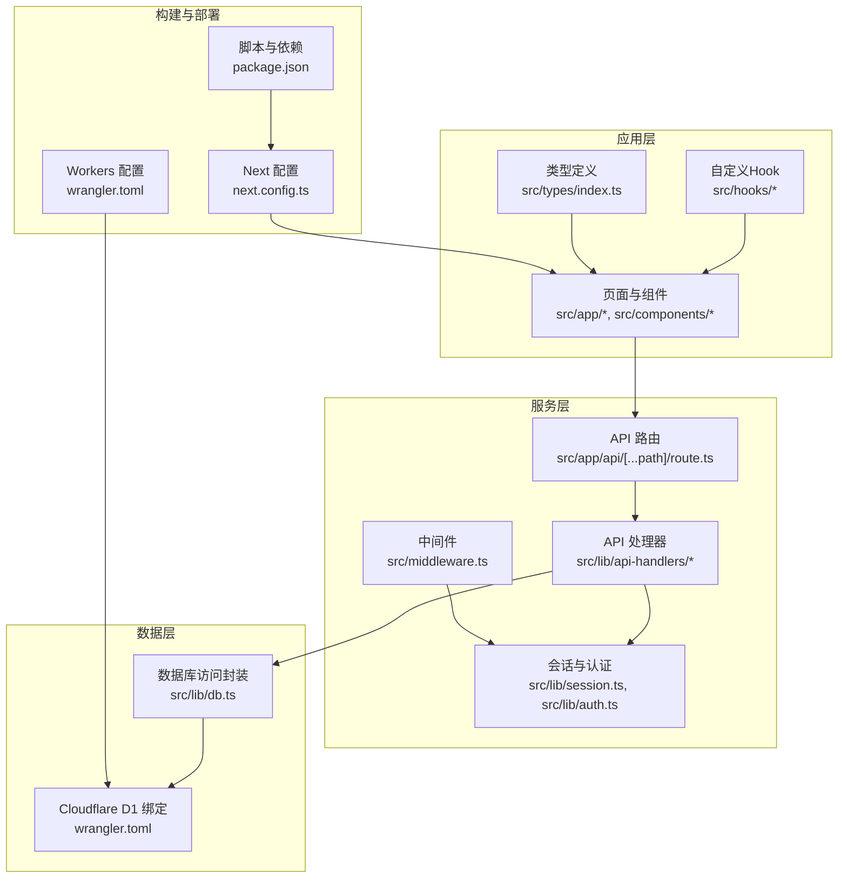
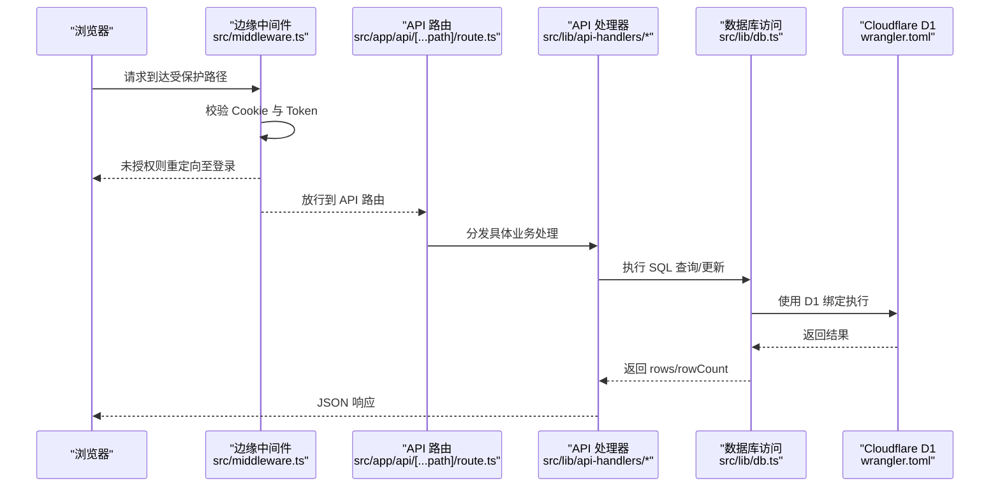
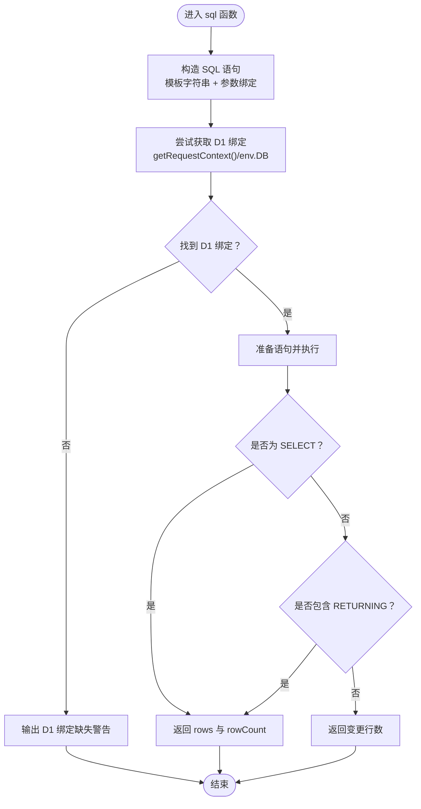
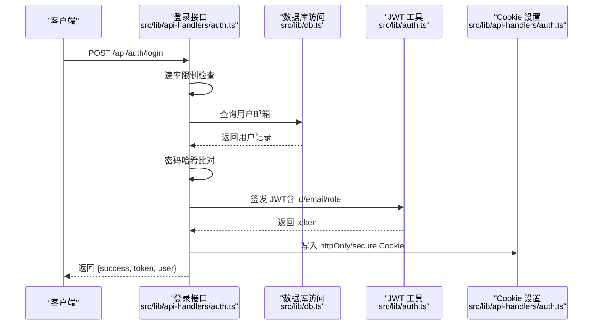
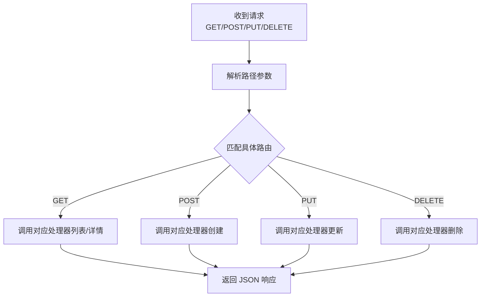
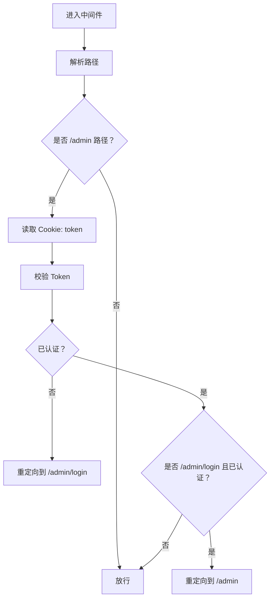
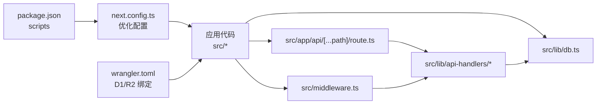

# 调试与性能监控

<cite>
**本文引用的文件**
- [package.json](file://package.json)
- [next.config.ts](file://next.config.ts)
- [wrangler.toml](file://wrangler.toml)
- [src/lib/db.ts](file://src/lib/db.ts)
- [src/middleware.ts](file://src/middleware.ts)
- [src/app/api/[...path]/route.ts](file://src/app/api/[...path]/route.ts)
- [src/lib/auth.ts](file://src/lib/auth.ts)
- [src/lib/session.ts](file://src/lib/session.ts)
- [src/lib/api-handlers/auth.ts](file://src/lib/api-handlers/auth.ts)
- [src/lib/api-handlers/categories.ts](file://src/lib/api-handlers/categories.ts)
- [src/lib/api-handlers/links.ts](file://src/lib/api-handlers/links.ts)
- [src/hooks/use-debounce.ts](file://src/hooks/use-debounce.ts)
- [src/types/index.ts](file://src/types/index.ts)
</cite>

## 目录
1. [简介](#简介)
2. [项目结构](#项目结构)
3. [核心组件](#核心组件)
4. [架构总览](#架构总览)
5. [详细组件分析](#详细组件分析)
6. [依赖关系分析](#依赖关系分析)
7. [性能考量](#性能考量)
8. [故障排查指南](#故障排查指南)
9. [结论](#结论)
10. [附录](#附录)

## 简介
本文件面向开发与运维团队，系统化梳理本项目的调试与性能监控实践，覆盖以下主题：
- 开发环境调试技巧：Next.js 开发服务器、热重载机制、构建缓存优化
- 性能分析方法：数据库查询性能、API 响应时间、内存使用跟踪
- 错误排查策略：日志记录、错误分类、定位与修复路径
- 生产环境日志与错误追踪：基于边缘运行时与 Workers 的可观测性建议

## 项目结构
该项目采用 Next.js App Router 结构，结合 Cloudflare Pages/Workers 运行时（通过 next-on-pages）。关键目录与职责如下：
- 源码根目录：src
  - app：页面与路由（含 API 路由）
  - lib：数据库访问、认证、会话、API 处理器等
  - components：UI 组件
  - hooks：自定义 Hook
  - types：类型定义
- 配置：next.config.ts、wrangler.toml
- 包管理：package.json

图表来源
- [next.config.ts](file://next.config.ts#L1-L41)
- [wrangler.toml](file://wrangler.toml#L1-L14)
- [src/lib/db.ts](file://src/lib/db.ts#L1-L69)
- [src/middleware.ts](file://src/middleware.ts#L1-L43)
- [src/app/api/[...path]/route.ts](file://src/app/api/[...path]/route.ts#L1-L147)
- [src/lib/api-handlers/auth.ts](file://src/lib/api-handlers/auth.ts#L1-L141)
- [src/lib/api-handlers/categories.ts](file://src/lib/api-handlers/categories.ts#L1-L199)
- [src/lib/api-handlers/links.ts](file://src/lib/api-handlers/links.ts#L1-L270)
- [src/lib/session.ts](file://src/lib/session.ts#L1-L14)
- [src/lib/auth.ts](file://src/lib/auth.ts#L1-L23)
- [src/types/index.ts](file://src/types/index.ts#L1-L53)
- [package.json](file://package.json#L1-L50)

章节来源
- [next.config.ts](file://next.config.ts#L1-L41)
- [wrangler.toml](file://wrangler.toml#L1-L14)
- [package.json](file://package.json#L1-L50)

## 核心组件
- 数据库访问封装：统一 SQL 构造、执行与错误处理，支持在边缘运行时通过 D1 绑定与本地回退场景
- 认证与会话：基于 JWT 的签发与校验，Cookie 存储与安全策略
- API 路由与处理器：集中式路由分发到各业务处理器，统一返回格式
- 中间件：边缘运行时下的鉴权与重定向逻辑
- 类型系统：统一的数据模型与响应结构，便于前后端一致性与静态检查

章节来源
- [src/lib/db.ts](file://src/lib/db.ts#L1-L69)
- [src/lib/auth.ts](file://src/lib/auth.ts#L1-L23)
- [src/lib/session.ts](file://src/lib/session.ts#L1-L14)
- [src/app/api/[...path]/route.ts](file://src/app/api/[...path]/route.ts#L1-L147)
- [src/lib/api-handlers/auth.ts](file://src/lib/api-handlers/auth.ts#L1-L141)
- [src/lib/api-handlers/categories.ts](file://src/lib/api-handlers/categories.ts#L1-L199)
- [src/lib/api-handlers/links.ts](file://src/lib/api-handlers/links.ts#L1-L270)
- [src/middleware.ts](file://src/middleware.ts#L1-L43)
- [src/types/index.ts](file://src/types/index.ts#L1-L53)

## 架构总览
下图展示从浏览器请求到数据库访问的关键链路，以及边缘运行时与 Workers 的集成点。

图表来源
- [src/middleware.ts](file://src/middleware.ts#L1-L43)
- [src/app/api/[...path]/route.ts](file://src/app/api/[...path]/route.ts#L1-L147)
- [src/lib/api-handlers/auth.ts](file://src/lib/api-handlers/auth.ts#L1-L141)
- [src/lib/api-handlers/categories.ts](file://src/lib/api-handlers/categories.ts#L1-L199)
- [src/lib/api-handlers/links.ts](file://src/lib/api-handlers/links.ts#L1-L270)
- [src/lib/db.ts](file://src/lib/db.ts#L1-L69)
- [wrangler.toml](file://wrangler.toml#L1-L14)

## 详细组件分析

### 数据库访问封装（SQL 执行与 D1 绑定）
- 设计要点
  - 使用模板字符串构造 SQL，绑定参数，避免拼接注入风险
  - 在边缘运行时优先使用 D1 绑定；若不可用，输出警告提示（确保通过 wrangler pages dev 启动并正确配置 D1）
  - 对 SELECT 与非 SELECT 分支分别处理返回值，支持 RETURNING 场景
- 性能与可靠性
  - 通过统一入口减少重复连接与错误处理分支
  - 边缘运行时下避免 Node.js 专有模块（如 better-sqlite3、sharp），降低打包体积与运行时开销
- 调试建议
  - 在开发阶段确认 D1 绑定是否可用，关注控制台警告
  - 对高频查询增加日志埋点，定位慢查询与异常错误

图表来源
- [src/lib/db.ts](file://src/lib/db.ts#L12-L68)

章节来源
- [src/lib/db.ts](file://src/lib/db.ts#L1-L69)
- [next.config.ts](file://next.config.ts#L14-L30)
- [wrangler.toml](file://wrangler.toml#L6-L9)

### 认证与会话（JWT、Cookie、速率限制）
- 设计要点
  - 使用 HS256 签发 JWT，设置过期时间
  - 登录成功后写入 httpOnly、secure、sameSite=strict 的 Cookie
  - 内存级速率限制（按 IP 窗口计数），防止暴力破解
- 性能与可靠性
  - 速率限制为纯内存实现，适合单实例；多实例需共享存储
  - 登录流程中对用户密码进行哈希比对，避免明文存储
- 调试建议
  - 在登录前打印用户角色信息，验证权限链路
  - 观察 429 Too Many Requests 的触发条件，调整窗口与阈值

图表来源
- [src/lib/api-handlers/auth.ts](file://src/lib/api-handlers/auth.ts#L49-L129)
- [src/lib/db.ts](file://src/lib/db.ts#L75-L78)
- [src/lib/auth.ts](file://src/lib/auth.ts#L7-L13)

章节来源
- [src/lib/auth.ts](file://src/lib/auth.ts#L1-L23)
- [src/lib/api-handlers/auth.ts](file://src/lib/api-handlers/auth.ts#L1-L141)
- [src/lib/session.ts](file://src/lib/session.ts#L1-L14)

### API 路由与处理器（统一入口与业务分发）
- 设计要点
  - 单一路由集中处理 GET/POST/PUT/DELETE，根据路径分发到对应处理器
  - 处理器内部统一进行鉴权、参数校验、数据库操作与 revalidatePath 清理
- 性能与可靠性
  - 使用 Zod 校验请求体，减少无效调用
  - 对高并发写入（如链接排序）使用批量更新，减少往返次数
- 调试建议
  - 在处理器入口打印请求路径与关键参数，便于定位问题
  - 对异常路径返回统一的 404 响应，避免泄露内部细节

图表来源
- [src/app/api/[...path]/route.ts](file://src/app/api/[...path]/route.ts#L12-L146)

章节来源
- [src/app/api/[...path]/route.ts](file://src/app/api/[...path]/route.ts#L1-L147)
- [src/lib/api-handlers/categories.ts](file://src/lib/api-handlers/categories.ts#L1-L199)
- [src/lib/api-handlers/links.ts](file://src/lib/api-handlers/links.ts#L1-L270)

### 中间件（边缘运行时鉴权与重定向）
- 设计要点
  - 仅对 /admin 路径生效，区分公开与受保护路径
  - 读取 Cookie 中的 token，校验后放行或重定向
- 性能与可靠性
  - 使用实验性边缘运行时，具备低延迟与高吞吐特性
  - 通过 matcher 精准限定中间件作用范围，减少不必要处理
- 调试建议
  - 在中间件中打印当前路径与认证状态，快速判断重定向原因

图表来源
- [src/middleware.ts](file://src/middleware.ts#L7-L34)

章节来源
- [src/middleware.ts](file://src/middleware.ts#L1-L43)

### 类型系统（统一数据模型与响应结构）
- 设计要点
  - 定义 User、Category、Link 等核心实体
  - 统一 ApiResponse 接口，便于前端消费
- 性能与可靠性
  - 类型约束减少运行时错误，提升可维护性
- 调试建议
  - 在接口返回处使用类型断言辅助 IDE 提示与静态检查

章节来源
- [src/types/index.ts](file://src/types/index.ts#L1-L53)

### 自定义 Hook（防抖）
- 设计要点
  - 使用定时器实现输入防抖，降低频繁请求
- 性能与可靠性
  - 合理设置延迟，平衡用户体验与请求频率
- 调试建议
  - 在组件中打印防抖后的值，验证触发时机

章节来源
- [src/hooks/use-debounce.ts](file://src/hooks/use-debounce.ts#L1-L15)

## 依赖关系分析
- 构建与运行时
  - next.config.ts 启用 React Compiler、图片优化关闭、包导入优化与 Turbopack 别名，减少打包体积与运行时依赖
  - package.json 定义开发、构建与部署脚本，结合 next-on-pages 输出静态资源
- 数据层
  - wrangler.toml 声明 D1 与 R2 绑定，供边缘运行时访问
- 应用层
  - API 路由与处理器依赖数据库访问封装与认证工具
  - 中间件依赖认证工具与会话读取

图表来源
- [package.json](file://package.json#L5-L11)
- [next.config.ts](file://next.config.ts#L3-L39)
- [wrangler.toml](file://wrangler.toml#L1-L14)

章节来源
- [package.json](file://package.json#L1-L50)
- [next.config.ts](file://next.config.ts#L1-L41)
- [wrangler.toml](file://wrangler.toml#L1-L14)

## 性能考量
- 开发服务器与热重载
  - 使用 Next.js 开发服务器进行本地调试，热重载自动刷新页面
  - 通过 Turbopack 别名与包导入优化，减少不必要的依赖打包
- 构建缓存与体积优化
  - 关闭生产环境浏览器 Source Maps 以减小产物体积
  - 图片优化关闭，避免 sharp 依赖带来的打包体积与运行时开销
  - 使用 optimizePackageImports 仅按需引入指定包
- 边缘运行时与数据库
  - 在边缘运行时直接使用 D1 绑定，避免 Node.js 专有模块
  - 对高频查询与写入路径进行日志埋点，识别慢查询与热点接口
- API 响应时间与内存
  - 对登录、列表、分页等关键接口增加响应时间统计
  - 使用统一的速率限制与幂等设计，降低重复请求与异常开销
- 建议的监控指标
  - 数据库：慢查询数量、平均执行时间、错误率
  - API：P50/P90/P99 响应时间、错误码分布、QPS
  - 运行时：内存占用峰值、GC 次数、CPU 占用

[本节为通用性能指导，无需特定文件引用]

## 故障排查指南
- 开发环境
  - 确认 D1 绑定可用：若出现 D1 绑定缺失警告，使用 wrangler pages dev 启动并检查 wrangler.toml 配置
  - 检查中间件是否正确拦截 /admin 路径，核对 Cookie 是否携带与有效
  - 查看 API 路由分发是否命中预期处理器，关注 404 响应
- 数据库
  - 关注 SQL 执行错误与约束冲突（唯一索引、外键等），结合日志定位重复插入与更新失败
  - 对高频查询增加 LIMIT 与索引建议，避免全表扫描
- 认证与会话
  - 登录失败时检查速率限制触发与凭据校验流程
  - Cookie 安全属性在生产环境需启用 secure 与 httpOnly
- 生产环境日志与错误追踪
  - 利用边缘运行时日志与 Workers 日志进行错误定位
  - 对关键路径（登录、列表、写入）增加结构化日志，便于检索与聚合
  - 使用统一的错误响应格式，便于前端与监控系统消费

章节来源
- [src/lib/db.ts](file://src/lib/db.ts#L64-L67)
- [src/middleware.ts](file://src/middleware.ts#L24-L32)
- [src/app/api/[...path]/route.ts](file://src/app/api/[...path]/route.ts#L46-L95)
- [src/lib/api-handlers/auth.ts](file://src/lib/api-handlers/auth.ts#L52-L57)
- [src/lib/api-handlers/links.ts](file://src/lib/api-handlers/links.ts#L107-L114)
- [wrangler.toml](file://wrangler.toml#L6-L9)

## 结论
本项目在边缘运行时下实现了轻量、可扩展的认证、API 与数据库访问体系。通过合理的配置与统一的错误处理，能够在开发与生产环境中高效地进行调试与性能优化。建议持续完善日志与指标体系，结合边缘运行时能力进一步优化冷启动与热点路径性能。

[本节为总结性内容，无需特定文件引用]

## 附录
- 开发命令
  - 启动开发服务器：参考 scripts.dev
  - 构建与部署：参考 scripts.build 与 scripts.pages:build
- 关键配置
  - Next.js 配置：React Compiler、图片优化、包导入优化、Turbopack 别名
  - Workers 配置：D1 与 R2 绑定声明

章节来源
- [package.json](file://package.json#L5-L11)
- [next.config.ts](file://next.config.ts#L4-L30)
- [wrangler.toml](file://wrangler.toml#L6-L13)