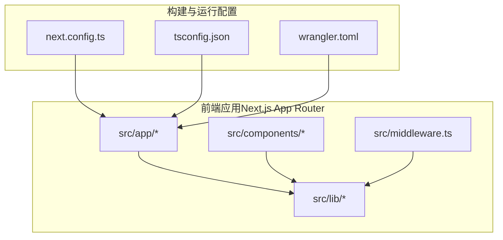
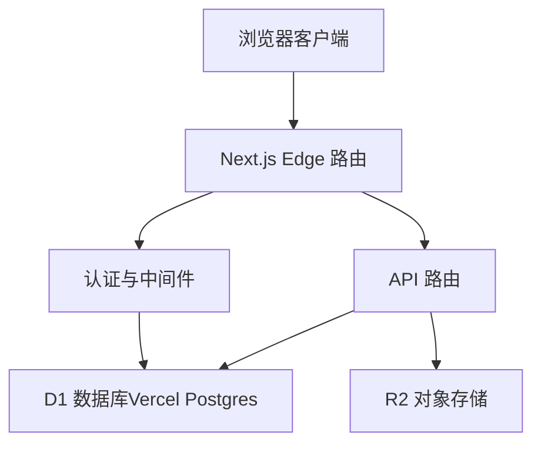
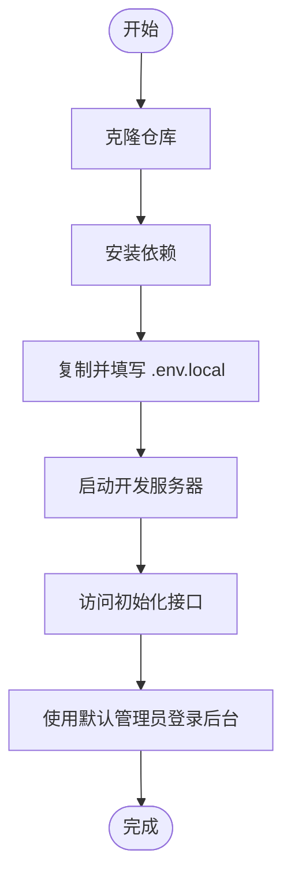
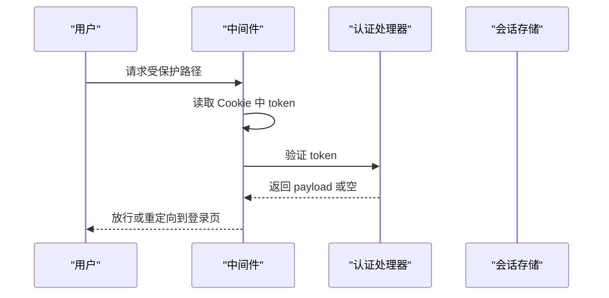
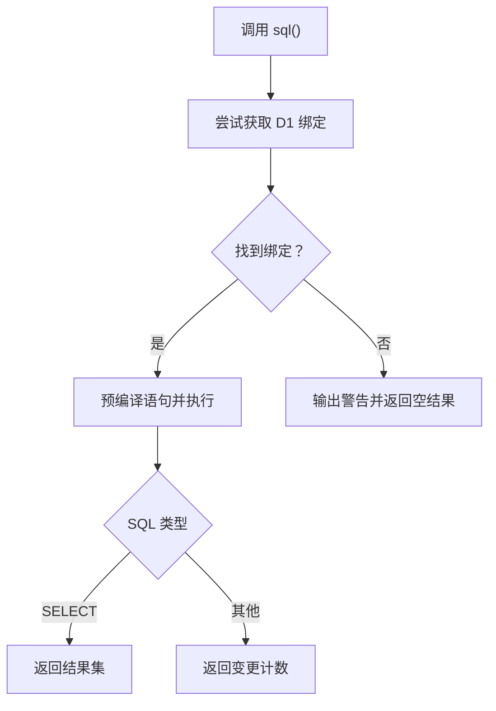
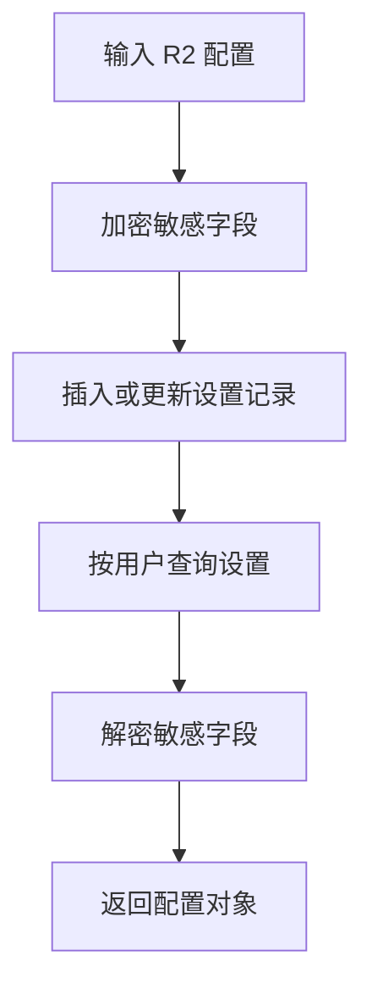
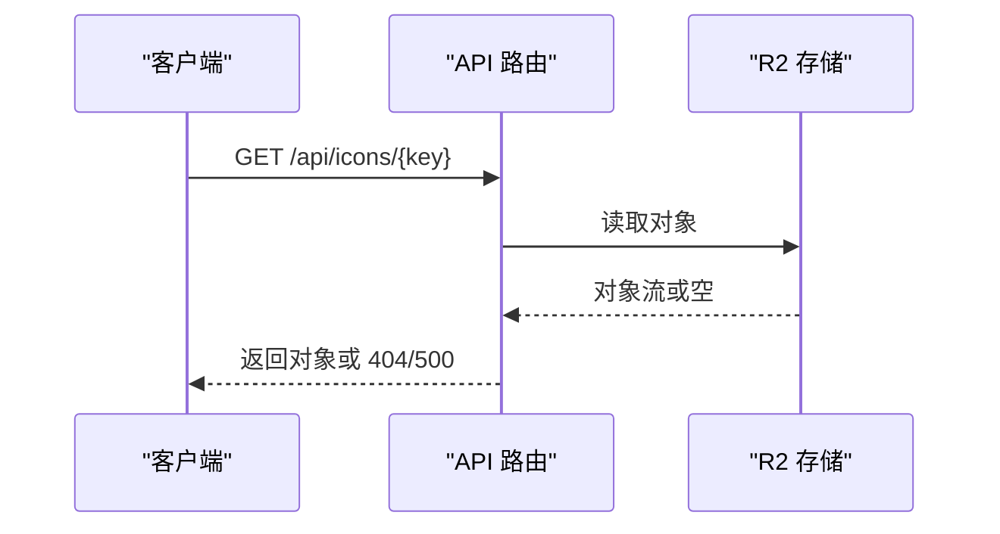
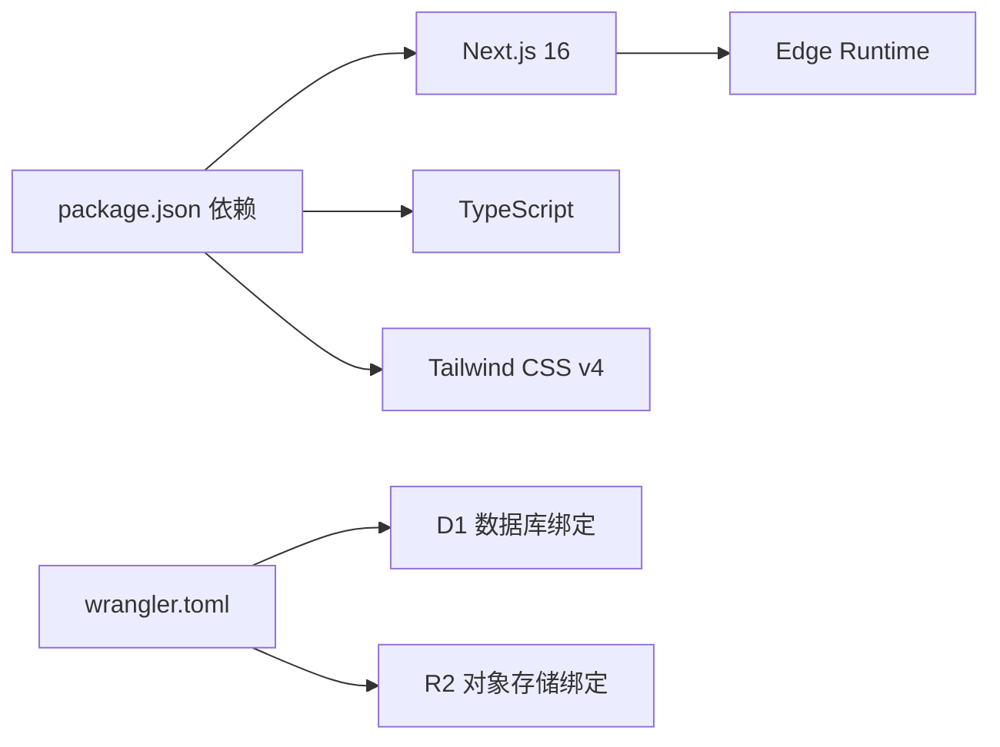

# 快速开始

<cite>
**本文引用的文件**
- [README.md](file://README.md)
- [package.json](file://package.json)
- [.env.example](file://.env.example)
- [next.config.ts](file://next.config.ts)
- [tsconfig.json](file://tsconfig.json)
- [wrangler.toml](file://wrangler.toml)
- [src/lib/db.ts](file://src/lib/db.ts)
- [src/lib/settings.ts](file://src/lib/settings.ts)
- [src/lib/auth.ts](file://src/lib/auth.ts)
- [src/middleware.ts](file://src/middleware.ts)
- [src/app/api/[...path]/route.ts](file://src/app/api/[...path]/route.ts)
- [src/app/api/icons/[...path]/route.ts](file://src/app/api/icons/[...path]/route.ts)
- [tailwind.config.js](file://tailwind.config.js)
</cite>

## 目录
1. [简介](#简介)
2. [项目结构](#项目结构)
3. [核心组件](#核心组件)
4. [架构总览](#架构总览)
5. [详细组件分析](#详细组件分析)
6. [依赖关系分析](#依赖关系分析)
7. [性能注意事项](#性能注意事项)
8. [故障排查指南](#故障排查指南)
9. [结论](#结论)
10. [附录](#附录)

## 简介
本指南面向初学者，帮助你在本地快速搭建并运行导航站点系统。你将完成以下任务：准备 Node.js 环境与包管理器、创建 Vercel 账户并配置 Vercel Postgres 数据库、复制并填写环境变量、安装依赖、启动开发服务器、初始化数据库并完成首次登录。

## 项目结构
该仓库采用 Next.js App Router 结构，核心目录与职责如下：
- src/app：页面与 API 路由（公共页、管理员页、API）
- src/components：可复用 UI 组件与布局组件
- src/lib：数据库访问、认证、设置等通用逻辑
- src/middleware.ts：中间件，保护管理员路径
- next.config.ts：Next.js 构建与运行配置
- wrangler.toml：Cloudflare Pages/Workers 配置（含 D1 绑定）

**图表来源**
- [next.config.ts](file://next.config.ts#L1-L41)
- [tsconfig.json](file://tsconfig.json#L1-L35)
- [wrangler.toml](file://wrangler.toml#L1-L14)

**章节来源**
- [README.md](file://README.md#L65-L72)
- [next.config.ts](file://next.config.ts#L1-L41)
- [tsconfig.json](file://tsconfig.json#L1-L35)
- [wrangler.toml](file://wrangler.toml#L1-L14)

## 核心组件
- 数据库访问层：通过统一的 sql 函数在 Edge Runtime 下访问 D1，并在本地开发时通过 Wrangler Pages 提供 D1 绑定。
- 认证与中间件：基于 JWT 的登录与会话校验，中间件拦截管理员路径进行权限控制。
- 设置与加密：应用设置表与 R2 配置的加密存储，使用 Web Crypto API 生成与导入密钥。
- API 路由：集中处理认证、分类、链接、导入导出、元数据抓取等请求。

**章节来源**
- [src/lib/db.ts](file://src/lib/db.ts#L1-L69)
- [src/lib/auth.ts](file://src/lib/auth.ts#L1-L23)
- [src/middleware.ts](file://src/middleware.ts#L1-L43)
- [src/lib/settings.ts](file://src/lib/settings.ts#L1-L149)
- [src/app/api/[...path]/route.ts](file://src/app/api/[...path]/route.ts#L1-L147)

## 架构总览
系统采用 Edge Runtime（Next.js Edge + Cloudflare Workers/D1），在本地通过 Wrangler Pages Dev 启动，部署至 Vercel Pages 时自动绑定 D1 与 R2。

**图表来源**
- [src/app/api/[...path]/route.ts](file://src/app/api/[...path]/route.ts#L10-L147)
- [src/lib/db.ts](file://src/lib/db.ts#L25-L67)
- [wrangler.toml](file://wrangler.toml#L6-L13)

## 详细组件分析

### 环境要求与依赖安装
- Node.js 版本：18 及以上
- 包管理器：推荐 pnpm 或 npm
- 安装命令：执行依赖安装脚本
- 开发服务器：启动本地开发服务

**章节来源**
- [README.md](file://README.md#L22-L27)
- [README.md](file://README.md#L32-L35)
- [README.md](file://README.md#L46-L49)
- [package.json](file://package.json#L5-L11)

### Vercel 账户与 Vercel Postgres 配置
- 在 Vercel 创建账户后，部署时将提示添加 Vercel Postgres 数据库
- 部署完成后，在 Vercel 项目中设置以下环境变量：
  - POSTGRES_URL
  - POSTGRES_PRISMA_URL
  - POSTGRES_URL_NON_POOLING
  - JWT_SECRET
  - SETUP_SECRET
- 本地开发时，可通过 Vercel CLI 拉取环境变量到 .env.local

**章节来源**
- [README.md](file://README.md#L55-L63)
- [.env.example](file://.env.example#L3-L18)
- [README.md](file://README.md#L44)

### 环境变量配置示例
- 数据库连接：POSTGRES_URL、POSTGRES_PRISMA_URL、POSTGRES_URL_NON_POOLING
- 认证密钥：JWT_SECRET
- 初始化密钥：SETUP_SECRET
- R2 存储（可选）：R2_ACCOUNT_ID、R2_ACCESS_KEY_ID、R2_SECRET_ACCESS_KEY、R2_BUCKET_NAME、R2_PUBLIC_BASE_URL
- 应用设置加密：SETTINGS_ENCRYPTION_KEY

**章节来源**
- [.env.example](file://.env.example#L3-L29)

### 本地开发流程
- 步骤 1：克隆仓库
- 步骤 2：安装依赖
- 步骤 3：复制并填写环境变量（.env.local）
- 步骤 4：启动开发服务器
- 步骤 5：初始化数据库（访问指定 URL 触发初始化）
- 步骤 6：使用默认管理员账号登录后台

**章节来源**
- [README.md](file://README.md#L31-L54)
- [package.json](file://package.json#L5-L11)

### 数据库初始化步骤
- 初始化接口：访问 http://localhost:3000/api/setup?secret=your-setup-secret
- 初始化内容：创建数据表并生成默认管理员用户
- 默认管理员信息：邮箱与密码见文档说明

**章节来源**
- [README.md](file://README.md#L51-L54)

### 认证与中间件
- 登录与签发：使用 JWT Secret 对用户信息进行签名，设置过期时间
- 中间件保护：对 /admin 路径进行鉴权，未登录重定向至登录页；已登录访问登录页则重定向至后台
- Cookie 校验：从 Cookie 中读取 token 并验证有效性

**图表来源**
- [src/middleware.ts](file://src/middleware.ts#L7-L35)
- [src/lib/auth.ts](file://src/lib/auth.ts#L7-L22)

**章节来源**
- [src/lib/auth.ts](file://src/lib/auth.ts#L1-L23)
- [src/middleware.ts](file://src/middleware.ts#L1-L43)

### 数据库访问层（D1 适配）
- 统一查询入口：sql 函数支持模板字符串参数化查询
- 运行时适配：优先从 Edge Runtime 上下文获取 D1 绑定；若不存在则输出警告
- 本地开发：通过 Wrangler Pages Dev 提供 D1 绑定，确保本地与线上一致

**图表来源**
- [src/lib/db.ts](file://src/lib/db.ts#L12-L67)

**章节来源**
- [src/lib/db.ts](file://src/lib/db.ts#L1-L69)
- [wrangler.toml](file://wrangler.toml#L6-L9)

### 应用设置与 R2 加密存储
- 设置表：app_settings 表用于存储用户级应用设置（如 R2 配置）
- 加密机制：使用 Web Crypto API 基于密钥派生生成 AES-GCM 密钥，对敏感字段进行加解密
- 读写流程：插入或更新前加密，查询后解密，失败时安全降级为空值

**图表来源**
- [src/lib/settings.ts](file://src/lib/settings.ts#L68-L148)

**章节来源**
- [src/lib/settings.ts](file://src/lib/settings.ts#L1-L149)

### API 路由与图标服务
- 路由分发：集中处理认证、分类、链接、导入导出、元数据抓取等请求
- 图标服务：通过 R2 按路径读取图标对象，返回带 HTTP 元数据的响应

**图表来源**
- [src/app/api/[...path]/route.ts](file://src/app/api/[...path]/route.ts#L12-L47)
- [src/app/api/icons/[...path]/route.ts](file://src/app/api/icons/[...path]/route.ts#L6-L36)

**章节来源**
- [src/app/api/[...path]/route.ts](file://src/app/api/[...path]/route.ts#L1-L147)
- [src/app/api/icons/[...path]/route.ts](file://src/app/api/icons/[...path]/route.ts#L1-L37)

## 依赖关系分析
- 构建与运行：Next.js 16、TypeScript、Tailwind CSS v4
- 边缘运行时：Edge Runtime（实验性）与 Turbopack 别名配置
- 本地优化：禁用图片优化、排除 Node 专有模块别名
- 部署集成：Cloudflare Workers Types、next-on-pages

**图表来源**
- [package.json](file://package.json#L12-L48)
- [next.config.ts](file://next.config.ts#L14-L30)
- [wrangler.toml](file://wrangler.toml#L1-L14)

**章节来源**
- [package.json](file://package.json#L1-L50)
- [next.config.ts](file://next.config.ts#L1-L41)
- [wrangler.toml](file://wrangler.toml#L1-L14)

## 性能注意事项
- 禁用生产环境 Source Maps 以减小产物体积
- 禁用图片优化，避免 sharp 依赖带来的打包体积与兼容性问题
- 仅在必要时启用图片优化，保持构建简洁
- 使用 optimizePackageImports 优化第三方包导入

**章节来源**
- [next.config.ts](file://next.config.ts#L4-L13)

## 故障排查指南
- D1 绑定缺失：本地开发需通过 Wrangler Pages Dev 启动，确保 D1 绑定可用；否则会输出警告
- R2 绑定缺失：图标读取接口会在缺少 R2 绑定时返回错误；请检查 R2 绑定配置
- 中间件重定向循环：已登录访问登录页会重定向至后台；请确认 Cookie 中 token 是否有效
- 初始化失败：确认 SETUP_SECRET 与初始化 URL 参数匹配；访问初始化接口后刷新页面

**章节来源**
- [src/lib/db.ts](file://src/lib/db.ts#L64-L67)
- [src/app/api/icons/[...path]/route.ts](file://src/app/api/icons/[...path]/route.ts#L15-L17)
- [src/middleware.ts](file://src/middleware.ts#L24-L32)
- [README.md](file://README.md#L51-L54)

## 结论
按照本指南完成环境准备、依赖安装、数据库初始化与默认管理员登录后，你即可在本地完整体验导航站点系统的功能。部署阶段只需在 Vercel 上完成数据库与环境变量配置，即可一键上线。

## 附录
- 本地开发端口：3000
- 默认管理员邮箱与密码：见初始化说明
- 部署按钮：参见 README 中的“Deploy with Vercel”链接

**章节来源**
- [README.md](file://README.md#L55-L63)