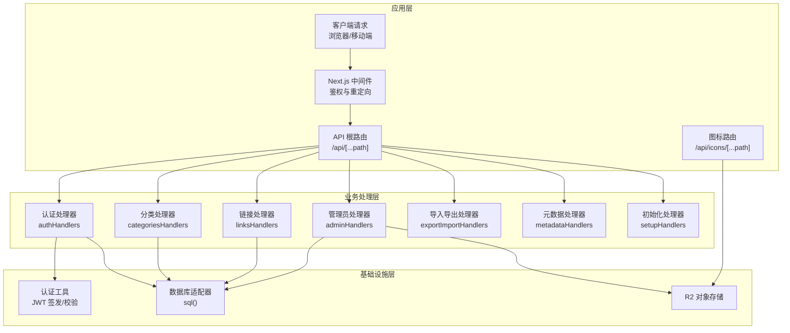
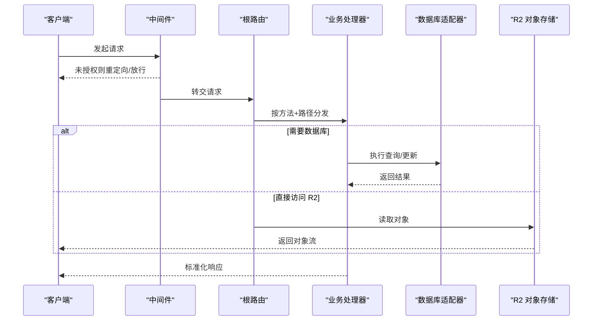
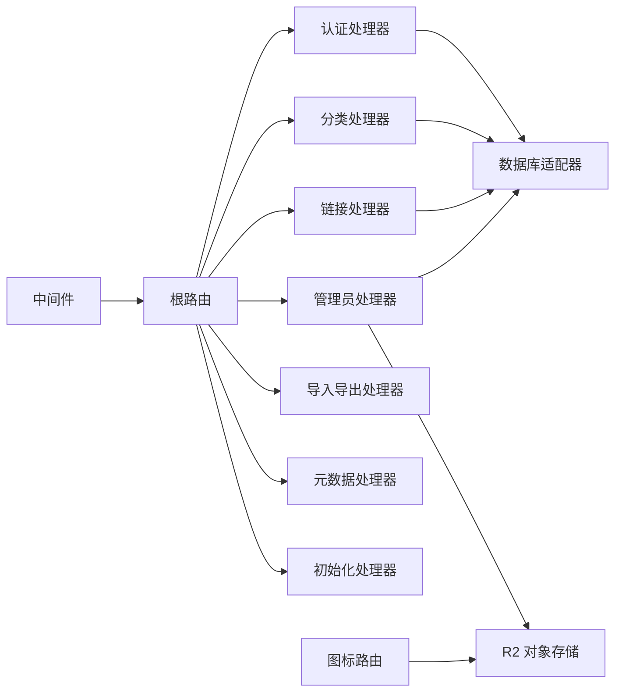

# API扩展模式

<cite>
**本文引用的文件**
- [src/app/api/[...path]/route.ts](file://src/app/api/[...path]/route.ts)
- [src/app/api/icons/[...path]/route.ts](file://src/app/api/icons/[...path]/route.ts)
- [src/middleware.ts](file://src/middleware.ts)
- [src/lib/db.ts](file://src/lib/db.ts)
- [src/lib/auth.ts](file://src/lib/auth.ts)
- [src/lib/api-handlers/auth.ts](file://src/lib/api-handlers/auth.ts)
- [src/lib/api-handlers/categories.ts](file://src/lib/api-handlers/categories.ts)
- [src/lib/api-handlers/links.ts](file://src/lib/api-handlers/links.ts)
- [src/lib/api-handlers/admin.ts](file://src/lib/api-handlers/admin.ts)
- [src/lib/api-handlers/export-import.ts](file://src/lib/api-handlers/export-import.ts)
- [src/lib/api-handlers/metadata.ts](file://src/lib/api-handlers/metadata.ts)
- [src/lib/api-handlers/setup.ts](file://src/lib/api-handlers/setup.ts)
- [src/types/index.ts](file://src/types/index.ts)
- [next.config.ts](file://next.config.ts)
- [package.json](file://package.json)
</cite>

## 目录
1. [简介](#简介)
2. [项目结构](#项目结构)
3. [核心组件](#核心组件)
4. [架构总览](#架构总览)
5. [详细组件分析](#详细组件分析)
6. [依赖关系分析](#依赖关系分析)
7. [性能考量](#性能考量)
8. [故障排查指南](#故障排查指南)
9. [结论](#结论)
10. [附录](#附录)

## 简介
本指南面向在 Next.js App Router 下进行 API 扩展开发的工程师，系统阐述如何设计新的 RESTful API 端点、扩展现有 API 处理器与实现 API 版本控制；涵盖 REST 设计原则、错误处理机制、请求验证策略；并提供路由扩展、中间件集成、性能优化的最佳实践，以及向后兼容性与安全防护要点。

## 项目结构
该项目采用 App Router 的约定式路由组织 API，主入口位于应用根目录的 API 路由中，通过通配符参数分发到各功能处理器。静态资源（图标）通过独立路由直接访问 R2 存储。

图表来源
- [src/app/api/[...path]/route.ts](file://src/app/api/[...path]/route.ts#L1-L147)
- [src/app/api/icons/[...path]/route.ts](file://src/app/api/icons/[...path]/route.ts#L1-L37)
- [src/middleware.ts](file://src/middleware.ts#L1-L43)
- [src/lib/db.ts](file://src/lib/db.ts#L1-L69)
- [src/lib/auth.ts](file://src/lib/auth.ts#L1-L23)

章节来源
- [src/app/api/[...path]/route.ts](file://src/app/api/[...path]/route.ts#L1-L147)
- [src/app/api/icons/[...path]/route.ts](file://src/app/api/icons/[...path]/route.ts#L1-L37)
- [src/middleware.ts](file://src/middleware.ts#L1-L43)
- [next.config.ts](file://next.config.ts#L1-L41)

## 核心组件
- API 路由分发器：统一处理 GET/POST/PUT/DELETE，按路径前缀分派到对应处理器。
- 处理器模块：按领域拆分（认证、分类、链接、管理员、导入导出、元数据、初始化），职责单一、可复用。
- 数据库适配器：兼容 Cloudflare Pages 的 D1 绑定，支持 Edge Runtime 查询与返回统计信息。
- 认证与中间件：基于 Cookie 的 JWT 鉴权，保护受控路径，提供登录登出与会话管理。
- 类型系统：统一的响应体与实体模型，确保前后端契约一致。
- 图标路由：直连 R2，支持缓存头与对象元数据透传。

章节来源
- [src/app/api/[...path]/route.ts](file://src/app/api/[...path]/route.ts#L1-L147)
- [src/lib/api-handlers/auth.ts](file://src/lib/api-handlers/auth.ts#L1-L141)
- [src/lib/api-handlers/categories.ts](file://src/lib/api-handlers/categories.ts#L1-L199)
- [src/lib/api-handlers/links.ts](file://src/lib/api-handlers/links.ts#L1-L270)
- [src/lib/api-handlers/admin.ts](file://src/lib/api-handlers/admin.ts#L1-L159)
- [src/lib/db.ts](file://src/lib/db.ts#L1-L69)
- [src/lib/auth.ts](file://src/lib/auth.ts#L1-L23)
- [src/types/index.ts](file://src/types/index.ts#L1-L53)
- [src/app/api/icons/[...path]/route.ts](file://src/app/api/icons/[...path]/route.ts#L1-L37)

## 架构总览
API 请求在进入业务逻辑之前，先经过中间件进行鉴权与路径匹配；随后由根路由根据 HTTP 方法与路径参数选择对应的处理器模块；处理器通过数据库适配器执行查询或写入，并返回标准化响应；静态图标资源通过独立路由直接访问 R2。

图表来源
- [src/middleware.ts](file://src/middleware.ts#L1-L43)
- [src/app/api/[...path]/route.ts](file://src/app/api/[...path]/route.ts#L1-L147)
- [src/lib/db.ts](file://src/lib/db.ts#L1-L69)
- [src/app/api/icons/[...path]/route.ts](file://src/app/api/icons/[...path]/route.ts#L1-L37)

## 详细组件分析

### API 路由分发器（根路由）
- 支持 Edge Runtime，统一处理 GET/POST/PUT/DELETE。
- 使用通配符参数解析完整路径，拼接为 fullPath 以匹配不同端点。
- 对于不存在的路径，返回统一的 404 响应。
- 典型端点示例：
  - GET /api/categories → 列表
  - POST /api/auth/login → 登录
  - PUT /api/links/reorder → 排序
  - DELETE /api/links/1 → 删除链接

最佳实践
- 新增端点时，优先在根路由注册路径映射，保持集中管理。
- 对于带 ID 的更新/删除，建议使用 PUT/DELETE + 路径参数，遵循 REST 语义。
- 对复杂路径，优先使用明确的子路径而非深层嵌套。

章节来源
- [src/app/api/[...path]/route.ts](file://src/app/api/[...path]/route.ts#L1-L147)

### 认证与会话（authHandlers）
- 登录流程：速率限制（按 IP）、Zod 校验、数据库查询用户、密码比对、签发 JWT 并设置 Cookie。
- 登出流程：删除 token Cookie。
- 安全要点：生产环境必须配置 JWT_SECRET；Cookie 设置 httpOnly/secure/sameSite；登录失败与凭据错误均返回 401。
- 速率限制：10 分钟内最多 20 次尝试，超限返回 429。

最佳实践
- 新增登录相关端点时，复用现有速率限制与输入校验逻辑。
- 登录成功后返回 token 与用户信息，前端需安全存储 token。
- 修改密码后主动使旧 token 失效（当前实现会强制登出）。

章节来源
- [src/lib/api-handlers/auth.ts](file://src/lib/api-handlers/auth.ts#L1-L141)
- [src/lib/auth.ts](file://src/lib/auth.ts#L1-L23)

### 分类管理（categoriesHandlers）
- 列表：支持按会话用户过滤，排序字段为 sort_order 与创建时间。
- 创建：仅管理员可操作；幂等性：若同名分类已存在则返回现有记录；唯一约束冲突时自动回退到查询现有记录。
- 更新：仅管理员可操作；支持部分字段更新；不存在时返回 404。
- 删除：仅管理员可操作；若存在子分类或链接则拒绝删除；支持幂等性（已删除返回成功）。

最佳实践
- 新增分类端点时，严格检查权限与输入合法性。
- 对外暴露的列表接口建议增加分页与搜索参数，避免一次性返回大量数据。

章节来源
- [src/lib/api-handlers/categories.ts](file://src/lib/api-handlers/categories.ts#L1-L199)

### 链接管理（linksHandlers）
- 列表：支持按分类、关键词搜索、分页；返回数据与总数；支持匿名与登录用户区分。
- 创建：仅管理员可操作；URL 去除尾随斜杠进行去重比较；Zod 校验字段范围；重复时返回 409。
- 更新/删除：仅管理员可操作；支持幂等性；更新时自动更新时间戳。
- 排序：批量更新 sort_order，保证顺序一致性。

最佳实践
- 新增链接端点时，务必进行 URL 正规化与重复检测。
- 大量更新场景建议使用批量接口（如排序）以减少往返。

章节来源
- [src/lib/api-handlers/links.ts](file://src/lib/api-handlers/links.ts#L1-L270)

### 管理员功能（adminHandlers）
- 清理图标：在 Cloudflare Edge 环境下提示无需手动清理，R2 由控制台管理。
- 安全设置：修改邮箱或密码需提供当前密码；修改后强制登出。
- 设置读取/更新：支持 R2 凭据与图标尺寸限制等配置；敏感信息掩码返回。
- 统计数据：快速聚合链接数、分类数、推荐数与最近链接。

最佳实践
- 敏感配置读取时始终掩码显示，避免泄露。
- 修改安全设置后主动登出，确保会话安全。

章节来源
- [src/lib/api-handlers/admin.ts](file://src/lib/api-handlers/admin.ts#L1-L159)

### 导入导出与元数据（export-import、metadata、setup）
- 导入：支持 Chrome/Safari 浏览器书签导入，返回导入数量、重复项与新增分类。
- 导出：提供统一导出接口，便于备份与迁移。
- 元数据：抓取网页标题/描述等信息，辅助完善链接信息。
- 初始化：首次运行时的系统初始化流程。

最佳实践
- 导入流程建议异步化并在后台队列处理，避免阻塞请求。
- 元数据抓取需考虑网络超时与反爬策略，必要时引入缓存。

章节来源
- [src/lib/api-handlers/export-import.ts](file://src/lib/api-handlers/export-import.ts)
- [src/lib/api-handlers/metadata.ts](file://src/lib/api-handlers/metadata.ts)
- [src/lib/api-handlers/setup.ts](file://src/lib/api-handlers/setup.ts)

### 图标路由（R2 直连）
- 通过 /api/icons/[...path] 直接访问 R2 对象，自动透传 HTTP 元数据与 ETag。
- 若 R2 绑定缺失，返回 500；对象不存在返回 404；异常捕获返回 500。

最佳实践
- 前端通过 /icons/* 代理到 /api/icons/*，减少跨域与路径复杂度。
- 合理设置缓存头与 ETag，提升图标加载性能。

章节来源
- [src/app/api/icons/[...path]/route.ts](file://src/app/api/icons/[...path]/route.ts#L1-L37)
- [next.config.ts](file://next.config.ts#L31-L38)

### 中间件与鉴权
- 受保护路径：/admin 开头的路由。
- 登录页面：/admin/login 不需要鉴权；已登录用户访问登录页重定向至仪表盘。
- 鉴权失败：重定向到登录页；已登录访问受保护路径但无权限返回 401（在处理器中体现）。

最佳实践
- 新增受保护路由时，在中间件中声明匹配规则。
- 鉴权失败的重定向策略与处理器级 401 协同，确保用户体验一致。

章节来源
- [src/middleware.ts](file://src/middleware.ts#L1-L43)

### 数据库适配器（D1 兼容）
- 在 Edge Runtime 下优先从上下文获取 D1 绑定；本地开发通过环境变量回退。
- 自动区分 SELECT/非 SELECT 语句，返回 rows 或变更计数。
- 错误捕获与日志输出，便于定位问题。

最佳实践
- 新增数据库操作时，统一通过 sql() 执行，避免直接使用原生驱动。
- 对于复杂查询，注意 SQL 注入风险，优先使用模板字符串绑定参数。

章节来源
- [src/lib/db.ts](file://src/lib/db.ts#L1-L69)

### 类型与响应规范
- 统一响应体：success、data、error、message 字段，便于前端统一处理。
- 实体类型：User、Category、Link 等，包含必要的字段与可选树形结构。
- 登录响应：token 与用户信息分离，避免泄露敏感字段。

最佳实践
- 新增端点时，明确响应体结构，保持与统一格式一致。
- 对外暴露的类型字段尽量最小化，遵循最小权限原则。

章节来源
- [src/types/index.ts](file://src/types/index.ts#L1-L53)

## 依赖关系分析
- 路由层依赖处理器模块；处理器模块依赖数据库适配器与认证工具。
- 中间件独立于业务处理器，负责全局鉴权与路径重定向。
- 图标路由直接依赖 R2，不经过业务处理器。
- 类型系统贯穿所有模块，确保契约一致。

图表来源
- [src/app/api/[...path]/route.ts](file://src/app/api/[...path]/route.ts#L1-L147)
- [src/middleware.ts](file://src/middleware.ts#L1-L43)
- [src/app/api/icons/[...path]/route.ts](file://src/app/api/icons/[...path]/route.ts#L1-L37)
- [src/lib/db.ts](file://src/lib/db.ts#L1-L69)
- [src/lib/api-handlers/admin.ts](file://src/lib/api-handlers/admin.ts#L1-L159)

章节来源
- [src/app/api/[...path]/route.ts](file://src/app/api/[...path]/route.ts#L1-L147)
- [src/middleware.ts](file://src/middleware.ts#L1-L43)
- [src/app/api/icons/[...path]/route.ts](file://src/app/api/icons/[...path]/route.ts#L1-L37)

## 性能考量
- Edge Runtime：根路由与图标路由均声明为 edge，降低冷启动与延迟。
- 重写规则：将 /icons/* 重写到 /api/icons/*，简化前端调用。
- 缓存头：图标路由透传 R2 的 HTTP 元数据与 ETag，利于浏览器缓存。
- 批量更新：链接排序使用 Promise.all 并行更新，减少往返。
- 分页与限制：列表接口默认限制每页条数，避免大结果集。
- 依赖裁剪：webpack 别名屏蔽 Node 专有模块，避免打包进 Edge Worker。

最佳实践
- 新增端点时优先使用 edge runtime。
- 对热点数据增加缓存策略（如图标 ETag）。
- 大批量写入使用并行或事务，注意数据库压力与并发控制。

章节来源
- [src/app/api/[...path]/route.ts](file://src/app/api/[...path]/route.ts#L10-L10)
- [src/app/api/icons/[...path]/route.ts](file://src/app/api/icons/[...path]/route.ts#L4-L4)
- [next.config.ts](file://next.config.ts#L31-L38)
- [src/lib/api-handlers/links.ts](file://src/lib/api-handlers/links.ts#L254-L258)

## 故障排查指南
常见错误与处理
- 401 未授权：确认是否登录、是否具备管理员权限；检查 Cookie 是否正确设置。
- 404 未找到：确认路径是否正确、是否命中根路由分发逻辑。
- 409 冲突：如链接重复创建，按提示去重后再试。
- 429 速率限制：登录尝试过于频繁，稍后再试。
- 500 服务器错误：查看后端日志，定位数据库或 R2 访问异常。
- R2 绑定缺失：确认部署环境已配置 R2 绑定。

排查步骤
- 检查中间件是否正确拦截受保护路径。
- 核对根路由分发逻辑与路径前缀是否匹配。
- 查看处理器日志与数据库错误信息。
- 验证 R2 对象是否存在与权限配置。

章节来源
- [src/lib/api-handlers/auth.ts](file://src/lib/api-handlers/auth.ts#L50-L73)
- [src/lib/api-handlers/links.ts](file://src/lib/api-handlers/links.ts#L128-L134)
- [src/app/api/[...path]/route.ts](file://src/app/api/[...path]/route.ts#L46-L46)
- [src/app/api/icons/[...path]/route.ts](file://src/app/api/icons/[...path]/route.ts#L15-L17)

## 结论
本项目在 Next.js App Router 下实现了清晰的 API 分层：路由层负责分发，处理器模块负责业务，数据库适配器与 R2 抽象底层存储，中间件统一鉴权。通过统一响应体、类型系统与严格的输入校验，提升了系统的可维护性与安全性。扩展新端点时，建议遵循现有模式：在根路由注册、在处理器中实现业务逻辑、使用数据库适配器与 Zod 校验、返回统一响应体，并结合中间件与缓存策略优化性能。

## 附录

### REST 设计原则与最佳实践
- 资源命名：使用名词复数形式，如 /categories、/links。
- 动作语义：GET/POST/PUT/DELETE 明确对应读取、创建、更新、删除。
- 状态码：遵循 2xx/4xx/5xx 语义，错误消息清晰。
- 分页与过滤：列表接口提供分页与筛选参数。
- 幂等性：删除、更新等操作应具备幂等特性。

### 请求验证策略
- 输入校验：使用 Zod 对请求体进行编译期与运行期校验。
- 参数校验：对路径参数与查询参数进行类型转换与范围检查。
- 速率限制：对登录等敏感操作实施 IP 级别的速率限制。

### API 版本控制
- 路径版本：/api/v1/...，便于平滑迁移。
- 头部版本：Accept: application/vnd.company.v1+json。
- 向后兼容：新增字段采用可选，避免破坏既有客户端。

### 安全防护措施
- 鉴权：JWT + Cookie，生产环境强制 httpOnly/secure/sameSite。
- 中间件：受保护路径统一拦截，未授权重定向。
- 最小权限：仅管理员可执行敏感操作。
- 敏感信息：配置读取时掩码显示，避免泄露。

### 性能优化清单
- 使用 edge runtime。
- 合理设置缓存头与 ETag。
- 批量更新与并行查询。
- 限制默认分页大小，避免大结果集。
- 屏蔽 Node 专有模块，减少包体积。

章节来源
- [src/lib/api-handlers/auth.ts](file://src/lib/api-handlers/auth.ts#L43-L46)
- [src/lib/api-handlers/links.ts](file://src/lib/api-handlers/links.ts#L76-L85)
- [src/middleware.ts](file://src/middleware.ts#L24-L32)
- [src/app/api/[...path]/route.ts](file://src/app/api/[...path]/route.ts#L10-L10)
- [next.config.ts](file://next.config.ts#L31-L38)