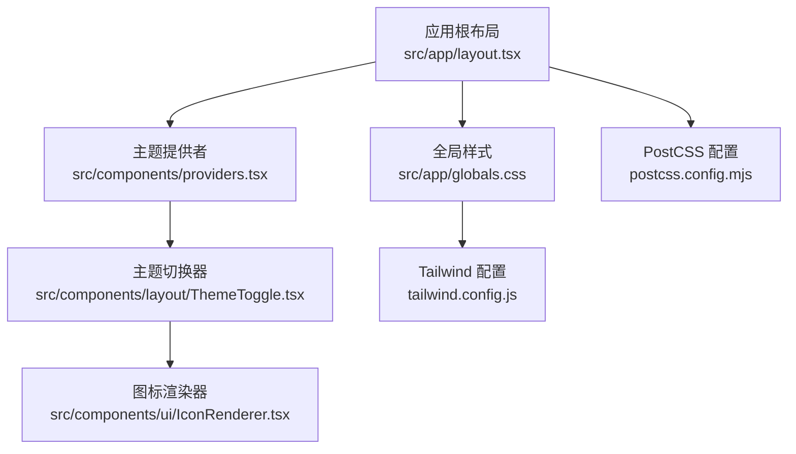
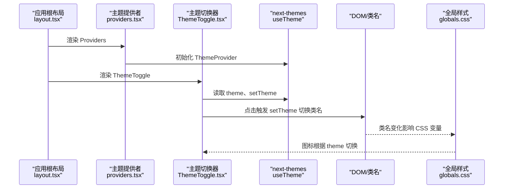
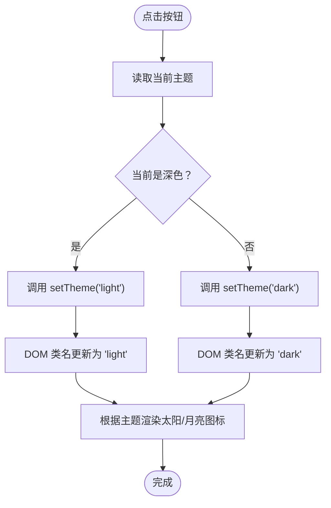
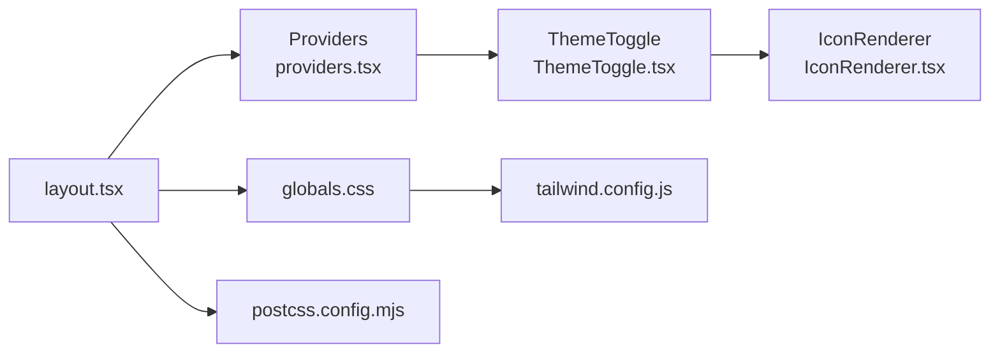

# 主题系统定制

<cite>
**本文引用的文件**
- [src/components/providers.tsx](file://src/components/providers.tsx)
- [src/components/layout/ThemeToggle.tsx](file://src/components/layout/ThemeToggle.tsx)
- [src/app/globals.css](file://src/app/globals.css)
- [tailwind.config.js](file://tailwind.config.js)
- [src/app/layout.tsx](file://src/app/layout.tsx)
- [src/components/ui/IconRenderer.tsx](file://src/components/ui/IconRenderer.tsx)
- [package.json](file://package.json)
- [postcss.config.mjs](file://postcss.config.mjs)
- [src/components/layout/Header.tsx](file://src/components/layout/Header.tsx)
</cite>

## 目录
1. [简介](#简介)
2. [项目结构](#项目结构)
3. [核心组件](#核心组件)
4. [架构总览](#架构总览)
5. [详细组件分析](#详细组件分析)
6. [依赖关系分析](#依赖关系分析)
7. [性能考量](#性能考量)
8. [故障排查指南](#故障排查指南)
9. [结论](#结论)
10. [附录：扩展与最佳实践](#附录扩展与最佳实践)

## 简介
本指南面向需要在现有 Next.js + Tailwind CSS + next-themes 主题系统基础上进行定制与扩展的开发者，重点覆盖以下内容：
- 深色/浅色主题的实现原理与 CSS 自定义属性映射
- 主题状态管理机制与用户偏好的持久化策略
- 如何扩展主题切换功能、添加新主题变体（如“系统默认”、“仅深色/浅色”）
- 主题变量定义、CSS 自定义属性使用与主题切换动画效果的开发指导
- 主题系统的架构设计与扩展最佳实践

当前仓库已采用 next-themes 提供的主题上下文，并通过类名驱动的暗色模式（darkMode: 'class'）与全局 CSS 变量实现主题切换。

## 项目结构
主题系统涉及的关键文件与职责如下：
- 应用根布局：负责注入 Providers，使主题上下文在整个应用生效
- 主题提供者：封装 next-themes 的 ThemeProvider，设置默认主题与禁用过渡闪烁
- 主题切换器：基于 useTheme Hook 切换主题并在图标上反馈当前状态
- 全局样式：定义 CSS 自定义属性与 @theme 映射，确保组件层使用一致的主题变量
- Tailwind 配置：启用类名驱动的暗色模式
- 图标渲染器：为主题切换按钮提供太阳/月亮图标

**图表来源**
- [src/app/layout.tsx](file://src/app/layout.tsx#L25-L39)
- [src/components/providers.tsx](file://src/components/providers.tsx#L6-L23)
- [src/components/layout/ThemeToggle.tsx](file://src/components/layout/ThemeToggle.tsx#L7-L29)
- [src/app/globals.css](file://src/app/globals.css#L1-L30)
- [tailwind.config.js](file://tailwind.config.js#L1-L14)
- [src/components/ui/IconRenderer.tsx](file://src/components/ui/IconRenderer.tsx#L185-L191)
- [postcss.config.mjs](file://postcss.config.mjs#L1-L8)

**章节来源**
- [src/app/layout.tsx](file://src/app/layout.tsx#L25-L39)
- [src/components/providers.tsx](file://src/components/providers.tsx#L6-L23)
- [src/components/layout/ThemeToggle.tsx](file://src/components/layout/ThemeToggle.tsx#L7-L29)
- [src/app/globals.css](file://src/app/globals.css#L1-L30)
- [tailwind.config.js](file://tailwind.config.js#L1-L14)
- [src/components/ui/IconRenderer.tsx](file://src/components/ui/IconRenderer.tsx#L185-L191)
- [postcss.config.mjs](file://postcss.config.mjs#L1-L8)

## 核心组件
- 主题提供者（Providers）
  - 负责包裹应用根节点，注入 next-themes 的 ThemeProvider
  - 设置 attribute 为 "class"，以类名方式控制主题
  - 默认主题为 "system"，启用系统跟随，禁用过渡闪烁
  - 首屏挂载后才渲染，避免水合不一致导致的闪烁

- 主题切换器（ThemeToggle）
  - 使用 useTheme 获取当前主题与切换函数
  - 点击时在 light/dark 之间切换
  - 通过图标渲染器显示太阳/月亮图标，反馈当前主题
  - 首次渲染使用占位元素避免布局抖动

- 全局样式（globals.css）
  - 在 :root 定义主题变量（背景、前景、导航背景等）
  - 通过 @theme inline 将 CSS 变量映射到 Tailwind 变量
  - body 使用变量作为背景与文字颜色，确保全局一致性

- Tailwind 配置（tailwind.config.js）
  - 启用 darkMode: 'class'
  - content 覆盖 app、components、pages 路径，确保暗色类名被扫描

- 图标渲染器（IconRenderer）
  - 统一导出 Lucide React 图标集合
  - ThemeToggle 使用其中的 Sun/Moon 进行主题状态可视化

**章节来源**
- [src/components/providers.tsx](file://src/components/providers.tsx#L6-L23)
- [src/components/layout/ThemeToggle.tsx](file://src/components/layout/ThemeToggle.tsx#L7-L29)
- [src/app/globals.css](file://src/app/globals.css#L3-L29)
- [tailwind.config.js](file://tailwind.config.js#L3-L3)
- [src/components/ui/IconRenderer.tsx](file://src/components/ui/IconRenderer.tsx#L93-L183)

## 架构总览
下图展示了主题系统从应用根布局到组件层的调用链与数据流：

**图表来源**
- [src/app/layout.tsx](file://src/app/layout.tsx#L31-L36)
- [src/components/providers.tsx](file://src/components/providers.tsx#L18-L22)
- [src/components/layout/ThemeToggle.tsx](file://src/components/layout/ThemeToggle.tsx#L8-L26)
- [src/app/globals.css](file://src/app/globals.css#L3-L23)

## 详细组件分析

### 组件 A：主题提供者（Providers）
- 设计要点
  - 使用 attribute="class"，通过给 html/body 添加类名驱动主题
  - defaultTheme="system" 启用系统跟随；enableSystem 允许跟随系统
  - disableTransitionOnChange 禁用过渡闪烁，提升首屏体验
  - mounted 控制渲染时机，避免水合差异

- 数据流与复杂度
  - 状态：mounted（布尔），用于首屏保护
  - 复杂度：O(1)，无额外计算开销

- 错误处理与边界
  - 首帧不渲染，等待 mounted 后再挂载 ThemeProvider，避免闪烁
  - 若系统主题变化，由 next-themes 自动更新类名

**章节来源**
- [src/components/providers.tsx](file://src/components/providers.tsx#L6-L23)

### 组件 B：主题切换器（ThemeToggle）
- 设计要点
  - 通过 useTheme 获取 theme 与 setTheme
  - 点击时在 "light" 与 "dark" 间切换
  - 使用 IconRenderer 渲染太阳/月亮图标，语义明确
  - 首帧占位元素避免布局抖动

- 切换流程（点击事件）

**图表来源**
- [src/components/layout/ThemeToggle.tsx](file://src/components/layout/ThemeToggle.tsx#L21-L26)

**章节来源**
- [src/components/layout/ThemeToggle.tsx](file://src/components/layout/ThemeToggle.tsx#L7-L29)
- [src/components/ui/IconRenderer.tsx](file://src/components/ui/IconRenderer.tsx#L185-L191)

### 组件 C：全局样式与变量映射（globals.css）
- 设计要点
  - :root 定义主题变量（背景、前景、导航背景等）
  - .dark 保持兼容性（若未来仍使用 .dark 类）
  - @theme inline 将 CSS 变量映射为 Tailwind 变量，便于在类中直接使用
  - body 使用变量作为背景与文字颜色，保证全局一致性

- 变量使用示例路径
  - 背景与文字颜色：参考 [src/app/globals.css](file://src/app/globals.css#L25-L29)
  - 主题变量映射：参考 [src/app/globals.css](file://src/app/globals.css#L17-L23)

**章节来源**
- [src/app/globals.css](file://src/app/globals.css#L3-L29)

### 组件 D：Tailwind 配置（tailwind.config.js）
- 设计要点
  - darkMode: 'class' 与 Providers 的 attribute="class" 对应
  - content 覆盖 app、components、pages，确保暗色类名被扫描与生成
  - theme.extend 为空，表示不额外扩展主题变量，统一由 CSS 变量驱动

**章节来源**
- [tailwind.config.js](file://tailwind.config.js#L3-L3)
- [tailwind.config.js](file://tailwind.config.js#L4-L8)

### 组件 E：应用根布局（layout.tsx）
- 设计要点
  - 引入全局样式与 Providers
  - html 上开启 suppressHydrationWarning，减少水合警告
  - 字体变量通过 next/font 注入 CSS 变量

**章节来源**
- [src/app/layout.tsx](file://src/app/layout.tsx#L3-L3)
- [src/app/layout.tsx](file://src/app/layout.tsx#L31-L36)

### 组件 F：图标渲染器（IconRenderer）
- 设计要点
  - 统一导出大量 Lucide React 图标，支持按名称渲染
  - ThemeToggle 使用 Sun/Moon 进行主题状态可视化

**章节来源**
- [src/components/ui/IconRenderer.tsx](file://src/components/ui/IconRenderer.tsx#L93-L183)
- [src/components/ui/IconRenderer.tsx](file://src/components/ui/IconRenderer.tsx#L185-L191)

## 依赖关系分析
- 组件耦合
  - ThemeToggle 依赖 useTheme（来自 next-themes），耦合于主题上下文
  - Providers 依赖 next-themes，负责提供主题上下文
  - Header 中集成 ThemeToggle，体现 UI 层对主题切换的可见性
  - 全局样式与 Tailwind 配置共同决定主题变量与类名驱动的暗色模式

- 外部依赖
  - next-themes：提供主题上下文与切换能力
  - lucide-react：提供图标资源
  - Tailwind CSS：通过类名与 CSS 变量实现主题

**图表来源**
- [src/components/providers.tsx](file://src/components/providers.tsx#L18-L22)
- [src/components/layout/ThemeToggle.tsx](file://src/components/layout/ThemeToggle.tsx#L3-L4)
- [src/components/layout/Header.tsx](file://src/components/layout/Header.tsx#L109-L110)
- [src/app/layout.tsx](file://src/app/layout.tsx#L3-L3)
- [src/components/ui/IconRenderer.tsx](file://src/components/ui/IconRenderer.tsx#L185-L191)
- [src/app/globals.css](file://src/app/globals.css#L1-L30)
- [tailwind.config.js](file://tailwind.config.js#L1-L14)
- [postcss.config.mjs](file://postcss.config.mjs#L1-L8)

**章节来源**
- [package.json](file://package.json#L22-L23)
- [package.json](file://package.json#L21-L21)
- [package.json](file://package.json#L46-L46)

## 性能考量
- 首屏闪烁规避
  - Providers 在 mounted 后才渲染 ThemeProvider，避免水合差异导致的闪烁
  - 禁用过渡闪烁（disableTransitionOnChange）进一步减少视觉跳变

- 样式体积与扫描范围
  - Tailwind content 覆盖 app、components、pages，确保暗色类名被正确扫描
  - 全局样式集中定义变量，减少重复声明与重绘

- 动画与交互
  - 当前切换器未引入过渡动画，建议在需要时为类名切换增加过渡，避免突变

[本节为通用性能建议，无需特定文件引用]

## 故障排查指南
- 切换无效或闪烁
  - 确认 Providers 已包裹应用根节点且 mounted 条件满足
  - 确认 Tailwind 配置为 darkMode: 'class'，并与 Providers 的 attribute="class" 一致
  - 确认全局样式中的 CSS 变量已被组件使用

- 图标不显示
  - 确认 IconRenderer 支持 Sun/Moon 名称
  - 确认 ThemeToggle 正确传入 iconName

- 暗色模式未生效
  - 检查 DOM 是否存在对应类名（light/dark）
  - 检查全局样式是否正确映射 CSS 变量到 Tailwind 变量

**章节来源**
- [src/components/providers.tsx](file://src/components/providers.tsx#L6-L23)
- [tailwind.config.js](file://tailwind.config.js#L3-L3)
- [src/app/globals.css](file://src/app/globals.css#L17-L23)
- [src/components/ui/IconRenderer.tsx](file://src/components/ui/IconRenderer.tsx#L185-L191)
- [src/components/layout/ThemeToggle.tsx](file://src/components/layout/ThemeToggle.tsx#L21-L26)

## 结论
当前主题系统以 next-themes 为核心，结合类名驱动的暗色模式与全局 CSS 变量映射，实现了简洁而可扩展的主题体系。通过 Providers 的首屏保护、ThemeToggle 的直观切换以及全局样式的变量化设计，系统具备良好的用户体验与维护性。后续扩展可在不破坏现有结构的前提下，安全地添加新主题变体与动画效果。

[本节为总结性内容，无需特定文件引用]

## 附录：扩展与最佳实践

### 扩展主题切换功能
- 新增主题变体
  - 在 Providers 的 defaultTheme 中加入新选项（如 "light"、"dark" 或 "system"）
  - 在 ThemeToggle 中扩展切换逻辑，支持更多主题值
  - 在全局样式中为新主题补充变量映射

- 用户偏好持久化
  - 可在客户端存储（如 localStorage）保存用户选择的主题值
  - 在应用启动时读取偏好并设置 ThemeProvider 的初始值
  - 注意与系统主题跟随的优先级关系

- 主题切换动画效果
  - 为 html/body 或关键容器添加过渡，避免类名切换突变
  - 可结合 CSS 变量与 @apply 实现平滑过渡

### 主题变量定义与使用
- 变量定义位置
  - 推荐集中在全局样式中定义，便于统一管理
  - 使用 @theme inline 将 CSS 变量映射为 Tailwind 变量，方便在类中直接使用

- 组件层使用
  - 优先使用 Tailwind 变量或 CSS 变量，避免硬编码颜色
  - 通过类名（如 dark: 前缀）适配暗色模式

### 架构设计与扩展建议
- 分层清晰
  - Providers 负责上下文提供，ThemeToggle 负责 UI 交互，全局样式负责变量与映射
- 解耦与复用
  - 图标渲染器独立，便于在其他组件中复用
- 可观测性
  - 为主题切换增加日志或埋点，便于追踪用户偏好与切换行为

[本节为通用扩展建议，无需特定文件引用]