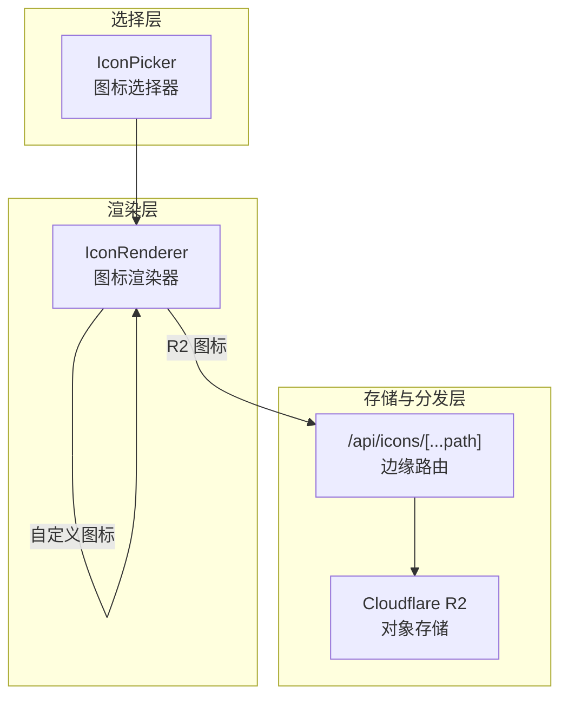
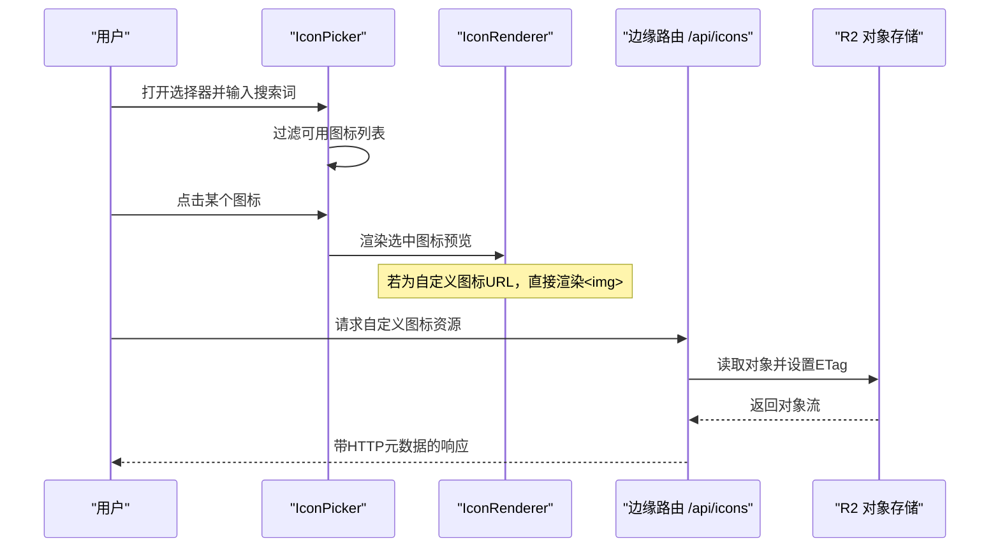
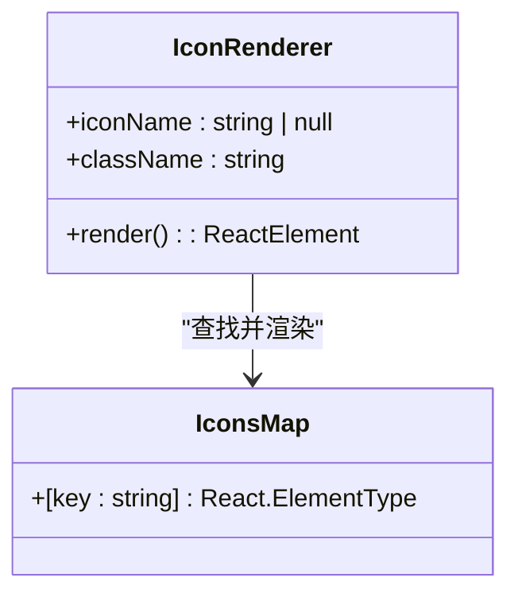
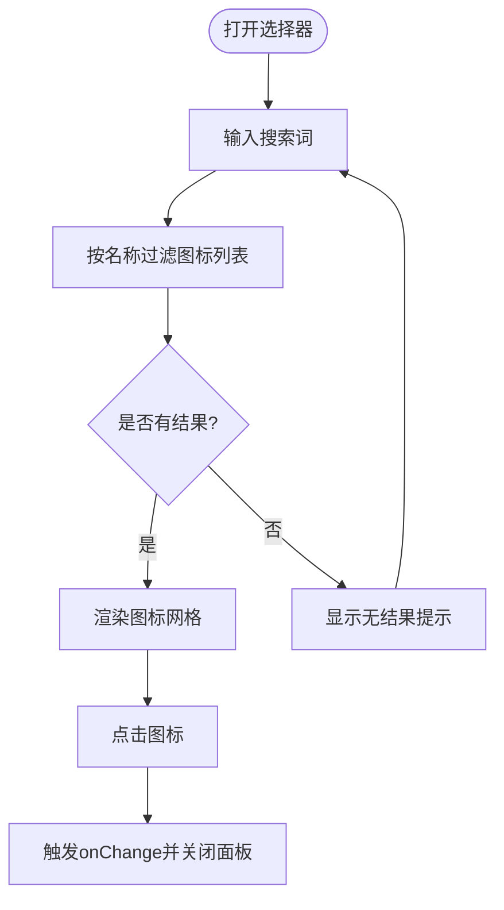
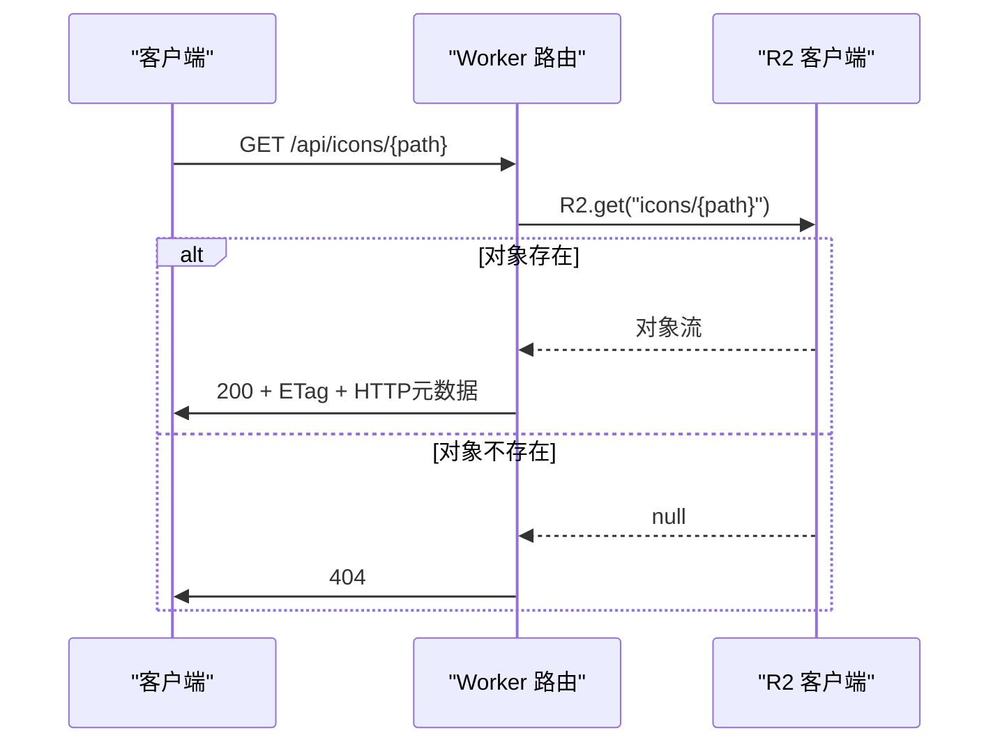
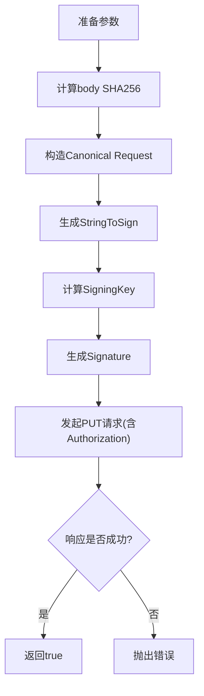
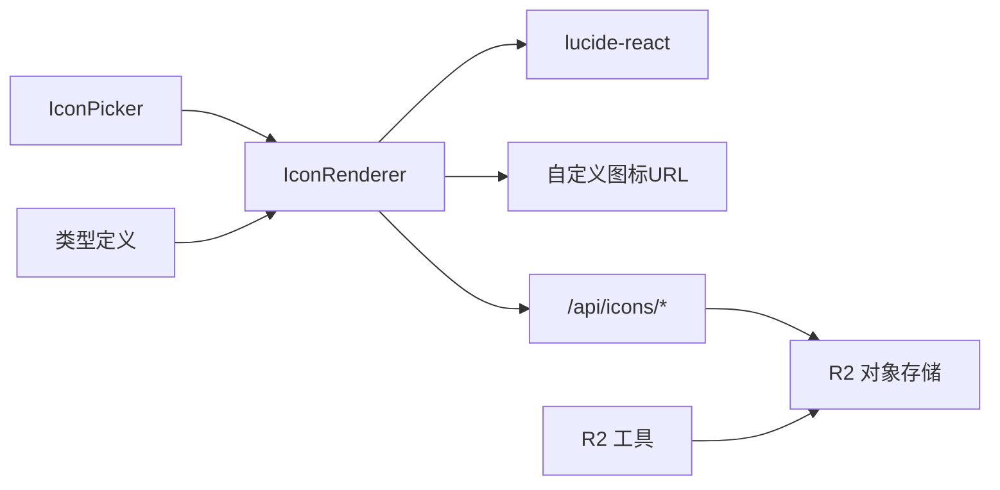

# 图标系统扩展

<cite>
**本文档引用的文件**
- [src/components/ui/IconPicker.tsx](file://src/components/ui/IconPicker.tsx)
- [src/components/ui/IconRenderer.tsx](file://src/components/ui/IconRenderer.tsx)
- [src/app/api/icons/[...path]/route.ts](file://src/app/api/icons/[...path]/route.ts)
- [src/app/admin/(dashboard)/icons/page.tsx](file://src/app/admin/(dashboard)/icons/page.tsx)
- [src/lib/r2.ts](file://src/lib/r2.ts)
- [src/lib/api-handlers/metadata.ts](file://src/lib/api-handlers/metadata.ts)
- [src/components/public/SearchBar.tsx](file://src/components/public/SearchBar.tsx)
- [src/components/public/HomeClient.tsx](file://src/components/public/HomeClient.tsx)
- [src/types/index.ts](file://src/types/index.ts)
- [package.json](file://package.json)
</cite>

## 目录
1. [简介](#简介)
2. [项目结构](#项目结构)
3. [核心组件](#核心组件)
4. [架构总览](#架构总览)
5. [详细组件分析](#详细组件分析)
6. [依赖关系分析](#依赖关系分析)
7. [性能考虑](#性能考虑)
8. [故障排除指南](#故障排除指南)
9. [结论](#结论)
10. [附录](#附录)

## 简介
本指南面向需要扩展导航应用图标的开发者，涵盖以下目标：
- 如何向图标库添加新图标（基于 Lucide 集成）
- 扩展图标选择器功能与交互体验
- 自定义图标渲染器以支持多来源图标
- 集成 Lucide 图标库的方法与最佳实践
- 图标搜索过滤机制与缓存策略
- 图标命名规范、尺寸适配与响应式设计建议
- 架构设计与扩展点识别方法

## 项目结构
图标系统主要由三部分组成：
- 图标渲染层：统一通过 IconRenderer 将字符串映射为 React 组件
- 图标选择层：提供搜索与选择界面，支持从图标库中挑选
- 图标存储与分发层：通过 R2 对象存储与边缘路由进行图标分发

图表来源
- [src/components/ui/IconPicker.tsx](file://src/components/ui/IconPicker.tsx#L1-L85)
- [src/components/ui/IconRenderer.tsx](file://src/components/ui/IconRenderer.tsx#L1-L191)
- [src/app/api/icons/[...path]/route.ts](file://src/app/api/icons/[...path]/route.ts#L1-L37)

章节来源
- [src/components/ui/IconPicker.tsx](file://src/components/ui/IconPicker.tsx#L1-L85)
- [src/components/ui/IconRenderer.tsx](file://src/components/ui/IconRenderer.tsx#L1-L191)
- [src/app/api/icons/[...path]/route.ts](file://src/app/api/icons/[...path]/route.ts#L1-L37)

## 核心组件
- IconRenderer：负责根据图标名渲染具体图标组件，支持 Lucide 图标与自定义图标路径
- IconPicker：提供带搜索功能的图标选择面板，支持点击选择与键盘交互
- 边缘路由 /api/icons：将 R2 中的图标以带 ETag 的 HTTP 响应返回
- R2 工具：提供签名上传能力，用于将图标上传至 R2
- 类型定义：Link 与 Category 支持 icon 字段，用于持久化图标标识或 URL

章节来源
- [src/components/ui/IconRenderer.tsx](file://src/components/ui/IconRenderer.tsx#L93-L190)
- [src/components/ui/IconPicker.tsx](file://src/components/ui/IconPicker.tsx#L13-L84)
- [src/app/api/icons/[...path]/route.ts](file://src/app/api/icons/[...path]/route.ts#L6-L36)
- [src/lib/r2.ts](file://src/lib/r2.ts#L23-L102)
- [src/types/index.ts](file://src/types/index.ts#L9-L34)

## 架构总览
图标系统采用“渲染器 + 选择器 + 存储分发”的分层架构：
- 渲染器集中处理图标名到组件的映射，支持 Lucide 内置图标与自定义图标
- 选择器提供搜索与选择能力，内部使用 IconRenderer 进行预览
- 自定义图标通过 R2 存储，边缘路由提供高效分发与缓存控制
- 应用层（如首页）可直接使用 IconRenderer 或展示 R2 图标 URL

图表来源
- [src/components/ui/IconPicker.tsx](file://src/components/ui/IconPicker.tsx#L18-L20)
- [src/components/ui/IconRenderer.tsx](file://src/components/ui/IconRenderer.tsx#L185-L190)
- [src/app/api/icons/[...path]/route.ts](file://src/app/api/icons/[...path]/route.ts#L19-L31)

## 详细组件分析

### IconRenderer 分析
- 职责：将字符串图标名映射为 React 组件；若找不到对应组件则返回空
- 数据结构：IconsMap 记录了图标名到组件的映射
- 扩展点：新增图标时只需在 IconsMap 中添加条目；支持从 Lucide 导入或自定义 SVG 组件
- 性能：O(1) 查找，渲染轻量

图表来源
- [src/components/ui/IconRenderer.tsx](file://src/components/ui/IconRenderer.tsx#L93-L190)

章节来源
- [src/components/ui/IconRenderer.tsx](file://src/components/ui/IconRenderer.tsx#L93-L190)

### IconPicker 分析
- 职责：提供图标选择与搜索功能，支持点击外部关闭、键盘快捷键等
- 搜索逻辑：对 IconsMap 的键进行大小写无关的包含匹配
- 交互细节：网格布局、高亮当前选中项、无结果提示
- 扩展点：可增加分页、收藏、最近使用、图标分类等

图表来源
- [src/components/ui/IconPicker.tsx](file://src/components/ui/IconPicker.tsx#L18-L20)
- [src/components/ui/IconPicker.tsx](file://src/components/ui/IconPicker.tsx#L57-L78)

章节来源
- [src/components/ui/IconPicker.tsx](file://src/components/ui/IconPicker.tsx#L13-L84)

### 边缘路由 /api/icons 分析
- 职责：从 R2 读取图标对象，设置 ETag 与 HTTP 元数据，返回流式响应
- 错误处理：缺失绑定、对象不存在、内部错误均返回结构化错误
- 缓存策略：利用 ETag 提升浏览器与 CDN 缓存命中率

图表来源
- [src/app/api/icons/[...path]/route.ts](file://src/app/api/icons/[...path]/route.ts#L19-L31)

章节来源
- [src/app/api/icons/[...path]/route.ts](file://src/app/api/icons/[...path]/route.ts#L6-L36)

### R2 上传工具分析
- 职责：在 Edge Runtime 中实现 AWS Signature V4 的最小实现，完成 R2 PUT 请求
- 关键步骤：计算哈希、构造规范请求、生成签名、发送请求
- 使用场景：将抓取到的图标上传至 R2，并通过边缘路由分发

图表来源
- [src/lib/r2.ts](file://src/lib/r2.ts#L40-L94)

章节来源
- [src/lib/r2.ts](file://src/lib/r2.ts#L23-L102)

### 应用层使用示例
- 搜索栏：在输入框前使用 IconRenderer 显示搜索图标
- 首页链接：优先展示自定义图标 URL，否则回退到 Lucide 图标

章节来源
- [src/components/public/SearchBar.tsx](file://src/components/public/SearchBar.tsx#L63-L77)
- [src/components/public/HomeClient.tsx](file://src/components/public/HomeClient.tsx#L192-L198)

## 依赖关系分析
- IconPicker 依赖 IconRenderer 与输入组件
- IconRenderer 依赖 lucide-react 的图标集合
- 边缘路由依赖 Cloudflare Workers 的 R2 绑定
- R2 工具在 Edge Runtime 中运行，不依赖 SDK
- 类型定义 Link/Category 的 icon 字段支持字符串或 null

图表来源
- [src/components/ui/IconPicker.tsx](file://src/components/ui/IconPicker.tsx#L4-L6)
- [src/components/ui/IconRenderer.tsx](file://src/components/ui/IconRenderer.tsx#L1-L91)
- [src/app/api/icons/[...path]/route.ts](file://src/app/api/icons/[...path]/route.ts#L12-L13)
- [src/lib/r2.ts](file://src/lib/r2.ts#L23-L39)
- [src/types/index.ts](file://src/types/index.ts#L9-L34)

章节来源
- [package.json](file://package.json#L21-L21)

## 性能考虑
- 图标渲染
  - IconRenderer 采用常数时间查找，避免重复计算
  - 建议在应用层复用 IconRenderer，减少不必要的组件实例化
- 图标选择器
  - 搜索为 O(n) 过滤，n 为图标总数；可通过分页或分类优化
  - 预览网格使用固定尺寸，避免布局抖动
- 自定义图标分发
  - 边缘路由设置 ETag，提升缓存命中率
  - 浏览器与 CDN 可缓存静态图标资源
- R2 上传
  - 在 Edge Runtime 中进行签名与上传，降低主站负载
  - 建议对上传的图标进行尺寸与体积限制，避免过大资源影响加载

## 故障排除指南
- 图标不显示
  - 检查图标名是否存在于 IconsMap；若为自定义图标，确认 URL 可访问
  - 章节来源
    - [src/components/ui/IconRenderer.tsx](file://src/components/ui/IconRenderer.tsx#L185-L189)
- 选择器无法关闭或点击无效
  - 检查点击外部关闭逻辑是否被其他事件阻止
  - 章节来源
    - [src/components/ui/IconPicker.tsx](file://src/components/ui/IconPicker.tsx#L22-L30)
- 自定义图标 404
  - 确认对象键是否正确；检查 R2 绑定是否存在；验证边缘路由路径
  - 章节来源
    - [src/app/api/icons/[...path]/route.ts](file://src/app/api/icons/[...path]/route.ts#L15-L23)
- R2 上传失败
  - 检查凭据与 Endpoint；查看签名过程中的错误信息
  - 章节来源
    - [src/lib/r2.ts](file://src/lib/r2.ts#L96-L99)

## 结论
该图标系统以 IconRenderer 为核心，结合 IconPicker 提供直观的选择体验，并通过 R2 与边缘路由实现自定义图标的高效分发。通过扩展 IconsMap、优化搜索与缓存策略，以及合理使用尺寸与响应式设计，可进一步提升用户体验与性能。

## 附录

### 添加新图标到图标库（Lucide 集成）
- 步骤
  - 在 IconRenderer 中导入所需图标组件
  - 将图标名与组件加入 IconsMap
  - 在应用层通过 IconRenderer 使用新图标
- 注意事项
  - 保持图标名唯一且语义清晰
  - 控制图标体积与复杂度，避免影响渲染性能
- 章节来源
  - [src/components/ui/IconRenderer.tsx](file://src/components/ui/IconRenderer.tsx#L1-L91)
  - [src/components/ui/IconRenderer.tsx](file://src/components/ui/IconRenderer.tsx#L93-L183)

### 扩展图标选择器功能
- 建议改进
  - 增加分页或分类筛选，提升大图标集的可用性
  - 支持“最近使用”“收藏”等个性化功能
  - 优化键盘导航与无障碍访问
- 章节来源
  - [src/components/ui/IconPicker.tsx](file://src/components/ui/IconPicker.tsx#L57-L78)

### 自定义图标渲染器
- 方案
  - 当 icon 为 URL 时，使用  渲染；否则使用 IconRenderer
  - 在 IconRenderer 中增加类型判断与降级策略
- 章节来源
  - [src/components/public/HomeClient.tsx](file://src/components/public/HomeClient.tsx#L192-L198)
  - [src/components/ui/IconRenderer.tsx](file://src/components/ui/IconRenderer.tsx#L185-L190)

### Lucide 图标库集成方法
- 依赖
  - 通过 lucide-react 提供的图标组件
- 最佳实践
  - 仅导入实际使用的图标，减少包体积
  - 使用 IconRenderer 统一管理图标映射
- 章节来源
  - [package.json](file://package.json#L21-L21)
  - [src/components/ui/IconRenderer.tsx](file://src/components/ui/IconRenderer.tsx#L1-L91)

### 图标搜索过滤机制
- 实现
  - 对图标名进行大小写无关的包含匹配
- 优化建议
  - 引入防抖与索引，提升大列表搜索性能
- 章节来源
  - [src/components/ui/IconPicker.tsx](file://src/components/ui/IconPicker.tsx#L18-L20)

### 图标缓存策略
- 边缘路由
  - 设置 ETag 与 HTTP 元数据，提升浏览器与 CDN 缓存效率
- 应用层
  - 合理设置图片缓存头；对频繁使用的图标进行预加载
- 章节来源
  - [src/app/api/icons/[...path]/route.ts](file://src/app/api/icons/[...path]/route.ts#L25-L31)

### 图标命名规范
- 建议
  - 使用帕斯卡命名法（如 ChevronUp）
  - 语义明确，避免缩写与歧义
  - 与业务含义一致，便于维护与检索
- 章节来源
  - [src/components/ui/IconRenderer.tsx](file://src/components/ui/IconRenderer.tsx#L93-L183)

### 图标尺寸适配与响应式设计
- 建议
  - 使用统一的尺寸体系（如 h-4/w-4），确保在不同容器中比例一致
  - 在移动端适当增大点击区域，提升可访问性
  - 对自定义图标设定最大宽高，防止溢出
- 章节来源
  - [src/components/ui/IconPicker.tsx](file://src/components/ui/IconPicker.tsx#L42-L45)
  - [src/components/public/SearchBar.tsx](file://src/components/public/SearchBar.tsx#L63-L71)

### 架构设计与扩展点识别方法
- 扩展点
  - IconsMap：新增图标映射
  - IconPicker：增强搜索、分类、收藏等功能
  - 边缘路由：支持鉴权、CDN 缓存策略调整
  - R2 工具：支持更多上传参数与错误处理
- 章节来源
  - [src/components/ui/IconRenderer.tsx](file://src/components/ui/IconRenderer.tsx#L93-L190)
  - [src/components/ui/IconPicker.tsx](file://src/components/ui/IconPicker.tsx#L13-L84)
  - [src/app/api/icons/[...path]/route.ts](file://src/app/api/icons/[...path]/route.ts#L6-L36)
  - [src/lib/r2.ts](file://src/lib/r2.ts#L23-L102)