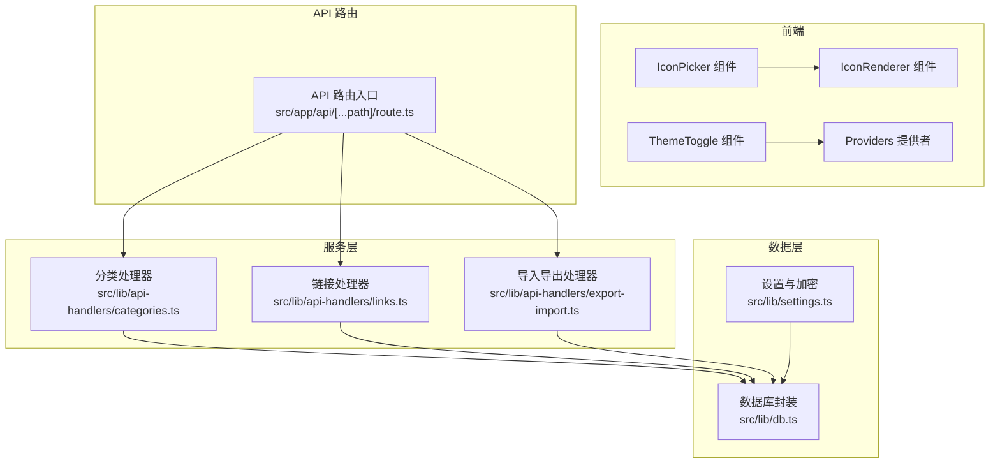
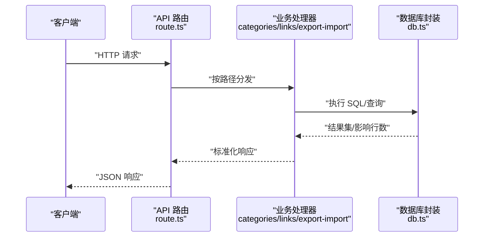
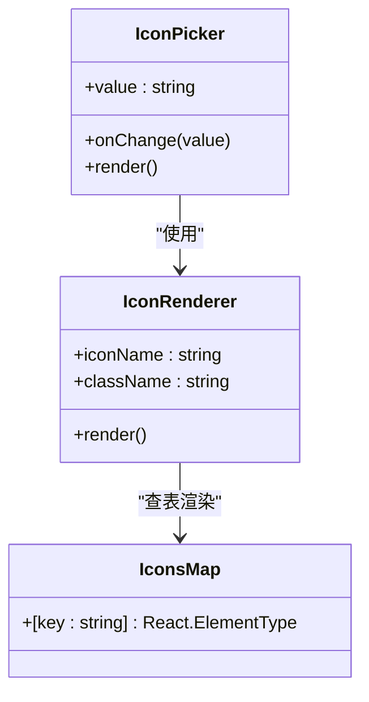
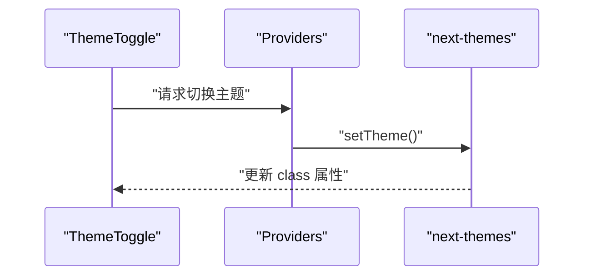
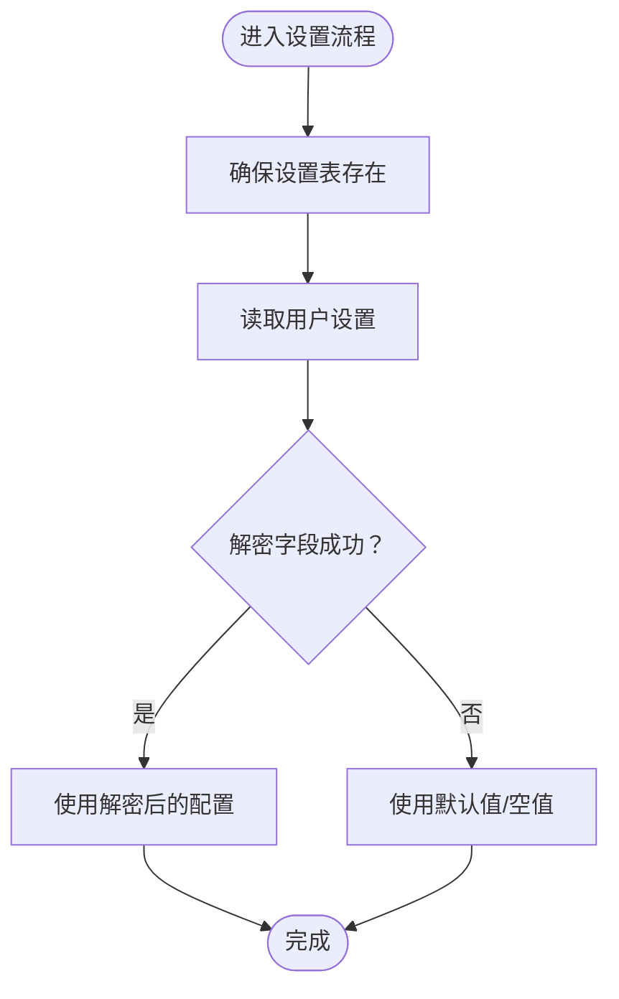
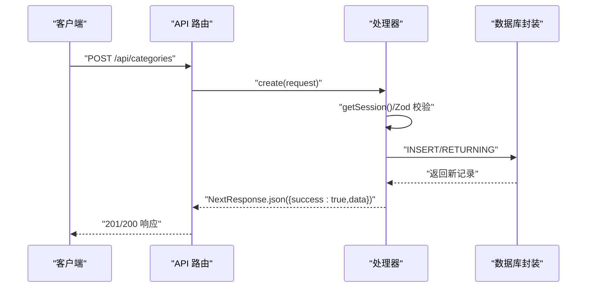
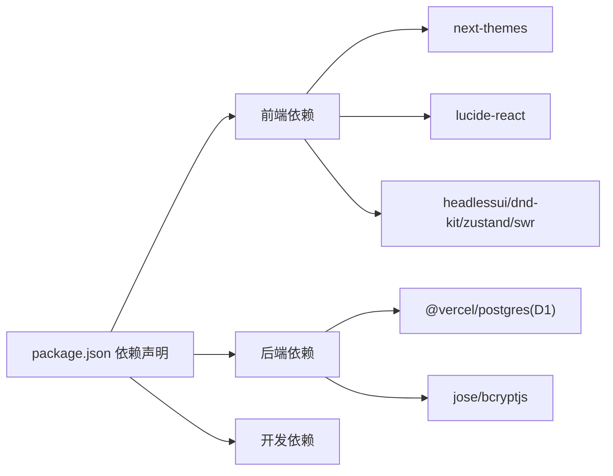

# 扩展开发

<cite>
**本文引用的文件**
- [README.md](file://README.md)
- [package.json](file://package.json)
- [src/lib/settings.ts](file://src/lib/settings.ts)
- [src/components/ui/IconPicker.tsx](file://src/components/ui/IconPicker.tsx)
- [src/components/ui/IconRenderer.tsx](file://src/components/ui/IconRenderer.tsx)
- [src/components/layout/ThemeToggle.tsx](file://src/components/layout/ThemeToggle.tsx)
- [src/components/providers.tsx](file://src/components/providers.tsx)
- [src/app/api/[...path]/route.ts](file://src/app/api/[...path]/route.ts)
- [src/lib/db.ts](file://src/lib/db.ts)
- [src/lib/api-handlers/categories.ts](file://src/lib/api-handlers/categories.ts)
- [src/lib/api-handlers/links.ts](file://src/lib/api-handlers/links.ts)
- [src/app/admin/(dashboard)/import/page.tsx](file://src/app/admin/(dashboard)/import/page.tsx)
- [src/lib/api-handlers/export-import.ts](file://src/lib/api-handlers/export-import.ts)
</cite>

## 目录
1. [简介](#简介)
2. [项目结构](#项目结构)
3. [核心组件](#核心组件)
4. [架构总览](#架构总览)
5. [详细组件分析](#详细组件分析)
6. [依赖分析](#依赖分析)
7. [性能考量](#性能考量)
8. [故障排查指南](#故障排查指南)
9. [结论](#结论)
10. [附录](#附录)

## 简介
本指南面向希望为导航站点系统进行扩展开发的工程师，涵盖新功能开发流程、插件开发方法与第三方集成策略；重点包括图标系统扩展、主题系统定制、设置管理扩展；同时提供 API 扩展最佳实践与向后兼容性考虑，并总结扩展点识别与插件架构设计原则，帮助在不破坏现有系统的情况下安全扩展现有功能。

## 项目结构
该项目采用 Next.js App Router 结构，前端组件位于 src/components，业务逻辑与数据访问位于 src/lib，API 路由集中于 src/app/api。整体采用分层设计：UI 层（组件）、服务层（API 处理器）、数据层（数据库封装）。

图表来源
- [src/app/api/[...path]/route.ts](file://src/app/api/[...path]/route.ts#L1-L147)
- [src/lib/api-handlers/categories.ts](file://src/lib/api-handlers/categories.ts#L1-L199)
- [src/lib/api-handlers/links.ts](file://src/lib/api-handlers/links.ts#L1-L270)
- [src/lib/api-handlers/export-import.ts](file://src/lib/api-handlers/export-import.ts#L90-L122)
- [src/lib/db.ts](file://src/lib/db.ts#L1-L69)
- [src/lib/settings.ts](file://src/lib/settings.ts#L1-L149)
- [src/components/ui/IconPicker.tsx](file://src/components/ui/IconPicker.tsx#L1-L85)
- [src/components/ui/IconRenderer.tsx](file://src/components/ui/IconRenderer.tsx#L1-L191)
- [src/components/layout/ThemeToggle.tsx](file://src/components/layout/ThemeToggle.tsx#L1-L30)
- [src/components/providers.tsx](file://src/components/providers.tsx#L1-L24)

章节来源
- [README.md](file://README.md#L65-L76)
- [package.json](file://package.json#L1-L50)

## 核心组件
- 图标系统：通过 IconRenderer 统一渲染 Lucide React 图标，IconPicker 提供搜索与选择能力，支持扩展图标集。
- 主题系统：基于 next-themes，在 Providers 中统一注入主题上下文，ThemeToggle 切换明暗主题。
- 设置管理：settings.ts 提供应用设置表的建表、读取、更新与敏感字段加密存储。
- API 路由：集中处理认证、分类、链接、导入导出、元数据等接口，便于扩展新的业务端点。
- 数据访问：db.ts 封装 D1/SQLite 访问，提供跨运行时的 SQL 执行能力。

章节来源
- [src/components/ui/IconRenderer.tsx](file://src/components/ui/IconRenderer.tsx#L1-L191)
- [src/components/ui/IconPicker.tsx](file://src/components/ui/IconPicker.tsx#L1-L85)
- [src/components/layout/ThemeToggle.tsx](file://src/components/layout/ThemeToggle.tsx#L1-L30)
- [src/components/providers.tsx](file://src/components/providers.tsx#L1-L24)
- [src/lib/settings.ts](file://src/lib/settings.ts#L1-L149)
- [src/app/api/[...path]/route.ts](file://src/app/api/[...path]/route.ts#L1-L147)
- [src/lib/db.ts](file://src/lib/db.ts#L1-L69)

## 架构总览
系统采用“路由 -> 处理器 -> 数据库”的清晰分层。API 路由作为统一入口，按路径分发至对应处理器；处理器负责鉴权、参数校验、调用数据库封装并返回标准化响应；UI 组件通过 IconRenderer 和 ThemeToggle 实现一致的视觉与交互体验。

图表来源
- [src/app/api/[...path]/route.ts](file://src/app/api/[...path]/route.ts#L12-L147)
- [src/lib/api-handlers/categories.ts](file://src/lib/api-handlers/categories.ts#L17-L199)
- [src/lib/api-handlers/links.ts](file://src/lib/api-handlers/links.ts#L25-L270)
- [src/lib/api-handlers/export-import.ts](file://src/lib/api-handlers/export-import.ts#L90-L122)
- [src/lib/db.ts](file://src/lib/db.ts#L12-L69)

## 详细组件分析

### 图标系统扩展
- 扩展方式
  - 在 IconRenderer 的图标映射中新增条目，即可在全站通过名称渲染新图标。
  - IconPicker 会自动从映射中筛选显示，无需额外配置。
- 安全与一致性
  - 保持图标名称稳定，避免破坏既有引用。
  - 新增图标需同步文档或类型定义，确保 IDE 与构建期检查。
- 向后兼容
  - 不删除已有图标名；如需替换，保留旧名别名一段时间。

图表来源
- [src/components/ui/IconRenderer.tsx](file://src/components/ui/IconRenderer.tsx#L93-L191)
- [src/components/ui/IconPicker.tsx](file://src/components/ui/IconPicker.tsx#L13-L85)

章节来源
- [src/components/ui/IconRenderer.tsx](file://src/components/ui/IconRenderer.tsx#L1-L191)
- [src/components/ui/IconPicker.tsx](file://src/components/ui/IconPicker.tsx#L1-L85)

### 主题系统定制
- 扩展方式
  - 在 Providers 中调整默认主题与系统跟随策略。
  - ThemeToggle 通过 next-themes 切换主题，可扩展为多主题或动态主题。
- 安全与一致性
  - 避免在服务端直接写入主题状态；通过客户端上下文管理。
  - 保持 attribute="class" 以保证样式一致性。
- 向后兼容
  - 保留默认主题与系统跟随选项，避免破坏用户偏好。

图表来源
- [src/components/layout/ThemeToggle.tsx](file://src/components/layout/ThemeToggle.tsx#L7-L28)
- [src/components/providers.tsx](file://src/components/providers.tsx#L6-L23)

章节来源
- [src/components/layout/ThemeToggle.tsx](file://src/components/layout/ThemeToggle.tsx#L1-L30)
- [src/components/providers.tsx](file://src/components/providers.tsx#L1-L24)

### 设置管理扩展
- 功能要点
  - 表结构：app_settings，包含用户级设置与敏感字段加密存储。
  - 加解密：使用 Web Crypto API 的 AES-GCM 对敏感字段进行加密存储。
  - CRUD：提供建表、读取、插入/更新（upsert）等操作。
- 扩展建议
  - 新增设置项时，先迁移表结构并提供默认值。
  - 敏感字段一律加密存储，非敏感字段可明文存储。
  - 读取时捕获解密异常，避免因密钥问题导致整体失败。
- 向后兼容
  - 读取阶段对缺失字段提供默认值，避免破坏旧版本数据。
  - 更新时使用 upsert，避免唯一约束冲突。

图表来源
- [src/lib/settings.ts](file://src/lib/settings.ts#L68-L149)

章节来源
- [src/lib/settings.ts](file://src/lib/settings.ts#L1-L149)

### API 扩展最佳实践
- 路由分发
  - 在 API 路由入口按路径精确匹配，避免通配符滥用。
  - 新增端点时，先在入口注册，再实现处理器。
- 权限控制
  - 所有写操作均需鉴权与角色校验，参考分类与链接处理器中的会话检查。
- 参数校验
  - 使用 Zod 对请求体进行严格校验，提前拒绝非法输入。
- 幂等与一致性
  - 对重复创建/删除场景提供幂等处理，避免唯一约束错误。
  - 成功后触发 revalidatePath，确保缓存一致性。
- 错误处理
  - 明确区分 4xx 与 5xx，返回统一结构化错误信息。
- 向后兼容
  - 新增字段时提供默认值；变更字段时保留兼容读取。
  - 版本化 API（如 /api/v1/...），逐步淘汰旧版本。

图表来源
- [src/app/api/[...path]/route.ts](file://src/app/api/[...path]/route.ts#L49-L96)
- [src/lib/api-handlers/categories.ts](file://src/lib/api-handlers/categories.ts#L35-L94)
- [src/lib/db.ts](file://src/lib/db.ts#L12-L69)

章节来源
- [src/app/api/[...path]/route.ts](file://src/app/api/[...path]/route.ts#L1-L147)
- [src/lib/api-handlers/categories.ts](file://src/lib/api-handlers/categories.ts#L1-L199)
- [src/lib/api-handlers/links.ts](file://src/lib/api-handlers/links.ts#L1-L270)

### 插件架构设计原则
- 分层与职责分离
  - UI 层仅负责展示与交互；业务层负责规则与校验；数据层负责持久化。
- 可插拔扩展点
  - 通过 IconRenderer 的映射表、API 路由的分发器、Providers 的主题注入，形成可扩展的插件点。
- 配置驱动
  - 设置管理模块提供统一配置入口，便于外部配置注入与热更新。
- 第三方集成策略
  - 导入导出页面演示了文件上传与解析流程，可作为第三方数据源接入模板。
  - 对外开放的 API 应提供鉴权、速率限制与审计日志。

章节来源
- [src/components/ui/IconRenderer.tsx](file://src/components/ui/IconRenderer.tsx#L1-L191)
- [src/app/api/[...path]/route.ts](file://src/app/api/[...path]/route.ts#L1-L147)
- [src/components/providers.tsx](file://src/components/providers.tsx#L1-L24)
- [src/app/admin/(dashboard)/import/page.tsx](file://src/app/admin/(dashboard)/import/page.tsx#L1-L158)
- [src/lib/api-handlers/export-import.ts](file://src/lib/api-handlers/export-import.ts#L90-L122)

## 依赖分析
- 前端依赖
  - next-themes：主题上下文与切换。
  - lucide-react：图标库。
  - dnd-kit、headlessui、zustand、swr 等：交互、状态与数据请求。
- 后端依赖
  - @vercel/postgres（通过 D1 绑定）：数据库访问。
  - jose、bcryptjs：认证与密码处理。
- 开发依赖
  - TypeScript、TailwindCSS v4、ESLint、Cloudflare Workers Types 等。

图表来源
- [package.json](file://package.json#L12-L48)

章节来源
- [package.json](file://package.json#L1-L50)

## 性能考量
- Edge Runtime
  - API 路由声明 runtime 为 edge，提升冷启动与边缘执行性能。
- 缓存与重建
  - 处理器在成功后调用 revalidatePath，平衡一致性与性能。
- 数据库访问
  - 使用模板字符串 + bind 的预编译方式，减少 SQL 注入风险与解析开销。
- 图标渲染
  - IconRenderer 通过映射表快速定位组件，避免动态导入带来的性能损耗。

章节来源
- [src/app/api/[...path]/route.ts](file://src/app/api/[...path]/route.ts#L10-L147)
- [src/lib/api-handlers/categories.ts](file://src/lib/api-handlers/categories.ts#L69-L72)
- [src/lib/api-handlers/links.ts](file://src/lib/api-handlers/links.ts#L122-L125)
- [src/lib/db.ts](file://src/lib/db.ts#L44-L57)
- [src/components/ui/IconRenderer.tsx](file://src/components/ui/IconRenderer.tsx#L185-L190)

## 故障排查指南
- 图标不显示
  - 检查图标名称是否存在于映射表；确认 IconPicker 搜索关键词正确。
- 主题切换无效
  - 确认 Providers 已包裹根组件；检查浏览器 class 属性变化。
- 设置读取失败
  - 检查密钥环境变量；确认加密字段是否被正确解密；查看数据库表结构是否存在。
- API 返回 401/403
  - 确认会话有效与管理员角色；检查处理器中的鉴权逻辑。
- 导入失败
  - 检查文件格式与大小限制；查看导入页面的错误提示与网络请求状态。

章节来源
- [src/components/ui/IconPicker.tsx](file://src/components/ui/IconPicker.tsx#L18-L20)
- [src/components/providers.tsx](file://src/components/providers.tsx#L18-L22)
- [src/lib/settings.ts](file://src/lib/settings.ts#L102-L110)
- [src/lib/api-handlers/categories.ts](file://src/lib/api-handlers/categories.ts#L38-L40)
- [src/app/admin/(dashboard)/import/page.tsx](file://src/app/admin/(dashboard)/import/page.tsx#L27-L44)

## 结论
通过明确的分层设计与可扩展的插件点，系统能够在不破坏现有功能的前提下安全地进行图标、主题与设置的扩展，并以统一的 API 路由与处理器模式实现新功能的快速落地。遵循本文的最佳实践与兼容性策略，可显著降低扩展成本与风险。

## 附录
- 新功能开发流程建议
  - 设计阶段：确定扩展点、接口与数据模型。
  - 实现阶段：在 UI 层扩展组件，在 API 层新增路由与处理器，在数据层完善表结构与迁移脚本。
  - 测试阶段：覆盖边界条件、权限与错误分支。
  - 发布阶段：提供默认值与兼容读取，逐步淘汰旧方案。
- 第三方集成模板
  - 参考导入导出页面的文件上传与解析流程，结合 API 路由进行鉴权与入库。
- 向后兼容清单
  - 字段新增：提供默认值；字段重命名：保留旧字段一段时间。
  - 接口变更：版本化 API，提供迁移指引与降级策略。