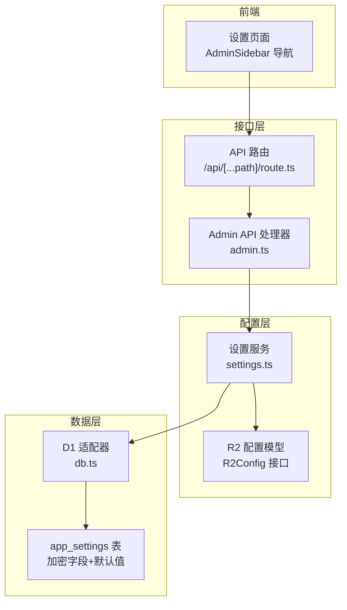
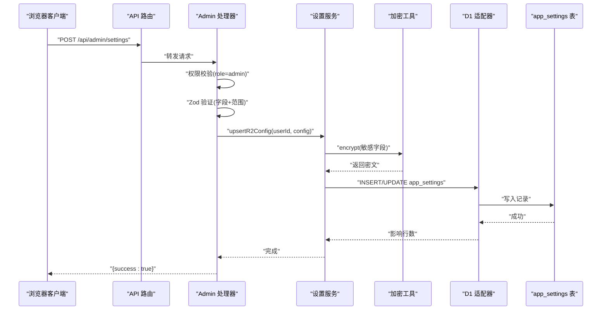
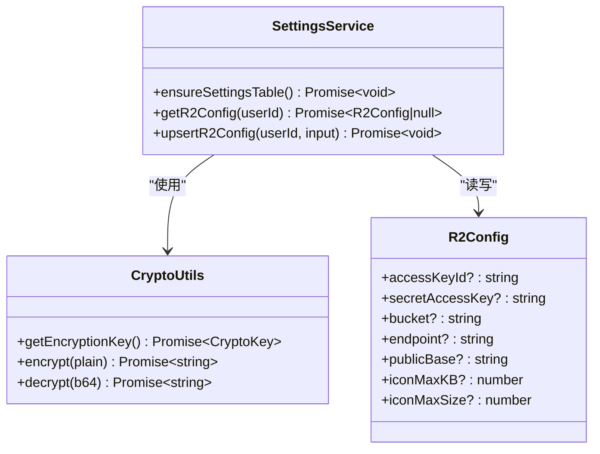
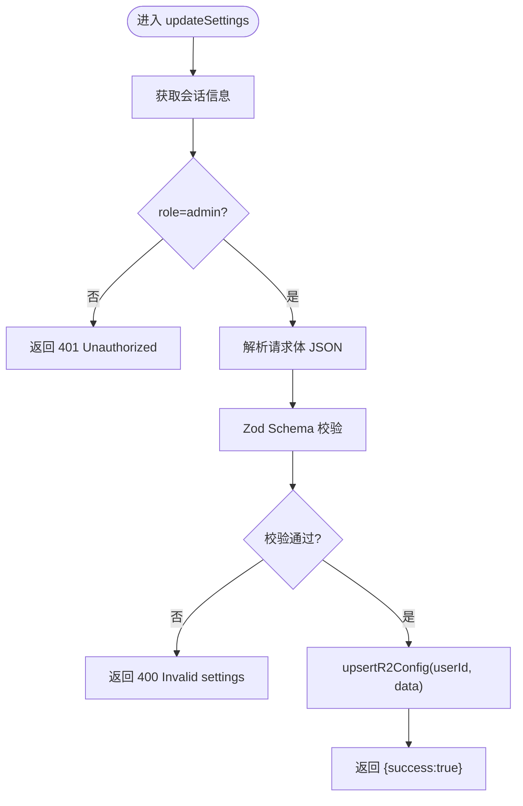
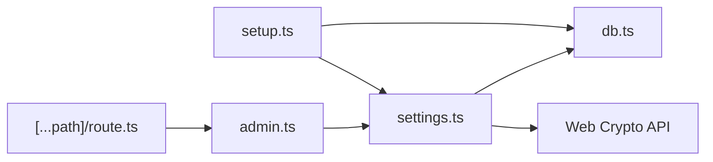

# 设置管理扩展

<cite>
**本文档引用的文件**
- [src/lib/settings.ts](file://src/lib/settings.ts)
- [src/lib/db.ts](file://src/lib/db.ts)
- [src/lib/api-handlers/admin.ts](file://src/lib/api-handlers/admin.ts)
- [src/app/api/[...path]/route.ts](file://src/app/api/[...path]/route.ts)
- [src/lib/api-handlers/setup.ts](file://src/lib/api-handlers/setup.ts)
- [src/types/index.ts](file://src/types/index.ts)
- [src/lib/auth.ts](file://src/lib/auth.ts)
- [src/components/ui/Input.tsx](file://src/components/ui/Input.tsx)
- [src/app/admin/(dashboard)/layout.tsx](file://src/app/admin/(dashboard)/layout.tsx)
- [src/components/layout/AdminSidebar.tsx](file://src/components/layout/AdminSidebar.tsx)
</cite>

## 目录
1. [简介](#简介)
2. [项目结构](#项目结构)
3. [核心组件](#核心组件)
4. [架构总览](#架构总览)
5. [详细组件分析](#详细组件分析)
6. [依赖关系分析](#依赖关系分析)
7. [性能考虑](#性能考虑)
8. [故障排除指南](#故障排除指南)
9. [结论](#结论)
10. [附录](#附录)

## 简介
本指南面向需要扩展“设置管理”功能的开发者，目标包括：
- 添加新的系统设置项（数据类型、默认值、存储字段）
- 扩展设置存储机制（数据库表、索引、加密字段）
- 实现设置验证规则（Zod Schema、最小/最大值约束）
- 设置分组管理与权限控制（基于角色的访问控制）
- 设置迁移策略（数据库版本演进）
- 设置更新流程（前端表单到后端持久化的完整链路）

## 项目结构
设置系统围绕以下模块协作：
- 数据层：通过统一的 D1 适配器执行 SQL，确保在边缘运行时与本地开发的一致性
- 加密层：Web Crypto API 提供 AES-GCM 对称加密，密钥派生自环境变量
- 配置层：应用设置表承载用户级配置，支持敏感字段加密存储
- 接口层：Admin API 处理设置的查询与更新，并进行权限校验
- 前端层：仪表盘页面与表单组件负责用户交互与数据提交

**图表来源**
- [src/app/api/[...path]/route.ts](file://src/app/api/[...path]/route.ts#L1-L47)
- [src/lib/api-handlers/admin.ts](file://src/lib/api-handlers/admin.ts#L79-L158)
- [src/lib/settings.ts](file://src/lib/settings.ts#L68-L148)
- [src/lib/db.ts](file://src/lib/db.ts#L12-L68)

**章节来源**
- [src/app/api/[...path]/route.ts](file://src/app/api/[...path]/route.ts#L1-L47)
- [src/lib/api-handlers/admin.ts](file://src/lib/api-handlers/admin.ts#L79-L158)
- [src/lib/settings.ts](file://src/lib/settings.ts#L68-L148)
- [src/lib/db.ts](file://src/lib/db.ts#L12-L68)

## 核心组件
- 设置服务（settings.ts）：提供设置表的创建、查询与更新；封装敏感字段的加解密逻辑
- D1 适配器（db.ts）：统一 SQL 执行入口，兼容边缘运行时与本地开发
- Admin API 处理器（admin.ts）：提供设置查询与更新接口，内置权限校验与 Zod 验证
- API 路由（[...path]/route.ts）：聚合路由，将请求分发至对应处理器
- 类型定义（types/index.ts）：用户、分类、链接等基础类型，为设置关联提供上下文
- 认证工具（auth.ts）：JWT 密钥与签名/校验，支撑会话与权限判断
- 前端组件（AdminSidebar、Input）：导航与输入控件，支撑设置页面交互

**章节来源**
- [src/lib/settings.ts](file://src/lib/settings.ts#L1-L149)
- [src/lib/db.ts](file://src/lib/db.ts#L1-L69)
- [src/lib/api-handlers/admin.ts](file://src/lib/api-handlers/admin.ts#L1-L159)
- [src/app/api/[...path]/route.ts](file://src/app/api/[...path]/route.ts#L1-L47)
- [src/types/index.ts](file://src/types/index.ts#L1-L53)
- [src/lib/auth.ts](file://src/lib/auth.ts#L1-L23)
- [src/components/layout/AdminSidebar.tsx](file://src/components/layout/AdminSidebar.tsx#L1-L148)
- [src/components/ui/Input.tsx](file://src/components/ui/Input.tsx#L1-L41)

## 架构总览
设置系统采用“前端表单 -> API 路由 -> 处理器 -> 设置服务 -> D1 存储”的链路。所有敏感配置均以加密形式存储，非敏感配置直接明文存储。

**图表来源**
- [src/app/api/[...path]/route.ts](file://src/app/api/[...path]/route.ts#L32-L34)
- [src/lib/api-handlers/admin.ts](file://src/lib/api-handlers/admin.ts#L130-L158)
- [src/lib/settings.ts](file://src/lib/settings.ts#L113-L148)
- [src/lib/db.ts](file://src/lib/db.ts#L12-L68)

## 详细组件分析

### 设置服务（settings.ts）
职责与特性：
- 表结构：app_settings 用户级配置表，包含用户外键、多字段加密列、非敏感整型字段及时间戳
- 默认值：icon_max_kb 与 icon_max_size 的默认值在表定义中声明
- 加密策略：使用 Web Crypto API 的 AES-GCM，密钥通过 SHA-256 从环境变量派生
- 查询与更新：按用户 ID 查询/更新，敏感字段在读取时解密，写入时加密
- 完整性：唯一索引保证每个用户仅有一条设置记录

**图表来源**
- [src/lib/settings.ts](file://src/lib/settings.ts#L3-L11)
- [src/lib/settings.ts](file://src/lib/settings.ts#L14-L66)
- [src/lib/settings.ts](file://src/lib/settings.ts#L68-L148)

**章节来源**
- [src/lib/settings.ts](file://src/lib/settings.ts#L68-L148)

### D1 适配器（db.ts）
职责与特性：
- 在边缘运行时通过 Cloudflare Pages 上下文获取 D1 绑定
- 支持 SELECT/非 SELECT 分支，自动处理返回结果
- 本地开发提示：若未找到 D1 绑定，输出警告信息

**章节来源**
- [src/lib/db.ts](file://src/lib/db.ts#L12-L68)

### Admin API 处理器（admin.ts）
职责与特性：
- 权限控制：仅允许 admin 角色访问设置接口
- 输入验证：使用 Zod Schema 对字段长度、可选性与数值范围进行严格校验
- 敏感信息掩码：响应中对敏感字段进行掩码显示
- 更新流程：解析请求体 -> Zod 校验 -> upsertR2Config -> 返回结果

**图表来源**
- [src/lib/api-handlers/admin.ts](file://src/lib/api-handlers/admin.ts#L130-L158)

**章节来源**
- [src/lib/api-handlers/admin.ts](file://src/lib/api-handlers/admin.ts#L79-L158)

### API 路由（[...path]/route.ts）
职责与特性：
- 聚合路由：根据路径将请求分发到不同处理器
- 当前与设置相关的路由：/api/admin/settings（GET/POST）

**章节来源**
- [src/app/api/[...path]/route.ts](file://src/app/api/[...path]/route.ts#L1-L47)

### 设置页面与导航（AdminSidebar、Input）
职责与特性：
- AdminSidebar：提供设置相关导航入口（安全设置、图标设置等）
- Input：通用输入组件，支持标签与错误展示，用于设置表单

**章节来源**
- [src/components/layout/AdminSidebar.tsx](file://src/components/layout/AdminSidebar.tsx#L17-L24)
- [src/components/ui/Input.tsx](file://src/components/ui/Input.tsx#L9-L12)

## 依赖关系分析
- settings.ts 依赖 db.ts 进行 SQL 执行，依赖 Web Crypto API 进行加解密
- admin.ts 依赖 settings.ts 进行配置读写，依赖 zod 进行输入校验，依赖 session 工具进行权限判断
- API 路由将 /api/admin/settings 请求转发给 admin.ts
- setup.ts 在首次部署时创建 app_settings 表，确保初始化一致性

**图表来源**
- [src/lib/api-handlers/admin.ts](file://src/lib/api-handlers/admin.ts#L1-L159)
- [src/lib/settings.ts](file://src/lib/settings.ts#L1-L149)
- [src/lib/db.ts](file://src/lib/db.ts#L1-L69)
- [src/lib/api-handlers/setup.ts](file://src/lib/api-handlers/setup.ts#L1-L109)
- [src/app/api/[...path]/route.ts](file://src/app/api/[...path]/route.ts#L1-L47)

**章节来源**
- [src/lib/api-handlers/admin.ts](file://src/lib/api-handlers/admin.ts#L1-L159)
- [src/lib/settings.ts](file://src/lib/settings.ts#L1-L149)
- [src/lib/db.ts](file://src/lib/db.ts#L1-L69)
- [src/lib/api-handlers/setup.ts](file://src/lib/api-handlers/setup.ts#L1-L109)
- [src/app/api/[...path]/route.ts](file://src/app/api/[...path]/route.ts#L1-L47)

## 性能考虑
- 加密开销：AES-GCM 加解密在 Edge Runtime 中由 Web Crypto API 提供，建议批量更新时减少重复加密次数
- 数据库访问：app_settings 表已建立唯一索引，查询与更新均按用户 ID 进行，避免全表扫描
- 缓存策略：当前未实现缓存，可在高频读取场景引入短期缓存（需注意敏感字段不可缓存）
- 并发控制：upsertR2Config 为单用户单记录操作，天然避免并发冲突

[本节为通用性能建议，不直接分析具体文件]

## 故障排除指南
常见问题与定位要点：
- 未授权访问：检查会话是否正确传递，确认用户角色为 admin
- 输入验证失败：核对请求体字段是否满足 Zod Schema 的长度、类型与范围要求
- 加密异常：确认 SETTINGS_ENC_KEY 或 AUTH_SECRET 环境变量存在且一致
- 数据库连接失败：在边缘运行时检查 D1 绑定是否正确配置

排查步骤：
1. 查看 API 响应状态码与消息
2. 检查会话与权限校验日志
3. 核对请求体与 Schema 定义
4. 验证环境变量与数据库连接

**章节来源**
- [src/lib/api-handlers/admin.ts](file://src/lib/api-handlers/admin.ts#L130-L158)
- [src/lib/settings.ts](file://src/lib/settings.ts#L14-L29)
- [src/lib/db.ts](file://src/lib/db.ts#L27-L41)

## 结论
设置管理系统以“加密存储 + 严格校验 + 角色控制”为核心设计，具备良好的扩展性与安全性。新增设置项时，遵循“Schema 定义 -> 表结构扩展 -> 加密策略 -> 权限控制 -> 前端集成”的流程，即可快速完成功能迭代。

[本节为总结性内容，不直接分析具体文件]

## 附录

### 新增设置项开发指引
- 数据类型与默认值
  - 在 settings.ts 中扩展 R2Config 接口字段
  - 在 ensureSettingsTable 中添加对应列与默认值
  - 在 getR2Config 与 upsertR2Config 中同步读写逻辑
- 验证规则
  - 在 admin.ts 的 Zod Schema 中增加字段校验（长度、范围、可选性）
  - 对敏感字段保持加密存储，非敏感字段可明文存储
- 权限控制
  - 确保仅 admin 角色可访问设置接口
  - 如需细粒度权限，可在处理器中增加更严格的条件判断
- 前端集成
  - 在设置页面添加对应表单项，使用 Input 组件
  - 提交时调用 /api/admin/settings，处理响应与错误提示
- 迁移策略
  - 首次部署时通过 setup.ts 创建表结构
  - 后续版本演进通过 ensureSettingsTable 保证向后兼容
  - 对于破坏性变更，提供迁移脚本并在部署流程中执行

**章节来源**
- [src/lib/settings.ts](file://src/lib/settings.ts#L68-L148)
- [src/lib/api-handlers/admin.ts](file://src/lib/api-handlers/admin.ts#L137-L145)
- [src/lib/api-handlers/setup.ts](file://src/lib/api-handlers/setup.ts#L88-L104)
- [src/components/ui/Input.tsx](file://src/components/ui/Input.tsx#L14-L37)