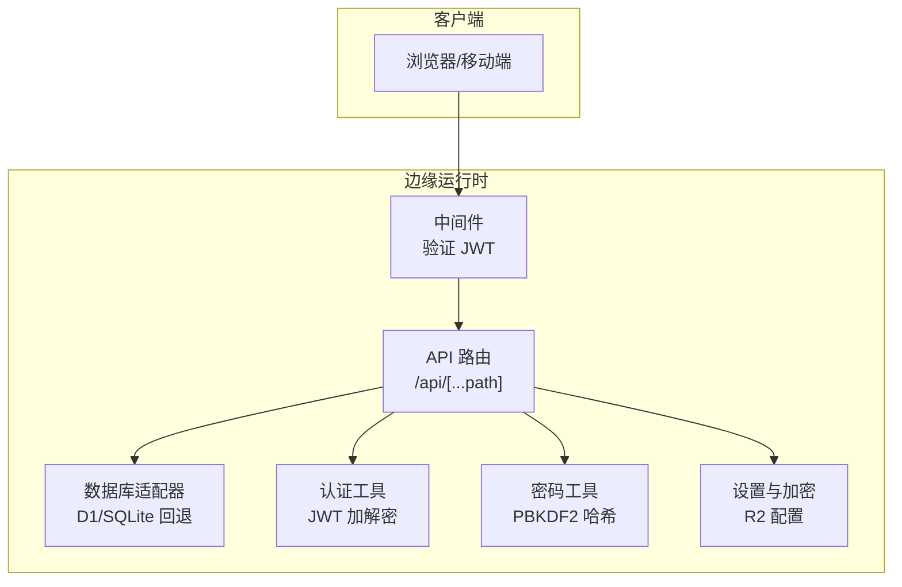
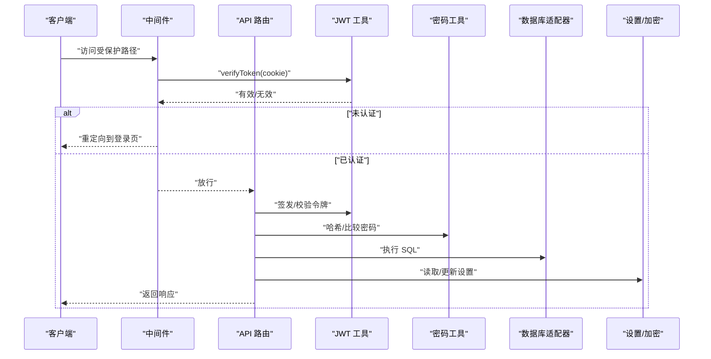
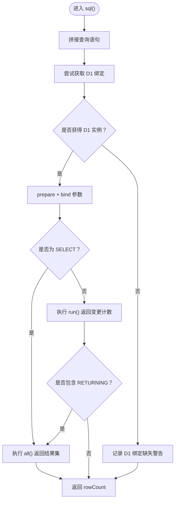
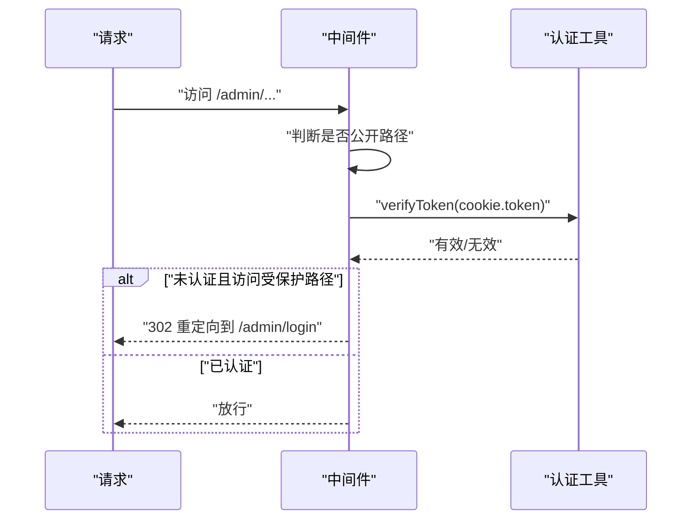
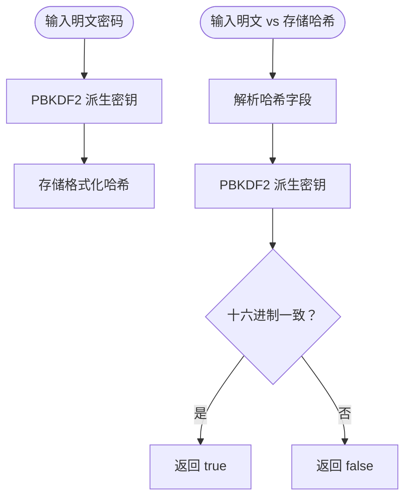
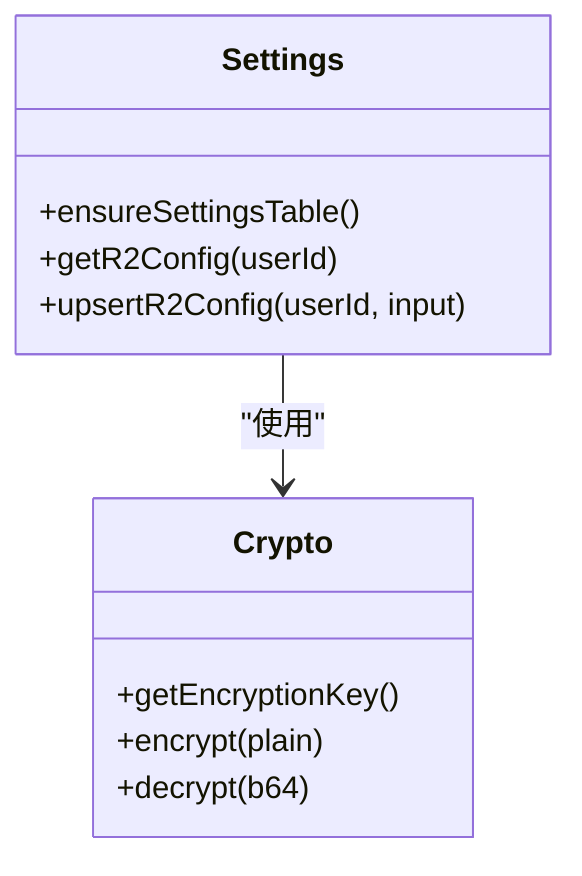
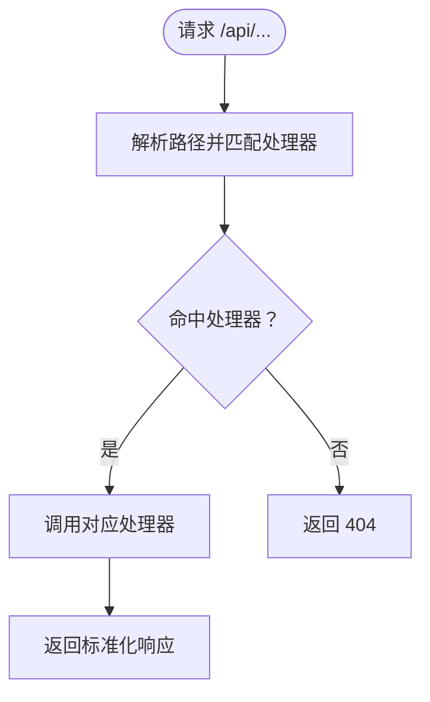
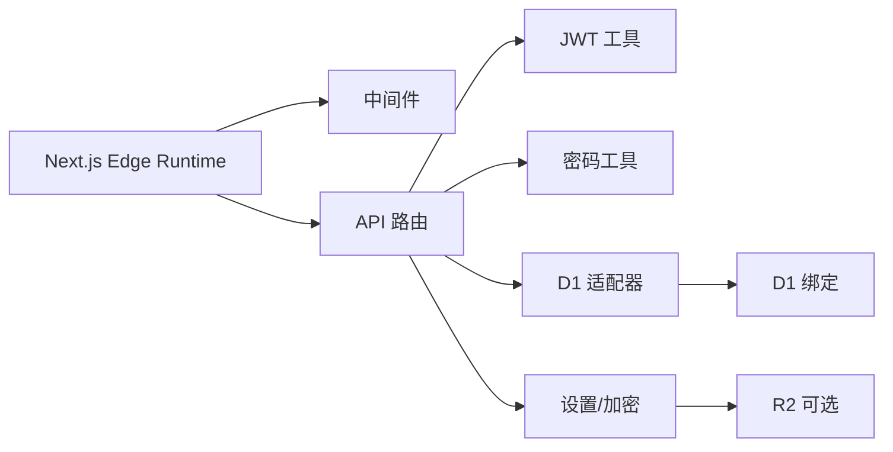

# 故障排除

<cite>
**本文引用的文件**
- [README.md](file://README.md)
- [package.json](file://package.json)
- [.env.example](file://.env.example)
- [src/lib/db.ts](file://src/lib/db.ts)
- [src/lib/auth.ts](file://src/lib/auth.ts)
- [src/middleware.ts](file://src/middleware.ts)
- [src/lib/session.ts](file://src/lib/session.ts)
- [src/app/api/[...path]/route.ts](file://src/app/api/[...path]/route.ts)
- [src/types/index.ts](file://src/types/index.ts)
- [next.config.ts](file://next.config.ts)
- [src/lib/settings.ts](file://src/lib/settings.ts)
- [src/lib/password.ts](file://src/lib/password.ts)
</cite>

## 目录
1. [简介](#简介)
2. [项目结构](#项目结构)
3. [核心组件](#核心组件)
4. [架构总览](#架构总览)
5. [详细组件分析](#详细组件分析)
6. [依赖关系分析](#依赖关系分析)
7. [性能注意事项](#性能注意事项)
8. [故障排除指南](#故障排除指南)
9. [结论](#结论)
10. [附录](#附录)

## 简介
本指南面向运维与开发人员，聚焦于数据库连接、认证失败、API 错误与性能问题的诊断与解决；提供日志分析技巧、调试工具使用、性能调优与监控建议，并解释安全考虑与紧急恢复策略。内容基于仓库中的实际实现与配置文件进行归纳总结。

## 项目结构
该系统采用 Next.js App Router 架构，前端页面位于 src/app，后端 API 路由位于 src/app/api，业务逻辑与基础设施封装在 src/lib。认证通过中间件与 JWT 实现，数据库访问通过 D1 适配器统一抽象，部署于 Vercel Pages（Edge Runtime）并可选集成 R2 存储。

图表来源
- [src/middleware.ts](file://src/middleware.ts#L1-L43)
- [src/app/api/[...path]/route.ts](file://src/app/api/[...path]/route.ts#L1-L147)
- [src/lib/db.ts](file://src/lib/db.ts#L1-L69)
- [src/lib/auth.ts](file://src/lib/auth.ts#L1-L23)
- [src/lib/password.ts](file://src/lib/password.ts#L1-L105)
- [src/lib/settings.ts](file://src/lib/settings.ts#L1-L149)

章节来源
- [README.md](file://README.md#L65-L72)
- [next.config.ts](file://next.config.ts#L1-L41)

## 核心组件
- 数据库适配器：在 Edge Runtime 下优先使用 D1 绑定，若不可用则输出警告；本地开发通过 Wrangler Pages 提供 D1 绑定。
- 认证与会话：JWT 签发与校验，中间件拦截受保护路径，会话读取失败时记录错误。
- 密码处理：使用 Web Crypto API 的 PBKDF2 实现哈希与比较，避免引入 bcryptjs。
- 设置与加密：应用设置表与 R2 凭据加密存储，使用 Web Crypto API 的 AES-GCM。
- API 路由：集中路由分发到各处理器，支持登录、登出、分类、链接、导入导出、元数据抓取等。

章节来源
- [src/lib/db.ts](file://src/lib/db.ts#L12-L68)
- [src/lib/auth.ts](file://src/lib/auth.ts#L1-L23)
- [src/middleware.ts](file://src/middleware.ts#L1-L43)
- [src/lib/session.ts](file://src/lib/session.ts#L1-L14)
- [src/lib/password.ts](file://src/lib/password.ts#L1-L105)
- [src/lib/settings.ts](file://src/lib/settings.ts#L68-L148)
- [src/app/api/[...path]/route.ts](file://src/app/api/[...path]/route.ts#L1-L147)

## 架构总览
下图展示请求从浏览器到 API、认证、数据库与存储的整体流程。

图表来源
- [src/middleware.ts](file://src/middleware.ts#L7-L35)
- [src/app/api/[...path]/route.ts](file://src/app/api/[...path]/route.ts#L12-L146)
- [src/lib/auth.ts](file://src/lib/auth.ts#L15-L22)
- [src/lib/password.ts](file://src/lib/password.ts#L23-L104)
- [src/lib/db.ts](file://src/lib/db.ts#L12-L68)
- [src/lib/settings.ts](file://src/lib/settings.ts#L87-L148)

## 详细组件分析

### 数据库连接与 D1 适配器
- 在 Edge Runtime 中通过 getRequestContext 获取 D1 绑定；若不存在则记录错误并返回空结果，提示需使用 Wrangler Pages 开发或正确配置 D1 绑定。
- 本地开发回退逻辑已被移除，确保在 Pages 开发环境中始终使用 D1 绑定。
- SQL 执行区分 SELECT 与非 SELECT，分别返回结果集或变更计数；对 RETURNING 语句统一走 all 查询。

图表来源
- [src/lib/db.ts](file://src/lib/db.ts#L12-L68)

章节来源
- [src/lib/db.ts](file://src/lib/db.ts#L12-L68)

### 认证与中间件
- 中间件在 Edge Runtime 下运行，匹配 /admin/* 路径，拦截未认证访问并重定向至登录页；已登录用户访问登录页则重定向至仪表盘。
- 登录成功后签发 JWT，后续请求通过 Cookie 中的 token 进行校验。

图表来源
- [src/middleware.ts](file://src/middleware.ts#L7-L35)
- [src/lib/auth.ts](file://src/lib/auth.ts#L15-L22)

章节来源
- [src/middleware.ts](file://src/middleware.ts#L1-L43)
- [src/lib/auth.ts](file://src/lib/auth.ts#L1-L23)
- [src/lib/session.ts](file://src/lib/session.ts#L1-L14)

### 密码处理与迁移
- 使用 Web Crypto API 的 PBKDF2 实现新密码哈希与比较，迭代次数固定，盐与派生值以十六进制存储。
- 对旧版 bcrypt 哈希格式不支持直接验证，如检测到则记录告警并返回不匹配。

图表来源
- [src/lib/password.ts](file://src/lib/password.ts#L23-L104)

章节来源
- [src/lib/password.ts](file://src/lib/password.ts#L1-L105)

### 设置与 R2 凭据加密
- 应用设置表包含 R2 凭据字段，使用 AES-GCM 加密存储；读取时解密并返回结构化配置。
- 支持按用户维度唯一索引，插入或更新时自动维护时间戳。

图表来源
- [src/lib/settings.ts](file://src/lib/settings.ts#L68-L148)
- [src/lib/settings.ts](file://src/lib/settings.ts#L14-L66)

章节来源
- [src/lib/settings.ts](file://src/lib/settings.ts#L1-L149)

### API 路由与处理器分发
- API 路由根据路径前缀分发到不同处理器（认证、分类、链接、导入导出、元数据、管理接口等），统一返回标准化响应结构。

图表来源
- [src/app/api/[...path]/route.ts](file://src/app/api/[...path]/route.ts#L12-L146)
- [src/types/index.ts](file://src/types/index.ts#L36-L46)

章节来源
- [src/app/api/[...path]/route.ts](file://src/app/api/[...path]/route.ts#L1-L147)
- [src/types/index.ts](file://src/types/index.ts#L1-L53)

## 依赖关系分析
- 运行时与打包：Next.js 16（Edge Runtime），Webpack 别名屏蔽 Node.js 专有模块，禁用图片优化以降低体积。
- 外部服务：Vercel Postgres（通过 D1 绑定）、可选 R2 存储；认证依赖 JWT Secret；密码处理依赖 Web Crypto API。

图表来源
- [next.config.ts](file://next.config.ts#L1-L41)
- [src/app/api/[...path]/route.ts](file://src/app/api/[...path]/route.ts#L1-L10)
- [src/lib/db.ts](file://src/lib/db.ts#L25-L40)
- [src/lib/settings.ts](file://src/lib/settings.ts#L3-L11)

章节来源
- [next.config.ts](file://next.config.ts#L1-L41)
- [package.json](file://package.json#L12-L48)

## 性能注意事项
- Edge Runtime 与最小化依赖：禁用图片优化、屏蔽 Node.js 专有模块，减少打包体积与冷启动时间。
- 选择性优化：启用部分包的按需导入，降低运行时开销。
- 数据库访问：尽量使用批量查询与合适的索引；避免在热路径中执行复杂事务。
- 缓存与并发：合理利用浏览器缓存与边缘缓存策略；控制并发请求数量，避免 D1 抖动。

章节来源
- [next.config.ts](file://next.config.ts#L8-L38)

## 故障排除指南

### 数据库连接问题
- 症状
  - 控制台出现 D1 绑定缺失警告或查询返回空结果。
  - 页面加载缓慢或超时。
- 诊断步骤
  - 确认运行环境为 Vercel Pages（Edge Runtime），并在本地使用 Wrangler Pages 启动。
  - 检查 D1 绑定是否正确配置（getRequestContext 可用）。
  - 查看环境变量与数据库连接字符串是否正确。
- 解决方案
  - 在本地开发时使用 Wrangler Pages 提供的 D1 绑定。
  - 在生产环境确认数据库已启用并绑定到 Pages。
  - 如需回退逻辑，请在本地开发时补充 SQLite 回退（当前实现已移除）。

章节来源
- [src/lib/db.ts](file://src/lib/db.ts#L25-L67)

### 认证失败
- 症状
  - 访问 /admin/* 被重定向到登录页。
  - 登录后仍被重定向或无法访问受保护资源。
- 诊断步骤
  - 检查 Cookie 中是否存在 token，以及其是否过期。
  - 确认 JWT_SECRET 是否正确配置且与签发一致。
  - 查看中间件是否正确拦截 /admin/* 路径。
- 解决方案
  - 更新正确的 JWT_SECRET。
  - 清除浏览器 Cookie 或使用无痕模式测试。
  - 确保登录接口返回的 token 正确写入 Cookie。

章节来源
- [src/middleware.ts](file://src/middleware.ts#L7-L35)
- [src/lib/auth.ts](file://src/lib/auth.ts#L1-L23)
- [src/lib/session.ts](file://src/lib/session.ts#L1-L14)

### API 错误
- 症状
  - 返回 404 表示路径未匹配。
  - 返回标准化错误对象（success=false）。
- 诊断步骤
  - 确认请求路径与路由分发规则一致。
  - 检查请求方法（GET/POST/PUT/DELETE）与目标处理器是否匹配。
  - 查看处理器内部错误日志（控制台）。
- 解决方案
  - 按 API 规则构造路径与方法。
  - 在处理器中增加更详细的错误信息与状态码返回。

章节来源
- [src/app/api/[...path]/route.ts](file://src/app/api/[...path]/route.ts#L12-L146)
- [src/types/index.ts](file://src/types/index.ts#L36-L46)

### 性能问题
- 症状
  - 页面加载慢、交互卡顿。
  - 数据库查询耗时长。
- 诊断步骤
  - 使用浏览器开发者工具查看网络与性能面板。
  - 检查 Edge Runtime 冷启动与函数执行时间。
  - 分析数据库查询是否缺少索引或存在 N+1 问题。
- 解决方案
  - 启用按需导入与禁用不必要的图片优化。
  - 合理设计查询与索引，避免重复查询。
  - 将静态资源与图标缓存至边缘。

章节来源
- [next.config.ts](file://next.config.ts#L8-L38)
- [src/lib/db.ts](file://src/lib/db.ts#L12-L68)

### 日志分析技巧与调试工具
- 日志定位
  - D1 查询错误会在控制台输出错误信息，优先检查此类日志。
  - 会话读取异常与密码比较异常也会输出错误日志。
- 调试建议
  - 在本地使用 Wrangler Pages 开发，便于复现与调试。
  - 使用浏览器开发者工具 Network 面板观察 API 请求与响应。
  - 在处理器中增加结构化日志输出，便于追踪请求链路。

章节来源
- [src/lib/db.ts](file://src/lib/db.ts#L58-L60)
- [src/lib/session.ts](file://src/lib/session.ts#L10-L13)
- [src/lib/password.ts](file://src/lib/password.ts#L101-L103)

### 安全考虑与防护措施
- 认证安全
  - 使用强 JWT_SECRET，定期轮换。
  - 限制令牌有效期（默认 24 小时），避免长期有效令牌。
- 密码安全
  - 新密码使用 PBKDF2 哈希，避免 bcryptjs 依赖。
  - 不支持旧版 bcrypt 哈希的直接验证，建议引导用户重置密码。
- 存储安全
  - R2 凭据使用 AES-GCM 加密存储，密钥来自环境变量或备用键。
- 边缘安全
  - 确保仅在 Edge Runtime 中运行敏感逻辑，避免 Node.js 专有模块被打包。

章节来源
- [src/lib/auth.ts](file://src/lib/auth.ts#L1-L23)
- [src/lib/password.ts](file://src/lib/password.ts#L53-L63)
- [src/lib/settings.ts](file://src/lib/settings.ts#L14-L66)

### 紧急恢复策略
- 快速自愈
  - 重启 Edge Functions（重新部署）以清除异常状态。
  - 检查并修复 D1 绑定配置，确保数据库可用。
- 数据回滚
  - 若设置或凭据异常，回滚到上一版本部署。
  - 使用数据库备份恢复关键表（如 app_settings、users、links、categories）。
- 降级方案
  - 临时关闭 R2 功能，仅使用本地存储或禁用相关接口。
  - 降低并发与缓存策略，缓解数据库压力。

章节来源
- [README.md](file://README.md#L55-L63)
- [src/lib/settings.ts](file://src/lib/settings.ts#L68-L84)

## 结论
本指南提供了从数据库、认证、API 到性能与安全的系统化故障排除方法。建议在日常运维中结合日志与监控，持续优化查询与缓存策略，并严格管理密钥与凭据，确保系统稳定与安全。

## 附录
- 环境变量参考
  - 数据库：POSTGRES_URL、POSTGRES_PRISMA_URL、POSTGRES_URL_NON_POOLING、POSTGRES_USER、POSTGRES_HOST、POSTGRES_PASSWORD、POSTGRES_DATABASE
  - 认证：JWT_SECRET、ADMIN_EMAIL、ADMIN_PASSWORD
  - 初始化：SETUP_SECRET
  - R2 存储：R2_ACCOUNT_ID、R2_ACCESS_KEY_ID、R2_SECRET_ACCESS_KEY、R2_BUCKET_NAME、R2_PUBLIC_BASE_URL
  - 应用设置加密：SETTINGS_ENCRYPTION_KEY

章节来源
- [.env.example](file://.env.example#L1-L29)