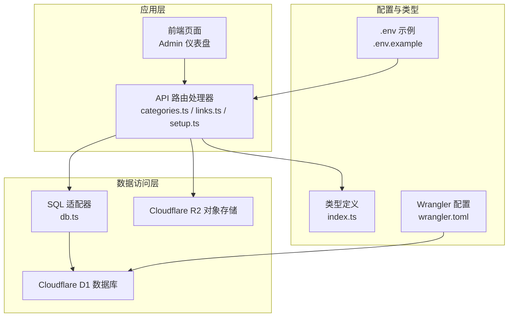
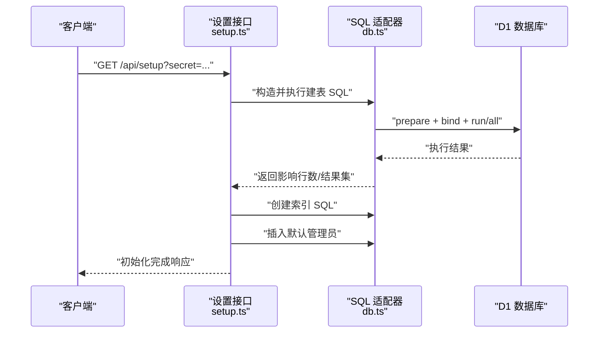
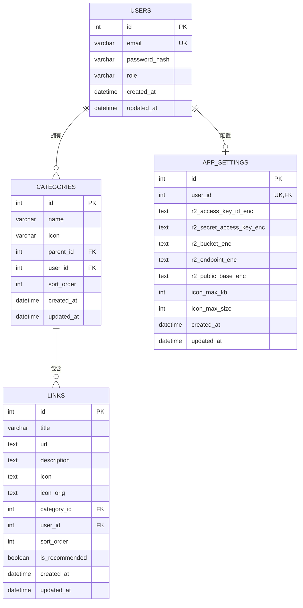
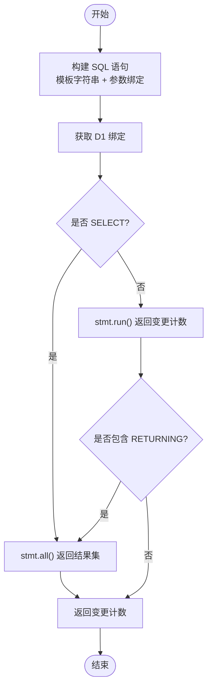
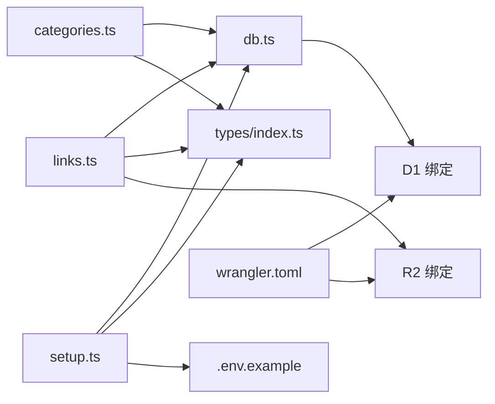

# 数据库设计

<cite>
**本文引用的文件**
- [src/lib/db.ts](file://src/lib/db.ts)
- [src/lib/api-handlers/setup.ts](file://src/lib/api-handlers/setup.ts)
- [src/lib/api-handlers/categories.ts](file://src/lib/api-handlers/categories.ts)
- [src/lib/api-handlers/links.ts](file://src/lib/api-handlers/links.ts)
- [src/lib/settings.ts](file://src/lib/settings.ts)
- [src/types/index.ts](file://src/types/index.ts)
- [wrangler.toml](file://wrangler.toml)
- [.env.example](file://.env.example)
- [README.md](file://README.md)
</cite>

## 目录
1. [简介](#简介)
2. [项目结构](#项目结构)
3. [核心组件](#核心组件)
4. [架构总览](#架构总览)
5. [详细组件分析](#详细组件分析)
6. [依赖分析](#依赖分析)
7. [性能考虑](#性能考虑)
8. [故障排查指南](#故障排查指南)
9. [结论](#结论)
10. [附录](#附录)

## 简介
本文件系统性梳理导航站点的数据库设计，覆盖实体关系、字段定义与数据类型、主键/外键、索引与约束、数据验证与业务规则、数据访问模式、缓存策略、性能考量、数据生命周期与保留策略、迁移与版本管理、以及数据安全与隐私要求。内容基于代码库中的数据库初始化脚本、类型定义、查询封装与环境配置进行归纳总结。

## 项目结构
数据库层通过统一的 SQL 适配器在不同运行环境下工作，并由 API 处理器负责建表、索引与数据读写。类型定义明确了各实体的字段与约束，部署配置指定了 D1 绑定与 R2 存储。

图表来源
- [src/lib/db.ts](file://src/lib/db.ts#L1-L68)
- [src/lib/api-handlers/setup.ts](file://src/lib/api-handlers/setup.ts#L16-L103)
- [src/lib/api-handlers/categories.ts](file://src/lib/api-handlers/categories.ts#L1-L199)
- [src/lib/api-handlers/links.ts](file://src/lib/api-handlers/links.ts#L1-L270)
- [src/types/index.ts](file://src/types/index.ts#L1-L53)
- [wrangler.toml](file://wrangler.toml#L6-L14)
- [.env.example](file://.env.example#L1-L29)

章节来源
- [src/lib/db.ts](file://src/lib/db.ts#L1-L68)
- [src/lib/api-handlers/setup.ts](file://src/lib/api-handlers/setup.ts#L1-L131)
- [src/lib/api-handlers/categories.ts](file://src/lib/api-handlers/categories.ts#L1-L199)
- [src/lib/api-handlers/links.ts](file://src/lib/api-handlers/links.ts#L1-L270)
- [src/types/index.ts](file://src/types/index.ts#L1-L53)
- [wrangler.toml](file://wrangler.toml#L1-L14)
- [.env.example](file://.env.example#L1-L29)

## 核心组件
- 数据库适配器：统一 SQL 执行入口，支持在边缘运行时通过 D1 绑定执行查询，并对 SELECT/非 SELECT 分支处理返回值。
- 初始化与建模：通过设置接口创建用户、分类、链接、应用设置等表，并建立必要索引与唯一约束。
- 实体与校验：类型定义明确字段与可空性；API 层使用 Zod 对输入进行结构化校验。
- 缓存与刷新：API 操作后触发路径级重新生成，以保持 UI 与数据一致性。
- 存储与加密：应用设置中保存 R2 凭据并采用对称加密存储；图标上传与访问通过 R2 完成。

章节来源
- [src/lib/db.ts](file://src/lib/db.ts#L12-L68)
- [src/lib/api-handlers/setup.ts](file://src/lib/api-handlers/setup.ts#L16-L103)
- [src/lib/api-handlers/categories.ts](file://src/lib/api-handlers/categories.ts#L35-L94)
- [src/lib/api-handlers/links.ts](file://src/lib/api-handlers/links.ts#L69-L140)
- [src/lib/settings.ts](file://src/lib/settings.ts#L113-L139)
- [src/types/index.ts](file://src/types/index.ts#L1-L53)

## 架构总览
数据库初始化流程在首次访问设置端点时执行，创建核心表与索引，并插入默认管理员账户。随后，分类与链接的增删改查通过 API 处理器完成，查询封装在适配器中统一执行。

图表来源
- [src/lib/api-handlers/setup.ts](file://src/lib/api-handlers/setup.ts#L6-L131)
- [src/lib/db.ts](file://src/lib/db.ts#L42-L62)

章节来源
- [src/lib/api-handlers/setup.ts](file://src/lib/api-handlers/setup.ts#L6-L131)
- [src/lib/db.ts](file://src/lib/db.ts#L12-L68)

## 详细组件分析

### 数据模型与实体关系
- 用户（users）
  - 主键：自增整型 id
  - 字段：邮箱（唯一）、密码哈希、角色（默认 admin）、时间戳 created_at/updated_at
  - 约束：邮箱唯一
- 分类（categories）
  - 主键：自增整型 id
  - 外键：user_id 引用 users(id)，parent_id 引用 categories(id)（自引用）
  - 字段：名称、图标、排序、时间戳 created_at/updated_at
  - 约束：非空名称；parent_id 支持空（根节点）
- 链接（links）
  - 主键：自增整型 id
  - 外键：category_id 引用 categories(id)，user_id 引用 users(id)
  - 字段：标题、URL（唯一组合 user_id）、描述、图标、推荐标记、排序、时间戳
  - 约束：URL+用户唯一；URL 必填；标题长度限制；URL 格式校验
- 应用设置（app_settings）
  - 主键：自增整型 id
  - 外键：user_id 引用 users(id)（唯一索引）
  - 字段：加密后的 R2 凭据、图标大小与 KB 限制、时间戳
  - 约束：每个用户仅有一条设置记录

图表来源
- [src/lib/api-handlers/setup.ts](file://src/lib/api-handlers/setup.ts#L16-L103)
- [src/types/index.ts](file://src/types/index.ts#L1-L53)

章节来源
- [src/lib/api-handlers/setup.ts](file://src/lib/api-handlers/setup.ts#L16-L103)
- [src/types/index.ts](file://src/types/index.ts#L1-L53)

### 字段定义与数据类型
- 字符串类型：VARCHAR(n)、TEXT
- 整数类型：INTEGER（含自增主键）
- 布尔类型：BOOLEAN
- 时间类型：DATETIME（默认 CURRENT_TIMESTAMP）
- 唯一约束：UNIQUE(url, user_id)

章节来源
- [src/lib/api-handlers/setup.ts](file://src/lib/api-handlers/setup.ts#L16-L103)

### 主键/外键与索引
- 主键：users.id、categories.id、links.id、app_settings.id
- 外键：categories.user_id → users.id；categories.parent_id → categories.id；links.category_id → categories.id；links.user_id → users.id；app_settings.user_id → users.id
- 索引：
  - users(email)
  - categories(user_id)、categories(parent_id)
  - links(category_id)、links(user_id)、links(sort_order)、links(user_id, category_id, sort_order)
  - app_settings(user_id)（唯一）

章节来源
- [src/lib/api-handlers/setup.ts](file://src/lib/api-handlers/setup.ts#L28-L104)

### 数据验证与业务规则
- 输入校验（Zod）：
  - 链接创建/更新：标题长度、URL 格式、描述长度、分类 ID、图标字段允许空或空字符串、排序非负、推荐布尔
- 唯一性与幂等：
  - 分类：按用户与名称去重，避免重复创建
  - 链接：按用户与 URL 正则化后去重，避免重复插入
- 权限控制：
  - 分类与链接的增删改仅允许管理员
- 删除保护：
  - 分类删除前检查是否存在子分类或链接
- 排序与批量更新：
  - 链接支持按数组顺序批量更新排序字段

章节来源
- [src/lib/api-handlers/categories.ts](file://src/lib/api-handlers/categories.ts#L35-L94)
- [src/lib/api-handlers/links.ts](file://src/lib/api-handlers/links.ts#L69-L140)
- [src/lib/api-handlers/links.ts](file://src/lib/api-handlers/links.ts#L142-L200)
- [src/lib/api-handlers/links.ts](file://src/lib/api-handlers/links.ts#L202-L235)
- [src/lib/api-handlers/links.ts](file://src/lib/api-handlers/links.ts#L237-L268)

### 数据访问模式与缓存策略
- 访问模式：
  - 查询封装：统一通过 SQL 适配器执行，自动区分 SELECT/非 SELECT，并处理 RETURNING 场景
  - 分页与搜索：链接列表支持分页、分类筛选与标题/描述模糊匹配
  - 联表查询：链接列表左联分类以返回分类名称
- 缓存与刷新：
  - 写操作后通过路径级重新生成保持 UI 与数据一致

图表来源
- [src/lib/db.ts](file://src/lib/db.ts#L12-L68)

章节来源
- [src/lib/db.ts](file://src/lib/db.ts#L12-L68)
- [src/lib/api-handlers/links.ts](file://src/lib/api-handlers/links.ts#L8-L23)

### 性能考虑
- 索引优化：
  - links(user_id, category_id, sort_order)、links(user_id, sort_order)、categories(user_id) 有助于按用户与分类检索与排序
  - links(sort_order) 支持快速排序展示
- 查询优化：
  - 使用 LIMIT/OFFSET 实现分页
  - 使用 LEFT JOIN 返回分类名，减少二次查询
- 写入优化：
  - 批量更新排序通过 Promise.all 并行执行
- 缓存策略：
  - 路径级重新生成替代全站缓存，降低复杂度

章节来源
- [src/lib/api-handlers/setup.ts](file://src/lib/api-handlers/setup.ts#L72-L86)
- [src/lib/api-handlers/links.ts](file://src/lib/api-handlers/links.ts#L254-L258)

### 数据生命周期、保留策略与归档规则
- 当前未实现显式的软删除、归档或过期清理机制。建议：
  - 引入 deleted_at 字段与软删除开关
  - 定期清理长期未访问的链接或分类
  - 归档历史数据至冷存储（如 R2），并提供恢复接口

（本节为通用建议，不直接分析具体文件）

### 数据迁移路径与版本管理
- 当前通过设置接口一次性初始化数据库结构，未见迁移脚本或版本号字段
- 建议：
  - 引入 migrations 表或版本号字段，记录当前数据库版本
  - 为后续结构变更提供增量迁移脚本，保证生产安全演进

章节来源
- [src/lib/api-handlers/setup.ts](file://src/lib/api-handlers/setup.ts#L6-L131)

### 数据安全、隐私与访问控制
- 认证与授权：
  - 管理员权限：分类与链接的增删改仅限管理员
  - 登录流程与 JWT 密钥在环境变量中配置
- 数据加密：
  - 应用设置中的 R2 凭据采用对称加密存储
- 环境隔离：
  - D1 绑定通过 Wrangler 配置，R2 存储独立配置
- 隐私与最小暴露：
  - 类型定义严格限定字段与可空性，避免过度暴露

章节来源
- [src/lib/api-handlers/categories.ts](file://src/lib/api-handlers/categories.ts#L35-L40)
- [src/lib/api-handlers/links.ts](file://src/lib/api-handlers/links.ts#L142-L147)
- [src/lib/settings.ts](file://src/lib/settings.ts#L113-L139)
- [wrangler.toml](file://wrangler.toml#L6-L14)
- [.env.example](file://.env.example#L12-L29)
- [README.md](file://README.md#L55-L64)

## 依赖分析
- 组件耦合：
  - API 处理器依赖 SQL 适配器与会话模块
  - 类型定义被 API 处理器与组件共享
  - 配置文件决定 D1/R2 绑定与密钥
- 外部依赖：
  - Cloudflare D1 与 R2
  - Zod 用于输入校验

图表来源
- [src/lib/api-handlers/categories.ts](file://src/lib/api-handlers/categories.ts#L1-L199)
- [src/lib/api-handlers/links.ts](file://src/lib/api-handlers/links.ts#L1-L270)
- [src/lib/api-handlers/setup.ts](file://src/lib/api-handlers/setup.ts#L1-L131)
- [src/lib/db.ts](file://src/lib/db.ts#L1-L68)
- [src/types/index.ts](file://src/types/index.ts#L1-L53)
- [wrangler.toml](file://wrangler.toml#L6-L14)
- [.env.example](file://.env.example#L1-L29)

章节来源
- [src/lib/api-handlers/categories.ts](file://src/lib/api-handlers/categories.ts#L1-L199)
- [src/lib/api-handlers/links.ts](file://src/lib/api-handlers/links.ts#L1-L270)
- [src/lib/api-handlers/setup.ts](file://src/lib/api-handlers/setup.ts#L1-L131)
- [src/lib/db.ts](file://src/lib/db.ts#L1-L68)
- [src/types/index.ts](file://src/types/index.ts#L1-L53)
- [wrangler.toml](file://wrangler.toml#L1-L14)
- [.env.example](file://.env.example#L1-L29)

## 性能考虑
- 查询路径：
  - 链接列表：多条件过滤 + 分页 + 排序，建议优先使用复合索引
  - 分类树：自引用父节点索引，支持层级查询
- 写入路径：
  - 批量排序更新使用并行执行，减少往返延迟
- 缓存：
  - 路径级重新生成替代全局缓存，提升一致性与可维护性

（本节为通用指导，不直接分析具体文件）

## 故障排查指南
- D1 绑定缺失：
  - 适配器会在未找到绑定时输出警告，需确认运行环境与 Wrangler 配置
- 查询异常：
  - 适配器捕获并抛出错误，便于定位 SQL 问题
- 唯一约束冲突：
  - 分类与链接在创建时进行重复检测，避免唯一约束错误
- 权限不足：
  - 非管理员尝试写入将被拒绝

章节来源
- [src/lib/db.ts](file://src/lib/db.ts#L64-L67)
- [src/lib/api-handlers/categories.ts](file://src/lib/api-handlers/categories.ts#L74-L86)
- [src/lib/api-handlers/links.ts](file://src/lib/api-handlers/links.ts#L129-L134)

## 结论
本设计以 Cloudflare D1 为核心，结合统一 SQL 适配器与严格的输入校验，实现了用户、分类、链接与应用设置的完整数据模型。通过索引与查询优化、路径级缓存与幂等写入，兼顾了性能与一致性。建议后续引入迁移机制、软删除与归档策略，进一步完善数据生命周期管理与安全性。

## 附录
- 示例数据（示意）
  - 用户：admin@example.com（默认管理员）
  - 分类：根节点与若干子分类
  - 链接：若干带分类与推荐标记的条目
- 部署与初始化
  - 通过设置端点初始化数据库并创建默认管理员
  - 环境变量包含 JWT 与 SETUP 密钥，以及 R2 凭据与加密密钥

章节来源
- [src/lib/api-handlers/setup.ts](file://src/lib/api-handlers/setup.ts#L106-L122)
- [.env.example](file://.env.example#L12-L29)
- [README.md](file://README.md#L55-L64)