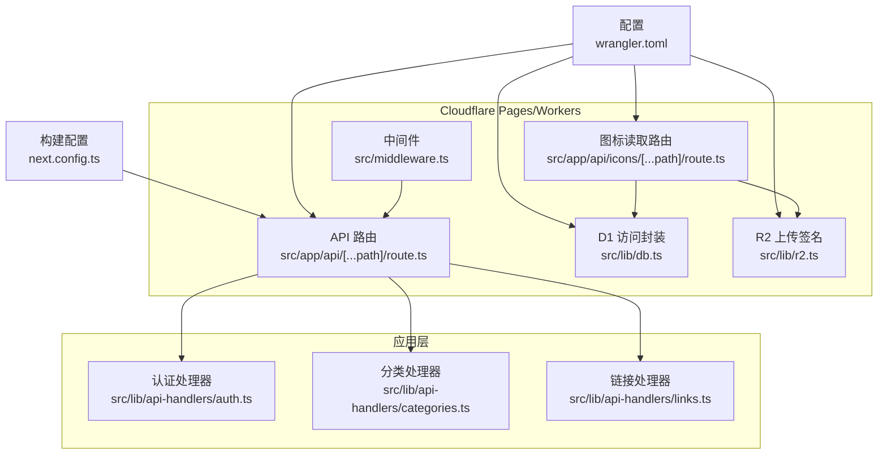
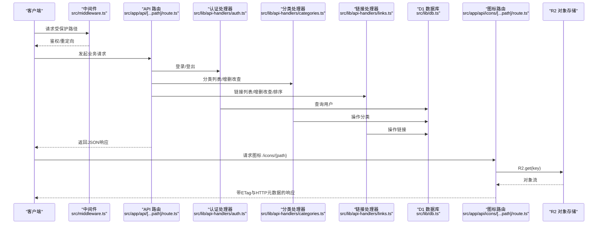
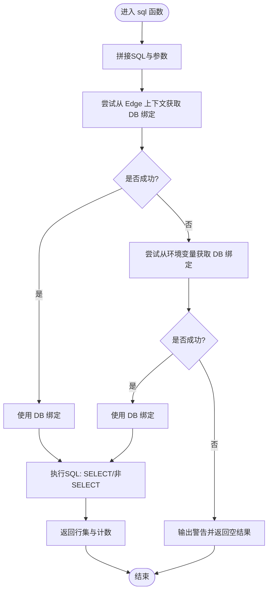
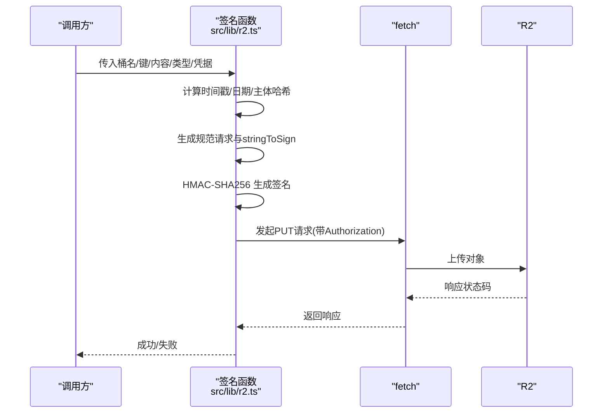
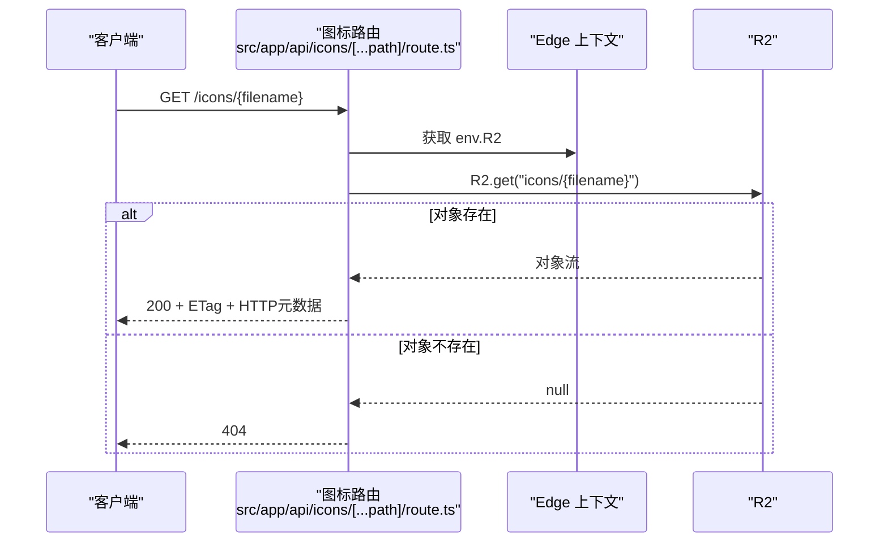
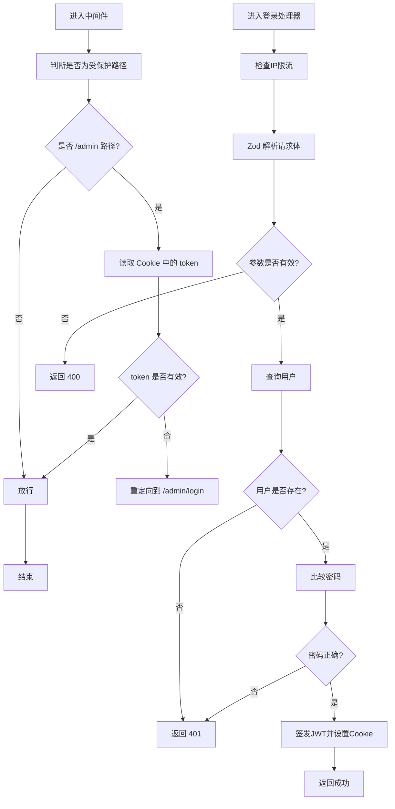
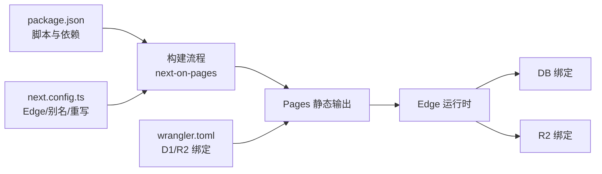

# Cloudflare集成

<cite>
**本文引用的文件**
- [wrangler.toml](file://wrangler.toml)
- [package.json](file://package.json)
- [src/lib/db.ts](file://src/lib/db.ts)
- [src/lib/r2.ts](file://src/lib/r2.ts)
- [src/app/api/[...path]/route.ts](file://src/app/api/[...path]/route.ts)
- [src/app/api/icons/[...path]/route.ts](file://src/app/api/icons/[...path]/route.ts)
- [src/middleware.ts](file://src/middleware.ts)
- [src/lib/api-handlers/auth.ts](file://src/lib/api-handlers/auth.ts)
- [src/lib/api-handlers/categories.ts](file://src/lib/api-handlers/categories.ts)
- [src/lib/api-handlers/links.ts](file://src/lib/api-handlers/links.ts)
- [next.config.ts](file://next.config.ts)
- [.env.example](file://.env.example)
</cite>

## 目录
1. [简介](#简介)
2. [项目结构](#项目结构)
3. [核心组件](#核心组件)
4. [架构总览](#架构总览)
5. [详细组件分析](#详细组件分析)
6. [依赖关系分析](#依赖关系分析)
7. [性能考量](#性能考量)
8. [故障排查指南](#故障排查指南)
9. [结论](#结论)
10. [附录](#附录)

## 简介
本项目采用Next.js App Router与Cloudflare Pages/Workers进行集成，通过以下方式实现端到端的边缘化部署与运行：
- 使用Edge Runtime（App Router路由与中间件）承载API与静态资源分发逻辑，充分利用Cloudflare Workers的低延迟与就近访问优势。
- 数据层通过Cloudflare D1提供轻量级关系型数据库能力，并在Edge环境中通过绑定直接访问。
- 对象存储采用Cloudflare R2，结合自研签名上传与内置对象读取接口，实现图标等静态资源的高效分发与缓存。
- 通过wrangler.toml完成D1与R2的绑定配置，并在构建阶段输出至Pages静态目录，确保与Next-on-Pages生态无缝衔接。

该集成方案旨在发挥Edge Runtime的低延迟与可扩展性，同时通过合理的数据库访问模式、对象存储上传签名与缓存策略，实现高并发下的稳定与成本可控。

## 项目结构
围绕Cloudflare集成的关键文件与职责如下：
- 配置与构建
  - wrangler.toml：定义Cloudflare Pages项目名称、兼容日期、兼容标志以及D1与R2的绑定信息。
  - package.json：声明依赖与脚本，包括next-on-pages的集成与开发构建流程。
  - next.config.ts：配置Edge运行时、图片优化策略、别名与重写规则，确保与Workers兼容。
- 边缘运行时入口
  - src/app/api/[...path]/route.ts：统一的API入口，声明runtime为edge，集中路由到各业务处理器。
  - src/middleware.ts：声明runtime为experimental-edge，实现管理员路径的鉴权与重定向。
- 数据访问层
  - src/lib/db.ts：封装D1访问，优先从Edge上下文获取DB绑定，支持SQL模板字符串与返回行集统计。
- 对象存储层
  - src/lib/r2.ts：实现AWS Signature V4签名算法，支持在Edge中直接上传至R2。
  - src/app/api/icons/[...path]/route.ts：基于R2的图标读取接口，返回带HTTP元数据与ETag的响应。
- 业务处理器
  - src/lib/api-handlers/auth.ts：登录鉴权与会话Cookie设置，含IP限流与错误处理。
  - src/lib/api-handlers/categories.ts：分类增删改查与幂等性处理。
  - src/lib/api-handlers/links.ts：链接增删改查、URL去重、排序批量更新与分页查询。



图表来源
- [src/app/api/[...path]/route.ts](file://src/app/api/[...path]/route.ts#L10-L147)
- [src/app/api/icons/[...path]/route.ts](file://src/app/api/icons/[...path]/route.ts#L1-L37)
- [src/middleware.ts](file://src/middleware.ts#L5-L43)
- [src/lib/db.ts](file://src/lib/db.ts#L1-L69)
- [src/lib/r2.ts](file://src/lib/r2.ts#L1-L103)
- [wrangler.toml](file://wrangler.toml#L1-L14)
- [next.config.ts](file://next.config.ts#L1-L41)

章节来源
- [wrangler.toml](file://wrangler.toml#L1-L14)
- [package.json](file://package.json#L1-L50)
- [next.config.ts](file://next.config.ts#L1-L41)

## 核心组件
- Edge Runtime与路由
  - App Router路由与中间件均声明为edge或experimental-edge，确保在Workers中运行，获得低延迟与高并发特性。
  - next.config.ts启用Edge运行时与图片优化策略，避免引入Node专有模块，保证打包兼容性。
- 数据库访问（D1）
  - db.ts通过getRequestContext获取DB绑定，支持SELECT与非SELECT语句的差异化执行；对错误进行捕获与日志记录，便于定位问题。
- 对象存储（R2）
  - r2.ts实现AWS Signature V4签名算法，支持在Edge中直接上传；icons路由通过R2.get读取对象并返回带HTTP元数据与ETag的响应，便于浏览器缓存。
- 业务处理器
  - auth.ts实现登录鉴权、IP限流与Cookie设置；categories.ts与links.ts提供幂等性、去重与批量更新等稳健逻辑。

章节来源
- [src/app/api/[...path]/route.ts](file://src/app/api/[...path]/route.ts#L10-L147)
- [src/middleware.ts](file://src/middleware.ts#L5-L43)
- [src/lib/db.ts](file://src/lib/db.ts#L12-L68)
- [src/lib/r2.ts](file://src/lib/r2.ts#L23-L102)
- [src/app/api/icons/[...path]/route.ts](file://src/app/api/icons/[...path]/route.ts#L6-L36)
- [src/lib/api-handlers/auth.ts](file://src/lib/api-handlers/auth.ts#L48-L140)
- [src/lib/api-handlers/categories.ts](file://src/lib/api-handlers/categories.ts#L17-L198)
- [src/lib/api-handlers/links.ts](file://src/lib/api-handlers/links.ts#L25-L269)

## 架构总览
下图展示了从客户端请求到数据与对象存储的完整链路，以及Edge Runtime在其中的核心作用：



图表来源
- [src/middleware.ts](file://src/middleware.ts#L7-L35)
- [src/app/api/[...path]/route.ts](file://src/app/api/[...path]/route.ts#L12-L146)
- [src/lib/api-handlers/auth.ts](file://src/lib/api-handlers/auth.ts#L48-L140)
- [src/lib/api-handlers/categories.ts](file://src/lib/api-handlers/categories.ts#L17-L198)
- [src/lib/api-handlers/links.ts](file://src/lib/api-handlers/links.ts#L25-L269)
- [src/lib/db.ts](file://src/lib/db.ts#L24-L62)
- [src/app/api/icons/[...path]/route.ts](file://src/app/api/icons/[...path]/route.ts#L6-L36)

## 详细组件分析

### 数据库访问封装（D1）
- 设计要点
  - 优先从Edge上下文获取DB绑定，若不可用则尝试从进程环境变量回退，确保在不同运行环境下具备可移植性。
  - 支持模板字符串SQL构造与参数绑定，自动区分SELECT与非SELECT语句，分别调用all或run并返回行集与变更计数。
  - 对异常进行捕获与日志记录，便于快速定位问题。
- 复杂度与性能
  - 单次查询的时间复杂度取决于SQL执行计划与索引设计；建议在高频查询字段上建立索引。
  - 无连接池概念，每次查询直接绑定参数执行，适合短事务与低并发场景；高并发下建议配合缓存与批量操作。
- 错误处理
  - 当未找到DB绑定时输出警告提示，避免阻塞本地开发流程（通过wrangler pages dev提供D1绑定）。



图表来源
- [src/lib/db.ts](file://src/lib/db.ts#L12-L68)

章节来源
- [src/lib/db.ts](file://src/lib/db.ts#L12-L68)

### 对象存储上传（R2）
- 设计要点
  - 自研AWS Signature V4签名实现，支持在Edge Runtime中生成Authorization头，无需依赖SDK即可上传。
  - 通过URL编码与标准化请求头、规范化请求串与范围计算，确保签名一致性。
- 上传流程
  - 构造目标URL与头部，计算body SHA-256与stringToSign，按步骤生成签名并发起PUT请求。
  - 若响应非2xx，解析响应体并抛出错误，便于上层处理。
- 性能与安全
  - 在Edge中计算签名与哈希，避免额外网络往返；注意密钥管理与过期策略，建议使用短期凭证。



图表来源
- [src/lib/r2.ts](file://src/lib/r2.ts#L23-L102)

章节来源
- [src/lib/r2.ts](file://src/lib/r2.ts#L23-L102)

### 图标读取（R2对象读取）
- 设计要点
  - 路由将 /icons/{path} 映射到 /api/icons/{path}，在Edge中通过R2.get读取对象。
  - 将对象的HTTP元数据写入响应头，并设置ETag，便于浏览器缓存与条件请求。
- 错误处理
  - 对象不存在返回404；其他异常记录日志并返回500，便于快速定位。



图表来源
- [src/app/api/icons/[...path]/route.ts](file://src/app/api/icons/[...path]/route.ts#L6-L36)

章节来源
- [src/app/api/icons/[...path]/route.ts](file://src/app/api/icons/[...path]/route.ts#L6-L36)

### 认证与中间件
- 中间件
  - 声明runtime为experimental-edge，对/admin路径进行鉴权；未登录重定向至登录页，已登录访问登录页重定向至仪表盘。
- 登录处理器
  - 实现IP限流（窗口与最大尝试次数）、Zod参数校验、用户查询与密码比对、JWT签发与Cookie设置。
  - 生产环境缺少JWT密钥时返回500，避免不安全配置。



图表来源
- [src/middleware.ts](file://src/middleware.ts#L7-L35)
- [src/lib/api-handlers/auth.ts](file://src/lib/api-handlers/auth.ts#L48-L140)

章节来源
- [src/middleware.ts](file://src/middleware.ts#L5-L43)
- [src/lib/api-handlers/auth.ts](file://src/lib/api-handlers/auth.ts#L14-L140)

### 分类与链接处理器
- 分类处理器
  - 提供列表、创建、更新、删除接口；创建时进行同名幂等性检查与唯一约束容错；删除前检查是否有子项或关联链接。
- 链接处理器
  - 列表支持分页与搜索；创建时对URL进行归一化与去重检测；支持批量排序更新；更新/删除支持幂等性检查。

```mermaid
sequenceDiagram
participant C as "客户端"
participant API as "API 路由"
participant CAT as "分类处理器"
participant LINK as "链接处理器"
participant DB as "D1"
C->>API : POST /categories
API->>CAT : create(request)
CAT->>DB : 插入分类(幂等/去重)
DB-->>CAT : 结果
CAT-->>C : JSON 响应
C->>API : POST /links
API->>LINK : create(request)
LINK->>DB : 插入链接(URL去重)
DB-->>LINK : 结果
LINK-->>C : JSON 响应
```

图表来源
- [src/lib/api-handlers/categories.ts](file://src/lib/api-handlers/categories.ts#L17-L198)
- [src/lib/api-handlers/links.ts](file://src/lib/api-handlers/links.ts#L25-L269)

章节来源
- [src/lib/api-handlers/categories.ts](file://src/lib/api-handlers/categories.ts#L17-L198)
- [src/lib/api-handlers/links.ts](file://src/lib/api-handlers/links.ts#L25-L269)

## 依赖关系分析
- 运行时与打包
  - next.config.ts强制忽略Node专有模块，避免被打包进Edge Worker；启用optimizePackageImports与webpack别名，减小包体积。
  - rewrites将 /icons/* 重写到 /api/icons/*，简化前端访问路径。
- 部署与绑定
  - wrangler.toml定义了D1与R2的绑定名称与标识，确保在Cloudflare Pages构建后可直接在Edge中访问。



图表来源
- [package.json](file://package.json#L5-L11)
- [wrangler.toml](file://wrangler.toml#L6-L13)
- [next.config.ts](file://next.config.ts#L31-L38)

章节来源
- [package.json](file://package.json#L5-L11)
- [wrangler.toml](file://wrangler.toml#L6-L13)
- [next.config.ts](file://next.config.ts#L31-L38)

## 性能考量
- Edge Runtime优势
  - 低延迟与就近访问：请求在最近的边缘节点处理，减少跨地域往返时间。
  - 无服务器扩展：根据流量自动扩缩容，避免传统服务器的容量规划压力。
- 冷启动与并发
  - 冷启动：Edge函数在首次被触发时初始化，后续复用生命周期较短；可通过预热策略（如定时健康检查）降低感知延迟。
  - 并发：Workers具备高并发能力，但需避免在单次请求中执行长时间阻塞操作；将耗时任务（如大文件上传）交给R2直传或后台作业。
- 数据库访问
  - D1为轻量级SQLite，适合中小规模数据；建议对热点查询字段建立索引，减少全表扫描。
  - 避免长事务与大批量写入，采用批量更新与幂等性设计降低冲突概率。
- 对象存储
  - R2上传建议使用自签名直传，减少Workers负载；利用ETag与HTTP缓存头提升命中率。
  - 图标读取返回ETag与HTTP元数据，利于浏览器缓存与CDN加速。
- 构建优化
  - 关闭图片优化与排除Node专有模块，减小包体积与打包时间；启用包导入优化与别名映射。

[本节为通用性能指导，不直接分析具体文件，故无章节来源]

## 故障排查指南
- 数据库连接问题
  - 现象：D1绑定未找到或查询报错。
  - 排查：确认在Edge上下文中是否能获取DB绑定；检查wrangler.toml中的D1绑定配置；查看db.ts中的错误日志。
- 对象存储上传失败
  - 现象：R2上传返回非2xx状态。
  - 排查：核对R2凭据与桶名；检查签名生成过程与Authorization头；查看响应体错误信息。
- 图标读取404
  - 现象：访问 /icons/{path} 返回404。
  - 排查：确认对象键是否正确（icons/{filename}）；检查R2中是否存在该对象；查看路由中的错误处理分支。
- 中间件与鉴权
  - 现象：访问 /admin 路径被重定向或无法登录。
  - 排查：确认Cookie中token是否有效；检查JWT密钥配置；核对中间件匹配规则与重定向逻辑。
- 构建与部署
  - 现象：构建失败或Pages无法识别绑定。
  - 排查：确认next-on-pages脚本执行顺序；检查wrangler.toml与Pages构建输出目录配置。

章节来源
- [src/lib/db.ts](file://src/lib/db.ts#L24-L68)
- [src/lib/r2.ts](file://src/lib/r2.ts#L96-L99)
- [src/app/api/icons/[...path]/route.ts](file://src/app/api/icons/[...path]/route.ts#L15-L23)
- [src/middleware.ts](file://src/middleware.ts#L24-L32)
- [wrangler.toml](file://wrangler.toml#L6-L13)

## 结论
本项目通过Edge Runtime、D1与R2的组合，实现了低延迟、可扩展且成本可控的导航站点服务。Edge路由与中间件确保了请求的快速处理与安全控制；D1提供简洁的关系型数据能力；R2承担静态资源的高效分发。通过合理的缓存策略、签名直传与幂等性设计，系统在高并发场景下仍能保持稳定与高性能。建议持续关注索引优化、缓存命中率与凭据轮换，以进一步提升性能与安全性。

[本节为总结性内容，不直接分析具体文件，故无章节来源]

## 附录

### 环境变量配置
- 数据库（Vercel Postgres）：用于本地开发或替代方案，当前项目主要依赖D1。
- 认证与安全：JWT密钥、管理员邮箱与密码、设置加密密钥。
- R2存储：账户ID、访问密钥ID、密钥、桶名、公共访问基础URL。
- 示例文件参考：.env.example

章节来源
- [.env.example](file://.env.example#L1-L29)

### 部署流程
- 本地开发
  - 使用wrangler pages dev启动本地开发服务器，确保D1绑定可用。
- 构建与输出
  - 执行构建脚本，输出至Pages静态目录，随后由Cloudflare Pages托管。
- 绑定与发布
  - 在wrangler.toml中配置D1与R2绑定，发布至Cloudflare Pages。

章节来源
- [wrangler.toml](file://wrangler.toml#L1-L14)
- [package.json](file://package.json#L5-L11)
- [next.config.ts](file://next.config.ts#L4-L38)

### 监控与告警
- 建议在Cloudflare Dashboard中开启以下监控：
  - Workers请求量、错误率与P50/P95时延。
  - D1查询时延与慢查询日志。
  - R2上传/下载请求量与错误率。
- 告警阈值示例：
  - Workers错误率超过阈值触发告警。
  - D1查询时延P95超过阈值触发告警。
  - R2上传失败率超过阈值触发告警。

[本节为通用运维建议，不直接分析具体文件，故无章节来源]

### 最佳实践
- 冷启动优化
  - 使用定时健康检查预热Worker；减少首次请求的初始化开销。
- 并发与限流
  - 在认证与导入等高风险接口实施限流；对批量操作采用分批处理。
- 成本控制
  - 合理选择D1规格与R2存储层级；利用缓存与CDN降低带宽消耗。
- 故障转移与备份
  - 对关键数据定期导出；在多区域部署时考虑读副本与灾备策略。
- 性能调优
  - 为热点查询建立索引；优化SQL语句与分页策略；对静态资源启用ETag与长期缓存。

[本节为通用最佳实践，不直接分析具体文件，故无章节来源]