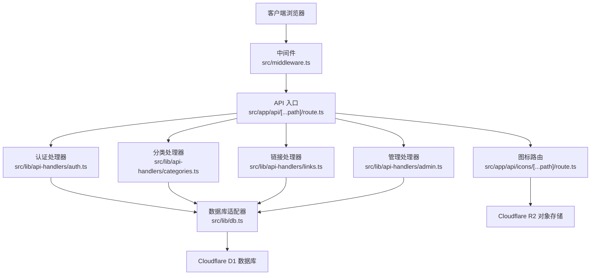
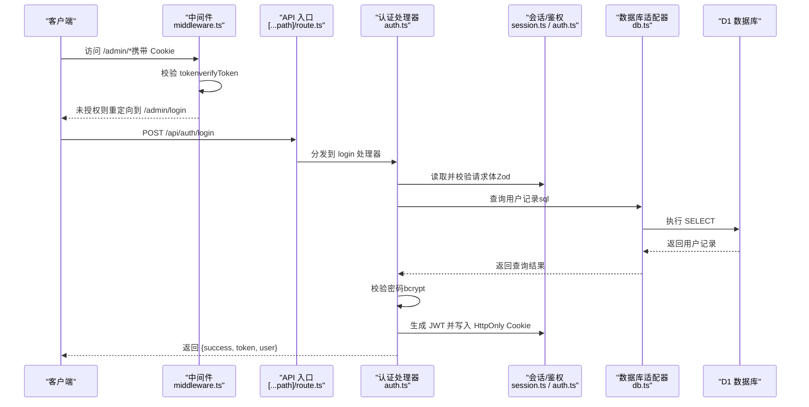
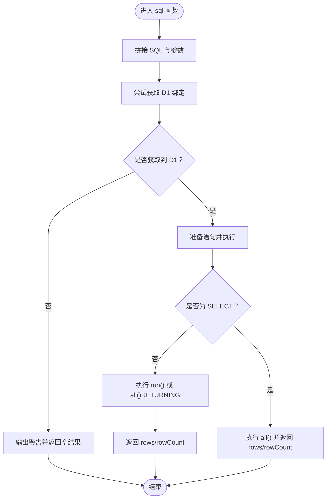
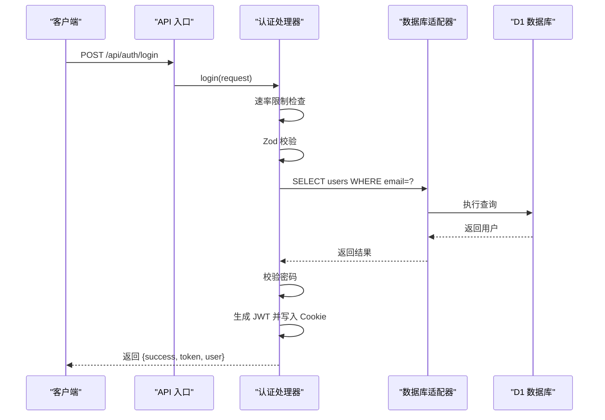
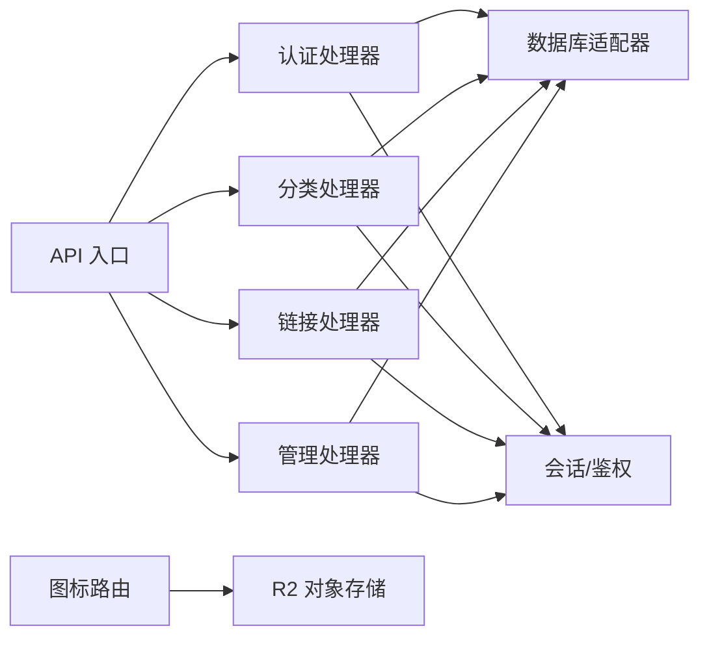

# 数据流设计

<cite>
**本文档引用的文件**
- [src/middleware.ts](file://src/middleware.ts)
- [src/lib/db.ts](file://src/lib/db.ts)
- [src/app/api/[...path]/route.ts](file://src/app/api/[...path]/route.ts)
- [src/app/api/icons/[...path]/route.ts](file://src/app/api/icons/[...path]/route.ts)
- [src/lib/auth.ts](file://src/lib/auth.ts)
- [src/lib/session.ts](file://src/lib/session.ts)
- [src/lib/api-handlers/auth.ts](file://src/lib/api-handlers/auth.ts)
- [src/lib/api-handlers/categories.ts](file://src/lib/api-handlers/categories.ts)
- [src/lib/api-handlers/links.ts](file://src/lib/api-handlers/links.ts)
- [src/lib/api-handlers/admin.ts](file://src/lib/api-handlers/admin.ts)
- [src/lib/r2.ts](file://src/lib/r2.ts)
- [src/types/index.ts](file://src/types/index.ts)
</cite>

## 目录
1. [引言](#引言)
2. [项目结构](#项目结构)
3. [核心组件](#核心组件)
4. [架构总览](#架构总览)
5. [详细组件分析](#详细组件分析)
6. [依赖关系分析](#依赖关系分析)
7. [性能考虑](#性能考虑)
8. [故障排查指南](#故障排查指南)
9. [结论](#结论)

## 引言
本文件面向数据流与后端架构设计，系统性阐述从用户请求到数据库操作的完整数据流：请求进入 → 中间件验证 → API 路由分发 → 业务逻辑处理 → 数据库操作 → 响应返回。同时解析 API Handler 的设计模式、数据库适配器的抽象层、数据缓存策略、错误处理机制与事务管理现状，并补充数据验证、安全过滤与性能监控的实现细节。

## 项目结构
该项目采用 Next.js App Router 与 Cloudflare Pages 部署，核心数据流路径如下：
- 请求入口：App Router 的动态路由 API 入口统一处理所有 /api 请求
- 中间件：对受保护的 /admin 路径进行鉴权拦截
- 业务分发：API 入口根据路径匹配调用对应 Handler
- 数据访问：通过统一的 D1 适配器执行 SQL
- 响应返回：标准化 JSON 响应

图表来源
- [src/middleware.ts](file://src/middleware.ts#L1-L43)
- [src/app/api/[...path]/route.ts](file://src/app/api/[...path]/route.ts#L1-L147)
- [src/app/api/icons/[...path]/route.ts](file://src/app/api/icons/[...path]/route.ts#L1-L37)
- [src/lib/db.ts](file://src/lib/db.ts#L1-L69)
- [src/lib/api-handlers/auth.ts](file://src/lib/api-handlers/auth.ts#L1-L141)
- [src/lib/api-handlers/categories.ts](file://src/lib/api-handlers/categories.ts#L1-L199)
- [src/lib/api-handlers/links.ts](file://src/lib/api-handlers/links.ts#L1-L270)
- [src/lib/api-handlers/admin.ts](file://src/lib/api-handlers/admin.ts#L1-L159)

章节来源
- [src/middleware.ts](file://src/middleware.ts#L1-L43)
- [src/app/api/[...path]/route.ts](file://src/app/api/[...path]/route.ts#L1-L147)
- [src/lib/db.ts](file://src/lib/db.ts#L1-L69)

## 核心组件
- 中间件（鉴权与重定向）
  - 识别公共路径与受保护路径，校验 Cookie 中的 JWT，未授权时重定向至登录页；已登录访问登录页则重定向至后台首页。
- API 入口（统一路由分发）
  - 解析动态路径，按路径前缀分发到不同处理器（认证、分类、链接、导入导出、元数据、管理等）。
- 数据库适配器（D1 抽象层）
  - 在 Edge Runtime 下优先使用 Cloudflare 提供的 D1 绑定；支持 SELECT/INSERT/UPDATE/DELETE/RETURNING 等语义；异常统一上抛。
- 业务处理器（Handler 设计模式）
  - 每个资源（认证、分类、链接、管理）拥有独立模块，职责清晰，集中处理输入校验、权限控制、数据库操作与响应格式化。
- 图标路由（R2 对象直传）
  - 直接从 R2 读取图标对象并透传给客户端，利用 ETag 与 HTTP 元数据提升缓存命中率。
- 会话与鉴权
  - 使用 JWT 存储于 HttpOnly Cookie，服务端仅通过解码校验；提供获取会话的工具函数。

章节来源
- [src/middleware.ts](file://src/middleware.ts#L1-L43)
- [src/app/api/[...path]/route.ts](file://src/app/api/[...path]/route.ts#L1-L147)
- [src/lib/db.ts](file://src/lib/db.ts#L1-L69)
- [src/lib/api-handlers/auth.ts](file://src/lib/api-handlers/auth.ts#L1-L141)
- [src/lib/api-handlers/categories.ts](file://src/lib/api-handlers/categories.ts#L1-L199)
- [src/lib/api-handlers/links.ts](file://src/lib/api-handlers/links.ts#L1-L270)
- [src/lib/api-handlers/admin.ts](file://src/lib/api-handlers/admin.ts#L1-L159)
- [src/app/api/icons/[...path]/route.ts](file://src/app/api/icons/[...path]/route.ts#L1-L37)
- [src/lib/session.ts](file://src/lib/session.ts#L1-L14)
- [src/lib/auth.ts](file://src/lib/auth.ts#L1-L23)

## 架构总览
下图展示一次典型“管理员登录”的端到端数据流：

图表来源
- [src/middleware.ts](file://src/middleware.ts#L1-L43)
- [src/app/api/[...path]/route.ts](file://src/app/api/[...path]/route.ts#L1-L147)
- [src/lib/api-handlers/auth.ts](file://src/lib/api-handlers/auth.ts#L1-L141)
- [src/lib/session.ts](file://src/lib/session.ts#L1-L14)
- [src/lib/auth.ts](file://src/lib/auth.ts#L1-L23)
- [src/lib/db.ts](file://src/lib/db.ts#L1-L69)

## 详细组件分析

### 中间件与会话
- 中间件负责：
  - 定义公共路径（如 /admin/login），受保护路径（/admin/*）需鉴权
  - 从 Cookie 读取 token，调用 verifyToken 校验
  - 未授权访问受保护路径重定向至登录页；已登录访问登录页重定向至后台首页
- 会话工具：
  - getSession 从 Cookie 读取 token 并解码，异常时返回空，便于后续权限判断

章节来源
- [src/middleware.ts](file://src/middleware.ts#L1-L43)
- [src/lib/session.ts](file://src/lib/session.ts#L1-L14)
- [src/lib/auth.ts](file://src/lib/auth.ts#L1-L23)

### API 入口与路由分发
- 统一入口：
  - 支持 GET/POST/PUT/DELETE，解析动态路径数组，拼接为 fullPath
  - 根据路径前缀分发到对应处理器模块（认证、分类、链接、导入导出、元数据、管理）
- 错误处理：
  - 未匹配路径返回 404 JSON

章节来源
- [src/app/api/[...path]/route.ts](file://src/app/api/[...path]/route.ts#L1-L147)

### 数据库适配器（D1 抽象层）
- 设计要点：
  - 使用模板字符串 + bind 参数化构建 SQL，自动区分 SELECT/非 SELECT
  - 自动处理 RETURNING 场景，统一返回 rows 与 rowCount
  - 在 Edge Runtime 下优先从 getRequestContext 获取 D1 绑定；回退场景输出警告
- 复杂度与性能：
  - 单条语句执行复杂度 O(1)，批量更新通过 Promise.all 并行提交（见链接排序）
- 错误处理：
  - 捕获并上抛数据库异常，避免静默失败

图表来源
- [src/lib/db.ts](file://src/lib/db.ts#L1-L69)

章节来源
- [src/lib/db.ts](file://src/lib/db.ts#L1-L69)

### 认证处理器（登录/登出）
- 登录流程：
  - 速率限制（基于 IP 的滑动窗口）
  - Zod 校验请求体（邮箱、密码长度）
  - 查询用户并校验密码
  - 生成 JWT，设置 HttpOnly Cookie，返回 token 与用户信息
- 登出流程：
  - 删除 token Cookie

图表来源
- [src/lib/api-handlers/auth.ts](file://src/lib/api-handlers/auth.ts#L1-L141)
- [src/lib/db.ts](file://src/lib/db.ts#L1-L69)

章节来源
- [src/lib/api-handlers/auth.ts](file://src/lib/api-handlers/auth.ts#L1-L141)

### 分类处理器（增删改查）
- 列表：
  - 通过 getSession 获取当前用户，支持匿名与登录态两种视图
- 创建：
  - 权限校验（仅管理员）
  - 去重：先查同名，避免唯一约束冲突
  - 插入并返回新记录
- 更新：
  - 权限校验 + 参数校验 + RETURNING
- 删除：
  - 权限校验 + 约束检查（无子分类、无链接）
  - 支持幂等：不存在也视为成功

章节来源
- [src/lib/api-handlers/categories.ts](file://src/lib/api-handlers/categories.ts#L1-L199)

### 链接处理器（增删改查、排序）
- 列表：
  - 支持分类筛选、模糊搜索、分页
  - 同步计算总数并返回分页信息
- 创建：
  - 权限校验（仅管理员）
  - URL 规范化去重（去除尾随斜杠）
  - 插入并返回新记录
- 更新/删除：
  - 权限校验 + 幂等处理（记录不存在时返回成功）
- 排序：
  - 并行批量更新 sort_order，减少往返

章节来源
- [src/lib/api-handlers/links.ts](file://src/lib/api-handlers/links.ts#L1-L270)

### 管理处理器（安全变更、统计、设置）
- 安全变更：
  - 当前密码校验通过后更新邮箱或密码，强制重新登录
- 统计：
  - 并行查询链接数、分类数、推荐数与最近链接
- 设置：
  - 读取/保存 R2 配置（密钥部分掩码返回）

章节来源
- [src/lib/api-handlers/admin.ts](file://src/lib/api-handlers/admin.ts#L1-L159)

### 图标路由（R2 对象直传）
- 功能：
  - 从 R2 读取图标对象，透传 HTTP 元数据与 ETag
- 性能：
  - 利用 R2 的边缘缓存与 ETag，降低带宽与延迟

章节来源
- [src/app/api/icons/[...path]/route.ts](file://src/app/api/icons/[...path]/route.ts#L1-L37)

### R2 上传（签名直传）
- 功能：
  - 在 Edge Runtime 下实现 AWS Signature V4 的最小实现，支持上传到 R2
- 适用场景：
  - 与前端直传配合，减少服务器中转压力

章节来源
- [src/lib/r2.ts](file://src/lib/r2.ts#L1-L103)

### 数据模型与响应格式
- 数据模型：
  - 用户、分类、链接、通用响应、登录响应、导入结果
- 响应格式：
  - 统一 { success, data?, error?, message? } 结构，便于前端一致处理

章节来源
- [src/types/index.ts](file://src/types/index.ts#L1-L53)

## 依赖关系分析
- 组件耦合：
  - API 入口仅依赖处理器模块，处理器模块依赖数据库适配器与会话/鉴权工具
  - 中间件与会话/鉴权相互独立，通过 Cookie 传递状态
- 外部依赖：
  - Cloudflare D1（Edge Runtime）、R2（对象存储）、Workers Types
- 可能的循环依赖：
  - 未发现直接循环；各模块职责单一，通过函数调用解耦

图表来源
- [src/app/api/[...path]/route.ts](file://src/app/api/[...path]/route.ts#L1-L147)
- [src/lib/api-handlers/auth.ts](file://src/lib/api-handlers/auth.ts#L1-L141)
- [src/lib/api-handlers/categories.ts](file://src/lib/api-handlers/categories.ts#L1-L199)
- [src/lib/api-handlers/links.ts](file://src/lib/api-handlers/links.ts#L1-L270)
- [src/lib/api-handlers/admin.ts](file://src/lib/api-handlers/admin.ts#L1-L159)
- [src/lib/db.ts](file://src/lib/db.ts#L1-L69)
- [src/lib/session.ts](file://src/lib/session.ts#L1-L14)
- [src/lib/auth.ts](file://src/lib/auth.ts#L1-L23)
- [src/app/api/icons/[...path]/route.ts](file://src/app/api/icons/[...path]/route.ts#L1-L37)

## 性能考虑
- 并行查询与更新
  - 管理统计使用 Promise.all 并行查询多指标
  - 链接排序使用 Promise.all 并行更新 sort_order
- 缓存策略
  - Next.js revalidatePath 用于增量刷新静态生成内容
  - R2 对象直传利用 ETag 与 HTTP 元数据提升缓存命中
- 边缘运行时
  - Edge Runtime 下直接访问 D1/R2，减少网络开销
- 速率限制
  - 认证登录采用基于 IP 的滑动窗口限流，防止暴力破解

章节来源
- [src/lib/api-handlers/admin.ts](file://src/lib/api-handlers/admin.ts#L109-L114)
- [src/lib/api-handlers/links.ts](file://src/lib/api-handlers/links.ts#L254-L258)
- [src/lib/api-handlers/auth.ts](file://src/lib/api-handlers/auth.ts#L14-L41)
- [src/app/api/icons/[...path]/route.ts](file://src/app/api/icons/[...path]/route.ts#L25-L31)

## 故障排查指南
- 认证相关
  - 429 Too Many Requests：检查速率限制配置与客户端重试策略
  - 401 Unauthorized：确认 Cookie 是否正确下发与未过期
  - 500 Server Misconfiguration（生产环境缺少 JWT_SECRET）：检查环境变量
- 数据库相关
  - D1 绑定缺失：确保在 Cloudflare Pages 环境中启用 D1 绑定
  - 唯一约束冲突：分类/链接创建时出现重复，系统会自动去重并返回现有记录
- R2 相关
  - R2 绑定缺失：确认 R2 Bucket 已绑定
  - 上传失败：检查签名参数与 Endpoint 正确性
- 日志与可观测性
  - 处理器内均包含错误日志打印，便于定位问题

章节来源
- [src/lib/api-handlers/auth.ts](file://src/lib/api-handlers/auth.ts#L68-L73)
- [src/lib/db.ts](file://src/lib/db.ts#L64-L67)
- [src/app/api/icons/[...path]/route.ts](file://src/app/api/icons/[...path]/route.ts#L15-L17)
- [src/lib/r2.ts](file://src/lib/r2.ts#L96-L99)

## 结论
本项目以“统一入口 + 模块化处理器 + 抽象数据库适配器”为核心，实现了清晰的数据流与可维护的架构。中间件保障了受保护路径的安全访问；API 入口承担路由分发职责；处理器聚焦业务规则与数据校验；数据库适配器屏蔽底层差异；R2 与 Edge Runtime 提升了性能与可扩展性。建议持续完善：
- 事务管理：当前未使用显式事务，涉及多表一致性更新时可引入事务封装
- 缓存层：在高频读取场景引入 Redis/Memory 缓存
- 监控埋点：在关键路径增加性能指标与错误追踪
- 安全加固：对敏感接口增加更细粒度的速率限制与 WAF