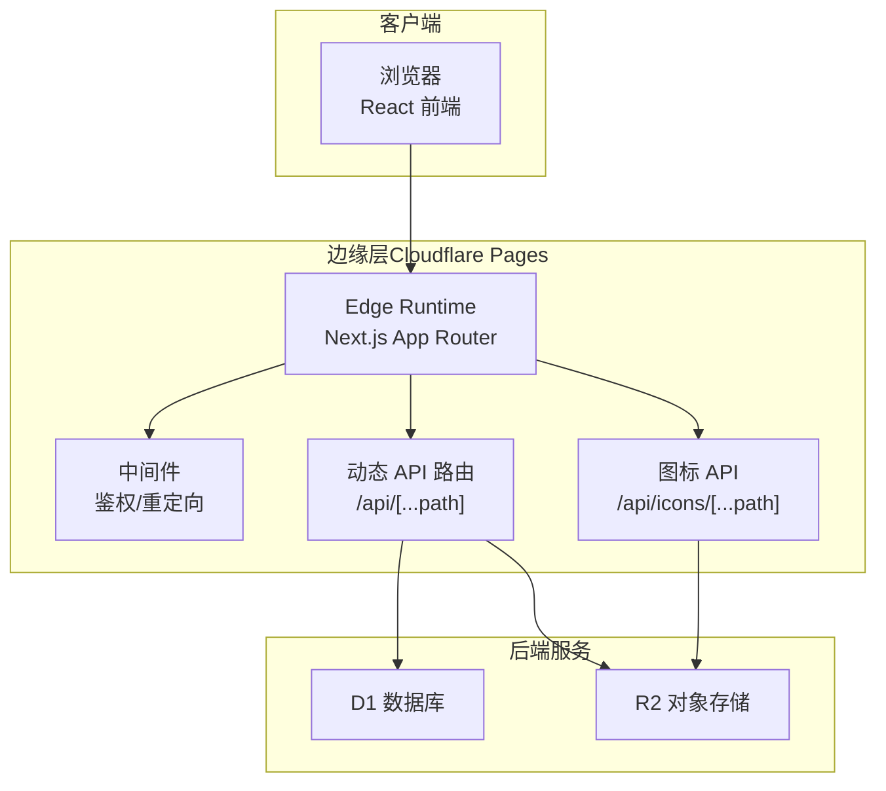
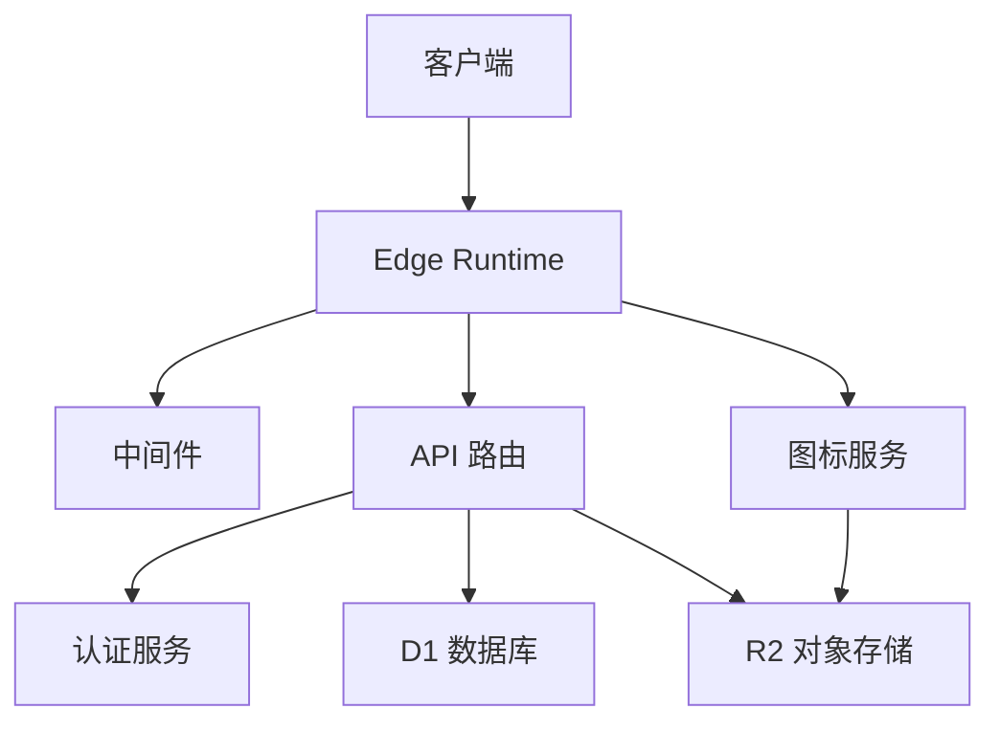
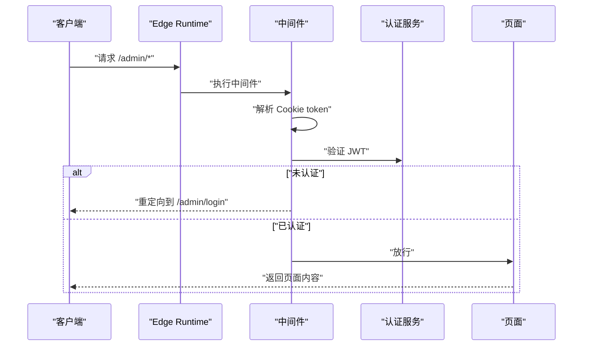
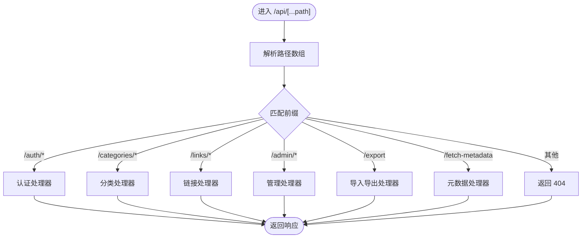
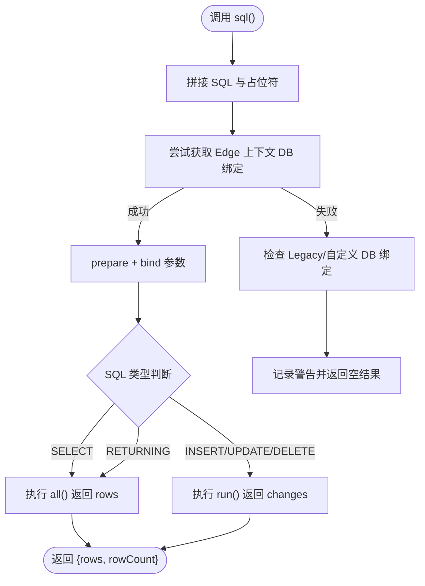
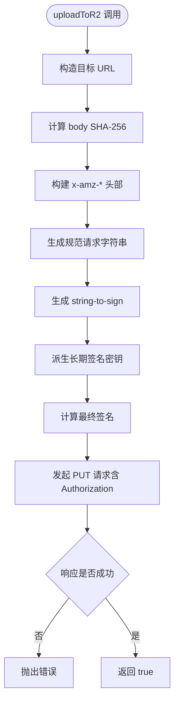
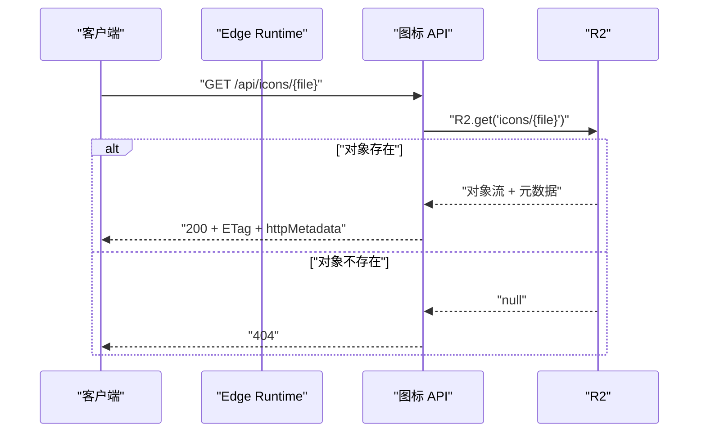
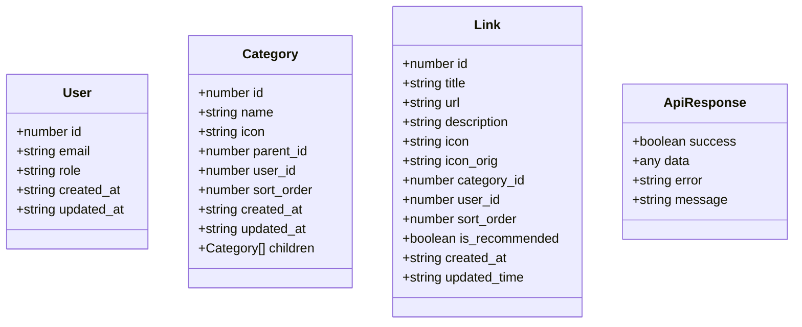
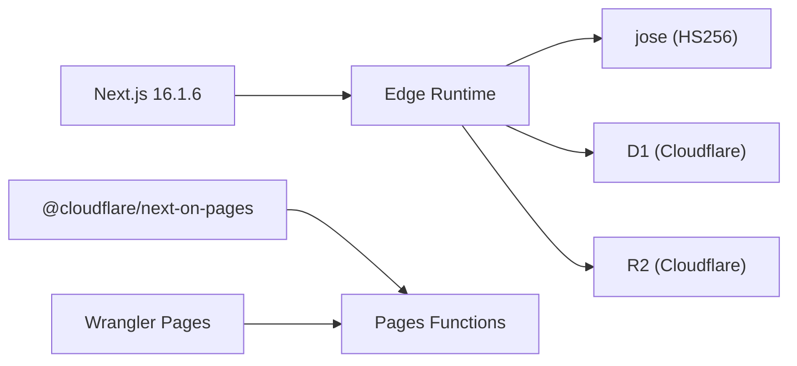

# 架构设计

<cite>
**本文引用的文件**
- [package.json](file://package.json)
- [next.config.ts](file://next.config.ts)
- [wrangler.toml](file://wrangler.toml)
- [src/middleware.ts](file://src/middleware.ts)
- [src/lib/db.ts](file://src/lib/db.ts)
- [src/lib/r2.ts](file://src/lib/r2.ts)
- [src/lib/auth.ts](file://src/lib/auth.ts)
- [src/lib/session.ts](file://src/lib/session.ts)
- [src/app/api/[...path]/route.ts](file://src/app/api/[...path]/route.ts)
- [src/app/api/icons/[...path]/route.ts](file://src/app/api/icons/[...path]/route.ts)
- [src/app/layout.tsx](file://src/app/layout.tsx)
- [src/types/index.ts](file://src/types/index.ts)
- [tsconfig.json](file://tsconfig.json)
</cite>

## 目录
1. [引言](#引言)
2. [项目结构](#项目结构)
3. [核心组件](#核心组件)
4. [架构总览](#架构总览)
5. [详细组件分析](#详细组件分析)
6. [依赖关系分析](#依赖关系分析)
7. [性能考量](#性能考量)
8. [故障排查指南](#故障排查指南)
9. [结论](#结论)
10. [附录](#附录)

## 引言
本架构设计文档面向“导航站”系统，目标是提供清晰的高层设计、架构模式与系统边界说明；阐述组件交互、数据流与集成方式；解释技术决策、权衡与约束；给出基础设施要求、可扩展性考虑与部署拓扑；覆盖安全、监控与灾难恢复等横切关注点；并记录技术栈、第三方依赖与版本兼容性。

## 项目结构
该系统采用 Next.js App Router 应用，结合 Cloudflare Pages Functions（Edge Runtime）与 Workers 运行时进行部署。前端为现代 React 应用，后端 API 通过 App Router 的动态路由统一接入，认证与会话管理基于 JWT Cookie；数据持久化通过 Cloudflare D1（SQLite 兼容），静态资源通过 Cloudflare R2 存储；构建与部署由 Wrangler Pages 驱动。

图表来源
- [src/app/api/[...path]/route.ts](file://src/app/api/[...path]/route.ts#L1-L147)
- [src/app/api/icons/[...path]/route.ts](file://src/app/api/icons/[...path]/route.ts#L1-L37)
- [src/middleware.ts](file://src/middleware.ts#L1-L43)
- [src/lib/db.ts](file://src/lib/db.ts#L1-L69)
- [src/lib/r2.ts](file://src/lib/r2.ts#L1-L103)

章节来源
- [src/app/layout.tsx](file://src/app/layout.tsx#L1-L40)
- [next.config.ts](file://next.config.ts#L1-L41)
- [wrangler.toml](file://wrangler.toml#L1-L14)

## 核心组件
- 前端渲染与主题：根布局负责注入 Provider 与全局样式，字体与元数据配置集中于根布局。
- 边缘路由与中间件：App Router 动态路由统一处理 API 请求；中间件在 Edge Runtime 下执行，负责管理员路径的鉴权与重定向。
- 认证与会话：基于 HS256 的 JWT 签发与校验，Cookie 存储 token；会话读取封装在服务端函数中。
- 数据访问：统一的 sql 适配器在 Edge Runtime 中通过 D1 绑定执行查询；支持 SELECT/非 SELECT 分支与 RETURNING 场景。
- 对象存储：R2 上传实现采用 AWS SignatureV4 极简签名流程，支持自定义 endpoint 与桶名。
- 类型模型：用户、分类、链接与通用响应体等类型定义，确保前后端契约一致。

章节来源
- [src/app/layout.tsx](file://src/app/layout.tsx#L1-L40)
- [src/middleware.ts](file://src/middleware.ts#L1-L43)
- [src/lib/auth.ts](file://src/lib/auth.ts#L1-L23)
- [src/lib/session.ts](file://src/lib/session.ts#L1-L14)
- [src/lib/db.ts](file://src/lib/db.ts#L1-L69)
- [src/lib/r2.ts](file://src/lib/r2.ts#L1-L103)
- [src/types/index.ts](file://src/types/index.ts#L1-L53)

## 架构总览
系统采用“前端静态化 + 边缘计算 + 无服务器数据库/对象存储”的云原生架构。Edge Runtime 提供低延迟请求处理与鉴权；D1 提供轻量级关系型数据能力；R2 提供高吞吐对象存储；Wrangler Pages 负责构建与部署。

图表来源
- [src/app/api/[...path]/route.ts](file://src/app/api/[...path]/route.ts#L1-L147)
- [src/app/api/icons/[...path]/route.ts](file://src/app/api/icons/[...path]/route.ts#L1-L37)
- [src/middleware.ts](file://src/middleware.ts#L1-L43)
- [src/lib/db.ts](file://src/lib/db.ts#L1-L69)
- [src/lib/r2.ts](file://src/lib/r2.ts#L1-L103)

## 详细组件分析

### 中间件与认证流程
中间件在 Edge Runtime 执行，对 /admin 路径进行鉴权控制，并在未登录或已登录状态下进行重定向。认证使用 HS256 的 JWT，密钥来自环境变量；会话读取封装在服务端函数中，便于在组件树内消费。

图表来源
- [src/middleware.ts](file://src/middleware.ts#L1-L43)
- [src/lib/auth.ts](file://src/lib/auth.ts#L1-L23)
- [src/lib/session.ts](file://src/lib/session.ts#L1-L14)

章节来源
- [src/middleware.ts](file://src/middleware.ts#L1-L43)
- [src/lib/auth.ts](file://src/lib/auth.ts#L1-L23)
- [src/lib/session.ts](file://src/lib/session.ts#L1-L14)

### API 路由与处理器分发
统一的动态路由根据路径前缀分发至不同处理器（认证、分类、链接、导入导出、元数据、设置与统计等）。该设计将业务域解耦到独立模块，便于维护与扩展。

图表来源
- [src/app/api/[...path]/route.ts](file://src/app/api/[...path]/route.ts#L1-L147)

章节来源
- [src/app/api/[...path]/route.ts](file://src/app/api/[...path]/route.ts#L1-L147)

### 数据访问适配器（D1）
sql 适配器在 Edge Runtime 中优先通过 getRequestContext 获取 D1 绑定；若不可用则记录警告并返回空结果。支持 SELECT/非 SELECT 分支与 RETURNING 场景，保证基本 CRUD 语义。

图表来源
- [src/lib/db.ts](file://src/lib/db.ts#L1-L69)

章节来源
- [src/lib/db.ts](file://src/lib/db.ts#L1-L69)

### 对象存储上传（R2）
R2 上传实现遵循 AWS SignatureV4 流程，手动计算哈希、规范请求、派生签名头并发起 PUT 请求。支持自定义 endpoint、桶名与内容类型。

图表来源
- [src/lib/r2.ts](file://src/lib/r2.ts#L1-L103)

章节来源
- [src/lib/r2.ts](file://src/lib/r2.ts#L1-L103)

### 图标服务（R2 对象直取）
图标服务直接从 R2 读取对象，写入 HTTP 元数据与 ETag，返回流式响应。若对象不存在返回 404；R2 绑定缺失返回 500。

图表来源
- [src/app/api/icons/[...path]/route.ts](file://src/app/api/icons/[...path]/route.ts#L1-L37)
- [src/lib/r2.ts](file://src/lib/r2.ts#L1-L103)

章节来源
- [src/app/api/icons/[...path]/route.ts](file://src/app/api/icons/[...path]/route.ts#L1-L37)

### 类型与契约
系统通过 TypeScript 接口定义用户、分类、链接与通用响应体，确保前后端一致性与可维护性。

图表来源
- [src/types/index.ts](file://src/types/index.ts#L1-L53)

章节来源
- [src/types/index.ts](file://src/types/index.ts#L1-L53)

## 依赖关系分析
- 框架与运行时：Next.js 16.1.6（App Router）、Edge Runtime、Pages Functions。
- 安全：jose 用于 HS256 JWT；中间件在 Edge Runtime 执行，降低 SSR 风险面。
- UI 与工具：react、react-dom、lucide-react、date-fns、clsx、tailwind-merge 等。
- 构建与部署：@cloudflare/next-on-pages、Wrangler Pages；Webpack 别名屏蔽 Node.js 专有模块。
- 数据与存储：better-sqlite3 在本地开发场景使用，生产通过 D1；R2 作为对象存储。

图表来源
- [package.json](file://package.json#L1-L50)
- [next.config.ts](file://next.config.ts#L1-L41)
- [wrangler.toml](file://wrangler.toml#L1-L14)

章节来源
- [package.json](file://package.json#L1-L50)
- [next.config.ts](file://next.config.ts#L1-L41)
- [wrangler.toml](file://wrangler.toml#L1-L14)

## 性能考量
- 边缘执行：中间件与 API 在 Edge Runtime 执行，降低延迟与冷启动影响。
- 包体积优化：启用 React Compiler、按需导入与 Webpack 别名屏蔽 Node 专有模块，减少打包体积。
- 图片优化：关闭 Next 图片优化以减少 sharp 依赖体积。
- 查询路径：sql 适配器区分 SELECT/非 SELECT，避免不必要的结果集读取。
- 对象直取：图标服务直接透传 R2 流，减少中间层开销。

章节来源
- [next.config.ts](file://next.config.ts#L1-L41)
- [src/lib/db.ts](file://src/lib/db.ts#L1-L69)
- [src/app/api/icons/[...path]/route.ts](file://src/app/api/icons/[...path]/route.ts#L1-L37)

## 故障排查指南
- D1 绑定缺失：当未在 Edge Runtime 获取到 DB 绑定时，会记录警告并返回空结果。请确认部署环境已正确绑定 D1。
- R2 绑定缺失：图标 API 在缺少 R2 绑定时返回 500；请检查 Wrangler 配置与桶名。
- JWT 校验失败：verifyToken 在异常情况下返回空负载，中间件将拒绝访问并重定向到登录页。
- API 404：统一路由仅处理已注册的路径前缀，未匹配将返回 404。
- 构建问题：Webpack 别名屏蔽 better-sqlite3/sharp/cheerio，确保这些模块不会被打包进 Edge 运行时。

章节来源
- [src/lib/db.ts](file://src/lib/db.ts#L1-L69)
- [src/app/api/icons/[...path]/route.ts](file://src/app/api/icons/[...path]/route.ts#L1-L37)
- [src/lib/auth.ts](file://src/lib/auth.ts#L1-L23)
- [src/app/api/[...path]/route.ts](file://src/app/api/[...path]/route.ts#L1-L147)
- [next.config.ts](file://next.config.ts#L1-L41)

## 结论
本系统以 Edge Runtime 为核心，结合 D1 与 R2 构建了低延迟、可扩展且易于部署的导航站平台。通过中间件与 JWT 实现细粒度的访问控制；通过统一 API 路由与类型契约提升可维护性；通过构建配置与运行时优化保障性能。建议在生产环境中完善监控与日志采集，并评估跨区域复制与备份策略以增强可用性。

## 附录

### 技术栈与版本兼容性
- 前端框架：Next.js 16.1.6（App Router）
- 运行时：Edge Runtime
- 认证：jose（HS256）
- 数据库：Cloudflare D1（SQLite 兼容）
- 对象存储：Cloudflare R2
- 构建与部署：@cloudflare/next-on-pages、Wrangler Pages
- UI 与工具：react、react-dom、lucide-react、date-fns、clsx、tailwind-merge 等

章节来源
- [package.json](file://package.json#L1-L50)
- [next.config.ts](file://next.config.ts#L1-L41)
- [wrangler.toml](file://wrangler.toml#L1-L14)
- [tsconfig.json](file://tsconfig.json#L1-L35)

### 部署拓扑与基础设施
- 应用层：Next.js App Router（Edge Runtime）
- 数据层：D1（关系型数据）
- 存储层：R2（图标与静态资源）
- 部署：Wrangler Pages 构建并发布至 Cloudflare Pages Functions

章节来源
- [wrangler.toml](file://wrangler.toml#L1-L14)
- [next.config.ts](file://next.config.ts#L1-L41)

### 横切关注点
- 安全：Edge Runtime 执行中间件与认证；JWT 密钥来自环境变量；严格限制 Node.js 专有模块进入 Edge 打包。
- 监控：建议在 API 层增加统一错误上报与指标埋点；对 D1/R2 操作增加超时与重试策略。
- 灾难恢复：评估 D1 与 R2 的备份策略；图标缓存与 ETag 利于回源与降级。

章节来源
- [src/middleware.ts](file://src/middleware.ts#L1-L43)
- [src/lib/auth.ts](file://src/lib/auth.ts#L1-L23)
- [next.config.ts](file://next.config.ts#L1-L41)