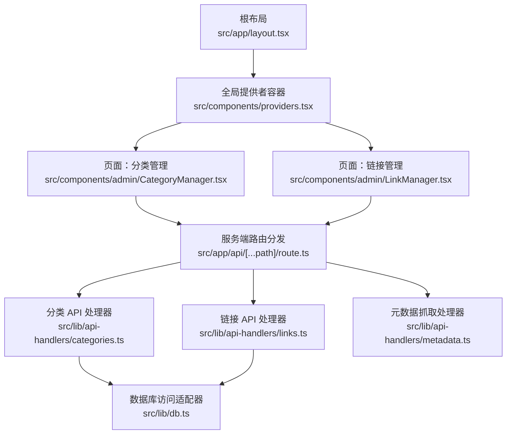
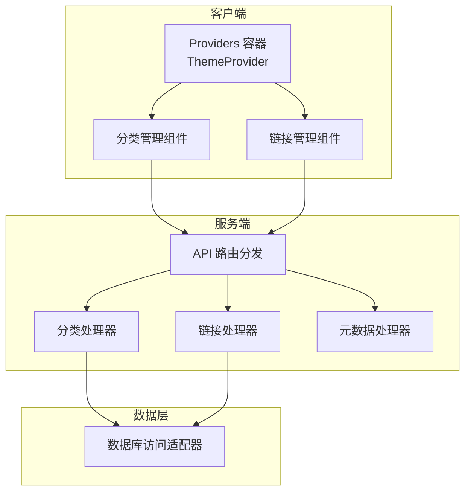
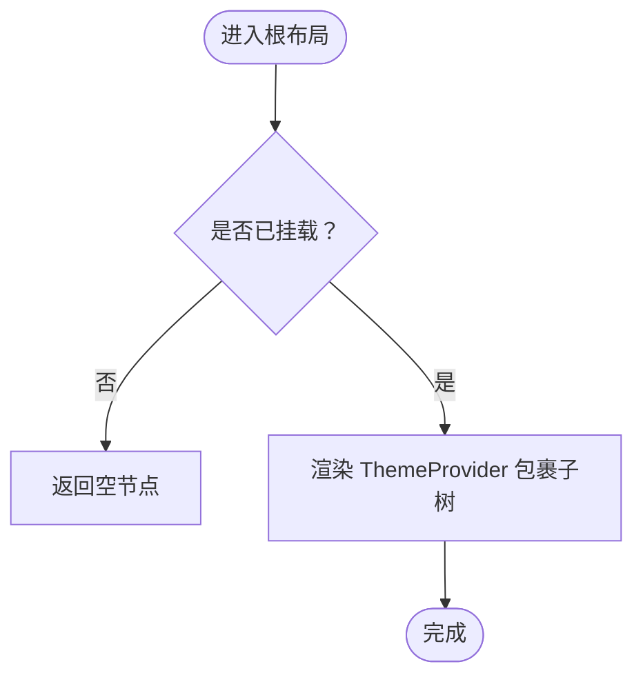
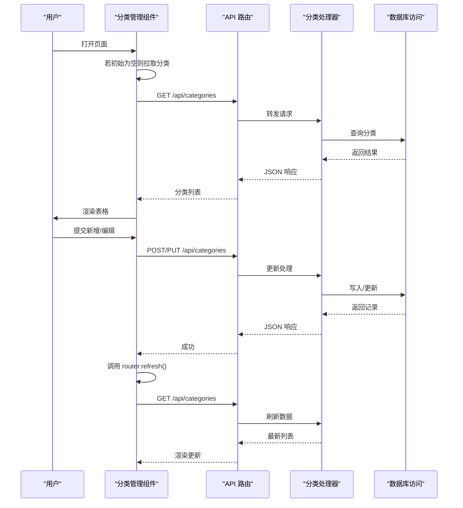
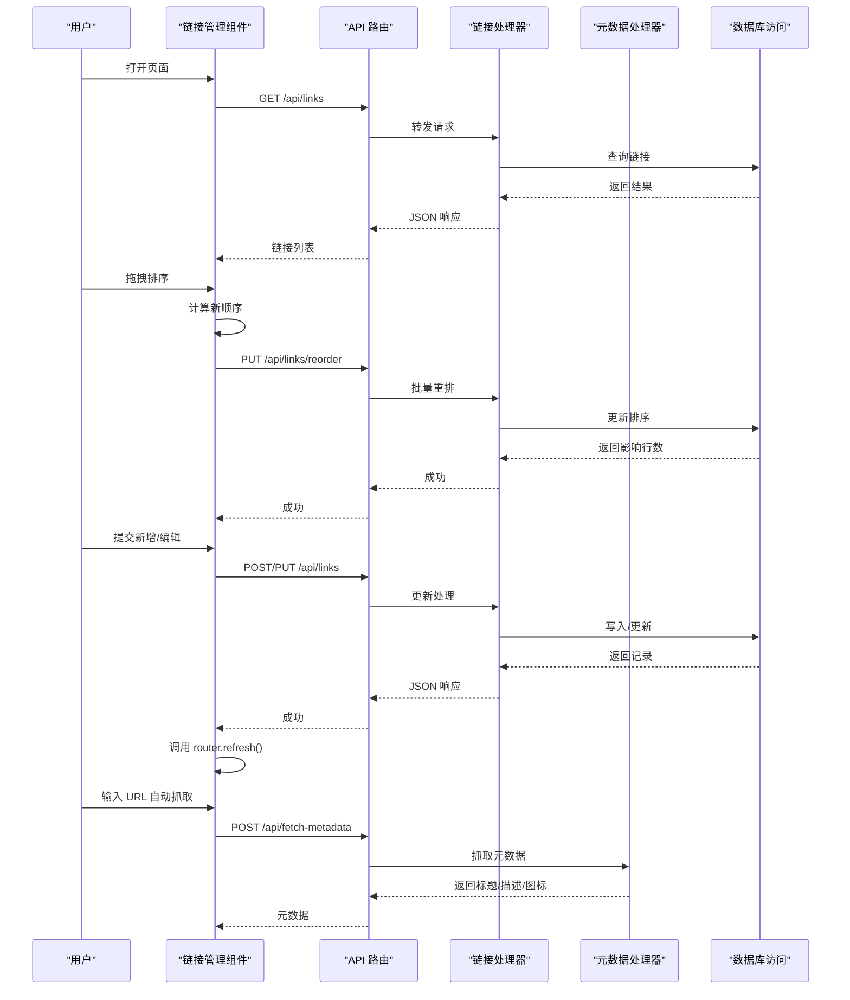
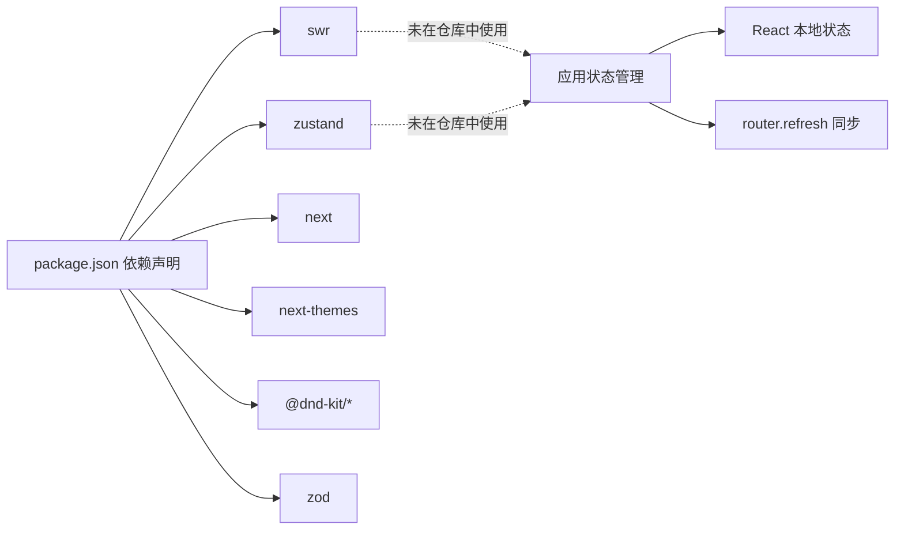

# 状态管理

<cite>
**本文引用的文件**
- [src/app/layout.tsx](file://src/app/layout.tsx)
- [src/components/providers.tsx](file://src/components/providers.tsx)
- [src/app/api/[...path]/route.ts](file://src/app/api/[...path]/route.ts)
- [src/lib/api-handlers/categories.ts](file://src/lib/api-handlers/categories.ts)
- [src/lib/api-handlers/links.ts](file://src/lib/api-handlers/links.ts)
- [src/components/admin/CategoryManager.tsx](file://src/components/admin/CategoryManager.tsx)
- [src/components/admin/LinkManager.tsx](file://src/components/admin/LinkManager.tsx)
- [src/lib/db.ts](file://src/lib/db.ts)
- [src/lib/api-handlers/metadata.ts](file://src/lib/api-handlers/metadata.ts)
- [package.json](file://package.json)
</cite>

## 目录
1. [简介](#简介)
2. [项目结构](#项目结构)
3. [核心组件](#核心组件)
4. [架构总览](#架构总览)
5. [详细组件分析](#详细组件分析)
6. [依赖关系分析](#依赖关系分析)
7. [性能考量](#性能考量)
8. [故障排查指南](#故障排查指南)
9. [结论](#结论)

## 简介
本文件系统性梳理导航应用的状态管理架构与数据流设计，重点覆盖以下方面：
- 全局状态提供者：ThemeProvider 的作用与实现要点
- 客户端状态与服务器状态的边界划分
- 数据获取与缓存策略：当前代码未直接使用 SWR，但具备集成条件
- 状态同步机制与数据一致性保障
- 性能优化策略与最佳实践

需要特别说明的是：仓库中并未发现显式的 SWR Provider 或 Zustand 状态管理的全局提供者与集中式 store 定义；现有实现主要通过 React 本地状态与 Next.js 路由刷新（router.refresh）实现状态同步。本文将基于现有代码进行严谨分析，并给出可落地的改进建议。

## 项目结构
应用采用 Next.js App Router 结构，根布局负责注入全局状态提供者，页面级组件通过本地状态与服务端 API 协作完成数据读写与展示。

图表来源
- [src/app/layout.tsx](file://src/app/layout.tsx#L25-L39)
- [src/components/providers.tsx](file://src/components/providers.tsx#L6-L23)
- [src/app/api/[...path]/route.ts](file://src/app/api/[...path]/route.ts#L12-L47)
- [src/lib/api-handlers/categories.ts](file://src/lib/api-handlers/categories.ts#L17-L33)
- [src/lib/api-handlers/links.ts](file://src/lib/api-handlers/links.ts#L25-L67)
- [src/lib/api-handlers/metadata.ts](file://src/lib/api-handlers/metadata.ts#L5-L20)
- [src/lib/db.ts](file://src/lib/db.ts#L12-L68)

章节来源
- [src/app/layout.tsx](file://src/app/layout.tsx#L25-L39)
- [src/components/providers.tsx](file://src/components/providers.tsx#L6-L23)

## 核心组件
- 全局提供者容器：在根布局中包裹子树，注入主题切换能力，避免水合不一致问题。
- 页面级组件：分类管理与链接管理分别维护本地状态，通过服务端 API 完成增删改查与排序。
- 服务端路由：统一承接前端请求，按路径分发至对应处理器。
- 数据层：数据库访问适配器对 D1/SQLite 进行抽象，屏蔽运行环境差异。

章节来源
- [src/components/providers.tsx](file://src/components/providers.tsx#L6-L23)
- [src/components/admin/CategoryManager.tsx](file://src/components/admin/CategoryManager.tsx#L15-L45)
- [src/components/admin/LinkManager.tsx](file://src/components/admin/LinkManager.tsx#L58-L90)
- [src/app/api/[...path]/route.ts](file://src/app/api/[...path]/route.ts#L12-L47)
- [src/lib/db.ts](file://src/lib/db.ts#L12-L68)

## 架构总览
整体采用“客户端本地状态 + 服务端 API + 数据库”的分层架构。页面组件负责 UI 交互与本地状态，服务端路由负责鉴权与业务编排，数据层负责持久化。

图表来源
- [src/components/providers.tsx](file://src/components/providers.tsx#L6-L23)
- [src/components/admin/CategoryManager.tsx](file://src/components/admin/CategoryManager.tsx#L15-L45)
- [src/components/admin/LinkManager.tsx](file://src/components/admin/LinkManager.tsx#L58-L90)
- [src/app/api/[...path]/route.ts](file://src/app/api/[...path]/route.ts#L12-L47)
- [src/lib/api-handlers/categories.ts](file://src/lib/api-handlers/categories.ts#L17-L33)
- [src/lib/api-handlers/links.ts](file://src/lib/api-handlers/links.ts#L25-L67)
- [src/lib/db.ts](file://src/lib/db.ts#L12-L68)

## 详细组件分析

### Providers 组件与 ThemeProvider
- 作用：在根布局注入主题提供者，避免首屏与客户端水合期间的主题闪烁与不一致。
- 实现要点：通过 mounted 标志控制渲染时机，仅在客户端挂载后渲染 ThemeProvider，确保 SSR 与 CSR 的主题一致。

图表来源
- [src/app/layout.tsx](file://src/app/layout.tsx#L31-L38)
- [src/components/providers.tsx](file://src/components/providers.tsx#L6-L23)

章节来源
- [src/app/layout.tsx](file://src/app/layout.tsx#L31-L38)
- [src/components/providers.tsx](file://src/components/providers.tsx#L6-L23)

### 分类管理组件（CategoryManager）
- 本地状态：维护分类列表与当前编辑项。
- 数据加载：若初始数据为空，则发起一次 API 请求拉取分类列表。
- 同步策略：提交成功后调用 router.refresh，触发服务端重新拉取数据，避免手动更新导致的竞态与重复。
- 去重与一致性：监听外部传入的初始数据变化，去重并信任最新数据源，减少本地状态与服务端状态的偏差。

图表来源
- [src/components/admin/CategoryManager.tsx](file://src/components/admin/CategoryManager.tsx#L15-L45)
- [src/components/admin/CategoryManager.tsx](file://src/components/admin/CategoryManager.tsx#L64-L131)
- [src/app/api/[...path]/route.ts](file://src/app/api/[...path]/route.ts#L21-L29)
- [src/lib/api-handlers/categories.ts](file://src/lib/api-handlers/categories.ts#L17-L33)
- [src/lib/db.ts](file://src/lib/db.ts#L12-L68)

章节来源
- [src/components/admin/CategoryManager.tsx](file://src/components/admin/CategoryManager.tsx#L15-L45)
- [src/components/admin/CategoryManager.tsx](file://src/components/admin/CategoryManager.tsx#L64-L131)
- [src/lib/api-handlers/categories.ts](file://src/lib/api-handlers/categories.ts#L17-L33)

### 链接管理组件（LinkManager）
- 本地状态：维护链接列表、分类列表、当前编辑项与过滤状态。
- 数据加载：若初始数据为空，则发起 API 请求拉取链接与分类列表。
- 排序与拖拽：使用 DnD Kit 实现本地拖拽排序，计算新的 sort_order 并调用后端批量重排接口。
- 同步策略：提交成功后调用 router.refresh，确保 UI 与服务端状态一致。
- 元数据抓取：支持根据 URL 自动抓取标题、描述与图标，并可上传至 R2。

图表来源
- [src/components/admin/LinkManager.tsx](file://src/components/admin/LinkManager.tsx#L58-L90)
- [src/components/admin/LinkManager.tsx](file://src/components/admin/LinkManager.tsx#L296-L343)
- [src/components/admin/LinkManager.tsx](file://src/components/admin/LinkManager.tsx#L200-L276)
- [src/components/admin/LinkManager.tsx](file://src/components/admin/LinkManager.tsx#L149-L191)
- [src/app/api/[...path]/route.ts](file://src/app/api/[...path]/route.ts#L26-L29)
- [src/app/api/[...path]/route.ts](file://src/app/api/[...path]/route.ts#L102-L105)
- [src/app/api/[...path]/route.ts](file://src/app/api/[...path]/route.ts#L90-L93)
- [src/lib/api-handlers/links.ts](file://src/lib/api-handlers/links.ts#L25-L67)
- [src/lib/api-handlers/links.ts](file://src/lib/api-handlers/links.ts#L237-L268)
- [src/lib/api-handlers/metadata.ts](file://src/lib/api-handlers/metadata.ts#L5-L20)
- [src/lib/db.ts](file://src/lib/db.ts#L12-L68)

章节来源
- [src/components/admin/LinkManager.tsx](file://src/components/admin/LinkManager.tsx#L58-L90)
- [src/components/admin/LinkManager.tsx](file://src/components/admin/LinkManager.tsx#L296-L343)
- [src/components/admin/LinkManager.tsx](file://src/components/admin/LinkManager.tsx#L200-L276)
- [src/components/admin/LinkManager.tsx](file://src/components/admin/LinkManager.tsx#L149-L191)
- [src/lib/api-handlers/links.ts](file://src/lib/api-handlers/links.ts#L237-L268)
- [src/lib/api-handlers/metadata.ts](file://src/lib/api-handlers/metadata.ts#L5-L20)

### 服务端路由与处理器
- 路由分发：根据路径匹配分类、链接、导入导出、设置、统计、元数据抓取等接口。
- 分类处理器：提供列表、创建、更新、删除能力，并在变更后触发 revalidatePath 以清理缓存。
- 链接处理器：提供列表、创建、更新、删除、批量重排能力，支持分页与搜索。
- 元数据处理器：校验权限后抓取网页元数据，提取标题、描述与图标，必要时上传至 R2 并返回可访问 URL。

章节来源
- [src/app/api/[...path]/route.ts](file://src/app/api/[...path]/route.ts#L12-L47)
- [src/app/api/[...path]/route.ts](file://src/app/api/[...path]/route.ts#L49-L96)
- [src/app/api/[...path]/route.ts](file://src/app/api/[...path]/route.ts#L98-L124)
- [src/app/api/[...path]/route.ts](file://src/app/api/[...path]/route.ts#L126-L146)
- [src/lib/api-handlers/categories.ts](file://src/lib/api-handlers/categories.ts#L17-L33)
- [src/lib/api-handlers/links.ts](file://src/lib/api-handlers/links.ts#L25-L67)
- [src/lib/api-handlers/metadata.ts](file://src/lib/api-handlers/metadata.ts#L5-L20)

### 数据库访问适配器
- 功能：在 Edge Runtime 下优先使用 D1 绑定，否则降级处理；对 SELECT 与非 SELECT 做不同分支处理，支持 RETURNING 语法。
- 注意：当前实现未包含本地回退（如 SQLite 文件），在缺少 D1 绑定时会输出警告。

章节来源
- [src/lib/db.ts](file://src/lib/db.ts#L12-L68)

## 依赖关系分析
- 依赖声明：项目引入了 swr 与 zustand，但当前仓库未发现 SWR Provider 或 Zustand store 的全局注册与使用。
- 影响：这意味着当前状态管理主要依赖 React 本地状态与 Next.js 路由刷新，而非集中式状态库。

图表来源
- [package.json](file://package.json#L12-L31)

章节来源
- [package.json](file://package.json#L12-L31)

## 性能考量
- 本地状态与服务端同步
  - 使用 router.refresh 触发服务端重新拉取数据，避免手动更新导致的竞态与重复渲染。
  - 对于高频更新场景，建议在组件内增加防抖与幂等检查，减少不必要的网络请求。
- 拖拽排序
  - 本地计算新顺序后立即更新 UI，随后批量调用后端重排接口，降低视觉闪烁。
  - 建议在排序过程中禁用其他交互，或在失败时回滚本地状态并提示用户。
- 元数据抓取
  - 自动抓取仅在 URL 变更且未填写标题时触发，避免频繁请求。
  - 图标上传至 R2 后返回短链，减少后续传输成本。
- 缓存与失效
  - 分类/链接变更后调用 revalidatePath 清理相关缓存，确保数据一致性。
  - 当前未使用 SWR 缓存，建议在需要强一致性的列表页考虑引入 SWR 以提升性能与体验。

## 故障排查指南
- 主题闪烁
  - 症状：SSR 与 CSR 主题不一致，出现闪烁。
  - 排查：确认 Providers 是否包裹根布局，ThemeProvider 是否在客户端挂载后再渲染。
  - 参考：根布局与 Providers 的实现。
- 数据不一致
  - 症状：新增/编辑后 UI 未更新或出现重复。
  - 排查：确认是否调用 router.refresh；避免在提交成功后同时手动更新本地状态。
  - 参考：分类与链接管理组件的提交流程。
- 排序异常
  - 症状：拖拽后排序错乱或保存失败。
  - 排查：检查本地计算的新顺序与后端重排接口是否一致；失败时回滚本地状态并刷新。
  - 参考：链接管理组件的拖拽与重排逻辑。
- 元数据抓取失败
  - 症状：无法获取标题/描述/图标。
  - 排查：确认 URL 有效、网络可达、后端权限校验通过；检查 R2 上传是否成功。
  - 参考：元数据处理器与链接管理组件的抓取流程。
- 数据库连接问题
  - 症状：查询报错或返回空数据。
  - 排查：确认运行环境是否具备 D1 绑定；在缺少绑定时会输出警告。
  - 参考：数据库访问适配器。

章节来源
- [src/components/providers.tsx](file://src/components/providers.tsx#L6-L23)
- [src/components/admin/CategoryManager.tsx](file://src/components/admin/CategoryManager.tsx#L64-L131)
- [src/components/admin/LinkManager.tsx](file://src/components/admin/LinkManager.tsx#L296-L343)
- [src/lib/api-handlers/metadata.ts](file://src/lib/api-handlers/metadata.ts#L5-L20)
- [src/lib/db.ts](file://src/lib/db.ts#L12-L68)

## 结论
- 当前状态管理以“本地 React 状态 + 服务端 API + 路由刷新”为主，配合 ThemeProvider 解决了主题一致性问题。
- 分类与链接管理组件通过 router.refresh 与幂等处理实现了较为稳健的数据同步与一致性保障。
- 项目引入了 SWR 与 Zustand，但未在仓库中实际使用。若未来需要更强的缓存、并发控制与跨组件共享状态能力，可在现有基础上引入 SWR 或 Zustand，结合现有 API 与权限体系进行渐进式演进。