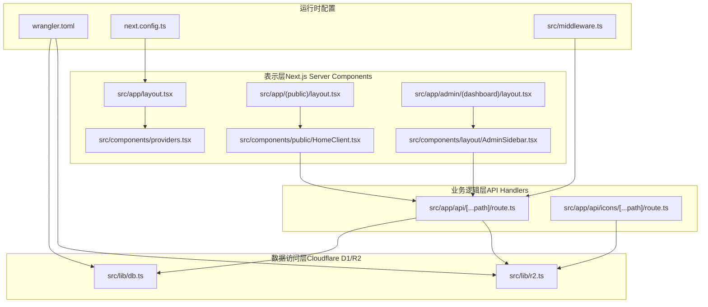
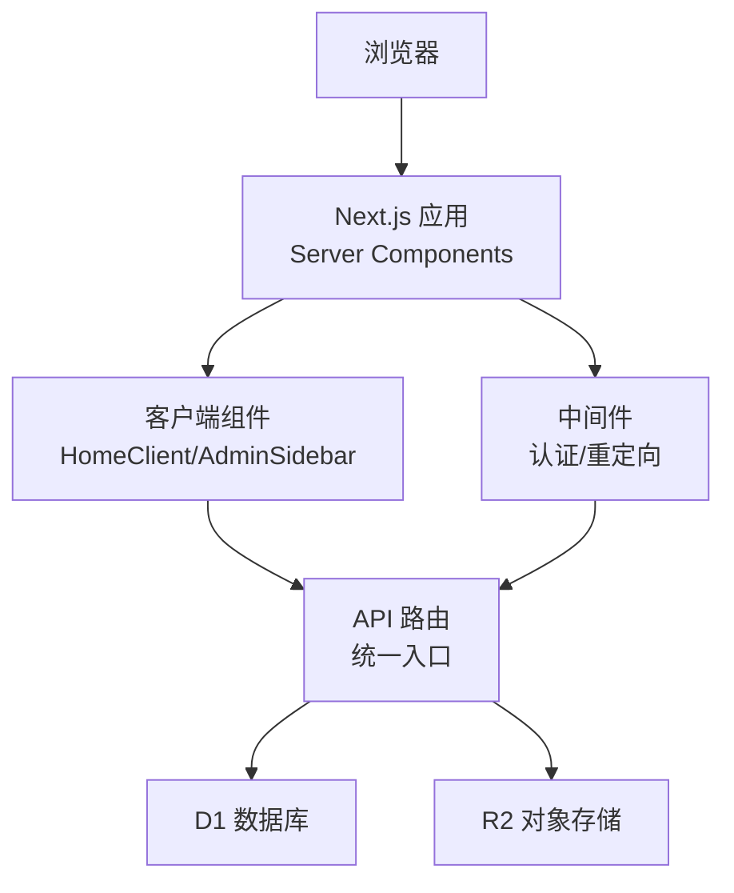
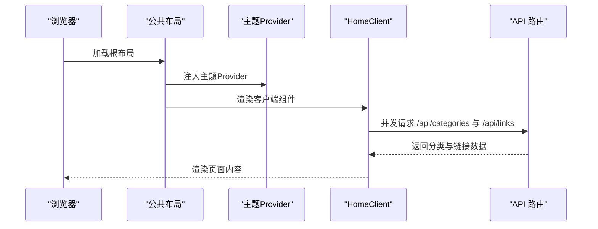
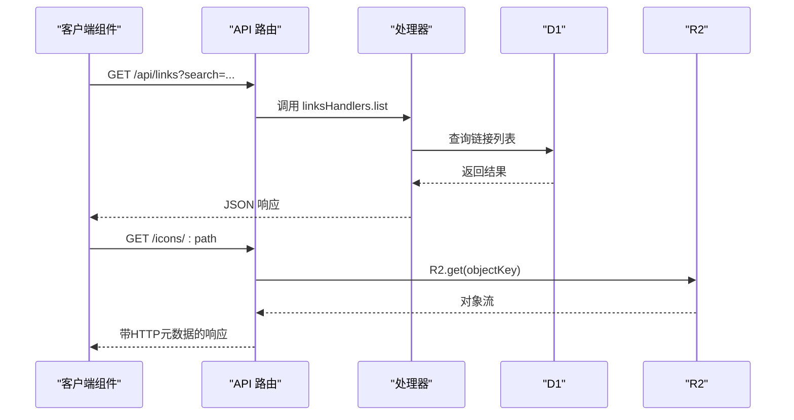
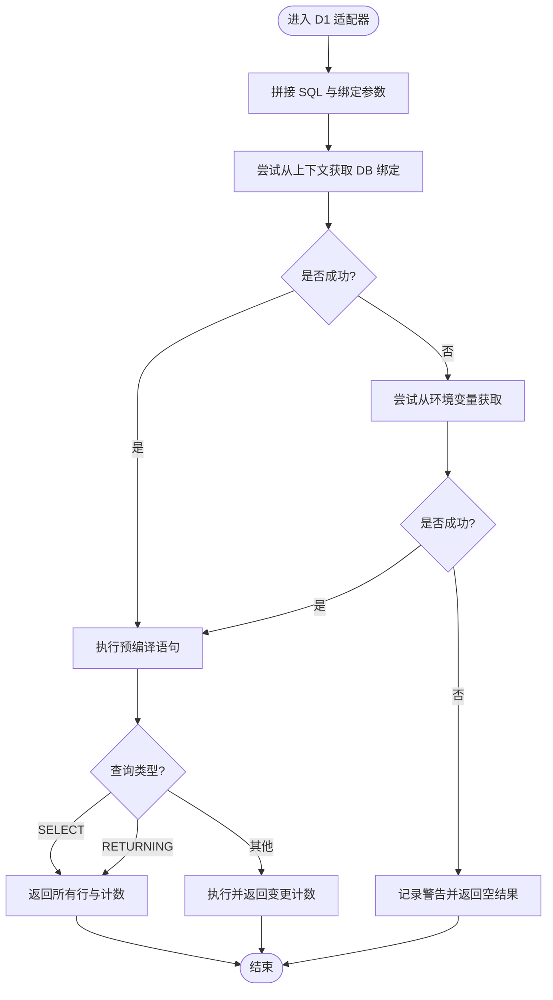
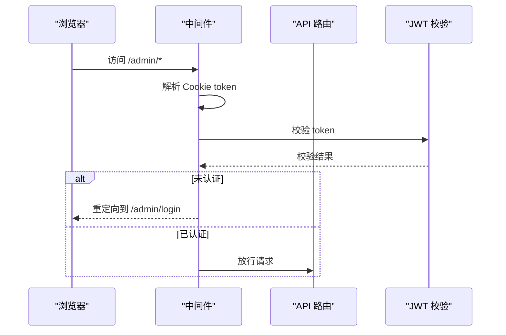
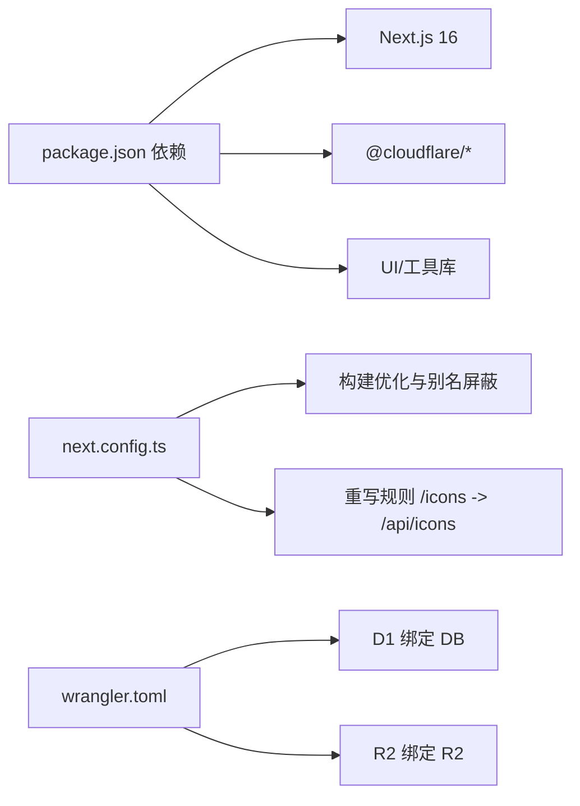
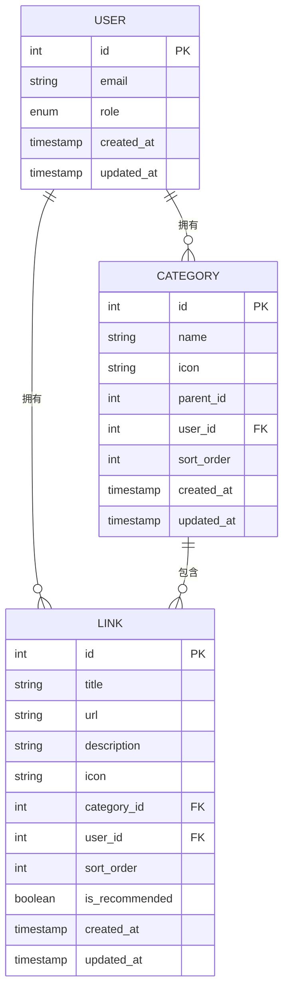

# 系统概览

<cite>
**本文引用的文件**
- [package.json](file://package.json)
- [next.config.ts](file://next.config.ts)
- [wrangler.toml](file://wrangler.toml)
- [src/lib/db.ts](file://src/lib/db.ts)
- [src/lib/r2.ts](file://src/lib/r2.ts)
- [src/middleware.ts](file://src/middleware.ts)
- [src/app/layout.tsx](file://src/app/layout.tsx)
- [src/app/(public)/layout.tsx](file://src/app/(public)/layout.tsx)
- [src/app/admin/(dashboard)/layout.tsx](file://src/app/admin/(dashboard)/layout.tsx)
- [src/components/providers.tsx](file://src/components/providers.tsx)
- [src/components/layout/AdminSidebar.tsx](file://src/components/layout/AdminSidebar.tsx)
- [src/components/public/HomeClient.tsx](file://src/components/public/HomeClient.tsx)
- [src/lib/auth.ts](file://src/lib/auth.ts)
- [src/types/index.ts](file://src/types/index.ts)
- [src/app/api/[...path]/route.ts](file://src/app/api/[...path]/route.ts)
- [src/app/api/icons/[...path]/route.ts](file://src/app/api/icons/[...path]/route.ts)
</cite>

## 目录
1. [引言](#引言)
2. [项目结构](#项目结构)
3. [核心组件](#核心组件)
4. [架构总览](#架构总览)
5. [详细组件分析](#详细组件分析)
6. [依赖分析](#依赖分析)
7. [性能考量](#性能考量)
8. [故障排查指南](#故障排查指南)
9. [结论](#结论)
10. [附录](#附录)

## 引言
本系统是一个基于 Next.js 16 App Router 的导航网站管理系统，采用前后端分离架构，结合 Cloudflare Workers 的边缘计算能力，实现高可用、低延迟与强扩展性的部署方案。系统通过 Server Components 负责页面渲染与静态资源组织，API Handlers 提供统一的后端接口，数据访问层通过 Cloudflare D1（边缘数据库）与 R2（对象存储）完成数据持久化与静态资源分发。

系统的设计理念强调：
- 分层清晰：表示层、业务逻辑层、数据访问层职责明确
- 模块化：路由与处理器按功能拆分，便于维护与扩展
- 边缘优先：利用 Cloudflare Workers 的就近计算与缓存能力
- 安全可控：中间件统一鉴权，JWT 令牌保障会话安全

## 项目结构
系统采用 Next.js 16 App Router 的目录约定，按功能域划分页面与 API 路由，同时通过中间件与全局 Provider 组织跨域逻辑与主题状态。

**图表来源**
- [src/app/layout.tsx](file://src/app/layout.tsx#L25-L39)
- [src/app/(public)/layout.tsx](file://src/app/(public)/layout.tsx#L3-L16)
- [src/app/admin/(dashboard)/layout.tsx](file://src/app/admin/(dashboard)/layout.tsx#L3-L14)
- [src/components/providers.tsx](file://src/components/providers.tsx#L6-L23)
- [src/components/public/HomeClient.tsx](file://src/components/public/HomeClient.tsx#L12-L45)
- [src/components/layout/AdminSidebar.tsx](file://src/components/layout/AdminSidebar.tsx#L12-L35)
- [src/app/api/[...path]/route.ts](file://src/app/api/[...path]/route.ts#L1-L147)
- [src/app/api/icons/[...path]/route.ts](file://src/app/api/icons/[...path]/route.ts#L6-L36)
- [src/lib/db.ts](file://src/lib/db.ts#L12-L68)
- [src/lib/r2.ts](file://src/lib/r2.ts#L23-L102)
- [src/middleware.ts](file://src/middleware.ts#L7-L34)
- [next.config.ts](file://next.config.ts#L31-L38)
- [wrangler.toml](file://wrangler.toml#L6-L13)

**章节来源**
- [src/app/layout.tsx](file://src/app/layout.tsx#L25-L39)
- [src/app/(public)/layout.tsx](file://src/app/(public)/layout.tsx#L3-L16)
- [src/app/admin/(dashboard)/layout.tsx](file://src/app/admin/(dashboard)/layout.tsx#L3-L14)
- [src/components/providers.tsx](file://src/components/providers.tsx#L6-L23)
- [src/components/public/HomeClient.tsx](file://src/components/public/HomeClient.tsx#L12-L45)
- [src/components/layout/AdminSidebar.tsx](file://src/components/layout/AdminSidebar.tsx#L12-L35)
- [src/app/api/[...path]/route.ts](file://src/app/api/[...path]/route.ts#L1-L147)
- [src/app/api/icons/[...path]/route.ts](file://src/app/api/icons/[...path]/route.ts#L6-L36)
- [src/lib/db.ts](file://src/lib/db.ts#L12-L68)
- [src/lib/r2.ts](file://src/lib/r2.ts#L23-L102)
- [src/middleware.ts](file://src/middleware.ts#L7-L34)
- [next.config.ts](file://next.config.ts#L31-L38)
- [wrangler.toml](file://wrangler.toml#L6-L13)

## 核心组件
- 表示层（Next.js Server Components）
  - 全局根布局负责主题 Provider 注入与元信息配置
  - 公共布局与管理后台布局分别承载前台展示与后台管理界面
  - 客户端组件负责交互逻辑与并发请求
- 业务逻辑层（API Handlers）
  - 统一的 API 路由入口，按路径分发到不同处理器（认证、分类、链接、导入导出、元数据等）
  - 图标资源通过独立 API 路由直接读取 R2 对象
- 数据访问层（Cloudflare D1/R2）
  - D1 适配器在 Edge Runtime 下自动解析 D1 绑定，支持 SELECT/非 SELECT 语句与 RETURNING 查询
  - R2 上传实现基于 AWS Signature v4 的纯 WebCrypto 实现，避免引入 SDK 依赖

**章节来源**
- [src/app/layout.tsx](file://src/app/layout.tsx#L15-L23)
- [src/app/(public)/layout.tsx](file://src/app/(public)/layout.tsx#L3-L16)
- [src/app/admin/(dashboard)/layout.tsx](file://src/app/admin/(dashboard)/layout.tsx#L3-L14)
- [src/components/public/HomeClient.tsx](file://src/components/public/HomeClient.tsx#L12-L45)
- [src/app/api/[...path]/route.ts](file://src/app/api/[...path]/route.ts#L1-L147)
- [src/app/api/icons/[...path]/route.ts](file://src/app/api/icons/[...path]/route.ts#L6-L36)
- [src/lib/db.ts](file://src/lib/db.ts#L12-L68)
- [src/lib/r2.ts](file://src/lib/r2.ts#L23-L102)

## 架构总览
系统采用“前端渲染 + 边缘 API + 边缘数据库/对象存储”的三层架构。前端通过 Next.js Server Components 渲染页面，客户端组件发起 API 请求；API 层在 Edge Runtime 执行，访问 D1 与 R2；中间件统一处理鉴权与重定向。

**图表来源**
- [src/middleware.ts](file://src/middleware.ts#L7-L34)
- [src/components/public/HomeClient.tsx](file://src/components/public/HomeClient.tsx#L20-L45)
- [src/components/layout/AdminSidebar.tsx](file://src/components/layout/AdminSidebar.tsx#L26-L30)
- [src/app/api/[...path]/route.ts](file://src/app/api/[...path]/route.ts#L12-L96)
- [src/lib/db.ts](file://src/lib/db.ts#L27-L62)
- [src/lib/r2.ts](file://src/lib/r2.ts#L23-L102)

## 详细组件分析

### 表示层（Next.js Server Components）
- 根布局负责注入主题 Provider，确保首屏与水合阶段的主题一致性
- 公共布局与管理后台布局分别定义容器与侧边栏，保证内容区与导航区的职责分离
- 客户端组件通过并发请求加载分类与链接数据，支持搜索参数驱动的动态渲染

**图表来源**
- [src/app/layout.tsx](file://src/app/layout.tsx#L25-L39)
- [src/components/providers.tsx](file://src/components/providers.tsx#L6-L23)
- [src/app/(public)/layout.tsx](file://src/app/(public)/layout.tsx#L3-L16)
- [src/components/public/HomeClient.tsx](file://src/components/public/HomeClient.tsx#L20-L45)
- [src/app/api/[...path]/route.ts](file://src/app/api/[...path]/route.ts#L22-L29)

**章节来源**
- [src/app/layout.tsx](file://src/app/layout.tsx#L25-L39)
- [src/app/(public)/layout.tsx](file://src/app/(public)/layout.tsx#L3-L16)
- [src/app/admin/(dashboard)/layout.tsx](file://src/app/admin/(dashboard)/layout.tsx#L3-L14)
- [src/components/providers.tsx](file://src/components/providers.tsx#L6-L23)
- [src/components/public/HomeClient.tsx](file://src/components/public/HomeClient.tsx#L12-L45)

### 业务逻辑层（API Handlers）
- 统一入口根据路径匹配调用对应处理器，涵盖认证、分类、链接、导入导出、元数据与后台管理
- 图标资源 API 直接从 R2 读取对象并返回响应头，实现零拷贝传输
- 中间件在 Edge Runtime 下执行，拦截受保护路径并进行鉴权与重定向

**图表来源**
- [src/app/api/[...path]/route.ts](file://src/app/api/[...path]/route.ts#L12-L96)
- [src/app/api/icons/[...path]/route.ts](file://src/app/api/icons/[...path]/route.ts#L6-L36)
- [src/lib/db.ts](file://src/lib/db.ts#L42-L62)
- [src/lib/r2.ts](file://src/lib/r2.ts#L87-L102)

**章节来源**
- [src/app/api/[...path]/route.ts](file://src/app/api/[...path]/route.ts#L1-L147)
- [src/app/api/icons/[...path]/route.ts](file://src/app/api/icons/[...path]/route.ts#L6-L36)
- [src/middleware.ts](file://src/middleware.ts#L7-L34)

### 数据访问层（Cloudflare D1/R2）
- D1 适配器在 Edge Runtime 下通过 getRequestContext 获取 DB 绑定，支持 SELECT 与非 SELECT 语句，自动处理 RETURNING 查询
- R2 上传实现遵循 AWS Signature v4，使用 WebCrypto 计算签名与哈希，避免额外依赖
- 配置文件中声明 D1 与 R2 绑定，确保运行时可用

**图表来源**
- [src/lib/db.ts](file://src/lib/db.ts#L12-L68)

**章节来源**
- [src/lib/db.ts](file://src/lib/db.ts#L12-L68)
- [src/lib/r2.ts](file://src/lib/r2.ts#L23-L102)
- [wrangler.toml](file://wrangler.toml#L6-L13)

### 安全与鉴权
- 中间件在 Edge Runtime 下运行，对受保护路径进行鉴权与重定向
- 登录/登出使用 JWT，服务端签发与校验密钥来自环境变量

**图表来源**
- [src/middleware.ts](file://src/middleware.ts#L7-L34)
- [src/lib/auth.ts](file://src/lib/auth.ts#L7-L22)

**章节来源**
- [src/middleware.ts](file://src/middleware.ts#L7-L34)
- [src/lib/auth.ts](file://src/lib/auth.ts#L7-L22)

## 依赖分析
- 技术栈与版本
  - Next.js 16.1.6、React 19、TypeScript、TailwindCSS 4
  - Cloudflare Workers Types、@cloudflare/next-on-pages、@cloudflare/workers-types
- 构建与打包
  - 启用 React Compiler、图片优化关闭、Webpack 别名屏蔽 Node 特有模块
  - 通过 next-on-pages 将 Next.js 构建产物转为 Pages Worker
- 运行时与绑定
  - D1 与 R2 在 wrangler.toml 中声明，运行时通过 env 绑定访问

**图表来源**
- [package.json](file://package.json#L12-L48)
- [next.config.ts](file://next.config.ts#L3-L39)
- [wrangler.toml](file://wrangler.toml#L1-L14)

**章节来源**
- [package.json](file://package.json#L12-L48)
- [next.config.ts](file://next.config.ts#L3-L39)
- [wrangler.toml](file://wrangler.toml#L1-L14)

## 性能考量
- 边缘计算
  - Edge Runtime 降低网络往返与中心化服务器压力，提升全球访问速度
- 构建优化
  - 关闭图片优化与 Source Maps，启用包导入优化与别名屏蔽，减少打包体积与运行时开销
- 数据访问
  - D1 使用预编译语句与按需查询类型分支，避免不必要的结果集扫描
  - R2 直接流式返回对象，减少中间层处理
- 前端体验
  - 客户端组件并发请求分类与链接，减少首屏等待时间

**章节来源**
- [next.config.ts](file://next.config.ts#L8-L30)
- [src/lib/db.ts](file://src/lib/db.ts#L42-L62)
- [src/app/api/icons/[...path]/route.ts](file://src/app/api/icons/[...path]/route.ts#L19-L31)
- [src/components/public/HomeClient.tsx](file://src/components/public/HomeClient.tsx#L20-L45)

## 故障排查指南
- D1 无法连接
  - 现象：控制台出现 D1 绑定未找到警告
  - 排查：确认运行环境为 Cloudflare Pages 并已正确配置 D1 绑定
  - 参考：D1 适配器上下文获取与环境变量回退逻辑
- R2 上传失败
  - 现象：R2 上传抛出错误
  - 排查：检查 endpoint、bucket、key、凭证是否正确；确认对象键命名规范
  - 参考：R2 上传实现中的签名与请求头构造
- 鉴权失败或循环重定向
  - 现象：访问 /admin/* 被重定向至登录页，或已登录被重定向至仪表盘
  - 排查：确认 Cookie 中 token 是否存在且未过期；检查中间件匹配路径与 public 路径配置
  - 参考：中间件重定向逻辑与 public 路径判断

**章节来源**
- [src/lib/db.ts](file://src/lib/db.ts#L27-L67)
- [src/lib/r2.ts](file://src/lib/r2.ts#L96-L102)
- [src/middleware.ts](file://src/middleware.ts#L24-L34)

## 结论
该导航网站管理系统以 Next.js 16 App Router 为核心，结合 Cloudflare Workers 的边缘能力，实现了高性能、可扩展的前后端分离架构。通过清晰的分层设计与模块化组织，系统在保证开发效率的同时，具备良好的可维护性与可扩展性。建议后续持续关注 Edge Runtime 的新特性与 Workers 生态演进，进一步优化数据访问与静态资源分发策略。

## 附录
- 数据模型（简化）
  - 用户：id、邮箱、角色、时间戳
  - 分类：id、名称、图标、父级、排序、时间戳
  - 链接：id、标题、URL、描述、图标、所属分类、排序、推荐标记、时间戳

**图表来源**
- [src/types/index.ts](file://src/types/index.ts#L1-L53)