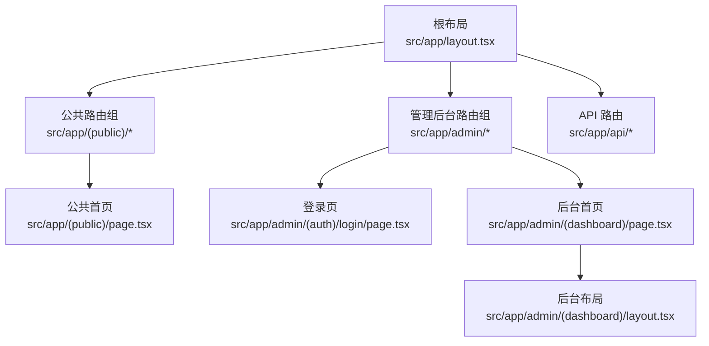
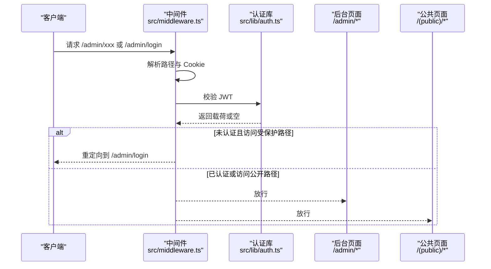
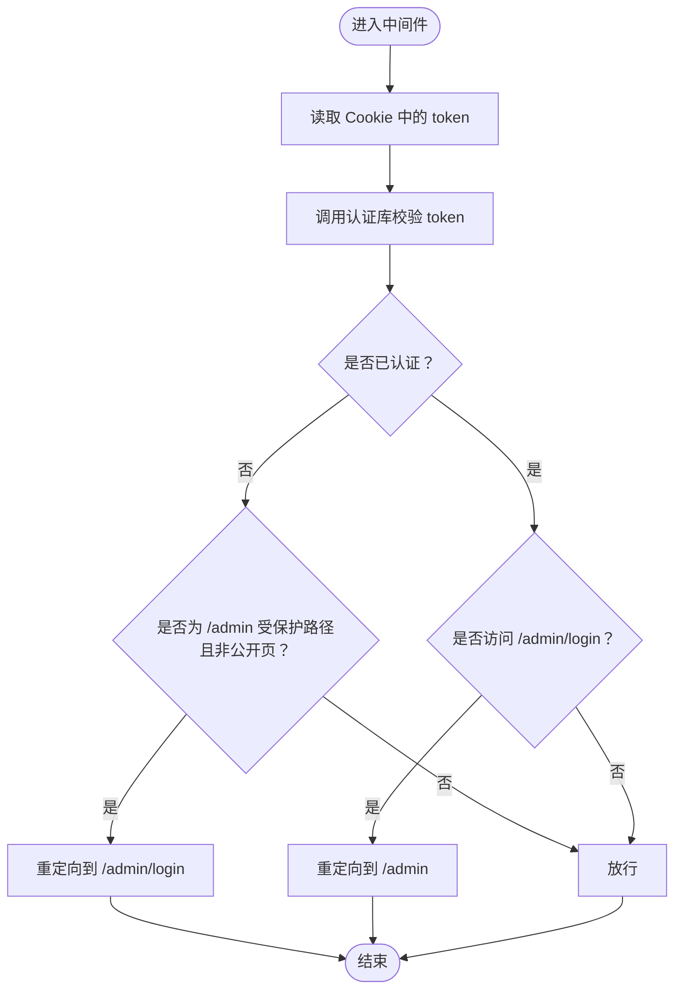
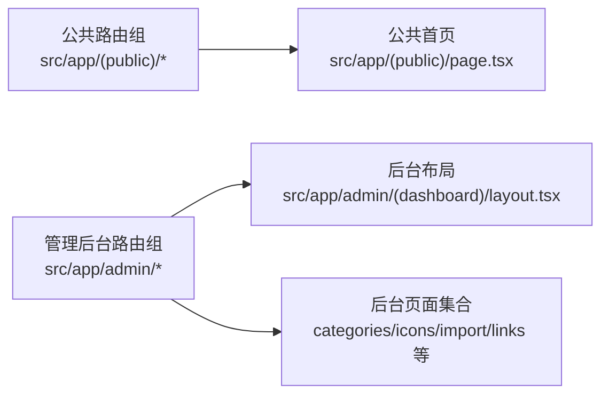
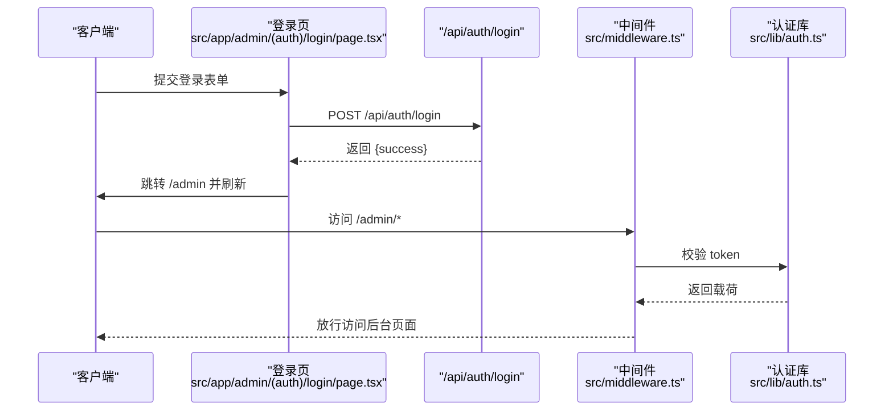
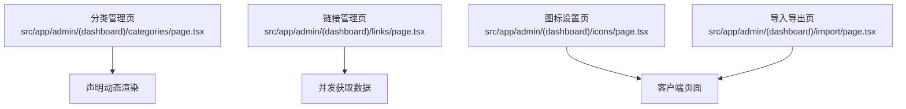
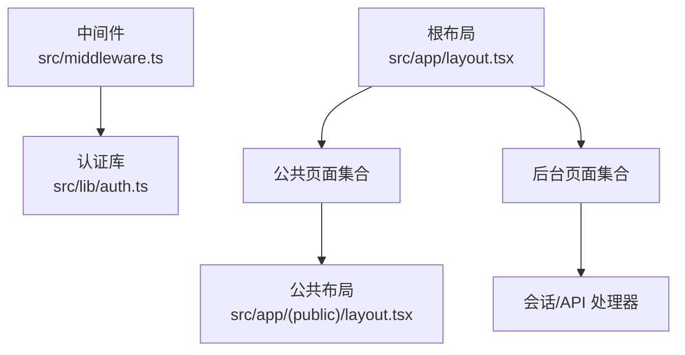

# 路由系统

<cite>
**本文引用的文件**
- [src/middleware.ts](file://src/middleware.ts)
- [src/app/layout.tsx](file://src/app/layout.tsx)
- [src/app/(public)/layout.tsx](file://src/app/(public)/layout.tsx)
- [src/app/(public)/page.tsx](file://src/app/(public)/page.tsx)
- [src/app/admin/(dashboard)/layout.tsx](file://src/app/admin/(dashboard)/layout.tsx)
- [src/app/admin/(auth)/login/page.tsx](file://src/app/admin/(auth)/login/page.tsx)
- [src/app/admin/(dashboard)/categories/page.tsx](file://src/app/admin/(dashboard)/categories/page.tsx)
- [src/app/admin/(dashboard)/icons/page.tsx](file://src/app/admin/(dashboard)/icons/page.tsx)
- [src/app/admin/(dashboard)/import/page.tsx](file://src/app/admin/(dashboard)/import/page.tsx)
- [src/app/admin/(dashboard)/links/page.tsx](file://src/app/admin/(dashboard)/links/page.tsx)
- [src/lib/auth.ts](file://src/lib/auth.ts)
- [next.config.ts](file://next.config.ts)
</cite>

## 目录
1. [引言](#引言)
2. [项目结构](#项目结构)
3. [核心组件](#核心组件)
4. [架构总览](#架构总览)
5. [详细组件分析](#详细组件分析)
6. [依赖关系分析](#依赖关系分析)
7. [性能考量](#性能考量)
8. [故障排查指南](#故障排查指南)
9. [结论](#结论)
10. [附录](#附录)

## 引言
本文件系统性梳理 Next.js 16 App Router 的路由组织与中间件配置，重点覆盖以下方面：
- 文件系统路由约定与布局层级
- 动态路由参数与通配符路由的使用
- 路由保护机制与认证流程
- 路由组设计意图：/(public) 与 /admin
- 中间件在认证与权限控制中的作用
- 预渲染、静态生成与服务器端渲染的策略选择
- 路由性能优化技巧与最佳实践

## 项目结构
该工程采用 App Router 的文件系统路由约定，通过目录分层组织页面与布局，结合路由组实现公共区域与管理后台的隔离。

- 根布局与全局元数据：根级 layout.tsx 提供站点顶层布局与字体、主题提供者等。
- 公共路由组：(public) 目录下的页面面向访客，不强制登录。
- 管理后台路由组：admin 目录下的页面受中间件保护，需登录后访问。
- API 路由：app/api 下的路由处理服务端接口，包括通配符路径与命名子路径。

图表来源
- [src/app/layout.tsx](file://src/app/layout.tsx#L25-L39)
- [src/app/(public)/layout.tsx](file://src/app/(public)/layout.tsx#L3-L16)
- [src/app/admin/(dashboard)/layout.tsx](file://src/app/admin/(dashboard)/layout.tsx#L3-L14)
- [src/app/(public)/page.tsx](file://src/app/(public)/page.tsx#L4-L12)
- [src/app/admin/(auth)/login/page.tsx](file://src/app/admin/(auth)/login/page.tsx#L9-L43)
- [src/app/admin/(dashboard)/layout.tsx](file://src/app/admin/(dashboard)/layout.tsx#L3-L14)

章节来源
- [src/app/layout.tsx](file://src/app/layout.tsx#L1-L40)
- [src/app/(public)/layout.tsx](file://src/app/(public)/layout.tsx#L1-L17)
- [src/app/admin/(dashboard)/layout.tsx](file://src/app/admin/(dashboard)/layout.tsx#L1-L15)

## 核心组件
- 中间件：负责认证拦截、重定向与匹配规则，确保 /admin 下受保护的路由仅对已认证用户开放。
- 认证工具：提供签发与校验 JWT 的能力，支撑登录态验证。
- 布局与页面：
  - 公共布局与首页：为访客提供基础内容展示。
  - 后台布局与多个功能页：包含分类、链接、图标设置与导入导出等管理功能。
- 配置：next.config.ts 提供图片优化、包导入优化、Webpack 别名与重写规则等，影响构建与运行时行为。

章节来源
- [src/middleware.ts](file://src/middleware.ts#L1-L43)
- [src/lib/auth.ts](file://src/lib/auth.ts#L1-L23)
- [next.config.ts](file://next.config.ts#L1-L41)

## 架构总览
下图展示了从请求进入、中间件拦截、认证校验到页面渲染的整体流程，以及公共与管理后台的路由分组关系。

图表来源
- [src/middleware.ts](file://src/middleware.ts#L7-L35)
- [src/lib/auth.ts](file://src/lib/auth.ts#L15-L22)

## 详细组件分析

### 中间件与路由保护
- 匹配范围：中间件仅对 /admin 路径生效，避免对公共路由产生不必要的拦截。
- 认证逻辑：
  - 读取 Cookie 中的 token。
  - 使用认证库进行校验，得到有效载荷则视为已认证。
- 重定向策略：
  - 访问受保护的 /admin 路径但未认证时，重定向至 /admin/login。
  - 已认证用户访问 /admin/login 时，重定向至 /admin。
- 运行时：中间件声明为实验性边缘运行时，提升冷启动与边缘部署的性能。

图表来源
- [src/middleware.ts](file://src/middleware.ts#L7-L35)
- [src/lib/auth.ts](file://src/lib/auth.ts#L15-L22)

章节来源
- [src/middleware.ts](file://src/middleware.ts#L1-L43)
- [src/lib/auth.ts](file://src/lib/auth.ts#L1-L23)

### 路由组设计：(public) 与 /admin
- (public) 路由组：
  - 设计意图：承载无需登录即可访问的公共页面，如首页。
  - 布局特点：提供最小化布局，便于快速加载与展示。
- /admin 路由组：
  - 设计意图：集中管理后台功能，统一受中间件保护。
  - 布局特点：引入侧边栏与主内容区，提供后台专用的交互体验。

图表来源
- [src/app/(public)/page.tsx](file://src/app/(public)/page.tsx#L4-L12)
- [src/app/(public)/layout.tsx](file://src/app/(public)/layout.tsx#L3-L16)
- [src/app/admin/(dashboard)/layout.tsx](file://src/app/admin/(dashboard)/layout.tsx#L3-L14)

章节来源
- [src/app/(public)/layout.tsx](file://src/app/(public)/layout.tsx#L1-L17)
- [src/app/admin/(dashboard)/layout.tsx](file://src/app/admin/(dashboard)/layout.tsx#L1-L15)

### 登录流程与认证状态
- 登录页：客户端表单提交至 /api/auth/login，成功后客户端跳转至 /admin 并刷新状态。
- 认证库：使用 HS256 签发与校验 JWT，默认有效期为 24 小时。
- 中间件：在请求到达前校验 token，确保后台访问的安全性。

图表来源
- [src/app/admin/(auth)/login/page.tsx](file://src/app/admin/(auth)/login/page.tsx#L16-L43)
- [src/middleware.ts](file://src/middleware.ts#L16-L21)
- [src/lib/auth.ts](file://src/lib/auth.ts#L7-L22)

章节来源
- [src/app/admin/(auth)/login/page.tsx](file://src/app/admin/(auth)/login/page.tsx#L1-L118)
- [src/lib/auth.ts](file://src/lib/auth.ts#L1-L23)
- [src/middleware.ts](file://src/middleware.ts#L1-L43)

### 页面与数据获取策略
- 分类管理页：声明为强制动态渲染与边缘运行时，适合需要实时数据与低延迟的后台页面。
- 链接管理页：使用并发请求同时拉取链接与分类数据，提升首屏性能。
- 图标设置页：纯客户端页面，通过 API 获取与更新后台配置。
- 导入导出页：纯客户端页面，支持浏览器直接下载与上传文件，简化服务端压力。

图表来源
- [src/app/admin/(dashboard)/categories/page.tsx](file://src/app/admin/(dashboard)/categories/page.tsx#L5-L6)
- [src/app/admin/(dashboard)/links/page.tsx](file://src/app/admin/(dashboard)/links/page.tsx#L6-L7)
- [src/app/admin/(dashboard)/icons/page.tsx](file://src/app/admin/(dashboard)/icons/page.tsx#L1-L190)
- [src/app/admin/(dashboard)/import/page.tsx](file://src/app/admin/(dashboard)/import/page.tsx#L1-L184)

章节来源
- [src/app/admin/(dashboard)/categories/page.tsx](file://src/app/admin/(dashboard)/categories/page.tsx#L1-L56)
- [src/app/admin/(dashboard)/links/page.tsx](file://src/app/admin/(dashboard)/links/page.tsx#L1-L20)
- [src/app/admin/(dashboard)/icons/page.tsx](file://src/app/admin/(dashboard)/icons/page.tsx#L1-L190)
- [src/app/admin/(dashboard)/import/page.tsx](file://src/app/admin/(dashboard)/import/page.tsx#L1-L184)

### API 路由与重写
- API 路由：位于 app/api 下，支持命名子路径与通配符路径，用于处理后台接口。
- 重写规则：next.config.ts 中定义了将 /icons/:path* 重写到 /api/icons/:path*，便于前端以更直观的路径访问图标相关接口。

章节来源
- [next.config.ts](file://next.config.ts#L31-L38)

## 依赖关系分析
- 中间件依赖认证库进行 token 校验；认证库基于 jose 库实现 HS256 签发与校验。
- 后台页面可直接依赖会话与 API 处理器；部分页面声明边缘运行时以获得更低延迟。
- 公共页面与后台页面分别挂载在不同的路由组布局之下，职责清晰、耦合度低。

图表来源
- [src/middleware.ts](file://src/middleware.ts#L1-L43)
- [src/lib/auth.ts](file://src/lib/auth.ts#L1-L23)
- [src/app/(public)/layout.tsx](file://src/app/(public)/layout.tsx#L1-L17)
- [src/app/layout.tsx](file://src/app/layout.tsx#L1-L40)

章节来源
- [src/middleware.ts](file://src/middleware.ts#L1-L43)
- [src/lib/auth.ts](file://src/lib/auth.ts#L1-L23)
- [src/app/(public)/layout.tsx](file://src/app/(public)/layout.tsx#L1-L17)
- [src/app/layout.tsx](file://src/app/layout.tsx#L1-L40)

## 性能考量
- 边缘运行时：中间件与部分后台页面声明为边缘运行时，有助于降低冷启动时间与提高响应速度。
- 并发数据获取：后台页面中使用并发请求同时拉取多源数据，缩短首屏等待时间。
- 客户端渲染优化：公共首页使用 Suspense 提升首屏加载体验。
- 构建优化：next.config.ts 中启用包导入优化与 Webpack 别名，减少打包体积与外部依赖。
- 图片优化：禁用图片优化以减少 sharp 依赖带来的打包体积与潜在问题。

章节来源
- [src/middleware.ts](file://src/middleware.ts#L5-L5)
- [src/app/admin/(dashboard)/links/page.tsx](file://src/app/admin/(dashboard)/links/page.tsx#L13-L16)
- [src/app/(public)/page.tsx](file://src/app/(public)/page.tsx#L4-L12)
- [next.config.ts](file://next.config.ts#L8-L30)

## 故障排查指南
- 登录后仍被重定向到登录页
  - 检查 Cookie 中是否存在 token，确认中间件是否正确读取。
  - 确认认证库的密钥与签名算法一致。
- 已登录却无法访问 /admin
  - 检查中间件的匹配规则与路径判断逻辑。
  - 确认 token 是否过期或被篡改。
- API 接口 404 或路径不匹配
  - 检查 next.config.ts 中的重写规则是否正确。
  - 确认 API 路由的命名与通配符路径是否与前端调用一致。

章节来源
- [src/middleware.ts](file://src/middleware.ts#L16-L35)
- [src/lib/auth.ts](file://src/lib/auth.ts#L15-L22)
- [next.config.ts](file://next.config.ts#L31-L38)

## 结论
本项目通过 App Router 的文件系统约定与路由组实现了清晰的公共与后台分离，配合中间件完成认证与权限控制。页面层面根据场景选择动态渲染、并发数据获取与客户端渲染，结合构建期优化与边缘运行时，整体具备良好的性能与可维护性。建议持续关注认证密钥管理、中间件匹配范围与 API 路由一致性，以保障安全与稳定性。

## 附录
- 关键实现位置参考
  - 中间件与匹配规则：[src/middleware.ts](file://src/middleware.ts#L38-L42)
  - 认证库：[src/lib/auth.ts](file://src/lib/auth.ts#L1-L23)
  - 公共首页与布局：[src/app/(public)/page.tsx](file://src/app/(public)/page.tsx#L1-L13)、[src/app/(public)/layout.tsx](file://src/app/(public)/layout.tsx#L1-L17)
  - 后台布局与页面：[src/app/admin/(dashboard)/layout.tsx](file://src/app/admin/(dashboard)/layout.tsx#L1-L15)、[src/app/admin/(auth)/login/page.tsx](file://src/app/admin/(auth)/login/page.tsx#L1-L118)
  - API 重写规则：[next.config.ts](file://next.config.ts#L31-L38)