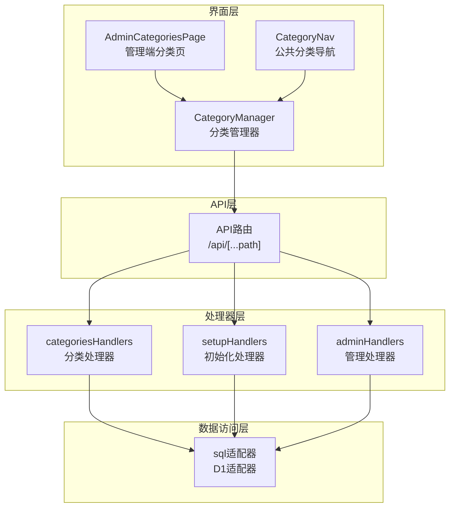
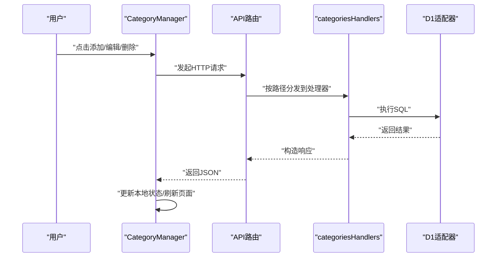
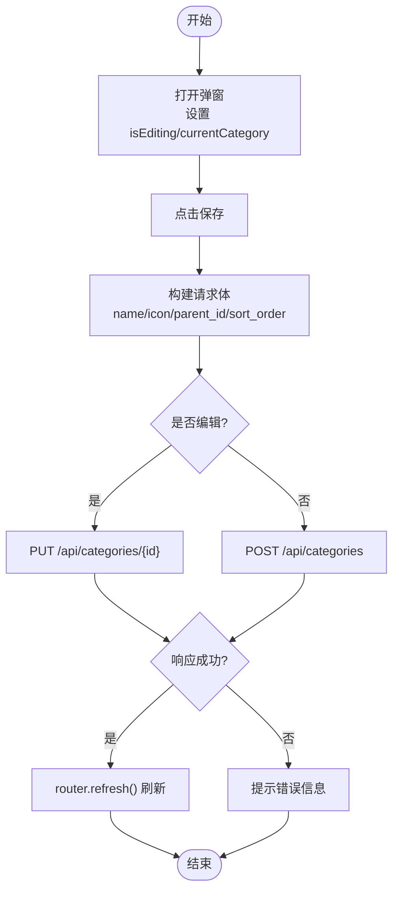
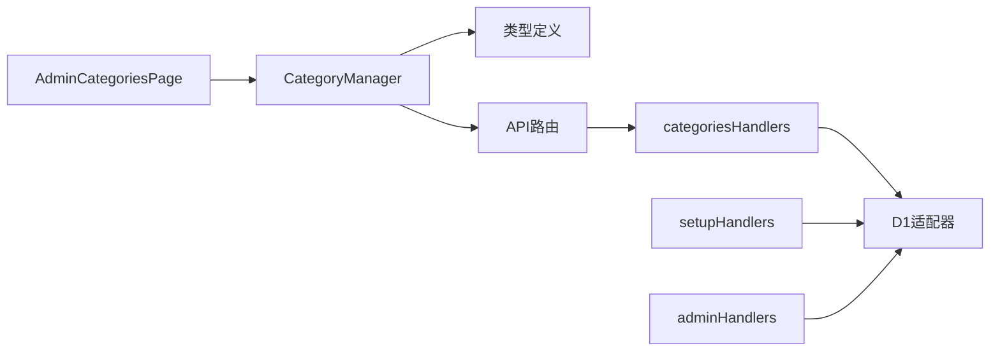
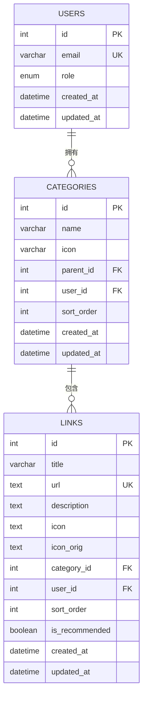

# 分类管理系统

<cite>
**本文档引用的文件**
- [src/components/admin/CategoryManager.tsx](file://src/components/admin/CategoryManager.tsx)
- [src/app/admin/(dashboard)/categories/page.tsx](file://src/app/admin/(dashboard)/categories/page.tsx)
- [src/lib/api-handlers/categories.ts](file://src/lib/api-handlers/categories.ts)
- [src/app/api/[...path]/route.ts](file://src/app/api/[...path]/route.ts)
- [src/lib/db.ts](file://src/lib/db.ts)
- [src/types/index.ts](file://src/types/index.ts)
- [src/components/public/CategoryNav.tsx](file://src/components/public/CategoryNav.tsx)
- [src/lib/api-handlers/setup.ts](file://src/lib/api-handlers/setup.ts)
- [src/lib/api-handlers/admin.ts](file://src/lib/api-handlers/admin.ts)
</cite>

## 目录
1. [简介](#简介)
2. [项目结构](#项目结构)
3. [核心组件](#核心组件)
4. [架构总览](#架构总览)
5. [详细组件分析](#详细组件分析)
6. [依赖分析](#依赖分析)
7. [性能考虑](#性能考虑)
8. [故障排除指南](#故障排除指南)
9. [结论](#结论)
10. [附录](#附录)

## 简介
本系统是一个基于 Next.js App Router 的分类管理系统，支持分类树形结构的创建、编辑、删除与父子关系维护，并提供分类统计与管理界面。系统采用 Cloudflare D1 数据库存储，前端通过 API 路由与服务端处理器交互，实现权限控制、数据校验与缓存失效。

## 项目结构
系统主要由以下层次构成：
- 界面层：管理端分类页面与公共导航组件
- 客户端组件：分类管理器，负责增删改查与父子选择
- API 层：统一路由分发至各处理器
- 处理器层：分类、链接、导入导出、设置等业务处理
- 数据访问层：D1 适配器，兼容 Edge Runtime 与本地开发
- 类型定义：统一的数据模型与响应结构

图表来源
- [src/app/admin/(dashboard)/categories/page.tsx](file://src/app/admin/(dashboard)/categories/page.tsx#L1-L55)
- [src/components/admin/CategoryManager.tsx](file://src/components/admin/CategoryManager.tsx#L1-L262)
- [src/app/api/[...path]/route.ts](file://src/app/api/[...path]/route.ts#L1-L147)
- [src/lib/api-handlers/categories.ts](file://src/lib/api-handlers/categories.ts#L1-L199)
- [src/lib/db.ts](file://src/lib/db.ts#L1-L69)

章节来源
- [src/app/admin/(dashboard)/categories/page.tsx](file://src/app/admin/(dashboard)/categories/page.tsx#L1-L55)
- [src/components/admin/CategoryManager.tsx](file://src/components/admin/CategoryManager.tsx#L1-L262)
- [src/app/api/[...path]/route.ts](file://src/app/api/[...path]/route.ts#L1-L147)
- [src/lib/api-handlers/categories.ts](file://src/lib/api-handlers/categories.ts#L1-L199)
- [src/lib/db.ts](file://src/lib/db.ts#L1-L69)

## 核心组件
- 管理端分类页：负责加载初始分类数据并传递给客户端组件
- 分类管理器：提供分类增删改查、父子关系选择、链接数量展示与提交流程
- API 路由：集中分发 GET/POST/PUT/DELETE 请求到对应处理器
- 分类处理器：实现列表、创建、更新、删除的业务逻辑与权限校验
- D1 适配器：在 Edge Runtime 下兼容 D1 绑定，提供统一的 SQL 执行接口

章节来源
- [src/app/admin/(dashboard)/categories/page.tsx](file://src/app/admin/(dashboard)/categories/page.tsx#L1-L55)
- [src/components/admin/CategoryManager.tsx](file://src/components/admin/CategoryManager.tsx#L1-L262)
- [src/app/api/[...path]/route.ts](file://src/app/api/[...path]/route.ts#L1-L147)
- [src/lib/api-handlers/categories.ts](file://src/lib/api-handlers/categories.ts#L1-L199)
- [src/lib/db.ts](file://src/lib/db.ts#L1-L69)

## 架构总览
系统采用前后端分离的 API 设计，客户端组件通过 fetch 调用 /api 路由，路由根据路径分发到分类处理器；处理器通过 D1 适配器执行数据库操作，并在成功后触发 revalidatePath 以刷新缓存。

图表来源
- [src/components/admin/CategoryManager.tsx](file://src/components/admin/CategoryManager.tsx#L64-L150)
- [src/app/api/[...path]/route.ts](file://src/app/api/[...path]/route.ts#L12-L146)
- [src/lib/api-handlers/categories.ts](file://src/lib/api-handlers/categories.ts#L17-L199)
- [src/lib/db.ts](file://src/lib/db.ts#L12-L68)

## 详细组件分析

### 分类管理器（CategoryManager）
职责与特性：
- 加载初始分类数据，支持客户端二次拉取以保证数据一致性
- 提供新增/编辑弹窗，支持父级分类选择与排序权重设置
- 提交时构建请求体，区分新增与更新场景
- 删除前确认，调用 API 后刷新页面并更新本地状态
- 通过 availableParents 过滤当前项及其子节点，避免循环引用

关键行为流程（新增/编辑）：

图表来源
- [src/components/admin/CategoryManager.tsx](file://src/components/admin/CategoryManager.tsx#L52-L131)

章节来源
- [src/components/admin/CategoryManager.tsx](file://src/components/admin/CategoryManager.tsx#L1-L262)

### 管理端分类页（AdminCategoriesPage）
职责与特性：
- 强制动态渲染与 Edge Runtime，确保 API 路由在边缘运行
- 从分类处理器获取基础分类数据并传递给客户端组件
- 当前实现中，组件期望包含 parent_name 与 links_count 字段，但 API 返回未包含这些字段，组件会显示占位符

章节来源
- [src/app/admin/(dashboard)/categories/page.tsx](file://src/app/admin/(dashboard)/categories/page.tsx#L1-L55)

### API 路由（/api/[...path]）
职责与特性：
- 统一处理 /api/* 请求，按路径分发到不同处理器
- 支持 GET（列表）、POST（创建）、PUT（更新，需带ID）、DELETE（删除，需带ID）
- 对 categories、links、admin、export 等模块进行路由映射

章节来源
- [src/app/api/[...path]/route.ts](file://src/app/api/[...path]/route.ts#L1-L147)

### 分类处理器（categoriesHandlers）
职责与特性：
- list：按用户过滤并排序返回分类列表
- create：校验必填字段，幂等性检查重复名称，插入后返回新建记录并触发 revalidatePath
- update：更新指定分类，返回更新后的记录并触发 revalidatePath
- delete：删除前检查是否存在子分类与关联链接，满足条件方可删除

请求与响应规范（节选）：
- GET /api/categories
  - 成功：返回 { success: true, data: Category[] }
  - 失败：返回 { success: false, message: string }
- POST /api/categories
  - 请求体：{ name, icon?, parent_id?, sort_order? }
  - 成功：返回 { success: true, data: Category }
  - 失败：返回 { success: false, message: string }
- PUT /api/categories/{id}
  - 请求体：{ name, icon?, parent_id?, sort_order? }
  - 成功：返回 { success: true, data: Category }
  - 失败：返回 { success: false, message: string }
- DELETE /api/categories/{id}
  - 成功：返回 { success: true, id }
  - 失败：返回 { success: false, message: string }

章节来源
- [src/lib/api-handlers/categories.ts](file://src/lib/api-handlers/categories.ts#L1-L199)

### D1 适配器（sql）
职责与特性：
- 在 Edge Runtime 下优先使用 Cloudflare Pages 的 D1 绑定
- 支持 SELECT/INSERT/UPDATE/DELETE 语句，自动识别 RETURNING 子句
- 本地开发回退逻辑已移除，建议使用 wrangler pages dev

章节来源
- [src/lib/db.ts](file://src/lib/db.ts#L1-L69)

### 公共分类导航（CategoryNav）
职责与特性：
- 渲染分类导航，支持平滑滚动到对应分类区域
- 支持“常用推荐”入口（可选）

章节来源
- [src/components/public/CategoryNav.tsx](file://src/components/public/CategoryNav.tsx#L1-L45)

### 初始化与索引（setupHandlers）
职责与特性：
- 创建 users、categories、links 表及必要索引
- categories 表包含外键约束与排序字段
- links 表包含唯一约束（url,user_id）

章节来源
- [src/lib/api-handlers/setup.ts](file://src/lib/api-handlers/setup.ts#L28-L70)

### 管理统计（adminHandlers）
职责与特性：
- 提供分类、链接、推荐链接数量统计
- 支持最近链接查询

章节来源
- [src/lib/api-handlers/admin.ts](file://src/lib/api-handlers/admin.ts#L104-L128)

## 依赖分析
- 组件耦合
  - CategoryManager 依赖类型定义与路由刷新机制
  - AdminCategoriesPage 依赖分类处理器与会话信息
- 外部依赖
  - Cloudflare D1 绑定（Edge Runtime）
  - Next.js App Router 与 revalidatePath 缓存控制
- 接口契约
  - 分类处理器与 D1 适配器之间的 SQL 协议
  - API 路由与处理器之间的路径协议

图表来源
- [src/components/admin/CategoryManager.tsx](file://src/components/admin/CategoryManager.tsx#L1-L262)
- [src/app/admin/(dashboard)/categories/page.tsx](file://src/app/admin/(dashboard)/categories/page.tsx#L1-L55)
- [src/app/api/[...path]/route.ts](file://src/app/api/[...path]/route.ts#L1-L147)
- [src/lib/api-handlers/categories.ts](file://src/lib/api-handlers/categories.ts#L1-L199)
- [src/lib/db.ts](file://src/lib/db.ts#L1-L69)
- [src/lib/api-handlers/setup.ts](file://src/lib/api-handlers/setup.ts#L28-L70)
- [src/lib/api-handlers/admin.ts](file://src/lib/api-handlers/admin.ts#L104-L128)

## 性能考虑
- 查询优化
  - categories 表已建立 user_id 与 parent_id 索引，建议在高频查询场景下保持排序字段与过滤条件一致
- 缓存策略
  - 处理器在成功写入后调用 revalidatePath，确保边缘缓存一致性
- 前端刷新
  - 使用 router.refresh() 替代手动状态合并，避免竞态与重复渲染

## 故障排除指南
- 删除失败：若提示存在子分类或关联链接，请先移动或删除子分类与链接后再尝试删除
- 重复创建：系统具备幂等性检测，重复名称会返回现有记录
- 权限不足：非管理员用户无法访问分类管理相关接口
- 数据缺失：管理端页面期望的 parent_name 与 links_count 未在 API 返回中提供，组件会显示占位符

章节来源
- [src/lib/api-handlers/categories.ts](file://src/lib/api-handlers/categories.ts#L138-L199)
- [src/components/admin/CategoryManager.tsx](file://src/components/admin/CategoryManager.tsx#L133-L150)

## 结论
该分类管理系统通过清晰的分层设计实现了树形结构的父子关系管理与统计功能。前端组件与 API 路由配合处理器完成完整的 CRUD 流程，D1 适配器确保在 Edge Runtime 下的稳定运行。建议后续增强 API 返回字段以减少前端兼容性处理，并在公共展示层引入更完善的树形渲染与层级查询优化。

## 附录

### 数据模型图

图表来源
- [src/lib/api-handlers/setup.ts](file://src/lib/api-handlers/setup.ts#L32-L70)

### API 定义概览
- GET /api/categories
  - 功能：获取分类列表
  - 认证：需要登录
  - 响应：success, data: Category[]
- POST /api/categories
  - 功能：创建分类
  - 认证：需要管理员
  - 请求体：{ name, icon?, parent_id?, sort_order? }
  - 响应：success, data: Category
- PUT /api/categories/{id}
  - 功能：更新分类
  - 认证：需要管理员
  - 请求体：{ name, icon?, parent_id?, sort_order? }
  - 响应：success, data: Category
- DELETE /api/categories/{id}
  - 功能：删除分类
  - 认证：需要管理员
  - 响应：success, id 或错误信息

章节来源
- [src/lib/api-handlers/categories.ts](file://src/lib/api-handlers/categories.ts#L17-L199)
- [src/app/api/[...path]/route.ts](file://src/app/api/[...path]/route.ts#L12-L146)