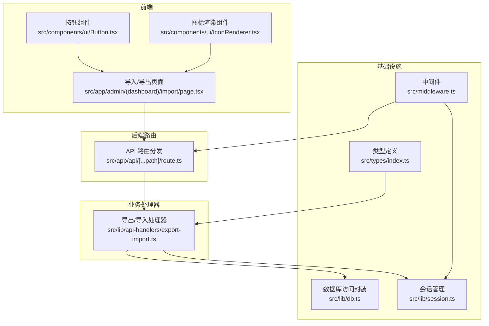
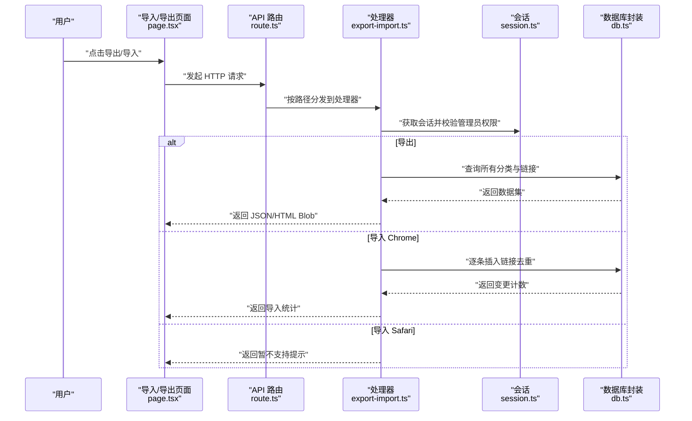
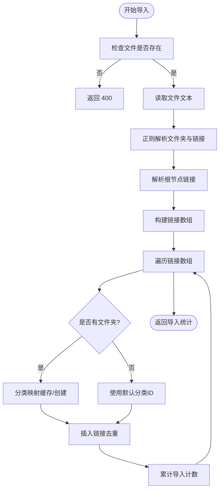
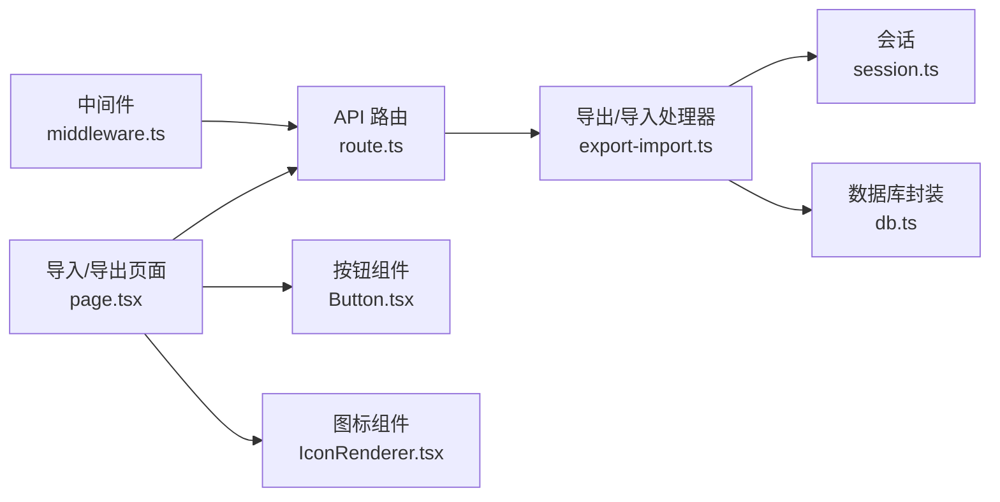

# 数据导入导出

<cite>
**本文引用的文件**
- [src/app/admin/(dashboard)/import/page.tsx](file://src/app/admin/(dashboard)/import/page.tsx)
- [src/lib/api-handlers/export-import.ts](file://src/lib/api-handlers/export-import.ts)
- [src/app/api/[...path]/route.ts](file://src/app/api/[...path]/route.ts)
- [src/lib/db.ts](file://src/lib/db.ts)
- [src/lib/session.ts](file://src/lib/session.ts)
- [src/types/index.ts](file://src/types/index.ts)
- [src/components/ui/Button.tsx](file://src/components/ui/Button.tsx)
- [src/components/ui/IconRenderer.tsx](file://src/components/ui/IconRenderer.tsx)
- [src/middleware.ts](file://src/middleware.ts)
</cite>

## 目录
1. [简介](#简介)
2. [项目结构](#项目结构)
3. [核心组件](#核心组件)
4. [架构总览](#架构总览)
5. [详细组件分析](#详细组件分析)
6. [依赖关系分析](#依赖关系分析)
7. [性能考量](#性能考量)
8. [故障排查指南](#故障排查指南)
9. [结论](#结论)
10. [附录](#附录)

## 简介
本章节面向“数据导入导出”功能，系统性说明 Chrome/Safari 书签导入、JSON 数据导出、批量数据处理的实现细节。内容覆盖：
- 导入/导出接口设计与路由映射
- 书签格式解析与数据转换策略
- 错误处理与安全控制
- 前端界面与后端 API 的交互流程
- 性能优化建议与常见问题解决方案

## 项目结构
与导入导出功能直接相关的模块分布如下：
- 前端页面：导入/导出界面组件，负责用户交互与结果展示
- 后端 API 路由：统一入口，分发到具体处理器
- 处理器：导出 JSON/HTML；导入 Chrome HTML；导入 Safari Plist（当前禁用）
- 数据层：D1 数据库访问封装
- 会话与鉴权：基于 Cookie 的会话校验与管理员权限控制

图表来源
- [src/app/admin/(dashboard)/import/page.tsx](file://src/app/admin/(dashboard)/import/page.tsx#L1-L184)
- [src/app/api/[...path]/route.ts](file://src/app/api/[...path]/route.ts#L1-L96)
- [src/lib/api-handlers/export-import.ts](file://src/lib/api-handlers/export-import.ts#L1-L334)
- [src/lib/db.ts](file://src/lib/db.ts#L1-L69)
- [src/lib/session.ts](file://src/lib/session.ts#L1-L14)
- [src/types/index.ts](file://src/types/index.ts#L1-L53)
- [src/middleware.ts](file://src/middleware.ts#L1-L42)

章节来源
- [src/app/admin/(dashboard)/import/page.tsx](file://src/app/admin/(dashboard)/import/page.tsx#L1-L184)
- [src/app/api/[...path]/route.ts](file://src/app/api/[...path]/route.ts#L1-L96)
- [src/lib/api-handlers/export-import.ts](file://src/lib/api-handlers/export-import.ts#L1-L334)
- [src/lib/db.ts](file://src/lib/db.ts#L1-L69)
- [src/lib/session.ts](file://src/lib/session.ts#L1-L14)
- [src/types/index.ts](file://src/types/index.ts#L1-L53)
- [src/middleware.ts](file://src/middleware.ts#L1-L42)

## 核心组件
- 导入/导出页面组件：提供导出 JSON/HTML、导入 Chrome/Safari 的 UI 与交互逻辑
- API 路由分发：根据路径将请求分发至对应处理器
- 导出/导入处理器：实现导出与导入的具体业务逻辑
- 数据库访问封装：统一 SQL 执行与 D1 绑定处理
- 会话与权限：管理员角色校验与会话获取
- 类型定义：导出/导入返回结构与数据模型

章节来源
- [src/app/admin/(dashboard)/import/page.tsx](file://src/app/admin/(dashboard)/import/page.tsx#L1-L184)
- [src/app/api/[...path]/route.ts](file://src/app/api/[...path]/route.ts#L1-L96)
- [src/lib/api-handlers/export-import.ts](file://src/lib/api-handlers/export-import.ts#L1-L334)
- [src/lib/db.ts](file://src/lib/db.ts#L1-L69)
- [src/lib/session.ts](file://src/lib/session.ts#L1-L14)
- [src/types/index.ts](file://src/types/index.ts#L1-L53)

## 架构总览
下图展示了从前端到后端、再到数据库的整体调用链路。

图表来源
- [src/app/admin/(dashboard)/import/page.tsx](file://src/app/admin/(dashboard)/import/page.tsx#L26-L81)
- [src/app/api/[...path]/route.ts](file://src/app/api/[...path]/route.ts#L42-L96)
- [src/lib/api-handlers/export-import.ts](file://src/lib/api-handlers/export-import.ts#L8-L106)
- [src/lib/session.ts](file://src/lib/session.ts#L4-L13)
- [src/lib/db.ts](file://src/lib/db.ts#L12-L68)

## 详细组件分析

### 导入/导出页面组件
- 功能要点
  - 支持导出 JSON 与 HTML（书签文件）
  - 支持导入 Chrome HTML 与 Safari Plist（Safari 当前禁用）
  - 文件上传、状态反馈、结果展示
- 关键交互
  - 导出：调用 /api/export?format=json|html，下载 Blob 文件
  - 导入：POST /api/import/chrome 或 /api/import/safari，携带 file 字段
- UI 组件
  - 按钮组件与图标渲染组件用于增强可读性与一致性

章节来源
- [src/app/admin/(dashboard)/import/page.tsx](file://src/app/admin/(dashboard)/import/page.tsx#L1-L184)
- [src/components/ui/Button.tsx](file://src/components/ui/Button.tsx#L1-L49)
- [src/components/ui/IconRenderer.tsx](file://src/components/ui/IconRenderer.tsx#L185-L191)

### API 路由分发
- 路由规则
  - GET /api/export → 导出处理器
  - POST /api/import/chrome → Chrome 导入处理器
  - POST /api/import/safari → Safari 导入处理器（当前返回 501）
- 边界与错误
  - 未匹配路径返回 404
  - 全局中间件限制 /admin 路径访问

章节来源
- [src/app/api/[...path]/route.ts](file://src/app/api/[...path]/route.ts#L1-L96)
- [src/middleware.ts](file://src/middleware.ts#L1-L42)

### 导出处理器
- 支持格式
  - json：包含 categories、links、导出时间与版本字段
  - html：生成 Netscape 书签文件，按树形结构输出
- 数据流
  - 查询所有分类与链接，构建树形结构（HTML），或序列化为 JSON
  - 设置 Content-Disposition 下载头，返回二进制响应
- 安全与异常
  - 需管理员权限，否则 401
  - 其他异常返回 500

章节来源
- [src/lib/api-handlers/export-import.ts](file://src/lib/api-handlers/export-import.ts#L8-L106)

### Chrome 导入处理器
- 输入
  - 表单字段：file（必填）、categoryId（可选）
- 解析策略
  - 使用正则提取 HTML 中的文件夹与链接，支持带 ICON 与无 ICON 的链接
  - 根节点中的链接单独处理
- 分类映射
  - 通过 Map 缓存“文件夹名 → 分类 ID”，避免重复创建
  - 若分类不存在，则按用户维度创建新分类
- 插入策略
  - 逐条插入链接，使用 ON CONFLICT (url,user_id) DO NOTHING 去重
  - 记录导入数量与发现的分类集合
- 异常处理
  - 外层捕获异常并返回 500
  - 单条插入异常被忽略，保证整体导入继续进行

图表来源
- [src/lib/api-handlers/export-import.ts](file://src/lib/api-handlers/export-import.ts#L108-L229)

章节来源
- [src/lib/api-handlers/export-import.ts](file://src/lib/api-handlers/export-import.ts#L108-L229)

### Safari 导入处理器
- 状态
  - 当前禁用（返回 501），保留了完整的解析与递归处理逻辑注释
- 设计思路
  - 解析 Plist 文档，递归遍历节点
  - 文件夹节点创建分类，叶子节点创建链接
  - 支持去重与重复计数

章节来源
- [src/lib/api-handlers/export-import.ts](file://src/lib/api-handlers/export-import.ts#L231-L332)

### 数据库访问封装
- 统一 SQL 执行
  - 支持模板字符串 SQL 与参数绑定
  - 自动识别 SELECT/INSERT/UPDATE/DELETE 与 RETURNING
  - 在 Edge Runtime 下优先使用 D1 绑定，缺失时给出警告
- 错误处理
  - 捕获并抛出数据库错误，便于上层处理

章节来源
- [src/lib/db.ts](file://src/lib/db.ts#L1-L69)

### 会话与权限
- 会话获取
  - 从 Cookie 中读取 token，并验证其有效性
- 权限控制
  - 导入/导出仅允许管理员角色访问
  - 中间件拦截 /admin 路径，未登录重定向至登录页

章节来源
- [src/lib/session.ts](file://src/lib/session.ts#L1-L14)
- [src/middleware.ts](file://src/middleware.ts#L1-L42)

### 类型定义
- 导入返回结构
  - imported：成功导入数量
  - duplicates：重复跳过数量（当前实现中未统计）
  - categories：发现的分类名称列表
- 数据模型
  - Category、Link 等模型用于导出 JSON 与数据库操作

章节来源
- [src/types/index.ts](file://src/types/index.ts#L48-L52)
- [src/types/index.ts](file://src/types/index.ts#L9-L34)

## 依赖关系分析
- 组件耦合
  - 页面组件依赖按钮与图标组件，保持 UI 一致性
  - 路由分发与处理器解耦，便于扩展新格式
  - 处理器依赖会话与数据库封装，职责清晰
- 外部依赖
  - Edge Runtime 环境下的 D1 绑定
  - lucide-react 图标库

图表来源
- [src/app/admin/(dashboard)/import/page.tsx](file://src/app/admin/(dashboard)/import/page.tsx#L1-L184)
- [src/app/api/[...path]/route.ts](file://src/app/api/[...path]/route.ts#L1-L96)
- [src/lib/api-handlers/export-import.ts](file://src/lib/api-handlers/export-import.ts#L1-L334)
- [src/lib/session.ts](file://src/lib/session.ts#L1-L14)
- [src/lib/db.ts](file://src/lib/db.ts#L1-L69)
- [src/components/ui/Button.tsx](file://src/components/ui/Button.tsx#L1-L49)
- [src/components/ui/IconRenderer.tsx](file://src/components/ui/IconRenderer.tsx#L185-L191)
- [src/middleware.ts](file://src/middleware.ts#L1-L42)

## 性能考量
- 导出
  - 一次性查询所有分类与链接，适合中等规模数据
  - HTML 导出采用递归构建字符串，注意超大书签树的内存占用
- 导入
  - Chrome 导入逐条插入并使用去重约束，建议在数据库层面确保 url+user_id 唯一索引
  - 分类映射缓存减少重复查询
- 可选优化
  - 导入时可考虑批量插入（如支持多值插入）以减少往返
  - 对超大文件导入增加分片与进度反馈
  - 导出时对 HTML 使用流式写入（若框架支持）

## 故障排查指南
- 401 未授权
  - 确认已登录且为管理员角色
  - 检查中间件是否正确拦截 /admin 路径
- 400 缺少文件
  - 确保表单中包含 file 字段
- Safari 导入 501
  - 当前禁用，等待 Edge Runtime 兼容性修复
- 导入无结果或重复
  - 检查链接 URL 是否已存在（去重策略）
  - 确认文件格式符合预期（Chrome HTML）
- 导出为空
  - 确认数据库中存在分类与链接数据
  - 检查管理员权限与会话状态

章节来源
- [src/lib/api-handlers/export-import.ts](file://src/lib/api-handlers/export-import.ts#L108-L229)
- [src/lib/api-handlers/export-import.ts](file://src/lib/api-handlers/export-import.ts#L231-L332)
- [src/middleware.ts](file://src/middleware.ts#L1-L42)

## 结论
本功能以简洁的前后端分离方式实现了“导入导出”的核心能力：
- 导出：支持 JSON 与 HTML 两种格式，满足备份与跨平台迁移需求
- 导入：重点支持 Chrome HTML，具备分类映射与去重机制；Safari Plist 已预留实现
- 安全与健壮性：管理员权限控制、错误捕获与降级处理
- 可扩展性：路由与处理器解耦，便于新增格式与优化性能

## 附录

### API 定义概览
- 导出
  - 方法：GET
  - 路径：/api/export
  - 参数：format=json|html
  - 返回：JSON 或 HTML 文件（Content-Disposition 下载）
- 导入 Chrome
  - 方法：POST
  - 路径：/api/import/chrome
  - 表单字段：file（必填）、categoryId（可选）
  - 返回：导入统计（imported、categories）
- 导入 Safari
  - 方法：POST
  - 路径：/api/import/safari
  - 表单字段：file（必填）、categoryId（可选）
  - 返回：当前为 501（暂不支持）

章节来源
- [src/app/api/[...path]/route.ts](file://src/app/api/[...path]/route.ts#L42-L96)
- [src/lib/api-handlers/export-import.ts](file://src/lib/api-handlers/export-import.ts#L8-L106)
- [src/lib/api-handlers/export-import.ts](file://src/lib/api-handlers/export-import.ts#L108-L229)
- [src/lib/api-handlers/export-import.ts](file://src/lib/api-handlers/export-import.ts#L231-L332)