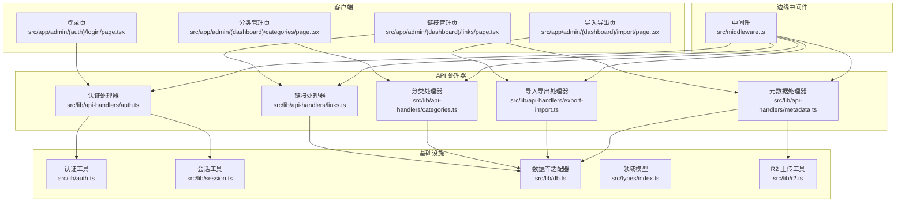
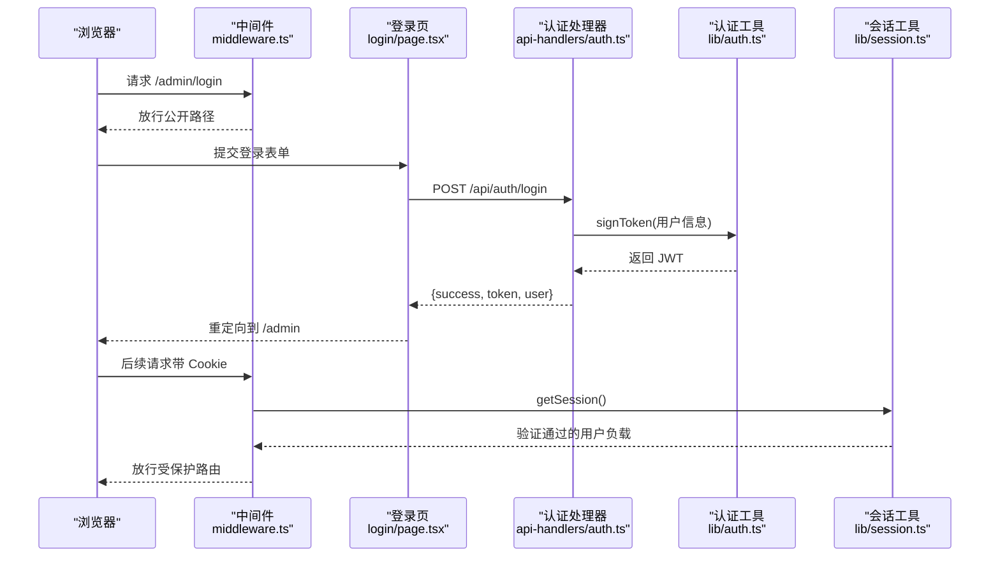
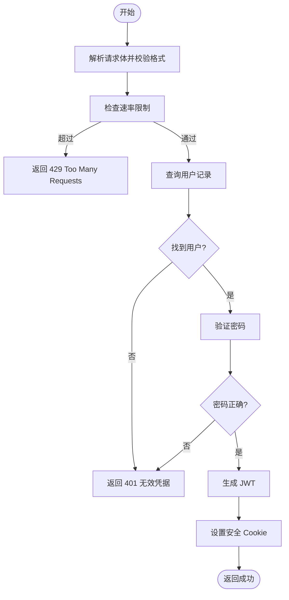
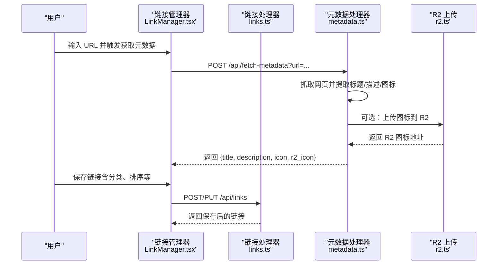
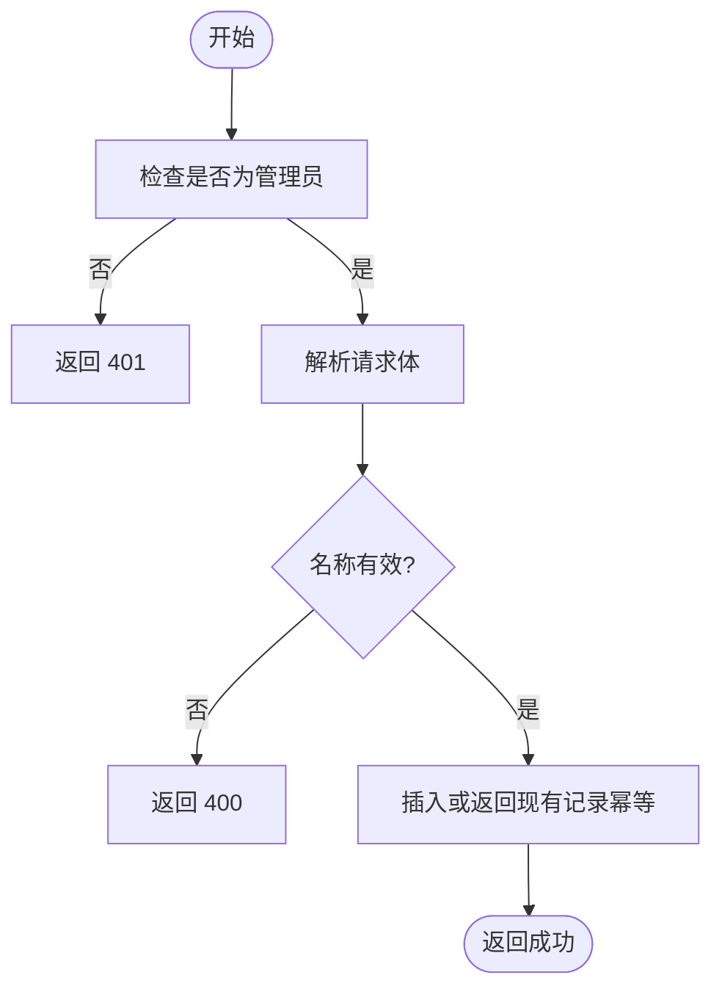
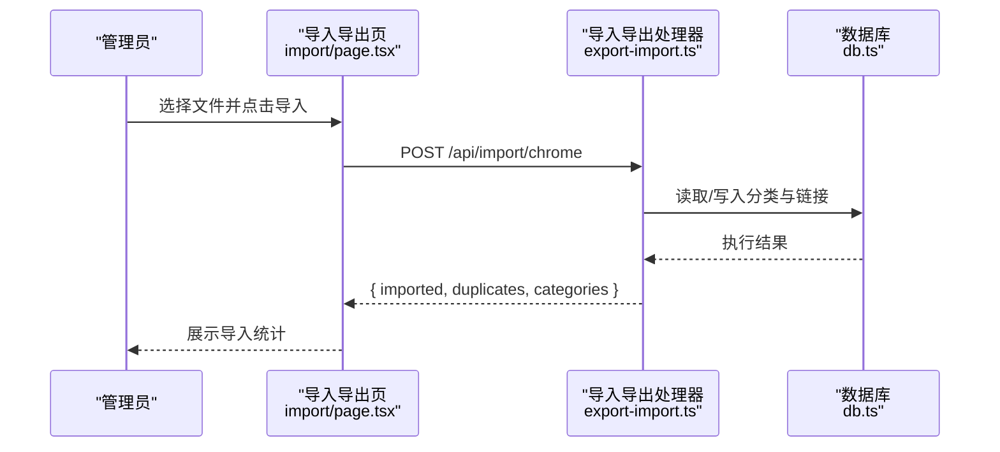
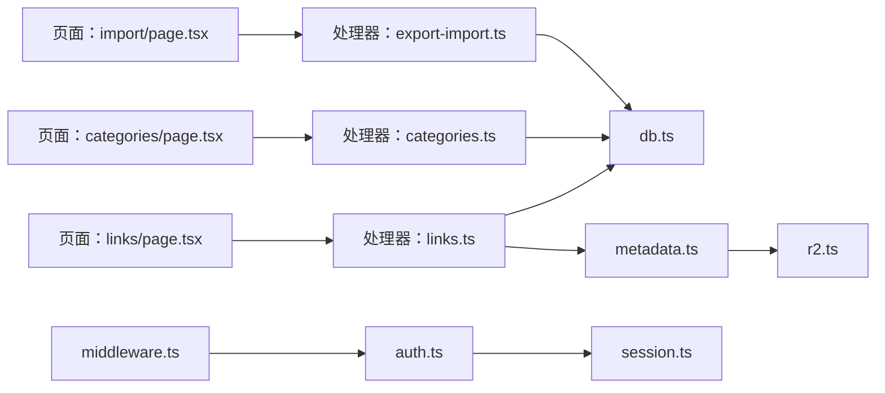

# 核心功能模块

<cite>
**本文引用的文件**
- [src/lib/auth.ts](file://src/lib/auth.ts)
- [src/lib/session.ts](file://src/lib/session.ts)
- [src/middleware.ts](file://src/middleware.ts)
- [src/lib/db.ts](file://src/lib/db.ts)
- [src/types/index.ts](file://src/types/index.ts)
- [src/app/admin/(auth)/login/page.tsx](file://src/app/admin/(auth)/login/page.tsx)
- [src/lib/api-handlers/auth.ts](file://src/lib/api-handlers/auth.ts)
- [src/components/admin/LinkManager.tsx](file://src/components/admin/LinkManager.tsx)
- [src/app/admin/(dashboard)/links/page.tsx](file://src/app/admin/(dashboard)/links/page.tsx)
- [src/lib/api-handlers/links.ts](file://src/lib/api-handlers/links.ts)
- [src/lib/api-handlers/metadata.ts](file://src/lib/api-handlers/metadata.ts)
- [src/lib/r2.ts](file://src/lib/r2.ts)
- [src/components/admin/CategoryManager.tsx](file://src/components/admin/CategoryManager.tsx)
- [src/app/admin/(dashboard)/categories/page.tsx](file://src/app/admin/(dashboard)/categories/page.tsx)
- [src/lib/api-handlers/categories.ts](file://src/lib/api-handlers/categories.ts)
- [src/app/admin/(dashboard)/import/page.tsx](file://src/app/admin/(dashboard)/import/page.tsx)
- [src/lib/api-handlers/export-import.ts](file://src/lib/api-handlers/export-import.ts)
</cite>

## 目录
1. [简介](#简介)
2. [项目结构](#项目结构)
3. [核心组件](#核心组件)
4. [架构总览](#架构总览)
5. [详细组件分析](#详细组件分析)
6. [依赖分析](#依赖分析)
7. [性能考虑](#性能考虑)
8. [故障排除指南](#故障排除指南)
9. [结论](#结论)
10. [附录](#附录)

## 简介
本文件为核心功能模块的技术文档，覆盖以下主题：
- 用户认证系统：登录、会话与中间件保护
- 链接管理系统：增删改查、排序与元数据抓取
- 分类管理系统：树形分类、父子关系与权限控制
- 数据导入导出：Chrome/Safari 书签导入、JSON/HTML 导出

文档以“从上到下”的方式组织，先给出整体架构与模块边界，再深入到每个子系统的实现细节、接口定义、数据模型、调用流程与常见问题处理，最后提供性能优化建议与排障清单。

## 项目结构
本项目采用 Next.js App Router + Cloudflare Pages 边缘运行时，核心目录与职责如下：
- src/lib：后端逻辑与基础设施（认证、数据库、R2、类型）
- src/app/admin：管理后台页面（登录、仪表盘、导入导出等）
- src/components/admin：管理端 UI 组件（链接/分类管理器）
- src/lib/api-handlers：各模块 API 处理器（认证、链接、分类、导入导出、元数据）
- src/middleware.ts：边缘中间件，统一鉴权与重定向

图表来源
- [src/app/admin/(auth)/login/page.tsx](file://src/app/admin/(auth)/login/page.tsx#L1-L118)
- [src/app/admin/(dashboard)/links/page.tsx](file://src/app/admin/(dashboard)/links/page.tsx#L1-L20)
- [src/app/admin/(dashboard)/categories/page.tsx](file://src/app/admin/(dashboard)/categories/page.tsx#L1-L56)
- [src/app/admin/(dashboard)/import/page.tsx](file://src/app/admin/(dashboard)/import/page.tsx#L1-L184)
- [src/middleware.ts](file://src/middleware.ts#L1-L43)
- [src/lib/api-handlers/auth.ts](file://src/lib/api-handlers/auth.ts#L1-L141)
- [src/lib/api-handlers/links.ts](file://src/lib/api-handlers/links.ts#L1-L270)
- [src/lib/api-handlers/categories.ts](file://src/lib/api-handlers/categories.ts#L1-L199)
- [src/lib/api-handlers/export-import.ts](file://src/lib/api-handlers/export-import.ts#L1-L334)
- [src/lib/api-handlers/metadata.ts](file://src/lib/api-handlers/metadata.ts#L1-L172)
- [src/lib/auth.ts](file://src/lib/auth.ts#L1-L23)
- [src/lib/session.ts](file://src/lib/session.ts#L1-L14)
- [src/lib/db.ts](file://src/lib/db.ts#L1-L69)
- [src/types/index.ts](file://src/types/index.ts#L1-L53)
- [src/lib/r2.ts](file://src/lib/r2.ts#L1-L103)

章节来源
- [src/app/admin/(auth)/login/page.tsx](file://src/app/admin/(auth)/login/page.tsx#L1-L118)
- [src/app/admin/(dashboard)/links/page.tsx](file://src/app/admin/(dashboard)/links/page.tsx#L1-L20)
- [src/app/admin/(dashboard)/categories/page.tsx](file://src/app/admin/(dashboard)/categories/page.tsx#L1-L56)
- [src/app/admin/(dashboard)/import/page.tsx](file://src/app/admin/(dashboard)/import/page.tsx#L1-L184)
- [src/middleware.ts](file://src/middleware.ts#L1-L43)
- [src/lib/api-handlers/auth.ts](file://src/lib/api-handlers/auth.ts#L1-L141)
- [src/lib/api-handlers/links.ts](file://src/lib/api-handlers/links.ts#L1-L270)
- [src/lib/api-handlers/categories.ts](file://src/lib/api-handlers/categories.ts#L1-L199)
- [src/lib/api-handlers/export-import.ts](file://src/lib/api-handlers/export-import.ts#L1-L334)
- [src/lib/api-handlers/metadata.ts](file://src/lib/api-handlers/metadata.ts#L1-L172)
- [src/lib/auth.ts](file://src/lib/auth.ts#L1-L23)
- [src/lib/session.ts](file://src/lib/session.ts#L1-L14)
- [src/lib/db.ts](file://src/lib/db.ts#L1-L69)
- [src/types/index.ts](file://src/types/index.ts#L1-L53)
- [src/lib/r2.ts](file://src/lib/r2.ts#L1-L103)

## 核心组件
- 认证系统：基于 HS256 的 JWT，Cookie 存储；中间件拦截受保护路径；登录接口校验凭据并下发令牌。
- 链接管理：支持分页查询、搜索、按分类过滤、拖拽排序；提供元数据抓取与图标上传至 R2。
- 分类管理：支持父子分类、排序；删除前检查是否存在子分类与链接。
- 导入导出：支持 Chrome HTML 书签导入；支持 JSON/HTML 导出；Safari Plist 导入在边缘运行时受限暂时禁用。

章节来源
- [src/lib/auth.ts](file://src/lib/auth.ts#L1-L23)
- [src/lib/session.ts](file://src/lib/session.ts#L1-L14)
- [src/middleware.ts](file://src/middleware.ts#L1-L43)
- [src/lib/api-handlers/auth.ts](file://src/lib/api-handlers/auth.ts#L1-L141)
- [src/lib/api-handlers/links.ts](file://src/lib/api-handlers/links.ts#L1-L270)
- [src/lib/api-handlers/metadata.ts](file://src/lib/api-handlers/metadata.ts#L1-L172)
- [src/lib/api-handlers/categories.ts](file://src/lib/api-handlers/categories.ts#L1-L199)
- [src/lib/api-handlers/export-import.ts](file://src/lib/api-handlers/export-import.ts#L1-L334)

## 架构总览
系统采用“边缘中间件 + API 处理器 + 前端页面/组件”的分层设计。前端页面通过 fetch 调用 API，API 处理器通过数据库适配器访问 D1，必要时调用 R2 上传图标。

图表来源
- [src/middleware.ts](file://src/middleware.ts#L1-L43)
- [src/app/admin/(auth)/login/page.tsx](file://src/app/admin/(auth)/login/page.tsx#L1-L118)
- [src/lib/api-handlers/auth.ts](file://src/lib/api-handlers/auth.ts#L1-L141)
- [src/lib/auth.ts](file://src/lib/auth.ts#L1-L23)
- [src/lib/session.ts](file://src/lib/session.ts#L1-L14)

## 详细组件分析

### 用户认证系统
- 关键点
  - 使用 HS256 的 JWT，24 小时有效期
  - 登录成功写入 httpOnly、secure、sameSite=strict 的 Cookie
  - 中间件拦截 /admin 路由，未认证重定向到登录页
  - 登录接口内置速率限制（按 IP 窗口计数）
  - 密码验证通过专用比较函数
- 接口与返回
  - POST /api/auth/login
    - 请求体：{ email, password }
    - 成功响应：{ success: true, token, user: { id, email, role, ... } }
    - 失败响应：{ success: false, message }
  - POST /api/auth/logout
    - 成功响应：{ success: true, message }
- 安全与配置
  - JWT_SECRET 必须在生产环境设置
  - Cookie 在生产环境启用 secure 属性
  - 速率限制：10 分钟内最多 20 次尝试

图表来源
- [src/lib/api-handlers/auth.ts](file://src/lib/api-handlers/auth.ts#L1-L141)
- [src/lib/auth.ts](file://src/lib/auth.ts#L1-L23)
- [src/lib/session.ts](file://src/lib/session.ts#L1-L14)

章节来源
- [src/lib/auth.ts](file://src/lib/auth.ts#L1-L23)
- [src/lib/session.ts](file://src/lib/session.ts#L1-L14)
- [src/middleware.ts](file://src/middleware.ts#L1-L43)
- [src/lib/api-handlers/auth.ts](file://src/lib/api-handlers/auth.ts#L1-L141)

### 链接管理系统
- 功能概览
  - 列表：支持按分类、关键词搜索、分页排序
  - 新增/更新：字段校验、去重（按 URL 正规化）
  - 删除：软/硬删除策略（幂等性处理）
  - 排序：拖拽后批量更新 sort_order
  - 元数据：自动抓取标题/描述/图标，可上传至 R2
- 数据模型
  - Link：id、title、url、description、icon/icon_orig、category_id、user_id、sort_order、is_recommended、时间戳
- 关键接口
  - GET /api/links?category=&search=&page=&limit=
  - POST /api/links
  - PUT /api/links/:id
  - DELETE /api/links/:id
  - PUT /api/links/reorder
  - POST /api/fetch-metadata?url=
- 与 R2 的集成
  - 元数据抓取成功后可上传图标至 R2，返回 /api/icons/{key} 形式的访问地址

图表来源
- [src/components/admin/LinkManager.tsx](file://src/components/admin/LinkManager.tsx#L1-L543)
- [src/lib/api-handlers/links.ts](file://src/lib/api-handlers/links.ts#L1-L270)
- [src/lib/api-handlers/metadata.ts](file://src/lib/api-handlers/metadata.ts#L1-L172)
- [src/lib/r2.ts](file://src/lib/r2.ts#L1-L103)

章节来源
- [src/components/admin/LinkManager.tsx](file://src/components/admin/LinkManager.tsx#L1-L543)
- [src/app/admin/(dashboard)/links/page.tsx](file://src/app/admin/(dashboard)/links/page.tsx#L1-L20)
- [src/lib/api-handlers/links.ts](file://src/lib/api-handlers/links.ts#L1-L270)
- [src/lib/api-handlers/metadata.ts](file://src/lib/api-handlers/metadata.ts#L1-L172)
- [src/lib/r2.ts](file://src/lib/r2.ts#L1-L103)
- [src/types/index.ts](file://src/types/index.ts#L21-L34)

### 分类管理系统
- 功能概览
  - 列表：支持按排序与创建时间排序
  - 新增/更新：名称必填，支持父分类
  - 删除：前置检查，若存在子分类或链接则拒绝
  - 与链接管理配合：链接按分类展示与筛选
- 关键接口
  - GET /api/categories
  - POST /api/categories
  - PUT /api/categories/:id
  - DELETE /api/categories/:id
- 数据模型
  - Category：id、name、icon、parent_id、user_id、sort_order、时间戳

图表来源
- [src/lib/api-handlers/categories.ts](file://src/lib/api-handlers/categories.ts#L1-L199)
- [src/types/index.ts](file://src/types/index.ts#L9-L19)

章节来源
- [src/app/admin/(dashboard)/categories/page.tsx](file://src/app/admin/(dashboard)/categories/page.tsx#L1-L56)
- [src/lib/api-handlers/categories.ts](file://src/lib/api-handlers/categories.ts#L1-L199)
- [src/types/index.ts](file://src/types/index.ts#L9-L19)

### 数据导入导出
- 导出
  - 支持 JSON 与 HTML（Netscape 书签）两种格式
  - 输出文件名包含日期，便于归档
- 导入
  - Chrome HTML：解析书签 HTML，按文件夹创建/复用分类，逐条插入链接（去重）
  - Safari Plist：当前在边缘运行时受限，暂返回 501
- 关键接口
  - GET /api/export?format=json|html
  - POST /api/import/chrome
  - POST /api/import/safari（当前不可用）

图表来源
- [src/app/admin/(dashboard)/import/page.tsx](file://src/app/admin/(dashboard)/import/page.tsx#L1-L184)
- [src/lib/api-handlers/export-import.ts](file://src/lib/api-handlers/export-import.ts#L1-L334)
- [src/lib/db.ts](file://src/lib/db.ts#L1-L69)

章节来源
- [src/app/admin/(dashboard)/import/page.tsx](file://src/app/admin/(dashboard)/import/page.tsx#L1-L184)
- [src/lib/api-handlers/export-import.ts](file://src/lib/api-handlers/export-import.ts#L1-L334)
- [src/lib/db.ts](file://src/lib/db.ts#L1-L69)

## 依赖分析
- 组件耦合
  - 页面组件仅负责 UI 与交互，业务逻辑集中在 API 处理器
  - API 处理器依赖认证工具、会话工具与数据库适配器
  - 元数据抓取依赖边缘运行时的 fetch 与 R2 绑定
- 外部依赖
  - jose：JWT 签发与校验
  - zod：请求体与响应体的结构校验
  - @cloudflare/next-on-pages：在边缘运行时获取 D1/R2 绑定
  - @dnd-kit：拖拽排序
- 潜在循环依赖
  - 当前模块划分清晰，未见循环依赖迹象

图表来源
- [src/app/admin/(dashboard)/links/page.tsx](file://src/app/admin/(dashboard)/links/page.tsx#L1-L20)
- [src/app/admin/(dashboard)/categories/page.tsx](file://src/app/admin/(dashboard)/categories/page.tsx#L1-L56)
- [src/app/admin/(dashboard)/import/page.tsx](file://src/app/admin/(dashboard)/import/page.tsx#L1-L184)
- [src/lib/api-handlers/links.ts](file://src/lib/api-handlers/links.ts#L1-L270)
- [src/lib/api-handlers/categories.ts](file://src/lib/api-handlers/categories.ts#L1-L199)
- [src/lib/api-handlers/export-import.ts](file://src/lib/api-handlers/export-import.ts#L1-L334)
- [src/lib/api-handlers/metadata.ts](file://src/lib/api-handlers/metadata.ts#L1-L172)
- [src/lib/db.ts](file://src/lib/db.ts#L1-L69)
- [src/lib/r2.ts](file://src/lib/r2.ts#L1-L103)
- [src/lib/auth.ts](file://src/lib/auth.ts#L1-L23)
- [src/lib/session.ts](file://src/lib/session.ts#L1-L14)
- [src/middleware.ts](file://src/middleware.ts#L1-L43)

章节来源
- [src/lib/api-handlers/links.ts](file://src/lib/api-handlers/links.ts#L1-L270)
- [src/lib/api-handlers/categories.ts](file://src/lib/api-handlers/categories.ts#L1-L199)
- [src/lib/api-handlers/export-import.ts](file://src/lib/api-handlers/export-import.ts#L1-L334)
- [src/lib/api-handlers/metadata.ts](file://src/lib/api-handlers/metadata.ts#L1-L172)
- [src/lib/db.ts](file://src/lib/db.ts#L1-L69)
- [src/lib/r2.ts](file://src/lib/r2.ts#L1-L103)
- [src/lib/auth.ts](file://src/lib/auth.ts#L1-L23)
- [src/lib/session.ts](file://src/lib/session.ts#L1-L14)
- [src/middleware.ts](file://src/middleware.ts#L1-L43)

## 性能考虑
- 数据库访问
  - 使用模板字符串 SQL 构建器，避免拼接注入风险；合理使用 LIMIT/OFFSET 实现分页
  - 对链接列表按 sort_order 与 created_at 排序，减少前端二次排序成本
- 缓存与失效
  - 写操作后主动 revalidatePath，确保边缘缓存一致性
- 网络与 IO
  - 元数据抓取设置合理的 User-Agent，避免被站点屏蔽
  - R2 上传采用二进制流，注意对象键命名唯一性
- 前端体验
  - 拖拽排序在本地即时更新显示，后端批量写入，降低往返次数
  - 表单提交使用防抖/互斥状态，避免重复提交

[本节为通用指导，无需列出具体文件来源]

## 故障排除指南
- 登录失败
  - 检查 JWT_SECRET 是否设置；确认数据库中用户存在且密码正确
  - 查看速率限制是否触发（短时间内多次失败）
- 无法访问管理后台
  - 确认 Cookie 是否携带；检查中间件是否正确重定向
- 导入失败
  - Chrome 导入：确认 HTML 结构是否符合预期；检查分类是否正确映射
  - Safari 导入：当前在边缘运行时受限，返回 501
- 导出异常
  - 确认格式参数；检查是否有足够权限
- 链接重复
  - 系统会对相同 URL（去除尾随斜杠）进行去重；如仍出现，检查 URL 规范化逻辑
- 图标上传失败
  - 检查 R2 绑定是否可用；确认网络可达与对象键命名

章节来源
- [src/lib/api-handlers/auth.ts](file://src/lib/api-handlers/auth.ts#L1-L141)
- [src/middleware.ts](file://src/middleware.ts#L1-L43)
- [src/lib/api-handlers/export-import.ts](file://src/lib/api-handlers/export-import.ts#L1-L334)
- [src/lib/api-handlers/links.ts](file://src/lib/api-handlers/links.ts#L1-L270)
- [src/lib/api-handlers/metadata.ts](file://src/lib/api-handlers/metadata.ts#L1-L172)

## 结论
本系统以边缘中间件与 API 处理器为核心，结合前端组件完成认证、链接与分类管理以及数据导入导出。通过严格的权限控制、结构化校验与缓存失效机制，保证了功能完整性与运行效率。后续可在边缘运行时兼容性、图标处理与导入稳定性方面持续优化。

[本节为总结性内容，无需列出具体文件来源]

## 附录

### 领域模型与接口速查
- 用户（User）
  - 字段：id、email、role、created_at、updated_at
  - 角色：admin、visitor
- 分类（Category）
  - 字段：id、name、icon、parent_id、user_id、sort_order、created_at、updated_at
- 链接（Link）
  - 字段：id、title、url、description、icon、icon_orig、category_id、user_id、sort_order、is_recommended、created_at、updated_at
- 响应包装（ApiResponse）
  - 字段：success、data、error、message
- 登录响应（LoginResponse）
  - 字段：token、user
- 导入结果（ImportResult）
  - 字段：imported、duplicates、categories

章节来源
- [src/types/index.ts](file://src/types/index.ts#L1-L53)

### 配置与环境变量
- JWT_SECRET：JWT 密钥，生产环境必须设置
- DB：D1 绑定（Cloudflare Pages）
- R2：R2 存储桶绑定（用于图标上传）
- NODE_ENV：影响 Cookie secure 属性与日志级别

章节来源
- [src/lib/auth.ts](file://src/lib/auth.ts#L1-L23)
- [src/lib/api-handlers/auth.ts](file://src/lib/api-handlers/auth.ts#L1-L141)
- [src/lib/api-handlers/metadata.ts](file://src/lib/api-handlers/metadata.ts#L1-L172)