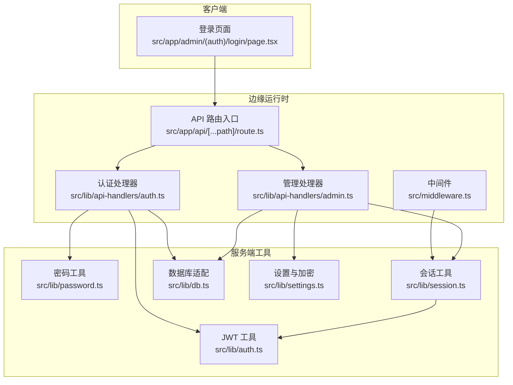
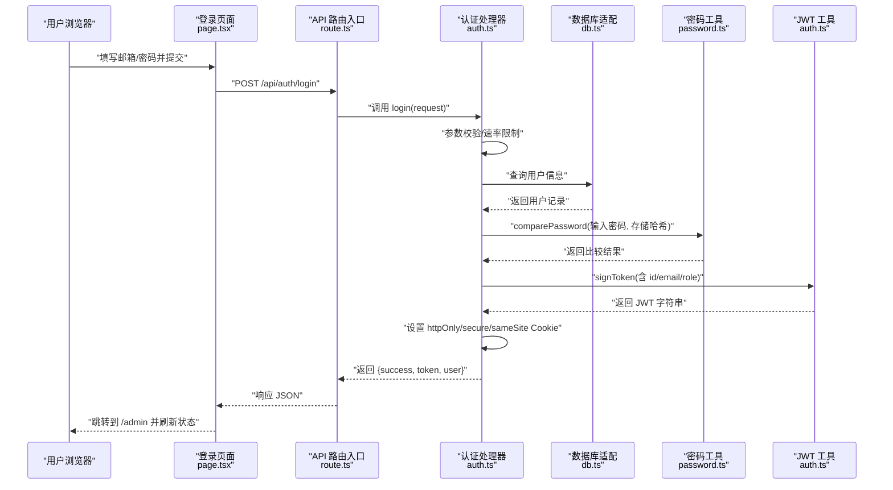
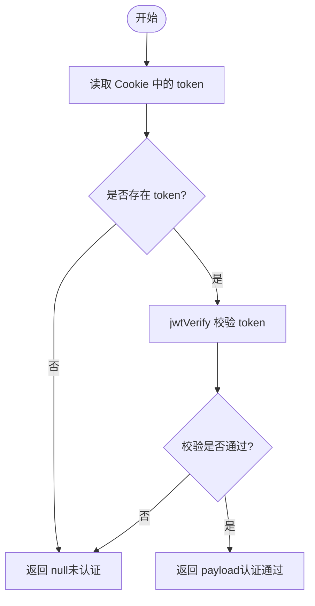
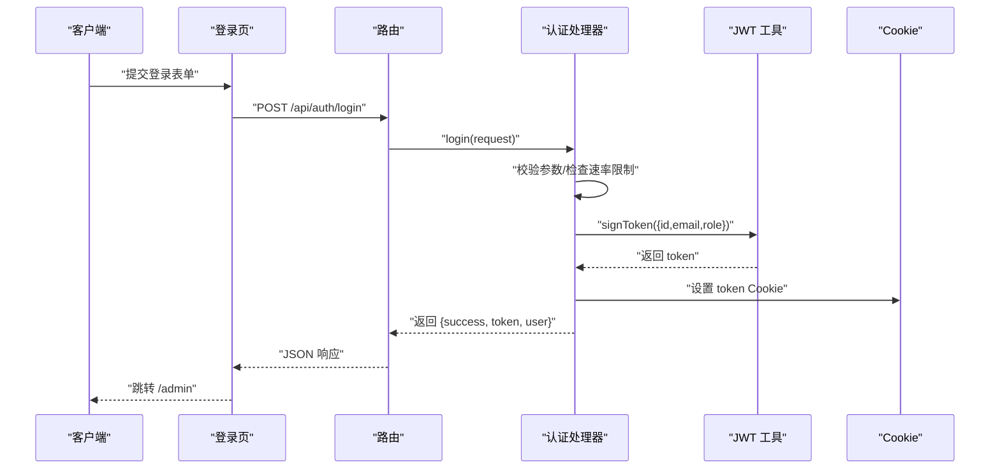
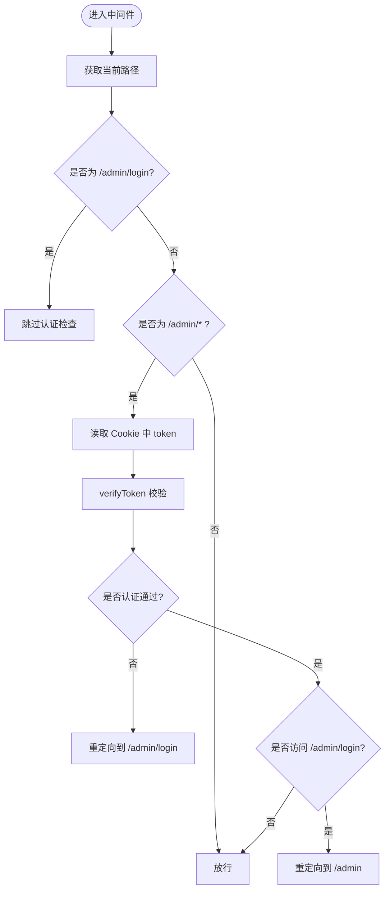
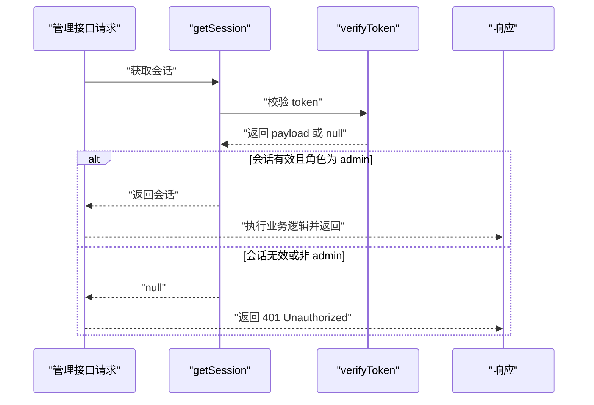
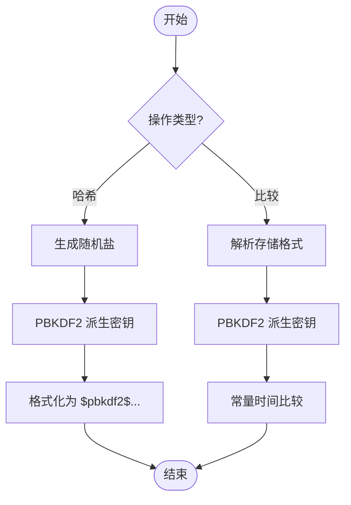
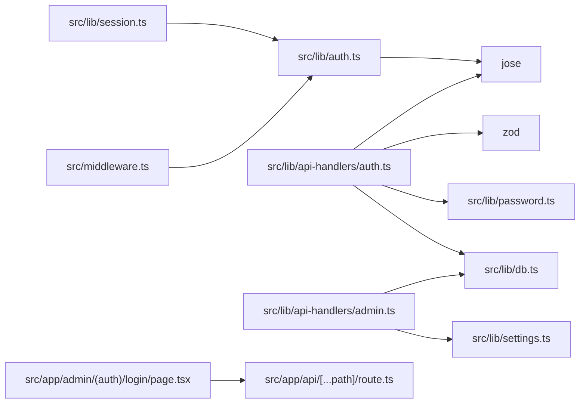

# 用户认证系统

<cite>
**本文档引用的文件**
- [src/lib/auth.ts](file://src/lib/auth.ts)
- [src/middleware.ts](file://src/middleware.ts)
- [src/app/admin/(auth)/login/page.tsx](file://src/app/admin/(auth)/login/page.tsx)
- [src/lib/session.ts](file://src/lib/session.ts)
- [src/lib/password.ts](file://src/lib/password.ts)
- [src/lib/db.ts](file://src/lib/db.ts)
- [src/app/api/[...path]/route.ts](file://src/app/api/[...path]/route.ts)
- [src/lib/api-handlers/auth.ts](file://src/lib/api-handlers/auth.ts)
- [src/lib/api-handlers/admin.ts](file://src/lib/api-handlers/admin.ts)
- [src/types/index.ts](file://src/types/index.ts)
- [src/lib/settings.ts](file://src/lib/settings.ts)
- [package.json](file://package.json)
- [.env.example](file://.env.example)
</cite>

## 目录
1. [简介](#简介)
2. [项目结构](#项目结构)
3. [核心组件](#核心组件)
4. [架构总览](#架构总览)
5. [详细组件分析](#详细组件分析)
6. [依赖关系分析](#依赖关系分析)
7. [性能考虑](#性能考虑)
8. [故障排除指南](#故障排除指南)
9. [结论](#结论)
10. [附录](#附录)

## 简介
本文件面向“用户认证系统”的实现与使用，重点覆盖以下方面：
- JWT 令牌机制：签名算法、过期策略、签发与校验流程
- 调用关系与接口：前端登录页、后端 API 路由、认证处理器、中间件、会话解析
- 使用模式：管理员登录、令牌签名与验证、会话管理、权限控制
- 配置项与参数：环境变量、Cookie 属性、速率限制
- 常见问题与解决方案：生产环境密钥缺失、令牌无效、权限不足等
- 技术深度与易用性兼顾，既适合初学者快速上手，也为资深开发者提供实现细节

## 项目结构
认证相关的核心文件分布如下：
- 认证核心逻辑：src/lib/auth.ts（JWT 签名/校验）、src/lib/password.ts（密码哈希/比较）
- 会话与中间件：src/lib/session.ts（服务端获取会话）、src/middleware.ts（路径拦截与重定向）
- API 路由与处理器：src/app/api/[...path]/route.ts（统一入口）、src/lib/api-handlers/auth.ts（登录/登出）、src/lib/api-handlers/admin.ts（受保护的管理接口）
- 数据访问：src/lib/db.ts（D1/SQLite 适配）
- 类型定义：src/types/index.ts（User/LoginResponse 等）
- 设置与加密：src/lib/settings.ts（R2 配置存储与 AES-GCM 加解密）
- 依赖与环境：package.json、.env.example

图表来源
- [src/app/admin/(auth)/login/page.tsx](file://src/app/admin/(auth)/login/page.tsx#L16-L43)
- [src/app/api/[...path]/route.ts](file://src/app/api/[...path]/route.ts#L1-L147)
- [src/lib/api-handlers/auth.ts](file://src/lib/api-handlers/auth.ts#L49-L141)
- [src/lib/api-handlers/admin.ts](file://src/lib/api-handlers/admin.ts#L9-L159)
- [src/middleware.ts](file://src/middleware.ts#L7-L43)
- [src/lib/auth.ts](file://src/lib/auth.ts#L1-L23)
- [src/lib/password.ts](file://src/lib/password.ts#L23-L105)
- [src/lib/session.ts](file://src/lib/session.ts#L4-L14)
- [src/lib/db.ts](file://src/lib/db.ts#L12-L69)
- [src/lib/settings.ts](file://src/lib/settings.ts#L68-L149)

章节来源
- [src/app/admin/(auth)/login/page.tsx](file://src/app/admin/(auth)/login/page.tsx#L1-L118)
- [src/app/api/[...path]/route.ts](file://src/app/api/[...path]/route.ts#L1-L147)
- [src/lib/api-handlers/auth.ts](file://src/lib/api-handlers/auth.ts#L49-L141)
- [src/lib/api-handlers/admin.ts](file://src/lib/api-handlers/admin.ts#L9-L159)
- [src/middleware.ts](file://src/middleware.ts#L1-L43)
- [src/lib/auth.ts](file://src/lib/auth.ts#L1-L23)
- [src/lib/password.ts](file://src/lib/password.ts#L1-L105)
- [src/lib/session.ts](file://src/lib/session.ts#L1-L14)
- [src/lib/db.ts](file://src/lib/db.ts#L1-L69)
- [src/lib/settings.ts](file://src/lib/settings.ts#L1-L149)
- [package.json](file://package.json#L12-L31)
- [.env.example](file://.env.example#L12-L29)

## 核心组件
- JWT 工具（src/lib/auth.ts）
  - 提供签发与校验 JWT 的方法，使用 HS256 算法，过期时间为 24 小时
  - 密钥来源于环境变量，若未配置则使用默认值（不建议用于生产）
- 密码工具（src/lib/password.ts）
  - 使用 Web Crypto API 的 PBKDF2 实现密码哈希与比较，支持常量时间比较
  - 对旧版 bcrypt 格式进行兼容性提示（无法验证）
- 会话工具（src/lib/session.ts）
  - 从 Cookie 读取 token 并调用 verifyToken 解析会话
- 中间件（src/middleware.ts）
  - 定义公开路径与受保护路径，拦截 /admin 路由
  - 从 Cookie 读取 token 并校验；未认证访问受保护路径时重定向到登录页；已认证访问登录页时重定向到仪表盘
- 认证处理器（src/lib/api-handlers/auth.ts）
  - 登录：参数校验、速率限制、查询用户、密码比较、签发 JWT、写入 Cookie
  - 登出：删除 token Cookie
- 管理处理器（src/lib/api-handlers/admin.ts）
  - 受保护接口通过 getSession 校验权限（仅 admin 角色）
  - 支持修改邮箱/密码、读取/更新 R2 存储配置
- API 路由入口（src/app/api/[...path]/route.ts）
  - 统一分发 GET/POST/PUT/DELETE 请求至对应处理器
- 数据库适配（src/lib/db.ts）
  - 在 Next.js App Router 中适配 Cloudflare D1 绑定，支持本地开发回退
- 类型定义（src/types/index.ts）
  - User、Category、Link、ApiResponse、LoginResponse 等接口
- 设置与加密（src/lib/settings.ts）
  - 使用 AES-GCM 对敏感配置进行加解密存储于数据库

章节来源
- [src/lib/auth.ts](file://src/lib/auth.ts#L1-L23)
- [src/lib/password.ts](file://src/lib/password.ts#L23-L105)
- [src/lib/session.ts](file://src/lib/session.ts#L4-L14)
- [src/middleware.ts](file://src/middleware.ts#L7-L43)
- [src/lib/api-handlers/auth.ts](file://src/lib/api-handlers/auth.ts#L49-L141)
- [src/lib/api-handlers/admin.ts](file://src/lib/api-handlers/admin.ts#L9-L159)
- [src/app/api/[...path]/route.ts](file://src/app/api/[...path]/route.ts#L1-L147)
- [src/lib/db.ts](file://src/lib/db.ts#L12-L69)
- [src/types/index.ts](file://src/types/index.ts#L1-L53)
- [src/lib/settings.ts](file://src/lib/settings.ts#L68-L149)

## 架构总览
下图展示从用户提交登录表单到成功进入后台的整体流程，包括前端交互、API 处理、JWT 签发与 Cookie 写入、中间件拦截与权限校验。

图表来源
- [src/app/admin/(auth)/login/page.tsx](file://src/app/admin/(auth)/login/page.tsx#L16-L43)
- [src/app/api/[...path]/route.ts](file://src/app/api/[...path]/route.ts#L54-L59)
- [src/lib/api-handlers/auth.ts](file://src/lib/api-handlers/auth.ts#L49-L129)
- [src/lib/db.ts](file://src/lib/db.ts#L12-L69)
- [src/lib/password.ts](file://src/lib/password.ts#L53-L105)
- [src/lib/auth.ts](file://src/lib/auth.ts#L7-L22)

## 详细组件分析

### JWT 令牌机制与实现
- 签名与过期
  - 使用 HS256 算法，过期时间为 24 小时
  - 密钥来自环境变量，若未配置则使用默认值（不安全）
- 校验流程
  - 从 Cookie 读取 token，调用 jwtVerify 进行校验
  - 校验失败返回空负载，用于中间件与会话判断
- 会话解析
  - 服务端 getSession 从 Cookie 读取 token 并校验，返回 payload 作为会话上下文

图表来源
- [src/middleware.ts](file://src/middleware.ts#L16-L21)
- [src/lib/session.ts](file://src/lib/session.ts#L4-L14)
- [src/lib/auth.ts](file://src/lib/auth.ts#L15-L22)

章节来源
- [src/lib/auth.ts](file://src/lib/auth.ts#L1-L23)
- [src/lib/session.ts](file://src/lib/session.ts#L4-L14)
- [src/middleware.ts](file://src/middleware.ts#L16-L35)

### 管理员登录流程
- 前端登录页
  - 表单提交到 /api/auth/login，发送邮箱与密码
  - 成功后跳转到 /admin 并刷新状态
- 后端登录处理
  - 参数校验（Zod），速率限制（按 IP 窗口计数）
  - 查询用户并比较密码哈希
  - 签发 JWT 并设置 Cookie（httpOnly/secure/sameSite/24h）
  - 返回 {success, token, user}
- 权限控制
  - 受保护的管理接口通过 getSession 校验角色为 admin

图表来源
- [src/app/admin/(auth)/login/page.tsx](file://src/app/admin/(auth)/login/page.tsx#L16-L43)
- [src/app/api/[...path]/route.ts](file://src/app/api/[...path]/route.ts#L54-L59)
- [src/lib/api-handlers/auth.ts](file://src/lib/api-handlers/auth.ts#L49-L129)
- [src/lib/auth.ts](file://src/lib/auth.ts#L7-L22)

章节来源
- [src/app/admin/(auth)/login/page.tsx](file://src/app/admin/(auth)/login/page.tsx#L16-L43)
- [src/lib/api-handlers/auth.ts](file://src/lib/api-handlers/auth.ts#L49-L129)

### 中间件与权限控制
- 路径规则
  - 公开路径：/admin/login
  - 受保护路径：/admin/*
- 行为
  - 访问受保护路径且未认证：重定向到 /admin/login
  - 访问 /admin/login 且已认证：重定向到 /admin
  - 其他情况：放行

图表来源
- [src/middleware.ts](file://src/middleware.ts#L7-L43)

章节来源
- [src/middleware.ts](file://src/middleware.ts#L7-L43)

### 会话管理与权限控制
- 会话解析
  - 服务端 getSession 从 Cookie 读取 token 并校验，返回 payload
- 管理接口权限
  - 受保护的管理接口（如安全设置、统计、设置）通过 getSession 判断角色是否为 admin
  - 不满足条件返回 401 Unauthorized

图表来源
- [src/lib/session.ts](file://src/lib/session.ts#L4-L14)
- [src/lib/api-handlers/admin.ts](file://src/lib/api-handlers/admin.ts#L12-L15)

章节来源
- [src/lib/session.ts](file://src/lib/session.ts#L4-L14)
- [src/lib/api-handlers/admin.ts](file://src/lib/api-handlers/admin.ts#L12-L15)

### 密码哈希与比较
- 哈希算法
  - PBKDF2，100,000 次迭代，盐长 16 字节，输出 32 字节（256 位）
  - 格式：$pbkdf2$iterations$salt$hash
- 比较策略
  - 常量时间比较，避免时序攻击
  - 对旧版 bcrypt 格式给出警告（无法验证）

图表来源
- [src/lib/password.ts](file://src/lib/password.ts#L23-L105)

章节来源
- [src/lib/password.ts](file://src/lib/password.ts#L23-L105)

### 数据库适配与 API 分发
- 数据库适配
  - 优先从 Edge 上下文获取 D1 绑定；否则回退到环境变量绑定
  - 支持 SELECT/INSERT/UPDATE/DELETE 以及 RETURNING 语法
- API 分发
  - 统一入口根据路径分发到不同处理器（认证、分类、链接、导入导出、元数据、管理）

章节来源
- [src/lib/db.ts](file://src/lib/db.ts#L12-L69)
- [src/app/api/[...path]/route.ts](file://src/app/api/[...path]/route.ts#L12-L147)

### 设置与加密（R2 配置）
- 加密方案
  - 使用 AES-GCM，密钥通过 SHA-256 摘要派生
  - 将 IV 与密文拼接并 Base64 编码存储
- 表结构
  - app_settings 表，唯一索引 user_id，字段包含各 R2 配置项的密文
- 读取/更新
  - 读取时解密并屏蔽敏感信息显示
  - 更新时按需加密并写入数据库

章节来源
- [src/lib/settings.ts](file://src/lib/settings.ts#L14-L149)

## 依赖关系分析
- 运行时与依赖
  - jose：JWT 签名与校验
  - next/headers：读取 Cookie 与请求头
  - zod：请求体参数校验
  - Web Crypto API：PBKDF2 与 AES-GCM
- 环境变量
  - JWT_SECRET：JWT 密钥（生产必须配置）
  - ADMIN_EMAIL/ADMIN_PASSWORD：初始管理员账户（建议在首次初始化时设置）
  - SETTINGS_ENCRYPTION_KEY：应用设置加密密钥
  - R2_*：Cloudflare R2 存储配置

图表来源
- [package.json](file://package.json#L20-L30)
- [src/lib/auth.ts](file://src/lib/auth.ts#L1-L2)
- [src/lib/api-handlers/auth.ts](file://src/lib/api-handlers/auth.ts#L1-L8)
- [src/lib/api-handlers/admin.ts](file://src/lib/api-handlers/admin.ts#L1-L8)
- [src/lib/password.ts](file://src/lib/password.ts#L1-L105)
- [src/lib/db.ts](file://src/lib/db.ts#L1-L69)
- [src/lib/settings.ts](file://src/lib/settings.ts#L1-L149)
- [src/lib/session.ts](file://src/lib/session.ts#L1-L14)
- [src/middleware.ts](file://src/middleware.ts#L1-L4)
- [src/app/admin/(auth)/login/page.tsx](file://src/app/admin/(auth)/login/page.tsx#L1-L10)
- [src/app/api/[...path]/route.ts](file://src/app/api/[...path]/route.ts#L1-L9)

章节来源
- [package.json](file://package.json#L12-L31)
- [.env.example](file://.env.example#L12-L29)

## 性能考虑
- Edge 运行时
  - 使用 jose 与 Web Crypto API，适合在边缘运行时部署
  - 中间件与 API 处理均采用异步流程，避免阻塞
- 速率限制
  - 基于 IP 的简单内存窗口计数，防止暴力破解
- Cookie 优化
  - httpOnly 防止 XSS；secure 在生产环境启用；sameSite 严格；maxAge 24h
- 数据库访问
  - 使用模板字符串 SQL 与预编译语句，减少注入风险

## 故障排除指南
- 生产环境缺少 JWT_SECRET
  - 现象：登录接口返回服务器配置错误
  - 处理：设置 JWT_SECRET 环境变量并重启服务
- 令牌无效或过期
  - 现象：中间件重定向到登录页；会话解析返回 null
  - 处理：重新登录获取新令牌；确认系统时间同步
- 权限不足
  - 现象：管理接口返回 401 Unauthorized
  - 处理：确保用户角色为 admin；必要时重新登录
- 密码格式不正确
  - 现象：登录失败或提示无效凭据
  - 处理：确认密码长度与格式；如使用旧版 bcrypt 哈希，需迁移至 PBKDF2
- R2 配置读取失败
  - 现象：设置加载异常或解密报错
  - 处理：检查 SETTINGS_ENCRYPTION_KEY 是否一致；确认数据库表存在

章节来源
- [src/lib/api-handlers/auth.ts](file://src/lib/api-handlers/auth.ts#L68-L73)
- [src/middleware.ts](file://src/middleware.ts#L24-L32)
- [src/lib/session.ts](file://src/lib/session.ts#L4-L14)
- [src/lib/password.ts](file://src/lib/password.ts#L55-L63)
- [src/lib/settings.ts](file://src/lib/settings.ts#L103-L110)

## 结论
该认证系统基于 JWT 与 Edge 运行时构建，具备以下特点：
- 易用性：前端登录页直连 /api/auth/login，成功后自动跳转
- 安全性：HS256 签名、httpOnly/secure/sameSite Cookie、常量时间比较、速率限制
- 可扩展性：统一 API 路由入口，模块化处理器，支持后续添加更多受保护接口
- 可维护性：明确的中间件与会话解析流程，清晰的类型定义与环境变量说明

建议在生产环境中：
- 强制设置 JWT_SECRET 与 SETTINGS_ENCRYPTION_KEY
- 使用 HTTPS 与安全的 Cookie 属性
- 定期轮换密钥并监控登录失败次数
- 对数据库访问进行审计与备份

## 附录

### 接口与参数说明
- 登录接口
  - 方法：POST
  - 路径：/api/auth/login
  - 请求体：{ email, password }
  - 成功响应：{ success: true, token, user }
  - 失败响应：{ success: false, message }
- 登出接口
  - 方法：POST
  - 路径：/api/auth/logout
  - 成功响应：{ success: true, message }
- 管理接口（示例）
  - 安全设置：POST /api/admin/security（需要 admin 权限）
  - 读取设置：GET /api/admin/settings（需要 admin 权限）
  - 统计数据：GET /api/admin/stats（需要 admin 权限）

章节来源
- [src/app/api/[...path]/route.ts](file://src/app/api/[...path]/route.ts#L54-L93)
- [src/lib/api-handlers/auth.ts](file://src/lib/api-handlers/auth.ts#L49-L141)
- [src/lib/api-handlers/admin.ts](file://src/lib/api-handlers/admin.ts#L31-L159)

### 配置选项
- 环境变量
  - JWT_SECRET：JWT 密钥（生产必填）
  - ADMIN_EMAIL/ADMIN_PASSWORD：初始管理员账户（建议在初始化时设置）
  - SETTINGS_ENCRYPTION_KEY：应用设置加密密钥
  - R2_ACCOUNT_ID/ACCESS_KEY_ID/SECRET_ACCESS_KEY/BUCKET_NAME/PUBLIC_BASE_URL：R2 存储配置
- Cookie 属性
  - httpOnly: true
  - secure: 根据 NODE_ENV 决定
  - sameSite: strict
  - maxAge: 86400（24 小时）
  - path: /

章节来源
- [.env.example](file://.env.example#L12-L29)
- [src/lib/api-handlers/auth.ts](file://src/lib/api-handlers/auth.ts#L105-L112)