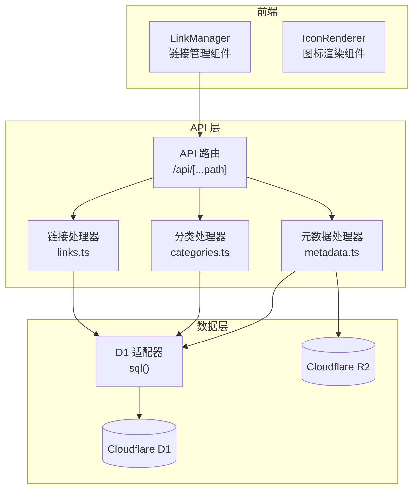
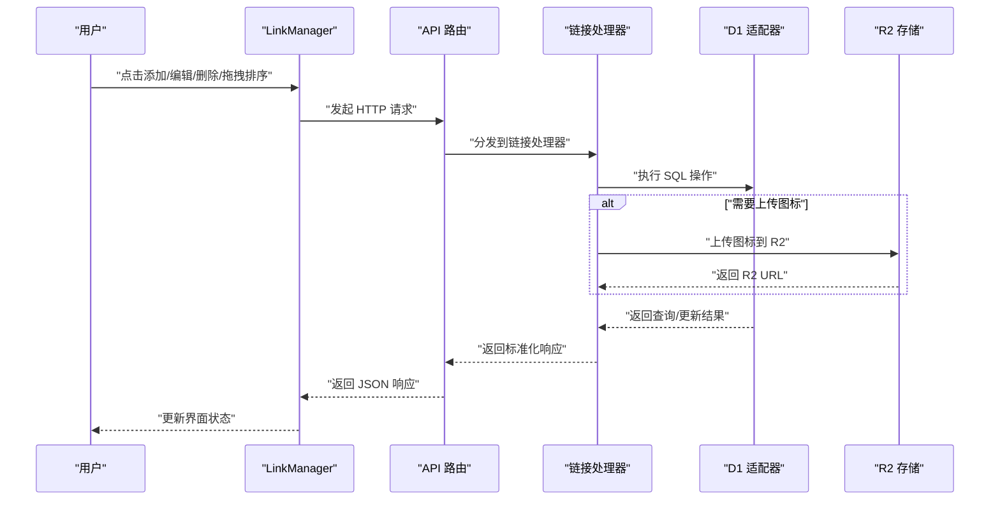
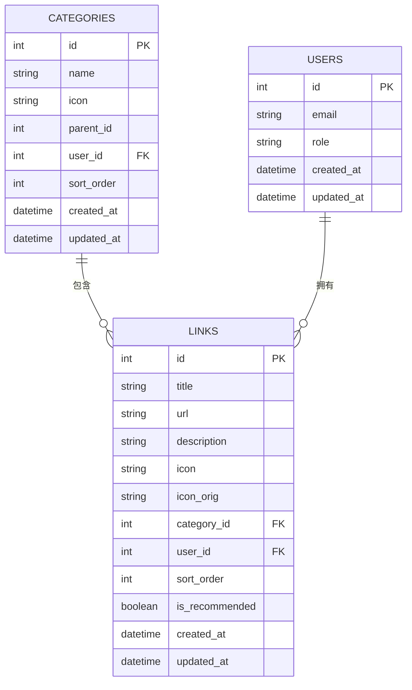
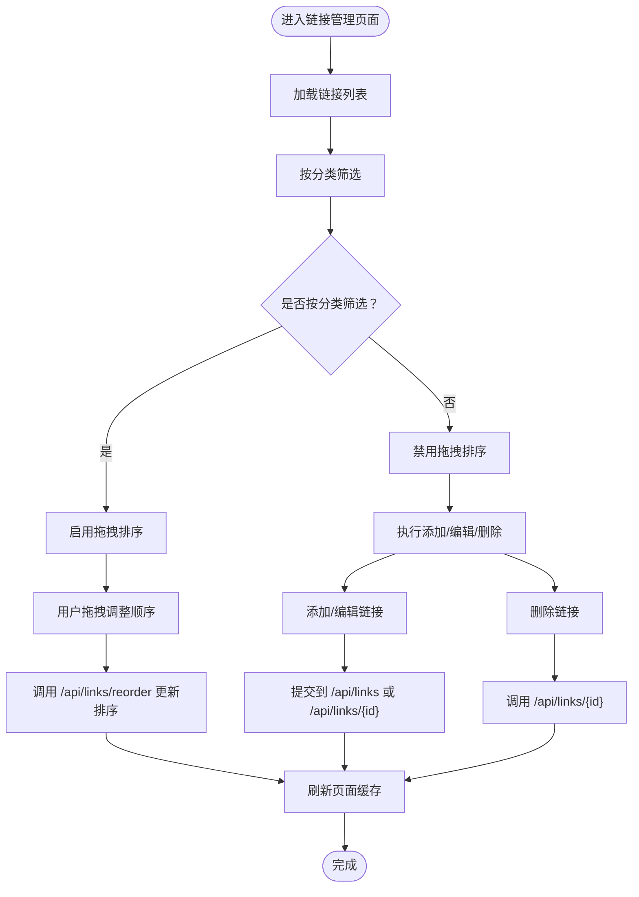
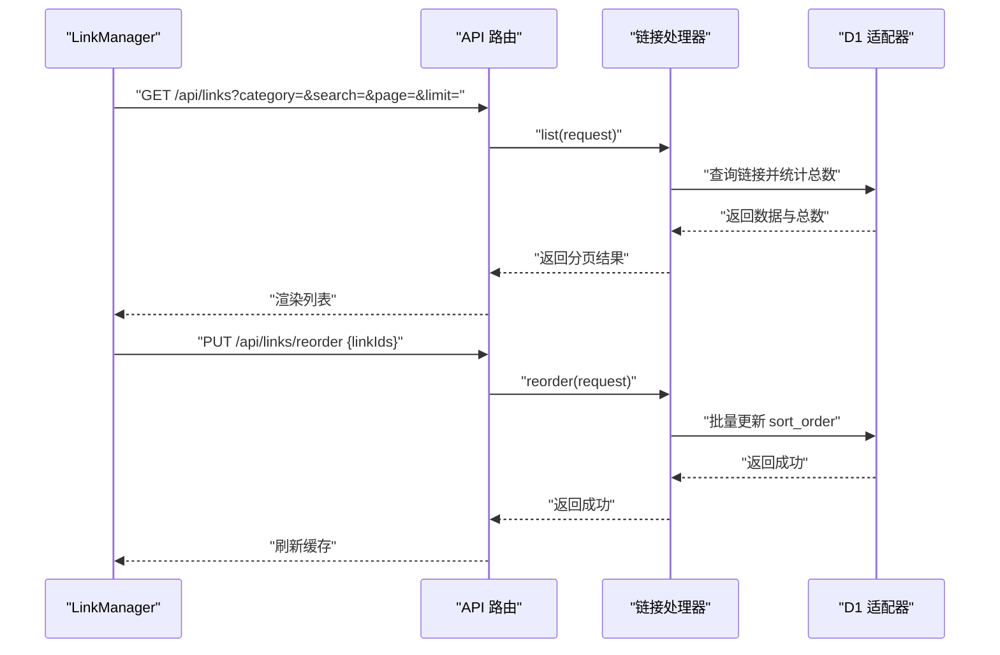
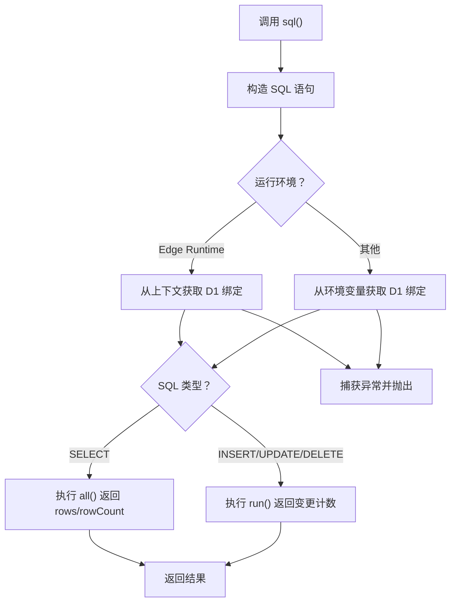
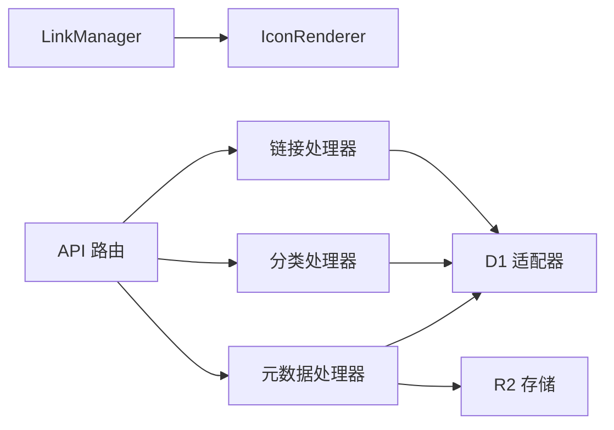

# 链接管理系统

<cite>
**本文档引用的文件**
- [src/lib/db.ts](file://src/lib/db.ts)
- [src/types/index.ts](file://src/types/index.ts)
- [src/components/admin/LinkManager.tsx](file://src/components/admin/LinkManager.tsx)
- [src/lib/api-handlers/links.ts](file://src/lib/api-handlers/links.ts)
- [src/app/api/[...path]/route.ts](file://src/app/api/[...path]/route.ts)
- [src/lib/api-handlers/metadata.ts](file://src/lib/api-handlers/metadata.ts)
- [src/lib/api-handlers/categories.ts](file://src/lib/api-handlers/categories.ts)
- [src/lib/settings.ts](file://src/lib/settings.ts)
- [src/components/ui/IconRenderer.tsx](file://src/components/ui/IconRenderer.tsx)
</cite>

## 目录
1. [简介](#简介)
2. [项目结构](#项目结构)
3. [核心组件](#核心组件)
4. [架构总览](#架构总览)
5. [详细组件分析](#详细组件分析)
6. [依赖关系分析](#依赖关系分析)
7. [性能考虑](#性能考虑)
8. [故障排查指南](#故障排查指南)
9. [结论](#结论)
10. [附录](#附录)

## 简介
本系统是一个基于 Next.js App Router 的链接管理系统，采用 Cloudflare Workers Pages 部署，使用 Cloudflare D1 作为数据库，R2 存储图标资源。系统提供链接的增删改查、拖拽排序、推荐标记、分类管理以及元数据抓取等功能，并通过管理界面提供直观的操作体验。

## 项目结构
系统采用分层架构：
- 前端管理界面：React 组件负责用户交互与状态管理
- API 层：Next.js App Router 路由处理请求，调用后端处理器
- 数据访问层：统一的 D1 SQL 适配器，支持 Edge Runtime 与本地回退
- 类型定义：共享 TypeScript 接口确保前后端一致性

**图表来源**
- [src/components/admin/LinkManager.tsx](file://src/components/admin/LinkManager.tsx#L1-L543)
- [src/app/api/[...path]/route.ts](file://src/app/api/[...path]/route.ts#L1-L146)
- [src/lib/api-handlers/links.ts](file://src/lib/api-handlers/links.ts#L1-L270)
- [src/lib/api-handlers/categories.ts](file://src/lib/api-handlers/categories.ts#L1-L199)
- [src/lib/api-handlers/metadata.ts](file://src/lib/api-handlers/metadata.ts#L1-L172)
- [src/lib/db.ts](file://src/lib/db.ts#L1-L69)

**章节来源**
- [src/components/admin/LinkManager.tsx](file://src/components/admin/LinkManager.tsx#L1-L543)
- [src/app/api/[...path]/route.ts](file://src/app/api/[...path]/route.ts#L1-L146)
- [src/lib/db.ts](file://src/lib/db.ts#L1-L69)

## 核心组件
- 链接数据模型：定义了链接的字段、排序与推荐标记等属性
- 链接管理器：提供 CRUD、拖拽排序、元数据抓取、推荐标记等功能
- API 处理器：封装链接、分类、元数据的业务逻辑
- D1 适配器：统一 SQL 执行接口，支持 Edge Runtime 与本地回退
- 图标渲染器：根据图标名称渲染 Lucide 图标

**章节来源**
- [src/types/index.ts](file://src/types/index.ts#L21-L34)
- [src/components/admin/LinkManager.tsx](file://src/components/admin/LinkManager.tsx#L1-L543)
- [src/lib/api-handlers/links.ts](file://src/lib/api-handlers/links.ts#L1-L270)
- [src/lib/db.ts](file://src/lib/db.ts#L12-L68)
- [src/components/ui/IconRenderer.tsx](file://src/components/ui/IconRenderer.tsx#L185-L191)

## 架构总览
系统采用“前端组件 + Next.js API 路由 + 后端处理器 + D1/R2”的分层设计。前端通过 fetch 调用 /api 路由，路由根据路径分发到对应处理器；处理器执行业务逻辑并通过 D1 适配器访问数据库，必要时通过 R2 存储图标资源。

**图表来源**
- [src/components/admin/LinkManager.tsx](file://src/components/admin/LinkManager.tsx#L200-L276)
- [src/app/api/[...path]/route.ts](file://src/app/api/[...path]/route.ts#L26-L124)
- [src/lib/api-handlers/links.ts](file://src/lib/api-handlers/links.ts#L69-L140)
- [src/lib/api-handlers/metadata.ts](file://src/lib/api-handlers/metadata.ts#L119-L152)
- [src/lib/db.ts](file://src/lib/db.ts#L42-L62)

## 详细组件分析

### 链接数据模型与类型定义
- 字段说明
  - id：自增主键
  - title：链接标题，长度限制 1-200
  - url：链接地址，需符合 URL 格式
  - description：描述，最大长度 500
  - icon/icon_orig：图标存储策略，优先使用 R2 URL，回退到原始 URL
  - category_id：所属分类
  - user_id：归属用户
  - sort_order：排序权重，数值越小排越前
  - is_recommended：是否推荐标记
  - created_at/updated_at：时间戳
- 关系
  - 链接属于一个分类（一对多）
  - 链接属于一个用户（一对多）

**图表来源**
- [src/types/index.ts](file://src/types/index.ts#L9-L19)
- [src/types/index.ts](file://src/types/index.ts#L21-L34)

**章节来源**
- [src/types/index.ts](file://src/types/index.ts#L21-L34)

### 链接管理器（LinkManager）组件
- 功能概览
  - 列表展示：支持按分类筛选、排序（sort_order 升序、创建时间降序）
  - CRUD 操作：添加、编辑、删除链接
  - 拖拽排序：基于 @dnd-kit 实现，仅在按分类筛选时启用
  - 元数据抓取：自动解析标题、描述、图标，支持上传至 R2
  - 推荐标记：勾选 is_recommended 字段
- 关键流程
  - 添加/编辑：校验必填字段，提交到 /api/links 或 /api/links/{id}
  - 删除：调用 /api/links/{id}
  - 排序：调用 /api/links/reorder，批量更新 sort_order
  - 元数据：调用 /api/fetch-metadata 抓取并可上传 R2

**图表来源**
- [src/components/admin/LinkManager.tsx](file://src/components/admin/LinkManager.tsx#L110-L130)
- [src/components/admin/LinkManager.tsx](file://src/components/admin/LinkManager.tsx#L296-L343)
- [src/components/admin/LinkManager.tsx](file://src/components/admin/LinkManager.tsx#L200-L276)
- [src/components/admin/LinkManager.tsx](file://src/components/admin/LinkManager.tsx#L278-L294)

**章节来源**
- [src/components/admin/LinkManager.tsx](file://src/components/admin/LinkManager.tsx#L58-L543)

### API 路由与处理器
- API 路由（/api/[...path]）
  - GET：/links → 调用 linksHandlers.list
  - PUT：/links/reorder → 调用 linksHandlers.reorder
  - PUT：/links/{id} → 调用 linksHandlers.update
  - DELETE：/links/{id} → 调用 linksHandlers.delete
- 链接处理器（linksHandlers）
  - list：支持分页、分类筛选、关键词搜索，按 sort_order 升序、created_at 降序排序
  - create：Zod 校验、去重检查（URL 归一化）、插入并返回新记录
  - update：Zod 校验、权限校验、更新并返回最新记录
  - delete：权限校验、软删除并返回被删除 id
  - reorder：批量更新 sort_order，按数组顺序赋值
- 元数据处理器（metadataHandlers）
  - 抓取网页标题、描述、OG 图片
  - 解析 link rel=icon，选择最优图标
  - 可选上传至 R2 并返回 R2 URL
- 分类处理器（categoriesHandlers）
  - 提供分类的增删改查，删除前检查是否有子分类或链接

**图表来源**
- [src/app/api/[...path]/route.ts](file://src/app/api/[...path]/route.ts#L26-L124)
- [src/lib/api-handlers/links.ts](file://src/lib/api-handlers/links.ts#L25-L67)
- [src/lib/api-handlers/links.ts](file://src/lib/api-handlers/links.ts#L237-L268)

**章节来源**
- [src/app/api/[...path]/route.ts](file://src/app/api/[...path]/route.ts#L1-L146)
- [src/lib/api-handlers/links.ts](file://src/lib/api-handlers/links.ts#L25-L270)
- [src/lib/api-handlers/metadata.ts](file://src/lib/api-handlers/metadata.ts#L5-L172)
- [src/lib/api-handlers/categories.ts](file://src/lib/api-handlers/categories.ts#L17-L199)

### D1 适配器与数据库访问
- 统一 SQL 接口：sql() 支持模板字符串拼接与参数绑定
- 运行环境检测：优先从 getRequestContext() 获取 D1 绑定，其次从环境变量读取
- 查询类型判断：SELECT 返回 rows 与 rowCount，非 SELECT 返回变更计数
- 错误处理：捕获异常并抛出，便于上层处理

**图表来源**
- [src/lib/db.ts](file://src/lib/db.ts#L12-L68)

**章节来源**
- [src/lib/db.ts](file://src/lib/db.ts#L1-L69)

### 图标渲染器（IconRenderer）
- 功能：根据图标名称渲染 Lucide 图标组件
- 使用场景：管理界面中的排序手柄、按钮图标等

**章节来源**
- [src/components/ui/IconRenderer.tsx](file://src/components/ui/IconRenderer.tsx#L185-L191)

## 依赖关系分析
- 组件依赖
  - LinkManager 依赖：@dnd-kit 实现拖拽排序；React Router 导航；UI 组件库
  - IconRenderer 依赖：lucide-react 图标库
- API 依赖
  - API 路由依赖各处理器模块
  - 处理器依赖 D1 适配器与会话认证
- 数据依赖
  - 链接与分类通过外键关联
  - 元数据抓取依赖网络请求与 R2 存储

**图表来源**
- [src/components/admin/LinkManager.tsx](file://src/components/admin/LinkManager.tsx#L1-L12)
- [src/app/api/[...path]/route.ts](file://src/app/api/[...path]/route.ts#L1-L9)
- [src/lib/api-handlers/links.ts](file://src/lib/api-handlers/links.ts#L1-L7)
- [src/lib/api-handlers/metadata.ts](file://src/lib/api-handlers/metadata.ts#L1-L4)

**章节来源**
- [src/components/admin/LinkManager.tsx](file://src/components/admin/LinkManager.tsx#L1-L12)
- [src/app/api/[...path]/route.ts](file://src/app/api/[...path]/route.ts#L1-L9)

## 性能考虑
- 排序策略
  - 后端按 sort_order 升序、created_at 降序排序，保证稳定显示
  - 前端拖拽排序仅在按分类筛选时启用，避免跨分类影响
- 缓存与重建
  - 每次写操作后调用 revalidatePath 清理缓存，确保数据一致性
- 网络请求
  - 元数据抓取设置合理的 User-Agent，避免被目标站点拦截
  - 图标上传 R2 时根据 content-type 设置 HTTP 元数据

[本节为通用建议，无需特定文件来源]

## 故障排查指南
- 无法连接 D1
  - 现象：控制台警告 D1 绑定未找到
  - 处理：确认使用 wrangler pages dev 启动，已在 Pages 配置中正确绑定 D1
- 401 未授权
  - 现象：添加/编辑/删除/排序返回未授权
  - 处理：检查登录状态与角色，确保为管理员
- 409 重复链接
  - 现象：添加链接时报重复
  - 处理：系统会对 URL 进行归一化比较，避免重复添加
- 排序失败
  - 现象：拖拽后排序未保存
  - 处理：检查 /api/links/reorder 是否返回成功；若失败，组件会回滚并刷新数据
- 元数据抓取失败
  - 现象：点击“获取信息”无响应或报错
  - 处理：确认 URL 正确、网络可达；检查 R2 绑定配置

**章节来源**
- [src/lib/db.ts](file://src/lib/db.ts#L64-L68)
- [src/lib/api-handlers/links.ts](file://src/lib/api-handlers/links.ts#L72-L74)
- [src/lib/api-handlers/links.ts](file://src/lib/api-handlers/links.ts#L107-L114)
- [src/components/admin/LinkManager.tsx](file://src/components/admin/LinkManager.tsx#L336-L341)
- [src/lib/api-handlers/metadata.ts](file://src/lib/api-handlers/metadata.ts#L13-L18)

## 结论
本链接管理系统以清晰的分层架构实现了链接的全生命周期管理，结合拖拽排序、推荐标记与元数据抓取，提供了良好的用户体验。通过统一的 D1 适配器与标准化的 API 设计，系统具备良好的可维护性与扩展性。建议后续可引入链接分类树形展示、批量操作与更细粒度的权限控制。

[本节为总结性内容，无需特定文件来源]

## 附录

### API 定义与参数
- 获取链接列表
  - 方法：GET
  - 路径：/api/links
  - 查询参数：
    - category：分类 ID（可选）
    - search：关键词（可选）
    - page：页码，默认 1
    - limit：每页数量，默认 20
  - 返回：success、data、pagination（page、limit、total、totalPages）
- 创建链接
  - 方法：POST
  - 路径：/api/links
  - 请求体字段：title、url、description（可选）、categoryId、icon（可选）、icon_orig（可选）、sort_order（可选）、is_recommended（可选）
  - 返回：success、data（新创建的链接）
- 更新链接
  - 方法：PUT
  - 路径：/api/links/{id}
  - 请求体字段：同创建
  - 返回：success、data（更新后的链接）
- 删除链接
  - 方法：DELETE
  - 路径：/api/links/{id}
  - 返回：success、data（被删除的 id）
- 重新排序
  - 方法：PUT
  - 路径：/api/links/reorder
  - 请求体字段：linkIds（数组，按新顺序传入 id）
  - 返回：success

**章节来源**
- [src/app/api/[...path]/route.ts](file://src/app/api/[...path]/route.ts#L26-L124)
- [src/lib/api-handlers/links.ts](file://src/lib/api-handlers/links.ts#L25-L270)

### 配置选项与环境变量
- SETTINGS_ENC_KEY 或 AUTH_SECRET：用于加密/解密 R2 配置的对称密钥
- R2 相关配置（通过设置管理页面配置，存储于 app_settings 表）
  - r2_access_key_id_enc：访问密钥（加密存储）
  - r2_secret_access_key_enc：私有密钥（加密存储）
  - r2_bucket_enc：存储桶名称（加密存储）
  - r2_endpoint_enc：终端节点（加密存储）
  - r2_public_base_enc：公共访问基础 URL（加密存储）
  - icon_max_kb：图标大小上限（KB）
  - icon_max_size：图标最大尺寸（像素）

**章节来源**
- [src/lib/settings.ts](file://src/lib/settings.ts#L14-L29)
- [src/lib/settings.ts](file://src/lib/settings.ts#L87-L111)
- [src/lib/settings.ts](file://src/lib/settings.ts#L113-L148)