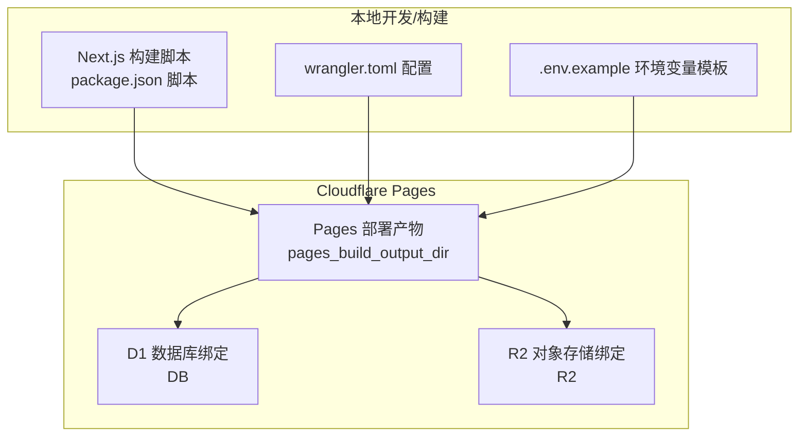
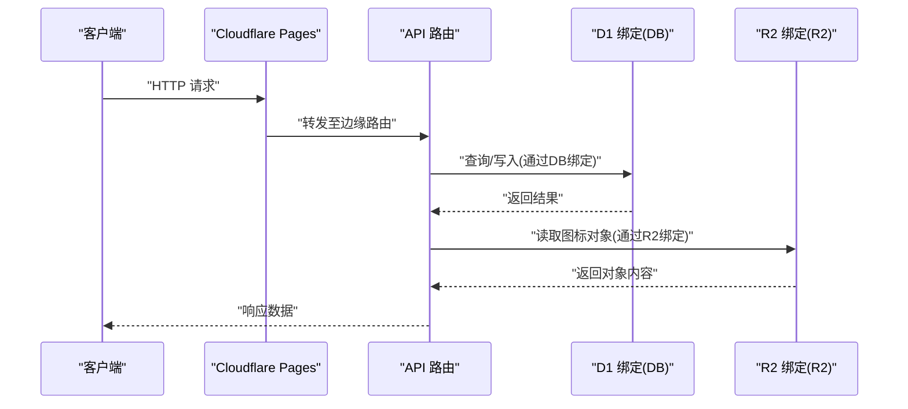
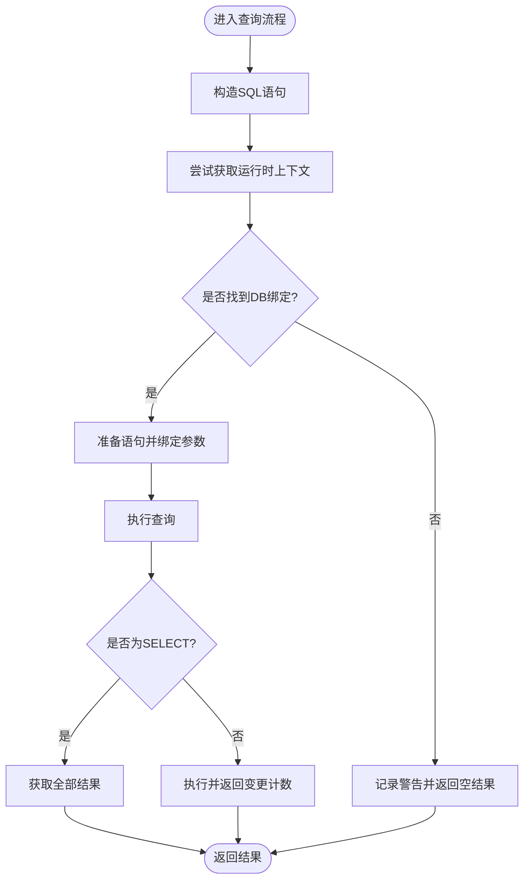
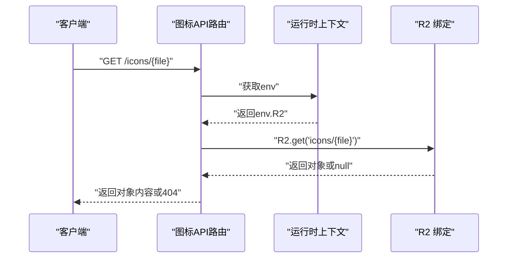
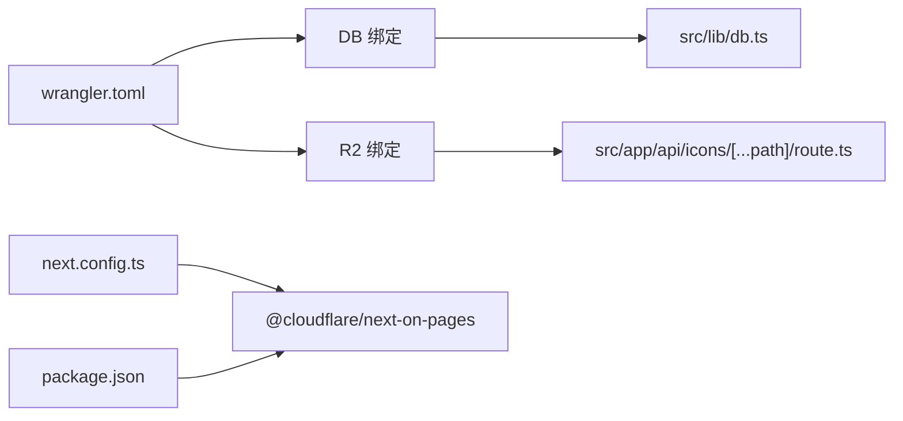

# Cloudflare Workers配置

<cite>
**本文档引用的文件**
- [wrangler.toml](file://wrangler.toml)
- [package.json](file://package.json)
- [.env.example](file://.env.example)
- [src/lib/db.ts](file://src/lib/db.ts)
- [src/lib/r2.ts](file://src/lib/r2.ts)
- [src/lib/settings.ts](file://src/lib/settings.ts)
- [src/app/api/[...path]/route.ts](file://src/app/api/[...path]/route.ts)
- [src/app/api/icons/[...path]/route.ts](file://src/app/api/icons/[...path]/route.ts)
- [src/middleware.ts](file://src/middleware.ts)
- [next.config.ts](file://next.config.ts)
</cite>

## 目录
1. [简介](#简介)
2. [项目结构](#项目结构)
3. [核心组件](#核心组件)
4. [架构总览](#架构总览)
5. [详细组件分析](#详细组件分析)
6. [依赖关系分析](#依赖关系分析)
7. [性能考虑](#性能考虑)
8. [故障排查指南](#故障排查指南)
9. [结论](#结论)
10. [附录](#附录)

## 简介
本文件面向Cloudflare Workers与Pages部署场景，系统化梳理wrangler.toml配置项及其在Next.js应用中的集成方式，重点覆盖以下方面：
- Worker名称、兼容性日期、Node.js兼容标志、构建输出目录等核心配置
- D1数据库绑定（DB）与R2对象存储绑定（R2）的配置与使用
- 数据库连接与环境变量引用、安全配置要点
- 配置验证方法与常见错误的解决方案
- 开发与生产环境配置差异对比

## 项目结构
该仓库采用Next.js App Router架构，并通过Cloudflare Pages进行边缘部署。关键配置集中在wrangler.toml中，配合Next.js构建脚本与运行时特性，实现Edge运行时下的数据库与对象存储访问。

图表来源
- [wrangler.toml](file://wrangler.toml#L1-L14)
- [package.json](file://package.json#L5-L11)
- [.env.example](file://.env.example#L1-L29)

章节来源
- [wrangler.toml](file://wrangler.toml#L1-L14)
- [package.json](file://package.json#L5-L11)
- [.env.example](file://.env.example#L1-L29)

## 核心组件
- Worker名称：用于标识部署单元，便于在Cloudflare仪表板中识别与管理。
- 兼容性日期：决定Workers运行时行为与API可用性的兼容策略。
- Node.js兼容标志：启用部分Node.js生态能力，便于迁移与复用现有逻辑。
- 构建输出目录：Pages部署要求的静态资源输出路径，确保正确打包与发布。

章节来源
- [wrangler.toml](file://wrangler.toml#L1-L4)

## 架构总览
下图展示了从请求到数据库与对象存储的调用链路，以及配置如何影响运行时行为。

图表来源
- [src/app/api/[...path]/route.ts](file://src/app/api/[...path]/route.ts#L1-L147)
- [src/app/api/icons/[...path]/route.ts](file://src/app/api/icons/[...path]/route.ts#L1-L37)
- [src/lib/db.ts](file://src/lib/db.ts#L1-L69)
- [wrangler.toml](file://wrangler.toml#L6-L13)

## 详细组件分析

### wrangler.toml 配置详解
- Worker名称
  - 作用：唯一标识部署的Worker/Pages站点。
  - 参考路径：[wrangler.toml](file://wrangler.toml#L1)
- 兼容性日期
  - 作用：控制运行时API与行为的兼容版本，建议与Next.js与Workers类型版本匹配。
  - 参考路径：[wrangler.toml](file://wrangler.toml#L2)
- Node.js兼容标志
  - 作用：启用部分Node.js兼容能力，便于在Edge环境中复用Node生态代码。
  - 参考路径：[wrangler.toml](file://wrangler.toml#L3)
- 构建输出目录
  - 作用：Pages部署所需的静态资源输出路径，需与Next-on-Pages脚本一致。
  - 参考路径：[wrangler.toml](file://wrangler.toml#L4)
- D1数据库绑定（DB）
  - binding：在代码中使用的数据库引用名。
  - database_name：数据库名称。
  - database_id：数据库UUID。
  - 参考路径：[wrangler.toml](file://wrangler.toml#L6-L10)
- R2对象存储绑定（R2）
  - binding：在代码中使用的R2引用名。
  - bucket_name：R2桶名称。
  - 参考路径：[wrangler.toml](file://wrangler.toml#L11-L14)

章节来源
- [wrangler.toml](file://wrangler.toml#L1-L14)

### D1数据库绑定配置与使用
- 绑定声明
  - 在wrangler.toml中通过[[d1_databases]]段落声明DB绑定，字段包括binding、database_name、database_id。
  - 参考路径：[wrangler.toml](file://wrangler.toml#L6-L10)
- 运行时获取与查询
  - 在Edge运行时通过getRequestContext()获取上下文，从env中读取DB绑定。
  - 查询封装在sql函数中，支持SELECT与非SELECT分支处理。
  - 参考路径：
    - [src/lib/db.ts](file://src/lib/db.ts#L27-L68)
    - [src/app/api/[...path]/route.ts](file://src/app/api/[...path]/route.ts#L1-L147)

图表来源
- [src/lib/db.ts](file://src/lib/db.ts#L12-L68)

章节来源
- [wrangler.toml](file://wrangler.toml#L6-L10)
- [src/lib/db.ts](file://src/lib/db.ts#L1-L69)
- [src/app/api/[...path]/route.ts](file://src/app/api/[...path]/route.ts#L1-L147)

### R2对象存储绑定配置与使用
- 绑定声明
  - 在wrangler.toml中通过[[r2_buckets]]段落声明R2绑定，字段包括binding、bucket_name。
  - 参考路径：[wrangler.toml](file://wrangler.toml#L11-L14)
- 运行时读取对象
  - 在API路由中通过getRequestContext()获取env.R2，按对象键读取并返回内容。
  - 参考路径：
    - [src/app/api/icons/[...path]/route.ts](file://src/app/api/icons/[...path]/route.ts#L1-L37)
- 自定义上传签名（可选）
  - 提供了基于Web Crypto API的AWS Signature V4简化实现，可在Edge环境下直接上传。
  - 参考路径：[src/lib/r2.ts](file://src/lib/r2.ts#L1-L103)

图表来源
- [src/app/api/icons/[...path]/route.ts](file://src/app/api/icons/[...path]/route.ts#L6-L36)

章节来源
- [wrangler.toml](file://wrangler.toml#L11-L14)
- [src/app/api/icons/[...path]/route.ts](file://src/app/api/icons/[...path]/route.ts#L1-L37)
- [src/lib/r2.ts](file://src/lib/r2.ts#L1-L103)

### 环境变量与安全配置
- 环境变量模板
  - .env.example提供了数据库、认证、R2存储、应用设置加密等示例键名，便于本地与CI/CD注入。
  - 参考路径：[.env.example](file://.env.example#L1-L29)
- 设置表与加密存储
  - 应用侧通过D1维护app_settings表，敏感信息以AES-GCM加密后存储，运行时解密使用。
  - 参考路径：
    - [src/lib/settings.ts](file://src/lib/settings.ts#L68-L85)
    - [src/lib/settings.ts](file://src/lib/settings.ts#L87-L111)
    - [src/lib/settings.ts](file://src/lib/settings.ts#L113-L148)

章节来源
- [.env.example](file://.env.example#L1-L29)
- [src/lib/settings.ts](file://src/lib/settings.ts#L1-L149)

### 开发与生产环境差异
- 构建脚本
  - pages:build脚本负责先执行Next构建，再执行@cloudflare/next-on-pages生成Pages产物，并清理临时文件。
  - 参考路径：[package.json](file://package.json#L8)
- 运行时特性
  - Edge运行时限制较多，需避免使用Node专有模块；项目通过webpack别名与turbopack别名强制忽略相关包。
  - 参考路径：
    - [next.config.ts](file://next.config.ts#L16-L29)
    - [next.config.ts](file://next.config.ts#L21-L30)
- 认证中间件
  - 通过实验性Edge运行时与自定义中间件实现登录状态校验与重定向。
  - 参考路径：[src/middleware.ts](file://src/middleware.ts#L1-L43)

章节来源
- [package.json](file://package.json#L5-L11)
- [next.config.ts](file://next.config.ts#L1-L41)
- [src/middleware.ts](file://src/middleware.ts#L1-L43)

## 依赖关系分析
- 配置耦合点
  - wrangler.toml中的binding名称需与代码中读取的键名一致（如DB、R2）。
  - 构建输出目录需与Pages部署要求一致，避免产物路径不匹配。
- 外部依赖
  - @cloudflare/next-on-pages：将Next.js应用转换为Pages可部署形态。
  - @cloudflare/workers-types：Workers类型定义，辅助DB/R2等绑定的类型推断。
- 内部依赖
  - API路由依赖D1与R2绑定进行数据与对象存取；设置模块依赖D1进行敏感信息的加密存储。

图表来源
- [wrangler.toml](file://wrangler.toml#L1-L14)
- [src/lib/db.ts](file://src/lib/db.ts#L1-L69)
- [src/app/api/icons/[...path]/route.ts](file://src/app/api/icons/[...path]/route.ts#L1-L37)
- [next.config.ts](file://next.config.ts#L1-L41)
- [package.json](file://package.json#L33-L33)

章节来源
- [wrangler.toml](file://wrangler.toml#L1-L14)
- [src/lib/db.ts](file://src/lib/db.ts#L1-L69)
- [src/app/api/icons/[...path]/route.ts](file://src/app/api/icons/[...path]/route.ts#L1-L37)
- [next.config.ts](file://next.config.ts#L1-L41)
- [package.json](file://package.json#L33-L33)

## 性能考虑
- 减少打包体积
  - 通过webpack与turbopack别名排除Node专有模块，降低打包体积并避免运行时错误。
  - 参考路径：[next.config.ts](file://next.config.ts#L16-L29)
- 图片优化
  - 禁用Next.js内置图片优化，减少对sharp等二进制依赖的打包与体积。
  - 参考路径：[next.config.ts](file://next.config.ts#L8-L10)
- 运行时选择
  - 将API与中间件标记为edge运行时，充分利用边缘计算低延迟优势。
  - 参考路径：
    - [src/app/api/[...path]/route.ts](file://src/app/api/[...path]/route.ts#L10)
    - [src/middleware.ts](file://src/middleware.ts#L5)

## 故障排查指南
- D1绑定未找到
  - 现象：控制台出现D1绑定未找到的警告。
  - 排查：确认wrangler.toml中[[d1_databases]]段落已配置，binding名称与代码读取一致；确保使用wrangler pages dev或在Pages部署环境中运行。
  - 参考路径：
    - [wrangler.toml](file://wrangler.toml#L6-L10)
    - [src/lib/db.ts](file://src/lib/db.ts#L66-L67)
- R2绑定未找到
  - 现象：图标API返回R2绑定未找到。
  - 排查：确认wrangler.toml中[[r2_buckets]]段落已配置，binding名称与代码读取一致；检查对象键前缀是否正确（如icons/）。
  - 参考路径：
    - [wrangler.toml](file://wrangler.toml#L11-L14)
    - [src/app/api/icons/[...path]/route.ts](file://src/app/api/icons/[...path]/route.ts#L15-L17)
- 构建输出目录不匹配
  - 现象：Pages部署失败或找不到静态资源。
  - 排查：确认wrangler.toml中的pages_build_output_dir与package.json中pages:build脚本生成路径一致。
  - 参考路径：
    - [wrangler.toml](file://wrangler.toml#L4)
    - [package.json](file://package.json#L8)
- Node专有模块导致运行时错误
  - 现象：Edge运行时报错或功能异常。
  - 排查：检查webpack与turbopack别名配置，确保better-sqlite3、sharp等模块被排除或替换为空模块。
  - 参考路径：
    - [next.config.ts](file://next.config.ts#L16-L29)
    - [next.config.ts](file://next.config.ts#L21-L30)

章节来源
- [wrangler.toml](file://wrangler.toml#L4-L14)
- [src/lib/db.ts](file://src/lib/db.ts#L66-L67)
- [src/app/api/icons/[...path]/route.ts](file://src/app/api/icons/[...path]/route.ts#L15-L17)
- [package.json](file://package.json#L8)
- [next.config.ts](file://next.config.ts#L16-L29)
- [next.config.ts](file://next.config.ts#L21-L30)

## 结论
本项目通过清晰的wrangler.toml配置与Next-on-Pages集成，实现了在Cloudflare Pages上的D1与R2访问。遵循本文档的配置要点、安全实践与排障建议，可稳定地在开发与生产环境中运行。建议在团队内统一环境变量命名规范与密钥管理流程，持续关注兼容性日期更新与Workers类型定义升级。

## 附录
- 关键配置清单
  - Worker名称：见[wrangler.toml](file://wrangler.toml#L1)
  - 兼容性日期：见[wrangler.toml](file://wrangler.toml#L2)
  - Node.js兼容标志：见[wrangler.toml](file://wrangler.toml#L3)
  - 构建输出目录：见[wrangler.toml](file://wrangler.toml#L4)
  - D1绑定：见[wrangler.toml](file://wrangler.toml#L6-L10)
  - R2绑定：见[wrangler.toml](file://wrangler.toml#L11-L14)
- 环境变量参考
  - 示例模板：见[.env.example](file://.env.example#L1-L29)
- 运行时与构建脚本
  - 构建脚本：见[package.json](file://package.json#L5-L11)
  - 运行时配置：见[next.config.ts](file://next.config.ts#L1-L41)