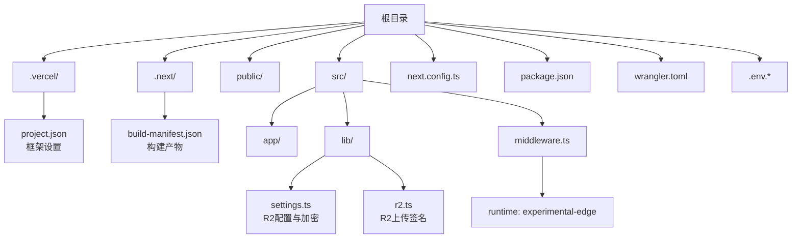
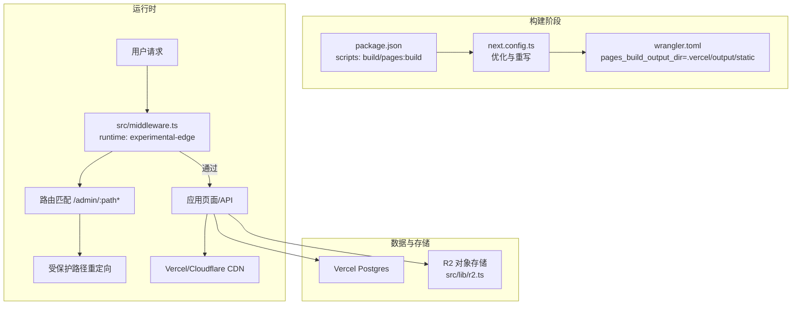
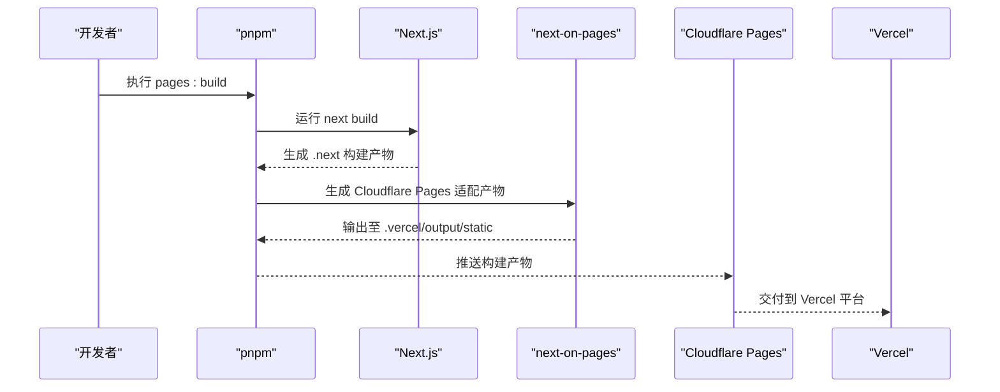
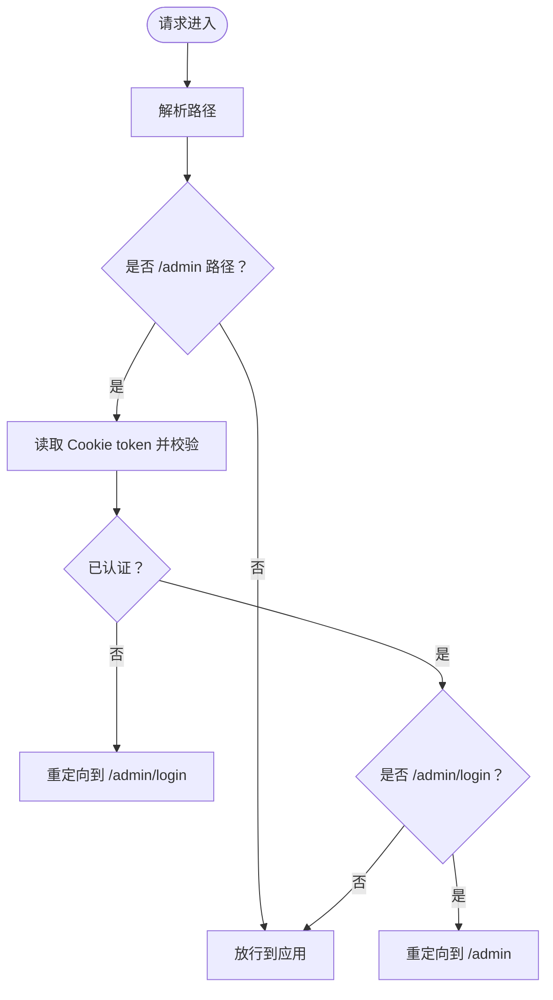
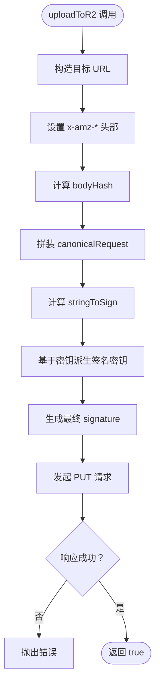
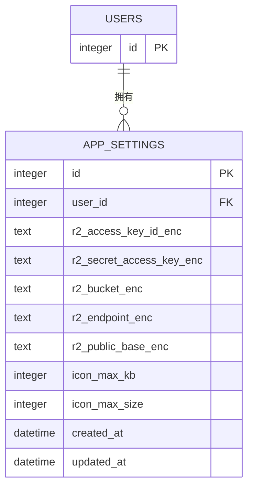
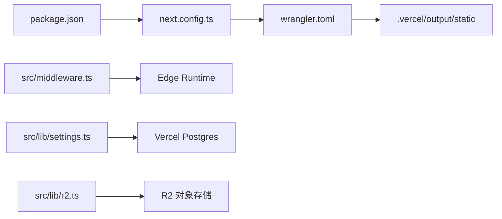

# Vercel部署配置

<cite>
**本文档引用的文件**
- [.vercel/project.json](file://.vercel/project.json)
- [next.config.ts](file://next.config.ts)
- [package.json](file://package.json)
- [.env.example](file://.env.example)
- [.env.local](file://.env.local)
- [wrangler.toml](file://wrangler.toml)
- [src/middleware.ts](file://src/middleware.ts)
- [src/lib/settings.ts](file://src/lib/settings.ts)
- [src/lib/r2.ts](file://src/lib/r2.ts)
- [src/app/layout.tsx](file://src/app/layout.tsx)
- [src/app/globals.css](file://src/app/globals.css)
- [tsconfig.json](file://tsconfig.json)
- [tailwind.config.js](file://tailwind.config.js)
</cite>

## 目录
1. [简介](#简介)
2. [项目结构](#项目结构)
3. [核心组件](#核心组件)
4. [架构概览](#架构概览)
5. [详细组件分析](#详细组件分析)
6. [依赖关系分析](#依赖关系分析)
7. [性能考虑](#性能考虑)
8. [故障排查指南](#故障排查指南)
9. [结论](#结论)
10. [附录](#附录)

## 简介
本文件面向使用 Vercel 平台部署 Next.js 应用的工程团队，系统化梳理项目在 Vercel 上的部署配置与优化策略。内容涵盖：
- 项目设置与构建配置（framework、静态资源处理、重写规则）
- 环境变量管理（开发与生产环境差异、安全密钥）
- 部署流程（本地构建、Cloudflare Pages/Workers 集成）
- 边缘计算优化（Edge Runtime、中间件、R2 存储签名）
- 域名与 SSL、CDN 缓存策略
- 部署前准备、部署命令与 CI/CD 集成建议
- 部署后监控与性能优化建议

## 项目结构
该仓库采用 Next.js App Router 结构，配合 Cloudflare Workers/Cloudflare Pages 构建产物输出到 .vercel/output/static 目录，实现与 Vercel 的无缝对接。

图表来源
- [next.config.ts](file://next.config.ts#L1-L41)
- [package.json](file://package.json#L1-L50)
- [wrangler.toml](file://wrangler.toml#L1-L14)
- [src/middleware.ts](file://src/middleware.ts#L1-L43)
- [src/lib/settings.ts](file://src/lib/settings.ts#L1-L149)
- [src/lib/r2.ts](file://src/lib/r2.ts#L1-L103)

章节来源
- [next.config.ts](file://next.config.ts#L1-L41)
- [package.json](file://package.json#L1-L50)
- [wrangler.toml](file://wrangler.toml#L1-L14)

## 核心组件
- 项目设置与框架识别：通过 .vercel/project.json 指定 framework 为 nextjs，确保 Vercel 正确识别构建链路。
- 构建配置：next.config.ts 启用 React Compiler、禁用生产环境 Source Maps、禁用图片优化、启用包导入优化、配置 webpack 别名以避免打包 Node.js 专有模块。
- 重写规则：将 /icons/:path* 重写到 /api/icons/:path*，便于 API 路由处理图标请求。
- 中间件与运行时：src/middleware.ts 设置 runtime 为 experimental-edge，保护 /admin 路径并进行登录状态校验。
- R2 存储与签名：src/lib/r2.ts 提供 AWS Signature V4 的极简实现，支持在 Edge Runtime 中直接上传对象存储。
- 环境变量：.env.example 提供示例键值，.env.local 包含本地数据库连接串与密钥；生产环境需在 Vercel 控制台或 CI 中注入。

章节来源
- [.vercel/project.json](file://.vercel/project.json#L1-L1)
- [next.config.ts](file://next.config.ts#L1-L41)
- [src/middleware.ts](file://src/middleware.ts#L1-L43)
- [src/lib/r2.ts](file://src/lib/r2.ts#L1-L103)
- [.env.example](file://.env.example#L1-L29)
- [.env.local](file://.env.local#L1-L8)

## 架构概览
下图展示应用在 Vercel 上的部署与运行时架构，包括构建阶段、边缘执行与静态资源分发。

图表来源
- [package.json](file://package.json#L5-L11)
- [next.config.ts](file://next.config.ts#L31-L38)
- [wrangler.toml](file://wrangler.toml#L4-L4)
- [src/middleware.ts](file://src/middleware.ts#L5-L42)
- [src/lib/r2.ts](file://src/lib/r2.ts#L23-L102)

## 详细组件分析

### 项目设置与构建配置
- framework 指定：.vercel/project.json 将 framework 设为 nextjs，确保 Vercel 识别并使用 Next.js 构建器。
- 生产优化：
  - 禁用生产环境浏览器 Source Maps，降低产物体积。
  - images.unoptimized: true，禁用图片优化，移除 sharp 依赖，减少打包体积与潜在兼容性问题。
  - optimizePackageImports: 针对 lucide-react、date-fns、@headlessui/react、framer-motion 进行按需导入优化。
- 边缘兼容：
  - webpack.resolve.alias 与 turbopack.resolveAlias 将 better-sqlite3、sharp、cheerio 映射为 false 或空模块，避免被 Edge Worker 打包。
- 重写规则：将 /icons/:path* 重写到 /api/icons/:path*，统一图标处理入口。

章节来源
- [.vercel/project.json](file://.vercel/project.json#L1-L1)
- [next.config.ts](file://next.config.ts#L3-L38)

### 部署脚本与构建流程
- 本地开发：dev、start、lint 脚本用于本地调试与质量检查。
- 构建与导出：build 生成 .next 构建产物；pages:build 调用 next-on-pages 并清理临时文件，最终输出至 .vercel/output/static，供 Vercel/Cloudflare Pages 使用。
- 产物目录：wrangler.toml 指定 pages_build_output_dir 为 .vercel/output/static，确保构建产物正确归档。

图表来源
- [package.json](file://package.json#L5-L11)
- [wrangler.toml](file://wrangler.toml#L4-L4)

章节来源
- [package.json](file://package.json#L5-L11)
- [wrangler.toml](file://wrangler.toml#L1-L14)

### 中间件与边缘运行时
- runtime: experimental-edge：使中间件在 Edge Runtime 中执行，提升冷启动与延迟表现。
- 路由保护：
  - /admin 路径受保护，未认证访问将重定向至 /admin/login。
  - 已登录用户访问 /admin/login 将重定向至 /admin。
- 匹配器：仅对 /admin/:path* 应用中间件逻辑，减少不必要的拦截开销。

图表来源
- [src/middleware.ts](file://src/middleware.ts#L7-L34)

章节来源
- [src/middleware.ts](file://src/middleware.ts#L1-L43)

### R2 对象存储与签名
- AWS Signature V4 实现：在 Edge Runtime 中无需 SDK 即可完成 R2 PUT 请求签名。
- 关键步骤：计算 bodyHash、构造 canonicalRequest、生成 stringToSign，并基于密钥派生最终 signature。
- 错误处理：非 2xx 响应抛出错误，便于上层捕获与提示。

图表来源
- [src/lib/r2.ts](file://src/lib/r2.ts#L23-L102)

章节来源
- [src/lib/r2.ts](file://src/lib/r2.ts#L1-L103)

### R2 配置与加密存储
- 加密工具：使用 Web Crypto API 的 AES-GCM 对称加密，密钥通过 SHA-256 从环境变量派生。
- 表结构：app_settings 表存储用户级 R2 配置，字段包含 accessKeyId、secretAccessKey、bucket、endpoint、publicBase 及尺寸限制。
- CRUD：提供 getR2Config 与 upsertR2Config，分别用于查询与更新加密存储的 R2 配置。

图表来源
- [src/lib/settings.ts](file://src/lib/settings.ts#L68-L84)

章节来源
- [src/lib/settings.ts](file://src/lib/settings.ts#L1-L149)

### 环境变量管理
- 示例与本地：.env.example 提供完整键名清单（Postgres、JWT、R2、加密密钥等）；.env.local 包含本地数据库连接串与密钥。
- 生产注入：在 Vercel 控制台或 CI 中注入对应环境变量，确保生产环境安全与可用。
- 安全建议：避免将敏感信息提交到版本控制；使用 Vercel 的机密变量功能。

章节来源
- [.env.example](file://.env.example#L1-L29)
- [.env.local](file://.env.local#L1-L8)

### 样式与字体配置
- 全局样式：src/app/globals.css 使用 CSS 变量强制深色主题，并通过 @theme inline 注入 Tailwind 变量。
- 字体加载：src/app/layout.tsx 引入 Inter 与 Ma Shan Zheng 字体，设置站点图标与元数据。

章节来源
- [src/app/globals.css](file://src/app/globals.css#L1-L30)
- [src/app/layout.tsx](file://src/app/layout.tsx#L1-L40)

### TypeScript 与 Tailwind 配置
- TypeScript：tsconfig.json 使用 bundler 解析器，启用严格模式与增量编译，路径别名 @/* 指向 src。
- Tailwind：tailwind.config.js 启用 class 形式的暗色模式，扫描范围覆盖 app、components、pages。

章节来源
- [tsconfig.json](file://tsconfig.json#L1-L35)
- [tailwind.config.js](file://tailwind.config.js#L1-L14)

## 依赖关系分析
- 构建链路：package.json 的 scripts 依赖 next.config.ts 的优化配置；wrangler.toml 的 pages_build_output_dir 决定最终产物位置。
- 运行时链路：src/middleware.ts 在 Edge Runtime 中执行，受 next.config.ts 的 images 与 webpack 配置影响；R2 功能依赖 Web Crypto API。
- 数据链路：src/lib/settings.ts 通过数据库连接执行 SQL；R2 上传通过 fetch 发起请求。

图表来源
- [package.json](file://package.json#L5-L11)
- [next.config.ts](file://next.config.ts#L21-L30)
- [wrangler.toml](file://wrangler.toml#L4-L4)
- [src/middleware.ts](file://src/middleware.ts#L5-L5)
- [src/lib/settings.ts](file://src/lib/settings.ts#L1-L149)
- [src/lib/r2.ts](file://src/lib/r2.ts#L23-L102)

章节来源
- [package.json](file://package.json#L1-L50)
- [next.config.ts](file://next.config.ts#L1-L41)
- [wrangler.toml](file://wrangler.toml#L1-L14)
- [src/middleware.ts](file://src/middleware.ts#L1-L43)
- [src/lib/settings.ts](file://src/lib/settings.ts#L1-L149)
- [src/lib/r2.ts](file://src/lib/r2.ts#L1-L103)

## 性能考虑
- 构建体积优化
  - 禁用生产环境 Source Maps 与图片优化，减少产物体积与打包时间。
  - 通过 optimizePackageImports 与 webpack 别名排除 Node.js 专有模块，避免 Edge Worker 打包失败。
- 边缘运行时
  - 将中间件设置为 experimental-edge，缩短首字节时间；仅对 /admin 路径应用匹配器，降低拦截成本。
- 存储与网络
  - R2 上传采用签名直传，减少服务器中转；合理设置图标最大大小与 KB 限制，平衡质量与带宽。
- 样式与字体
  - 使用 CSS 变量与 @theme inline，避免运行时样式抖动；字体按需加载，减少阻塞。

## 故障排查指南
- 构建失败
  - 检查 next.config.ts 的 images 与 webpack 配置，确认 Node.js 专有模块已被排除。
  - 确认 wrangler.toml 的 pages_build_output_dir 与 package.json 的 pages:build 脚本一致。
- 中间件异常
  - 确认 runtime 为 experimental-edge；检查 /admin 路径的匹配器与重定向逻辑。
- R2 上传失败
  - 核对 accessKeyId、secretAccessKey、endpoint、bucket 是否正确；关注签名生成与 fetch 响应状态。
- 环境变量缺失
  - 在 Vercel 控制台或 CI 中补齐 .env.example 中的键值；确保 SETTINGS_ENCRYPTION_KEY 或 JWT_SECRET 等关键密钥存在。

章节来源
- [next.config.ts](file://next.config.ts#L21-L30)
- [wrangler.toml](file://wrangler.toml#L4-L4)
- [src/middleware.ts](file://src/middleware.ts#L5-L42)
- [src/lib/r2.ts](file://src/lib/r2.ts#L87-L102)
- [.env.example](file://.env.example#L1-L29)

## 结论
本项目通过合理的 Next.js 配置、Edge Runtime 中间件与 R2 直传签名，实现了在 Vercel/Cloudflare Pages 上的高效部署与运行。建议在生产环境中完善环境变量管理、监控指标采集与缓存策略，持续优化构建体积与边缘执行性能。

## 附录

### 部署前准备清单
- 本地环境
  - 安装 pnpm 并安装依赖
  - 准备 .env.local 或 .env.production，填充数据库与 R2 相关密钥
- Vercel 控制台
  - 新建项目并关联 Git 仓库
  - 设置环境变量（POSTGRES_URL、JWT_SECRET、R2_* 等）
  - 配置构建命令为 pages:build，输出目录为 .vercel/output/static
- Cloudflare 集成
  - 确认 wrangler.toml 的 pages_build_output_dir 与 Vercel 输出一致
  - 验证 D1 与 R2 绑定配置

### 部署命令
- 本地构建与导出：执行 pages:build，生成 .vercel/output/static
- 推送到 Vercel：通过 Git 推送或使用 Vercel CLI

章节来源
- [package.json](file://package.json#L5-L11)
- [wrangler.toml](file://wrangler.toml#L4-L4)

### CI/CD 集成建议
- 触发条件：主分支推送触发构建与部署
- 步骤建议：
  - 安装依赖（pnpm install）
  - 运行 Lint 与测试（如存在）
  - 执行 pages:build 生成静态产物
  - 将 .vercel/output/static 推送到 Vercel/Cloudflare Pages
- 安全：将敏感环境变量存储在 CI 密钥库中，避免明文注入

### 域名、SSL 与 CDN 缓存
- 域名与 SSL：在 Vercel 控制台绑定自定义域名并启用自动 SSL 证书
- CDN 缓存：利用 Vercel/Cloudflare 的全球 CDN 分发静态资源；对于动态内容，结合边缘缓存与合适的缓存头策略

### 部署后监控与优化
- 监控指标：关注构建时间、边缘执行延迟、R2 上传成功率与错误率
- 优化建议：定期审查构建体积、调整图片与字体加载策略、评估中间件匹配器范围与缓存策略