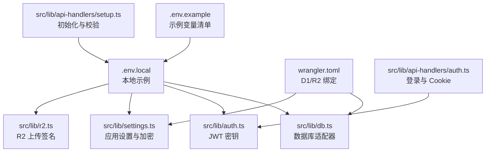
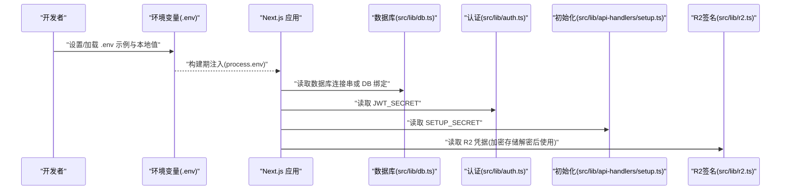
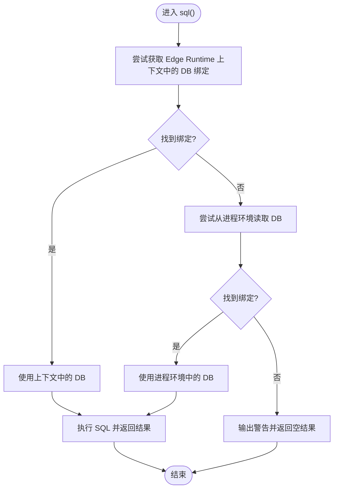
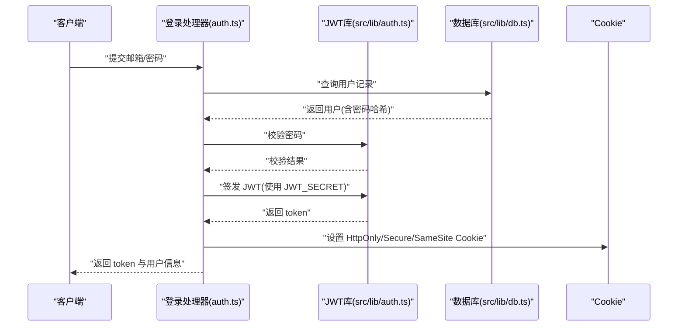
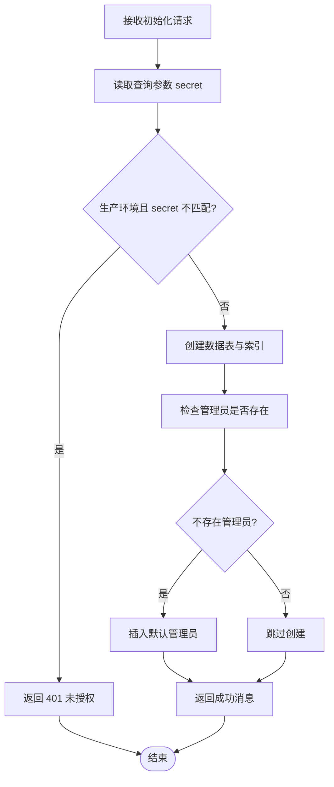
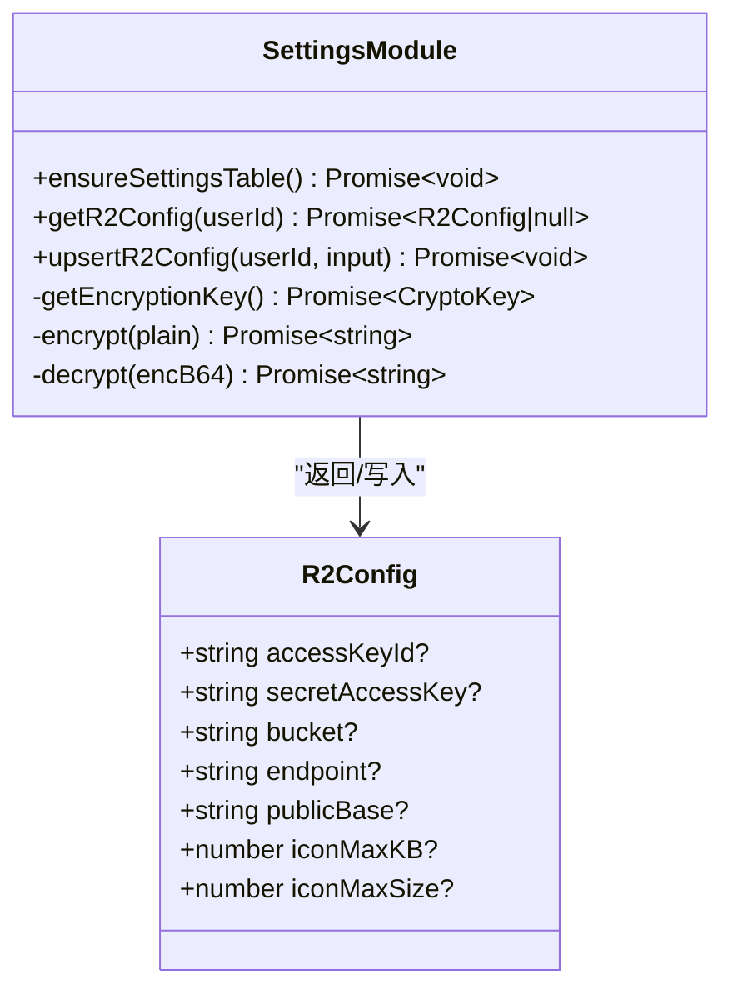
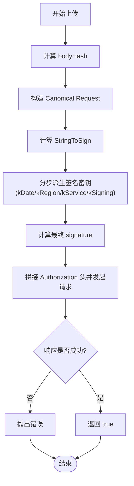
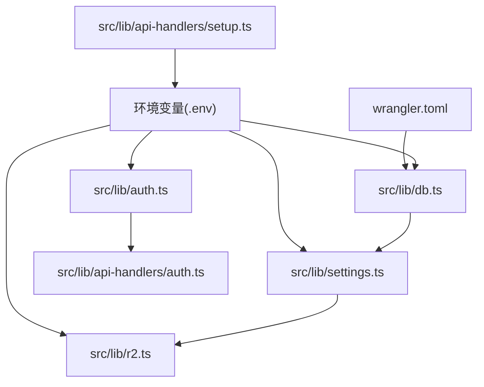

# 环境变量配置

<cite>
**本文档引用的文件**
- [.env.example](file://.env.example)
- [.env.local](file://.env.local)
- [package.json](file://package.json)
- [wrangler.toml](file://wrangler.toml)
- [src/lib/db.ts](file://src/lib/db.ts)
- [src/lib/settings.ts](file://src/lib/settings.ts)
- [src/lib/r2.ts](file://src/lib/r2.ts)
- [src/lib/auth.ts](file://src/lib/auth.ts)
- [src/lib/api-handlers/auth.ts](file://src/lib/api-handlers/auth.ts)
- [src/lib/api-handlers/setup.ts](file://src/lib/api-handlers/setup.ts)
- [next.config.ts](file://next.config.ts)
</cite>

## 目录
1. [简介](#简介)
2. [项目结构](#项目结构)
3. [核心组件](#核心组件)
4. [架构总览](#架构总览)
5. [详细组件分析](#详细组件分析)
6. [依赖关系分析](#依赖关系分析)
7. [性能考虑](#性能考虑)
8. [故障排查指南](#故障排查指南)
9. [结论](#结论)
10. [附录](#附录)

## 简介
本文件系统性梳理项目所需的环境变量配置与管理方法，覆盖以下方面：
- .env.example 文件中各配置项的含义与用途
- 不同环境（开发、测试、生产）的配置模板与最佳实践
- 敏感信息的安全存储与管理策略
- 环境变量的验证方法、错误处理与调试技巧
- 环境变量变更的迁移指南与版本管理建议

## 项目结构
本项目采用 Next.js + Cloudflare Pages/Workers 技术栈，结合 .env 文件与 Wrangler 配置实现环境变量注入与运行时绑定。关键位置如下：
- .env.example：示例环境变量清单
- .env.local：本地开发示例（已包含数据库连接串与安全密钥）
- wrangler.toml：Cloudflare Pages/Workers 绑定（D1、R2）
- src/lib/db.ts：数据库访问适配器，优先使用 Edge Runtime 绑定，其次回退到进程环境
- src/lib/settings.ts：应用设置与 R2 凭据的加密存储与读取
- src/lib/r2.ts：R2 上传签名实现（基于 Web Crypto API）
- src/lib/auth.ts：JWT 密钥来源
- src/lib/api-handlers/auth.ts：登录流程与安全 Cookie 设置
- src/lib/api-handlers/setup.ts：初始化脚本与 SETUP_SECRET 校验
- next.config.ts：构建期配置（与环境变量无直接耦合）

图表来源
- [.env.example](file://.env.example#L1-L29)
- [.env.local](file://.env.local#L1-L8)
- [wrangler.toml](file://wrangler.toml#L1-L14)
- [src/lib/db.ts](file://src/lib/db.ts#L1-L69)
- [src/lib/auth.ts](file://src/lib/auth.ts#L1-L23)
- [src/lib/settings.ts](file://src/lib/settings.ts#L1-L149)
- [src/lib/r2.ts](file://src/lib/r2.ts#L1-L103)
- [src/lib/api-handlers/auth.ts](file://src/lib/api-handlers/auth.ts#L1-L141)
- [src/lib/api-handlers/setup.ts](file://src/lib/api-handlers/setup.ts#L1-L132)

章节来源
- [package.json](file://package.json#L1-L50)
- [wrangler.toml](file://wrangler.toml#L1-L14)
- [next.config.ts](file://next.config.ts#L1-L41)

## 核心组件
本节聚焦环境变量在各模块中的使用方式与注意事项。

- 数据库（Vercel/Cloudflare）
  - POSTGRES_URL / POSTGRES_PRISMA_URL / POSTGRES_URL_NON_POOLING：数据库连接串（池化/非池化），用于 Prisma 或原生 SQL 访问
  - POSTGRES_USER / POSTGRES_HOST / POSTGRES_PASSWORD / POSTGRES_DATABASE：数据库用户、主机、密码与库名（如需显式指定）
  - DB 绑定（D1）：通过 wrangler.toml 的 D1 绑定注入，运行时由 src/lib/db.ts 优先读取 Edge Runtime 上下文中的 DB 绑定
- 认证与安全
  - JWT_SECRET：JWT 签名密钥，必须强随机且保密
  - ADMIN_EMAIL / ADMIN_PASSWORD：默认管理员账户（仅用于初始化）
  - SETUP_SECRET：初始化接口的访问保护密钥
- 存储（Cloudflare R2）
  - R2_ACCOUNT_ID / R2_ACCESS_KEY_ID / R2_SECRET_ACCESS_KEY：R2 凭据
  - R2_BUCKET_NAME：存储桶名称
  - R2_PUBLIC_BASE_URL：公共访问基础 URL（可选）
- 应用设置加密
  - SETTINGS_ENCRYPTION_KEY：应用设置（如 R2 凭据）的对称加密密钥（Web Crypto API 要求 32 字节）

章节来源
- [.env.example](file://.env.example#L1-L29)
- [.env.local](file://.env.local#L1-L8)
- [src/lib/db.ts](file://src/lib/db.ts#L1-L69)
- [src/lib/settings.ts](file://src/lib/settings.ts#L1-L149)
- [src/lib/r2.ts](file://src/lib/r2.ts#L1-L103)
- [src/lib/auth.ts](file://src/lib/auth.ts#L1-L23)
- [src/lib/api-handlers/auth.ts](file://src/lib/api-handlers/auth.ts#L1-L141)
- [src/lib/api-handlers/setup.ts](file://src/lib/api-handlers/setup.ts#L1-L132)

## 架构总览
环境变量在系统中的流转路径如下：

图表来源
- [.env.example](file://.env.example#L1-L29)
- [.env.local](file://.env.local#L1-L8)
- [src/lib/db.ts](file://src/lib/db.ts#L1-L69)
- [src/lib/auth.ts](file://src/lib/auth.ts#L1-L23)
- [src/lib/api-handlers/setup.ts](file://src/lib/api-handlers/setup.ts#L1-L132)
- [src/lib/r2.ts](file://src/lib/r2.ts#L1-L103)

## 详细组件分析

### 数据库适配器（src/lib/db.ts）
- 运行时优先从 Edge Runtime 获取 DB 绑定；若不可用则尝试从进程环境读取（兼容旧场景）
- 在本地开发时，推荐使用 wrangler pages dev 提供的 D1 绑定，避免本地 SQLite 回退逻辑
- 若未找到绑定，会输出警告提示确保使用正确的启动方式

图表来源
- [src/lib/db.ts](file://src/lib/db.ts#L1-L69)

章节来源
- [src/lib/db.ts](file://src/lib/db.ts#L1-L69)
- [wrangler.toml](file://wrangler.toml#L6-L9)

### 认证与 Cookie（src/lib/auth.ts 与 src/lib/api-handlers/auth.ts）
- JWT_SECRET 来源于进程环境变量，若缺失则使用默认密钥（生产环境应强制提供）
- 登录成功后写入 HttpOnly、Secure（生产）、SameSite=Strict 的 Cookie，并设置有效期
- 登录接口包含速率限制与错误处理

图表来源
- [src/lib/api-handlers/auth.ts](file://src/lib/api-handlers/auth.ts#L48-L129)
- [src/lib/auth.ts](file://src/lib/auth.ts#L1-L23)
- [src/lib/db.ts](file://src/lib/db.ts#L1-L69)

章节来源
- [src/lib/auth.ts](file://src/lib/auth.ts#L1-L23)
- [src/lib/api-handlers/auth.ts](file://src/lib/api-handlers/auth.ts#L1-L141)

### 初始化与保护（src/lib/api-handlers/setup.ts）
- 通过查询参数携带 SETUP_SECRET 进行访问控制（生产环境启用）
- 创建用户、分类、链接、应用设置等表并建立索引
- 默认创建管理员账户（密码需后续修改）

图表来源
- [src/lib/api-handlers/setup.ts](file://src/lib/api-handlers/setup.ts#L1-L132)

章节来源
- [src/lib/api-handlers/setup.ts](file://src/lib/api-handlers/setup.ts#L1-L132)

### 应用设置与 R2 凭据加密（src/lib/settings.ts）
- 应用设置表 app_settings 存储用户级配置（如 R2 凭据）
- 使用 Web Crypto API 对敏感字段进行 AES-GCM 加密存储
- 读取时解密并返回 R2Config 结构，便于上传组件使用

图表来源
- [src/lib/settings.ts](file://src/lib/settings.ts#L1-L149)

章节来源
- [src/lib/settings.ts](file://src/lib/settings.ts#L1-L149)

### R2 上传签名（src/lib/r2.ts）
- 基于 Web Crypto API 实现 AWS Signature V4 的简化版本
- 从 R2Config 解密得到的凭据与用户输入的上传参数共同生成 Authorization 头
- 支持自定义 endpoint（例如 R2 Public Base URL）

图表来源
- [src/lib/r2.ts](file://src/lib/r2.ts#L1-L103)

章节来源
- [src/lib/r2.ts](file://src/lib/r2.ts#L1-L103)

## 依赖关系分析
- 运行时绑定依赖：wrangler.toml 中的 D1 与 R2 绑定为 Edge Runtime 提供 DB 与存储能力
- 进程环境依赖：.env.local/.env.example 提供数据库连接串、JWT 密钥、R2 凭据与加密密钥
- 模块间耦合：
  - db.ts 与 wrangler.toml 绑定强耦合（Edge Runtime）
  - settings.ts 依赖 Web Crypto API 与数据库（用于加密存储）
  - r2.ts 依赖 settings.ts 解密后的 R2 凭据
  - auth.ts 与 api-handlers/auth.ts 依赖 JWT_SECRET

图表来源
- [wrangler.toml](file://wrangler.toml#L1-L14)
- [.env.example](file://.env.example#L1-L29)
- [.env.local](file://.env.local#L1-L8)
- [src/lib/db.ts](file://src/lib/db.ts#L1-L69)
- [src/lib/auth.ts](file://src/lib/auth.ts#L1-L23)
- [src/lib/settings.ts](file://src/lib/settings.ts#L1-L149)
- [src/lib/r2.ts](file://src/lib/r2.ts#L1-L103)
- [src/lib/api-handlers/auth.ts](file://src/lib/api-handlers/auth.ts#L1-L141)
- [src/lib/api-handlers/setup.ts](file://src/lib/api-handlers/setup.ts#L1-L132)

章节来源
- [wrangler.toml](file://wrangler.toml#L1-L14)
- [.env.example](file://.env.example#L1-L29)
- [.env.local](file://.env.local#L1-L8)
- [src/lib/db.ts](file://src/lib/db.ts#L1-L69)
- [src/lib/auth.ts](file://src/lib/auth.ts#L1-L23)
- [src/lib/settings.ts](file://src/lib/settings.ts#L1-L149)
- [src/lib/r2.ts](file://src/lib/r2.ts#L1-L103)
- [src/lib/api-handlers/auth.ts](file://src/lib/api-handlers/auth.ts#L1-L141)
- [src/lib/api-handlers/setup.ts](file://src/lib/api-handlers/setup.ts#L1-L132)

## 性能考虑
- 数据库连接串
  - 生产环境建议使用池化连接串（POSTGRES_PRISMA_URL），以提升并发与稳定性
  - 非池化连接串（POSTGRES_URL_NON_POOLING）适用于一次性任务或特殊场景
- R2 上传
  - 使用 Web Crypto API 进行签名，避免引入额外 SDK 依赖，降低包体与冷启动时间
  - 合理设置图标大小上限（icon_max_kb/icon_max_size），避免超大对象导致网络与存储压力
- 认证
  - JWT 过期时间建议保持短期（如 24 小时），结合刷新机制与速率限制降低风险

## 故障排查指南
- 数据库无法连接
  - 确认 Edge Runtime 是否正确绑定 DB；本地开发请使用 wrangler pages dev
  - 检查 .env.local 中的数据库连接串是否完整且可连通
- JWT 登录失败
  - 检查 JWT_SECRET 是否设置；生产环境缺失将触发服务端配置错误
  - 查看登录接口返回状态码与日志，确认速率限制与凭据有效性
- 初始化失败
  - 确认 SETUP_SECRET 与查询参数一致；生产环境未通过校验将返回 401
  - 检查数据库权限与表创建权限
- R2 上传失败
  - 核对 R2 凭据是否正确；确认 bucket 名称与 endpoint
  - 检查上传内容类型与大小限制
- 加密存储异常
  - 确认 SETTINGS_ENCRYPTION_KEY 长度与格式符合要求；检查数据库中 app_settings 表结构

章节来源
- [src/lib/db.ts](file://src/lib/db.ts#L1-L69)
- [src/lib/api-handlers/auth.ts](file://src/lib/api-handlers/auth.ts#L67-L73)
- [src/lib/api-handlers/setup.ts](file://src/lib/api-handlers/setup.ts#L11-L14)
- [src/lib/settings.ts](file://src/lib/settings.ts#L1-L149)
- [src/lib/r2.ts](file://src/lib/r2.ts#L1-L103)

## 结论
本项目通过 .env 示例与本地示例文件明确各类环境变量的作用域与取值来源，结合 wrangler.toml 的运行时绑定与 Web Crypto API 的加密能力，实现了安全、可维护的配置体系。建议在不同环境中严格区分变量来源与访问控制，配合完善的验证与监控机制，确保系统稳定与安全。

## 附录

### A. 环境变量清单与含义
- 数据库（Vercel/Cloudflare）
  - POSTGRES_URL：池化数据库连接串
  - POSTGRES_PRISMA_URL：Prisma 推荐连接串
  - POSTGRES_URL_NON_POOLING：非池化连接串
  - POSTGRES_USER / POSTGRES_HOST / POSTGRES_PASSWORD / POSTGRES_DATABASE：数据库凭据（按需）
- 认证与安全
  - JWT_SECRET：JWT 签名密钥（必须强随机）
  - ADMIN_EMAIL / ADMIN_PASSWORD：默认管理员账户（初始化后务必修改）
  - SETUP_SECRET：初始化接口访问保护密钥
- 存储（Cloudflare R2）
  - R2_ACCOUNT_ID / R2_ACCESS_KEY_ID / R2_SECRET_ACCESS_KEY：R2 凭据
  - R2_BUCKET_NAME：存储桶名称
  - R2_PUBLIC_BASE_URL：公共访问基础 URL
- 应用设置加密
  - SETTINGS_ENCRYPTION_KEY：应用设置加密密钥（Web Crypto API 要求 32 字节）

章节来源
- [.env.example](file://.env.example#L1-L29)
- [.env.local](file://.env.local#L1-L8)

### B. 不同环境配置模板与最佳实践
- 开发环境
  - 使用 .env.local 注入数据库连接串与密钥
  - 可使用非池化连接串进行快速验证
  - JWT_SECRET 与 SETUP_SECRET 使用临时值，部署前替换
- 测试环境
  - 使用独立数据库实例与 R2 存储桶
  - JWT_SECRET 与 SETUP_SECRET 必须与生产隔离
  - 初始化接口通过查询参数携带 SETUP_SECRET
- 生产环境
  - 所有敏感变量通过平台（如 Vercel、Cloudflare）的密钥管理注入
  - 禁止将任何敏感信息提交到版本库
  - 登录接口仅在生产环境启用 Secure Cookie

章节来源
- [src/lib/api-handlers/auth.ts](file://src/lib/api-handlers/auth.ts#L106-L112)
- [src/lib/api-handlers/setup.ts](file://src/lib/api-handlers/setup.ts#L11-L14)
- [wrangler.toml](file://wrangler.toml#L1-L14)

### C. 敏感信息的安全存储与管理策略
- 使用 Web Crypto API 对应用设置中的敏感字段进行 AES-GCM 加密存储
- SETTINGS_ENCRYPTION_KEY 作为派生密钥的基础，建议长度足够且定期轮换
- 避免在日志中打印任何敏感信息
- 通过平台密钥管理服务集中管理与轮换密钥

章节来源
- [src/lib/settings.ts](file://src/lib/settings.ts#L14-L66)

### D. 环境变量验证方法、错误处理与调试技巧
- 验证方法
  - 登录接口在生产环境检查 JWT_SECRET 是否存在
  - 初始化接口在生产环境校验 SETUP_SECRET
  - 数据库适配器在找不到绑定时输出警告
- 错误处理
  - 登录失败返回 401，内部错误返回 500
  - 初始化失败返回 500 并输出错误日志
- 调试技巧
  - 使用浏览器开发者工具查看 Cookie 设置
  - 在登录流程中添加日志输出辅助定位问题
  - 检查 Edge Runtime 日志与平台提供的可观测性工具

章节来源
- [src/lib/api-handlers/auth.ts](file://src/lib/api-handlers/auth.ts#L67-L73)
- [src/lib/api-handlers/auth.ts](file://src/lib/api-handlers/auth.ts#L122-L128)
- [src/lib/api-handlers/setup.ts](file://src/lib/api-handlers/setup.ts#L123-L129)
- [src/lib/db.ts](file://src/lib/db.ts#L64-L67)

### E. 环境变量变更的迁移指南与版本管理建议
- 变更流程
  - 新增变量：先在 .env.example 中补充注释说明，再在平台密钥管理中新增
  - 修改变量：先在平台密钥管理中更新，再在 .env.local 中同步，最后滚动重启
  - 删除变量：先在代码中移除使用点，再在平台密钥管理中删除
- 版本管理
  - 将 .env.example 与 .env.local 分离：示例文件纳入版本库，本地文件忽略提交
  - 使用平台密钥管理替代明文 .env 文件
  - 对敏感变量进行最小权限与轮换策略

章节来源
- [.env.example](file://.env.example#L1-L29)
- [.env.local](file://.env.local#L1-L8)
- [wrangler.toml](file://wrangler.toml#L1-L14)