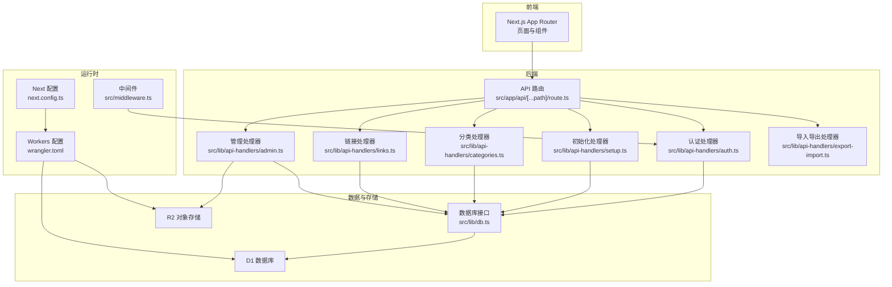
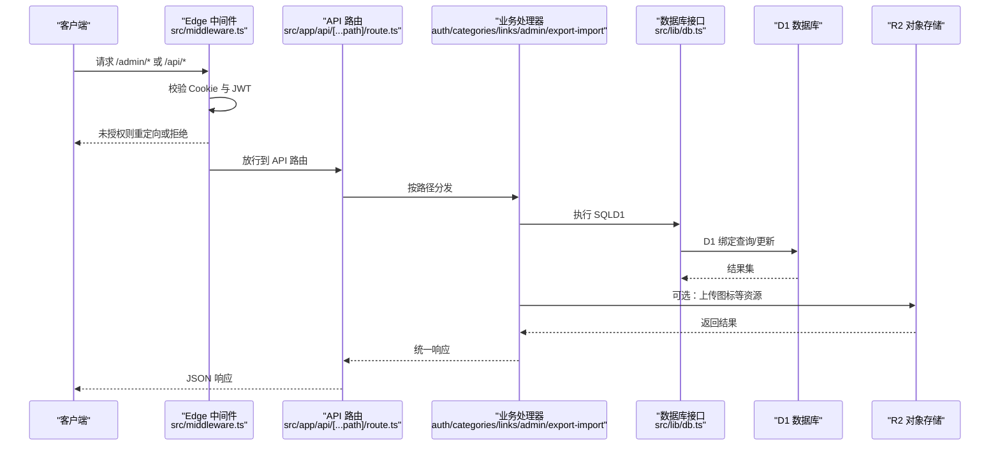
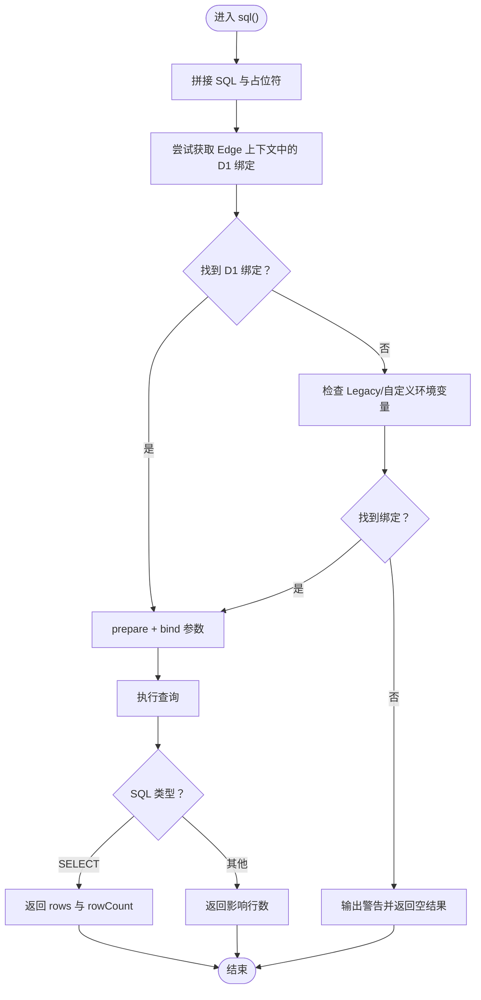
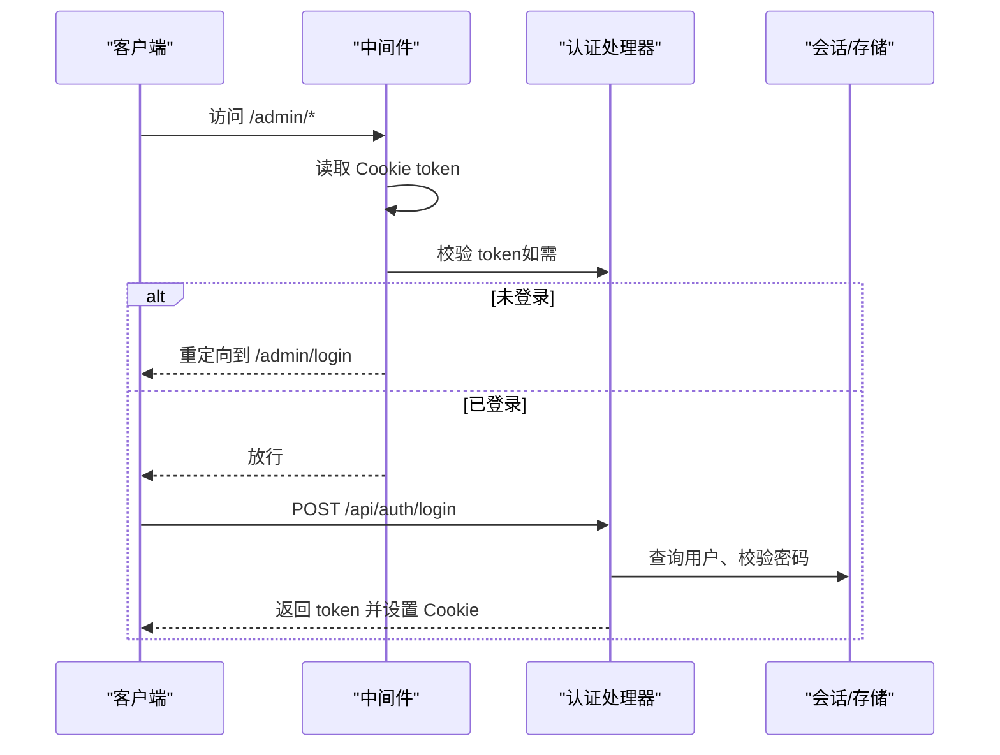
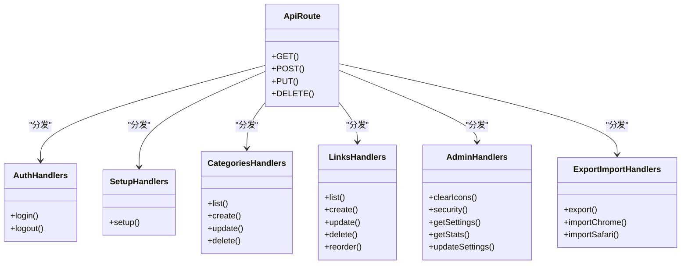
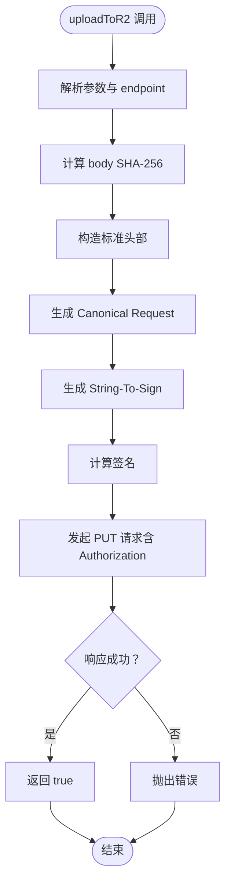
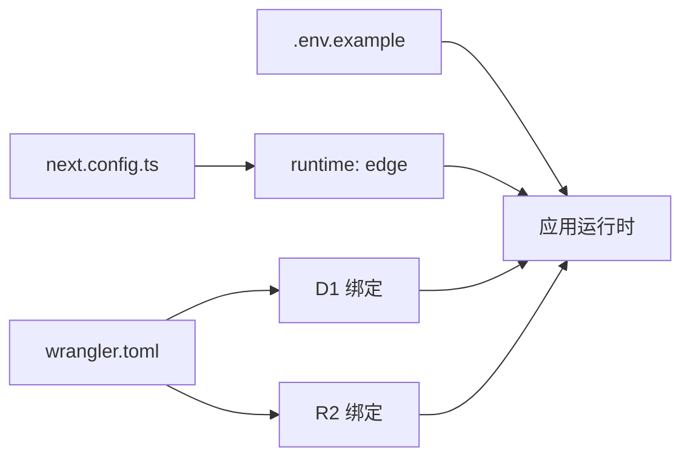

# 生产环境部署

<cite>
**本文引用的文件**
- [package.json](file://package.json)
- [next.config.ts](file://next.config.ts)
- [wrangler.toml](file://wrangler.toml)
- [.env.example](file://.env.example)
- [README.md](file://README.md)
- [src/lib/db.ts](file://src/lib/db.ts)
- [src/middleware.ts](file://src/middleware.ts)
- [src/lib/auth.ts](file://src/lib/auth.ts)
- [src/lib/r2.ts](file://src/lib/r2.ts)
- [src/app/api/[...path]/route.ts](file://src/app/api/[...path]/route.ts)
- [src/lib/api-handlers/auth.ts](file://src/lib/api-handlers/auth.ts)
- [src/lib/api-handlers/setup.ts](file://src/lib/api-handlers/setup.ts)
- [src/lib/api-handlers/categories.ts](file://src/lib/api-handlers/categories.ts)
- [src/lib/api-handlers/links.ts](file://src/lib/api-handlers/links.ts)
- [src/lib/api-handlers/admin.ts](file://src/lib/api-handlers/admin.ts)
- [src/lib/api-handlers/export-import.ts](file://src/lib/api-handlers/export-import.ts)
</cite>

## 目录
1. [简介](#简介)
2. [项目结构](#项目结构)
3. [核心组件](#核心组件)
4. [架构总览](#架构总览)
5. [详细组件分析](#详细组件分析)
6. [依赖关系分析](#依赖关系分析)
7. [性能考虑](#性能考虑)
8. [故障排查指南](#故障排查指南)
9. [结论](#结论)
10. [附录](#附录)

## 简介
本文件面向生产环境部署，基于仓库现有配置与实现，提供从代码准备、环境配置、数据库初始化、索引创建与性能优化，到监控、日志与告警、上线验证、回滚与应急处理、以及性能基准与容量规划的完整流程与最佳实践。系统采用 Next.js App Router、Edge Runtime（Cloudflare Workers）、D1 数据库与 R2 对象存储，并通过中间件与 JWT 实现管理员访问控制。

## 项目结构
- 前端：Next.js App Router（页面与组件位于 src/app）
- 后端：API 路由集中于 src/app/api/[...path]/route.ts，按功能拆分至各处理器目录 src/lib/api-handlers/*
- 数据层：统一 SQL 接口封装 src/lib/db.ts，兼容 D1 与本地回退
- 认证与会话：JWT 签发与校验 src/lib/auth.ts，中间件鉴权 src/middleware.ts
- 存储：R2 上传实现 src/lib/r2.ts
- 部署：Cloudflare Pages + Workers（wrangler.toml），Next 配置 next.config.ts

图表来源
- [src/app/api/[...path]/route.ts](file://src/app/api/[...path]/route.ts#L1-L147)
- [src/lib/api-handlers/auth.ts](file://src/lib/api-handlers/auth.ts#L1-L141)
- [src/lib/api-handlers/setup.ts](file://src/lib/api-handlers/setup.ts#L1-L132)
- [src/lib/api-handlers/categories.ts](file://src/lib/api-handlers/categories.ts#L1-L199)
- [src/lib/api-handlers/links.ts](file://src/lib/api-handlers/links.ts#L1-L270)
- [src/lib/api-handlers/admin.ts](file://src/lib/api-handlers/admin.ts#L1-L159)
- [src/lib/api-handlers/export-import.ts](file://src/lib/api-handlers/export-import.ts#L1-L334)
- [src/lib/db.ts](file://src/lib/db.ts#L1-L69)
- [src/middleware.ts](file://src/middleware.ts#L1-L43)
- [next.config.ts](file://next.config.ts#L1-L41)
- [wrangler.toml](file://wrangler.toml#L1-L14)

章节来源
- [package.json](file://package.json#L1-L50)
- [next.config.ts](file://next.config.ts#L1-L41)
- [wrangler.toml](file://wrangler.toml#L1-L14)
- [README.md](file://README.md#L1-L76)

## 核心组件
- 数据库接口与 D1 兼容层：统一 SQL 查询入口，优先使用 Edge Runtime 的 D1 绑定，降级提示缺失绑定
- 中间件与认证：Edge Runtime 中间件保护 /admin 路由，JWT 校验与 Cookie 设置
- API 路由聚合：集中处理 GET/POST/PUT/DELETE，按路径分发至各处理器
- 初始化与索引：首次部署自动建表与索引，确保查询性能
- 导入导出：支持 JSON/HTML 导出；Chrome 导入；Safari 导入在 Edge Runtime 下受限
- 存储：R2 上传签名实现，支持图标等资源对象存储

章节来源
- [src/lib/db.ts](file://src/lib/db.ts#L1-L69)
- [src/middleware.ts](file://src/middleware.ts#L1-L43)
- [src/lib/auth.ts](file://src/lib/auth.ts#L1-L23)
- [src/app/api/[...path]/route.ts](file://src/app/api/[...path]/route.ts#L1-L147)
- [src/lib/api-handlers/setup.ts](file://src/lib/api-handlers/setup.ts#L1-L132)
- [src/lib/api-handlers/export-import.ts](file://src/lib/api-handlers/export-import.ts#L1-L334)
- [src/lib/r2.ts](file://src/lib/r2.ts#L1-L103)

## 架构总览
系统运行于 Cloudflare Pages/Workers 的 Edge Runtime，前端静态化，后端 API 在边缘执行，数据库为 D1，对象存储为 R2。中间件在请求进入时进行鉴权，API 路由根据路径分发到对应处理器，处理器通过统一数据库接口访问 D1，并在需要时调用 R2。

图表来源
- [src/middleware.ts](file://src/middleware.ts#L1-L43)
- [src/app/api/[...path]/route.ts](file://src/app/api/[...path]/route.ts#L1-L147)
- [src/lib/api-handlers/auth.ts](file://src/lib/api-handlers/auth.ts#L1-L141)
- [src/lib/api-handlers/categories.ts](file://src/lib/api-handlers/categories.ts#L1-L199)
- [src/lib/api-handlers/links.ts](file://src/lib/api-handlers/links.ts#L1-L270)
- [src/lib/api-handlers/admin.ts](file://src/lib/api-handlers/admin.ts#L1-L159)
- [src/lib/api-handlers/export-import.ts](file://src/lib/api-handlers/export-import.ts#L1-L334)
- [src/lib/db.ts](file://src/lib/db.ts#L1-L69)

## 详细组件分析

### 数据库接口与 D1 兼容层
- 设计要点
  - 统一模板字符串 SQL 接口，自动识别 SELECT/非 SELECT 并返回不同结构
  - 优先从 Edge Runtime 上下文获取 D1 绑定，否则回退提示
  - 严格区分 Edge Runtime 与本地开发差异，避免打包 Node.js 专有模块
- 性能与稳定性
  - 使用 RETURNING 与索引覆盖查询，减少往返
  - 错误捕获与日志输出，便于定位问题
- 部署注意事项
  - 确保在部署环境中配置了 D1 绑定（wrangler.toml）

图表来源
- [src/lib/db.ts](file://src/lib/db.ts#L12-L68)

章节来源
- [src/lib/db.ts](file://src/lib/db.ts#L1-L69)
- [next.config.ts](file://next.config.ts#L21-L30)

### 中间件与认证
- 中间件保护
  - 仅对 /admin 路径生效，跳过 /admin/login
  - 从 Cookie 读取 token，校验失败则重定向登录
- 认证处理器
  - 登录：参数校验、速率限制、用户查询、密码校验、签发 JWT、设置 HttpOnly Cookie
  - 登出：删除 token Cookie
- 安全建议
  - 生产环境务必设置安全的 JWT_SECRET
  - Cookie 属性：secure、sameSite、httpOnly、maxAge

图表来源
- [src/middleware.ts](file://src/middleware.ts#L7-L35)
- [src/lib/api-handlers/auth.ts](file://src/lib/api-handlers/auth.ts#L49-L129)
- [src/lib/auth.ts](file://src/lib/auth.ts#L1-L23)

章节来源
- [src/middleware.ts](file://src/middleware.ts#L1-L43)
- [src/lib/api-handlers/auth.ts](file://src/lib/api-handlers/auth.ts#L1-L141)
- [src/lib/auth.ts](file://src/lib/auth.ts#L1-L23)

### API 路由与处理器
- 路由聚合
  - GET/POST/PUT/DELETE 按路径分发到 auth、setup、categories、links、admin、export-import
- 处理器职责
  - setup：建表与索引、默认管理员创建
  - categories/links：增删改查、排序、幂等处理、缓存失效
  - admin：安全变更、统计、R2 配置
  - export-import：JSON/HTML 导出；Chrome 导入；Safari 导入在 Edge Runtime 下受限
- 边缘特性
  - 全部路由标记为 edge runtime，充分利用边缘计算能力

图表来源
- [src/app/api/[...path]/route.ts](file://src/app/api/[...path]/route.ts#L1-L147)
- [src/lib/api-handlers/auth.ts](file://src/lib/api-handlers/auth.ts#L1-L141)
- [src/lib/api-handlers/setup.ts](file://src/lib/api-handlers/setup.ts#L1-L132)
- [src/lib/api-handlers/categories.ts](file://src/lib/api-handlers/categories.ts#L1-L199)
- [src/lib/api-handlers/links.ts](file://src/lib/api-handlers/links.ts#L1-L270)
- [src/lib/api-handlers/admin.ts](file://src/lib/api-handlers/admin.ts#L1-L159)
- [src/lib/api-handlers/export-import.ts](file://src/lib/api-handlers/export-import.ts#L1-L334)

章节来源
- [src/app/api/[...path]/route.ts](file://src/app/api/[...path]/route.ts#L1-L147)
- [src/lib/api-handlers/setup.ts](file://src/lib/api-handlers/setup.ts#L1-L132)
- [src/lib/api-handlers/categories.ts](file://src/lib/api-handlers/categories.ts#L1-L199)
- [src/lib/api-handlers/links.ts](file://src/lib/api-handlers/links.ts#L1-L270)
- [src/lib/api-handlers/admin.ts](file://src/lib/api-handlers/admin.ts#L1-L159)
- [src/lib/api-handlers/export-import.ts](file://src/lib/api-handlers/export-import.ts#L1-L334)

### R2 对象存储上传
- 实现方式
  - 自行实现 AWS Signature V4（极简版），在 Edge Runtime 中无需 SDK
  - 计算 canonical request、string-to-sign、签名头并发起 PUT 请求
- 使用场景
  - 图标上传等资源对象存储
- 注意事项
  - 确保 R2 凭据与桶名正确配置（wrangler.toml 与环境变量）

图表来源
- [src/lib/r2.ts](file://src/lib/r2.ts#L23-L102)

章节来源
- [src/lib/r2.ts](file://src/lib/r2.ts#L1-L103)
- [wrangler.toml](file://wrangler.toml#L11-L14)

## 依赖关系分析
- 运行时与打包
  - Next 配置启用 React Compiler、禁用生产 Source Maps、优化依赖导入、屏蔽 Node.js 专有模块别名
  - API 路由与中间件均声明为 edge runtime
- 部署配置
  - wrangler.toml 声明 D1 与 R2 绑定，Pages 输出目录指向 .vercel/output/static
- 环境变量
  - .env.example 提供数据库、JWT、R2、应用加密等关键变量示例

图表来源
- [next.config.ts](file://next.config.ts#L1-L41)
- [wrangler.toml](file://wrangler.toml#L1-L14)
- [.env.example](file://.env.example#L1-L29)

章节来源
- [next.config.ts](file://next.config.ts#L1-L41)
- [wrangler.toml](file://wrangler.toml#L1-L14)
- [.env.example](file://.env.example#L1-L29)

## 性能考虑
- 边缘执行
  - API 与中间件均为 edge runtime，降低延迟与带宽消耗
- 数据库优化
  - 初始化阶段已创建多处索引（用户邮箱、分类 user_id/parent_id、链接 category_id/user_id/sort_order 等）
  - 查询使用参数化与 LIMIT/OFFSET 分页，避免全表扫描
- 前端优化
  - 禁用图片优化、优化依赖导入、禁用生产 Source Maps，减小产物体积
- 缓存与再验证
  - 写操作后主动 revalidatePath，保证边缘缓存一致性

章节来源
- [src/lib/api-handlers/setup.ts](file://src/lib/api-handlers/setup.ts#L28-L104)
- [src/lib/api-handlers/links.ts](file://src/lib/api-handlers/links.ts#L8-L23)
- [src/lib/api-handlers/categories.ts](file://src/lib/api-handlers/categories.ts#L8-L15)
- [next.config.ts](file://next.config.ts#L8-L20)

## 故障排查指南
- 登录失败
  - 检查 JWT_SECRET 是否设置；确认速率限制是否触发；核对用户是否存在与密码正确
- 未授权访问 /admin
  - 确认 Cookie token 是否存在且有效；中间件是否正确拦截
- 数据库连接异常
  - 确认 D1 绑定是否在部署环境中配置；Edge 上下文是否可用
- R2 上传失败
  - 校验 R2 凭据、桶名与 endpoint；查看签名与头部构造是否正确
- 导入 Safari 失败
  - 当前在 Edge Runtime 下 Safari 导入被禁用，使用 Chrome 导入或后续版本

章节来源
- [src/lib/api-handlers/auth.ts](file://src/lib/api-handlers/auth.ts#L14-L41)
- [src/middleware.ts](file://src/middleware.ts#L7-L35)
- [src/lib/db.ts](file://src/lib/db.ts#L27-L40)
- [src/lib/r2.ts](file://src/lib/r2.ts#L87-L102)
- [src/lib/api-handlers/export-import.ts](file://src/lib/api-handlers/export-import.ts#L323-L331)

## 结论
本项目已在 Cloudflare Pages/Workers 上完成边缘化部署准备，具备完善的认证、数据库初始化、索引与性能优化、对象存储上传能力。生产部署的关键在于正确配置环境变量与 D1/R2 绑定、强化安全参数（Cookie 与密钥）、建立监控与日志体系，并遵循上线验证与回滚流程。

## 附录

### 生产环境部署流程
- 代码准备
  - 确认依赖安装与构建脚本可用（构建产物用于 Pages 部署）
- 环境配置
  - 在部署平台设置环境变量：数据库连接串、JWT_SECRET、SETUP_SECRET、R2 凭据与桶名、应用加密密钥
  - 确认 wrangler.toml 中 D1 与 R2 绑定名称与 ID 正确
- 数据库初始化
  - 访问初始化接口，自动创建表与索引，并创建默认管理员账户
- 上线与验证
  - 部署后访问 /api/setup?secret=... 完成初始化
  - 登录 /admin 验证中间件与认证流程
  - 测试分类/链接 CRUD、导入导出、图标上传
- 监控与日志
  - 利用平台日志与指标监控（CPU/内存/请求时延/错误率）
  - 关键指标：登录成功率、查询耗时、R2 上传成功率
- 回滚与应急
  - 回滚：切换到上一个稳定版本的部署
  - 应急：临时关闭敏感接口、降级功能、恢复密钥与凭据

章节来源
- [README.md](file://README.md#L55-L64)
- [src/lib/api-handlers/setup.ts](file://src/lib/api-handlers/setup.ts#L6-L131)
- [src/lib/api-handlers/auth.ts](file://src/lib/api-handlers/auth.ts#L49-L129)
- [src/lib/api-handlers/export-import.ts](file://src/lib/api-handlers/export-import.ts#L8-L106)
- [wrangler.toml](file://wrangler.toml#L6-L14)

### 服务器要求与网络配置
- 运行时
  - Edge Runtime（Cloudflare Workers），无需传统服务器
- 网络
  - 通过 Cloudflare CDN 分发，边缘就近访问
  - D1 与 R2 通过绑定访问，无需暴露公网端点
- 安全
  - Cookie 设置 secure 与 sameSite；JWT 密钥妥善保管
  - 速率限制与最小权限原则（仅管理员可写）

章节来源
- [src/lib/api-handlers/auth.ts](file://src/lib/api-handlers/auth.ts#L105-L112)
- [src/lib/auth.ts](file://src/lib/auth.ts#L1-L23)
- [next.config.ts](file://next.config.ts#L1-L41)

### 数据库初始化、索引与性能优化
- 初始化
  - 建表：users、categories、links、app_settings
  - 默认管理员：admin@example.com / admin（部署后应立即修改）
- 索引
  - 用户邮箱、分类 user_id/parent_id、链接 category_id/user_id/sort_order、复合索引等
- 查询优化
  - 使用参数化 SQL、LIMIT/OFFSET 分页、必要时使用 EXPLAIN/ANALYZE（D1 支持）
  - 写操作后 revalidatePath，保持边缘缓存一致

章节来源
- [src/lib/api-handlers/setup.ts](file://src/lib/api-handlers/setup.ts#L16-L104)
- [src/lib/api-handlers/links.ts](file://src/lib/api-handlers/links.ts#L8-L23)
- [src/lib/api-handlers/categories.ts](file://src/lib/api-handlers/categories.ts#L8-L15)

### 监控、日志与告警
- 日志
  - 在处理器中记录错误与关键事件（如登录、导入导出、R2 上传）
- 指标
  - 请求量、错误率、响应时间、数据库查询耗时、R2 上传失败数
- 告警
  - 针对错误率突增、数据库连接失败、R2 上传失败、登录失败过多设置阈值告警

章节来源
- [src/lib/api-handlers/auth.ts](file://src/lib/api-handlers/auth.ts#L122-L128)
- [src/lib/api-handlers/export-import.ts](file://src/lib/api-handlers/export-import.ts#L103-L105)
- [src/lib/r2.ts](file://src/lib/r2.ts#L96-L99)

### 部署后验证、回滚与应急
- 验证清单
  - 初始化接口可访问且成功
  - 管理员登录成功，Cookie 安全属性正确
  - 分类/链接 CRUD 正常，排序与搜索可用
  - 导入导出工作正常（Chrome）
  - 图标上传到 R2 成功
- 回滚
  - 使用平台提供的版本回滚功能
- 应急
  - 临时禁用敏感接口、更换密钥、修复凭据

章节来源
- [src/lib/api-handlers/setup.ts](file://src/lib/api-handlers/setup.ts#L6-L131)
- [src/lib/api-handlers/auth.ts](file://src/lib/api-handlers/auth.ts#L49-L129)
- [src/lib/api-handlers/export-import.ts](file://src/lib/api-handlers/export-import.ts#L108-L229)
- [src/lib/r2.ts](file://src/lib/r2.ts#L87-L102)

### 性能基准与容量规划
- 基准测试
  - 使用压测工具模拟登录、列表查询、导入导出、R2 上传等关键路径
  - 关注 P95/P99 延迟、错误率、并发连接数
- 容量规划
  - 基于峰值 QPS 与响应时间估算边缘实例数量
  - R2 存储与带宽按上传量与访问量评估
  - D1 查询复杂度与索引命中率优化

章节来源
- [src/lib/api-handlers/links.ts](file://src/lib/api-handlers/links.ts#L26-L67)
- [src/lib/api-handlers/export-import.ts](file://src/lib/api-handlers/export-import.ts#L8-L106)
- [src/lib/r2.ts](file://src/lib/r2.ts#L23-L102)