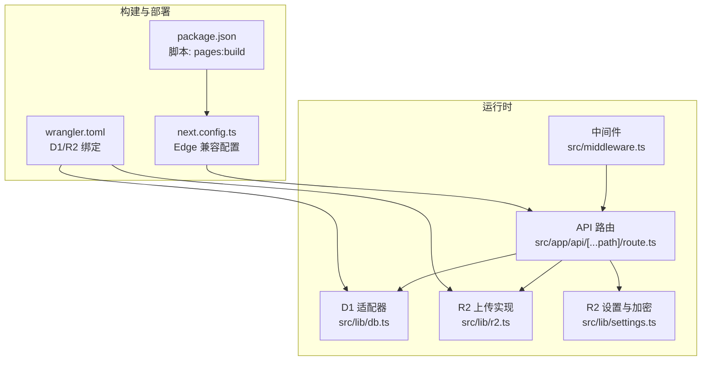
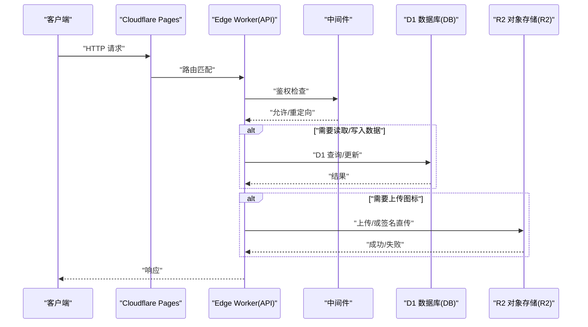
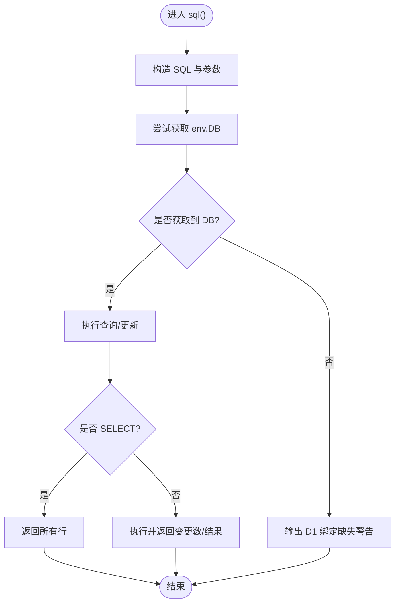
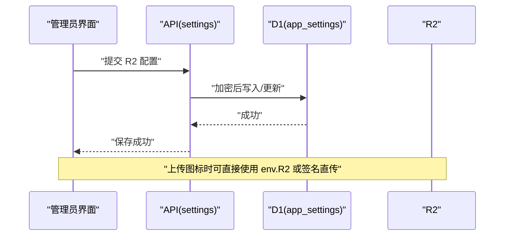
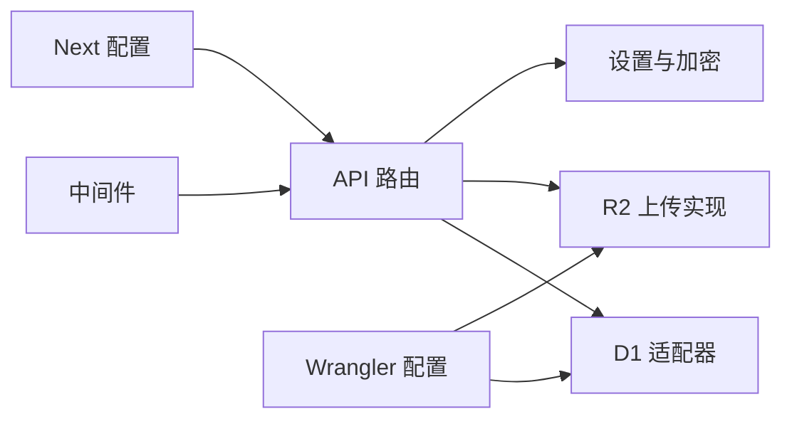

# 部署配置

<cite>
**本文引用的文件**
- [wrangler.toml](file://wrangler.toml)
- [.env.example](file://.env.example)
- [.env.local](file://.env.local)
- [package.json](file://package.json)
- [next.config.ts](file://next.config.ts)
- [src/lib/db.ts](file://src/lib/db.ts)
- [src/lib/r2.ts](file://src/lib/r2.ts)
- [src/lib/settings.ts](file://src/lib/settings.ts)
- [src/lib/auth.ts](file://src/lib/auth.ts)
- [src/middleware.ts](file://src/middleware.ts)
- [src/app/api/[...path]/route.ts](file://src/app/api/[...path]/route.ts)
- [src/app/admin/(dashboard)/icons/page.tsx](file://src/app/admin/(dashboard)/icons/page.tsx)
- [README.md](file://README.md)
</cite>

## 目录
1. [简介](#简介)
2. [项目结构](#项目结构)
3. [核心组件](#核心组件)
4. [架构总览](#架构总览)
5. [详细组件分析](#详细组件分析)
6. [依赖关系分析](#依赖关系分析)
7. [性能考虑](#性能考虑)
8. [故障排除指南](#故障排除指南)
9. [结论](#结论)
10. [附录](#附录)

## 简介
本文件面向生产环境部署与运维，系统性说明 Cloudflare Workers/Cloudflare Pages 配置、数据库连接配置、环境变量设置、多环境差异与注意事项、CI/CD 自动化策略、故障排除与性能优化建议。内容基于仓库中的实际配置文件与源码实现进行归纳总结，确保可操作与可追溯。

## 项目结构
该应用采用 Next.js App Router 架构，结合 Cloudflare Pages（通过 @cloudflare/next-on-pages）进行边缘部署，并使用 Vercel Postgres 作为数据层。关键部署相关文件与职责如下：
- 部署与绑定：wrangler.toml 定义了 Pages 构建目录、D1 数据库绑定、R2 存储桶绑定。
- 构建脚本：package.json 提供 pages:build 脚本，配合 next-on-pages 生成静态产物。
- 边缘运行时：next.config.ts 配置 Webpack 别名与重写规则，确保 Edge 兼容。
- 数据访问：src/lib/db.ts 提供 D1 适配器，支持在 Edge Runtime 中通过 getRequestContext 获取 DB 绑定。
- 对象存储：src/lib/r2.ts 提供 AWS Signature V4 签名上传实现，支持在 Edge Runtime 直接上传至 R2。
- 认证与会话：src/lib/auth.ts 使用 JWT 密钥；src/middleware.ts 在 Edge 中执行鉴权重定向。
- API 路由：src/app/api/[...path]/route.ts 将请求分发到各处理器，统一运行于 Edge。
- 设置与密钥管理：src/lib/settings.ts 对 R2 凭据进行加密存储；前端页面提供配置入口。

图表来源
- [package.json](file://package.json#L5-L11)
- [wrangler.toml](file://wrangler.toml#L1-L14)
- [next.config.ts](file://next.config.ts#L1-L41)
- [src/app/api/[...path]/route.ts](file://src/app/api/[...path]/route.ts#L1-L147)
- [src/middleware.ts](file://src/middleware.ts#L1-L43)
- [src/lib/db.ts](file://src/lib/db.ts#L1-L69)
- [src/lib/r2.ts](file://src/lib/r2.ts#L1-L103)
- [src/lib/settings.ts](file://src/lib/settings.ts#L87-L139)

章节来源
- [package.json](file://package.json#L1-L50)
- [wrangler.toml](file://wrangler.toml#L1-L14)
- [next.config.ts](file://next.config.ts#L1-L41)

## 核心组件
- Cloudflare Pages 构建与产物
  - 通过 pages:build 脚本生成 .vercel/output/static 目录，供 Pages 部署使用。
- D1 数据库绑定
  - 在 wrangler.toml 中声明 DB 绑定，运行时通过 getRequestContext().env.DB 访问。
- R2 对象存储绑定
  - 在 wrangler.toml 中声明 R2 绑定，运行时通过 env.R2 访问。
- Edge 运行时配置
  - next.config.ts 中设置 runtime 为 edge/experimental-edge，禁用 Node 专属模块别名，启用图片优化与包导入优化。
- API 与中间件
  - API 路由集中处理认证、分类、链接、导入导出、元数据抓取等；中间件对 /admin 路径进行鉴权重定向。
- 环境变量
  - .env.example 提供完整变量清单；.env.local 提供本地示例值；生产环境需在部署平台注入对应变量。

章节来源
- [package.json](file://package.json#L5-L11)
- [wrangler.toml](file://wrangler.toml#L1-L14)
- [next.config.ts](file://next.config.ts#L1-L41)
- [src/app/api/[...path]/route.ts](file://src/app/api/[...path]/route.ts#L10-L147)
- [src/middleware.ts](file://src/middleware.ts#L5-L43)
- [.env.example](file://.env.example#L1-L29)
- [.env.local](file://.env.local#L1-L8)

## 架构总览
下图展示生产部署时的请求流与数据流：浏览器请求经由 Cloudflare Pages 分发到 Edge Worker，API 路由根据路径分发到具体处理器；认证与会话通过 JWT 与中间件保障；数据访问通过 D1 绑定，对象存储通过 R2 绑定或自定义签名上传实现。

图表来源
- [src/app/api/[...path]/route.ts](file://src/app/api/[...path]/route.ts#L12-L147)
- [src/middleware.ts](file://src/middleware.ts#L7-L35)
- [src/lib/db.ts](file://src/lib/db.ts#L25-L67)
- [src/lib/r2.ts](file://src/lib/r2.ts#L23-L102)

## 详细组件分析

### Cloudflare Workers/Cloudflare Pages 配置
- 构建产物目录
  - pages_build_output_dir 指向 .vercel/output/static，确保 next-on-pages 生成的静态资源被正确部署。
- 数据库绑定
  - D1 绑定名为 DB，数据库名称与 ID 在配置中声明，运行时通过 env.DB 使用。
- 对象存储绑定
  - R2 绑定名为 R2，存储桶名称在配置中声明，运行时通过 env.R2 使用。
- 运行时兼容
  - compatibility_flags 包含 nodejs_compat，便于在 Pages 上运行依赖 Node 特性的代码。
- 最佳实践
  - 生产环境务必使用 Pages 的 D1/R2 绑定，避免在代码中硬编码凭据。
  - 如需本地开发，使用 wrangler pages dev 并确保 D1 绑定可用。

章节来源
- [wrangler.toml](file://wrangler.toml#L1-L14)

### 数据库连接配置（D1）
- 运行时获取
  - 通过 getRequestContext().env.DB 获取 D1 绑定；若不可用则输出警告信息。
- 查询封装
  - 支持 SELECT 与非 SELECT 语句，自动区分 all/run 行为；对 RETURNING 语句返回结果集。
- 本地回退
  - 本地开发回退逻辑已移除，推荐使用 wrangler pages dev。
- 最佳实践
  - 在 Edge Runtime 中避免使用 Node 专属数据库驱动；优先使用 D1。
  - 对复杂查询使用模板字符串与参数绑定，避免 SQL 注入。

图表来源
- [src/lib/db.ts](file://src/lib/db.ts#L12-L68)

章节来源
- [src/lib/db.ts](file://src/lib/db.ts#L1-L69)

### 对象存储配置（R2）
- 绑定使用
  - 在 Edge Runtime 中通过 env.R2.put 直接上传对象，适合管理员图标上传场景。
- 自定义签名上传
  - 若未使用绑定或需要更灵活的上传流程，可使用 src/lib/r2.ts 中的 uploadToR2 实现 AWS Signature V4 签名直传。
- 前端配置入口
  - 管理员界面提供 R2 凭据输入与保存，后端对敏感字段进行加密存储。
- 最佳实践
  - 仅在必要时暴露 R2 凭据；生产环境优先使用绑定直传。
  - 控制图标大小与尺寸，避免超限导致上传失败。

图表来源
- [src/lib/settings.ts](file://src/lib/settings.ts#L87-L139)
- [src/app/admin/(dashboard)/icons/page.tsx](file://src/app/admin/(dashboard)/icons/page.tsx#L1-L37)
- [src/lib/r2.ts](file://src/lib/r2.ts#L23-L102)

章节来源
- [src/lib/r2.ts](file://src/lib/r2.ts#L1-L103)
- [src/lib/settings.ts](file://src/lib/settings.ts#L87-L139)
- [src/app/admin/(dashboard)/icons/page.tsx](file://src/app/admin/(dashboard)/icons/page.tsx#L1-L37)

### 环境变量设置
- 变量清单
  - Vercel Postgres 连接串（多个变体）、JWT 密钥、管理员密码、R2 凭据、设置加密密钥等。
- 本地示例
  - .env.local 提供示例值，生产环境请替换为真实值。
- 安全建议
  - JWT_SECRET 与 SETUP_SECRET 必须足够随机且保密；R2 凭据仅在需要时注入。
  - 使用部署平台的机密变量功能，避免明文泄露。

章节来源
- [.env.example](file://.env.example#L1-L29)
- [.env.local](file://.env.local#L1-L8)

### 生产环境部署流程
- 本地构建
  - 执行 pages:build 脚本，生成 .vercel/output/static。
- 部署平台
  - 推荐使用 Vercel（README 中提供一键部署按钮），或 Cloudflare Pages（wrangler.toml 已配置）。
- 数据库与密钥
  - 在部署平台配置 Vercel Postgres 连接串与 JWT_SECRET、SETUP_SECRET 等机密变量。
- 初始化数据库
  - 访问 /api/setup?secret=your-setup-secret 创建表与默认管理员账户。
- 访问后台
  - 登录 /admin 使用默认管理员账号。

章节来源
- [README.md](file://README.md#L55-L76)
- [package.json](file://package.json#L5-L11)
- [wrangler.toml](file://wrangler.toml#L1-L14)

### CI/CD 流程与自动化部署策略
- 构建阶段
  - 使用 pages:build 生成静态产物，确保 next-on-pages 与 Edge 兼容配置生效。
- 部署阶段
  - Vercel：通过其平台自动拉取环境变量并部署；Cloudflare：通过 wrangler CLI 或 Pages 部署。
- 安全与验证
  - 在 CI 中校验环境变量完整性与格式；对关键脚本进行单元测试与集成测试。
- 回滚与灰度
  - 建议使用平台提供的蓝绿/灰度发布能力，保留上一版本以便快速回滚。

章节来源
- [package.json](file://package.json#L5-L11)
- [README.md](file://README.md#L55-L76)

## 依赖关系分析
- 组件耦合
  - API 路由集中处理业务逻辑，依赖 D1 与 R2；中间件统一执行鉴权；配置文件决定运行时绑定。
- 外部依赖
  - @cloudflare/next-on-pages 用于生成 Pages 兼容的静态产物；wrangler 提供本地开发与部署工具链。
- 潜在风险
  - Edge Runtime 限制可能导致 Node 专属模块无法使用；需通过别名与重写规避。

图表来源
- [src/app/api/[...path]/route.ts](file://src/app/api/[...path]/route.ts#L1-L147)
- [src/middleware.ts](file://src/middleware.ts#L1-L43)
- [src/lib/db.ts](file://src/lib/db.ts#L1-L69)
- [src/lib/r2.ts](file://src/lib/r2.ts#L1-L103)
- [src/lib/settings.ts](file://src/lib/settings.ts#L87-L139)
- [next.config.ts](file://next.config.ts#L1-L41)
- [wrangler.toml](file://wrangler.toml#L1-L14)

章节来源
- [src/app/api/[...path]/route.ts](file://src/app/api/[...path]/route.ts#L1-L147)
- [src/middleware.ts](file://src/middleware.ts#L1-L43)
- [src/lib/db.ts](file://src/lib/db.ts#L1-L69)
- [src/lib/r2.ts](file://src/lib/r2.ts#L1-L103)
- [src/lib/settings.ts](file://src/lib/settings.ts#L87-L139)
- [next.config.ts](file://next.config.ts#L1-L41)
- [wrangler.toml](file://wrangler.toml#L1-L14)

## 性能考虑
- Edge 运行时优化
  - 启用 images.unoptimized 与 optimizePackageImports，减少打包体积与运行时开销。
  - 通过 webpack 别名屏蔽 Node 专属模块，避免不必要的依赖被打包。
- 数据访问
  - 使用 D1 适配器统一查询，避免在 Edge 中使用非兼容驱动。
- 对象存储
  - 优先使用 env.R2 直传；控制图标最大 KB 与尺寸，减少网络与存储压力。
- 缓存与重写
  - 利用 API 层缓存热点数据；合理设置 CDN 缓存策略。

章节来源
- [next.config.ts](file://next.config.ts#L8-L30)
- [src/lib/db.ts](file://src/lib/db.ts#L1-L69)
- [src/lib/settings.ts](file://src/lib/settings.ts#L87-L139)

## 故障排除指南
- D1 绑定缺失
  - 现象：sql() 返回警告并无结果。
  - 处理：确认部署平台已配置 D1 绑定；本地使用 wrangler pages dev。
- R2 上传失败
  - 现象：上传报错或返回非 2xx。
  - 处理：检查 R2 绑定或签名参数；确认存储桶权限与 Endpoint 正确。
- JWT 验证失败
  - 现象：登录后仍被重定向到登录页。
  - 处理：确认 JWT_SECRET 一致且未泄露；检查中间件鉴权逻辑。
- Edge 运行时错误
  - 现象：引入 Node 专属模块导致构建/运行失败。
  - 处理：通过 next.config.ts 的别名与重写屏蔽相关模块。

章节来源
- [src/lib/db.ts](file://src/lib/db.ts#L25-L67)
- [src/lib/r2.ts](file://src/lib/r2.ts#L96-L102)
- [src/lib/auth.ts](file://src/lib/auth.ts#L15-L22)
- [next.config.ts](file://next.config.ts#L21-L30)
- [src/middleware.ts](file://src/middleware.ts#L7-L35)

## 结论
本部署配置文档基于仓库现有配置与源码实现，明确了 Cloudflare Pages/D1/R2 的绑定方式、Edge 运行时的兼容性要点、环境变量的安全管理、生产部署流程与 CI/CD 策略。建议在生产环境中严格遵循安全与性能最佳实践，确保稳定与可维护性。

## 附录
- 关键配置项速查
  - Pages 构建目录：pages_build_output_dir
  - D1 绑定：DB（名称、ID）
  - R2 绑定：R2（存储桶）
  - Edge 运行时：runtime = edge/experimental-edge
  - 环境变量：POSTGRES_*、JWT_SECRET、SETUP_SECRET、R2_*、SETTINGS_ENCRYPTION_KEY
- 常用命令
  - pages:build：生成静态产物
  - wrangler pages dev：本地开发与调试

章节来源
- [wrangler.toml](file://wrangler.toml#L1-L14)
- [next.config.ts](file://next.config.ts#L1-L41)
- [package.json](file://package.json#L5-L11)
- [.env.example](file://.env.example#L1-L29)