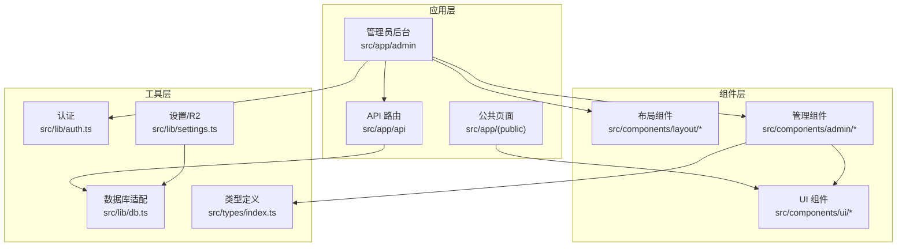
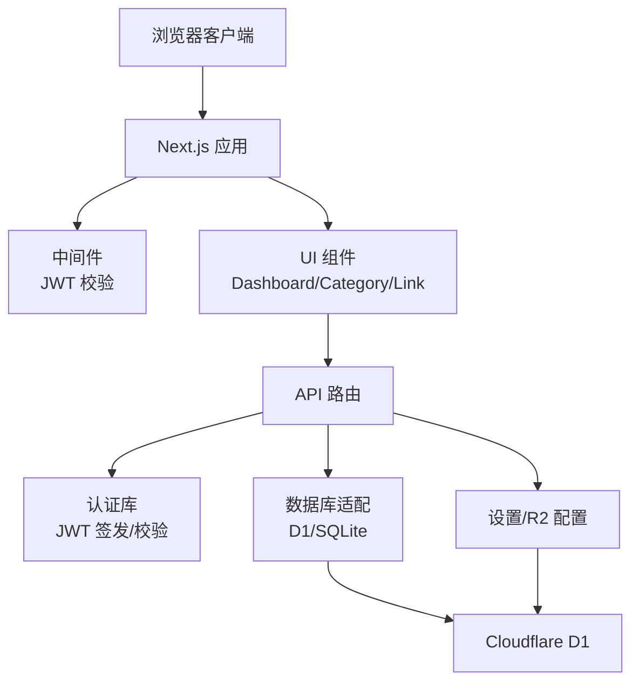
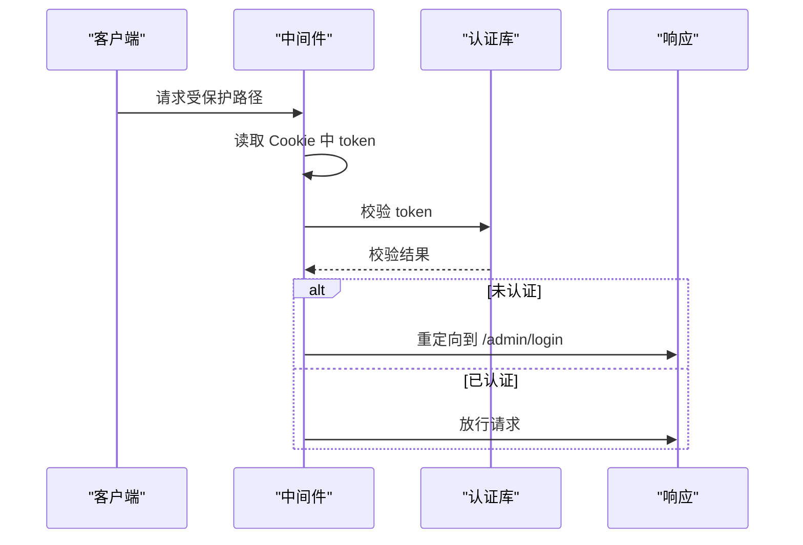
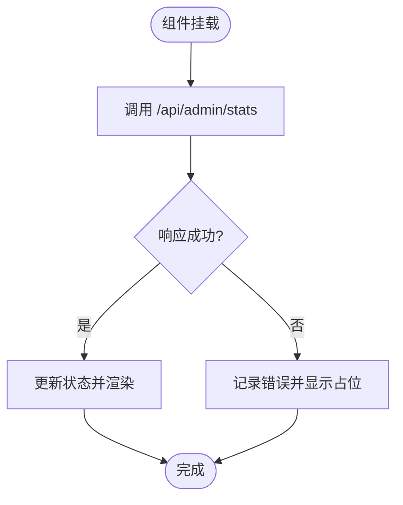
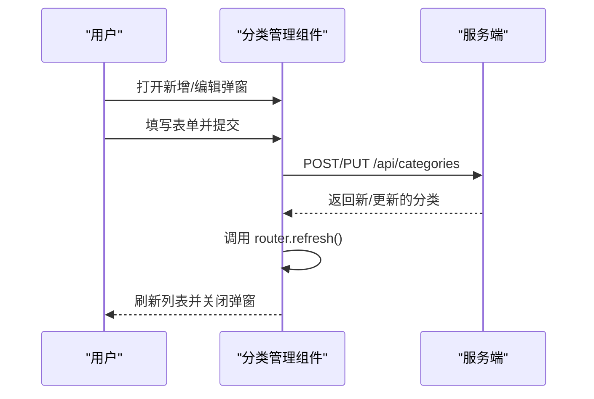
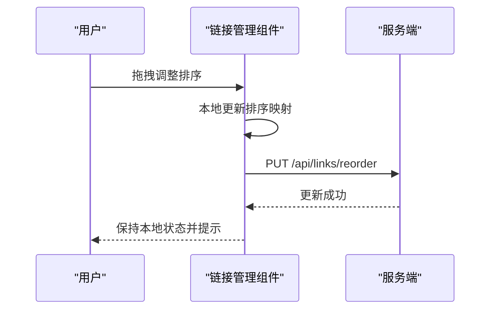
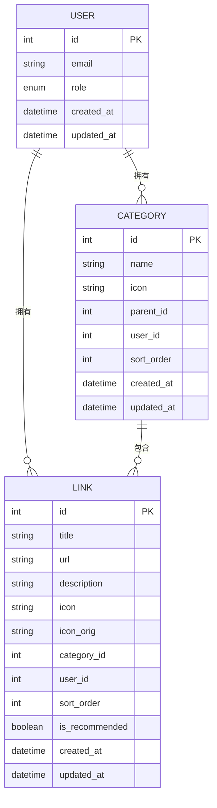
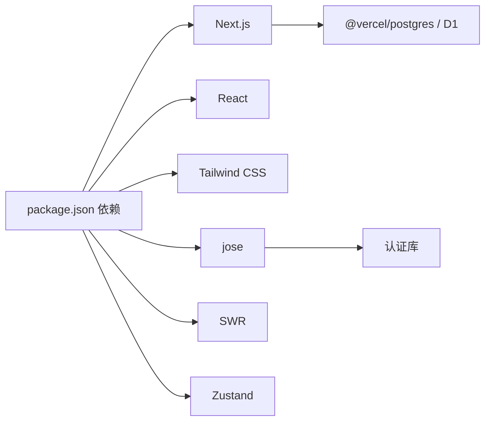

# 项目概述

<cite>
**本文档引用的文件**
- [README.md](file://README.md)
- [package.json](file://package.json)
- [src/app/layout.tsx](file://src/app/layout.tsx)
- [src/components/providers.tsx](file://src/components/providers.tsx)
- [src/middleware.ts](file://src/middleware.ts)
- [src/lib/auth.ts](file://src/lib/auth.ts)
- [src/lib/db.ts](file://src/lib/db.ts)
- [src/lib/settings.ts](file://src/lib/settings.ts)
- [src/types/index.ts](file://src/types/index.ts)
- [src/app/admin/(dashboard)/layout.tsx](file://src/app/admin/(dashboard)/layout.tsx)
- [src/components/admin/DashboardStats.tsx](file://src/components/admin/DashboardStats.tsx)
- [src/components/admin/CategoryManager.tsx](file://src/components/admin/CategoryManager.tsx)
- [src/components/admin/LinkManager.tsx](file://src/components/admin/LinkManager.tsx)
</cite>

## 目录
1. [简介](#简介)
2. [项目结构](#项目结构)
3. [核心组件](#核心组件)
4. [架构总览](#架构总览)
5. [详细组件分析](#详细组件分析)
6. [依赖关系分析](#依赖关系分析)
7. [性能考虑](#性能考虑)
8. [故障排除指南](#故障排除指南)
9. [结论](#结论)

## 简介
本导航网站管理系统是一个基于 Next.js 14 的现代化应用，采用 App Router 架构，结合 Tailwind CSS 实现响应式 UI，并通过 Vercel Postgres 与 Cloudflare Workers/D1 提供数据持久化能力。系统提供管理员仪表盘、书签导入支持、JWT 认证与中间件保护、以及面向用户的链接与分类管理功能。

- 目标用户：需要搭建个人或团队导航站点的运营者与开发者
- 核心价值：一体化的管理体验（仪表盘、链接/分类管理、导入导出）、安全登录与权限控制、可扩展的图标与设置存储
- 技术亮点：Edge Runtime 中间件、Server Components、Tailwind 主题系统、DnD 排序、R2 图标存储配置

## 项目结构
项目采用按功能分层的组织方式：
- 应用层：src/app 下划分公共页面、管理员后台与 API 路由
- 组件层：src/components 提供可复用 UI 组件与布局组件
- 工具层：src/lib 提供数据库访问、认证、设置与 R2 配置等工具
- 类型层：src/types 定义统一的数据模型与响应结构
- 样式层：src/app/globals.css 与 Tailwind 配置共同构建主题与样式体系

**图表来源**
- [src/app/layout.tsx](file://src/app/layout.tsx#L1-L40)
- [src/app/admin/(dashboard)/layout.tsx](file://src/app/admin/(dashboard)/layout.tsx#L1-L15)
- [src/components/providers.tsx](file://src/components/providers.tsx#L1-L24)
- [src/lib/db.ts](file://src/lib/db.ts#L1-L69)
- [src/lib/auth.ts](file://src/lib/auth.ts#L1-L23)
- [src/lib/settings.ts](file://src/lib/settings.ts#L1-L149)
- [src/types/index.ts](file://src/types/index.ts#L1-L53)

**章节来源**
- [README.md](file://README.md#L65-L72)
- [src/app/layout.tsx](file://src/app/layout.tsx#L1-L40)
- [src/app/admin/(dashboard)/layout.tsx](file://src/app/admin/(dashboard)/layout.tsx#L1-L15)

## 核心组件
- 管理员仪表盘：展示链接/分类数量与最近添加的链接列表，支持异步加载与主题切换
- 分类管理：支持增删改查、父子分类选择、排序权重设置与弹窗交互
- 链接管理：支持拖拽排序、分类筛选、元数据自动抓取、推荐标记与批量刷新
- 认证与中间件：基于 JWT 的登录态校验与受保护路由跳转
- 数据库适配：兼容 Cloudflare Pages D1 绑定与本地回退提示
- 设置与 R2：应用级设置表、R2 凭据加密存储与图标尺寸限制

**章节来源**
- [src/components/admin/DashboardStats.tsx](file://src/components/admin/DashboardStats.tsx#L1-L153)
- [src/components/admin/CategoryManager.tsx](file://src/components/admin/CategoryManager.tsx#L1-L262)
- [src/components/admin/LinkManager.tsx](file://src/components/admin/LinkManager.tsx#L1-L543)
- [src/middleware.ts](file://src/middleware.ts#L1-L43)
- [src/lib/auth.ts](file://src/lib/auth.ts#L1-L23)
- [src/lib/db.ts](file://src/lib/db.ts#L1-L69)
- [src/lib/settings.ts](file://src/lib/settings.ts#L1-L149)

## 架构总览
系统采用前后端一体化的 Next.js 架构，前端负责 UI 与交互，后端通过 API 路由处理业务逻辑，数据库通过 D1 提供服务。认证采用 Edge Runtime 中间件进行全局拦截，确保管理员路径的安全访问。

**图表来源**
- [src/middleware.ts](file://src/middleware.ts#L1-L43)
- [src/lib/auth.ts](file://src/lib/auth.ts#L1-L23)
- [src/lib/db.ts](file://src/lib/db.ts#L1-L69)
- [src/lib/settings.ts](file://src/lib/settings.ts#L1-L149)

## 详细组件分析

### 认证与中间件流程
管理员访问受保护路径时，中间件会读取 Cookie 中的 token 并进行校验；若未登录则重定向至登录页；已登录访问登录页则重定向至仪表盘。

**图表来源**
- [src/middleware.ts](file://src/middleware.ts#L1-L43)
- [src/lib/auth.ts](file://src/lib/auth.ts#L1-L23)

**章节来源**
- [src/middleware.ts](file://src/middleware.ts#L1-L43)
- [src/lib/auth.ts](file://src/lib/auth.ts#L1-L23)

### 仪表盘统计组件
仪表盘组件通过 API 获取统计数据并在客户端渲染卡片与最近链接列表，支持加载态与错误兜底。

**图表来源**
- [src/components/admin/DashboardStats.tsx](file://src/components/admin/DashboardStats.tsx#L1-L153)

**章节来源**
- [src/components/admin/DashboardStats.tsx](file://src/components/admin/DashboardStats.tsx#L1-L153)

### 分类管理组件
分类管理支持弹窗新增/编辑、父级选择、排序权重设置与删除确认；提交后通过 router.refresh() 触发服务端重新拉取数据，避免本地状态与服务端不一致。

**图表来源**
- [src/components/admin/CategoryManager.tsx](file://src/components/admin/CategoryManager.tsx#L1-L262)

**章节来源**
- [src/components/admin/CategoryManager.tsx](file://src/components/admin/CategoryManager.tsx#L1-L262)

### 链接管理组件
链接管理支持分类筛选、拖拽排序、元数据自动抓取、推荐标记与批量刷新；排序变更通过本地数组重排并发送请求更新服务端顺序。

**图表来源**
- [src/components/admin/LinkManager.tsx](file://src/components/admin/LinkManager.tsx#L1-L543)

**章节来源**
- [src/components/admin/LinkManager.tsx](file://src/components/admin/LinkManager.tsx#L1-L543)

### 数据模型与类型
系统通过统一的 TypeScript 接口定义用户、分类、链接与 API 响应结构，保证前后端契约一致。

**图表来源**
- [src/types/index.ts](file://src/types/index.ts#L1-L53)

**章节来源**
- [src/types/index.ts](file://src/types/index.ts#L1-L53)

## 依赖关系分析
- 前端依赖：Next.js 14、React 19、Tailwind CSS、Headless UI、Lucide React、SWR、Zustand 等
- 后端集成：@vercel/postgres（通过 D1 绑定）、jose（JWT）、cookie（Cookie 处理）
- 开发与部署：@cloudflare/next-on-pages、wrangler、Vercel

**图表来源**
- [package.json](file://package.json#L1-L50)
- [src/lib/db.ts](file://src/lib/db.ts#L1-L69)
- [src/lib/auth.ts](file://src/lib/auth.ts#L1-L23)

**章节来源**
- [package.json](file://package.json#L1-L50)

## 性能考虑
- 边缘运行时：中间件与 API 在 Edge Runtime 执行，降低延迟
- 服务器组件：减少客户端水合成本，提升首屏性能
- 本地状态与增量刷新：通过 router.refresh() 与本地状态更新，避免全量重载
- 图标与资源：R2 配置与图标尺寸限制，减少带宽与渲染压力
- 拖拽排序：仅在本地维护排序映射，批量请求更新，降低频繁网络往返

[本节为通用性能建议，无需特定文件引用]

## 故障排除指南
- 登录后仍被重定向到登录页
  - 检查 Cookie 中 token 是否存在且未过期
  - 确认中间件匹配规则与受保护路径一致
- 无法访问管理员页面
  - 确认 JWT_SECRET 环境变量正确配置
  - 检查认证库签名/校验逻辑是否抛出异常
- 数据库查询失败
  - 确认 D1 绑定在 Edge Runtime 可用
  - 检查 SQL 模板字符串与参数绑定
- R2 配置无法读取
  - 确认 SETTINGS_ENC_KEY 或 AUTH_SECRET 存在
  - 检查加密/解密流程与索引唯一性

**章节来源**
- [src/middleware.ts](file://src/middleware.ts#L1-L43)
- [src/lib/auth.ts](file://src/lib/auth.ts#L1-L23)
- [src/lib/db.ts](file://src/lib/db.ts#L1-L69)
- [src/lib/settings.ts](file://src/lib/settings.ts#L1-L149)

## 结论
本项目以现代前端工程化为目标，结合 Edge Runtime、Server Components 与 D1 数据库，提供了安全、高效且可扩展的导航站点管理方案。通过模块化的组件设计与清晰的类型定义，既满足初学者快速上手，也为有经验的开发者提供了良好的扩展空间。建议在生产环境中完善日志监控、缓存策略与备份机制，持续优化用户体验与系统稳定性。